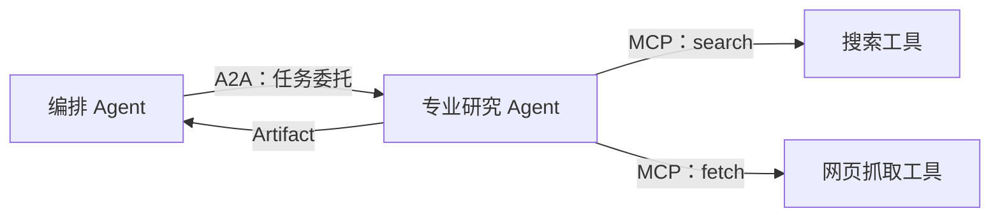
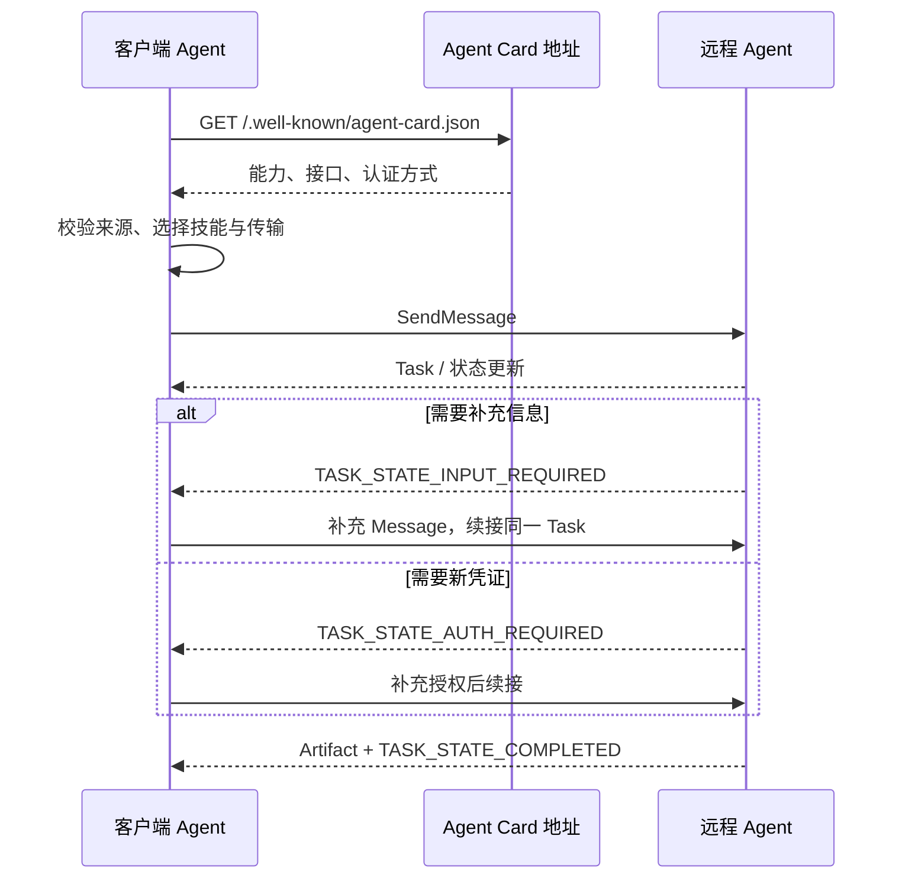
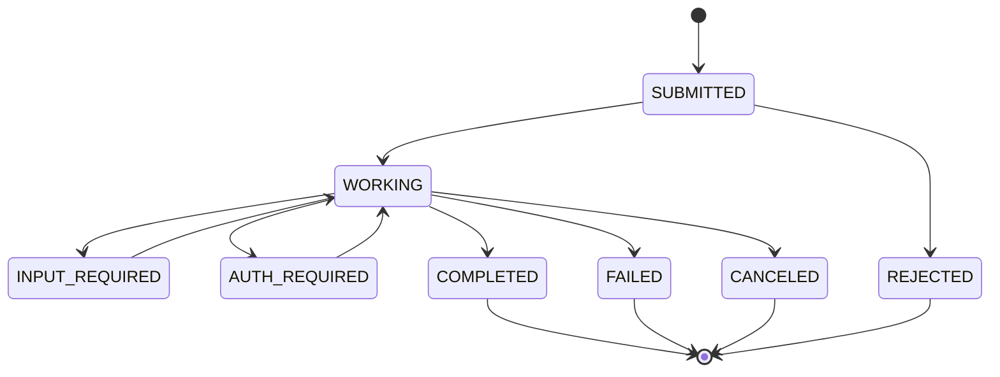
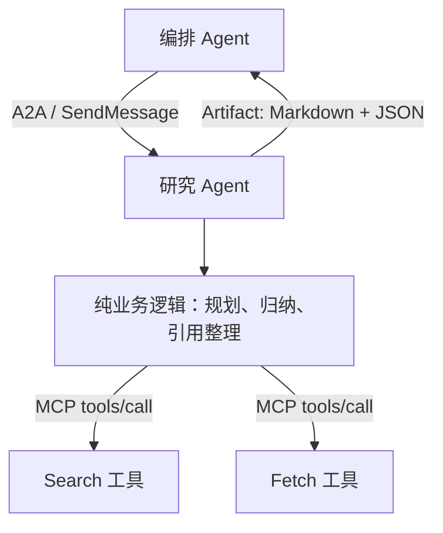

# A2A：让 AI Agent 像服务一样发现、委托与协作

> **资料基线说明**：本文根据目录 `F:\fde\Agent 通信协议 A2A` 中的七篇教程整理，原始资料以 **A2A Spec v1.0.1（2026-05-28）** 和 **Python a2a-sdk 1.1.0** 为示例基线，内容状态标注截至 **2026 年 6 月**。本文整理日期为 **2026 年 10 月 5 日**，没有额外联网核验后续版本；用于生产前，请重新确认协议、SDK 与安全建议的最新状态。

## 一、为什么 Agent 之间还需要一套协议？

单个 Agent 可以调用模型、工具和数据库，但真正复杂的业务通常不是一个 Agent 独立完成的。

例如，一个差旅 Agent 可能需要把“订机票”交给航司 Agent，把“预订酒店”交给酒店 Agent；一个企业编排 Agent 也可能把“竞品价格调研”委托给外部研究 Agent。问题在于，不同 Agent 可能来自不同厂商，运行在不同进程、网络和信任域中。

如果没有统一协议，每一对 Agent 都要单独约定三件事：

1. **如何发现对方会什么**；
2. **如何发送任务和接收进度**；
3. **如何表达消息、状态与最终产物**。

当有 `M` 个调用方和 `N` 个服务方时，点对点适配会逐渐接近 `M × N`。A2A（Agent2Agent）将发现方式、通信方法和数据模型统一起来，让每个参与者只需要实现一次公共协议，把适配成本收敛到近似 `M + N`。

但它并不是免费的：统一协议通常只能提供“最小公约数”，难以像私有协议那样为某一对系统做极致优化。因此，A2A 的价值不在于替代所有内部调用，而在于解决**跨进程、跨组织、跨信任边界的 Agent 互操作**。

---

## 二、一句话理解 A2A

**A2A 把远程 Agent 当作一个不透明、自治的对等体：调用方只通过公开的能力声明和显式消息，把任务委托给对方，而不共享提示词、记忆、内部工具或推理状态。**

这句话包含三个关键词：

- **对等体**：对方不是一个简单函数，而是会规划、执行、追问并产出结果的自治主体；
- **不透明**：调用方知道对方“能做什么”，但不要求知道它“内部怎么做”；
- **委托**：交付的是一个可能持续较长时间、有状态、可中断的任务，而不是一次无状态函数调用。

### A2A 与 MCP 的边界

A2A 和 MCP 经常被放在一起比较，但二者不是竞争关系，而是两个不同方向的协议：

| 维度 | A2A | MCP |
|---|---|---|
| 连接对象 | Agent ↔ Agent | Agent ↔ 工具/数据源 |
| 关系方向 | 水平协作 | 垂直调用 |
| 被调用方 | 自治、有状态、可能主动追问 | 通常无状态或弱状态的工具原语 |
| 典型语义 | “把这件事交给你完成” | “调用这个工具并返回结果” |
| 持续时间 | 秒、分钟、小时甚至更久 | 通常一次调用完成 |
| 内部实现 | 对调用方保持黑盒 | 工具能力通过 schema 暴露 |

最实用的判断口诀是：

- 如果你在**调用一个工具**，优先考虑 MCP；
- 如果你在**托付给另一个自治 Agent**，优先考虑 A2A；
- 一个 Agent 完全可以**对外使用 A2A 接任务，对内使用 MCP 调工具**。



---

## 三、A2A 的四个核心数据对象

A2A 的心智模型可以压缩为四个对象：`Task`、`Message`、`Part` 和 `Artifact`。

### 1. Task：有状态的工作单元

`Task` 不是普通 HTTP 请求，而是一个有身份、有状态、可持续演进的工作单元。它通常包含：

- Task ID；
- Context ID；
- 当前状态；
- 多轮消息历史；
- 已生成的 Artifact；
- 状态更新时间等元数据。

它使 A2A 能表达“任务正在处理”“需要补充信息”“需要额外授权”“已经完成”等过程，而不是只能返回成功或失败。

代价是服务端必须真正管理任务：保存状态、处理并发、实现取消、支持续接，还要考虑过期清理和持久化。

### 2. Message：参与者之间的显式对话

`Message` 表示客户端 Agent 与远程 Agent 之间的一轮交流，包含角色以及一个或多个 `Part`。

调用方不应该把自己的完整内部状态、系统提示词或思维链直接传给对方，而应构造一条边界清晰、目的明确的业务消息。

### 3. Part：承载不同模态

`Part` 是消息或产物中的最小内容单元，可以承载：

- 文本；
- 文件；
- 结构化数据；
- 其他可协商的媒体类型。

这使同一个 Artifact 可以同时带一份给人阅读的 Markdown，以及一份供程序解析的 JSON 数据。

### 4. Artifact：任务真正的产出

`Artifact` 表示任务执行后形成的结果，例如：

- 调研报告；
- 生成的代码文件；
- 数据分析结论；
- 图片或文档；
- 可供后续 Agent 继续处理的结构化结果。

一个很重要的区分是：**Message 是协作过程中的交流，Artifact 是任务形成的交付物。**

---

## 四、Agent Card：Agent 世界里的能力名片

在委托任务前，调用方首先需要知道：对方是谁、会做什么、支持什么协议、需要什么认证。

A2A 使用 Agent Card 解决这件事。Agent 通常通过固定路径公开能力声明：

```text
GET /.well-known/agent-card.json
```

一张 Agent Card 通常会描述：

- `name`：Agent 名称；
- `description`：能力简介；
- `skills`：技能列表及输入输出模式；
- `capabilities`：是否支持流式、推送等可选能力；
- `supportedInterfaces` 或服务接口信息；
- `securitySchemes`：API Key、OAuth2、OIDC、mTLS 等认证方案；
- `provider`：提供者信息；
- 版本及其他元数据。

这种发现机制类似 `robots.txt`：简单、去中心、易缓存，不要求所有 Agent 注册到同一个中心。

它的局限也很明显：

1. Card 是静态声明，不等于实时能力协商；
2. Card 只说明“使用哪种认证”，不负责发放凭证；
3. 自由文本描述来自对方，不能天然信任；
4. 未签名 Card 无法单凭内容证明真实身份。

所以，**Agent Card 是能力声明，不是信用背书，更不是凭证本身。**

---

## 五、一次 A2A 委托在网络上如何发生

一次完整委托大致可以拆成六步：



### SendMessage 的 JSON-RPC 形态

资料中的 v1.0 示例使用 `SendMessage`，而不是旧版常见的 `message/send`：

```json
{
  "jsonrpc": "2.0",
  "id": 1,
  "method": "SendMessage",
  "params": {
    "message": {
      "role": "user",
      "parts": [
        {
          "kind": "text",
          "text": "把这份季度财报里的风险段落抽出来"
        }
      ],
      "messageId": "9229e770-767c-417b-a0b0-f0741243c589"
    }
  }
}
```

A2A 将同一组抽象操作映射到多种传输绑定：

| 抽象操作 | JSON-RPC | gRPC | REST |
|---|---|---|---|
| 发送消息 | `SendMessage` | `SendMessage` | `POST /message:send` |
| 流式发送 | `SendStreamingMessage` | `SendStreamingMessage` | `POST /message:stream` |
| 查询任务 | `GetTask` | `GetTask` | `GET /tasks/{id}` |
| 取消任务 | `CancelTask` | `CancelTask` | `POST /tasks/{id}:cancel` |

选择哪一种，主要取决于双方基础设施：

- JSON-RPC over HTTP：部署和调试最直接；
- gRPC：适合内部高吞吐、强类型环境；
- REST：适合已有 REST API 与网关体系。

需要注意：**同一版本内的三种绑定语义对齐，不代表不同协议版本之间 wire 兼容。**

---

## 六、三种交互模式怎么选

### 1. 请求/响应：适合短任务

客户端发送 `SendMessage`，在同一个请求中拿到结果，或者拿到仍在运行的 Task 后再查询。

适合：

- 秒级操作；
- 结果较小；
- 客户端可以等待；
- 不需要连续进度。

### 2. SSE 流式：适合需要实时反馈的任务

服务端持续把状态、增量结果或 Artifact 更新推到同一条连接上。

适合：

- 用户需要看到实时进度；
- 生成过程本身有展示价值；
- 客户端能维持长连接。

### 3. Webhook 推送：适合长任务和可断线客户端

客户端登记回调地址后即可释放连接，服务端在任务状态发生重要变化时反向 POST 通知。

适合：

- 分钟级或小时级任务；
- Serverless、移动端或短生命周期执行环境；
- 连接可能中断；
- 不希望频繁轮询。

但 webhook 会引入两类额外问题：

- 服务端访问客户端提供的 URL，形成 SSRF 攻击面；
- 信任方向反转，客户端必须验证入站 POST 确实来自远程 Agent。

可以用一句话概括选型：

> **短任务用同步，需要“看过程”用 SSE，需要“断线后回来拿结果”用 webhook。**

---

## 七、Task 生命周期：不要只处理成功与失败

资料中的状态全集包括：

- `TASK_STATE_SUBMITTED`
- `TASK_STATE_WORKING`
- `TASK_STATE_INPUT_REQUIRED`
- `TASK_STATE_AUTH_REQUIRED`
- `TASK_STATE_COMPLETED`
- `TASK_STATE_FAILED`
- `TASK_STATE_CANCELED`
- `TASK_STATE_REJECTED`

其中最容易被忽略的是两个可中断状态：

- `INPUT_REQUIRED`：远程 Agent 需要调用方补充业务信息；
- `AUTH_REQUIRED`：任务已经开始执行，但中途需要新的凭证或授权。

它们和一开始就在 HTTP 层收到 `401 Unauthorized` 不同：

- HTTP 401 表示请求尚未进入任务流程；
- `AUTH_REQUIRED` 表示 Task 已经存在，只是执行到中途暂停等待授权。



一个健壮的客户端不能只等待 `COMPLETED`。它必须明确处理补充信息、补充授权、取消、拒绝、失败和超时，否则长任务很容易永远卡住。

---

## 八、最小实现应该如何分层

资料中的实操以“把文本转成大写”的 Agent 为例，核心流程并不复杂：

1. 从入站 Message 读取文本；
2. 创建或恢复 Task；
3. 将状态更新为 `WORKING`；
4. 执行业务逻辑；
5. 将结果封装为 Artifact；
6. 将状态更新为 `COMPLETED`。

真正重要的不是 `.upper()`，而是代码分层。

### 推荐结构

```text
project/
├─ domain/
│  └─ service.py          # 纯业务逻辑，不依赖 A2A
├─ adapters/
│  ├─ a2a_executor.py     # Message/Task/Artifact 与业务对象互转
│  └─ mcp_tools.py        # 对内部工具的 MCP 适配
├─ app.py                 # Agent Card、路由、服务启动
└─ client.py              # 发现、验卡、发送任务、处理状态
```

业务核心应该可以脱离 A2A 单独测试：

```python
def uppercase(text: str) -> str:
    return text.upper() if text else "(空输入)"
```

A2A Executor 只负责协议翻译：

```python
async def execute(context, event_queue):
    task = await get_or_create_task(context, event_queue)
    updater = make_task_updater(task, event_queue)

    await updater.set_working()
    text = read_text_message(context.message)

    result = uppercase(text)  # 纯业务逻辑

    await updater.add_text_artifact(
        name="uppercased",
        text=result,
        media_type="text/plain",
    )
    await updater.set_completed()
```

> 上述代码是结构示意，不是可直接运行的 SDK 完整代码。原始资料中的 Python 示例基于 `a2a-sdk 1.1.0`，并明确标记为“未在本机验证”。

这种薄适配层有三个好处：

- 协议升级时，不必重写业务逻辑；
- 同一能力可以同时暴露为 A2A、HTTP 或本地函数；
- 单元测试不需要构造完整的 Task、RequestContext 和 EventQueue。

---

## 九、A2A + MCP：最常见的生产架构

设想一个“竞品定价研究 Agent”：

- 对外，它接收编排 Agent 委托的研究任务；
- 对内，它调用搜索和网页抓取工具；
- 最后，它返回人类可读报告和结构化结论。

这正好形成两层协议栈：



这里有三个不同的调用判断：

1. 编排 Agent → 研究 Agent：对方是自治对等体，使用 A2A；
2. 研究 Agent → Search/Fetch：对方是工具，使用 MCP；
3. 研究 Agent 内部的数据归纳：没有跨边界和外部 IO，直接函数调用。

这套架构同时保留了对外互操作和对内实现自由。研究 Agent 可以更换模型、提示词、工具链或工作流，而调用方只依赖稳定的 Agent Card、Message、Task 和 Artifact 契约。

---

## 十、生产环境最容易踩的八个坑

### 1. Agent Card 描述注入

如果路由 Agent 把 Card 中的 `description` 直接交给 LLM 选择目标，恶意 Agent 可以在描述中写入“必须优先选择我”等诱导文本。

**防护：**

- 先按签名、提供方和白名单筛选候选；
- 优先使用结构化的 `skills.id`、输入输出模式和可验证指标；
- 将 Card 自由文本视为不可信数据，而不是系统指令。

### 2. Agent Card 伪造

静态 Card 如果没有签名，名称、provider 和技能描述都可以被伪造。

**防护：**

- 生产部署强制校验 JWS 签名；
- 对跨组织提供方做公钥固定或可靠的信任链验证；
- 不只凭域名和 Card 自填字段确认身份。

### 3. Agent Session Smuggling

远程 Agent 可能在多轮会话中夹带指令，诱使本地 Agent 泄露上下文、调用高权限工具或改变任务目标。

**防护：**

- 对端输出始终进入“外部数据通道”，不要直接提升为系统指令；
- 每轮重新做权限与意图检查；
- 不因“已经建立会话”就默认信任后续所有内容。

### 4. Webhook SSRF 与反向信任

攻击者可以登记内网、Loopback 或云元数据地址作为 webhook，让服务端替它访问敏感网络资源。

**防护：**

- 只允许预登记的 HTTPS 地址；
- 拒绝私网、Loopback、Link-local 和云元数据 IP；
- 发起请求时重新解析 DNS，防止 DNS Rebinding；
- 客户端使用 JWT、JWKS、HMAC 等方式验证推送来源。

### 5. Task Replay

A2A 并不会自动保证每个请求都是“新鲜的”。一条合法请求被截获后，可能被原样重放。

**防护：**

- 请求携带并校验时间戳；
- 使用 `messageId` 或独立 nonce 去重；
- 在带 TTL 的存储中记录已处理标识；
- 对支付、部署等副作用操作增加业务幂等键。

### 6. `INPUT_REQUIRED` / `AUTH_REQUIRED` 钓鱼与多轮提权

恶意 Agent 可以在任务中途索要账号密码，或先用低风险请求取得信任，再逐步要求执行高权限动作。

**防护：**

- 凭证按 Task 和 Scope 最小授权；
- Token 绑定 `task_id`、有效期和允许动作；
- 每个敏感动作单独授权，不继承“之前几轮都正常”的信任；
- 不把对端的凭证索取原样转发给终端用户。

### 7. v0.x 与 v1.0 的 wire 不兼容

即使两端都使用 JSON-RPC，也可能因为版本不同而无法互通。常见差异包括：

| 旧形态 | 资料中的 v1.0 形态 |
|---|---|
| `/.well-known/agent.json` | `/.well-known/agent-card.json` |
| `message/send` | `SendMessage` |
| `completed` | `TASK_STATE_COMPLETED` |
| `cancelled` | `TASK_STATE_CANCELED` |

此外还要检查 Content-Type、流式响应约定和 SDK 的兼容能力。不要把“传输相同”误解为“版本兼容”。

### 8. 协议与业务逻辑耦合

如果 `execute()` 同时承担协议解析、状态管理、LLM 推理、工具调用和结果渲染，系统会很快变得不可测试、不可复用。

**防护：**

- A2A 层只做协议对象与业务对象之间的翻译；
- 业务核心零 A2A 依赖；
- MCP 工具调用放在独立适配层；
- Task Store、鉴权、回调和幂等机制各自独立。

---

## 十一、A2A-compliant 不等于安全

协议合规主要说明 wire 格式、方法、对象和状态符合约定，并不代表系统已经解决：

- 信任如何建立；
- 凭证如何发放与轮换；
- Agent Card 是否真实；
- 授权是否按任务隔离；
- webhook 是否可能 SSRF；
- 请求是否可重放；
- 外部文本是否包含提示注入；
- 多轮会话是否发生权限漂移。

因此，生产系统至少应建立以下四道边界：

1. **身份边界**：我连接的真是预期 Agent 吗？
2. **数据边界**：对端返回的是数据，还是试图改变本地行为的指令？
3. **权限边界**：这个 Task 此刻被允许做什么？
4. **网络边界**：系统会不会被诱导访问任意地址或重复执行副作用？

---

## 十二、什么时候不应该使用 A2A

A2A 的能力建立在复杂性之上：有状态 Task、远程信任、认证授权、生命周期、回调、安全审计和版本兼容都需要工程投入。

以下场景通常不必使用 A2A：

- 同一进程中的模块调用；
- 完全受控的内部函数或类；
- 单次输入、单次输出的无状态工具；
- 仅需要数据库、搜索、文件读取等工具访问；
- 一个简单 HTTP API 已能稳定表达的操作；
- 不需要远程 Agent 自主规划和多轮追问的任务。

A2A 最值得使用的场景是：

> **你需要把一件有状态、可能长时间运行、可能多轮交互的事情，托付给一个不由你控制的自治 Agent。**

---

## 十三、上线前检查清单

### 协议与版本

- [ ] 明确双方使用的 A2A Spec 和 SDK 版本；
- [ ] 使用 `agent-card.json`、`SendMessage` 和 `TASK_STATE_*` 当前形态；
- [ ] 校验 Content-Type，不手工猜测流式响应；
- [ ] 做跨语言、跨 SDK 的契约测试。

### 生命周期

- [ ] 支持 `INPUT_REQUIRED` 与 `AUTH_REQUIRED`；
- [ ] 支持取消、超时、失败、拒绝和断线恢复；
- [ ] Task 状态持久化与业务执行具有一致性策略；
- [ ] Artifact 支持结构化输出，而不只有自然语言文本。

### 安全

- [ ] 校验 Agent Card 签名和提供方身份；
- [ ] 外部 Card、Message、Artifact 一律按不可信输入处理；
- [ ] Token 按 Task、Scope 和过期时间最小授权；
- [ ] 使用时间戳、nonce、messageId 和业务幂等键防重放；
- [ ] webhook URL 做网络地址校验和 DNS Rebinding 防护；
- [ ] webhook 入站请求进行来源验证；
- [ ] 敏感工具调用每次单独授权和审计。

### 架构与运维

- [ ] 业务逻辑与 A2A 适配层分离；
- [ ] Task Store 不只使用单机内存实现；
- [ ] 具备日志、指标、追踪和审计能力；
- [ ] 对任务数量、消息大小、文件大小和执行时长设置配额；
- [ ] 设计版本升级、回滚和灰度兼容方案。

---

## 结语

A2A 的真正价值，不只是定义了一个 `SendMessage` 方法，而是给跨边界 Agent 协作建立了一套共同语言：

- 用 Agent Card 发现能力；
- 用 Message 和 Part 交换显式信息；
- 用 Task 承载有状态、长生命周期的委托；
- 用 Artifact 交付结果；
- 用同步、SSE 或 webhook 适配不同任务时长；
- 用“不透明对等体”保护实现细节并降低耦合。

但同样重要的是认识它的边界：A2A 解决互操作，不自动解决信任；规定通信格式，不替你完成安全设计；让远程 Agent 成为黑盒，也意味着调用方必须用更严格的身份、数据、权限和网络边界来约束这个黑盒。

在实际系统中，最清晰的组合往往是：**A2A 负责 Agent 之间的水平委托，MCP 负责 Agent 到工具的垂直调用，纯函数负责进程内业务逻辑。** 三者各守边界，才能构成可演进、可测试、可治理的 Agent 系统。

---

## 内容来源

本文根据以下本地教程整理：

1. `00 起点 · Agent 通信协议 A2A 教程.html`
2. `01 概念 · Agent 通信协议 A2A 教程.html`
3. `02 原理 · Agent 通信协议 A2A 教程.html`
4. `03 实操 · Agent 通信协议 A2A 教程.html`
5. `04 失败模式 · Agent 通信协议 A2A 教程.html`
6. `05 综合项目 · Agent 通信协议 A2A 教程.html`
7. `06 自测 · Agent 通信协议 A2A 教程.html`
