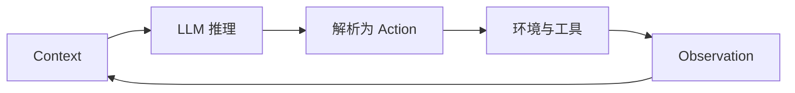

# Agent 设计模式之美：从概率循环到可靠系统

很多人第一次设计 Agent，会把注意力集中在模型和提示词上：模型够不够强，Prompt 写得够不够长，工具接得够不够多。

但当 Agent 真正进入生产环境，最棘手的问题往往不是“它会不会回答”，而是：

- 为什么相同输入会走出不同路径？
- 为什么上下文越长，表现反而越不稳定？
- 为什么工具越多，调用准确率越低？
- 为什么 Agent 能发现错误，却未必能修正错误？
- 为什么多 Agent 看起来更聪明，成本却迅速失控？
- 为什么一次错误重试，会造成两次扣款、两封邮件或两条重复订单？

这些问题共同指向一个事实：**Agent 不是一个更聪明的函数，而是一个由概率节点驱动、持续感知环境并产生副作用的运行系统。**

因此，Agent 设计的重点不应只是“怎样让模型更聪明”，而应是：**怎样用确定性的工程外壳，约束一个不确定的模型内核。**

---

## 一、先换掉旧地图：Agent 不是普通的 OOP 对象

传统软件设计通常默认两件事：

1. 相同输入能够得到稳定输出；
2. 控制流在编码阶段已经确定。

LLM Agent 恰好打破了这两个前提。

模型输出具有概率性；即使采样参数非常保守，也不能把整个推理和执行过程视为严格的确定函数。与此同时，Agent 的下一步动作经常由模型在运行时决定：它可能搜索、读文件、调用 API，也可能修改计划、重试或者终止。

这意味着，经典设计模式依然可以服务于 Agent 外围代码，却不足以单独解释 Agent 的核心运行机制。真正更接近 Agent 的，是分布式系统中的那些老问题：

- 部分失败；
- 超时与重试；
- 重复投递；
- 幂等性；
- 最终一致性；
- Saga 与补偿；
- 熔断、背压和降级；
- 不可逆操作前的提交确认。

例如，一个 Agent 执行“创建订单—扣款—发送通知”的任务。如果第三步失败，系统不能只让模型说一句“抱歉”，而要拥有可执行的补偿路径：撤销扣款、删除订单，并且按照副作用发生的逆序回滚。每一个步骤还需要幂等键，避免重试时再次扣款。

所以，设计 Agent 时最重要的认知转变是：

> 不要把 Agent 当成一个拥有工具的聊天机器人，而要把它当成一个概率性的分布式执行节点。

---

## 二、所有模式，都来自同一个原子循环

再复杂的 Agent，底层都可以还原为同一个循环：



一次 LLM 调用读取 Context，生成 Token；系统把 Token 解析成动作，在外部环境中执行，再把执行结果作为 Observation 写回下一轮 Context。

所谓 Agent 设计模式，本质上都是在约束这个循环：

- 约束模型能看到什么；
- 约束历史怎样保存；
- 约束它花多少算力思考；
- 约束哪些动作可以执行；
- 约束失败后如何纠正；
- 约束多个循环之间怎样协作；
- 约束副作用、权限和成本的边界。

理解了这个原子循环，繁多的模式就不再是一张需要背诵的清单，而可以被放进两根正交的轴中。

### 轴一：认知功能——循环内部在做什么？

它可以继续拆成五个环节：

1. **感知**：如何把外部世界转换成模型可消费的 Context；
2. **记忆**：如何跨轮次、跨窗口、跨任务保存有效信息；
3. **推理**：如何分配思考预算，把目标转成可验证计划；
4. **行动**：如何把模型意图安全地转换成真实副作用；
5. **反思**：如何利用反馈纠错，并把成功经验沉淀下来。

### 轴二：执行拓扑——多个循环怎样连接？

常见形态包括：

- 固定步骤的提示链；
- 分类后分流的路由；
- 单 Agent 的 ReAct 循环；
- 规划与执行分离；
- 扇出—聚合；
- 编排者—工作者；
- 生成者—评审者；
- Agent 之间的交接链。

一根轴描述“做什么”，另一根轴描述“怎么连”。同一套记忆或反思机制，可以嵌入单 Agent，也可以嵌入编排者—工作者系统。因此它们彼此独立，却又共同决定最终架构。

---

## 三、感知：不是看得更多，而是把有限上下文用得更好

Agent 并没有真正意义上的眼睛和耳朵。文件、网页、数据库结果、截图、语音和工具返回值，最终都要被序列化成 Token，进入同一个 Context Window。

这会带来一个常被忽略的问题：**所有感知结果都在竞争同一份注意力预算。**

接入更多数据源不一定让 Agent 更聪明。相反，过长的上下文会引入噪声、位置偏差和 Context Rot：信息虽然还在窗口里，模型却越来越难以稳定地找到并使用它。

因此，优秀的感知系统通常遵循三条原则。

### 1. 上下文分诊

不要把所有内容都塞进提示词。应先区分信息的类型与优先级：

- 稳定规则放在系统指令；
- 当前任务状态放在工作区；
- 大型文档保留索引与引用；
- 历史轨迹只保留必要摘要；
- 低相关内容留在外部存储，按需检索。

### 2. 渐进式披露

Agent 开始工作时只需要知道“有什么”，不需要立刻读取“全部内容”。先暴露文件名、目录、标题、元数据和轻量摘要，再允许它通过搜索、过滤、读取局部内容逐步缩小范围。

这与优秀的人类研究过程相似：先看目录，再看摘要，最后精读关键章节，而不是一开始就把整个资料库背进脑中。

### 3. 及时压实，而不是无限追加

当上下文逼近预算时，应把高熵的对话与执行轨迹压缩为高密度状态，例如：

- 已确认的事实；
- 已完成的步骤；
- 未解决的问题；
- 关键决策及依据；
- 下一步计划；
- 必须保留的引用和工件路径。

压缩并非免费，它会丢失细节。因此，真正重要的状态不能只存在于摘要里，而应外化为文件、数据库记录或其他可恢复工件。

---

## 四、记忆：Context Window 不等于 Memory

上下文窗口只是模型当前能够读取的工作区，不是可靠的长期记忆。它容量有限、每轮重填、压缩有损，而且越长越容易发生召回退化。

一个完整的 Agent 记忆系统，至少应该区分四类信息：

| 记忆类型 | 主要内容 | 典型载体 |
|---|---|---|
| 工作记忆 | 当前步骤、临时变量、短期计划 | Context / Scratchpad |
| 语义记忆 | 文档知识、规则、事实 | RAG / 知识库 |
| 情景记忆 | 过去任务的完整经历 | 轨迹库 / 案例库 |
| 程序记忆 | 已验证的做法和技能 | 工具、脚本、Skill |

这里最关键的不是“存”，而是“取”。错误的检索结果会主动误导 Agent，所以记忆系统必须处理相关性、时效性、可信度和冲突。

### 进度文件比长对话更可靠

对于跨多个会话的长任务，可以把状态固化为一组磁盘工件：

```text
project/
├── progress.md          # 已完成、进行中、阻塞项、下一步
├── feature-list.json    # 功能清单与验收状态
├── decisions.md         # 关键决策与理由
├── failures.md          # 失败、证据、纠正规则、置信度
└── artifacts/           # 报告、补丁、测试结果等产物
```

新的 Agent 会话先读取这些文件，再继续工作。这样即使上下文被压缩、会话被重启，任务状态仍能恢复。

### 失败日记不能变成永久禁令

记录失败经验有助于避免重复犯错，但错误归因也可能被固化。例如，一次偶发的 API 失败被总结成“这个接口永远不可用”，之后 Agent 便再也不尝试正确路径。

因此，失败记忆应携带：

- 证据；
- 置信度；
- 适用条件；
- 最近验证时间；
- 可被新证据推翻的机制。

好的记忆不是永不改变的结论，而是可以持续校准的工作假设。

---

## 五、推理：用 Token 购买准确率，但要计算边际收益

显式推理的本质，是让模型使用额外 Token 完成一次前向传播难以完成的多步计算。无论是思维链、复杂度路由、自洽性、Tree of Thoughts，还是并行探索，本质上都在做同一笔交易：

> 用更多推理时算力和延迟，换取更高的成功率。

工程上的关键不是“推理越多越好”，而是判断边际收益。

### 简单任务不要调用最昂贵的路径

可以先进行复杂度判断：简单请求走低成本模型或固定流程，复杂任务才进入深度推理。需要注意的是，路由器本身也可能误判，所以它必须拥有独立的评测集，而不能只凭直觉编写分类提示。

### 高不确定性任务可以并行探索

当任务存在多条可能路径，单次采样容易产生高方差。此时可以并行生成多个方案，再通过投票、规则验证、测试或评审器聚合结果。

但并行探索只有在结果能够比较时才有意义。数学题可以比答案，代码可以跑测试，检索任务可以核对来源；如果任务没有可靠评价标准，多生成几个答案只会制造更多看似合理的文本。

### 调试要从“试试看”变成“假设—实验”

Agent 调试最危险的模式，是看到错误后随机改 Prompt、换模型、加工具，然后在偶然成功时宣布修复完成。

更可靠的方法是：

1. 记录可复现的失败；
2. 提出单一、可证伪的原因假设；
3. 只修改一个变量；
4. 在固定评测集上执行实验；
5. 比较成功率、成本、延迟和新退化；
6. 保存结论与证据。

这会把 Agent 优化从“抽盲盒”变成真正的工程实验。

---

## 六、行动：计划产生 Token，执行产生副作用

计划和行动之间存在一条非常重要的边界：

- 计划错误，通常还可以重写；
- 动作错误，可能已经发出邮件、修改数据、删除文件或完成付款。

因此，行动层应围绕“副作用发生前后”进行设计。

### 工具接口就是 Agent 的用户界面

人类通过 GUI 使用软件，Agent 通过工具名称、描述、参数和返回值使用软件。这套接口可以称为 ACI（Agent-Computer Interface）。

一个好的工具不应只做到“可以调用”，还应做到“不容易调错”：

- 名称体现动作和对象；
- 参数尽量少且语义明确；
- 枚举优于自由文本；
- 使用结构化返回值；
- 写操作与读操作分开；
- 危险动作不提供模糊的万能入口；
- 能用领域 API，就不要直接暴露 Shell 或裸 SQL。

这是一种 Poka-Yoke（防错）思想：与其在 Prompt 中反复提醒模型“不要传错参数”，不如让错误参数根本无法通过接口校验。

### 能静态编排，就不要动态自治

如果步骤可以预先列出，优先使用提示链或工作流；如果任务能够提前形成 DAG，可以先规划，再并行执行独立节点；只有当步骤无法预知、必须根据环境反馈持续改变计划时，才使用完整 Agent 循环。

每两个步骤之间还应设置确定性的 Gate，例如 Schema 校验、规则校验、测试、权限检查和结果范围检查。**真正兜住概率模型的，往往不是更长的 Prompt，而是步骤之间那段普通代码。**

### 用“守卫三明治”包住危险动作

一项高风险操作至少需要三层保护：

1. **执行前**：参数、权限、风险和策略校验；
2. **执行中**：幂等键、超时、限流、沙箱和最小权限；
3. **执行后**：结果验证、审计记录、补偿或回滚。

付款、删除、发布、外发消息等不可逆或高影响动作，还应在真正提交前暂停，展示明确的 Diff 或 Plan，等待人工批准。

---

## 七、反思：没有外部 Oracle，自我纠错可能只是自我说服

“让模型检查自己的答案”听起来合理，但生成者和批评者如果共享同一知识盲区，批评就可能只是用另一种说法重复原错误。

可靠反思依赖外部 Oracle，也就是模型之外的真实反馈：

- 单元测试；
- 编译器；
- 类型检查；
- 数据库约束；
- API 返回码；
- 规则引擎；
- 人工验收；
- 可以追溯的事实来源。

一个典型的自愈循环是：

```text
生成方案
  → 执行
  → 读取测试或运行时错误
  → 定位根因
  → 生成最小补丁
  → 再次验证
  → 通过或达到停止条件
```

这里必须设置最大重试次数、无进展检测和震荡检测，防止 Agent 在两个错误版本之间来回切换。还要防止“奖励黑客”：为了让测试变绿而删除测试、硬编码答案，或者绕开真正的需求。

一次成功也不应该只停留在当前上下文中。经过验证的过程可以被蒸馏成脚本、工具或 Skill；完整轨迹则可以进入经验库，在未来相似任务中作为 Few-shot 案例。但无论技能还是经验，都必须经过验证和版本治理，否则记忆库会逐渐变成新的污染源。

---

## 八、多 Agent：买到的主要不是“更多智慧”，而是并行和上下文隔离

多 Agent 很容易被包装成“专家团队”，但从工程角度看，它首先是一种高成本执行拓扑。

它真正提供的价值主要有两个：

1. **并行搜索**：让多个独立分支同时探索；
2. **上下文隔离**：每个子 Agent 拥有独立窗口，只把压缩结果交回主线程。

因此，多 Agent 适合这样的任务：

- 子任务可以相对独立地拆分；
- 多条分支之间共享状态较少；
- 单个上下文装不下全部探索过程；
- 并行带来的时间收益大于额外 Token 成本；
- 最终结果存在清晰的聚合方式。

### 编排者—工作者

主 Agent 根据输入动态拆解任务，子 Agent 分别处理，再由主 Agent 汇总。每个子任务说明至少应包含：

- 明确目标；
- 任务边界；
- 可使用的工具与来源；
- 输出格式和验收标准。

子 Agent 不应把完整轨迹全部回传，而应返回高密度摘要，并通过工件引用传递大型结果，避免主线程再次被噪声淹没。

### 扇出—聚合

如果子任务在编码阶段已经确定，就无需让编排者临时决定。直接并行执行，再统一聚合即可。这种模式适合分段处理、批量评估、多个来源查证，以及对同一问题做多样本投票。

### 交接链

当任务需要在不同角色之间动态转移控制权，并且接手者可以直接面向用户时，可以使用 Handoff。它比中心化 Supervisor 更灵活，但也更难追踪全局状态，因此必须明确交接时转移哪些上下文、状态和责任。

多 Agent 的默认决策仍应是：**先证明单 Agent 已经不够，再升级。**

---

## 九、治理：自主性越高，越要限制爆炸半径

Agent 的风险不是简单相加，而可能沿着多个维度相乘：自主决策能力、可访问数据、工具权限、运行时间、并发度和外部副作用，都会扩大一次错误的影响。

治理不是在系统外面补一张“安全提示词”，而要进入运行时本身。

### 1. 审批门：把不可逆动作做成两阶段提交

第一阶段只生成待执行计划，包括对象、参数、影响范围和 Diff；第二阶段在人工或策略引擎批准后，才真正提交。

暂停必须可持久化。系统重启后应能恢复到“等待审批”的状态，而不是重新运行整个节点。恢复时也要避免重复执行审批前的副作用。

### 2. 缩小爆炸半径

需要同时使用两把剪刀：

- **Sandbox 收窄环境**：限制文件系统、网络、进程、凭据和运行时；
- **Least Agency 收窄能力**：不仅限制 Agent 能访问什么，还限制它能表达什么动作。

例如，提供“查询某订单状态”的只读工具，比提供数据库 Shell 更安全；提供“创建不超过指定金额的退款申请”，比提供一个万能付款 API 更容易治理。

### 3. 渐进承诺

不要一开始就赋予完全自治权。更合理的是一条单调阶梯：

```text
Read Only
  → Recommend and Wait
  → Dry Run / Preview
  → Act Within Guardrails
  → Higher Autonomy
```

权限应根据真实运行记录逐级获得，也应在异常率上升、环境变化或策略更新后自动降级。没有降级机制的“渐进授权”，最终会退化成永久授权。

### 4. 可观测、可回放

每次模型调用、工具调用、状态转换、审批和错误都应形成结构化 Trace。日志至少要能够回答：

- 模型看到了什么；
- 为什么选择这个工具；
- 传入了哪些参数；
- 工具返回了什么；
- 哪一道规则放行或阻止了动作；
- 本轮消耗了多少 Token、时间和费用；
- 是否发生重试、补偿、降级或人工接管。

Agent 具有非确定性，所以“能够回放一次运行”比“拥有很多普通日志”更重要。

---

## 十、Harness：把模型托住的工程外壳

一个可生产运行的 Agent，不应只是下面这段循环：

```python
while not done:
    action = model(context)
    observation = tool.execute(action)
    context.append(observation)
```

真实系统需要一个 Harness，把前面的设计模式集成为五个横切面：

1. **Instructions**：目标、边界、策略和完成定义；
2. **Tools**：可发现、可校验、可限权的行动接口；
3. **State & Memory**：上下文、进度、知识、工件与检查点；
4. **Guardrails & Hooks**：输入输出校验、审批、限流、补偿；
5. **Observability**：Trace、评测、成本、回放和审计。

Harness 还必须定义清晰的退出条件，例如：

- 已产出满足 Schema 的最终结果；
- 目标测试全部通过；
- 达到最大轮数或预算；
- 连续多轮没有进展；
- 检测到高风险行为；
- 需要人工输入；
- 出现不可恢复错误。

对于长程任务，Harness 还应强制把状态写入磁盘工件，并以版本控制保存可恢复检查点。**长程 Agent 的可靠性，主要不是来自更大的窗口，而是来自可恢复的外部状态。**

---

## 十一、选型时，默认向简单的一侧倾斜

面对一个新需求，可以按下面的顺序判断：

### 第一步：它真的需要 Agent 吗？

如果确定性代码、搜索、规则引擎或普通工作流足以解决，就不要引入概率循环。

### 第二步：步骤能否预先列举？

能，就优先使用提示链、路由或固定工作流；不能，才考虑动态规划或 Agent 循环。

### 第三步：子任务能否独立并行？

能，就使用并行化或扇出—聚合；不能，就保持串行，避免引入同步成本。

### 第四步：任务是否跨越多个上下文窗口？

是，就引入持久状态、进度文件、检查点和恢复协议，而不是单纯扩大 Context。

### 第五步：单 Agent 是否出现了可观测的容量瓶颈？

只有在上下文污染、工具选择困难、并行探索不足或职责冲突已经被测量出来时，才拆成多 Agent。

### 第六步：动作的最坏后果是什么？

根据可逆性、权限、财务影响、数据敏感度和外部影响，逐层增加沙箱、审批、限额、审计与人工接管。

这套流程背后的纪律是：

> 复杂度不是能力勋章，而是为已观察到的失效付出的成本。

---

## 结语：Agent 架构的美，在于给不确定性建立边界

Agent 系统最迷人的地方，是它不再要求工程师把每一步控制流都提前写死；最危险的地方，也正是它不再要求工程师把每一步控制流都提前写死。

因此，Agent 设计模式的价值，不是教我们堆叠更多 Prompt、工具和角色，而是提供一套管理不确定性的结构：

- 用感知控制进入上下文的信息；
- 用记忆把状态从窗口中解放出来；
- 用推理预算平衡准确率、成本与延迟；
- 用工具接口和确定性 Gate 约束行动；
- 用外部 Oracle 让反思真正收敛；
- 用执行拓扑组织并行、隔离与协作；
- 用治理限制权限和爆炸半径；
- 用 Harness 把整个系统变成可恢复、可审计、可演进的工程产品。

归根结底，优秀的 Agent 架构并不是让模型获得无限自由，而是让它在明确边界内拥有恰到好处的自由。

**模型负责生成可能性，系统负责守住确定性。**
