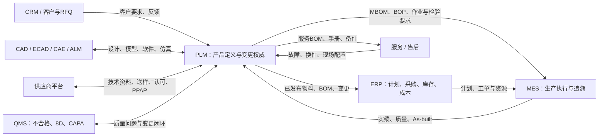
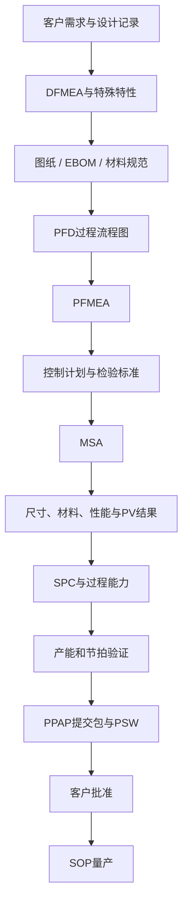

# PLM 全业务流程：从客户需求、产品设计到量产、变更与退市

一家汽车零部件企业收到 OEM 的 RFQ。销售把技术附件发给研发，研发在本地目录中建立模型，项目经理用 Excel 维护 APQP 计划，质量工程师单独编制 DFMEA，工艺部门根据旧版图纸制作工装，采购又从邮件里把规格书转给供应商。

几个月后，客户修改了接口要求。研发很快完成了图纸升版，但新的 EBOM 没有及时传到 ERP，工艺部门没有同步更新 MBOM 和控制计划，供应商仍按旧规格生产。直到试生产时尺寸不合格，团队才开始追查：

- 客户要求究竟在哪一天发生了变化？
- 哪张图纸、哪版 EBOM 和哪份 DFMEA受到了影响？
- 已经采购、在制和在库的旧零件怎样处置？
- 是否需要重新进行 DV、PV 或提交 PPAP？
- 新版本应当从哪个批次、序列号或车型开始生效？
- ERP、MES、QMS 和供应商是否都收到了同一版本？

这些问题很难靠一个共享文件夹解决。它们的本质不是“文件放在哪里”，而是：**企业缺少一条能够连接需求、设计、BOM、工艺、质量、供应商、实物和变更决策的受控数字主线。**

PLM 正是为了解决这类问题而存在。

> **PLM 不是工程部的高级网盘，而是企业围绕产品建立的定义权威、流程控制和跨部门协同平台。**

本文以通用制造业为基础，以汽车零部件业务为重点，沿着一件产品从客户需求到退市的完整过程，讲清楚 PLM 是什么、在企业中处于什么位置、管理哪些数据、如何承载 APQP 与 PPAP，以及它最终解决什么问题。

> 资料口径：本文基于截至 **2026 年 10 月 8 日**可访问的 CIMdata、NIST、AIAG，以及 Siemens、PTC、SAP 等公开资料整理。不同企业的阶段名称、审批门和系统边界会有所不同，文中的 G0～G5 是便于讲解的参考模型，不代表所有客户或企业都采用完全相同的编号。

---

## 一、为什么企业需要 PLM：产品复杂度已经超过“靠人记住”的极限

在产品简单、团队很小、版本变化很少时，文件夹、Excel、邮件和口头沟通也能把产品做出来。问题在于，一旦企业进入平台化研发、多专业协同、全球供应链和多车型并行阶段，这套方式会迅速失效。

### 1. 产品信息存在于多个彼此割裂的世界

同一个产品的信息可能散落在：

- 销售和 CRM 中的客户要求、报价与合同；
- 项目经理的 APQP 计划；
- 机械工程师的 CAD 和图纸；
- 电子工程师的 ECAD；
- 软件团队的 ALM、代码和发布包；
- 工艺工程师的 PFD、PFMEA、控制计划和作业指导书；
- ERP 中的物料、采购和生产 BOM；
- MES 中的工单、批次、工位和实绩；
- QMS 中的不合格、8D 和 CAPA；
- 供应商邮件中的规格书、样件报告和 PPAP 资料；
- 售后系统中的故障、换件和维修记录。

企业通常并不是真的“没有数据”，而是无法确认这些数据是否属于同一个产品、同一个版本和同一个有效范围。

### 2. 最新版本不一定是正确版本

制造企业需要的不是简单的“最新版”，而是**适用于当前业务场景的正确版本**。

同一个零件可能同时存在：

- 正在研发的下一版；
- 已经批准但尚未生效的版本；
- 当前量产有效版本；
- 仅适用于某个车型或地区的版本；
- 对某个客户临时偏离的版本；
- 售后仍需长期支持的历史版本。

因此，产品控制必须同时回答：

```text
哪个对象？
哪个版本？
什么状态？
适用于哪个配置？
从什么时间、批次或序列号开始生效？
```

### 3. 一次设计变更会横跨整条业务链

一个材料、尺寸或软件参数的变化，可能同时影响：

- 客户技术协议和需求基线；
- CAD、图纸、规格书和仿真模型；
- DFMEA、EBOM 和测试报告；
- 供应商、价格、交期和库存；
- MBOM、BOP、工装和作业指导书；
- PFD、PFMEA、控制计划和检验规范；
- PPAP 有效性和客户批准状态；
- 已采购、在制、在库、在途和已交付产品；
- 备件、维修手册和现场服务方案。

如果变更只在研发内部完成，问题不会消失，只会在采购、车间、客户现场或审计时以更高的代价暴露。

### 4. 现代产品不再是一张图纸

一件产品可能同时包含机械、电气、电子、软件、固件、算法、材料、服务和合规内容。真正的产品定义是一张关系网：

```text
客户需求
  ↓
产品需求 → 功能与系统架构
  ↓
机械 / 电气 / 电子 / 软件设计
  ↓
零部件、文档、BOM与配置规则
  ↓
仿真、试验、质量和合规证据
  ↓
制造工艺、检验要求与供应商
  ↓
批次、序列号、交付配置与维修历史
```

PLM 的价值，就是让这张关系网可以被管理、查询、审批、发布、变更和追溯。

---

## 二、PLM 到底是什么

PLM 是 **Product Lifecycle Management，产品生命周期管理**。

行业中的经典定义强调，PLM 是一种战略性业务方法，用来支持企业以及客户、设计伙伴和供应商，在产品从概念产生到生命周期终止的全过程中，共同创建、管理、分发和使用产品定义信息，并把人员、流程、业务系统和信息整合起来。

这一定义包含四层含义。

### 1. PLM 是管理理念

PLM 要求企业把产品当作贯穿部门和时间的核心管理对象，而不是把研发、采购、制造、质量和服务看成互不相干的环节。

### 2. PLM 是业务流程

PLM 承载的不只是数据，还包括：

- 需求评审；
- 项目和阶段门；
- 设计评审与发布；
- BOM 和配置管理；
- 工艺规划；
- APQP 和 PPAP 交付物；
- 工程变更；
- 质量问题闭环；
- 产品退市和归档。

### 3. PLM 是产品数据模型

它需要定义产品、零部件、文档、需求、BOM、配置、版本、基线、变更、测试和实物之间是什么关系。

### 4. PLM 是数字化平台

平台通过权限、工作流、版本控制、搜索、可视化、集成和审计，把管理方法真正落到日常业务中。

所以，一句话定义 PLM：

> **PLM 是企业围绕产品建立的权威信息与流程平台，用于控制产品从客户需求和创意开始，到设计、制造、交付、服务和退市全过程中的定义、配置、协同、决策、变更与追溯。**

---

## 三、PLM 不是什么

### 1. PLM 不等于 CAD

CAD、ECAD、CAE、CAM 负责建模、出图、布线、仿真和制造编程。PLM 负责回答：

- 这是哪个产品或零件的模型？
- 当前处于什么版本和状态？
- 与哪些需求、BOM 和测试相关？
- 谁可以修改、审核和发布？
- 哪个版本已经进入量产？

可以简单理解为：

- CAD 回答“怎么设计”；
- PLM 回答“设计的是什么、为什么这样设计、哪个版本有效”。

### 2. PLM 不等于 PDM

PDM 主要管理工程文件、CAD 数据、版本、签审和 EBOM，是 PLM 的重要基础。PLM 在此基础上进一步连接产品规划、需求、项目、工艺、供应商、质量、制造、服务和退市。

> **PDM 管好研发数据，PLM 管好围绕产品发生的端到端业务。**

### 3. PLM 不等于 ERP

PLM 和 ERP 都会出现物料、BOM、成本等概念，但视角不同：

- PLM 关注产品“应该是什么”，允许设计在正式发布前不断迭代；
- ERP 关注企业“如何计划和交付”，管理采购、库存、订单、成本和财务交易。

研发中的候选方案、未发布图纸和试验版本不应直接驱动采购；正式发布并具备业务执行意义的数据，才应传递到 ERP。

### 4. PLM 不是吞掉所有系统的超级数据库

“单一事实来源”不意味着所有数据都必须存进一个数据库。生产实绩仍然适合保存在 MES，财务交易仍然属于 ERP，客户投诉可能来自 CRM 或 QMS。

PLM 更重要的职责是：

- 为产品对象建立稳定身份；
- 明确每类数据由哪个系统负责；
- 管理版本、状态、关系和生效范围；
- 让跨系统数据可以被关联和追踪；
- 让反馈能够回到产品定义和工程变更流程。

---

## 四、PLM 在企业中的定位

制造企业可以抽象出三条主干。

### 1. 产品定义主干：PLM

回答：

- 产品为什么做？
- 应该满足什么要求？
- 由什么组成？
- 如何设计、验证和制造？
- 哪个版本可以被使用？

### 2. 经营交易主干：ERP

回答：

- 买多少、做多少？
- 有多少库存？
- 什么时候交付？
- 实际成本是多少？
- 如何形成财务记录？

### 3. 生产执行主干：MES/MOM

回答：

- 某张工单实际在哪条线、哪个工位执行？
- 使用了哪些批次和序列号？
- 过程参数和检验结果是什么？
- 实物究竟是怎样被制造出来的？

| 系统 | 核心定位 | 典型权威数据 |
|---|---|---|
| PLM | 产品定义与变更权威 | 需求、设计、EBOM、配置、基线、变更、验证、工艺定义 |
| ERP | 经营计划与交易权威 | 采购、库存、订单、MRP、成本、财务 |
| MES/MOM | 生产执行与实绩权威 | 工单、工位、设备参数、批次、序列号、检验和在制品 |
| QMS | 质量事件与质量体系 | 不合格、审核、CAPA、8D、质量记录 |
| SRM/供应商平台 | 外部供应协同 | 询价、送样、供应商提交物、认可状态 |
| CRM | 客户关系与市场输入 | 商机、RFQ、客户沟通、投诉和市场反馈 |
| ALM | 软件生命周期 | 软件需求、代码、构建、测试和发布包 |

它们之间的关系可以表示为：



因此，PLM 的企业级定位不是“研发工具”，而是：

> **产品创新平台、产品定义权威源、工程变更控制中心，以及连接研发、供应链、制造、质量和服务的数字主干。**

---

## 五、PLM 管理的不是文件夹，而是产品数据模型

PLM 项目能否真正创造价值，关键不在于上传了多少文件，而在于有没有建立稳定的产品数据模型。

### 1. 零部件与物料

零部件对象可以关联：

- 编码、名称、分类和技术属性；
- 自制、外购、标准、虚拟等类型；
- CAD 模型、二维图纸和规格书；
- 材料、重量、表面处理和合规属性；
- 制造商零件和供应商零件；
- 生命周期状态、修订版和替代关系。

文件描述零件，但文件本身不等于零件。把“业务对象”和“内容文件”分开，是从文档管理走向产品管理的第一步。

### 2. 多种 BOM 视图

BOM 不是一张可以在不同部门之间反复复制的 Excel，而是同一个产品在不同业务阶段下的结构视图。

| 结构 | 回答的问题 |
|---|---|
| 产品/功能结构 | 产品由哪些功能、系统和平台组成？ |
| EBOM | 设计上由哪些零件、软件和文档组成？ |
| MBOM | 制造时如何分组、装配和投料？ |
| BOP | 经过哪些工序、工位、资源和控制步骤？ |
| SBOM | 售后如何拆分、维修和更换？ |
| As-planned | 计划按什么配置制造？ |
| As-built | 实际装入了什么零件、批次和序列号？ |
| As-delivered | 交付给客户的实际配置是什么？ |
| As-maintained | 现场维修升级后的当前配置是什么？ |

PLM 的目标不是强迫这些结构完全相同，而是维护它们之间的转换、对应与追溯。

### 3. 版本、状态、基线和有效性

这些概念不能混为一谈：

- **迭代**：同一正式修订下的工作过程版本；
- **修订**：可以被正式识别和发布的设计版次；
- **生命周期状态**：草稿、评审中、已发布、停用等；
- **成熟度**：概念、详细设计、样机、试制、量产等业务成熟阶段；
- **基线**：在某个时点冻结的一组对象和版本；
- **有效性**：某个版本适用于哪些日期、批次、序列号、车型、工厂或产品配置。

如果企业只保存“最新版本”，就无法还原历史量产配置，也无法可靠支持售后和审计。

### 4. 需求、验证和变更

PLM 还要建立以下关系：

```text
客户需求
→ 产品需求
→ 系统与子系统需求
→ 设计对象
→ 验证方法与测试用例
→ 测试结果
```

以及：

```text
问题来源
→ ECR变更请求
→ 影响对象
→ ECO实施任务
→ 新版本
→ 验证证据
→ 生效范围
```

这些关系共同构成企业的产品数字主线。

---
## 六、看懂 PLM 全业务流程：一组阶段门，三条贯穿主线

汽车零部件企业常用 APQP 管理新产品质量策划。不同客户和企业的阶段名称可能不同，为便于理解，本文将完整流程抽象为六个阶段门：


与阶段门并行的，是三条不能中断的业务主线。

### 1. 产品主线

```text
客户需求
→ 需求基线
→ CAD/图纸/软件
→ EBOM
→ MBOM/BOP
→ 有效量产版本
→ 服务配置
```

它回答产品是什么、由什么组成、如何制造，以及哪个版本可以使用。

### 2. 质量主线

```text
APQP计划
→ DFMEA
→ 设计验证DV
→ PFD
→ PFMEA
→ 控制计划
→ MSA/SPC
→ PV与产能验证
→ PPAP
→ SOP
→ 量产监控与8D
```

它回答产品和过程有哪些风险、如何预防、怎样验证，以及凭什么相信企业具备稳定量产能力。

### 3. 变更主线

```text
客户/质量/降本/法规触发
→ ECR
→ 影响分析
→ CCB
→ ECO
→ 产品、工艺和质量文件更新
→ 验证或重新PPAP
→ 发布与生效
```

它回答为什么变、影响什么、谁批准、如何实施、何时生效，以及如何证明变更已经被正确执行。

完整业务不是线性瀑布。产品设计可能因试验失败返回修改，过程开发可能暴露设计不可制造，PPAP 可能被客户拒绝，量产质量和现场问题也会触发新一轮工程变更。PLM 的作用不是消灭迭代，而是让每次迭代都有上下文、有责任、有版本和有证据。

---

## 七、G0：从 RFQ 到客户定点——先判断该不该做、能不能做

产品生命周期并不是从研发画图开始，而是从客户机会和业务承诺开始。

### 1. OEM 发布 RFQ

RFQ 通常包含：

- 技术要求和接口资料；
- 目标车型、市场和生命周期；
- 预计年量与爬坡计划；
- 质量、可靠性和法规要求；
- 样件、DV、PV、PPAP 和 SOP 节点；
- 包装、物流、产能和服务要求；
- 客户特殊要求。

传统方式下，这些资料很容易停留在销售邮箱。PLM 应当为 RFQ 建立受控对象，记录客户版本、收到时间、澄清问题和分发范围，避免团队基于不同附件开展评估。

### 2. 跨部门可行性评审

销售不能单独决定是否报价。可行性评审至少需要产品、研发、工艺、质量、采购、制造、物流和财务共同参与。

| 评审方向 | 典型问题 |
|---|---|
| 技术 | 性能、接口、材料和可靠性是否可实现？ |
| 制造 | 现有设备、工艺和节拍能否满足？ |
| 质量 | 特殊特性、检验和客户质量要求是否可满足？ |
| 供应链 | 关键材料和供应商是否可获得？ |
| 产能 | 量产爬坡、瓶颈设备和班次是否可行？ |
| 成本 | 目标成本、开发费、模具费和单件成本是否合理？ |
| 项目 | 样件、验证、PPAP 和 SOP 节点是否可达？ |
| 合规 | 法规、环保、材料申报和出口要求是否满足？ |

PLM 不一定承担所有财务计算，但应保存评审输入、结论、假设、风险、责任人和批准记录。

### 3. 成本估算与报价

报价不应只是销售最终上传的一张表。它背后依赖：

- 初步产品结构；
- 关键材料和外购件；
- 自制工序和设备投资；
- 工装、模具和检具；
- 开发与验证成本；
- 产量和生命周期假设；
- 风险准备和目标利润。

当客户需求或产品方案变化时，企业应能判断原报价假设是否仍然成立。PLM 可以把报价版本与当时的需求基线、概念方案和初始 BOM 关联起来。

### 4. 客户定点和项目启动

客户定点后，需要受控保存：

- 定点通知；
- 技术协议；
- 目标成本；
- 开发边界和交付物；
- 客户里程碑；
- 客户特殊要求；
- 未关闭澄清项；
- 初始风险和偏差。

这组信息构成立项基线。后续如果范围扩大、目标改变或节点提前，项目团队才能区分“原始承诺”和“新增变更”。

### G0 的关键输出

```text
受控RFQ
+ 可行性评审结论
+ 初步产品方案
+ 成本估算与报价
+ 风险清单
+ 客户定点与技术协议
+ 项目启动基线
```

---

## 八、G1：项目策划——把客户承诺转化为 APQP 计划

定点只是拿到了项目，不代表企业已经具备交付能力。G1 的任务是把客户节点、产品开发、过程开发、供应商开发和质量策划组合成一份可执行计划。

### 1. 建立跨职能项目团队

一个典型团队包括：

- 项目经理；
- 产品与系统工程；
- 机械、电气、电子和软件研发；
- 工艺和制造工程；
- 质量与实验室；
- 采购和供应商质量；
- 生产、物流和设备；
- 销售、财务和售后。

PLM 中应明确每类交付物的创建者、审核者、批准者和使用者，而不只是为所有人开放同一个目录。

### 2. 建立 APQP 计划与阶段门

APQP 计划应将客户节点分解为内部任务和可验证交付物，例如：

- 需求基线完成；
- 概念设计评审；
- DFMEA 完成；
- EBOM 发布；
- 设计冻结；
- DV 完成；
- PFD、PFMEA 和控制计划完成；
- 工装验收；
- 供应商 PPAP；
- 试生产和 PV；
- 客户 PPAP；
- SOP 和产能爬坡。

传统项目工具只知道“任务完成百分比”，PLM 还应检查任务对应的交付物是否存在、是否达到目标版本、是否已经批准，以及未关闭问题是否超过阶段门容许范围。

### 3. 识别风险与关键路径

项目风险不应只写成一句“供应商可能延期”。它应该关联具体对象：

- 哪个外购件；
- 哪家供应商；
- 哪个交付节点；
- 影响哪台样机、哪项试验或哪次 PPAP；
- 有什么替代方案；
- 谁负责关闭。

通过对象关系，项目风险才能真正影响计划判断，而不是成为每周更新颜色的表格。

### 4. 建立需求基线

客户资料需要被分解为可设计、可验证的需求，包括：

- 性能需求；
- 几何和接口需求；
- 可靠性和耐久性；
- 环境与安全；
- 法规和材料合规；
- 制造、包装、物流和服务要求；
- 成本、重量和能耗目标；
- 客户特殊要求。

每条需求至少应具有唯一标识、来源、责任人、优先级、目标版本、验证方法和状态。

```text
客户原始要求
→ 产品需求
→ 系统/子系统需求
→ 设计对象
→ 验证方法
```

建立需求基线的意义是：从此以后，客户要求的任何变化都不再被当作“覆盖原文件”，而应作为受控变更进入影响分析。

### G1 的关键输出

```text
项目组织与RACI
+ APQP计划
+ 阶段门和里程碑
+ 需求基线
+ 风险清单
+ 初始质量计划
+ 供应商开发计划
```

---

## 九、G2：产品设计——从需求基线到设计冻结和 EBOM 发布

G2 的目标不是“图纸画完”，而是形成一套能够证明产品满足需求、可以交给过程开发的受控产品定义。

### 1. 需求分解与系统架构

复杂产品需要从客户语言逐步转化为工程语言：

```text
客户需求
→ 产品需求
→ 系统需求
→ 子系统需求
→ 机械/电子/电气/软件要求
```

系统工程需要同步定义：

- 功能架构；
- 逻辑架构；
- 物理架构；
- 机械、电气、数据、热和控制接口；
- 重量、成本、能耗、可靠性等参数预算。

PLM 或与专业系统工程工具集成后，要维护需求、架构、设计和验证之间的追溯关系。

### 2. 概念设计和详细设计

设计成果可能来自多个专业系统：

- 机械 CAD 和二维图纸；
- ECAD、PCB 和线束设计；
- CAE 仿真模型和结果；
- 软件需求、代码和发布包；
- 材料、配方或参数规范；
- 标签、包装和技术文档。

PLM 负责统一对象身份、版本、状态和关系，使跨专业团队知道自己使用的接口和基线是否一致。

### 3. DFMEA：把设计风险变成受控知识

DFMEA 不是质量部门在项目后期补齐的表格。它应当与产品功能、失效模式、原因、预防措施、探测措施和设计对象关联。

一个更合理的关系是：

```text
产品需求/功能
→ 潜在失效模式
→ 影响与原因
→ 设计预防和探测措施
→ 特殊特性
→ 图纸或规范
→ DV验证项目
```

当图纸、材料或接口发生变化时，系统应提示团队检查相关 DFMEA 和验证计划是否仍然有效。

### 4. 建立 EBOM

EBOM 是产品设计定义的结构骨架。它不仅包括父子层级和数量，还应表达：

- 零件、软件和技术文档；
- 位号、装配位置和参考关系；
- 材料和关键属性；
- 替代件与互换性；
- 选项和变型规则；
- 修订、状态和生效范围；
- 与 CAD 装配结构的对应关系。

如果企业存在多车型、多地区或客户定制，PLM 还需要用平台、模块、特征、选项和规则管理产品族，避免为每个组合复制一整套 BOM。

### 5. 样件和设计验证 DV

设计验证需要明确：

- 验证哪条需求；
- 使用什么方法和判定标准；
- 被测对象是什么版本和配置；
- 样件使用了哪些关键零部件；
- 测试环境和设备是什么；
- 结果、偏差和问题是什么；
- 失败后通过什么变更关闭。

如果只保存一份“试验通过”的 PDF，却没有关联需求、样件配置和设计版次，那么设计变化后就无法判断这份报告还能不能使用。

### 6. 设计评审与冻结

设计冻结不是禁止一切修改，而是确认某个基线已经满足进入过程开发的条件。阶段门可以检查：

- 需求是否得到分配；
- 关键接口是否稳定；
- DFMEA 高风险项是否采取措施；
- EBOM 是否完整；
- 图纸和技术规范是否达到目标成熟度；
- DV 是否完成或有经批准的关闭计划；
- 未决问题是否在可接受范围内。

冻结后仍然可以变更，但必须进入正式工程变更流程。

### G2 的关键输出

```text
需求与系统架构
+ CAD/图纸/软件定义
+ DFMEA
+ EBOM
+ DV计划和报告
+ 特殊特性
+ 设计评审记录
+ 设计冻结基线
```

---
## 十、G3：过程开发——把“设计上可行”变成“制造上可执行”

设计部门发布 EBOM 后，产品还不能直接进入车间。过程开发需要回答：如何采购、加工、装配、检测、包装和追溯，才能稳定地把设计定义转化为合格实物。

### 1. 从 EBOM 到 MBOM

EBOM 按设计关系组织产品，MBOM 按制造和装配关系组织产品。两者可能存在以下差异：

- 设计总成在不同工厂被拆分为不同制造单元；
- 制造中增加辅料、包装件和中间装配件；
- 某些零件需要按工位或装配顺序重新分组；
- 外购总成可能对应供应商内部的多级结构；
- 返工、选配和工厂差异需要额外制造视图。

PLM 应维护 EBOM 与 MBOM 的对应关系，而不是让工艺人员复制一份 Excel 后独立维护。这样设计变更发生时，系统才能识别哪些制造结构尚未同步。

### 2. 建立 BOP 和工艺路线

BOP，Bill of Process，描述产品如何被制造。它通常包括：

- 工厂、车间、产线和工位；
- 工序和装配顺序；
- 输入零件与输出半成品；
- 设备、工装、夹具和检具；
- 标准工时与节拍；
- 作业方法和关键参数；
- 检验点、质量特性和反应计划；
- 人员技能与安全要求。

MBOM 回答“制造时用什么”，BOP 回答“按照什么过程制造”。两者共同构成向 MES 下发生产定义的基础。

### 3. PFD：先把过程走向画清楚

PFD，Process Flow Diagram，过程流程图，用于描述原材料、零件和产品依次经过哪些过程步骤。

它是 PFMEA 和控制计划的重要输入。如果 PFD 中包含一个清洗、压装或测试工序，PFMEA 与控制计划中就应当存在对应的风险分析和控制措施。PLM 可以通过对象关联检查这三类文件之间是否存在明显缺口。

### 4. PFMEA：识别制造过程风险

PFMEA 关注的是过程如何失效，例如：

- 零件装反；
- 压装力不足；
- 焊接参数漂移；
- 错料或混料；
- 测量方法不稳定；
- 关键参数未被记录；
- 返工后失去追溯关系。

PFMEA 的措施应落实到实际过程定义中：

```text
PFD中的过程步骤
→ PFMEA中的失效模式与原因
→ 预防/探测措施
→ 控制计划
→ 作业指导书与检验标准
```

如果 PFMEA 只是独立 Excel，它很容易与现场工艺脱节；如果成为 PLM 中的受控对象，它就能与工序、特性、设备和变更建立关系。

### 5. 控制计划与检验要求

控制计划回答：

- 控制什么产品或过程特性；
- 在哪个工序控制；
- 使用什么设备和方法；
- 抽样数量和频率是多少；
- 规范和判定标准是什么；
- 发现异常时采取什么反应计划；
- 结果保存在哪里。

控制计划应继续向下关联到：

- 作业指导书；
- 检验标准；
- 量检具；
- MES/QMS 采集项；
- SPC 控制图；
- 不合格和反应流程。

### 6. 工装、设备与作业指导书

过程开发还要管理：

- 模具、夹具、检具和专用设备；
- 设计、制造、验收和维护状态；
- 工艺参数和程序；
- 标准作业和可视化指导；
- 包装、搬运和防错要求；
- 工位安全和人员资质。

作业指导书不应是一份长期不变的 PDF。它必须与工序、产品版本和生效日期保持一致，并在工程变更后同步更新。

### 7. 供应商开发与供应商 PPAP

外购件同样需要受控：

- 向供应商发布正确版本的图纸和规范；
- 确认供应商已接收并接受变更；
- 管理供应商样件、试验报告和偏差；
- 进行供应商过程审核和能力评估；
- 跟踪供应商 PPAP 提交与批准；
- 管理制造商零件、替代件和认可状态。

供应商平台可以负责外部交互，但技术资料的权威版本和认可结果应回到 PLM 产品定义中。

### G3 的关键输出

```text
MBOM
+ BOP/工艺路线
+ PFD
+ PFMEA
+ 控制计划
+ 检验标准
+ 工装与设备定义
+ 作业指导书
+ 供应商认可与PPAP状态
```

---

## 十一、G4：从试生产到 PPAP——证明企业具备稳定量产能力

很多人把 PPAP 理解为一套需要上传给客户的文件。更准确的理解是：

> **PPAP 是一条量产能力证据链，用来证明产品设计要求已经被正确理解，制造过程能够在实际生产节拍下持续产出满足要求的产品。**

### 1. 试生产不是多做几件样品

试生产应尽量使用量产条件：

- 正式或等效的量产设备；
- 计划使用的工装和检具；
- 正式供应商和量产材料；
- 受训的生产人员；
- 目标工艺参数；
- 计划中的生产节拍；
- 正式检验和追溯方法。

PLM 管理试生产使用的产品和过程基线，MES 记录实际工单、设备、批次、参数和人员，QMS 管理检验与异常。三者结合，才能说明 PPAP 证据对应的是哪一套真实生产条件。

### 2. MSA：先证明测量结果值得相信

在评价过程能力之前，企业要确认测量系统本身是否可靠。否则波动可能来自产品，也可能来自量具、方法、环境或测量人员。

MSA 对象应关联：

- 被测特性；
- 测量设备和检具；
- 测量方法；
- 操作人员；
- 研究结果；
- 适用产品与工序；
- 校准和有效状态。

如果量具或测量方法发生变化，应评估已有 MSA 结论是否仍然有效。

### 3. SPC 与过程能力

SPC 用于观察过程是否稳定，并识别异常波动。过程能力分析则用于判断稳定过程能否满足规格要求。

系统需要明确：

- 哪些特性需要 SPC；
- 数据从哪个工序和设备采集；
- 规格限和控制限分别来自哪里；
- 超出规则后触发什么反应；
- 结果关联哪个产品版本和生产批次。

PLM 不一定承担实时统计计算，但应管理特性和控制要求；MES/QMS 负责采集和分析；异常结果再反馈到质量问题和变更流程。

### 4. PV、产能与节拍验证

量产批准不仅要看产品合格，还要看整个过程是否可以按计划持续运行。需要评估：

- 产品和过程验证结果；
- 关键设备稳定性；
- 工装和检具能力；
- 瓶颈工序；
- 计划节拍和实际节拍；
- 人员、班次和物流；
- 供应商产能；
- 返工、报废和停机风险。

这些结果共同支撑量产准备度判断。

### 5. PPAP 证据链

PPAP 文件包会因客户、零件和提交等级而不同，但从数字主线角度，可以理解为以下关系：



这张图最重要的不是文件顺序，而是证据之间的逻辑关系：

- DFMEA 识别的风险是否进入设计措施和验证计划；
- PFMEA 中的过程风险是否进入控制计划；
- 控制计划中的特性是否有可靠测量方法；
- 检验结果是否来自正确产品和过程版本；
- 过程能力是否对应计划中的量产条件；
- PSW 所声明的产品，是否就是这条证据链所证明的产品。

### 6. 客户批准不是终点，而是受控状态

客户可能：

- 正式批准；
- 临时批准；
- 要求补充资料；
- 拒绝并要求整改；
- 对某些偏差附条件放行。

PLM 应记录提交版本、客户结论、限制条件、到期时间和整改任务。如果被拒绝，应把问题准确返回设计、工艺、质量或供应商节点，而不是重新复制一个文件夹开始下一轮。

### 7. 何时需要重新 PPAP

设计、材料、供应商、制造地点、工艺、设备或检验方法变化时，企业应根据客户要求和内部规则判断：

- 原有 PPAP 是否仍然有效；
- 是否需要通知客户；
- 是否需要重新送样；
- 需要重做哪些验证；
- 是否需要重新提交部分或完整 PPAP。

具体触发条件和提交等级应以适用客户要求、质量体系和最新标准为准，不能仅由研发人员凭经验决定。

### G4 的关键输出

```text
试生产记录
+ MSA
+ SPC与过程能力结果
+ PV和性能验证
+ 产能与节拍验证
+ 供应商PPAP
+ 客户PPAP文件包
+ PSW和客户批准状态
+ SOP量产基线
```

---

## 十二、量产阶段：PLM 并没有在 SOP 后结束

产品进入量产后，ERP 和 MES 的使用频率会显著增加，但 PLM 仍然承担产品定义、配置和工程变更的权威角色。

### 1. 从定义态走向实物态

量产过程中需要连接：

```text
As-designed：设计上是什么
→ As-planned：计划如何生产
→ As-built：实际上装了什么
→ As-delivered：交付给客户的是什么
→ As-maintained：现场当前是什么状态
```

以一个序列化产品为例，企业应能够追溯：

- 使用了哪个设计和工艺版本；
- 装入了哪些关键零件和软件；
- 零件来自哪个供应商和批次；
- 经过哪些设备和工位；
- 关键参数和检验结果是什么；
- 是否存在批准偏离；
- 后续是否发生返工、换件或软件升级。

### 2. 量产质量反馈

量产阶段可能出现：

- 内部不合格；
- 供应商质量问题；
- 过程能力下降；
- 客户投诉和退货；
- 现场故障；
- 审核不符合；
- 降本和替代料需求。

这些问题不应只停留在 QMS 中。涉及产品定义和制造过程的根因，应通过 8D、CAPA 或工程变更回到 PLM，推动图纸、BOM、工艺、FMEA 和控制计划更新。

### 3. 8D 与工程变更的关系

8D 用来组织问题遏制、根因分析、纠正措施和效果验证；ECR/ECO 用来控制产品或过程定义的正式变化。二者可以相互关联，但不能互相替代。

```text
客户投诉/不合格
→ 临时遏制
→ 根因分析
→ 永久纠正措施
→ 如需修改产品或过程，则进入ECR/ECO
→ 变更实施与验证
→ 8D效果确认和关闭
```

这样既保留了质量问题的完整处理记录，也确保永久措施进入受控产品版本。

---
## 十三、工程变更闭环：不是把图纸升版，而是控制影响和生效

工程变更是 PLM 最核心、也最容易被低估的流程。

很多企业所谓的“变更管理”，只是让研发填写一张审批单，然后把图纸从 A 版改成 B 版。真正困难的部分却是：B 版会影响谁、何时生效、旧状态如何退出，以及怎样证明所有部门都已正确实施。

### 1. 变更从哪里来

常见触发来源包括：

- 客户需求变化；
- 设计缺陷和试验失败；
- 内部或客户质量问题；
- 供应商停供和替代料；
- 降本、轻量化或性能优化；
- 法规与材料合规变化；
- 制造效率和自动化改进；
- 售后故障和维修反馈；
- 产品平台升级。

触发来源应保留原始证据，避免后续只知道“改了什么”，却不知道“为什么改”。

### 2. ECR：先决定是否应该变

ECR，Engineering Change Request，工程变更请求，主要用于描述：

- 当前问题或机会；
- 变更原因和目标；
- 初步建议方案；
- 紧急程度；
- 涉及产品、客户和项目；
- 不变更的风险。

ECR 阶段不应急着修改正式数据，而应先进行影响分析。

### 3. 跨部门影响分析

影响分析至少包括：

| 维度 | 需要检查的内容 |
|---|---|
| 技术 | 需求、接口、性能、CAD、图纸、软件和验证 |
| 产品结构 | EBOM、配置规则、替代件和有效性 |
| 制造 | MBOM、BOP、工装、设备、作业指导和产能 |
| 质量 | DFMEA、PFMEA、控制计划、检验标准、MSA、SPC |
| 供应链 | 供应商、采购周期、模具、在途和供应风险 |
| 库存 | 原材料、在制品、成品和售后备件 |
| 项目与交付 | 样件、PPAP、SOP、客户交期和合同承诺 |
| 成本 | 开发费、单件成本、报废、返工和工装投资 |
| 合规 | 法规、认证、材料申报和客户批准 |
| 服务 | 已交付产品、维修手册、备件和现场升级 |

PLM 可以利用对象关系自动列出直接和间接受影响项，但最终业务判断仍需各专业负责人确认。

### 4. CCB：形成跨部门决策

CCB，Change Control Board，变更控制委员会，负责综合技术、质量、成本、库存、供应和客户影响，决定：

- 批准、拒绝还是延期；
- 采用哪个解决方案；
- 是否需要客户或监管批准；
- 是否允许临时偏离；
- 何时实施；
- 旧物料如何处置；
- 由谁负责每项实施任务。

CCB 的价值不在于增加一次会议，而在于避免某个部门单独优化自己的局部目标，却把风险转移给其他部门。

### 5. ECO：控制实际修改和实施

ECO，Engineering Change Order，工程变更执行单，将批准的方案拆解成具体任务，例如：

- 更新需求和技术协议；
- 修改 CAD、图纸、软件和规格；
- 更新 EBOM、配置规则和替代关系；
- 更新 MBOM、BOP 和工艺参数；
- 修改 PFD、DFMEA、PFMEA 和控制计划；
- 更新检验标准和作业指导书；
- 完成样件、试验和验证；
- 获取供应商和客户批准；
- 判断并执行重新 PPAP；
- 准备 ERP、MES 和 QMS 同步。

这些任务不应全部由研发关闭。每个业务对象应由对应责任人完成修改、审核和发布。

### 6. 变更验证

变更验证需要证明：

- 修改确实解决了原问题；
- 没有引入不可接受的新风险；
- 受影响需求仍然满足；
- 制造过程和检验方法可以执行；
- 供应商和客户要求得到满足；
- 所需 PPAP 或认证已经完成。

验证结果应关联变更对象和新版本，不能只在邮件中回复“验证通过”。

### 7. 生效控制

发布新版本不等于立即全面使用。常见生效方式包括：

- 指定日期；
- 指定生产批次；
- 指定序列号起点；
- 指定车型、产品配置或客户；
- 指定工厂或生产线；
- 旧料用完后切换；
- 立即切换并报废旧料；
- 新旧版本并行一段时间。

因此，一个完整变更必须同时包含“新定义”和“切换策略”。

### 8. 旧状态处置

需要明确处理：

- 供应商库存；
- 在途采购；
- 企业原材料库存；
- 在制品；
- 成品库存；
- 已交付产品；
- 维修备件；
- 工装、标签和包装材料。

处置方式可能是继续使用、返工、挑选、降级、报废、退货或仅限特定产品使用。没有旧状态处置，变更就没有真正闭环。

### 9. 跨系统同步与实施确认

PLM 发布后，需要把相关变化同步到：

- ERP 的物料和生产 BOM；
- MES 的工艺、作业和检验要求；
- QMS 的质量控制与检验对象；
- 供应商平台的技术资料；
- 售后系统的服务 BOM 和维修资料。

系统接口成功并不等于业务实施成功。还应确认：

- 接收系统版本一致；
- 车间已经切换；
- 供应商已经确认；
- 旧文件已经撤回；
- 新版工装、程序和检具已经就绪；
- 生效批次和实物记录符合计划。

### 10. 一个完整的变更闭环


> **工程变更的完成标准，不是图纸升版，而是受影响对象已经更新、验证完成、生效范围明确、旧状态得到处置，并且上下游系统和实物都已按计划切换。**

---

## 十四、G5：产品退市——生命周期的结束也必须受控

产品停产并不意味着企业可以立即删除数据。汽车、装备和工业产品往往还存在合同、备件、维修和法规义务。

### 1. 退市申请与影响评估

需要评估：

- 客户合同和服务承诺；
- 在执行订单和预测需求；
- 原材料、在制品和成品库存；
- 供应商最小采购量和停供计划；
- 模具、工装和专用设备；
- 备件需求和维修年限；
- 软件、安全和法规维护；
- 替代产品或替代零件。

### 2. 末次采购与末次生产

根据未来服务需求和供应风险制定：

- Last Time Buy，末次采购；
- Last Production Run，末次生产；
- 备件库存和安全库存；
- 工装保留、转移或销毁计划；
- 供应商合同关闭计划。

### 3. 服务 BOM 与长期支持

量产 EBOM 或 MBOM 不一定适合售后。服务 BOM 需要说明：

- 哪些部件可单独维修；
- 哪些零件只能成套替换；
- 历史版本可以使用什么替代件；
- 不同序列号和配置对应什么备件；
- 软件和固件如何兼容；
- 维修后如何更新 As-maintained 状态。

### 4. 冻结、归档与知识复用

生命周期关闭时应保留：

- 最终有效产品和工艺基线；
- 需求、设计和验证证据；
- 变更和偏离历史；
- 客户与供应商批准；
- 质量问题和经验教训；
- 合规、审计和知识产权记录。

归档不是让数据沉睡。成熟模块、失败模式、供应商经验和变更知识应被新项目复用。

### G5 的关键输出

```text
退市批准
+ 合同与库存处置
+ 末次采购和末次生产
+ 服务BOM与备件计划
+ 工装和供应商关闭计划
+ 最终产品基线
+ 长期归档和知识复用
```

---

## 十五、PLM 如何与企业系统协同

系统集成最常见的失败，是没有先确定“谁创建、谁负责、谁消费”，就直接开始做接口。

### 1. 推荐的数据主责思路

| 数据对象 | 典型主责系统 | 主要消费系统 |
|---|---|---|
| 客户机会与RFQ | CRM/销售系统，技术附件受PLM控制 | PLM、项目、成本系统 |
| 产品需求与技术协议 | PLM/需求系统 | CAD、ALM、测试、质量 |
| CAD、图纸与EBOM | PLM | ERP、工艺、采购、供应商 |
| 软件代码与构建 | ALM | PLM管理发布配置，MES/服务使用 |
| MBOM、BOP和工艺定义 | PLM或专业制造工程平台 | ERP、MES、QMS |
| 采购、库存、成本 | ERP | PLM用于影响分析和目标对比 |
| 工单与生产实绩 | MES | ERP、PLM、QMS |
| 不合格、8D与CAPA | QMS | PLM变更、MES反应、供应商协同 |
| As-built | MES为实绩源，PLM建立产品关联 | 质量、服务、客户追溯 |
| As-maintained | 服务/EAM系统 | PLM、备件、质量和下一代研发 |

“典型主责”不等于唯一答案。企业可以根据现有系统能力调整，但必须形成正式的数据责任矩阵。

### 2. 发布式集成，而不是无条件实时同步

研发数据每天可能发生大量工作迭代。如果所有变化都实时推送到 ERP 和 MES，下游系统会被未成熟数据淹没。

更合理的方式是：

```text
工作中数据
→ 评审
→ 正式发布
→ 形成发布包
→ 下游接收
→ 校验和回执
```

发布包应包含：

- 对象身份和版本；
- 生命周期状态；
- 新增、修改和删除差异；
- 生效范围；
- 变更编号；
- 必要附件和属性；
- 接收与失败状态。

### 3. 集成必须可追踪、可重试、可对账

接口设计至少要考虑：

- 幂等性；
- 失败重试；
- 错误隔离；
- 版本和状态校验；
- 人工补偿；
- 日志和审计；
- PLM、ERP、MES 之间的定期对账。

如果接口失败只能依靠 IT 查数据库，业务人员就无法判断当前产品是否已经真正发布到下游。

---
## 十六、PLM 具体解决什么问题

PLM 的价值不能停留在“提高协同效率”这种抽象描述。它应该落到具体业务症状和控制机制上。

| 业务症状 | PLM 机制 | 预期改善 |
|---|---|---|
| 文件分散，找不到权威版本 | 统一对象身份、受控存储、分类与搜索 | 缩短查找时间，减少错误使用 |
| 图纸升级后下游仍用旧版 | 发布、订阅、回执和旧版撤回 | 降低错版生产和返工 |
| EBOM、MBOM和ERP BOM不一致 | 多视图BOM及转换关系 | 提高研发制造一致性 |
| 产品变型多，人工删改BOM | 平台、模块、选项和配置规则 | 减少非法配置和结构复制 |
| 工程变更周期长 | ECR/CCB/ECO工作流和影响分析 | 缩短决策与实施周期 |
| 变更只改图纸，未改工艺质量文件 | 受影响对象关系和实施任务 | 防止局部修改、全局失配 |
| DFMEA、PFMEA和控制计划互相脱节 | 风险、特性、工序和控制关系 | 让质量策划真正进入产品与过程定义 |
| PPAP只是文件包 | 需求—设计—过程—验证证据链 | 提高提交完整性和变更后再判定能力 |
| 供应商收到过期资料 | 受控外发、确认和供应商变更协同 | 降低供应商错版与交付风险 |
| 测试报告无法证明适用版本 | 测试对象、配置、条件和结果关联 | 提高验证可复用性和审计可信度 |
| 量产问题无法反馈研发 | QMS/8D与PLM变更闭环 | 推动根因进入设计和工艺改进 |
| 无法追溯某台产品实际装了什么 | As-built和序列号配置关联 | 支撑召回、质量分析和精准服务 |
| 售后不知道现场当前配置 | As-delivered与As-maintained | 提高备件准确性和维修效率 |
| 人员离职后知识流失 | 决策、评审、变更和验证留痕 | 沉淀可复用产品知识 |
| 审计时临时搜集资料 | 基线、签审、证据和审计轨迹 | 缩短审计准备时间 |

需要强调的是，PLM 不会自动消灭所有问题。它提供的是透明度、控制点和闭环机制。企业仍然需要做出正确决策，但不再依赖某个老员工记住全部背景。

---

## 十七、如何衡量 PLM 是否真正创造了价值

如果项目只用“系统已经上线”“用户数量达到多少”衡量，很容易把 PLM 建成一个昂贵的数据上传平台。更合理的指标应覆盖周期、质量、复用、变更和追溯。

### 1. 研发效率

- 从定点到设计冻结的周期；
- 设计评审和发布周期；
- 查找产品数据所需时间；
- 标准件和已有零件复用率；
- 重复物料创建数量；
- CAD、图纸和 EBOM 一致率；
- 需求覆盖率和验证完成率。

### 2. 项目和 APQP

- 里程碑按期达成率；
- 阶段门一次通过率；
- 逾期交付物数量；
- 未关闭高风险项数量；
- 客户 PPAP 一次批准率；
- 从试生产到 SOP 的周期。

### 3. 工程变更

- ECR 到决策的平均周期；
- ECO 到实施完成的平均周期；
- 变更积压数量；
- 紧急变更比例；
- 一次实施成功率；
- 变更后错版、漏改和返工数量；
- 旧料处置损失。

### 4. 数据和配置质量

- BOM 准确率；
- EBOM 与 MBOM 未对齐项；
- PLM、ERP、MES 对账差异；
- 配置规则错误率；
- As-built 追溯完整率；
- 关键对象属性完整率；
- 无主、重复和停用物料比例。

### 5. 制造和质量

- 试制问题关闭周期；
- 首次通过率；
- 因设计或工艺数据错误导致的停线时间；
- 质量问题到永久措施落地的周期；
- 8D 永久措施进入受控版本的比例；
- 供应商变更确认及时率。

### 6. 服务与合规

- 根据序列号定位配置所需时间；
- 备件识别准确率；
- 现场问题到受影响产品范围确认的时间；
- 审计和认证资料准备时间；
- 历史基线可复现率。

实施前应先测量现状基线，否则上线后即使有所改善，也很难证明改善来自哪里。

---

## 十八、用一个变更案例串起整条数字主线

假设某控制器在 DV 中出现高温环境下过热。

### 1. 问题被发现

测试系统记录：

- 被测产品配置；
- 硬件和软件版本；
- 样件序列号；
- 测试条件；
- 失败结果；
- 对应的散热性能需求。

问题单自动关联需求、测试和产品基线。

### 2. 发起 ECR

研发提出增加散热片并调整控制策略。影响分析发现：

- 外壳和散热片 CAD 需要修改；
- 两个零件和 EBOM 需要升版；
- 软件标定参数需要更新；
- 重量和成本发生变化；
- 供应商需要新增模具；
- DFMEA 中的过热失效需要更新；
- MBOM 和装配工序需要增加导热材料；
- PFMEA、控制计划和检验要求需要修改；
- 原 DV 报告不能直接覆盖新结构；
- 项目 PPAP 节点可能受到影响。

### 3. CCB 决策

CCB 比较多个方案，选择在性能、周期和成本之间更合适的方案，并批准 ECO。项目经理同步调整计划，采购启动供应商变更，质量定义补充验证范围。

### 4. 多专业实施

- 机械更新 CAD 和图纸；
- 软件团队发布新标定；
- 产品工程更新 EBOM；
- 工艺更新 MBOM、BOP 和作业指导书；
- 质量更新 DFMEA、PFMEA 和控制计划；
- 供应商提交新样件和相关认可资料；
- 试验团队使用新基线重新进行高温验证。

### 5. 验证与重新提交

验证通过后，团队判断该变更需要更新 PPAP 资料并通知客户。系统生成新旧版本差异和受影响证据清单，客户批准后进入发布。

### 6. 生效与切换

变更被设定为从指定序列号开始生效：

- 新序列号使用新散热方案；
- 旧库存经过评估后允许用于旧配置；
- 在制品按返工方案处理；
- ERP 更新物料和 BOM；
- MES 更新工艺和检验要求；
- 供应商确认新图纸生效；
- 售后系统获得新旧版本识别和备件规则。

这就是数字主线的意义：问题不是孤立记录，修改也不是一张新图纸，而是一条从需求、测试、设计、BOM、工艺、供应商、质量到实物配置的完整闭环。

---

## 十九、企业应该如何建设 PLM

PLM 不适合用“大爆炸”方式一次覆盖全部业务。更稳妥的方法是先解决主线问题，再逐步扩展闭环。

### 第一阶段：业务诊断与总体蓝图

首先回答：

- 当前最痛的问题是什么？
- 哪类产品和项目最适合试点？
- 哪些流程必须统一，哪些允许工厂差异？
- 哪个系统负责哪些主数据？
- 实施成功用什么业务指标衡量？

主要产出包括：

- 业务能力地图；
- 现状流程与痛点；
- 目标流程；
- 产品数据模型；
- 系统和集成架构；
- 分阶段实施路线图；
- 指标基线。

### 第二阶段：建立工程数据基础

优先建设：

- 文档和 CAD 管理；
- 零部件与分类；
- EBOM；
- 版本、状态和权限；
- 评审、发布和基础工程变更；
- 与 ERP 的物料和 BOM 发布。

这是可用 PLM 的最小基础。如果这一步不稳定，直接做高级配置、质量闭环和数字孪生只会扩大混乱。

### 第三阶段：贯通研发、工艺与供应商

扩展到：

- EBOM 到 MBOM；
- BOP 和工艺规划；
- PFD、PFMEA、控制计划；
- 工装和作业指导书；
- 供应商协同和供应商 PPAP；
- PLM、ERP、MES、QMS 集成；
- NPI 和 APQP 阶段门。

### 第四阶段：建立质量与服务闭环

进一步建设：

- 需求到验证追溯；
- DFMEA、PFMEA 和特殊特性贯通；
- PPAP 证据链；
- 不合格、8D、CAPA 到工程变更；
- As-built、As-delivered 和 As-maintained；
- 服务 BOM、备件和现场反馈。

### 第五阶段：形成数字主线与智能应用

当基础对象、关系和流程可靠后，企业可以发展：

- 跨生命周期产品知识图谱；
- 模型化系统工程；
- 端到端配置管理；
- 数字孪生和闭环质量分析；
- 零部件相似性与复用推荐；
- 自动变更影响分析；
- 基于受控产品数据的智能搜索和问答；
- 面向项目风险和质量趋势的预测分析。

人工智能不能替代基础数据治理。如果物料身份混乱、BOM 不一致、变更不闭环，模型只会更快地生成不可靠答案。

---
## 二十、PLM 建设最常见的失败方式

### 1. 把 PLM 当成工程部文档库

如果系统只做上传、下载和审批，其他部门仍然通过 Excel 和邮件工作，那么企业得到的是 PDM 式文件管理，而不是全生命周期管理。

### 2. 先买软件，再寻找业务问题

不同厂商都能展示大量功能，但企业必须先明确要改善什么：是错版、变更慢、BOM 不一致、APQP 失控，还是现场追溯困难。没有业务目标，功能越多，实施范围越容易失控。

### 3. 原样复制线下流程

把二十个纸面签字人全部变成二十个电子审批节点，不一定叫数字化。实施前应重新判断：

- 哪些审批真正承担风险决策；
- 哪些只是知会；
- 哪些可以由规则自动检查；
- 哪些可以并行；
- 哪些数据应该由系统关系自动带出。

### 4. 没有确定数据主责

如果 PLM、ERP 和 MES 都允许独立修改同一个 BOM 字段，接口再先进也无法保证一致。必须明确每个关键对象和属性的创建、修改、发布与消费责任。

### 5. 直接迁移脏数据

历史文件中常见：

- 一个零件多个编码；
- 同一编码多个含义；
- 名称和分类不统一；
- 图纸、模型和 BOM 对不上；
- 生命周期状态不可信；
- 文件缺少责任人和有效版本。

如果原样迁移，新系统只会让混乱更快传播。迁移本身应包含去重、分类、映射、归档和责任确认。

### 6. 只做研发，不让制造和质量参与

工艺、质量、采购和服务如果只在上线前“被培训”，目标模型通常会偏向研发视角，最终难以支持 MBOM、BOP、PPAP、变更实施和现场配置。

### 7. 一开始就追求“大而全”

需求、项目、CAD、BOM、工艺、质量、供应商、服务和数字孪生全部同时上线，往往意味着所有问题一起出现。更合理的是选定一类产品和一条端到端主线，先形成可运行闭环。

### 8. 只验收功能，不验收业务场景

“可以创建物料”“可以发起流程”并不能证明系统可用。更有效的验收场景是：

- 一次设计变更能否完整影响到 MBOM、PFMEA 和 ERP；
- 一套 PPAP 能否追溯到正确设计与过程版本；
- 能否根据序列号还原实际配置；
- 供应商是否只能看到批准且适用的资料；
- 接口失败后业务是否知道并能恢复。

### 9. 上线后没有持续治理

分类、模板、流程、角色和集成会随着业务变化。PLM 需要产品负责人、流程负责人、数据管理员和平台团队共同运营，而不是项目验收后全部交给 IT 运维。

---

## 二十一、真正有效的实施原则

综合来看，一套 PLM 要落地，至少应坚持以下原则。

### 原则一：业务牵引，而不是功能牵引

从具体问题和指标出发，再决定需要哪些能力。

### 原则二：先建立对象关系，再追求自动化

如果需求、零件、BOM、工艺和变更之间没有可靠关系，自动化只会加速错误流转。

### 原则三：先定义系统边界，再开发接口

接口不是系统边界的替代品。谁负责、谁批准、谁消费必须先明确。

### 原则四：产品、质量和变更三条主线同时设计

只设计产品主线，质量资料会重新回到 Excel；只设计审批流程，BOM 和实物又无法追溯。三条主线必须在阶段门中汇合。

### 原则五：用基线和有效性管理真实业务

“始终使用最新版”并不适合量产企业。项目评审、PPAP、生产和售后都需要使用特定基线以及明确的日期、批次、序列号和配置有效性。

### 原则六：从一个端到端试点开始

选择一个产品族，从 RFQ、设计、工艺、PPAP 一直走到发布和变更，用真实业务验证模型，再复制到其他产品线。

### 原则七：把采用率和数据质量作为产品运营

需要长期关注：

- 用户是否在系统中完成真实工作；
- 绕过系统的 Excel 和邮件还有哪些；
- 数据是否完整、唯一和及时；
- 流程周期是否真正下降；
- 模板和规则是否需要持续优化。

---

## 二十二、结语：PLM 管理的不是文件，而是产品如何被企业共同定义

回到文章开头的场景。图纸升版却没有同步到工艺、采购、质量和车间，表面上是沟通失误，实际上是企业缺少受控的产品关系和变更机制。

PLM 真正要建立的是这样一种能力：

- 客户要求能够被分解为受控需求；
- 需求能够追溯到设计和验证；
- CAD、图纸和软件能够形成准确 EBOM；
- EBOM 能够转换为可制造的 MBOM 和 BOP；
- DFMEA、PFMEA、控制计划、MSA、SPC 和 PPAP 能够形成证据链；
- 工程变更能够评估技术、质量、供应、成本、库存和服务影响；
- 新版本能够按日期、批次、序列号或配置受控生效；
- ERP、MES、QMS 和供应商能够使用同一套已发布定义；
- 实际制造、交付和维修状态能够重新反馈到产品定义；
- 产品退市后，企业仍然能够支持服务、审计和知识复用。

因此，理解 PLM 最重要的一句话不是“它可以管理图纸”，而是：

> **PLM 管理的是一件产品如何被企业共同定义、验证、制造、改变、交付和持续支持。**

当需求、设计、BOM、工艺、质量、供应商、实物和服务被连接起来，PLM 才不再是工程部门的软件，而成为企业产品创新和制造运营之间真正的数字主干。

---

## 附录一：常用术语

| 缩写 | 含义 | 本文中的作用 |
|---|---|---|
| PLM | Product Lifecycle Management | 产品全生命周期定义、协同和变更管理 |
| PDM | Product Data Management | 工程文件、版本和产品数据管理 |
| APQP | Advanced Product Quality Planning | 新产品质量先期策划 |
| PPAP | Production Part Approval Process | 生产件批准过程 |
| DFMEA | Design Failure Mode and Effects Analysis | 设计失效模式与影响分析 |
| PFMEA | Process Failure Mode and Effects Analysis | 过程失效模式与影响分析 |
| PFD | Process Flow Diagram | 过程流程图 |
| MSA | Measurement System Analysis | 测量系统分析 |
| SPC | Statistical Process Control | 统计过程控制 |
| PSW | Part Submission Warrant | 零件提交保证书 |
| EBOM | Engineering Bill of Materials | 设计物料清单 |
| MBOM | Manufacturing Bill of Materials | 制造物料清单 |
| BOP | Bill of Process | 制造过程/工艺结构 |
| SBOM | Service Bill of Materials | 服务物料清单 |
| ECR | Engineering Change Request | 工程变更请求 |
| ECO | Engineering Change Order | 工程变更执行单 |
| ECN | Engineering Change Notice | 工程变更通知 |
| CCB | Change Control Board | 变更控制委员会 |
| SOP | Start of Production | 正式量产启动 |
| DV | Design Verification | 设计验证 |
| PV | Product/Process Validation | 产品或过程验证，具体口径按企业和客户定义 |
| 8D | Eight Disciplines | 结构化问题解决方法 |

---

## 附录二：参考资料

本文的定义、系统定位和行业框架主要参考以下公开资料：

1. CIMdata：Product Lifecycle Management 定义与 PLM 战略框架；
2. Siemens Digital Industries Software：Product Lifecycle Management 与数字主线相关资料；
3. PTC：What Is Product Lifecycle Management，以及 PLM、ERP、MES 系统定位资料；
4. SAP：Product Lifecycle Management 及产品生命周期业务资料；
5. NIST：面向智能制造的 Digital Thread 研究资料；
6. AIAG：Quality Core Tools 资料，包括 APQP、Control Plan、PPAP、FMEA、MSA 和 SPC；
7. AIAG：APQP 与 Control Plan 现行资料及汽车质量核心工具实施资源。

汽车行业标准、手册和客户特殊要求会持续更新。实际项目中的 APQP 阶段、PPAP 提交等级、重新提交条件和具体表单，应以企业在项目当期适用的客户要求、合同、质量管理体系和已购买的正式标准为准。
