# Agent 可观测性：从 Trace 因果树到生产落地

> 一份面向工程师的系统化博客文档：把 Agent 可观测性从“接个看板”和“给 Agent 打分（eval）”中拆出来，讲清它的数据模型、上下文传播、成本归因、调试监控、在线评估、工具选型与投产风险。
>
> **内容时点：**原教程标注为截至 2026-06；本文为基于本地教程资料整理的合并版，生成日期为 2026-10-05。

## 阅读导航

1. [起点：Agent 可观测性](#00--起点agent-可观测性)
2. [概念与边界：可观测性、eval、APM](#01--概念与边界可观测性evalapm-三者别再搞混)
3. [机制：一棵 trace 树是怎么长出来的](#02--机制一棵-trace-树是怎么长出来的)
4. [落地：调试、监控、在线评估与投产陷阱](#03--落地调试监控在线评估与投产陷阱)
5. [工具与前沿：按场景选型](#04--工具与前沿按场景选型看清-2026-走向)
6. [自测与辨析](#05--自测与辨析)

---

## 00 · 起点：Agent 可观测性

一篇面向工程师的概念深读：把"可观测性"从"接个看板"和"给 agent 打分（eval）"里拆出来，讲清它作为**把一次运行还原成 span 因果树**的数据模型、机制、落地与选型。基于公开文档与论文，截至 2026-06；不含可运行代码进阶，重在建立可迁移的心智模型。阅读约半天。

> 时点：**截至 2026-06** · 阅读：**~半天** · 形态：概念为主（4 章 + 起点 + 自测） · 代码：示意为主，未逐条本机运行

### ·适合谁

三条前置能力，缺一条会读得吃力：

前置知识

- 搭过或正在搭一个会 **调用工具 / 检索** 的 agent——哪怕只是 demo；撞过"它答错了却没报错""这次怎么烧了这么多 token""线上慢在哪一步"这类问题。
- 知道 **分布式追踪** 的 trace / span 大致是什么（读过 [distributed-systems](https://zhiwenliang.github.io/learning/distributed-systems/index.html) 更佳）。本篇就是把它套到非确定的 LLM 调用树上。
- 用 Python 调过一次 LLM API，读得懂 JSON 结构的 span 数据。

### ·不适合谁

- **完全没碰过 LLM 应用** ：先读 [llm-api](https://zhiwenliang.github.io/learning/llm-api/index.html) 与 [prompt-engineering](https://zhiwenliang.github.io/learning/prompt-engineering/index.html) ，再回来。
- **想要的是"开发期怎么给 agent 打分、建回归集"** ：那是 eval，去 [agent-eval](https://zhiwenliang.github.io/learning/agent-eval/index.html) 。本篇第 1 章会把两者的边界讲死。
- **想要 Reflexion / Self-RAG 那种"agent 自己边做边纠错"的运行期机制** ：去 [agent-reasoning-patterns](https://zhiwenliang.github.io/learning/agent-reasoning-patterns/index.html) 。它和本篇的"在线评估"是两回事，第 3 章会区分。
- **只想要某个工具（LangSmith / Langfuse）的接入代码** ：直接看它官方 quickstart 更快；本篇讲的是背后的数据模型与取舍。

### ·读完之后你能做到什么

可观测性不是给 agent 接个看板，而是**把一次非确定、多步的运行重建成一棵由 context propagation 造出来的 span 因果树**——分清它和 eval / APM 的边界、看懂 token 与成本怎么逐 span 归因、知道哪些投产做法会在三个月后炸。具体可验证的能力：

- 看到一段"怎么知道 agent 好不好 / 出没出问题"的讨论，立刻判断它说的是 **可观测性、eval、还是传统 APM** ，不再混为一谈。
- 把一次 agent 运行读成一棵 trace，说出每个 span 装了什么、为什么 prompt / completion 放在 `events` 而不是 `attributes` 。
- 讲清那棵树怎么靠 **context propagation** 跨 LLM 调用 / 工具 / 多 agent / MCP 串起来；token 怎么上卷，成本为什么得厂商自己算。
- 拿到一条失败 trace 沿父子链 **定位根因** ，而不是盲改 prompt；说得出生产该报警什么。
- 在 10 个工具里按场景 **选型** ，避开已被取代的做法（手写日志、 `gen_ai.prompt` 、给新项目选 Helicone），并说清 2026 哪稳哪变。

一句话本质

日志记的是"**发生了什么**"；可观测性回答"**为什么会这样**"。对一个非确定、多步、会**语义失败**的 agent，那个"为什么"只能是一棵**trace（span 树）**——靠 context propagation 把每一步的输入 / 输出 / token / 成本 / 延迟 / 错误，串成有父子因果的结构。

机制侧的硬核（全篇反复回扣）：**trace 不是日志聚合，是一棵因果树**；真正造出这棵树的是**context propagation**（`traceparent`把`parent_span_id`串过 reason→act→observe 循环、工具调用、多 agent 交接、乃至 MCP 边界）。没有它，面对`status 200`但答案是错的，工程师只能重启、加 print、盲改 prompt。

现状速览 · 截至 2026-06

**已稳定（放心学）**：trace / span 模型与每个 span 的 token / 延迟 / 成本捕获；OpenTelemetry 作为底座（`gen_ai.*`属性前缀）；主流 SaaS 格局已定（LangSmith / Langfuse / Phoenix / Braintrust / Datadog）。

**正在快速变化（带日期学）**：OTel**GenAI semantic conventions 仍是 "Development" 状态**（即过去的 Experimental，属性名仍在变——v1.41 拆了`invoke_agent`、加 reasoning / cache token；v1.38 弃用`gen_ai.prompt`改`input.messages`）；OpenInference 与 OTel GenAI 两套约定并存、OpenLLMetry 捐给 OTel 卡了 14+ 个月；在线评估并入可观测性平台，eval 与 obs 边界融成 "LLMOps"；多 agent / session 级 trace 拓扑仍在标准化中。

**已被取代（别当现状学）**：`print`/ 手写日志 → OTel 结构化 span；`gen_ai.prompt`/`completion`→`input`/`output.messages`；手写 callback → auto-instrumentation。**Helicone 2026-03 被 Mintlify 收购转维护模式**（学代理网关这个"模式"，别给新项目选这产品）；**ClickHouse 2026-01 收购 Langfuse**（$400M）。第 4 章逐条展开。

先打一支预防针 · 流畅感 ≠ 学会

这篇会刻意在每章末尾设自测与判别题。流畅地读完一段，和真正建立起判断力，是两回事。读的时候冒出这三句心里话，多半是错觉信号，不是掌握信号——

「**我读得很顺**」（熟悉，不等于学会）；「**我做题很快**」（多半题型眼熟）；「**我没卡壳**」（多半没真正碰到难点）。碰到自测题，先合上教程动笔，再对答案。

### ·概念地图

整篇挂在一条主线上：中心是可观测性的本质——把一次运行还原成一棵 span 因果树；四条实线是从这条主线展开的四个内容章；右下角那条**虚线**是容易混淆、但不是同一回事的 eval（你已有的[agent-eval](https://zhiwenliang.github.io/learning/agent-eval/index.html)），两者只在"在线评估"处交汇。

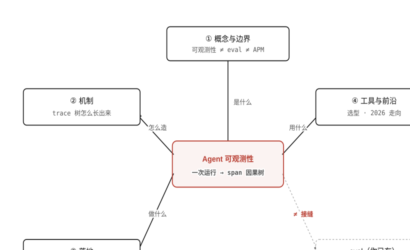

> 图 0 四个内容章都从中心那棵 span 因果树展开。**注意**：右下虚线框的 eval 和本篇都会"用模型看 agent"，但本篇在**运行期**还原单条真实运行、eval 在**开发期**对固定数据集打分——只在"在线评估"那条接缝相交，技术相通、目的与时机完全不同。

### ·怎么读：四条路径

按目的挑一条，不必从头匀速读到尾：

- **只想厘清概念、不被 obs / eval 搞混（推荐）** ：第 1 章 → 第 3 章的"在线评估"一节 → 第 5 章自测的概念层。约 1.5 小时。
- **要给自己的 agent 落地可观测性** ：第 1 章 → 第 2 章（机制）→ 第 3 章（调试 / 监控 / 陷阱）→ 第 4 章选型。
- **做工具选型 / 带读别人的 trace** ：第 1 章（词汇）→ 第 4 章（工具横评）→ 回头补第 2 章机制。
- **准备面试** （"你怎么排查 agent 线上问题 / 控制 token 成本"是高频题）：全程通读 + 第 5 章应用判别题。

### ·目录

- [01概念与边界可观测性 ≠ eval ≠ APM + trace/span 数据模型 + 一个 span 装什么](https://zhiwenliang.github.io/learning/agent-observability/01-concepts.html)
- [02机制：trace 树怎么长出来context propagation · 归因上卷 · instrumentation 三条路 · 标准层](https://zhiwenliang.github.io/learning/agent-observability/02-mechanism.html)
- [03落地：调试·监控·在线评估从失败 trace 找根因 · 报警什么 · obs→eval 接缝 · 投产陷阱四族](https://zhiwenliang.github.io/learning/agent-observability/03-operations.html)
- [04工具与前沿10 工具按原型 · 五条判别轴选型 · 2026 现状与并购](https://zhiwenliang.github.io/learning/agent-observability/04-tools-frontier.html)
- [05自测与辨析三层梯度题库 + 跨章辨析场景 + 亲手画 trace 树](https://zhiwenliang.github.io/learning/agent-observability/05-self-check.html)

### ·学完之后

这篇建立的是"可观测性"的骨架，以下方向各自在它上面加一块：

- **eval（开发期打分）** ：本篇刻意划出去的另一半——回归数据集、LLM-as-judge、校准（ [agent-eval](https://zhiwenliang.github.io/learning/agent-eval/index.html) ）。在线评估就是这两半的接缝。
- **Reflexion / 运行期自纠** ：agent 推理时自己评自己来纠错，和"对生产 trace 打分"是两回事（ [agent-reasoning-patterns](https://zhiwenliang.github.io/learning/agent-reasoning-patterns/index.html) ）。
- **多 Agent 可观测性** ：多个 agent 协作时的 trace 拓扑与归因——比单 agent 多一层"谁该负责"（ [multi-agent-patterns](https://zhiwenliang.github.io/learning/multi-agent-patterns/index.html) ）。
- **工具调用与 MCP** ：tool span 与 trace context 怎么过 MCP 边界（ [tool-use](https://zhiwenliang.github.io/learning/tool-use/index.html) · [mcp](https://zhiwenliang.github.io/learning/mcp/index.html) ）。

### 参考资料

- [OpenTelemetry · Semantic conventions for generative AI systems](https://opentelemetry.io/docs/specs/semconv/gen-ai/)
- [OpenTelemetry · GenAI agent & framework spans](https://opentelemetry.io/docs/specs/semconv/gen-ai/gen-ai-agent-spans/)
- [LangSmith · Observability concepts](https://docs.langchain.com/langsmith/observability-concepts)
- [Langfuse · Data model](https://langfuse.com/docs/observability/data-model)
- [OpenInference · Semantic Conventions](https://arize-ai.github.io/openinference/spec/semantic_conventions.html)
- [W3C · Trace Context](https://www.w3.org/TR/trace-context/)

---

## 01 · 概念与边界：可观测性、eval、APM 三者别再搞混

起点已给出"可观测性 = 把一次运行还原成 span 因果树"的本质；这一章把这棵树的词汇与三方边界装进脑子。

本章你将建立的 schema

- 看到"怎么知道 agent 好不好 / 出没出问题"的讨论，立刻分清它说的是 **可观测性 / eval / APM** ——三者时机、对象、判据全不同。
- 把一次 agent 运行读成一棵 trace： `invoke_agent` 为根， `chat` / `execute_tool` / retriever 为子节点，靠 `parent_span_id` 相连。
- 说得出一个 span 装什么、以及为什么 prompt / completion 放在 `events` （敏感且 opt-in）而不是 `attributes` 。

大多数 SDK 文档的描述是："接入之后你就有 trace 了。"这句话没错，但它跳过了三个真正重要的问题：那棵树由哪些字段构成？它和 eval、APM 的边界在哪？agent 为什么不能直接套传统 APM？本章沿这三条线逐一拆开。

### §1三方边界：可观测性 ≠ eval ≠ APM

三者都是"知道系统在干什么"的手段，但时机、对象、判据完全不同——混用会导致用了工具却解决不了问题。

为什么要把边界划死

工程师最常踩的陷阱：在线上用 eval 的打分思路找根因（得分 0.4，然后呢？），或用 APM 的状态码思路判断 agent 对不对（`200 OK`，但答案是错的）。三方的数据流向和使用时机根本不同，混用只会让每个工具都发挥不出作用。

**三方边界对比**

| 维度 | 传统 APM | 可观测性（本篇） | eval（agent-eval） |
| --- | --- | --- | --- |
| 时机 | 运行期 | 运行期 | 开发期 / CI |
| 对象 | 单请求 | 单条真实运行 | 固定数据集 |
| 判据 | 状态码 + 延迟 | 还原"发生了什么 / 为什么 / 花了多少" | 打分"这版 ≥ 上版吗" |
| 输出 | 仪表盘 / 告警 | span 树 + 每步的 I/O / token / 成本 / 延迟 | 分数 / 通过率 / 回归报告 |
| 参照系 | 确定性系统契约 | 非确定、语义失败可见 | 固定 golden set |

#### APM 的契约在 agent 上为何失效

传统 APM 的核心假设是：**状态码 = 健康信号**。一个 HTTP 服务返回`200`，APM 认为它正常。但 agent 违反这个假设，原因有四条：

- **语义失败对状态码不可见。** 差旅助理 agent 返回 `status 200` ，给员工订了一张票——但这张票违反了差旅政策，或目的地是"巴黎"而正解是"里昂"。HTTP 层没有错，LLM 的推理在语义层出了问题，APM 对此完全盲。
- **非确定性打不了回归断言。** 同一个 prompt，同一个 seed，两次调用的输出未必逐字相同（温度 > 0 时更明显）。APM 期望的"同一请求 = 同一响应"契约不成立，所以不能像传统服务那样对输出做断言。
- **token 与成本是一等信号，APM 从没有。** 一次 `search_flights` 失败触发重试，可能多刷了 4 次 `chat` ，成本翻倍，延迟翻倍——APM 的延迟图看到的是一条慢请求，看不到是哪个子步骤在烧 token。
- **延迟来自外部 I/O，不是 CPU。** agent 的延迟瓶颈 90% 是 LLM 推理（网络 RTT + 首 token 等待时间）和外部工具 API，不是本地计算。火焰图会照出一个巨大的"等待"空循环，找不到可优化的热点——它解决的是 CPU 密集型服务的问题，不是这里的问题。

这四条加在一起，决定了 agent 必须有自己的可观测性——而不是挂一个现成的 APM 就完事。

想一想

某团队的差旅助理 agent 每天跑 500 次，成本监控显示昨天成本涨了 80%，但 Datadog APM 的错误率 / 延迟仪表盘没有任何异常。如果手边有完整的 span 树，第一步该看哪里？

<details>
<summary>展开思路</summary>

首先按`invoke_agent`根 span 排序，找成本最高的那些运行；展开它们的子 span，比较各`chat`span 的`gen_ai.usage.input_tokens`+`output_tokens`；再看`execute_tool`的 span——重试导致同一工具被调多次时，会看到同名`execute_tool`span 并列出现，超过 1 次就说明在重试。APM 看不到这层，因为它没有 token 信号，也没有工具调用的子树结构。

</details>

#### 在线评估：三方的唯一接缝

三者之间存在一条接缝：**在线评估（online evaluation）**。scorer 对采样的生产 trace 打分、把分数写回 trace 成可查询字段，低分 trace 一键提拔进离线数据集，喂回 eval 的回归集——这是可观测性与 eval 相交的唯一点。第 3 章将详细展开；这里只需记住：这是运行期的外部 scorer 对生产 trace 打分，和 agent 推理时自己评自己纠错（Reflexion，属[agent-reasoning-patterns](https://zhiwenliang.github.io/learning/agent-reasoning-patterns/index.html)）完全不同。

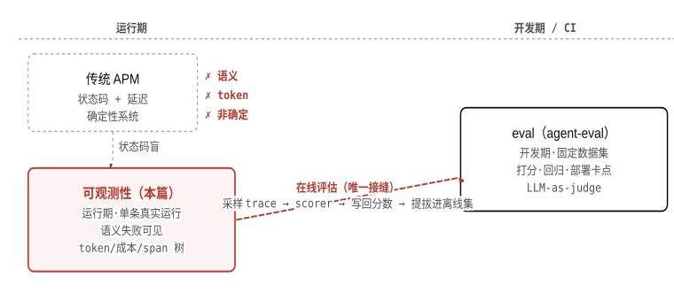

> 图 1.1 三方边界定位图。**注意**：传统 APM 和可观测性都在运行期，但 APM 的判据（状态码）在语义失败、非确定性、token/成本面前全部盲——这三个维度是 agent 可观测性存在的理由。

### §2trace 与 span：数据模型

一次 agent 运行 = 一个 trace（一棵 span 树）；span 是树上的最小工作单元，靠`parent_span_id`相连，没有`parent_span_id`的就是根。

在分布式追踪体系里，**trace**代表一次端到端运行，全局唯一`trace_id`。**span**是 trace 里的一个工作单元，携带以下核心字段：

- `trace_id` ：归属哪次运行（整棵树唯一）。
- `span_id` ：本 span 的唯一标识。
- `parent_span_id` ：父节点的 `span_id` ；根 span 的该字段为空。
- `name` ：操作名，如 `chat` / `execute_tool: search_flights` 。
- `kind` ：OTel 传输层分类（CLIENT / SERVER / INTERNAL），标记调用方向。
- `attributes` ：类型化键值对，携带结构化元数据（如 `gen_ai.request.model` ）。
- `events` ：带时间戳的日志事件，携带大块或敏感内容（如 prompt / completion 文本）。
- `status` ：OK / ERROR + 可选错误消息。
- `start_time` / `end_time` ：用于计算 span 耗时。

这些 span 靠`parent_span_id`形成父子关系，整棵树就是这次运行的执行图——既是时序，也是因果。调试时沿父子链向上回溯，是定位根因的核心动作。

以「差旅助理 Agent」的一次典型运行为例，整棵 span 树如图 1.2 所示：

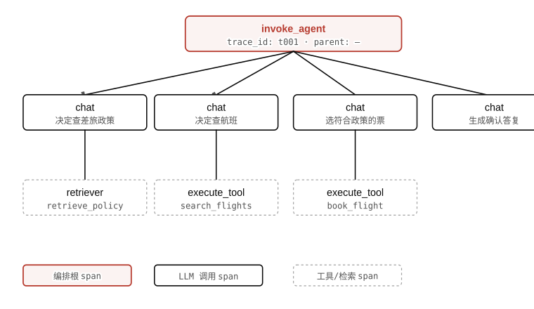

> 图 1.2 差旅助理一次运行的 span 树。**注意**：`invoke_agent`是唯一的根（无`parent_span_id`）；每个`chat`span 决定了下一步该调什么工具，工具 span 挂在对应`chat`下——顺着这棵树就能还原"为什么走这条路"，而日志只能告诉你"走了这条路"。

### §3agent 的 span 层级

OTel GenAI 用*operation name*区分 span 语义（`invoke_agent`/`chat`/`execute_tool`/ retriever）；OpenInference 在 OTel 传输层 kind 之上另加一套语义 kind，两套并存。

OTel 的传输层`kind`（CLIENT / SERVER / INTERNAL）标记的是调用方向，不标记 LLM 操作的语义。GenAI semconv 在`name`字段里用**operation name**来区分语义：

- `invoke_agent` ：编排根，代表一次完整的 agent 运行。v1.41.0（2025-04）将其拆成 CLIENT 和 INTERNAL 两类，以区分跨进程调用与进程内调用。
- `chat` ：一次 LLM 调用（对应 chat completions API）。
- `execute_tool` ：工具调用，名称通常带工具名（如 `execute_tool: search_flights` ）。
- retriever：向量检索，如 `retrieve_policy` 。
- `create_agent` ：agent 实例化（如初始化带工具和系统 prompt 的 agent）。
- `invoke_workflow` ：多 agent 编排时，调用一个下游 agent 或 workflow。

OpenInference（由 Arize 维护）在 OTel 之上加了一套**语义 kind**，放在 span 的`openinference.span.kind`attribute 里，覆盖了 OTel 传输层 kind 无法表达的 LLM 专属语义：

**OTel 传输层 kind vs OpenInference 语义 kind**

| 维度 | OTel kind（传输层） | OpenInference span kind（语义层） |
| --- | --- | --- |
| 放在哪 | `span.kind`枚举 | `openinference.span.kind`attribute |
| 目的 | 标记调用方向（谁发起 / 谁响应） | 标记 LLM 操作语义（这是 LLM 调用 / 工具 / 检索 / 评估…） |
| 取值 | CLIENT / SERVER / INTERNAL / PRODUCER / CONSUMER | LLM / CHAIN / TOOL / RETRIEVER / RERANKER / AGENT / GUARDRAIL / EVALUATOR / PROMPT |
| 标准状态 | OTel 稳定 | OpenInference spec，非 OTel 官方 |
| 后端要求 | 任何 OTel backend | Phoenix 或支持 OpenInference 的 backend |

实务提示

两套并存不冲突：一个 span 可以同时有 OTel`kind=CLIENT`（描述方向）和`openinference.span.kind=LLM`（描述语义）。选哪套取决于后端：接 Phoenix / Arize 时 OpenInference 的 RETRIEVER / EVALUATOR 等 kind 会在 UI 里展开更多语义功能；接任意 OTLP backend 时纯 OTel GenAI semconv 就够用。

### §4一个 span 装什么

`gen_ai.*`attributes 携带模型元数据与 token 计数；prompt / completion 文本放在`events`而不是 attributes——因为敏感、体积大、且 opt-in；成本不在 OTel semconv 里，得厂商自己算。

底层机制：为什么 prompt 在 events 不在 attributes

OTel 的`attributes`被设计为**结构化、低基数、用于过滤与聚合**的键值对；`events`被设计为**带时间戳的日志**，适合携带大块、非结构化或敏感内容。prompt 文本往往数 KB，且含 PII，放进 attributes 会引发三个问题：① 被批量索引到搜索后端，无法细粒度访问控制；② 基数爆炸（每条 prompt 唯一，时序数据库无法聚合）；③ 超出 SDK 默认的 attributes 截断阈值（4–64KB）被静默丢弃。因此 GenAI semconv 把它设计为 opt-in 的 event：默认不采集，工程师主动开启后才写入`gen_ai.input.messages`/`gen_ai.output.messages`两个事件名。

一个典型`chat`span 的 attributes 清单（基于 OTel GenAI semconv v1.41.0，2025-04）：

chat span attributes（JSON 示意）

JSON

```json
{
  "gen_ai.provider.name": "openai",
  "gen_ai.request.model": "gpt-4o",
  "gen_ai.response.model": "gpt-4o-2024-11-20",
  "gen_ai.usage.input_tokens": 1284,
  "gen_ai.usage.output_tokens": 312,
  "gen_ai.usage.reasoning.output_tokens": 0,
  "gen_ai.usage.cache_read.input_tokens": 800,
  "gen_ai.usage.cache_creation.input_tokens": 0,
  "gen_ai.response.finish_reasons": ["stop"],
  "gen_ai.response.time_to_first_chunk": 0.83
}
```

几个关键点：

- `reasoning.output_tokens` ：o1 / R1 类推理模型的额外 token 计数，v1.41 加入。
- `cache_read.input_tokens` / `cache_creation.input_tokens` ：prompt 缓存相关，v1.41 加入；可用于计算实际计费量。
- `time_to_first_chunk` ：流式响应的首 token 等待时间，v1.41 加入；是用户感知延迟的关键指标。
- **成本不在 semconv** ：OTel 不定义 `gen_ai.cost.*` ——有显式 usage 字段时，后端在 ingestion 阶段用 token 数 × 定价表算；没有 usage 字段时用对应 tokenizer 推算。这意味着成本数字在不同工具里可能有细微差异（定价表版本 / tokenizer 精度）。

属性名变更陷阱 · v1.38

OTel GenAI semconv v1.38.0（2024 末）弃用了`gen_ai.prompt`和`gen_ai.completion`两个旧属性名，替换为`gen_ai.input.messages`/`gen_ai.output.messages`事件名。OpenLLMetry 截至 2026-05 仍有遗留 bug（#3515）未完全迁移。接入工具后要检查实际写入的字段名，避免按旧名查询却查不到数据。

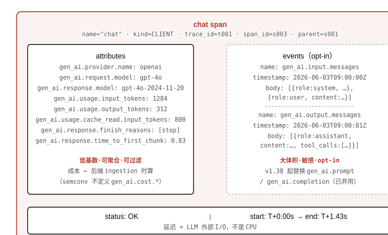

> 图 1.3 一个`chat`span 的解剖。**注意**：prompt / completion 文本在右侧`events`（opt-in，默认不采集）；左侧`attributes`只装低基数的结构化元数据；成本字段不在 span 里——后端 ingestion 时按 token 数 × 定价表计算。

### §5分组与三支柱

多轮对话或跨请求的 session 用`gen_ai.conversation.id`分组；traces / metrics / logs 在 LLM 世界各自变形，但 trace（span 树）是主导。

#### 分组：session / thread / conversation

一个 trace 代表一次请求-响应运行。当一个用户和 agent 进行多轮对话时，多条 trace 需要被归入同一个"会话"——这层分组各平台叫法不同：

**分组概念的跨平台命名**

| 平台 | trace 的叫法 | span 的叫法 | LLM span 的叫法 | 会话分组的叫法 |
| --- | --- | --- | --- | --- |
| OTel GenAI | trace | span | span（operation=chat） | `gen_ai.conversation.id` |
| LangSmith | trace（根 run） | run | llm run | thread |
| Langfuse | trace | observation（span） | generation | session |
| Phoenix/Arize | trace | span | LLM span | session_id |

各平台命名不同，但数据模型本质一致：**会话 = 多条 trace 的逻辑分组**，靠会话 ID 关联。`user_id`/`tags`/`metadata`等业务标注从 trace 级下传到子 span，方便按用户、按功能模块查询。

#### 三支柱在 LLM 世界的变形

可观测性的"三支柱"（traces / metrics / logs）在 LLM 世界各自发生了角色变化：

- **traces 主导。** span 树是执行图，是"为什么"的直接载体。LLM 应用的调试、根因分析、成本归因全靠它。
- **metrics 退化为直方图。** 有意义的 metric 是 `gen_ai.client.token.usage` （token 分布）、 `operation.duration` （操作耗时分布）、 `time_to_first_token` （首 token 等待）。把 prompt 文本或 user-id 当 metric label 会引发基数爆炸（10 万+ 唯一值压垮时序数据库）。
- **logs 降级为 span 上的 events。** 在 OTel 框架下，原来单独存放的日志行（"模型返回 stop"）现在作为带时间戳的 event 附在 span 上，上下文更完整。独立的日志流（print / logging）不再是主要手段。

关键结论

trace 在 LLM 可观测性里的地位，远超传统分布式追踪里的地位。在传统服务里，metric 和 log 可以独立使用；在 LLM agent 里，token 归因、成本追踪、语义失败定位，都需要**父子树结构**才能完成——metric 看到"成本涨了"，trace 才能告诉你"是哪个工具的重试在烧"。

### 自测

先合上教程独立作答，再展开答案对照。

1. 某 agent 返回 `HTTP 200` ，但用户反馈答案是错的。传统 APM 能不能发现这个问题？为什么？

<details>
<summary>展开答案</summary>

传统 APM 无法发现。APM 的判据是状态码（200 = 正常）和延迟（在阈值内 = 正常），它没有"答案对不对"这个维度。语义失败（LLM 给出了错误的内容）对状态码完全不可见——这正是 agent 可观测性存在的理由之一。

</details>
2. 一个 span 的 `parent_span_id` 为空，说明什么？

<details>
<summary>展开答案</summary>

该 span 是 trace 的根 span（root span）。在 agent 的 span 树里，根通常是`invoke_agent`span，代表一次完整的 agent 运行的起点。整棵树的所有 span 共享同一个`trace_id`，根 span 没有父节点。

</details>
3. 为什么 prompt / completion 文本放在 span 的 `events` 里，而不是 `attributes` ？

<details>
<summary>展开答案</summary>

三个原因：①`attributes`被设计为低基数、可聚合的结构化元数据，prompt 文本每条唯一（高基数），放入 attributes 会导致时序数据库基数爆炸；② prompt 往往数 KB 且含 PII，attributes 的批量索引无法做细粒度访问控制；③ SDK 默认会对超出阈值的 attributes 做静默截断，prompt 很可能被丢弃。`events`是带时间戳的日志事件，设计用于大块/敏感内容，且 opt-in（默认不采集）。

</details>
4. LangSmith 把 span 叫 "run"，Langfuse 把 LLM span 叫 "generation"。这两个平台在数据模型层面是否有根本区别？

<details>
<summary>展开答案</summary>

命名不同，但数据模型本质相同：都是 trace（根）→ 中间 span → 叶子 span 的树结构，靠父子 ID 相连，共享 trace_id。LangSmith 的 run / thread 与 Langfuse 的 observation / generation / session 是对同一模型的不同术语包装。选型时关注的应是各自的功能（在线评估 / 数据集管理 / 自托管支持等），而不是命名差异。

</details>

### 参考资料

- [OpenTelemetry · Semantic conventions for generative AI systems](https://opentelemetry.io/docs/specs/semconv/gen-ai/)
- [OpenTelemetry · GenAI agent & framework spans](https://opentelemetry.io/docs/specs/semconv/gen-ai/gen-ai-agent-spans/)
- [LangSmith · Observability concepts](https://docs.langchain.com/langsmith/observability-concepts)
- [Langfuse · Data model](https://langfuse.com/docs/observability/data-model)
- [OpenInference · Semantic Conventions](https://arize-ai.github.io/openinference/spec/semantic_conventions.html)

---

## 02 · 机制：一棵 trace 树是怎么长出来的

上一章装好了 trace / span 的词汇与三方边界；这一章钻进那棵树底下——它不是日志聚合，是 context propagation 造出来的。

本章你将建立的 schema

- 那棵树靠 context propagation（ `traceparent` 串 `parent_span_id` 过 reason→act→observe、异步/流式、多 agent 交接、MCP 边界）造出来； **树不是日志聚合器的事后拼接，而是调用时写入的因果链** 。
- token 与成本的逐 span 归因：每个 span 自记 `gen_ai.usage.*` ；父 span 在关闭时汇总子 span 的数值，形成 trace 级总量； **成本不由 OTel 规范定义，由厂商在 ingestion 时按 usage + 定价表计算** 。
- 在三条 instrumentation 路（进程内 SDK/callback、OTel auto、代理网关）与标准层（OTel GenAI semconv / OpenInference / OpenLLMetry，emitter↔backend 分层非竞争）之间做出有依据的选择。

文档教读者"调 SDK 就能追踪 agent 了"——这是结论，不是机制。这一章回答的是：凭什么一次跨多个 LLM 调用、多个工具、甚至多个独立进程的运行，能被拼成一棵连贯的树？答案不是魔法，是一个 29 字节的 HTTP 头。每一节都按同一套问法解剖：通过什么机制达到目标、因此代价是什么、在什么条件下失效。

### 2.1Context propagation：树怎么被串起来

一棵 trace 树的形成，依赖于每次"调用下一步"时把当前 span 的身份作为 HTTP 头写入请求——这件事叫 context propagation，规范是 W3C Trace Context。

为什么需要它

agent 的一次运行横跨多个函数调用、多个服务、甚至多个进程。如果仅靠日志聚合（按时间戳对齐、靠 user_id 关联），面对并发、异步、重试时就会拼错或拼不上。Context propagation 把"当前 span 属于哪棵树、是树上的哪个节点"这条信息显式写进每个下游调用，因此树的结构在数据产生时就已经确定，不依赖事后的推断或聚合。

#### 底层机制（比文档深一层）

W3C Trace Context 标准（[RFC 2019](https://www.w3.org/TR/trace-context/)）定义两个 HTTP 请求头：

- `traceparent` ：格式 `version-trace_id-parent_span_id-flags` ，共 55 字节。其中 `parent_span_id` 是当前调用者的 span id——下游收到它、把它记为自己的 `parent_span_id` ，树的父子关系就在这一步写入。 `trace_id` 全程不变，保证整棵树共享一个根。
- `tracestate` ：可扩展的厂商键值对（如 Datadog 写入采样决策），不影响 trace 树结构。

agent 的 reason→act→observe 循环里，context propagation 在三处起作用：

1. **同进程内的 LLM 调用** ：SDK 在开始 `chat` span 时，从 context storage（通常是线程/协程局部变量）读取当前的 `traceparent` ，写入 HTTP 请求头。LLM API 返回时 span 关闭，并把 token 计数写入 attributes。
2. **异步/流式工具调用** ：流式响应时，span 在收到第一个 token 时开启（记录 `time_to_first_chunk` ），在流关闭时才结束——这意味着 span 的结束时刻和 HTTP 响应完成时刻对齐，而不是请求发出时刻。异步任务（如通过消息队列触发的工具）需要在消息 payload 里附带 `traceparent` 头，否则子任务的 span 找不到父节点，成为孤儿 span（这是第 3 章 §s34 陷阱 C 族的根源）。
3. **多 agent 交接** ：orchestrator 在把子任务下发给子 agent 时，把当前的 `traceparent` 附在请求或消息里（HTTP 头、消息元数据，或 JSON payload 字段）。子 agent 解析它、用其中的 `parent_span_id` 作为自己根 span 的父，于是子 agent 的整棵子树挂进同一条 `trace_id` 下。从 backend 视角看，这次运行里两个 agent 的工作都在一棵树上，没有断裂。

对于[MCP](https://zhiwenliang.github.io/learning/mcp/index.html)边界，MCP 协议本身不强制携带`traceparent`，但 OTel GenAI semconv 建议在 MCP 调用的 attributes 里附`mcp.session.id`作为 session 级关联键，并在 HTTP transport 层走标准的`traceparent`头。当 MCP server 也被 instrumented 时，server 侧的 span 就能正确继承 client 侧的 trace context，实现跨 MCP 边界的连续树。未被 instrumented 的 MCP server 会产生一段"盲区"——调用发生了，但 server 侧的执行过程不在树上。

类比 · 带边界声明

Context propagation 像电话转接时报一句"这通电话来自 A"——每次转接都把来源标明，接听方记录下来，事后可以还原整条转接链。**边界**：电话里的"来自 A"可以伪造；`traceparent`同样可以被恶意客户端伪造（把自己的 span 挂进别人的 trace），这在多租户 SaaS 场景是真实的安全面——backend 需要按 auth context 隔离 trace，而不是信任`trace_id`本身。

#### 差旅助理演示：两个 agent，一棵树

假设差旅助理 agent（orchestrator）把订票请求里的`book_flight`工具调用，转交给一个独立部署的"预订子 agent"处理。从 trace 结构的角度：

1. Orchestrator 开启 `invoke_agent` span（根， `trace_id = T1, span_id = S0` ）。
2. 它决策后开启 `chat` span（ `parent=S0, span_id=S1` ）调用 LLM，LLM 回复"调 book_flight"，span S1 关闭。
3. Orchestrator 开启 `execute_tool: book_flight` span（ `parent=S1, span_id=S2` ），并在 HTTP 请求里附 `traceparent: ...-T1-S2-01` 。
4. 预订子 agent 收到请求，读取 `traceparent` ，开启自己的 `invoke_agent` span（ `trace_id=T1, parent=S2, span_id=S3` ）。子 agent 内部再产生若干 `chat` / `execute_tool` span，都挂在 S3 下。
5. 子 agent 完成后，所有 span 导出到同一个 backend，按 `trace_id=T1` 查询，拿到完整的一棵树——orchestrator 和子 agent 的工作都在同一视图里，延迟、token、错误可以在树上整体分析。

关键点：**两个 agent 是不同进程、可能是不同语言、甚至不同团队部署的——它们能在一棵树上，唯一的纽带是那个 HTTP 头**。头没传，树就断。

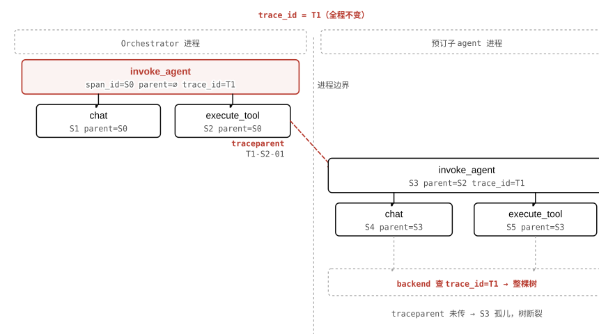

> 图 2.1 差旅助理 orchestrator 与预订子 agent 通过`traceparent`头共享同一`trace_id = T1`，形成跨进程的一棵完整树。**注意**：两个进程里的 span 能连在一起，唯一的机制是那个 HTTP 头——头没传，子 agent 的 span 就找不到父节点，成为孤儿，整段执行在树上消失。

想一想

差旅助理在订票时，LLM 决定先并发调用`search_flights`（机票 API）和`retrieve_policy`（RAG 检索），两个工具调用同时在飞。这时 context propagation 怎么保证两个`execute_tool`span 都挂在正确的父节点下，而不是互相干扰？

<details>
<summary>展开答案（先停 10 秒再点）</summary>

每个`execute_tool`span 在创建时，从**当前调用点的 context storage**（通常是协程的局部变量，Python 里是`contextvars.ContextVar`）读取当前 span 的 id 作为自己的`parent_span_id`。只要两个工具调用都在同一个"决策 span"（某个`chat`span）的执行上下文里创建，它们就都以该`chat`span 为父，互不干扰。

失效条件：如果工具调用被扔进一个新线程或新进程，而没有把当前 context 复制过去（比如用裸`threading.Thread`而非 OTel 的 context-propagating wrapper），新线程就会看到空的 context，导致 span 没有父节点——又是孤儿问题。

</details>

### 2.2归因与上卷：token 和成本怎么汇总到 trace 级

每个 span 自记 billable token；父 span 在关闭时把子 span 的数值加起来；成本不由 OTel 规范定义，由厂商在 span 落库时按 token 数 × 定价表算出。

为什么需要它

一次 agent 运行里可能有 5 轮 LLM 调用，分散在不同的`chat`span 里。如果只看单个 span 的 token，无法回答"这次请求总共烧了多少钱"；如果只看 trace 级汇总，无法定位是哪个 LLM 调用是成本大户。归因（per-span 记录）+ 上卷（父汇子）这两步合在一起，才让"整体视图"和"根因定位"同时成立。

#### 底层机制（比文档深一层）

OTel GenAI semconv 规定 LLM span（kind =`chat`）在 span 关闭时写入以下 attributes（v1.41.0，2025-04）：

- `gen_ai.usage.input_tokens` ：本次调用的输入 token 数，是 API 响应里的 **billable count** （不是估算）。
- `gen_ai.usage.output_tokens` ：输出 token 数。
- `gen_ai.usage.reasoning.output_tokens` ：o1 / R1 类模型的思维链 token（v1.41 新增，也是 billable 的，但许多看板会漏掉它）。
- `gen_ai.usage.cache_read.input_tokens` / `cache_creation.input_tokens` ：Anthropic / OpenAI 的 prompt cache 对应的 token 数，通常定价更低——要分开记才能算对成本。

父 span（如`invoke_agent`）通常**不直接调用 LLM**，它的 token 数是子 span 的汇总。实现方式有两种：① SDK 在父 span 关闭时自动遍历子 span attributes 求和（OpenInference / Phoenix 这条路）；② backend 在 ingestion 时做聚合（LangSmith / Langfuse 这条路，backend 存储结构化 span 树后，查询 API 提供 trace 级聚合视图）。两种方式的结果相同，区别是聚合发生在 SDK 侧还是 backend 侧。

#### 成本为什么不在 OTel 规范里

这是最容易让工程师感到困惑的地方。OTel GenAI semconv（截至 2026-06）**没有**`gen_ai.cost.*`属性——规范只记 token 数，不记钱。原因是：token 数在 API 响应里是确定的，而同样 token 数的价格在不同账户（有无企业折扣）、不同时间（厂商调价）、不同模型（同厂商不同版本）下都可以不同。把定价逻辑写进规范会让规范追着每次厂商调价跑，所以留给厂商在 ingestion 时算。

实际上，可观测性 backend 在接收到 span 时，会用以下公式在服务端实时计算：

cost-ingestion-pseudo

pseudo

```python
# backend ingestion 时执行，不在 SDK 侧
if span.attributes.get("gen_ai.usage.input_tokens"):
    input_tok  = span.attributes["gen_ai.usage.input_tokens"]
    output_tok = span.attributes["gen_ai.usage.output_tokens"]
    model      = span.attributes["gen_ai.request.model"]
    # 用内置的 tokenizer + pricing table 算
    cost = price_table[model]["input"] * input_tok / 1_000_000 \
         + price_table[model]["output"] * output_tok / 1_000_000
    span.derived["cost_usd"] = cost  # 写回，可查询但不在 OTel 协议里
# 若 span 没有 usage（未 instrumented），则用 tokenizer 估算
```

代价：当厂商没返回 usage（旧 API 或代理拦截后 usage 字段丢失）时，backend 只能用 tokenizer 估算 input，output 则无法在调用前预知，只能在收到响应后重新 tokenize——这层估算有 ±5% 左右的误差，且不计 cache 折扣，导致成本多算。这也是为什么"看 LangSmith 的成本数字和实际账单有出入"——两者用的是同一 token 数据，但定价快照时间点不同，或折扣信息没有同步。

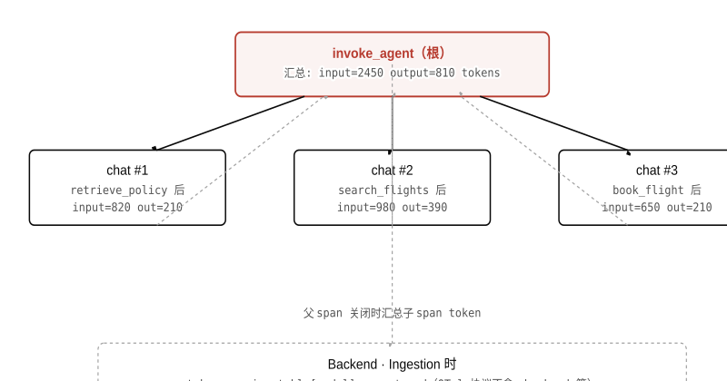

> 图 2.2 差旅助理三轮 LLM 调用的 token 在各自`chat`span 里归因，父`invoke_agent`span 汇总后送 backend，ingestion 时乘以定价表得出`cost_usd`。**注意**：`cost_usd`不是 OTel 协议字段，是 backend 的派生字段——这意味着不同 backend 的成本数字可以因定价快照时间点不同而出现差异，不代表 token 数据有误。

### 2.3Instrumentation 三条路：各自看得见什么

给 agent 加遥测代码有三条路——进程内 SDK/callback、OTel auto-instrumentation、代理网关——它们对代码的侵入程度不同，因此能看见的东西也不同。

为什么需要它

不同团队、不同栈、不同约束下，"怎么把遥测加进去"有本质区别。理解三条路各自的可见性边界，才能在"加了 SDK 但看不到想要的数据"时知道是哪条路的结构性限制，而不是配置问题。

#### 底层机制（比文档深一层）

**① 进程内 SDK / callback（代码侵入型）** 以 LangChain 为例：框架在每次 LLM 调用前后触发`on_llm_start`/`on_llm_end`回调，SDK（如 LangSmith 的 tracing SDK）在这两个钩子里创建/关闭 span，并从回调参数里取 prompt、completion、token 数。**可见范围**：所有框架内部的状态——token 数、prompt 内容、工具名称、中间推理步骤、用户自定义的 metadata。**看不见**：进程外的调用（如子 agent 在另一进程里）、框架没有暴露回调的内部操作（如某些自定义 chain 不触发标准回调）。**代价**：代码与框架/SDK 深度耦合；换框架时要重写 instrumentation；如果 SDK 有 bug（如 OpenLLMetry 的 issue #3515：`on_llm_end`回调里遗留旧的`gen_ai.prompt`属性名而非 v1.38 弃用后的`gen_ai.input.messages`），需要等 SDK 修复才能修正数据。

**② OTel auto-instrumentation（声明式）** OpenLLMetry（Traceloop）和 OpenInference（Arize）这类 emitter 库的工作方式：在进程启动时 monkey-patch 目标库（如`openai.ChatCompletion.create`），在 patch 里插入 span 的开启/关闭逻辑，通过 OTel SDK 导出到任意 OTLP 兼容 backend。**可见范围**与①基本相同——因为同样在进程内，能拿到 prompt、token、工具参数。**额外优点**：通过 OTLP 导出，backend 可以自由切换；一行`traceloop.init()`就覆盖多个框架。**看不见**：与①相同的跨进程盲区；另外 monkey-patch 在框架升级后可能失效，需要 emitter 库同步更新（这是 OpenLLMetry 捐给 OTel 停滞期间的实际痛点——两套属性名并存，用`gen_ai.prompt`还是`gen_ai.input.messages`，不同版本的 emitter 给出不同答案）。

**③ 代理网关（HTTP 路径拦截型）** 在 LLM API 调用的 HTTP 路径上架一层反向代理（如 Helicone，或自建 LiteLLM proxy），拦截请求/响应并记录。**可见范围**：HTTP 请求/响应本身——模型名、请求体（prompt）、响应体（completion）、latency、HTTP 状态码。**结构性看不见**：进程内的推理状态——agent 在这次调用前做了什么决策、选了哪个工具、工具返回了什么、检索召回了哪些文档。代理只看到进出 LLM API 的 HTTP 流量，进程内的一切对它是黑盒。因此，代理网关适合"成本与 latency 监控"，不适合"调试 agent 决策链"。**代价**：额外一跳的网络延迟（通常 1–5ms）；网关本身成为单点；Helicone 2026-03 被 Mintlify 收购转维护模式，新项目应评估 LiteLLM proxy 或云厂商 AI gateway 作替代。

**新兴第四条：eBPF 进程外追踪（AgentSight，2025）** 通过 Linux eBPF 在内核层钩住进程的 TLS socket，在不修改应用代码的情况下抓取 LLM API 的 HTTP/2 流量。**优点**：防篡改（应用层代码无法关掉它），对已部署的旧代码零侵入。**同样看不见进程内推理状态**——能看到的和代理网关类似，是 HTTP 层的 I/O，不是 agent 决策链。目前（2026-06）仍是研究原型，生产可用性未知，仅应了解这条路的存在和原理。

**三条 instrumentation 路对比**

| 维度 | 进程内 SDK/callback | OTel auto-instrument | 代理网关 |
| --- | --- | --- | --- |
| 代码侵入 | 高（需引入 SDK、配置回调） | 低（一行 init） | 零（改网络路由） |
| 能看进程内状态 | 是（token、prompt、工具参数、推理步骤） | 是（同上） | 否（仅 HTTP 层 I/O） |
| backend 可换 | 取决于 SDK 是否输出 OTLP | 是（OTLP 原生） | 否（锁定网关产品） |
| 失效模式 | 框架升级破坏回调；SDK bug 产生错误属性名 | monkey-patch 失效；两套属性名并存 | 网关故障 = 全量不可用；看不见决策链 |
| 适合场景 | 需要完整决策链可见性 | 多框架 + 灵活换 backend | 仅要成本/latency 数字，零代码改动 |

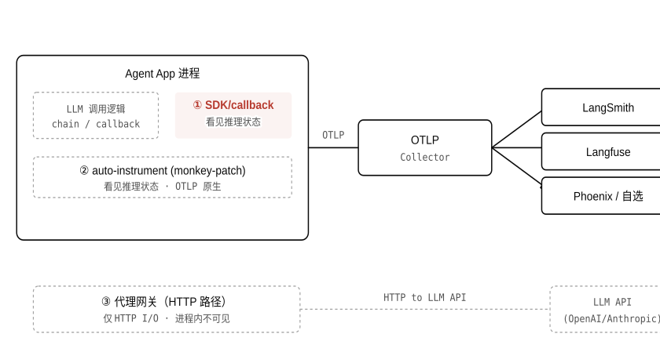

> 图 2.3 三条路相对 app 的位置，以及 emitter→OTLP→backend 分层架构。**注意**：进程内 SDK 和 auto-instrument（①②）都走 OTLP，backend 可以自由选择；代理网关（③）把 HTTP 数据记进自己的 backend，换网关就换了整套数据存储——锁定风险在路③，不在路①②。

### 2.4标准层：emitter ↔ backend，分层非竞争

OTel GenAI semconv、OpenInference、OpenLLMetry 不是三个竞争方案，而是同一技术栈的三层——emitter 库负责产生 span，OTLP 是传输协议，backend 负责存储与展示；锁定风险在 backend 层，不在 emitter 层。

为什么需要它

工程师在比较"用 LangSmith 还是用 OpenInference"时，常常混淆了层次：LangSmith 是 backend，OpenInference 是 emitter 规范，两者不在同一层。理清分层，才能做出有依据的选型，而不是跟着厂商的营销材料走。

#### 底层机制（比文档深一层）

三层的定义与职责：

- **OTel GenAI semconv** （ `gen_ai.*` ）：OpenTelemetry 社区维护的语义约定，规定 LLM span 应该用哪些 attribute 名、值的格式是什么。状态是 **Development** （2025 年前叫 Experimental），意味着属性名仍在变动（v1.38 弃用 `gen_ai.prompt` ，v1.41 拆 `invoke_agent` ）。这一层规定"叫什么名字"。
- **OpenInference** （Arize 维护， `openinference.*` ）：OTel 的 **超集** ——它在 `gen_ai.*` 之上额外定义了 LLM / CHAIN / TOOL / RETRIEVER / RERANKER / AGENT / GUARDRAIL / EVALUATOR / PROMPT 等 span kind，以及检索文档、eval 结果等字段。 `openinference.*` 属性可以和 `gen_ai.*` 共存在同一 span 里。backend 侧的 Phoenix 原生消费 OpenInference，但它也能通过 normalization 层接收纯 OTel GenAI span。
- **OpenLLMetry** （Traceloop 维护）：一个 **emitter 实现库** （Py/TS/Go/Ruby），用 OTel SDK 的 API 产生符合 OTel GenAI semconv 的 span，然后通过 OTLP 导出到任意 backend。Traceloop 于 2025-02 提交将 OpenLLMetry 捐给 OTel 社区的 PR，截至 2026-06 仍未 merge（14+ 个月停滞），两套约定仍并存，实务上靠 backend 的 normalization 层映射。

类比 · 带边界声明

这个分层像[MCP](https://zhiwenliang.github.io/learning/mcp/index.html)和 LSP 解决 M×N 问题的思路：M 个 agent/框架 × N 个 backend，不加中间层就是 M×N 个集成；加了 OTLP 这层标准传输，变成 M 个 emitter + N 个 backend，只需各自对齐协议。**边界**：MCP 和 LSP 的 M×N 问题由协议直接解决；OTel GenAI 的问题在于*语义*（attribute 名）还未收敛——OpenInference 和 OTel GenAI 仍是两套命名，normalization 层只是 workaround，不是真正的 M×N 消除。

#### 为什么捐赠停滞是实务问题

OpenLLMetry 捐赠停滞意味着：OpenLLMetry 在 Traceloop 仓库里用一套属性名产出 span，OTel 社区的 GenAI semconv 在演进时用另一套属性名，两者之间没有官方 mapping。工程师面对的现实是：同一个 trace，如果用 OpenLLMetry 0.28.x 产出，某些字段还是`gen_ai.prompt`（v1.38 前的旧名）；如果用更新的 emitter，字段是`gen_ai.input.messages`。backend 需要同时处理两种 schema 才能正确聚合历史数据——这正是 OpenLLMetry issue #3515 的背景。**因此判断锁定风险的正确视角是：emitter 可以相对自由地换，但 backend 决定了你的历史 trace 数据存在哪、用什么 schema 查，这才是真正的换出成本所在**。

想一想

一个团队在用 LangChain + OpenLLMetry 把 trace 导入 Langfuse，现在考虑迁移到 Phoenix。他们问："emitter 要换吗？"——回答这个问题前，需要先区分哪两件事？

<details>
<summary>展开答案（先停 10 秒再点）</summary>

需要区分**emitter**（OpenLLMetry，负责在进程里产生 span 并通过 OTLP 导出）和**backend**（Langfuse → Phoenix，负责接收、存储、展示 span）。

迁移到 Phoenix 是换*backend*，不是换*emitter*。OpenLLMetry 通过 OTLP 导出，只需把 OTLP endpoint 从 Langfuse 换成 Phoenix 即可，emitter 代码不用动。需要评估的是：Phoenix 的 schema 和 Langfuse 的 schema 是否有差异（OpenInference vs OTel GenAI），历史数据能否平滑迁移，以及 Phoenix 的 normalization 层对 OpenLLMetry 产出的`gen_ai.prompt`旧属性名有没有兼容处理。

</details>

### §本章 self-check

先合上教程把答案写下来，再展开对照——直接展开等于把这节当再读一遍。

1. W3C `traceparent` 头里有四个字段： `version` 、 `trace_id` 、 `parent_span_id` 、 `flags` 。当差旅助理 orchestrator 把任务交给预订子 agent 时，子 agent 收到这个头，用其中哪个字段的值做什么操作，才能让两个 agent 的 span 落在同一棵树上？
2. OTel GenAI semconv 规定了 `gen_ai.usage.input_tokens` ，但 **没有** `gen_ai.cost.*` 。说出两个具体原因，解释为什么把成本定义进规范在工程上行不通。
3. 代理网关（Helicone 类）和进程内 SDK 相比，有一个结构性的"看不见"——不是配置问题、而是架构决定的。描述这个盲区，并给出一个具体场景，说明这个盲区在实务里会造成什么后果。
4. 一个工程师断言"OpenInference 和 OTel GenAI 是竞争关系，二者必须择一"。这个说法哪里错了？用分层视角重新描述它们的关系。

<details>
<summary>答案（先做完再展开）</summary>

1. 子 agent 用 `parent_span_id` 的值作为自己根 span 的 `parent_span_id` ，同时把 `trace_id` 原样复制到自己根 span 的 `trace_id` 。这两步一起做，子 agent 的根 span 就挂进了 orchestrator 发起的那棵树（共享 `trace_id` ），并且父子关系指向 orchestrator 里发起这次交接的那个 span。缺一步都会导致树断裂。
2. 两个原因：① **定价因账户而异** ——同样 token 数，有企业折扣的账户和 Pay-as-you-go 账户价格不同，规范无法把这个变量固化；② **定价随时间变化** ——厂商会调价（OpenAI 历史上多次降价），如果规范里写了价格，规范就要跟着每次调价更新，把规范委员会变成了定价跟踪器。此外还有第三个：cache/reasoning token 的折扣比例各厂商不同，统一定义不现实。
3. 代理网关只能看到 HTTP 层的 I/O（请求体、响应体、status code、latency），看不到进程内部的推理状态。具体场景：agent 在调用 LLM 之前，先做了一次 RAG 检索召回了 3 份文档，然后把这 3 份文档拼进 prompt 再调 LLM。网关看到的只是那次 LLM 调用的请求/响应，检索结果拼进 prompt 这件事对网关不可见。如果 agent 输出错误，调试者在网关日志里看不出"是哪份检索文档带偏了 LLM"——这正是代理网关适合"成本监控"但不适合"决策链调试"的原因。
4. 这句话混淆了层次。OpenInference 是 OTel 的 **超集** ，不是竞争者： `openinference.*` 属性附加在同一个 span 上，和 `gen_ai.*` 共存，而不是替换它。它们的关系是"OTel GenAI 规定基础 LLM span 字段 → OpenInference 在此之上补充检索/eval/agent kind 等额外字段"。真正的选择不是"选哪套 semconv"，而是"选哪个 backend"（Langfuse 偏向 OTel GenAI，Phoenix 偏向 OpenInference），以及"选哪个 emitter"（OpenLLMetry 产出 OTel GenAI，OpenInference 的 Python SDK 产出 OpenInference）——这两个选择是独立的。

</details>

### 参考资料

- [W3C · Trace Context](https://www.w3.org/TR/trace-context/)
- [OpenTelemetry · GenAI agent & framework spans](https://opentelemetry.io/docs/specs/semconv/gen-ai/gen-ai-agent-spans/)
- [OpenTelemetry · Semantic conventions for generative AI](https://opentelemetry.io/docs/specs/semconv/gen-ai/)
- [Langfuse · Data model](https://langfuse.com/docs/observability/data-model)
- [OpenLLMetry GitHub](https://github.com/traceloop/openllmetry)
- [OpenInference · Semantic Conventions](https://arize-ai.github.io/openinference/spec/semantic_conventions.html)

---

## 03 · 落地：调试、监控、在线评估，与投产陷阱

前两章把 trace 树的词汇和生成机制讲透了；这一章是拿这棵树做事——它不是被动看板，是驱动调试、监控、在线评估的闭环，以及投产时真正咬人的陷阱。

本章你将建立的 schema

- 拿到失败 trace 沿父子链定位是哪个 span 产出坏输入； **中间状态** （工具输出、检索上下文、路由决策）才是关键证据；replay 目前多是手动重建渲染过的 prompt 加参数。
- 说得出生产该报警什么（cost/run、p95 延迟与 TTFT、错误率、工具失败率），以及这几个数在 LLM 语境下和传统 APM 的含义差异。
- 认得"在线评估"这条 obs→eval 唯一接缝——外部 scorer 对采样生产 trace 异步打分、写回、提拔低分进离线集；不与 Reflexion（agent 推理时自评纠错）混淆。
- 识别投产四族陷阱，尤其 **推理链 PII 泄漏** 与 **朴素头部采样丢掉罕见 bug** 这两条最隐蔽的失败模式。

第二章解释了那棵 trace 树不是日志聚合、是 context propagation 造出来的因果结构。这一章的问题是：拿到一棵树之后，工程师到底做什么？文档给的答案是"打开看板"——本章要回答更深一层：一条 trace 摆在面前，怎么从它读出根因；该盯哪几个数能早于用户发现问题；哪条接缝把可观测性和[eval](https://zhiwenliang.github.io/learning/agent-eval/index.html)连起来；以及哪些看起来合理的做法会在三个月后炸。

### 3.1从一条失败 trace 做根因回溯

面对一条 status=OK 却答错的 trace，根因不在叶子 span，在某个中间 span 的输出污染了后续所有决策。

为什么比文档深一层

文档教读者"点开 span 看属性"。根因调试的真正难点是：agent 的失败往往不是哪个 span 抛了异常，而是**某个 span 产出了语义上坏的输出**——工具返回错误价格、检索召回了无关政策条文、路由 LLM 选错了下一步——后续所有 span 都在这个错误前提上继续推进，直到最终输出，整棵树 status 全是 OK。只有把中间状态（工具输出、检索上下文、路由决策）都存进 span 的 events 或 attributes，才能沿父子链逐级审讯"这一步收到了什么、产出了什么"。

#### 沿父子链逐级回溯

回溯从最终答复 span（根的直接子）开始，向上沿`parent_span_id`追溯，每一级检查三件事：

1. **输入来自哪里** ：该 span 的输入是上一级哪个 span 的输出？若输入已经是错的，根因不在这里。
2. **中间状态是否存下来** ：工具输出、检索到的文档、路由决策用哪个工具，这些是编排层的关键状态。若没被记录进 span，这一层就是盲区。
3. **这个 span 的状态与实际输出是否一致** ： `status=OK` 只说明调用本身没抛异常，不说明输出语义正确。

找到"第一个产出坏输出的 span"就是根因 span。从那里往下，所有 span 都只是在传播那个错误，修根因才能解决问题，修下游 span 是治标。

#### 差旅助理「成本翻 3 倍」案例

用第二章介绍的差旅助理 agent 具体走一遍。用户看到账单：这次出差订票的 API 调用花费是过去平均值的 3.1 倍。trace 打开，`invoke_agent`根 span 下有 9 个`chat`span，正常运行只有 5 个。

沿`parent_span_id`从第 5 个`chat`span 开始往上看：

- 第 3 个 `chat` span 决定调用 `search_flights` ——这个 `execute_tool` span 的 status 是 `ERROR` ， `gen_ai.response.finish_reasons` 不在这里，但工具 span 的 `status.message` 记录了"航班 API 超时，返回 504"。
- LLM 没有收到重试指令（路由决策 span 没有存下当时 LLM 的推理），却在随后 4 轮 `chat` span 里各有一次 `search_flights` 调用，每次都返回 504，每次 LLM 重新生成了一段新的 prompt 再试。
- 4 次额外 `chat` span 的 `gen_ai.usage.input_tokens` 加起来约等于原来 5 次运行的 token 总量——成本翻倍的原因找到了： `search_flights` 失败触发了 LLM 自发的重试循环，每次重试把整段对话历史再喂一遍，token 线性叠加。

根因 span 是第一个失败的`execute_tool: search_flights`。修法不是改 LLM prompt，而是在工具层加幂等重试上限，或在编排层注入明确的"已重试 N 次，中止"指令。

#### Replay：手动重建中间状态

Replay（"从这一步重跑"）在 agent 领域的现实是：因为 LLM 输出非确定，replay 不等于完全重现，而是**手动重建**——把存下来的 rendered prompt（完整渲染后的消息列表）+ 采样参数（temperature / seed）+ 工具响应原文，按顺序重新喂给模型，从那个 span 之后重新推进。

不存下 rendered prompt 和工具响应原文，replay 就无从做起。这正是第四节投产陷阱 D 族"可重建"的核心——非确定杀死复现，不存下逐字 rendered prompt 的系统在第 3 步之后就发散。

#### Good vs bad run diffing

另一个定位根因的手段是把一条失败 trace 和一条成功 trace（同类任务）并排对比：相同层级的 span，token 数差了多少、哪个工具输出在结构上不同、哪个`chat`span 的`gen_ai.response.finish_reasons`从`stop`变成了`length`（说明 LLM 在那里被截断）。这种 diffing 在 LangSmith / Langfuse 里都有 UI 支持；逻辑上等同于把两棵 span 树做结构性 diff，定位哪条边开始分叉。

想一想

差旅助理的失败 trace 里，`search_flights`工具 span 的 status 是 ERROR，但根`invoke_agent`span 的 status 是 OK。工程师第一眼看 trace 列表时，会不会漏掉这条 trace？原因是什么，怎么防？

<details>
<summary>展开答案（先停 10 秒再点）</summary>

漏掉的概率很高。trace 列表通常按根 span 的 status 筛选和排序，而根 span OK 说明整条 trace "完成了"——agent 最终给了用户一个答复。子 span 的 ERROR 被根 span 的 OK 掩盖，只有点进去才看得见。

防法有两条：① 在告警规则里加`tool_failure_rate`（见 §3.2），只要任意子 span 出现 ERROR 就计入，不依赖根 span status。② 工具层出错时，编排逻辑应把错误事件也写进根 span 的 events，或把根 span status 设为 ERROR。这是"只记 what 不记 why"陷阱（§3.4 ⑦）的典型表现。

</details>


> 图 3.1 差旅助理"成本翻 3 倍"案例的失败 trace 根因回溯。朱红高亮的`search_flights`span 是根因，右侧重试循环框内每次都把全量对话历史重喂给 LLM。**注意**：根`invoke_agent`span status=OK——不看子 span 的工具失败率，这条 trace 根本不会进告警视野。

### 3.2生产监控：该报警什么

传统 APM 的四个黄金指标（延迟、流量、错误率、饱和度）在 LLM 世界全部变形，工程师需要一套新的基准数集。

为什么比文档深一层

文档告诉读者"监控 latency 和 token"。真正的难点是：这些数在 LLM 语境下的含义与传统服务完全不同。**延迟的主体是外部 I/O**（等 LLM 返回、等工具 API），不是 CPU——火焰图没用；**错误率里最危险的一类不会抛异常**（工具 504 后 LLM 自发重试，整条 trace status=OK）；**成本**不是 APM 的概念，而是每条 trace 的一等信号。如果没理解这些变形，把传统告警阈值搬过来就会产生大量误报和漏报。

#### 四条核心告警指标

**① cost/run（每次运行的总成本）**：用`gen_ai.usage.input_tokens`/`output_tokens`上卷到 trace 级后乘价格表计算。这是 APM 从没有的信号。告警阈值建议按历史 p90 × 2 设，超出即触发调查——差旅助理那次"成本翻 3 倍"在这里就能被抓住，不需要等用户投诉。**注意**：OTel GenAI semconv 不定义`gen_ai.cost.*`，成本由各厂商在 ingestion 时自行计算（见第二章机制）；告警规则要在 backend 里写，不能靠 span 属性直接报。

**② 延迟 p95 与 TTFT**：p95 端到端延迟衡量"最慢的那部分用户"体验。TTFT（time to first token，在 span 里是`gen_ai.response.time_to_first_chunk`，v1.41.0 加入）衡量"用户等到第一个字"的感知延迟——流式场景里这个比总延迟更重要。这两个数的飙升通常指向：外部 API 变慢（工具超时叠加）、输入 token 数膨胀（全量历史重喂）、或检索层变慢（向量库冷启动）。火焰图对这三种原因都帮不上忙，只有 span 粒度的延迟才能定位到底是哪一跳慢了。

**③ error rate（异常错误率）**：span 级 status=ERROR 的比率。但 §3.1 揭示了一个陷阱——工具失败不一定反映在根 span status 上。正确的做法是分两层报警：根 span error rate（trace 彻底失败）+ 任意子 span error rate（工具/检索层出了问题但 agent 试图恢复）。后者若高但前者低，恰恰说明 agent 在悄悄重试、用户不知道、但成本和延迟都在升。

**④ tool-failure rate（工具失败率）**：`execute_tool`span 中 status=ERROR 的比率，按工具名分组（`search_flights`/`book_flight`/…）。这个数在传统 APM 里没有对应物，但对 agent 最有诊断价值——工具层是 agent 连接外部世界的边界，它的失败模式直接决定 agent 的重试行为和成本爆炸。告警粒度建议按具体工具名设阈值，不要只看总体。

**LLM 可观测性 vs 传统 APM · 四个黄金指标的变形**

| 传统 APM 指标 | LLM 世界的变形 | 为什么不同 |
| --- | --- | --- |
| 延迟（p99） | p95 端到端 +**TTFT** | 主体是外部 I/O（LLM/工具），不是 CPU；流式场景首 token 比总延迟更关键 |
| 错误率（5xx） | **根 span 错误率 + 子 span 工具失败率** | 工具 504 后 LLM 自发重试，根 span 可能是 200 OK；语义失败不抛异常 |
| （无） | **cost/run** | LLM token 是直接成本；重试循环、历史膨胀会让成本指数级上升 |
| 饱和度（CPU/内存） | （工具 API 的）**下游限流率** | agent 的瓶颈在外部 API，不在本地进程；火焰图对此无能为力 |

#### 采样策略与告警的关系

这里需要预告 §3.4 会展开的陷阱：告警是建立在采样数据上的，如果采样策略选错（均匀 10% head sampling），工具失败率 22% 的实际问题在采样后只剩 9%，很可能低于阈值不触发。**错误感知告警需要基于尾部采样**（tail-based sampling，按 span 树最终 status 决定保留哪些 trace）——失败 trace 100% 保留，成功 trace 稀疏采样。这不是可观测性平台的默认配置，需要工程师主动设置。

### 3.3在线评估：obs 与 eval 的唯一接缝

在线评估是把生产 trace 采样后异步打分、写回、再提拔进离线集的闭环——它是可观测性流入 eval 的那条单向管道。

为什么这条接缝重要

可观测性记录"发生了什么"；eval（[agent-eval](https://zhiwenliang.github.io/learning/agent-eval/index.html)）回答"这版比上版好吗"——两者的数据流本来是分开的。在线评估是唯一把两者连起来的机制：它在生产 trace 上跑 scorer，把分写回 trace，低分 trace 一键提拔进离线数据集。没有这条管道，离线集只能靠人工标注扩充，而生产里真正困难的 case 永远不会被发现。

#### 底层机制（比文档深一层）

在线评估有五个步骤，每一步都有自己的工程考量：

1. **采样生产 trace** ：不对全量 trace 打分——规模一大，scorer 本身就是成本。典型比例 1–10%，但要用 **分层采样** ：低分区域（过去 scorer 认为有问题的 trace）多采，高分区域少采。均匀采样在 bug 密度低时会漏掉几乎所有失败 trace。
2. **异步 scorer** ：scorer 在 trace 落库后 **异步** 运行，不阻塞热路径。scorer 可以是 LLM-as-judge（调另一个 LLM 评价当前 trace 的输出质量）、规则 scorer（检查订的航班是否在差旅政策的价格范围内）、或人工标注的 golden-answer 比对。多个 scorer 可并行跑，结果分别写回。
3. **把分写回 trace** ：scorer 的结果写成 trace 的 metadata 字段，可查询可聚合。Langfuse 把这个叫做 `score` 对象（带 `name` / `value` / `comment` ），LangSmith 叫 `feedback` 。写回后，低分 trace 可以在 UI 里用 score 字段过滤，直接跳到"这批 trace 里最差的那 5%"。
4. **低分提拔进离线集** ：一键把低分 trace 加进离线数据集，带上 scorer 的分和评论作为标注。下次迭代模型或 prompt 时，这批 case 进入回归集，防止下一版复现同样的失败。
5. **喂回 agent-eval** ：离线集里的 trace 经过 curated 成为固定 dataset，进入开发期的离线 eval 流程。这是可观测性流入 [agent-eval](https://zhiwenliang.github.io/learning/agent-eval/index.html) 的那条管道——此后就交给 agent-eval 处理了，不在本章重讲。

区分两个易混概念

**在线评估（本节）**：外部 scorer 对采样的生产 trace 异步打分，写回 trace 字段，供监控和数据集扩充使用。时机=运行结束后异步；主体=外部评估系统；目的=监控 + 发现 bad case。

**Reflexion / 运行期自纠**（[agent-reasoning-patterns](https://zhiwenliang.github.io/learning/agent-reasoning-patterns/index.html)）：agent 在推理时自己评自己来纠错，把失败翻译成语言教训写进记忆，下轮读回。时机=推理过程中；主体=agent 本身；目的=改善当次推理质量。

两者都用到"评分/判断"，但接入点、主体、目的完全不同。在面试或方案评审里，把在线评估说成 Reflexion（或反过来）是常见的混淆点。

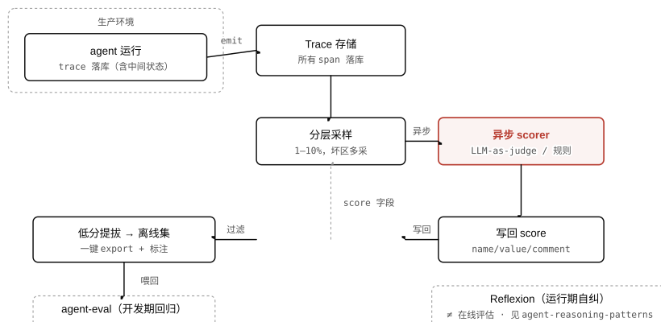

> 图 3.2 在线评估闭环：生产 trace → 分层采样 → 异步 scorer → score 写回 trace → 低分提拔进离线集 → 喂回 agent-eval。右下虚线框是常被混淆的 Reflexion，时机和主体都不同。**注意**：scorer 必须**异步**跑，同步跑等于给热路径加延迟；采样必须**分层**，均匀采样会漏掉几乎所有低频失败 case。

### 3.4投产陷阱四族

可观测性的陷阱不在"接不上"，在"接上了却在三个月后以另一种方式炸"——四族陷阱对应隐私、成本、可见性、可重建四个维度。

为什么列这四族

教科书通常只讲"加可观测性的好处"。真实情况是：一套天真搭建的可观测性系统本身会带来新的风险——trace 库变成了 GDPR 受管仓库、可观测性账单比服务本身更贵、采样策略把最需要看的 bug 丢掉、span 截断让事后复盘建立在残缺证据上。四族框架把 10 条具体陷阱归类，让工程师在设计阶段就能逐族检查。

#### A 族 · 隐私

**陷阱 ①：prompt/工具 I/O 逐字进第三方 SaaS**。把`gen_ai.input.messages`/`output.messages`（opt-in events）全量发给 LangSmith、Langfuse 这类 SaaS，等于把用户的每一条输入、agent 的每一段推理、工具返回的每一行数据，都送进了第三方服务器。如果业务涉及医疗、金融、法律，这等于在没有用户知情的情况下建了一个 GDPR/HIPAA 受管的数据仓库。修法：把含 PII 的 events 在 emit 前做 redaction，或只发脱敏版本；对敏感业务考虑自托管 backend。

**陷阱 ②：推理链 PII 泄漏（比 ① 更隐蔽）**。大模型在 chain-of-thought / reasoning 里会把上下文里的 PII 自然地"用上"——哪怕最终输出已经干净，中间推理步骤里可能出现用户姓名、身份证号、地址。AgentLeak 类研究（EMNLP 2025）证明了这条泄漏路径：输出级脱敏抓不到推理链里的 PII，因为 reasoning tokens 在 v1.41.0 以`reasoning.output_tokens`形式记录在 span 里，若不对这部分单独处理，脱敏就是半截子工程。

陷阱 · 推理链 PII 泄漏

对生产 trace 做脱敏时，只对`gen_ai.output.messages`（最终输出）做处理是不够的。带推理步骤的模型（o1/R1 类）的中间思维链同样可能包含 PII，且在 OTel semconv v1.41.0 里这部分以`reasoning.output_tokens`独立字段出现。对含 PII 业务的正确做法是：把`gen_ai.input.messages`/`output.messages`/`reasoning`相关 events 全部纳入脱敏管道，或直接禁用这三类 opt-in 捕获，改在日志层单独管理（自建私有存储）。

#### B 族 · 成本

**陷阱 ③：全量 prompt+completion 捕获在规模下爆炸**。一万对话 × 5 轮 = 20 万次调用/天，单条 span 含完整 prompt 约 2KB+，一天约 400MB 纯 span 数据，进了按 GB 计费的 APM/observability 平台后，账单常涨 40–200%。可观测性系统的账单超过被观测服务的情况不罕见。修法：对`gen_ai.input.messages`/`output.messages`按采样率有选择地捕获（这两类本就是 opt-in），不需要调试的 trace 不存全文；检查 backend 的定价模型是否适合大体积 span。

#### C 族 · 可见性

**陷阱 ④：基数爆炸**。把 user-id、url、prompt 文本当成 metric label（维度），唯一值超过 10 万后压垮时序数据库的索引，静默丢数据。高基数字段应当放进 span 的`attributes`（可查询的键值对），不要放进 metric label。

**陷阱 ⑤：朴素头部采样丢掉罕见 bug**。均匀 10% head sampling 把错误和成功按同比例丢掉——如果工具调用失败率本来只有 1%，采样后大概率一条错误 trace 都不剩，整个监控系统"看不见"这个问题，直到失败率涨到 10% 才可能进入采样。差旅助理案例里：`search_flights`失败率 22%，经 10% 采样后 scorer 只能看到 9 条里约 2 条，远低于告警阈值。修法：错误 trace 100% 保留（tail-based sampling 按最终 status），成功 trace 按采样率稀疏保留。

陷阱 · 朴素头部采样丢掉 bug

均匀 10% head sampling 是最常见的默认配置，也是生产中最常让团队"看不见问题"的原因。它把错误和成功按同一比例采样，而真正需要调查的失败 trace 恰恰是低频的——低到刚好被采样率丢掉。**正确做法是尾部采样**：先完整收集 trace，根据该 trace 最终 status（是否有 ERROR span、成本是否异常高）决定是否保留。大多数可观测性 SDK 需要工程师主动配置 tail sampler，默认不开。

**陷阱 ⑥：截断掩盖失败**。多数 OTel SDK 对 span attributes 有默认大小限制（4–64KB），超出部分静默截断，不报错。复盘时看到的是"残缺"的 span——工具返回了 8KB 的数据，span 里只记录了前 4KB，后半段截断，关键的错误字段就在那后半段。修法：调整 SDK 的`attribute_value_length_limit`，或把大体积内容改用 events 方式记录并显式设置截断策略。

**陷阱 ⑦：孤儿 span**。异步执行、消息队列、跨进程的子 agent 没有正确传递`traceparent`，产生的 span 没有`parent_span_id`，和主 trace 断链，无法归入同一棵树。结果是：一次运行的完整执行图在 backend 里碎片化成多个孤立 span，无法整体复盘。修法：见第二章机制，context propagation 必须显式传递——每个异步/跨进程调用点都要提取并注入`traceparent`。

**陷阱 ⑧：只记"what"不记"why"**。记了最终输出（"agent 说了什么"）但没记决策状态（"LLM 为什么选这个工具""检索喂了哪些文档给 LLM""路由决策时的候选是什么"）。失败恰恰集中在编排层——不是输出错了，而是某个中间决策选错了。没有中间状态，根因调试（§3.1）就无从做起。修法：把工具选择原因、检索上下文、路由决策等中间状态写进对应 span 的 events 或 attributes。

#### D 族 · 可重建

**陷阱 ⑨：同步日志阻塞热路径**。在 agent 的每个推理步骤里同步写日志，累计 10–50ms/步，多步工作流复合后总延迟显著上升。修法：用异步 span exporter（OTel SDK 默认提供 batch exporter），把 span 先缓冲在内存，定期批量发送，不阻塞热路径。

**陷阱 ⑩：非确定杀死复现**。设了 temperature=0 / seed，以为能复现任意一步。现实是：LLM 在服务端可能做负载均衡，相同 seed 不保证逐字一致；工具 API 的响应也可能随时间变化（航班价格是实时的）。不把逐字 rendered prompt + 采样参数 + 工具响应全部存下来，多步工作流在第 3 步就发散，replay 形同虚设。修法：把完整 rendered prompt（非模板，是最终发给 LLM 的消息列表）和工具响应原文存进对应 span 的 events，这才是 replay 的基础材料。

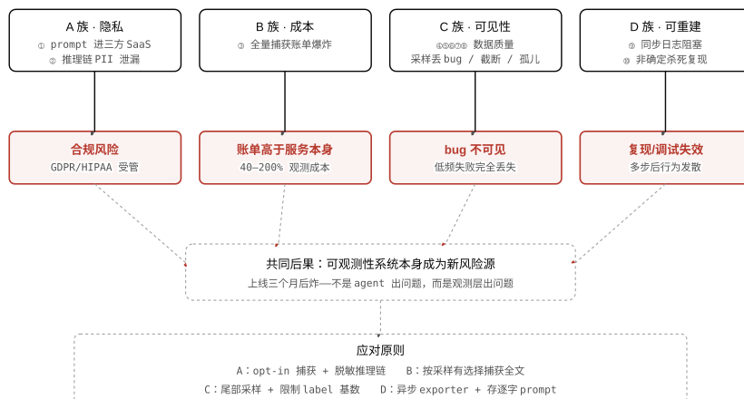

> 图 3.3 投产陷阱四族因果图：每族的具体陷阱指向对应后果，汇聚到共同结论——可观测性系统自身成为新的风险源。**注意**：C 族的"朴素头部采样"和 A 族的"推理链 PII 泄漏"是最隐蔽的两条，前者让 bug 在采样后消失、后者让脱敏流于形式，两者都不抛异常、不报警。

### §本章 self-check

先合上教程，把答案写在纸上或编辑器里，再展开对照。直接点开等于把这一节当再读一遍。

1. 差旅助理案例里， `invoke_agent` 根 span status=OK，但真实发生了 `search_flights` 四次 504 重试。如果监控系统 **只** 按根 span status 触发告警，这个问题会被发现吗？说明原因，并给出正确的告警设计。
2. "在线评估"和"Reflexion 运行期自纠"都会对 agent 的输出做判断，但它们在 **时机、主体、目的** 三个维度上完全不同。分别说出这三个维度上两者的差异。
3. 10% 均匀头部采样下，某工具的实际失败率是 3%。估算采样后每 1000 条 trace 里能观测到的失败 trace 数量，并解释为什么这是问题，以及应该用什么策略替代。
4. 工程师在 span 里存下了完整的 `gen_ai.output.messages` ，并对其做了输出级 PII 脱敏。说明这还不够的原因，以及还缺哪一类中间数据没有被脱敏覆盖。

<details>
<summary>答案（先做完再展开）</summary>

1. 不会被发现。根 span status=OK 说明 agent 最终给了用户一个答复，监控系统按根 span status 触发的告警对此沉默。工具失败和重试循环全都发生在子 span 层级。 **正确的告警设计** ：分两层设独立告警——① 根 span error rate（trace 彻底失败，status=ERROR）；② `execute_tool` span error rate 按工具名分组（任意子 span 出现 ERROR 就计入，不依赖根 span）。后者若持续高而前者低，说明 agent 在悄悄重试、成本和延迟在升，用户还没感知到。
2. 时机：在线评估在 trace 落库后 **异步** 运行，运行已结束；Reflexion 在 agent 推理 **过程中** 实时运行。主体：在线评估的主体是 **外部评估系统** （另一个 LLM-as-judge 或规则 scorer）；Reflexion 的主体是 **agent 本身** （自己评自己）。目的：在线评估目的是 **监控 + 发现 bad case + 扩充离线数据集** ；Reflexion 的目的是 **改善当次推理质量** （把失败翻译成语言教训，下轮读回）。
3. 1000 条 trace × 10% 采样率 = 100 条进入采样；100 条 × 3% 实际失败率 ≈ 3 条失败 trace 能被看到。3 条很可能低于告警阈值，也很可能在统计上被当作噪声。问题在于：低频失败（1–5%）在均匀采样后变得极低频，无法触发任何基于计数的告警。 **替代策略** ：尾部采样（tail-based sampling）——先收集完整 trace，对包含 ERROR span 的 trace 100% 保留，对全部 OK 的 trace 按采样率稀疏保留。这保证每一条失败 trace 都进入观测视野，成功 trace 降采以控制存储成本。
4. 带推理步骤的模型（o1/R1 类）在 chain-of-thought 中会使用上下文里的 PII。这部分推理链在 OTel semconv v1.41.0 里以 `reasoning.output_tokens` 相关字段独立存在，不在 `gen_ai.output.messages` 里。只对输出消息做脱敏，推理链里的 PII 完全没有被覆盖。正确做法是把 `gen_ai.input.messages` 、 `gen_ai.output.messages` 、以及推理链相关 events 全部纳入脱敏管道，或直接禁用这三类 opt-in 捕获，改用私有存储单独管理。

</details>

### 参考资料

- [OpenTelemetry · Semantic conventions for generative AI systems](https://opentelemetry.io/docs/specs/semconv/gen-ai/)
- [Langfuse · Scores（在线评估写回）](https://langfuse.com/docs/scores/overview)
- [LangSmith · Online evaluators](https://docs.langchain.com/langsmith/evaluation/online-evaluators)
- [OpenTelemetry · Sampling](https://opentelemetry.io/docs/concepts/sampling/)

---

## 04 · 工具与前沿：按场景选型，看清 2026 走向

前三章把可观测性的概念、机制、落地讲完了；这一章回答用什么工具落地，以及这个还在快速变的领域现在走到哪了。

本章你将建立的 schema

- 把 10 个工具按 **原型** 归位（emitter 层 / backend / 代理网关 / all-in-one），不背零散清单；理解 emitter 与 backend 分开选是降锁定风险的关键。
- 用五条判别轴给真实场景选型：开放标准 vs 私有 SDK、自托管 vs SaaS、框架耦合 vs 无关、纯 obs vs all-in-one、代理拦截 vs 进程内。
- 说得出 2026 哪稳（trace/span 模型 + 主流 SaaS 格局）、哪变（semconv 仍 Development、标准仍分裂、eval×obs 融合）、哪过时（Helicone 已转维护、手写 callback）。

前三章把"一棵 trace 树"从概念讲到落地。这一章补上最后一块：这棵树由谁发出（emitter）、发到哪里（backend）、两头之间谁做标准桥接，以及面对十几个工具时怎么按场景反推选型——不是复述每个产品的 feature 列表，而是给出判据。

工程师在做可观测性选型时最常遇到两种陷阱：一是把 emitter 和 backend 的选择混在一起（实际上两者可以独立决定）；二是把工具的"哪稳哪变"当成静态答案记忆，但这个领域的并购和规格变更速度使任何超过一年的印象都可能过时。这一章把两个问题都显式地回答。

### 4.1工具按原型：先分层，再点名

工具生态的分层逻辑：emitter 负责在进程内/外把调用转成 span，backend 负责存储、查询、告警；两层之间用 OTLP 协议通信，选型锁定风险主要在 backend 不在 emitter。

把工具按功能原型分成四类，比按厂商名记忆更稳——因为工具会并购、改名、转维护，但原型分类是稳定的架构结构。

#### Emitter 层：OpenLLMetry 与 OpenInference

**OpenLLMetry**（Traceloop 开源，Python/TypeScript/Go/Ruby）是纯 OTel 对齐的 emitter。它把 OpenAI、Anthropic、LangChain、LlamaIndex 等框架的调用自动转成符合`gen_ai.*`语义约定的 span，通过标准 OTLP 协议路由到任意 backend。工程师只需一行`Traceloop.init()`，不改业务代码即可获得结构化 trace。

**OpenInference**（Arize 开源）同样是 emitter，但在 OTel 基础上扩展了 LLM 领域的额外 span kind（RETRIEVER / RERANKER / GUARDRAIL / EVALUATOR 等），把`openinference.*`属性与 OTel`gen_ai.*`属性并列携带。Phoenix（Arize 的 backend）原生消费 OpenInference span；其他 OTel backend 则通过 normalization 层把`openinference.*`属性映射到标准字段。

关键判断

emitter 与 backend**分开选**。OpenLLMetry 发出的 span 可以发到 LangSmith、Langfuse、Phoenix、Datadog——只要 backend 接受 OTLP。锁定风险集中在 backend（存了多少 trace、写了多少 alert 规则），不在 emitter（换 emitter 只需改初始化代码）。

#### Backend 层：从纯 obs 到 all-in-one

Backend 的核心差异在"是否把 eval 能力也内置进来"——即从纯可观测性平台向 LLMOps 一体化平台演进的程度。

- **LangSmith** （LangChain 出品，SaaS 为主）：与 LangChain/LangGraph 深度集成；把 span 叫 **run** ，把会话分组叫 **thread** ；内置 prompt 管理、dataset 管理、在线评估，是 LangGraph 用户的自然选择。
- **Langfuse** （开源 MIT，自托管/SaaS 均可）：把 span 叫 **observation** ，LLM span 叫 **generation** ，会话分组叫 **session** ；2025-06 开源了 LLM-as-judge 在线评估；2026-01 被 ClickHouse 以 4 亿美元收购（$15B 估值），开源/自托管暂不变，但路线图存不确定性。
- **Phoenix** （Arize 开源，可自托管）：OpenInference 生态的 backend，擅长 RAG 检索质量评测（context recall、faithfulness）；内置 eval 模板，面向 AI 质量监控。
- **Braintrust** （SaaS，$80M B 轮，2025）：eval-first 定位，把离线评估、prompt 版本管理、在线评分打包成一体；2025 年快速扩展可观测性能力。
- **Weave** （Weights & Biases 旗下）：ML 实验追踪 + LLM trace 一体，适合已在 W&B 生态的团队。
- **Datadog** （传统 APM，LLM Observability 模块）：2024 年加入 OTel GenAI semconv 支持；优势在 HIPAA/SOC2 合规、告警基础设施、与现有 APM 的统一视图；2025 年加入 LLM Experiments（eval 能力）。企业场景下已有 Datadog 合约的团队首选。
- **HoneyHive** （SaaS）：专注 AI 产品的评测与监控一体化，偏 product analytics + eval 视角。

#### 代理网关层：Helicone 与 LiteLLM

代理网关在 HTTP 路径上拦截请求，不需要修改应用代码即可获得 token 计数、成本、延迟。其代价是：看不到进程内的推理状态（链式思维、工具路由决策），只能观测 HTTP 请求/响应的边界。

**Helicone**是这个模式的代表产品——但 2026-03 被 Mintlify 收购后已转入维护模式。代理网关**这个模式**值得理解（成本低、零代码改动、适合快速原型），但新项目不应选择 Helicone 这个具体产品；可考虑 LiteLLM proxy 或云厂商 AI gateway 作为替代。

**LiteLLM**是开源的统一 LLM proxy，支持 100+ 模型 API 统一接口，内置基础的 token 计数和成本追踪，可作为代理网关使用。

陷阱：代理网关的可见性盲区

代理网关能捕获"这次调用花了多少 token/钱/毫秒"，但捕获不到"agent 为什么选了这个工具""检索上下文传进去了什么"。这正是第 03 章强调的：**失败往往集中在编排层**，而编排层的中间状态只有进程内 instrumentation 才看得到。代理网关适合做成本控制基础层，不能替代进程内追踪。

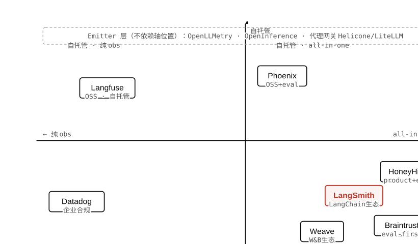

> 图 4.1 工具地图：横轴为功能覆盖（纯可观测性 vs all-in-one），纵轴为部署模式（自托管 vs SaaS）。**注意**：Emitter 层（OpenLLMetry/OpenInference/代理网关）与 backend 坐标无关——emitter 可以自由路由到任意 backend，是锁定风险最低的一层。

### 4.2五条判别轴与场景选型

不是每个项目都需要 all-in-one；按五条轴逐一定位约束，比对号入座"推荐工具榜"更可靠。

五条判别轴是正交的——每条轴的选择不强制另一条轴的选择，但轴之间有常见的共现组合。先逐轴理解含义，再对照场景综合决策。

**五条判别轴**

| 判别轴 | 两端含义 | 关键代价 | 适用场景倾向 |
| --- | --- | --- | --- |
| **开放标准 vs 私有 SDK** | 左：OTel OTLP + semconv，backend 可换；右：厂商专有 SDK，迁移需重新 instrument | 私有 SDK 锁定风险高；开放标准在 semconv 仍 Development 阶段需承受属性 churn | 长期项目选开放标准；快速原型可暂用私有 SDK |
| **自托管 vs SaaS** | 左：数据不出自有基础设施；右：托管服务，按量付费 | 自托管需运维 backend（存储、扩缩容、告警）；SaaS 有数据主权和隐私合规风险 | HIPAA/GDPR 强约束选自托管；小团队快速上线选 SaaS |
| **框架耦合 vs 框架无关** | 左：与 LangChain/LangGraph 深度集成（LangSmith）；右：任意框架均可接入 | 耦合换来开箱即用但绑定框架；无关需手动配置 instrumentation | 已决定用 LangGraph 则 LangSmith 自然；多框架混用选无关方案 |
| **纯 obs vs all-in-one** | 左：专注 trace/metric 存储查询；右：内置 eval、prompt 管理、dataset、在线评估 | all-in-one 学习曲线更陡、厂商依赖更深；纯 obs 可自由选 eval 工具 | 团队评测体系已建立选纯 obs；从零开始且需 eval 选 all-in-one |
| **代理拦截 vs 进程内** | 左：HTTP 代理层，零代码改动；右：SDK callback / OTel auto-instrumentation，看到编排内部 | 代理看不到推理链和工具路由决策；进程内需集成 SDK | 成本基础监控用代理；调试 agent 编排失败必须进程内 |

想一想

差旅助理 Agent 由创业团队开发，栈是 LangGraph，需要在自己的 Kubernetes 集群上运行（数据不能出境），团队人力有限但希望有在线评估能力。根据五条轴，推断最合适的工具组合是什么？

<details>
<summary>展开分析</summary>

沿五条轴推断：

- **开放标准 vs 私有 SDK** ：优先 OTel，避免未来迁移成本；用 OpenLLMetry 作 emitter。
- **自托管 vs SaaS** ：数据不出境 → 自托管 backend。Langfuse 是开源、MIT 协议、自托管成熟度高的首选。
- **框架耦合 vs 无关** ：LangGraph 用户可用 LangSmith——但 LangSmith SaaS 与数据不出境矛盾，自托管 LangSmith 版本（Enterprise）成本更高。继续选 Langfuse。
- **纯 obs vs all-in-one** ：需要在线评估 → Langfuse 2025-06 开源了 LLM-as-judge，满足需求。
- **代理拦截 vs 进程内** ：需要调试编排失败 → 进程内；OpenLLMetry + Langfuse OTLP endpoint。

结论：**OpenLLMetry（emitter）+ 自托管 Langfuse（backend）**，OTLP 协议串联，满足数据不出境 + 在线评估 + OTel 开放标准三个约束。

</details>

#### 三个对照场景

**场景 A：LangGraph 自托管创业团队**（即上方差旅助理案例）——如上，OpenLLMetry + 自托管 Langfuse。五轴结论：开放标准、自托管、框架无关（妥协 LangSmith 耦合换数据主权）、all-in-one（Langfuse 内置 eval）、进程内。

**场景 B：Datadog + HIPAA 企业**——已有 Datadog 合约且受 HIPAA 约束。五轴结论：传统 APM 厂商提供 OTel GenAI 支持（开放标准侧）、SaaS 但 Datadog 有 HIPAA BAA（合规 SaaS）、框架无关、从纯 obs 向 all-in-one 演进（LLM Experiments 2025）、进程内（Datadog Agent auto-instrumentation）。主要代价：Datadog per-GB 定价在大 LLM trace 体量下成本显著，需配采样策略（见第 03 章）。

**场景 C：想 OTel-native 自选 backend**——不想被任何 backend 锁定，已有 Grafana 或 Jaeger 等通用 OTel backend。五轴结论：开放标准强制要求、自托管、框架无关、纯 obs（eval 另行选型）、进程内。工具路径：OpenLLMetry 发 OTLP → 已有 OTLP backend；对通用 backend 的代价是：缺少 LLM 专属展示（prompt diff、token 趋势、eval 分数视图），需自行搭 Grafana dashboard。

#### 成本信号与 Helicone 的教训

在成本比较的历史数据点（10M 请求/月量级）中，Helicone 的代理网关模式约为 LangSmith 一半、Braintrust 五分之一的费用——这个数字说明**代理网关模式的低成本来自它只看 HTTP 边界，不存完整 prompt/completion 体积**。

然而 Helicone 已于 2026-03 被 Mintlify 收购，转入维护模式。这个产品本身不应再被选入新项目，但它所代表的代理网关**模式**——零代码改动、HTTP 层成本追踪——仍是理解工具分层的重要原型。新项目可参考 LiteLLM proxy 或云厂商 AI gateway（AWS Bedrock Gateway、Azure AI Gateway）实现同类功能。

### 4.3标准之争：OTel GenAI、OpenInference、OpenLLMetry

三套约定在 2026-06 仍并存，不是竞争关系而是层次关系；工程师需要理解它们的归属层，才能在 emitter 和 backend 之间选对粘合剂。

三套约定的定位：

- **OTel GenAI semconv** ：CNCF/OTel 官方维护的 `gen_ai.*` 语义约定，规定 LLM 调用 span 的标准属性名。截至 2026-06 仍处于 **Development 状态** （即过去的 Experimental，2025 年改名），意味着属性名可能随版本变更——v1.38.0（2024 末）弃用了 `gen_ai.prompt` / `gen_ai.completion` ，改为 `gen_ai.input.messages` / `gen_ai.output.messages` ；v1.41.0（2025-04）又拆分了 `invoke_agent` 、加入 `reasoning.output_tokens` 、流式 `time_to_first_chunk` 、cache token 属性。
- **OpenInference** （Arize）：OTel 的 **超集** ，在 `gen_ai.*` 之上增加 RETRIEVER、RERANKER、GUARDRAIL、EVALUATOR 等额外 span kind，以及 `openinference.*` 前缀属性。定位是补足 OTel GenAI 在 RAG 和 eval 链路上的空白。Phoenix 原生消费 OpenInference；其他 backend 需 normalization 层。
- **OpenLLMetry** （Traceloop）：定位是纯 OTel 对齐的 emitter 实现，不是新标准。2025-02 宣布将 OpenLLMetry 捐赠给 OTel 社区，但截至 2026-06 **停滞超过 14 个月** ，代码库仍由 Traceloop 维护，捐赠未完成。此外 OpenLLMetry 内部仍有 v1.38 弃用属性的遗留 bug（#3515）。

Normalization 层的作用

当 emitter 发出 OpenInference span 而 backend 只懂 OTel`gen_ai.*`时，中间需要一个 normalization 层（通常是 OTel Collector 里的 transform processor）做属性映射。这一层的存在说明：emitter 和 backend 的标准选择不必完全一致，成本是配置复杂度上升，收益是解耦。

#### 捐赠停滞的实际影响

OpenLLMetry 捐赠卡壳意味着：OTel GenAI semconv 和 OpenInference 的分裂短期内不会消失。两套约定并存的实务影响：

- 工程师在查属性名时必须确认是查的哪套约定（ `gen_ai.request.model` vs `openinference.span.kind` 是不同层次的问题）。
- 切换 backend 时，属性是否能被新 backend 正确展示，取决于 backend 对两套约定的支持情况。
- OTel GenAI agent/framework span 的语义约定仍处于 SIG `needs-triage` 状态——多 agent 编排、plan/step/decision 级 span 尚无 stable 规范（2026-06），各 backend 实现各异。

### 4.42026 前沿与并购：哪稳、哪变、哪过时

可观测性工具领域正经历两条并行的力量：eval 与 obs 的融合重塑 backend 的产品边界；并购潮重组了供应商格局——这两条力量共同决定当前选型的时效性。

#### 已稳定的部分

- trace/span 数据模型—— `trace_id` 、 `span_id` 、 `parent_span_id` 、 `gen_ai.*` 属性前缀已在主流 backend 稳定实现。
- 主流 SaaS 格局——LangSmith / Langfuse / Phoenix / Braintrust / Datadog 的市场定位已清晰，短期内不太可能消失。
- OTLP 为传输协议的共识——无论哪个 backend，OTLP 是事实上的 lingua franca，emitter→backend 链路已标准化。

#### 正在变化的部分（带日期）

**Eval × Obs 融合**：Langfuse 2025-06 开源 LLM-as-judge 在线评估；Datadog 2025 年加入 LLM Experiments；Braintrust 从 eval-first 向 obs 扩张。"可观测性 backend"与"eval 平台"的边界正在快速模糊，LLMOps 一体化平台成为主流方向。这意味着第 03 章讲的"在线评估接缝"正在被直接内置进可观测性平台，而不再需要单独搭 scorer 服务。

**多 agent trace 拓扑**：当多个 agent 协作时（如差旅助理把订票任务交给预订子 agent），plan/step/decision 级 span 的语义约定仍处于 SIG`needs-triage`状态（2026-06，无确定日期）。目前最具体的实现是 LangGraph Studio 的 checkpoint 时间旅行回放（2025），允许从任意历史 checkpoint 重新执行——这是 trace-based replay 的雏形，但依赖 LangGraph 框架，不是通用标准。

**OTel GenAI semconv 属性 churn**：v1.38.0（2024 末）弃用旧 prompt/completion 属性名；v1.41.0（2025-04）拆分 invoke_agent 并加入多个新属性。Development 状态意味着这种 churn 会持续到 Stable 为止，工程师需要在升级 emitter 版本时检查属性变更日志。

#### 已过时 / 维护模式

- **手写 callback 追踪** ：LangChain `on_llm_end` 等手写回调——被 OTel auto-instrumentation 取代，维护成本高。
- `gen_ai.prompt` / `gen_ai.completion` 属性名：v1.38.0 已弃用，新项目不应使用。
- **Helicone** ：2026-03 被 Mintlify 收购转维护模式——代理网关模式有价值，Helicone 产品已不适合新项目。
- 用 print 语句做 LLM 调试：被结构化 span + trace 视图取代，在多步 agent 场景下几乎不可用。

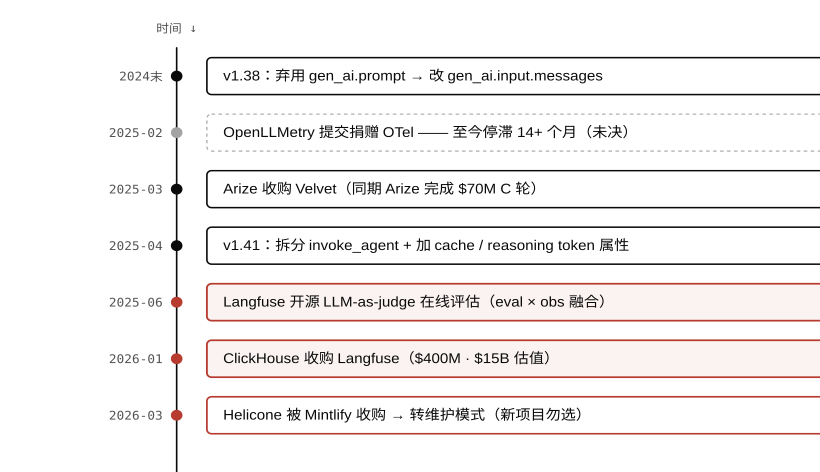

> 图 4.2 前沿时间线（2024末—2026-03，自上而下）：规格变更、融合/并购、停滞、过时四类事件按时间排列。**注意**：Helicone（红框）与 OpenLLMetry 捐赠（虚线框）都指向"学模式不选产品"——时间线上的产品节点比规格节点衰减更快，选型判断必须核对截止日期。

#### OpenAI 收购 Promptfoo 与 Braintrust B 轮

OpenAI 收购 Promptfoo（eval 工具）进一步加速了 eval×obs 融合的趋势——厂商在把 eval 能力内置进自身生态，减少工程师外部组合的空间。Braintrust 2025 年完成 $80M B 轮融资，在独立 LLMOps 赛道坚持 eval-first 定位，是这轮并购潮中为数不多保持独立的玩家。

选型时效性提示

本章的工具信息截至 2026-06。可观测性工具领域的并购速度和规格变更频率均显著高于成熟的 APM 市场。做选型前，建议核查：① backend 的最新融资/收购状态；② emitter 支持的最新 semconv 版本；③ HIPAA/SOC2 等合规认证是否仍有效。以上三点中任意一点在一年内发生过变化，都值得重新评估选型。

### 本章自测

1. **Emitter 与 backend 的锁定风险集中在哪一层？为什么？**

<details>
<summary>查看答案</summary>

锁定风险集中在**backend**。更换 backend 意味着迁移已存储的历史 trace、重建 alert 规则、重新配置 dashboard；而更换 emitter 只需修改初始化代码，历史数据不受影响。只要 emitter 发出标准 OTLP，backend 可以自由替换——这是"emitter 与 backend 分开选"能降低锁定风险的根本原因。

</details>
2. **Helicone 的代理网关模式与进程内 instrumentation 相比，哪类信息永远看不到？**

<details>
<summary>查看答案</summary>

代理网关只能捕获 HTTP 请求/响应边界的数据：token 计数、延迟、状态码、请求体/响应体文本。它永远看不到**进程内的编排状态**：agent 为何选择某个工具、工具路由决策的推理链、检索上下文的内容、以及多步骤之间的中间变量。而 agent 失败的根因（见第 03 章）恰恰集中在编排层，代理网关对此是盲区。

</details>
3. **OTel GenAI semconv 的 Development 状态对工程实践有什么具体影响？举出一个已发生的属性变更例子。**

<details>
<summary>查看答案</summary>

Development 状态意味着属性名可能随版本变更，升级 emitter 或 SDK 时必须检查 semconv changelog。已发生的例子：`gen_ai.prompt`/`gen_ai.completion`在 v1.38.0（2024末）被弃用，替换为`gen_ai.input.messages`/`gen_ai.output.messages`。若 backend 查询或 alert 规则仍用旧属性名，升级 emitter 后数据将静默丢失。

</details>
4. **一个受 HIPAA 约束的企业团队，已部署 Datadog 用于传统 APM，希望统一 LLM 可观测性。五条判别轴各自倾向哪端？**

<details>
<summary>查看答案</summary>

逐轴分析： ·**开放标准 vs 私有 SDK**：Datadog 支持 OTel GenAI semconv，倾向开放标准侧，但 Datadog Agent 自身是私有软件。 ·**自托管 vs SaaS**：Datadog SaaS，但 Datadog 有 HIPAA BAA 签署，合规 SaaS 可接受。 ·**框架耦合 vs 无关**：Datadog 框架无关，通过 OTel auto-instrumentation 接入各框架。 ·**纯 obs vs all-in-one**：Datadog LLM Observability + LLM Experiments（2025）已偏向 all-in-one。 ·**代理拦截 vs 进程内**：Datadog Agent 支持进程内 auto-instrumentation，首选进程内。 主要代价：per-GB 定价在大体量 LLM trace 下成本显著，需配合尾部采样策略控制可观测性账单。

</details>

### 参考资料

- [OTel GenAI Semantic Conventions](https://opentelemetry.io/docs/specs/semconv/gen-ai/)
- [Datadog × OTel GenAI semconv](https://www.datadoghq.com/blog/llm-otel-semantic-convention/)
- [Langfuse 数据模型文档](https://langfuse.com/docs/observability/data-model)
- [Agent Observability Platforms 横评 2026](https://www.digitalapplied.com/blog/agent-observability-platforms-langsmith-langfuse-arize-2026)
- [OpenInference GitHub](https://github.com/Arize-ai/openinference)

---

## 05 · 自测与辨析

前四章把可观测性的概念、机制、落地、工具讲完了；这一章用三层梯度题 + 五个跨章辨析场景 + 一次动手画，把零散知识逼成可调用的判断力。

读完不等于学会。下面的题目分三层：**概念层**查词汇与边界（记得 / 认得），**机制层**查"为什么这样工作"（会推 / 会算），**应用判别层**把多章概念混在一个真实场景里，逼出"该用哪个、看哪里"的判断。每题先合上教程独立作答，再展开对照——直接展开等于把这一章当再读一遍。

用法 · 别骗自己

展开答案前先把回答写在纸上或编辑器里。"大概知道"和"能完整说出来"之间的差距，正是这一章要暴露的。答得磕绊的题，回对应章节重读，不要靠多看一遍答案蒙混过去。

### ·三层梯度

题目从"记得"逐层走到"会判"。越往下，越需要把多章概念接起来用——这也是面试和真实排障里最常被问、最难绕过的一层。

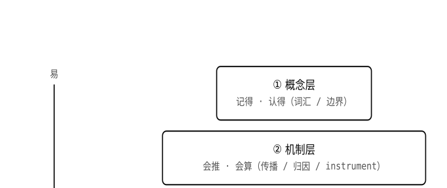

> 图 5.1 三层梯度：自上而下，单题涉及的章节越多、越需要"接起来用"。**注意**：底层（应用判别）最宽不是因为它"基础"，而是因为它把上两层全部吃进一个真实场景——这一层答得出，才算真的会。

### ①概念层 · 记得 / 认得

1. 用一句话分别说出可观测性、eval、传统 APM 三者在 **时机** 和 **对象** 上的区别。

<details>
<summary>展开答案</summary>

可观测性：**运行期**，对象是**单条真实运行**。eval：**开发期 / CI**，对象是**固定数据集**。传统 APM：运行期，对象是单请求（但判据只到状态码 + 延迟，不进语义）。三者只在"在线评估"处相交（详见第 3 章）。

</details>
2. 一个 span 的 `parent_span_id` 为空，意味着什么？它在 agent 的一次运行里通常是哪个 operation？

<details>
<summary>展开答案</summary>

它是这棵 trace 的**根 span（root span）**，没有父节点。在 agent 运行里通常是`invoke_agent`，代表一次完整运行的起点，其下挂着各`chat`/`execute_tool`/ retriever 子 span，全树共享同一`trace_id`。

</details>
3. 为什么 prompt / completion 文本放在 span 的 `events` 而不是 `attributes` ？给两个原因。

<details>
<summary>展开答案</summary>

①`attributes`设计为低基数、可聚合的结构化键值，prompt 文本每条唯一（高基数），放进去会撑爆时序索引；② prompt 体积大（数 KB）且常含 PII，`attributes`的批量索引无法做细粒度访问控制，且会被 SDK 默认的 4–64KB 截断阈值静默砍掉。`events`是带时间戳的日志事件，为大块 / 敏感内容而设，且 opt-in。

</details>
4. OTel GenAI semconv 里有 `gen_ai.usage.input_tokens` ，却没有 `gen_ai.cost.*` 。成本由谁、在什么时候算出来？

<details>
<summary>展开答案</summary>

由**可观测性 backend**在**ingestion（落库）时**算：用 span 里的 token 数 × 内置定价表。规范不定义成本，是因为同样 token 数的价格随账户折扣、厂商调价、模型版本变动，写进规范会让规范追着调价跑。后果：不同 backend 的成本数字可能因定价快照时间点不同而有差异，不代表 token 数据有误。

</details>
5. 说出"三支柱"（traces / metrics / logs）在 LLM 可观测性里各自的角色变化。

<details>
<summary>展开答案</summary>

**traces 主导**——span 树是执行图，是"为什么"的直接载体。**metrics 退化为直方图**（token 用量、操作耗时、TTFT 分布）；把 prompt / user-id 当 metric label 会引发基数爆炸。**logs 降级为 span 上的 events**，独立日志流不再是主要手段。

</details>

### ②机制层 · 会推 / 会算

1. 两个独立进程里的 agent，怎么做到它们的 span 落在 **同一棵** trace 树上？关键是哪个 HTTP 头，它传的是什么？

<details>
<summary>展开答案</summary>

靠**context propagation**：上游在跨进程调用时把 W3C`traceparent`头（含`trace_id`和当前的`parent_span_id`）附在请求里；下游读取它，用其中的`parent_span_id`作为自己根 span 的父，并把`trace_id`原样继承。于是两个进程的 span 共享同一`trace_id`、父子关系正确相连。头没传，子 agent 的 span 就成孤儿，树断裂。

</details>
2. 差旅助理并发调用 `search_flights` 和 `retrieve_policy` ，怎么保证两个 `execute_tool` span 都挂在正确的父节点下？什么情况下会变成孤儿 span？

<details>
<summary>展开答案</summary>

每个 span 创建时从**当前调用点的 context storage**（如 Python 的`contextvars.ContextVar`）读取当前 span id 作为自己的`parent_span_id`。只要两个工具调用都在同一个决策`chat`span 的执行上下文里发起，就都以它为父，互不干扰。孤儿出现在：把调用扔进新线程 / 新进程却没把 context 复制过去（如裸`threading.Thread`而非 OTel 的 context-propagating wrapper），新执行体看到空 context。

</details>
3. 代理网关（HTTP 拦截）和进程内 SDK 相比，哪一类信息代理网关 **结构性** 地看不到？为什么这是架构决定的、不是配置问题？

<details>
<summary>展开答案</summary>

代理网关只看到进出 LLM API 的 HTTP 请求 / 响应（模型名、prompt、completion、latency、状态码），**看不到进程内的编排状态**：agent 为什么选这个工具、检索召回了哪些文档、路由决策的候选是什么。这些状态从不离开应用进程、不走那一跳 HTTP，所以代理在网络层无论怎么配置都拿不到。因此代理网关适合成本 / latency 监控，不适合调试 agent 决策链。

</details>
4. 在线评估的步骤里，" **异步** "和" **分层采样** "分别解决什么问题？去掉它们各会怎样？

<details>
<summary>展开答案</summary>

**异步**：scorer 在 trace 落库后才跑，不阻塞热路径。去掉（同步打分）= 给每次 agent 运行的关键路径叠加一次额外 LLM 调用的延迟。**分层采样**：低分 / 可疑区域多采、正常区域少采。去掉（均匀采样）= 在 bug 密度低时几乎采不到失败 trace，scorer 看到的全是正常 case，监控形同虚设。

</details>
5. 一棵 trace 里有 5 个 `chat` span，根 `invoke_agent` span 自己不调 LLM。trace 级的 token 总量怎么得到？两种实现方式分别在哪一层做聚合？

<details>
<summary>展开答案</summary>

每个`chat`span 自记`gen_ai.usage.*`（billable token），父 span 汇总子 span 的数值得到 trace 级总量。两种实现：①**SDK 侧**——父 span 关闭时遍历子 span 求和（OpenInference / Phoenix 路线）；②**backend 侧**——ingestion 后由查询 API 提供 trace 级聚合（LangSmith / Langfuse 路线）。结果相同，区别只在聚合发生的位置。

</details>

### ③应用判别层 · 会选 / 会判（跨章）

每个场景都把多章概念混在一起，括号标出主要涉及哪些章。先判断"该用哪个工具 / 看哪里"，再展开。

1. **场景（第 1、3 章）** ：线上 agent 给用户的答复是错的，但 HTTP 返回 200，Datadog 的错误率 / 延迟仪表盘一切正常。这是可观测性、eval 还是 APM 的活？下一步具体看什么？

<details>
<summary>展开分析</summary>

这是**可观测性**的活（运行期、还原单条真实运行）。APM 盲，因为**语义失败对状态码不可见**。下一步：打开这条 trace，沿父子链从最终答复 span 向上回溯，逐级检查每个 span 的**中间状态**——工具返回了什么、检索召回了哪些文档、路由`chat`选了哪个工具，找到第一个产出"语义上坏"输出的 span（根因 span）。eval 在这里帮不上：它对的是数据集，不是这一条线上运行。

</details>
2. **场景（第 2、4 章）** ：LangGraph 创业团队，数据不能出境（自托管），人力有限但想要在线评估。给出 emitter + backend 的组合，并说出五条判别轴各倾向哪端。

<details>
<summary>展开分析</summary>

组合：**OpenLLMetry（emitter）+ 自托管 Langfuse（backend）**，OTLP 串联。五轴：开放标准（OTel，避免迁移成本）；自托管（数据不出境，Langfuse 开源 MIT 自托管成熟）；框架无关（妥协 LangSmith 的 LangChain 耦合换数据主权）；all-in-one（Langfuse 2025-06 开源 LLM-as-judge 满足在线评估）；进程内（要调试编排失败，必须进程内 instrumentation）。

</details>
3. **场景（第 1、3 章）** ：差旅助理某次运行成本是平时的 3 倍，但功能正常、用户拿到了答复。怎么用 trace 定位？这是 obs 还是 eval 的活？

<details>
<summary>展开分析</summary>

**obs**（运行期单条运行的成本归因）。定位：按`invoke_agent`根 span 找成本最高的运行，展开子树，比较各`chat`span 的`gen_ai.usage.*`；若看到同名`execute_tool`（如`search_flights`）并列出现多次，且其中有`status=ERROR`，说明工具失败触发了 LLM 自发重试循环，每次把全量历史重喂、token 线性叠加。根因是工具层无重试上限，不是 prompt。eval 看不到这个——它不跑在这条真实 trace 上。

</details>
4. **场景（第 1、3 章）** ：团队声称"99.9% 可用性 + P95 延迟监控都正常，质量没问题"。这套监控有什么盲区？需要补什么？

<details>
<summary>展开分析</summary>

盲区：可用性和延迟是 APM 式指标，**对语义失败和悄悄重试都不可见**。一个 agent 可以 99.9% 可用、P95 正常，同时幻觉率在涨、工具在后台重试烧钱。需要补：①**cost/run**告警（APM 没有的一等信号）；②**子 span 工具失败率**（根 span OK 掩盖工具层 ERROR）；③**在线评估**——对采样生产 trace 打质量分，把"答得对不对"变成可监控的数。

</details>
5. **场景（第 1、3 章）** ：受 HIPAA 约束，团队对生产 trace 做脱敏，只对 `gen_ai.output.messages` （最终输出）脱了敏。够吗？还缺什么？

<details>
<summary>展开分析</summary>

不够。① 输入侧`gen_ai.input.messages`同样含 PII，也要脱；② 更隐蔽的是**推理链 PII 泄漏**——带思维链的模型（o1/R1 类）在`reasoning`token 里会用到上下文 PII，即便最终输出干净。正确做法：把 input / output / reasoning 三类 events 全纳入脱敏管道，或对敏感业务直接禁用这三类 opt-in 捕获、改自托管私有存储。只脱输出是半截子工程。

</details>

### ·动手画：两张图

辨认一张图和**亲手画出**一张图，是两种不同强度的掌握。下面两张图都在前面章节出现过——合上教程，凭记忆画，再翻回对照。画得出来，才说明这套结构真的进了脑子。

动手画 · 1

#### 差旅助理「成本翻 3 倍」的失败 trace 树

不许翻书。画出这次失败运行的 span 树，要求标注：

- 根 span 是谁，它的 `status` 是什么（陷阱在这里）；
- 正常 5 个 `chat` + 多出来的 4 个重试 `chat` 的父子关系；
- 哪个是 **根因 span** ，它的 `status` 和 `status.message` ；
- token 怎么从子 span 上卷到根，为什么总量翻倍。

画完翻回[图 1.2](https://zhiwenliang.github.io/learning/agent-observability/01-concepts.html#s12)（span 树）和[图 3.1](https://zhiwenliang.github.io/learning/agent-observability/03-operations.html#s31)（根因回溯）对照。漏标了`status`或父子关系的地方，就是没真正吃透的地方。

动手画 · 2

#### obs / eval / APM 三方边界图

画一张二维定位图：横轴是**时机**（运行期 ↔ 开发期），纵轴或分区标出三者各自的**对象**与**判据**。然后把"**在线评估**"这条唯一接缝画在正确位置，并标出它的方向（数据从哪流向哪）。

画完翻回[起点的一句话本质](https://zhiwenliang.github.io/learning/agent-observability/index.html#essence)与[图 1.1](https://zhiwenliang.github.io/learning/agent-observability/01-concepts.html#s11)对照。如果"在线评估"的箭头方向画反了（应是可观测性 → eval：生产 trace 流入离线集），说明这条接缝还没真正理顺。

学完之后

这五层题答顺了，可观测性在脑子里就从"接个看板"变成了一套判断力：分得清 obs / eval / APM，看得懂 trace 树怎么由 context propagation 长出来，拿到失败 trace 能定位根因，面对工具和前沿能按场景选型并核对时效。下一步的自然延伸见[起点 · 学完之后](https://zhiwenliang.github.io/learning/agent-observability/index.html#next)——在线评估那条接缝把你引向[agent-eval](https://zhiwenliang.github.io/learning/agent-eval/index.html)，多 agent 的 trace 拓扑引向[multi-agent-patterns](https://zhiwenliang.github.io/learning/multi-agent-patterns/index.html)。

### 参考资料

- [OpenTelemetry · GenAI Semantic Conventions](https://opentelemetry.io/docs/specs/semconv/gen-ai/)
- [Anthropic · Demystifying Evals for AI Agents](https://www.anthropic.com/engineering/demystifying-evals-for-ai-agents)

---

## 一页纸总结

- **可观测性（observability）**关注运行期的真实执行：把一次非确定、多步骤、可能语义失败的 Agent 运行还原成一棵由 `span` 组成的因果树。
- **eval**关注开发期或 CI 中的固定数据集：通过评分、回归和部署卡点判断系统质量。
- **传统 APM**主要关注请求级状态码、延迟和基础设施健康；它无法直接发现“HTTP 200 但答案错误”的语义失败。
- **Trace 的连续性**来自 context propagation：`traceparent` 把当前 span 的身份跨函数、服务、进程、异步任务和多 Agent 边界传递下去。
- **成本归因**要先在每个 LLM span 记录 token，再向父 span 汇总；钱通常由 backend 根据模型、token 与定价表派生，而不是 OTel 协议字段。
- **生产落地**必须同时考虑根因回溯、分层采样、异步在线评估、PII 脱敏、成本告警、工具失败率和 trace 可重建性。
- **选型方法**是先分 emitter、OTLP/语义约定与 backend 三层，再按开放标准、自托管、框架耦合、能力覆盖和进程内可见性比较；不要把不同层的产品直接横向对比。

> 最重要的一句话：**日志记录“发生了什么”，可观测性要回答“为什么会这样”。对 Agent 来说，那个“为什么”通常只能由一棵完整的 trace/span 因果树提供。**
