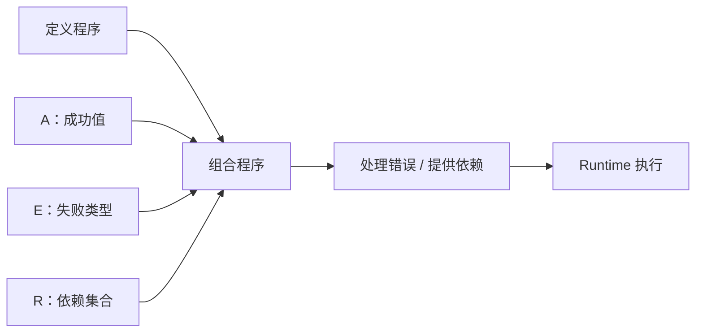

# Effect TS：把异步、错误、依赖写进类型的程序值

在 TypeScript 项目里，我们通常用 `Promise` 表达异步，用 `try/catch` 处理异常，再通过参数、全局变量或依赖注入框架传入数据库、HTTP 客户端等服务。

这套方案足以应付简单业务，但系统复杂后，一些问题会越来越明显：

- `Promise<User>` 只说明成功时得到 `User`，却没有说明会失败成什么；
- 函数签名看不出它依赖数据库、缓存还是 HTTP 客户端；
- `Promise.race` 能选出赢家，却不会自动停止输家；
- 一个批量任务失败后，其他任务应该取消、继续，还是保留部分结果，往往靠临时约定；
- 超时和取消发生时，连接、文件句柄等资源能否释放，全靠开发者是否记得写清理逻辑。

Effect TS 提供了另一种建模方式：**把一个程序描述成值，并把成功、失败和依赖同时写进类型。**

```ts
Effect<A, E, R>
```

其中：

- `A`：成功时产出的值；
- `E`：预期内、可处理的失败；
- `R`：运行这个程序前必须提供的依赖。

例如：

```ts
Effect<User, HttpError | ParseError, HttpClient | Database>
```

单看类型，我们就知道这个程序成功时返回 `User`，可能发生 `HttpError` 或 `ParseError`，并且需要 `HttpClient` 与 `Database`。

这不只是更详细的类型标注，而是一种不同的程序组织方式。

---

## 一、Effect 不是“正在执行的异步任务”，而是程序值

理解 Effect 的第一步，是把“描述”和“执行”分开。

`Promise` 通常是热的：一旦构造，任务就已经开始。

```ts
const promise = new Promise<number>((resolve) => {
  console.log("Promise 立即执行")
  resolve(42)
})
```

Effect 则是惰性的。下面这段代码只创建了一个描述，尚未执行副作用：

```ts
import { Effect } from "effect"

const program = Effect.sync(() => {
  console.log("只有 run 时才执行")
  return 42
})

console.log("程序还没有运行")

const result = Effect.runSync(program)
console.log(result)
```

输出顺序是：

```text
程序还没有运行
只有 run 时才执行
42
```

这个差异非常重要。因为 Effect 是一个值，所以我们可以在执行前对它进行组合和包装：

```ts
const retried = program.pipe(Effect.retry({ times: 3 }))
const timed = program.pipe(Effect.timeout("1 second"))
```

此时 `retried` 和 `timed` 依旧只是新的程序描述。只有交给 Runtime 后，它们才真正执行。

常见运行边界包括：

```ts
Effect.runSync(program)          // 同步运行
Effect.runPromise(program)       // 运行并返回 Promise
Effect.runPromiseExit(program)   // 成功、失败都收进 Exit
Effect.runFork(program)          // 启动 Fiber，并返回可中断句柄
```

一个成熟的 Effect 程序通常只有极少数 `run*`：业务内部不断返回和组合 Effect，最外层入口负责真正运行。

---

## 二、`Effect<A, E, R>`：程序的三条类型通道

可以把一个 Effect 想象成三条同时流动的通道：



### 1. A：成功通道

```ts
const ok = Effect.succeed(42)
// Effect<number, never, never>
```

`A` 是 `number`，表示程序成功后得到数字 `42`。

### 2. E：错误通道

```ts
const failed = Effect.fail(new Error("boom"))
// Effect<never, Error, never>
```

这里没有成功值，所以 `A` 是 `never`；失败类型是 `Error`。

### 3. R：依赖通道

当程序需要某个服务时，该服务会出现在 `R` 中。只有提供了全部依赖，`R` 才会变成 `never`，程序才能在边界处运行。

这意味着编译器可以在程序启动前回答三个关键问题：

1. 成功会得到什么？
2. 还有哪些错误没有处理？
3. 还有哪些依赖没有提供？

---

## 三、把外部世界搬进 Effect

应用边界充满了不受类型系统控制的东西：可能抛异常的同步函数、可能 reject 的 Promise、网络请求和文件操作。Effect 的构造器就是进入 Effect 世界的“闸门”。

```ts
Effect.succeed(42)
Effect.fail(new Error("boom"))
Effect.sync(() => Date.now())
```

需要特别区分 `Effect.sync` 和 `Effect.try`。

### 不会抛异常：使用 `Effect.sync`

```ts
const now = Effect.sync(() => Date.now())
```

### 可能抛异常：使用 `Effect.try`

```ts
import { Data, Effect } from "effect"

class ParseError extends Data.TaggedError("ParseError")<{
  readonly input: string
}> {}

const parseJson = (input: string) =>
  Effect.try({
    try: () => JSON.parse(input) as unknown,
    catch: () => new ParseError({ input })
  })
```

### 可能 reject 的 Promise：使用 `Effect.tryPromise`

```ts
class HttpError extends Data.TaggedError("HttpError")<{
  readonly url: string
  readonly cause: unknown
}> {}

const getJson = (url: string) =>
  Effect.tryPromise({
    try: () => fetch(url).then((response) => response.json()),
    catch: (cause) => new HttpError({ url, cause })
  })
```

这里最关键的动作，是把不透明的异常转换成明确的领域错误。转换完成后，错误不再隐藏在 reject 或 throw 里，而是进入 `E` 通道。

---

## 四、类型化错误：组合时做加法，处理时做减法

Effect 的错误模型非常适合业务系统，因为错误会随着程序组合自动累积。

假设请求可能发生 `HttpError`，解析可能发生 `ParseError`：

```ts
declare const request: Effect.Effect<string, HttpError>
declare const decode: (
  input: string
) => Effect.Effect<number, ParseError>

const pipeline = Effect.gen(function* () {
  const body = yield* request
  return yield* decode(body)
})

// Effect<number, HttpError | ParseError>
```

串联两个 Effect 后，错误通道变成联合类型：

```ts
HttpError | ParseError
```

处理其中一种错误，就像从联合类型中做减法：

```ts
const recovered = pipeline.pipe(
  Effect.catchTag("HttpError", () => Effect.succeed(0))
)

// Effect<number, ParseError>
```

`HttpError` 已经被处理，因此只剩 `ParseError`。

### 失败与缺陷不是一回事

Effect 刻意区分两种错误：

- **失败（failure）**：预期内、可恢复，使用 `Effect.fail` 产生，进入 `E` 通道；
- **缺陷（defect）**：意料之外的程序 bug，例如真正的 `throw` 或 `Effect.die`，不进入 `E` 通道。

因此，下面的代码存在一个常见误区：

```ts
const bad = Effect.sync(() => JSON.parse(raw)).pipe(
  Effect.catchAll(() => Effect.succeed(null))
)
```

`JSON.parse` 抛出的异常会成为缺陷，而 `catchAll` 只处理 `E` 通道中的失败，所以它未必能捕获这个问题。正确做法是从边界处使用 `Effect.try`，把异常转换成类型化错误。

另一个常见误区是滥用 `catchAll`。它会一次性处理整个错误通道，容易把真正的问题静默成 fallback。业务代码中应优先使用 `catchTag`，只恢复自己明确理解的错误。

---

## 五、`Exit` 与 `Cause`：错误不再只有一个 `Error`

Promise 通常只给我们一个成功值或一个异常，但并发与取消下的失败可能更复杂。

Effect 使用：

```ts
Exit<A, E>
```

表达一次 Fiber 执行的最终结果：

- `Success<A>`：成功；
- `Failure<Cause<E>>`：失败。

失败侧不是裸 `E`，而是 `Cause<E>`。它可以保留：

- 类型化失败；
- 缺陷；
- 中断；
- 顺序发生的多个失败；
- 并行分支同时发生的多个失败。

这对并发系统很重要：两个分支同时失败时，不必为了返回一个 `Error` 而丢掉另一份信息。

`Effect.exit` 还可以把一次执行的成功或失败整体变成普通值：

```ts
const inspected = program.pipe(Effect.exit)
// Effect<Exit<A, E>, never, R>
```

这个技巧是后面实现“单项失败不影响整批任务”的关键。

---

## 六、依赖也是类型：Context 与 Layer

在传统代码中，依赖往往通过构造函数、全局变量或容器传入。Effect 使用 `Context.Tag` 描述服务接口，用 `Layer` 提供实现。

```ts
import { Context, Effect, Layer } from "effect"

class HttpClient extends Context.Tag("app/HttpClient")<
  HttpClient,
  {
    readonly get: (
      url: string
    ) => Effect.Effect<string, HttpError>
  }
>() {}
```

业务逻辑只依赖接口：

```ts
const fetchWeather = (city: string) =>
  Effect.gen(function* () {
    const http = yield* HttpClient
    return yield* http.get(`/weather/${city}`)
  })

// Effect<string, HttpError, HttpClient>
```

注意，`R` 中出现了 `HttpClient`。这不是运行时才暴露的配置错误，而是编译器可见的未满足依赖。

然后提供具体实现：

```ts
const HttpClientTest = Layer.succeed(HttpClient, {
  get: (url) => Effect.succeed(`mock response from ${url}`)
})

const runnable = fetchWeather("Shanghai").pipe(
  Effect.provide(HttpClientTest)
)

// Effect<string, HttpError, never>
```

`Effect.provide` 把 `HttpClient` 从依赖通道中消掉。此时 `R = never`，程序才具备完整运行条件。

这带来两个直接收益：

1. **生产与测试实现可替换**：业务代码不需要修改；
2. **漏接依赖会在编译期报错**：`Service is not assignable to never` 往往是在提醒你还没有 `provide`。

需要注意的是，Layer 按引用进行记忆化。若多次调用 Layer 工厂，就可能创建多个连接池或缓存实例。需要共享单例时，应把 Layer 保存为模块级 `const` 并复用同一个引用。

---

## 七、Fiber：可观察、可中断的轻量并发单元

Promise 可以并发，却没有统一、结构化的生命周期。Effect Runtime 中的并发原子是 Fiber。

```ts
import { Effect, Fiber } from "effect"

const slow = Effect.succeed("done").pipe(
  Effect.delay("1 second")
)

const program = Effect.gen(function* () {
  const fiber = yield* Effect.fork(slow)
  const value = yield* Fiber.join(fiber)
  return value
})
```

Fiber 可以：

- fork：派生任务；
- join：等待结果；
- interrupt：发出中断；
- 观察最终的 `Exit` 与 `Cause`。

Effect 使用协作式调度：Runtime 在 Effect 的边界之间切换 Fiber，并在安全边界检查中断信号。它不会在一个同步代码块执行到一半时突然打断，因此中断既便宜，也不容易造成状态撕裂。

代价是：长时间运行的 CPU 密集同步代码不会主动让出控制权，也不会及时响应中断。此类任务需要拆分步骤、显式让出，或交给更合适的计算设施。

---

## 八、结构化并发：父任务结束，子任务也应结束

`Effect.fork` 创建的子 Fiber 默认属于父 Fiber 的作用域。父 Fiber 结束或被中断时，子 Fiber 会被一并中断。

这就是结构化并发的核心：**并发任务的生命周期像函数调用栈一样有明确归属，而不是启动后无人负责。**

它解决了裸 Promise 常见的 fire-and-forget 泄漏：请求已经结束，后台任务却仍在运行；任务失败无人接收；连接也没有释放。

对于资源，应使用 `acquireRelease` 和 `scoped`：

```ts
import { Console, Effect } from "effect"

const connection = Effect.acquireRelease(
  Console.log("打开连接").pipe(Effect.as("conn")),
  () => Console.log("关闭连接")
)

const program = Effect.gen(function* () {
  const conn = yield* connection
  yield* Console.log(`使用 ${conn}`)
  yield* Effect.interrupt
}).pipe(Effect.scoped)
```

即使程序失败或被中断，release finalizer 依旧会运行。

这比“在成功路径最后手动 close”可靠得多，因为手动清理很容易在异常、超时或取消路径上被跳过。

---

## 九、并发不是越多越好：显式决定调度策略

`Effect.all` 默认不是 `Promise.all` 的简单替代品。使用它时，应明确回答两个问题：

1. 同时允许多少任务执行？
2. 一个任务失败后，其他任务是否应该继续？

### 有界并发

```ts
const result = Effect.all(tasks, {
  concurrency: 5
})
```

具体数字是一种背压和限流策略。`"unbounded"` 虽然快，却可能瞬间打爆数据库或外部 API。

### Fail-fast

裸 `Effect.all(tasks)` 通常适合“全有或全无”：一个任务失败，整批失败，其余任务被中断。

### 失败隔离

如果目标是“尽量收集所有结果”，应先把每项转换为 `Exit`：

```ts
const result = Effect.all(
  tasks.map((task) => task.pipe(Effect.exit)),
  { concurrency: 5 }
)
```

此时每个任务的失败都成为数据，单项失败不会炸掉整批。

所以，`Effect.exit` 不是简单的错误包装，而是在改变调度语义：从 fail-fast 变成逐项观察结果。

---

## 十、实战：Agent 工具调度器

假设一个 AI Agent 在一轮对话中要并行调用搜索、天气、计算器等工具。调度层需要满足：

- 同时最多运行 3 个工具；
- 每个工具最多执行 2 秒；
- 某个工具失败或超时，不影响其他工具；
- 所有工具共享 `HttpClient`；
- 用户取消整轮请求时，所有在飞工具都停止并释放资源。

### 1. 定义错误、服务和工具

```ts
import {
  Context,
  Data,
  Effect,
  Exit,
  Layer
} from "effect"

class ToolError extends Data.TaggedError("ToolError")<{
  readonly tool: string
  readonly reason: string
}> {}

class HttpClient extends Context.Tag("app/HttpClient")<
  HttpClient,
  {
    readonly get: (
      url: string
    ) => Effect.Effect<string, ToolError>
  }
>() {}

interface Tool {
  readonly name: string
  readonly call: Effect.Effect<string, ToolError, HttpClient>
}

const makeTool = (name: string, url: string): Tool => ({
  name,
  call: Effect.gen(function* () {
    const http = yield* HttpClient
    return yield* http.get(url)
  })
})
```

### 2. 编写调度器

```ts
const runTools = (tools: ReadonlyArray<Tool>) =>
  Effect.all(
    tools.map((tool) =>
      tool.call.pipe(
        Effect.timeout("2 seconds"),
        Effect.exit,
        Effect.map((exit) => ({
          name: tool.name,
          exit
        }))
      )
    ),
    { concurrency: 3 }
  )
```

这几行代码同时表达了四个重要决策：

- `concurrency: 3`：限制最大并发；
- `timeout("2 seconds")`：单项超时并中断对应 Fiber；
- `Effect.exit`：把失败或超时变成值，隔离单项失败；
- `Effect.all`：等待整批结果，同时保留输入顺序。

### 3. 提供测试实现

```ts
const HttpClientTest = Layer.succeed(HttpClient, {
  get: (url) =>
    url.includes("slow")
      ? Effect.never
      : url.includes("boom")
        ? Effect.fail(
            new ToolError({
              tool: url,
              reason: "boom"
            })
          )
        : Effect.succeed(`result of ${url}`)
})
```

### 4. 组合并运行

```ts
const program = runTools([
  makeTool("search", "/search?q=effect"),
  makeTool("weather", "/weather/shanghai"),
  makeTool("slow", "/slow"),
  makeTool("boom", "/boom")
]).pipe(
  Effect.provide(HttpClientTest)
)

const rows = await Effect.runPromise(program)

for (const row of rows) {
  console.log(
    row.name,
    Exit.isSuccess(row.exit)
      ? row.exit.value
      : "FAILED OR TIMEOUT"
  )
}
```

最终，正常工具返回成功值，失败工具保留自己的 Failure，永不返回的工具在两秒后超时；整批任务不会因为其中一项失败而中止。

更重要的是，整个 `program` 仍是一个值。上游如果中断父 Fiber，中断会沿结构化并发关系传播给所有仍在执行的子 Fiber；各自注册的 finalizer 会负责清理资源。

---

## 十一、十个高频陷阱，可以归纳成四类

### 1. 惰性问题

- 只定义 Effect，却忘了在边界 `run*`；
- 在 `Effect.gen` 中混入 `async/await`，让执行脱离 Runtime；
- 复制旧资料中的 `yield* _(effect)` 适配器写法，而不是直接 `yield* effect`。

### 2. 错误通道问题

- 用 `Effect.sync` 包裹会抛异常的代码，导致异常成为缺陷；
- 用 `catchAll` 一把抓，悄悄吞掉未预料的错误。

### 3. 依赖注入问题

- `runPromise` 报依赖不能赋给 `never`，实际是忘记提供 Layer；
- 多次调用 Layer 工厂，意外得到多个连接池或缓存实例。

### 4. 并发与资源问题

- 忘记声明 `Effect.all` 的并发度，表现与预期不一致；
- 手动 open/close，在失败或中断路径上泄漏资源；
- 需要失败隔离，却直接使用 fail-fast 的 `Effect.all`。

这些陷阱背后并不是十套独立规则，而是四个核心机制：惰性、类型化错误、依赖通道和结构化并发。理解机制比背 API 更可靠。

---

## 十二、什么时候不应该使用 Effect

Effect 能提升复杂系统的可维护性，但它不是免费的。

以下场景通常没有必要引入完整 Effect 体系：

- 一次性脚本；
- 只有两三个顺序 API 调用的简单胶水代码；
- 团队没有学习意愿，却准备让少数人强行引入；
- 只想要一个轻量 `Result` 类型，不需要依赖追踪、Fiber 和结构化并发。

Effect 更适合这些问题：

- 复杂后端服务，需要明确的错误边界；
- 大量外部依赖，希望生产和测试实现可替换；
- 高并发任务调度，需要限流、超时、取消和失败隔离；
- 长生命周期 Worker 或 Agent，需要避免后台任务与资源泄漏；
- 希望编译器持续检查“错误是否处理、依赖是否提供”。

判断标准不应是“Effect 是否高级”，而应是：**系统复杂度是否已经高到，类型化错误、结构化并发和显式依赖能够偿还学习成本。**

---

## 结语：Effect 改变的是程序的可见性

Effect 最核心的价值，不是把 `async/await` 换成 `yield*`，也不是提供更多函数式 API，而是让原本隐藏在运行时的信息进入类型系统：

```ts
Effect<A, E, R>
```

它让我们在运行程序之前就知道：

- 成功会得到什么；
- 哪些业务失败仍未处理；
- 哪些依赖仍未提供。

在此基础上，Runtime 才能进一步提供 Fiber、结构化并发、中断传播、超时、Scope 和资源安全。

可以把这套思想概括成一句话：

> **先把程序写成一个可组合、可检查的值，再在系统边界执行它。**

当异步、错误和依赖都成为类型的一部分，很多过去依靠文档、约定和小心维护的事情，就能交给编译器与 Runtime 一起完成。
