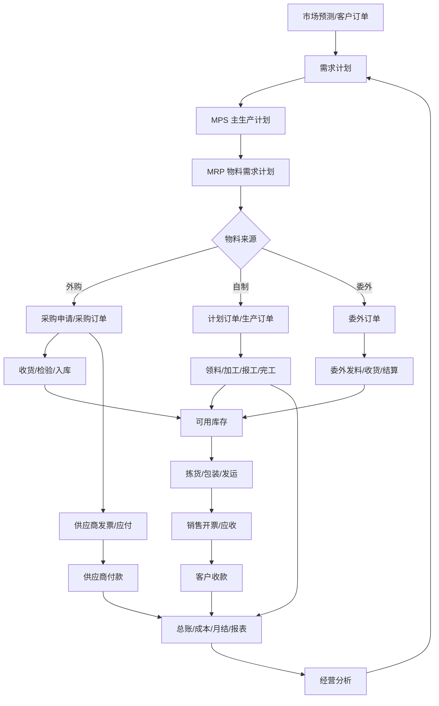
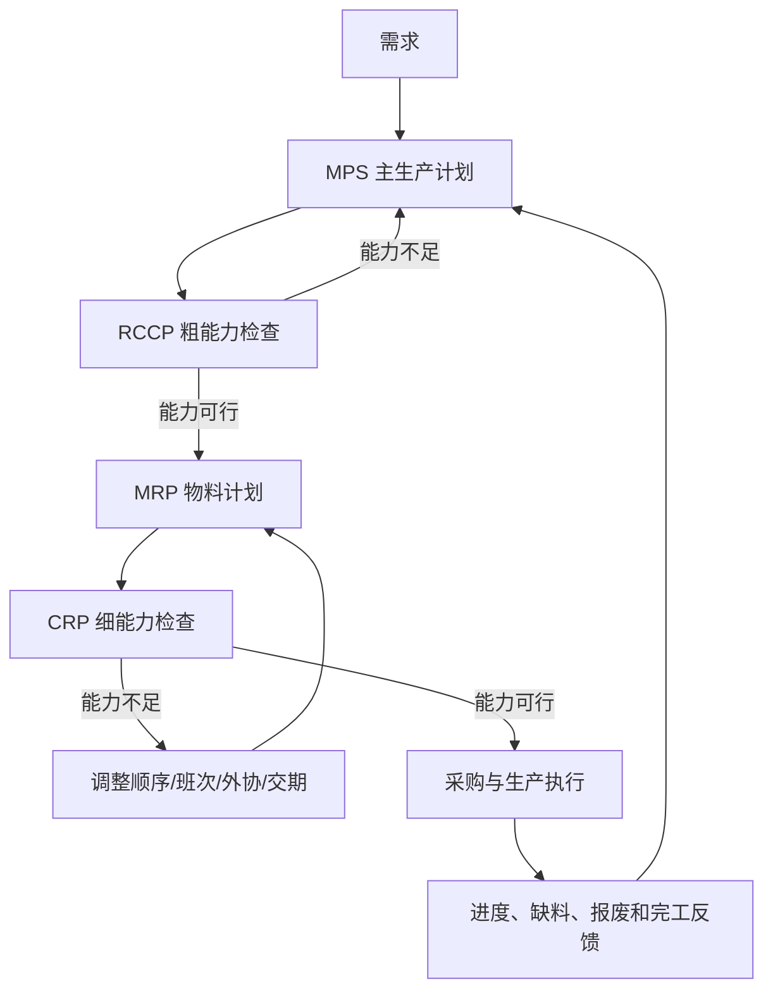
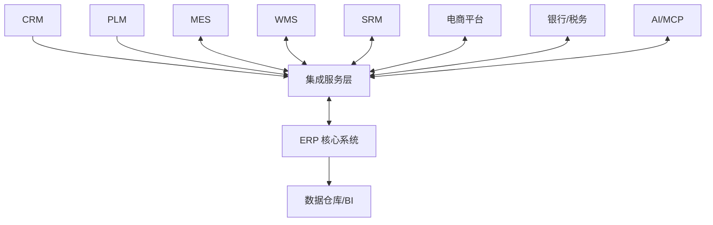
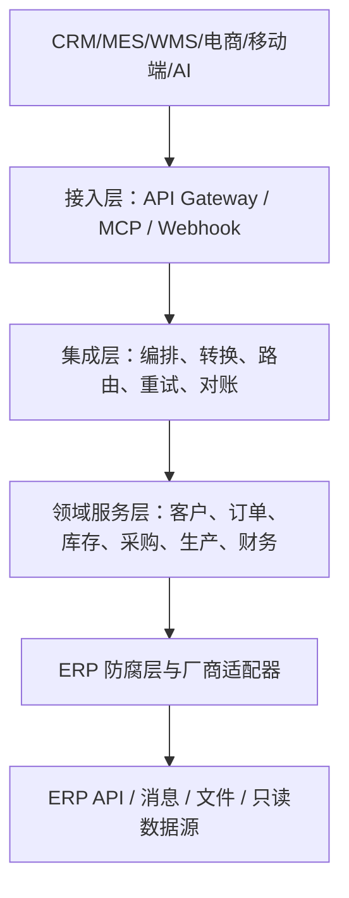
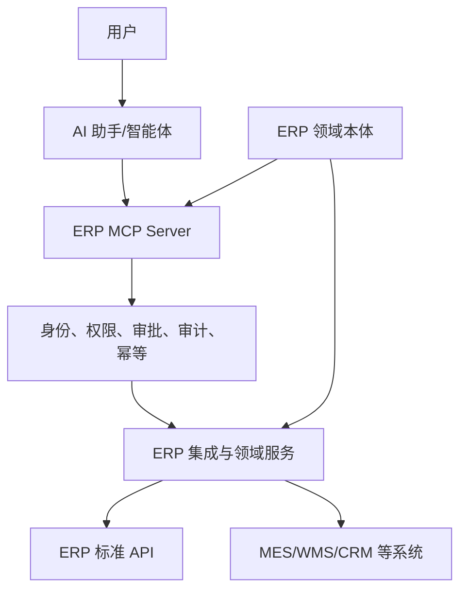

如果只从软件菜单理解 ERP，它看起来不过是一组模块：销售、采购、库存、生产、财务、人力、项目。

但一家企业真正运行起来时，部门并不是彼此独立的。销售承诺了交期，生产就要判断能不能做；生产发现缺料，采购就要及时补货；采购到货后，仓库要收货，质量部门要检验，财务要确认应付；产品发给客户之后，又会产生收入、应收账款、销售成本和现金流。

因此，ERP 的核心并不是“功能很多”，而是把原本分散在不同部门、不同表格和不同系统里的经营活动，组织成一条可以计划、执行、核算、追踪和改进的业务链。

Oracle 对 ERP 的概括是：它用于管理会计、采购、项目、风险与合规、供应链等日常业务，并通过共享数据结构连接大量业务流程。Microsoft 的业务流程目录则把企业经营进一步拆成 Order-to-Cash、Source-to-Pay、Plan-to-Produce、Inventory-to-Deliver、Record-to-Report 等端到端流程。换句话说，理解 ERP 最好的方式不是背模块，而是看清楚一笔需求如何穿过整家企业。

本文将沿着这条主线展开：

1. ERP 到底在管理什么；
2. 销售、采购、生产、库存和财务如何形成闭环；
3. MPS、MRP、RCCP、CRP 为什么是制造型 ERP 的计划中枢；
4. ERP 为什么必须依赖主数据、状态机和内部控制；
5. ERP 如何与 CRM、PLM、MES、WMS、银行和电商平台对接；
6. 如何通过 MCP 把受控的 ERP 能力交给 AI；
7. 如何用领域本体统一不同系统的业务语义。

---

## 一、ERP 不是一套“大而全的软件”，而是一套经营闭环

ERP 是 Enterprise Resource Planning，即企业资源计划。这里的“资源”远不只是库存和资金，还包括：

- 客户、供应商和合作伙伴；
- 原材料、半成品、成品和服务；
- 仓库、库位和在途库存；
- 人员、设备、工作中心和生产能力；
- 合同、订单、项目和交付承诺；
- 现金、应收、应付、资产和预算；
- 时间、提前期、优先级和风险。

一家企业每天都在回答几个基本问题：

- 客户需要什么？
- 需要多少？
- 什么时候交付？
- 当前库存够不够？
- 不够的部分是采购还是生产？
- 采购和生产来得及吗？
- 需要多少资金、设备和人工？
- 最终赚了多少钱？

ERP 的作用，就是把这些问题放在同一套业务模型里计算和执行。


这条链路中存在三个同时发生的流：

### 1. 业务流

```text
询价 → 报价 → 合同 → 订单 → 采购/生产 → 发货 → 开票 → 结算
```

### 2. 物流

```text
供应商 → 原材料 → 在制品 → 产成品 → 客户
```

### 3. 资金流

```text
客户付款 → 应收核销 → 企业现金
企业现金 → 供应商付款 → 应付核销
```

ERP 的价值就在于让三条流不再彼此割裂。仓库发了一批货，系统不仅减少库存，还应知道它对应哪个销售订单、哪个客户、哪张发票、多少销售成本以及最终多少毛利。

---

## 二、不要按模块看 ERP，要按端到端流程看 ERP

模块视角适合组织软件菜单，端到端流程才适合理解企业经营。一个典型 ERP 可以归纳为以下主流程：

| 端到端流程 | 中文含义 | 核心结果 |
|---|---|---|
| Forecast-to-Plan | 预测到计划 | 将市场需求转化为可执行计划 |
| Prospect/Quote-to-Order | 商机/报价到订单 | 将客户需求转化为正式承诺 |
| Order-to-Cash | 订单到收款 | 完成销售、交付、开票和收款 |
| Source-to-Pay | 寻源到付款 | 完成供应商选择、采购、收货和付款 |
| Plan-to-Produce | 计划到生产 | 将供需计划转化为成品 |
| Inventory-to-Deliver | 库存到交付 | 管理库存、拣货、包装和发运 |
| Record-to-Report | 记录到报告 | 将业务交易转化为财务结果 |
| Acquire-to-Dispose | 资产购置到处置 | 管理资产完整生命周期 |
| Hire-to-Retire | 入职到离职 | 管理员工完整生命周期 |
| Project-to-Profit | 项目到利润 | 管理项目预算、执行、收入和成本 |

这些流程不是并排摆放的十条线，而是相互交织的网络。例如：

- 销售订单会影响需求计划、库存预留、生产计划和应收账款；
- 采购收货会影响库存、质量状态、应付暂估和生产可用量；
- 生产领料会影响原材料库存、在制品成本和物料追溯；
- 销售发货会影响成品库存、销售成本、客户交付状态和收入确认条件。

因此，ERP 项目的第一原则应该是：**先定义端到端流程，再决定模块如何配置。**

---

## 三、ERP 的整体业务主线

对制造企业而言，最典型的经营主线如下：



图里最重要的不是某个框，而是闭环：

```text
需求 → 计划 → 执行 → 核算 → 分析 → 重新计划
```

一个没有反馈的计划系统，只会持续输出过时的计划；一个没有计划的交易系统，则只能记录已经发生的事情。ERP 同时需要两者。

---

## 四、销售流程：从客户需求到现金回收

Order-to-Cash，简称 O2C，是企业把市场需求转化为收入和现金的过程。

```text
客户询价
→ 销售报价
→ 价格与折扣审批
→ 销售合同
→ 销售订单
→ 信用与可用量检查
→ 库存预留
→ 拣货、包装和发运
→ 销售出库
→ 销售开票
→ 应收账款
→ 客户收款
→ 应收核销
```

### 1. 报价不是简单填写一个价格

报价阶段通常需要同时判断：

- 客户是否允许交易；
- 产品是否可销售；
- 当前价目表和客户协议价是什么；
- 折扣是否超过销售人员权限；
- 毛利是否低于企业底线；
- 交付日期是否可承诺；
- 税率、币种、付款条件是否正确。

对按订单设计的 ETO 企业，报价阶段甚至会提前触发工程估算、BOM 草案、工时估算和外购件询价。

### 2. 可用库存不等于账面库存

假设系统显示某产品库存 100 件，但其中：

- 30 件已被其他订单预留；
- 20 件处于质量冻结；
- 10 件即将报废；
- 另有 50 件将在三天后生产完工。

那么“现在可发多少”和“一周后可承诺多少”显然不是同一个数字。ERP 一般需要区分：

- 现有量 On-hand；
- 可用量 Available；
- 已预留量 Reserved；
- 已分配量 Allocated；
- 在途量 In-transit；
- 计划接收量 Scheduled Receipts；
- 质检、冻结和不合格库存。

ATP（Available-to-Promise）用于回答“可以向客户承诺多少”，CTP（Capable-to-Promise）则进一步考虑未来产能和供应能力。

### 3. 销售最终必须进入财务

销售业务通常产生两类核心财务影响：

```text
销售出库 → 库存减少，销售成本增加
销售开票 → 应收账款增加，销售收入和销项税确认
客户收款 → 银行存款增加，应收账款减少
```

具体确认时点要服从企业会计政策、合同条款和适用会计准则，但系统设计必须保证业务单据与财务凭证之间可追溯。

---

## 五、采购流程：从需求提出到供应商付款

Source-to-Pay 的范围通常大于 Procure-to-Pay。前者包含寻源、询价、比价、供应商选择和合同，后者更聚焦采购订单、收货、发票和付款。

```text
采购需求
→ 采购申请
→ 询价 RFQ
→ 供应商报价
→ 比价与定标
→ 采购合同
→ 采购订单
→ 供应商送货
→ 收货与质量检验
→ 采购入库
→ 供应商发票
→ 三单匹配
→ 应付账款
→ 付款审批
→ 供应商付款
```

### 1. 采购需求从哪里来

采购申请可能由多种业务触发：

- MRP 发现原材料缺口；
- 仓库库存低于安全库存；
- 销售订单要求直采直发；
- 生产现场出现临时缺料；
- 项目需要专用设备或服务；
- 设备维修需要备件；
- 行政部门申请办公用品；
- 固定资产投资计划获得批准。

如果系统不能标记采购需求的来源，后续就很难判断一笔采购究竟服务于哪个订单、项目、成本中心或生产任务。

### 2. 三单匹配为什么重要

付款前常见的控制是三单匹配：

```text
采购订单 + 收货/验收记录 + 供应商发票
```

系统需要判断：

- 发票数量是否超过实收数量；
- 发票价格是否超过订单价格；
- 税额和附加费用是否符合约定；
- 是否超过允许容差；
- 是否存在重复发票；
- 是否需要质量、采购或财务人员进一步审批。

三单匹配不是为了增加审批步骤，而是为了回答一句最基本的话：**企业是否真的收到了自己订购的东西，并且只支付约定的金额。**

### 3. 采购也必须形成财务闭环

```text
采购收货 → 库存增加，形成收货暂估或应付相关记录
供应商发票 → 确认应付账款，处理价格和税额差异
供应商付款 → 银行存款减少，应付账款核销
```

如果采购数量正确但价格主数据错误，库存数量可能没问题，产品成本和利润却会失真。因此，采购流程从来不只是“把货买回来”。

---

## 六、生产流程：从计划订单到成品入库

制造企业的核心不是创建一张生产订单，而是让物料、能力、工艺、质量和成本在正确时间汇合。

```text
需求计划
→ 主生产计划 MPS
→ MRP
→ 计划订单
→ 生产订单
→ 备料和领料
→ 工序加工
→ 生产报工
→ 过程检验
→ 完工申报
→ 成品检验
→ 成品入库
→ 成本结算
```

### 1. 常见生产模式

| 模式 | 含义 | 常见场景 |
|---|---|---|
| MTS | 按库存生产 | 标准化、大批量消费品 |
| MTO | 按订单生产 | 客户订单驱动的设备或产品 |
| ATO | 按订单装配 | 通用零部件、个性化组合 |
| ETO | 按订单设计 | 非标设备、工程项目 |
| Repetitive | 重复制造 | 汽车零部件、电子装配 |
| Process | 流程制造 | 化工、食品、制药 |
| Subcontracting | 委外加工 | 外部供应商完成部分工序 |

不同模式下，计划对象、成本对象、BOM、工艺路线、批次追溯和完工方式都会不同。一个合格的 ERP 方案不能只问“有没有生产模块”，而要问“生产模型是否符合企业实际”。

### 2. 生产主数据决定计划质量

关键生产主数据包括：

- 物料和产品；
- BOM；
- 工艺路线；
- 工作中心；
- 工时定额；
- 生产版本；
- 提前期；
- 损耗率；
- 批量规则；
- 替代料；
- 质量检验方案。

BOM 告诉系统“做一个产品需要什么”，工艺路线告诉系统“经过哪些步骤做出来”，工作中心则告诉系统“在哪里、用什么资源完成”。三者缺一，计划就很难落地。

---

## 七、MRP：ERP 如何算出应该买什么、做什么、什么时候开始

MRP 是 Material Requirements Planning，即物料需求计划。ASCM 对它的定义强调三个核心输入：**主生产计划、物料清单和库存数据**。系统通过 BOM 展开、库存抵扣和提前期偏移，计算组件数量与需要日期，并提出补货或重排建议。

### 1. MRP 的三个核心输入

#### 主生产计划 MPS

描述最终产品或关键产品：

- 什么时间需要；
- 需要多少；
- 哪些需求已确认；
- 哪些需求来自预测。

#### 物料清单 BOM

描述产品结构：

```text
产品 A
├─ 组件 B × 2
├─ 组件 C × 1
└─ 半成品 D × 1
   ├─ 原料 E × 3
   └─ 原料 F × 2
```

#### 库存与供应记录

包括：

- 当前库存；
- 已分配库存；
- 安全库存；
- 在途采购；
- 在制生产；
- 已下达但未完成的订单；
- 不同库存状态是否可用。

### 2. MRP 的简化公式

```text
净需求
= 毛需求
+ 安全库存
- 可用库存
- 已确定的计划接收量
```

如果结果小于零，净需求通常按零处理。实际系统还要进一步考虑：

- 最小采购量；
- 固定批量；
- 经济批量；
- 包装倍数；
- 采购和生产提前期；
- 质量检验时间；
- 损耗率；
- 替代物料；
- 计划时间围栏；
- 多组织调拨供应。

### 3. 一个最小 MRP 示例

假设第 4 周需要交付 100 件产品 A：

```text
A
├─ B：每件 A 需要 2 件 B
└─ C：每件 A 需要 1 件 C
```

现有库存：

- A：10 件；
- B：30 件；
- C：20 件。

暂不考虑安全库存、损耗和在途供应。

第一步，计算 A 的净需求：

```text
A 净需求 = 100 - 10 = 90 件
```

第二步，展开 BOM：

```text
B 毛需求 = 90 × 2 = 180 件
C 毛需求 = 90 × 1 = 90 件
```

第三步，扣除库存：

```text
B 净需求 = 180 - 30 = 150 件
C 净需求 = 90 - 20 = 70 件
```

第四步，根据提前期倒排。假设：

- A 生产提前期 1 周；
- B 采购提前期 2 周；
- C 采购提前期 1 周。

要在第 4 周完成交付，则：

- A 最迟第 3 周开始生产；
- B 最迟第 1 周下单，并在第 3 周前到货；
- C 最迟第 2 周下单，并在第 3 周前到货。

这就是 MRP 最核心的逻辑：**按数量逐层展开，按时间逐级倒排。**

### 4. MRP 的输出不是命令，而是建议

MRP 常见输出包括：

- 计划采购订单；
- 计划生产订单；
- 采购申请；
- 缺料清单；
- 提前订单建议；
- 延后订单建议；
- 取消订单建议；
- 异常信息。

企业需要明确计划建议何时自动转换、何时人工确认。直接把所有建议自动下达，往往会把错误主数据迅速放大成大量错误订单。

---

## 八、从 MRP 到闭环 MRP、MRPⅡ和 ERP

MRP 解决了物料问题，但它并不天然保证产能可行。

假设系统算出明天要生产 1,000 件产品，但关键设备一天只能生产 300 件，那么物料计划即使完全正确，生产计划仍然无法执行。

### 1. 闭环 MRP

闭环 MRP 在物料计划之外加入：

- RCCP，粗能力计划；
- CRP，细能力需求计划；
- 采购和车间执行；
- 实际完成情况反馈；
- 计划重新计算。



### 2. MRPⅡ

Manufacturing Resource Planning 将计划范围从“物料”扩展到：

- 设备能力；
- 人员工时；
- 采购资金；
- 制造费用；
- 库存资金占用；
- 产品成本；
- 利润和现金流。

计划不再只回答“能不能生产”，还要回答“需要花多少钱，最终是否值得生产”。

### 3. ERP

ERP 继续把范围扩展到整个企业：

```text
订货点法
→ MRP
→ 闭环 MRP
→ MRPⅡ
→ ERP
```

到了 ERP 阶段，客户、供应商、资产、人力、项目、服务、财务、风险和集团协同都进入统一体系。

---

## 九、库存是结果，也是计划的输入

很多企业把库存管理理解为“出库、入库和盘点”，但库存同时还是计划系统的事实基础。

如果系统显示仓库里有 1,000 件原料，现场实际只有 600 件，MRP 就会错误地认为无需采购；如果系统实际有料但账面没有，MRP 又会重复下单。

### 1. 库存常见维度

- 公司和工厂；
- 仓库、库区和库位；
- 物料；
- 批次；
- 序列号；
- 质量状态；
- 库存状态；
- 货主；
- 颜色、尺寸等产品维度；
- 项目或客户专属属性。

### 2. 批次与序列号追溯

对食品、药品、汽车零部件和高价值设备，系统通常需要建立完整链路：

```text
供应商批次
→ 原材料收货批次
→ 生产领料
→ 生产订单
→ 成品批次/序列号
→ 销售发货
→ 最终客户
```

出现质量问题时，企业既要能从供应商向下追踪受影响产品，也要能从客户退回的成品向上追溯原材料和生产过程。

### 3. 库存的真正目标

库存管理不是简单追求“越少越好”，而是在以下目标之间寻找平衡：

- 交付及时率；
- 缺货风险；
- 采购和生产批量效率；
- 库存资金占用；
- 呆滞和过期风险；
- 仓储作业成本。

---

## 十、业财一体化：业务发生时，财务结果已经开始形成

传统模式下，业务部门先做业务，月底再把汇总数据交给财务。ERP 更理想的模式是：业务单据在发生时就携带核算所需信息，系统根据配置生成子账和总账影响。

### 1. 采购循环

```text
采购收货
→ 增加库存或费用
→ 记录收货暂估

供应商发票
→ 确认应付账款
→ 处理价格和税额差异

供应商付款
→ 减少银行存款
→ 核销应付账款
```

### 2. 生产循环

```text
生产领料
→ 原材料转入在制品

人工和制造费用
→ 归集到生产订单或成本对象

成品入库
→ 在制品转入产成品

订单结算
→ 形成实际成本和成本差异
```

### 3. 销售循环

```text
销售出库
→ 减少产成品库存
→ 确认或结转销售成本

销售开票
→ 确认收入、税额和应收账款

客户收款
→ 增加银行存款
→ 核销应收账款
```

### 4. Record-to-Report

所有业务最终汇入记录到报告流程：

```text
业务交易
→ 子模块记账
→ 会计凭证
→ 应收/应付/资产/成本子账
→ 总账
→ 对账、计提、分摊和折旧
→ 成本结算
→ 期间关闭
→ 财务报表和经营分析
```

这也是为什么 ERP 的主数据和配置错误如此危险：一个错误的物料类别、科目确定规则或成本中心，可能让业务操作看似成功，却让财务结果进入错误位置。

---

## 十一、ERP 的三层数据：组织、主数据和交易数据

ERP 是否可靠，首先取决于数据模型是否可靠。

### 1. 组织数据：业务在哪里发生

包括：

- 集团；
- 法人公司；
- 业务单元；
- 工厂；
- 销售组织；
- 采购组织；
- 仓库；
- 成本中心；
- 利润中心；
- 部门和项目组织。

组织结构决定数据隔离、业务权限、会计核算和内部交易关系。

### 2. 主数据：业务涉及谁和什么

包括：

- 客户；
- 供应商；
- 物料和产品；
- BOM；
- 工艺路线；
- 工作中心；
- 会计科目；
- 固定资产；
- 员工；
- 价格、币种和计量单位。

### 3. 交易数据：具体发生了什么

包括：

- 销售订单；
- 采购订单；
- 生产订单；
- 出入库单；
- 发票；
- 收付款；
- 会计凭证；
- 质检单；
- 盘点单。

三类数据可以概括为：

```text
组织数据：在哪里发生
主数据：涉及谁和什么
交易数据：发生了什么
```

例如：

```text
上海工厂（组织）
向供应商甲（供应商主数据）
采购物料 B（物料主数据）
生成采购订单 PO-2026-001（交易数据）
```

---

## 十二、单据、状态机和内部控制

ERP 不是一组可以任意增删改查的表。一个业务对象通常要经过严格状态变化：

```text
草稿
→ 已提交
→ 已审批
→ 已下达
→ 执行中
→ 部分完成
→ 已完成
→ 已关闭
```

状态决定：

- 当前是否允许修改；
- 是否可以撤销；
- 是否占用库存；
- 是否进入 MRP；
- 是否能够生成下游单据；
- 是否已经产生财务影响。

### 1. 不要用“万能更新接口”破坏状态机

如果外部系统直接修改订单表，把状态从“草稿”改成“已完成”，它可能绕过：

- 审批；
- 库存扣减；
- 质量检查；
- 财务记账；
- 消息通知；
- 审计日志。

所以 ERP 对接的基本原则是：**调用业务动作，而不是修改数据库结果。**

### 2. 职责分离

典型控制包括：

- 采购申请人与审批人分离；
- 采购员与收货员分离；
- 收货人与发票审核人分离；
- 付款申请人与付款执行人分离；
- 销售人员不能自行突破价格底线；
- 仓库人员不能随意修改库存价值；
- 制单人与过账或审核人员分离。

ERP 的流程看起来有时“比 Excel 麻烦”，是因为它不仅要提高效率，也要承担风险控制和审计责任。

---

## 十三、用一笔客户订单串联整个 ERP

假设一家设备制造企业收到客户订单：30 天后交付 100 台设备 A。

### 第一步：销售确认需求

系统创建销售订单，并检查：

- 客户信用；
- 产品价格和折扣；
- 付款条件；
- 当前库存；
- 可承诺交期。

### 第二步：计划系统计算供应

现有成品只有 10 台，因此还需要 90 台。MPS 将需求安排到计划周期，MRP 展开 BOM，计算零部件缺口。

### 第三步：区分自制、外购和委外

- 自制件生成计划生产订单；
- 外购件生成采购建议；
- 特殊表面处理生成委外需求；
- 能力计划发现瓶颈设备超负荷，于是安排加班或外协。

### 第四步：采购和生产执行

采购部门下达采购订单，仓库收货，质量部门检验；生产部门领料、加工、报工并完成成品入库。

### 第五步：销售交付

仓库根据销售订单完成预留、拣货、包装和出库，物流系统完成运输，客户签收。

### 第六步：财务核算

系统形成：

- 原材料、在制品和产成品价值变化；
- 供应商应付；
- 生产订单实际成本；
- 销售成本；
- 客户应收；
- 销售收入和税额；
- 最终订单毛利。

一张销售订单因此贯穿：

```text
销售 → 计划 → 采购 → 生产 → 质量 → 仓储 → 物流 → 财务
```

这就是 ERP 的“整体性”。

---

## 十四、ERP 为什么必须与外围系统对接

现实中的企业不可能只运行一套 ERP。常见系统包括：

| 系统 | 主要职责 |
|---|---|
| CRM | 客户、线索、商机和销售活动 |
| PLM | 产品设计、图纸、工程 BOM 和变更 |
| MES | 车间派工、报工、设备和生产执行 |
| WMS | 库位、上架、拣货、包装和仓库作业 |
| SRM | 供应商准入、寻源、协同和绩效 |
| TMS | 运输计划、承运商和运费 |
| HR | 组织、员工、考勤、薪酬和绩效 |
| OA/BPM | 通用审批和协同办公 |
| 电商平台 | 线上订单、促销、退款和平台结算 |
| 银行/支付 | 付款、收款、流水和余额 |
| 税务/电子发票 | 开票、验票、申报和合规 |
| BI/数据平台 | 跨系统分析、指标和经营驾驶舱 |

ERP 通常是正式交易和财务结果的核心系统，但不是所有业务细节的唯一系统。



### 1. 典型对接场景

#### CRM 到 ERP

```text
CRM 客户和商机
→ ERP 客户、报价和销售订单

ERP 库存、发货、开票、回款
→ CRM 客户全景视图
```

#### PLM 到 ERP

```text
产品设计
→ 物料
→ 工程 BOM
→ 制造 BOM
→ 工艺路线和生产版本
```

#### ERP 与 MES

```text
ERP 生产订单、BOM、工艺
→ MES 生产任务

MES 领料、报工、工时、产量、报废
→ ERP 库存与成本
```

#### ERP 与 WMS

```text
ERP 采购/销售/调拨指令
→ WMS 收货、上架、拣货和发运任务

WMS 实际作业结果
→ ERP 正式出入库记录
```

---

## 十五、ERP 对接方式如何选择

系统对接没有一种技术适合所有场景。

### 1. REST、SOAP、OData 等业务 API

适用于实时查询和交易操作，例如：

- 查询库存；
- 创建销售订单；
- 提交采购申请；
- 获取生产订单状态。

OpenAPI 可以用机器可读的方式描述 HTTP API 的路径、参数、请求体、返回结构和安全方案，并用于生成文档、客户端和契约测试。

### 2. 消息队列与业务事件

适用于一个业务变化需要通知多个下游系统：

```text
SalesOrderConfirmed
GoodsReceived
ProductionOrderCompleted
InventoryChanged
InvoiceIssued
PaymentReceived
```

事件驱动可以减少同步调用耦合，但要处理重复消息、乱序、重试、死信和最终一致性。

### 3. Webhook

适合由事件发起方主动通知订阅方。必须考虑：

- 签名验证；
- 重复通知；
- 超时和重试；
- 回调幂等；
- 顺序错乱；
- 调用审计。

### 4. 文件、EDI 和 SFTP

适合：

- 银行对账文件；
- 大批量供应商订单；
- 物流交接；
- 历史数据迁移；
- 固定周期批处理。

文件对接并不“落后”。当对方系统能力有限、数据量很大或业务允许批处理时，它反而可能更稳定。

### 5. CDC

变更数据捕获适合把 ERP 数据变化同步到：

- 数据仓库；
- 搜索引擎；
- 缓存；
- 实时分析平台。

但 CDC 捕获的是“数据表发生了什么”，不一定等于“业务上发生了什么”。因此它适合数据传播，不应代替正式业务 API 执行交易。

### 6. 数据库直连

只读场景可以谨慎使用，例如历史报表或受控的数据抽取。写入 ERP 时则应尽量避免直接改表，因为数据库写入可能绕过业务校验、状态机、审批、库存逻辑和财务记账。

---

## 十六、推荐的 ERP 集成架构

最危险的集成方式，是让每个系统都直接理解 ERP 的私有接口和私有字段。

```text
CRM ─────→ ERP
MES ─────→ ERP
WMS ─────→ ERP
电商 ────→ ERP
AI ──────→ ERP
```

系统数量增加后，会出现：

- 点对点接口数量爆炸；
- 字段映射散落在各个应用；
- 同一规则被重复实现；
- ERP 升级需要同时修改大量系统；
- 权限、审计和限流无法统一；
- 故障难以追踪。

更稳妥的方式是分层：



### 1. 防腐层

防腐层用于隔离 SAP、Oracle、Dynamics 或自研 ERP 的差异。外部系统只面向统一业务模型：

```json
{
  "salesOrderId": "SO-2026-001",
  "companyId": "CN01",
  "customerId": "C1001",
  "currency": "CNY",
  "lines": [
    {
      "materialId": "MAT-001",
      "quantity": 10,
      "unit": "EA",
      "requiredDate": "2026-10-20"
    }
  ]
}
```

适配器再把统一模型转换为具体 ERP 所需结构。

### 2. 明确数据主系统

每类数据必须明确权威来源：

| 数据 | 可能的主系统 |
|---|---|
| 客户线索和销售商机 | CRM |
| 客户财务属性和信用 | ERP |
| 工程图纸和工程 BOM | PLM |
| 正式生产订单 | ERP |
| 车间实时执行明细 | MES |
| 仓库作业和库位明细 | WMS |
| 正式财务凭证 | ERP |
| 员工基础信息 | HR |

“所有系统双向同步所有字段”通常不是集成，而是制造冲突。

### 3. 幂等

同一请求重复到达时，不能重复创建订单或重复扣减库存。常见幂等键：

```text
来源系统 + 业务类型 + 外部请求 ID
```

例如：

```json
{
  "sourceSystem": "CRM",
  "operation": "CREATE_SALES_ORDER",
  "requestId": "crm-order-90881"
}
```

### 4. 最终一致性与对账

接口返回成功不代表永远一致。系统还需要定期对账：

- 客户和物料数量；
- 订单行和金额；
- 库存数量；
- 出入库记录；
- 发票；
- 收付款；
- 状态和更新时间。

可靠集成依靠的是“接口 + 重试 + 补偿 + 对账”，而不是只依靠一次成功响应。

---

## 十七、为什么 ERP 需要领域本体

当企业只有一个系统时，字段映射似乎已经足够。但系统一多，同一个概念会出现不同名称：

| 系统 A | 系统 B | 统一概念 |
|---|---|---|
| Item | Material | 物料 |
| Vendor | Supplier | 供应商 |
| SO | Sales Order | 销售订单 |
| Plant | Factory | 工厂 |
| Work Order | Production Order | 生产订单 |
| Storage Location | Warehouse Location | 库存地点 |

字段名相同，也未必语义相同。例如“库存”可能指账面库存、可用库存、可销售库存、良品库存或包含在途的预计库存。

领域本体的目标，是正式描述：

- 有哪些业务概念；
- 每个概念是什么意思；
- 概念有哪些属性；
- 概念之间有什么关系；
- 哪些约束必须满足；
- 不同系统术语如何映射。

W3C 的 OWL 2 使用类、属性、个体和数据值描述领域知识，并可以与 RDF 数据结合。对 ERP 而言，本体并不一定要从复杂语义技术开始，也可以从受控术语表和统一数据模型逐步演进。

### 1. ERP 核心本体示例

```text
Organization
├─ Enterprise
├─ LegalEntity
├─ BusinessUnit
├─ Plant
├─ Warehouse
├─ CostCenter
└─ ProfitCenter

Party
├─ Customer
├─ Supplier
└─ Employee

ProductAndMaterial
├─ Material
├─ Product
├─ Service
├─ BillOfMaterial
└─ Routing

BusinessDocument
├─ SalesOrder
├─ PurchaseOrder
├─ ProductionOrder
├─ Delivery
├─ Invoice
└─ AccountingDocument
```

### 2. 本体中的业务关系

```text
Customer places SalesOrder
SalesOrder contains SalesOrderLine
SalesOrderLine references Material
SalesOrder fulfilledBy Delivery
Delivery generates SalesInvoice
SalesInvoice creates AccountsReceivable
CustomerPayment settles AccountsReceivable
```

生产领域可以表达为：

```text
Product hasBOM BillOfMaterial
BillOfMaterial contains BOMItem
BOMItem references ComponentMaterial
ProductionOrder produces Product
ProductionOrder consumes Material
ProductionOrder executedAt WorkCenter
```

### 3. 本体不是数据库 ER 图

| 数据库模型 | 领域本体 |
|---|---|
| 关注如何存储 | 关注概念是什么意思 |
| 表、字段、主外键 | 类、属性、关系、规则 |
| 通常绑定具体系统 | 可以跨多个系统 |
| 服务应用实现 | 服务语义共享和推理 |
| 反映某套数据库结构 | 反映整个业务领域知识 |

### 4. 渐进式建设路线

```text
业务术语表
→ 数据字典
→ 统一数据模型
→ 概念与关系模型
→ RDF/OWL/SHACL
→ 企业知识图谱和规则推理
```

不是所有企业都需要立即部署图数据库，但所有跨系统项目都需要明确语义。

---

## 十八、MCP 如何让 AI 安全使用 ERP

MCP，即 Model Context Protocol，为 AI 应用获取上下文和调用外部能力提供标准协议。MCP 服务器的核心原语包括：

- **Resources**：提供上下文数据；
- **Tools**：提供可执行函数；
- **Prompts**：提供可复用的交互模板。

在 ERP 场景中，MCP 不应该替代 ERP API，更不应该让模型直接连接生产数据库。合理结构是：



可以把各层职责概括为：

- ERP：保存正式业务和财务事实；
- 集成层：连接系统并保证可靠性；
- 本体：统一业务语义；
- MCP：把受控能力暴露给 AI；
- AI：理解意图、组合步骤和解释结果；
- 人：审批高风险操作并承担最终责任。

---

## 十九、ERP MCP Server 应该暴露什么

### 1. Resources：让模型先理解规则

适合以资源形式提供：

```text
erp://organizations
erp://ontology/core
erp://ontology/manufacturing
erp://materials/schema
erp://sales-orders/status-definitions
erp://purchase/policies
erp://finance/fiscal-calendar
erp://documents/order-to-cash
```

这些资源可以包含：

- 组织结构；
- 业务术语；
- 状态定义；
- 字段说明；
- 审批制度；
- 会计期间；
- 业务操作手册；
- 领域本体和映射规则。

### 2. Tools：暴露明确的业务动作

查询类工具：

```text
get_customer
search_materials
get_sales_order
query_inventory
get_production_order
query_material_shortages
get_accounts_receivable
```

写入类工具：

```text
create_sales_order_draft
create_purchase_requisition_draft
reserve_inventory
submit_sales_order_for_approval
create_inventory_transfer_request
```

分析类工具：

```text
analyze_inventory_risk
calculate_material_shortage
analyze_supplier_delivery
explain_cost_variance
forecast_cash_requirements
```

工具应该体现业务意图。下面这些通用高权限工具不应直接交给模型：

```text
execute_sql
update_any_table
call_any_api
run_erp_transaction
post_any_journal
```

### 3. Prompts：固化分析入口

可以提供：

- 缺料风险分析；
- 订单交付风险分析；
- 库存积压分析；
- 供应商绩效复盘；
- 月结异常解释；
- 生产成本差异分析。

Prompt 适合组织交互步骤，但不能替代后端权限、参数校验和审批。

---

## 二十、一个 ERP MCP Tool 应该如何设计

以下是采购申请草稿工具的简化定义：

```json
{
  "name": "create_purchase_requisition_draft",
  "description": "根据已确认物料缺口创建采购申请草稿，不直接下达采购订单",
  "inputSchema": {
    "type": "object",
    "properties": {
      "companyId": { "type": "string" },
      "materialId": { "type": "string" },
      "quantity": { "type": "number", "exclusiveMinimum": 0 },
      "unit": { "type": "string" },
      "requiredDate": { "type": "string", "format": "date" },
      "reason": { "type": "string" },
      "requestId": { "type": "string" }
    },
    "required": [
      "companyId",
      "materialId",
      "quantity",
      "unit",
      "requiredDate",
      "requestId"
    ]
  }
}
```

标准输出可以包含：

```json
{
  "success": true,
  "requestId": "ai-request-2026-1001",
  "businessId": "PR-2026-0088",
  "status": "DRAFT",
  "warnings": [],
  "auditId": "audit-88991"
}
```

错误输出应区分业务失败和技术失败：

```json
{
  "success": false,
  "error": {
    "code": "MATERIAL_NOT_PURCHASABLE",
    "message": "物料 MAT-001 未启用外购属性",
    "retryable": false
  },
  "auditId": "audit-88992"
}
```

### Tool 后端不能只是转发请求

它至少应该完成：

1. 验证用户身份和 AI 客户端身份；
2. 检查公司和数据范围权限；
3. 通过本体或主数据服务解析物料、单位和组织；
4. 验证物料是否允许采购；
5. 验证数量和需求日期；
6. 检查幂等键；
7. 调用 ERP 正式业务 API；
8. 保存审计记录；
9. 返回 ERP 单据编号和状态。

MCP 只统一了模型如何发现和调用能力，业务安全仍然要由服务端实现。

---

## 二十一、AI 操作 ERP 的安全边界

ERP 中包含资金、库存、客户、供应商和财务凭证。AI 接入后，最重要的不是“能调用多少工具”，而是“错误调用会造成什么影响”。

### 1. 查询与写入分离

可以按风险拆分：

```text
ERP Read MCP Server
ERP Write MCP Server
ERP Admin MCP Server
```

或者在同一服务中设置不同权限域。只读分析和正式写入不应共享同一套无差别权限。

### 2. 优先创建草稿，不直接执行

推荐模式：

```text
AI 分析并提出建议
→ 创建业务草稿
→ 展示影响范围
→ 用户确认
→ 进入 ERP 正式审批
→ 审批后执行
→ 返回业务结果
```

### 3. 高风险操作必须人工确认

包括：

- 供应商付款；
- 客户退款；
- 修改供应商银行账户；
- 会计凭证过账；
- 大批量库存调整；
- 生产订单强制关闭；
- 大批量取消订单；
- 跨期间财务调整；
- 超信用销售。

### 4. 最小权限和数据范围

权限至少要考虑：

- 哪个法人公司；
- 哪个工厂和仓库；
- 哪类业务对象；
- 只读还是写入；
- 是否允许看到成本、工资、银行账号等敏感字段；
- 是否只能创建草稿；
- 是否允许提交审批；
- 是否允许正式过账。

### 5. 审计日志

每次调用应记录：

- 用户身份；
- AI 客户端和智能体身份；
- MCP 工具名称；
- 输入参数摘要；
- 权限判断；
- 人工确认和审批记录；
- ERP 业务编号；
- 执行结果；
- 时间戳；
- Trace ID 和 Audit ID。

---

## 二十二、本体如何帮助 AI 正确调用 ERP

假设用户提出：

> 查询华东地区未来七天会影响客户订单交付的缺料，并创建采购申请草稿。

这句话包含多个需要解释的概念：

- “华东地区”对应哪些法人、销售组织、工厂和仓库；
- “未来七天”按哪个时区和业务日历计算；
- “缺料”是低于安全库存，还是无法覆盖已确认订单需求；
- “影响交付”是否需要考虑在途采购和在制生产；
- 哪些物料允许外购；
- 是否只创建草稿，不直接下单。

本体和规则层可以把自然语言映射为标准业务对象：

```text
用户语言
→ 意图和实体识别
→ ERP 领域本体
→ 组织、物料、订单和时间标准化
→ MCP 工具选择
→ 参数校验
→ ERP API 调用
```

一个可能的调用链是：

```text
query_sales_order_demand
→ query_inventory
→ query_scheduled_receipts
→ query_production_supply
→ calculate_material_shortage
→ validate_purchasing_material
→ create_purchase_requisition_draft
```

最终输出不应只说“操作成功”，而应返回可审计的业务结果：

```text
发现 3 种可能影响订单交付的物料：

1. MAT-001：预计短缺 120 件，最晚到货日期 2026-10-12
2. MAT-008：预计短缺 50 件，最晚到货日期 2026-10-13
3. MAT-021：预计短缺 300 米，最晚到货日期 2026-10-14

已创建采购申请草稿：PR-2026-0098
当前状态：待采购经理审批
审计编号：audit-88991
```

---

## 二十三、ERP 对接和 MCP 如何测试

### 1. 接口契约测试

验证：

- 参数类型和必填字段；
- 枚举值；
- 返回结构；
- 错误码；
- API 版本兼容；
- OpenAPI 与真实实现是否一致。

### 2. 数据映射测试

验证：

- 公司和组织映射；
- 客户、供应商和物料映射；
- 计量单位换算；
- 币种和汇率；
- 税率；
- 状态映射；
- 时区和业务日期。

### 3. 幂等测试

必须模拟：

- 同一请求重复提交；
- 网络超时后重试；
- 消息重复消费；
- ERP 已成功但响应丢失；
- 客户端误触发两次。

### 4. 异常测试

包括：

- ERP 暂时不可用；
- 接口超时；
- 权限不足；
- 库存不足；
- 订单已取消；
- 会计期间关闭；
- 审批尚未完成；
- 主数据已停用；
- 调用期间业务状态发生变化。

### 5. MCP 安全测试

重点验证：

- 越权查询；
- 跨公司访问；
- 提示注入；
- 恶意工具参数；
- 敏感信息泄漏；
- 绕过人工确认；
- 重复执行高风险操作；
- 模型尝试调用未授权工具。

### 6. 端到端业务测试

真正的测试链路应覆盖：

```text
用户自然语言请求
→ AI 理解
→ 本体映射
→ MCP 调用
→ 集成服务
→ ERP 处理
→ 库存和财务变化
→ 审计日志
→ 用户最终结果
```

---

## 二十四、ERP 项目为什么经常失败

ERP 失败很少是因为“少了一个页面”，更多是因为管理和数据基础不成立。

### 1. 把 ERP 当成软件安装

ERP 实施实际包含：

```text
管理变革
+ 流程梳理
+ 组织和权限设计
+ 主数据治理
+ 系统配置
+ 集成开发
+ 数据迁移
+ 测试和培训
+ 上线运营
```

### 2. 基础数据不可信

| 数据问题 | 直接后果 |
|---|---|
| BOM 错误 | MRP 算错、缺料或多买 |
| 库存不准 | 重复采购或现场停线 |
| 提前期错误 | 订单过早或过晚下达 |
| 工艺路线错误 | 排产和成本失真 |
| 损耗率错误 | 备料不足或库存积压 |
| 单位换算错误 | 数量和金额成倍偏差 |
| 科目配置错误 | 财务报表进入错误科目 |

### 3. 旧流程原样搬进新系统

如果每个部门都要求系统保持旧做法，ERP 最终会变成一套更昂贵、更复杂的旧系统。

### 4. 过度定制

定制越多：

- 升级越困难；
- 测试范围越大；
- 接口越脆弱；
- 关键知识越依赖少数人员；
- 长期维护成本越高。

### 5. 上线后无人治理

上线不是结束。企业需要持续治理：

- 主数据质量；
- 流程执行率；
- 接口异常；
- 权限和职责分离；
- 库存和财务对账；
- 计划参数；
- 用户培训；
- 经营指标。

---

## 二十五、ERP 落地的建议路线

### 第一阶段：建立业务和数据基础

- 定义组织结构；
- 统一客户、供应商和物料编码；
- 梳理会计科目和核算维度；
- 清理库存；
- 明确端到端流程负责人。

### 第二阶段：打通核心交易

- 销售订单到收款；
- 采购申请到付款；
- 库存出入库和盘点；
- 应收、应付和总账。

### 第三阶段：建立制造计划闭环

- BOM 和工艺路线；
- MPS 和 MRP；
- 生产订单；
- 能力计划；
- 生产成本和质量追溯。

### 第四阶段：建设集成平台

- 明确数据主系统；
- 建立统一数据模型；
- 建设 API、事件和文件通道；
- 实现幂等、重试、补偿、对账和监控。

### 第五阶段：建立语义和智能层

- 建设业务术语表；
- 建设领域本体；
- 开放只读 MCP Tools；
- 增加分析型工具；
- 再逐步开放创建草稿和提交审批；
- 对高风险操作保留人工确认。

这条路线的核心是：**先让业务事实可信，再让系统互联，最后让 AI 参与。**

---

## 二十六、重新理解 ERP

ERP 不是财务软件，也不只是进销存；不是上了系统就完成管理升级，更不是让 AI 直接连接数据库就实现智能化。

一个成熟的 ERP 体系包含四个层次：

### 第一层：经营闭环

```text
客户需求
→ 销售订单
→ 需求与供应计划
→ 采购和生产
→ 库存与交付
→ 收付款和成本
→ 财务报表
→ 经营分析
```

### 第二层：管理控制

```text
主数据
+ 状态机
+ 审批
+ 权限
+ 职责分离
+ 审计
```

### 第三层：系统集成

```text
API
+ 业务事件
+ 文件/EDI
+ 幂等
+ 重试和补偿
+ 对账和监控
```

### 第四层：语义与智能

```text
领域本体
+ MCP Resources
+ MCP Tools
+ AI 意图理解
+ 人工确认
```

可以用一句话总结全文：

> ERP 以客户需求为起点，以计划体系为中枢，以采购、生产、库存和销售为执行主体，以财务和成本为价值反映；集成平台负责连接不同系统，领域本体负责统一业务语义，MCP 则在权限、审批和审计约束下，把受控的 ERP 能力提供给 AI。

真正优秀的 ERP，不是模块最多的 ERP，而是能够让企业在同一套可信事实之上完成计划、执行、核算和改进的 ERP。

---

## 参考资料

1. [Oracle：什么是 ERP？](https://www.oracle.com/cn/erp/what-is-erp/)
2. [Microsoft Learn：Dynamics 365 业务流程总览](https://learn.microsoft.com/en-us/dynamics365/guidance/business-processes/)
3. [ASCM：Material Requirements Planning 定义](https://learn.ascm.org/sfc/servlet.shepherd/document/download/069R3000006PlDHIA0?operationContext=S1)
4. [OpenAPI Initiative：OpenAPI Specification](https://spec.openapis.org/oas/)
5. [Model Context Protocol：Server Overview](https://modelcontextprotocol.io/specification/draft/server/index)
6. [Model Context Protocol：2026-07-28 Specification](https://blog.modelcontextprotocol.io/posts/2026-07-28/)
7. [W3C：OWL 2 Web Ontology Language Overview](https://www.w3.org/TR/owl-overview/)
8. [W3C：OWL 2 Structural Specification](https://www.w3.org/TR/owl-syntax/)
