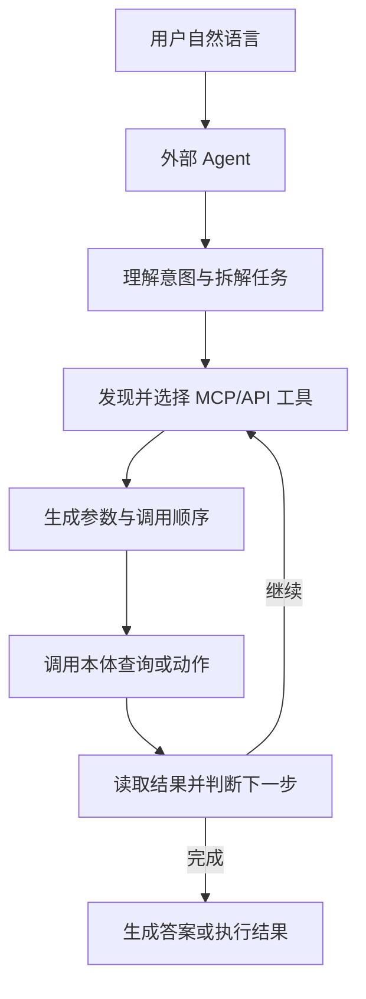
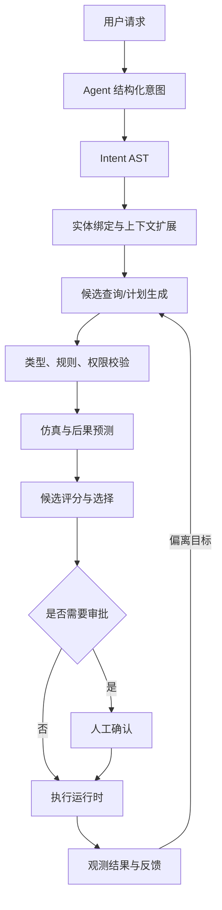
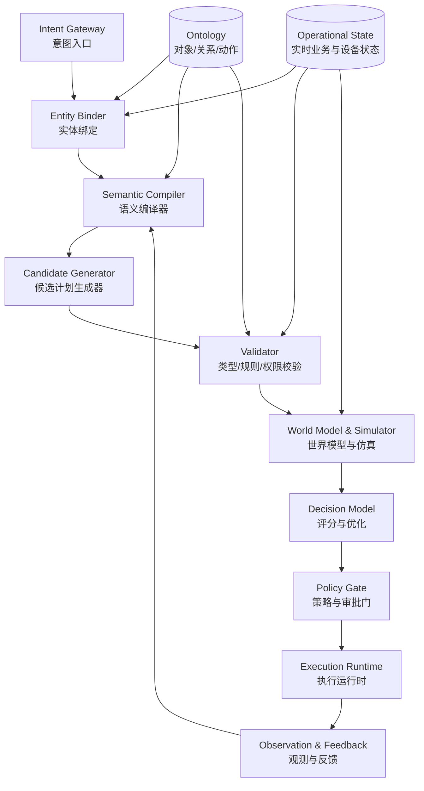
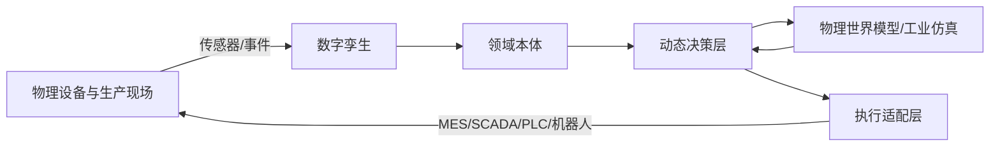
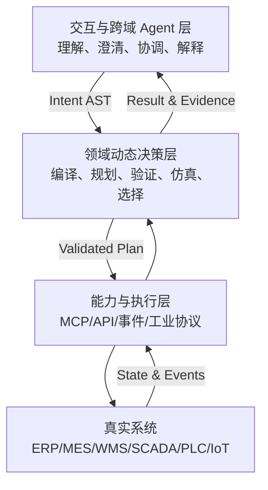

用户对一套工业系统说：

> “3 号产线未来四小时不要停线。请判断哪些设备最可能过热，并给出不影响今天交付的调整方案。”

这句话看起来只是一次自然语言查询，实际却同时包含了对象识别、状态查询、风险预测、排产优化、安全约束和执行授权：

- “3 号产线”在资产系统、MES 和本体中分别对应哪个对象？
- “未来四小时”需要查询实时状态，还是必须运行预测模型？
- “不要停线”是绝对不能违反的硬约束，还是一种业务偏好？
- “不影响今天交付”需要读取哪些订单、工序、物料和产能数据？
- 系统应该只给建议，还是可以直接修改排产？
- 如果调整方案会提高能耗、延长其他订单的等待时间，应该如何权衡？

当我们讨论“本体如何和其他系统打通”时，最容易先想到接口：把对象查询做成 API，把本体动作做成 Function Call，再用 MCP 暴露给 Agent。这样当然能够工作，但它只回答了一个问题：**本体能力如何被调用。**

更深一层的问题是：

> 面对一个目标，谁来决定应该查询什么、按照什么顺序执行、生成哪些候选方案、如何验证方案，以及最终选择哪一个方案？

这个问题决定了系统的真正分工。执行逻辑可以主要放在外部 Agent，也可以下沉到以本体为语义底座的动态决策层。二者都可能使用 MCP、API 和大模型，但它们并不是同一种架构。

本文尝试把这两条路线讲清楚：

1. **Agent 中心模式**：把本体能力封装成标准工具，交给外部 Agent 自由组合；
2. **动态决策层中心模式**：Agent 负责结构化用户意图，本体侧负责生成、验证、比较和执行领域计划；
3. **工业闭环模式**：再将数字孪生、物理世界模型和真实控制系统接入决策过程。

本文的核心判断是：

> 本体与外部系统打通，表面上是协议问题，本质上却是控制权问题——领域执行逻辑究竟由外部 Agent 临时组织，还是由领域内部的动态决策层稳定承载。

---

## 一、本体不能只是一张描述世界的关系图

在传统语境中，本体主要用来描述一个领域中有哪些概念、对象之间存在什么关系，以及这些概念应该如何被一致地理解。

例如，在制造领域中，我们可以定义：

- 产线由工作中心和设备组成；
- 设备具有型号、位置、温度、状态和额定负载；
- 工单属于生产订单，并在某个工作中心执行；
- 生产订单承诺某个交付日期；
- 设备故障可能影响工序，工序延误又可能影响订单交付。

这种模型解决了“不同系统如何用同一种业务语言描述世界”的问题。OWL 等标准强调可解释的类、属性、个体和约束，SPARQL 则提供了对 RDF 图进行模式匹配和查询的标准语言。它们奠定了本体作为语义层的基础。

但是，当本体开始参与业务系统运行时，仅仅知道“世界中有什么”还不够。系统还必须知道：

- 对象现在处于什么状态；
- 对象允许执行哪些动作；
- 动作需要满足什么前置条件；
- 动作会产生哪些后果；
- 哪些角色有权执行；
- 哪些动作必须审批；
- 执行失败后如何补偿；
- 执行完成后如何验证现实状态。

因此，一个面向 Agent 和自动化执行的本体，至少需要包含五类内容：

| 组成部分 | 回答的问题 |
| --- | --- |
| 领域对象模型 | 世界中有什么对象 |
| 关系与状态模型 | 对象如何关联，现在处于什么状态 |
| 行为模型 | 对象允许进行什么操作 |
| 约束与策略 | 什么条件下可以或不可以操作 |
| 系统映射 | 查询和动作最终对应哪个真实系统 |

可以将它概括为：

> **可执行本体 = 领域对象模型 + 状态模型 + 行为模型 + 约束规则 + 执行映射。**

这时，本体已经不再只是数据之上的标签，也不只是知识图谱中的节点和边。它开始接近一套围绕业务对象组织起来的领域运行模型。

Palantir 的 Ontology 是一个有代表性的工业实现：它不仅组织对象、属性和链接，也将 Actions、Functions、权限和底层数据连接纳入同一操作模型；其 Ontology MCP 又可以把对象查询、动作和函数暴露给 AI 应用。这个例子说明，“可查询的语义层”和“可执行的业务层”正在逐渐合流。

但能力能够被调用，并不意味着调用方式已经被确定。接下来就出现了两种不同的架构路线。

---

## 二、路线一：把本体封装成 MCP 或 API，由 Agent 自由组合

第一条路线最直观，也最容易落地：将本体的查询和执行能力包装成标准接口，然后让 Agent 根据用户问题选择和组合这些能力。

这些能力可以通过不同技术形式暴露：

- REST 或 GraphQL API；
- Function Calling；
- SDK；
- 消息和事件；
- MCP Server；
- 面向工业系统的协议适配器。

例如，本体平台可以提供下面这些工具：

```text
find_production_line
list_line_equipment
query_equipment_realtime_state
predict_equipment_overheat_risk
query_orders_at_risk
simulate_production_schedule
update_production_schedule
create_maintenance_work_order
```

MCP 的价值在于，它为模型发现和调用外部能力提供了一套相对统一的协议。服务端可以声明工具名称、用途、输入 Schema 和输出结构，客户端或模型再根据上下文选择调用。于是，本体不必针对每一种 Agent 框架重复开发专用插件，而可以作为一个标准能力服务存在。

### 1. Agent 中心模式的执行过程

在这种架构中，一次任务通常会按照下面的路径运行：



Agent 负责：

- 理解自然语言；
- 将目标拆成步骤；
- 选择查询或动作；
- 生成工具参数；
- 决定调用顺序；
- 根据中间结果继续规划；
- 处理失败和重试；
- 汇总最终结果。

本体层则主要负责：

- 提供结构化对象和关系；
- 执行单次查询；
- 执行单个 Action；
- 校验当前调用的参数；
- 返回结构化结果。

换句话说，本体在这里更像一个**带有领域语义的工具箱**，而外部 Agent 是工具箱的主要使用者和流程组织者。

### 2. 这条路线为什么有吸引力

它首先解决了连接成本问题。只要本体能力被包装成稳定接口，Agent 就可以像调用搜索、数据库、代码执行器一样调用本体。

它还有几个明显优势：

- **接入速度快**：不必先建设完整的领域规划引擎；
- **开放性强**：不同 Agent、模型和应用可以复用同一组能力；
- **跨系统组合方便**：Agent 可以同时调用本体、邮件、日历、ERP 和外部搜索；
- **适合长尾需求**：不必为每一种临时查询预先编排工作流；
- **便于渐进建设**：可以先从只读查询开始，再逐步增加受控动作。

对于下面这些任务，这种方式通常已经足够：

- 查询某台设备的状态和关联工单；
- 汇总某个客户的订单、合同和交付情况；
- 生成业务报告；
- 检索知识并给出解释；
- 在人工确认后创建一张工单；
- 完成低风险、弱事务性的跨系统协作。

### 3. 真正的问题：能力标准化，不等于决策标准化

工具接口可以被标准化，但 Agent 如何组合工具，仍然可能是不稳定的。

同一个用户问题，不同 Agent 可能生成完全不同的调用链：

```text
方案 A：先查设备 → 再查温度 → 再做风险预测 → 最后查订单
方案 B：先查订单 → 推导关键产线 → 再查设备 → 再做排产仿真
方案 C：直接调用排产工具，但没有先检查传感器数据是否完整
```

单次调用通过了参数校验，也不代表整条计划是正确的。这里至少存在六类风险。

#### 第一，领域逻辑容易散落在 Prompt 中

“预测前必须检查数据时效”“修改排产前必须检查锁定工单”“停机动作必须经过安全审批”等规则，可能被写在 Agent Prompt、Skill、工作流和不同工具内部。时间一长，没人知道哪一处才是权威规则。

#### 第二，局部合法不代表全局合法

每一个工具调用都可能是合法的，但组合起来却违反业务约束。例如，降低某台设备负载可以减少过热风险，却可能导致关键订单延期。

#### 第三，Agent 不一定理解完整状态机

业务对象往往有严格的生命周期。已经下达到车间的工单、已经锁定的排产、已经结算的合同，不能像普通草稿一样修改。

#### 第四，跨步骤事务难以保证

如果 Agent 已经更新排产，却在创建物料调拨单时失败，就需要回滚、补偿或进入人工处理。通用 Agent 很难仅凭工具说明稳定处理这种事务。

#### 第五，高风险执行不能只依赖语言推理

大模型可以解释规则，但安全联锁、权限判断和确定性约束不应完全依赖模型“记得遵守”。

#### 第六，领域能力被暴露得过细

如果外部 Agent 必须理解几十种设备类型、上百个状态和大量底层操作，它实际上已经在外部重新实现了一遍领域系统。

因此，第一条路线解决了“如何把能力交给 Agent”，却没有彻底解决“谁对计划正确性负责”。

---

## 三、路线二：Agent 只负责结构化意图，本体侧生成执行计划

第二条路线改变的不是协议，而是职责边界。

外部 Agent 不再直接拼接底层工具调用，而是先把用户语言转换成一个受约束的结构化意图。这个结构化意图进入领域内部后，再由本体侧根据对象、关系、规则、实时状态和可用动作生成候选查询或候选执行计划。

对于前面的用户问题，Agent 可以输出类似下面的内容：

```json
{
  "goal": {
    "type": "minimize",
    "metric": "equipment_overheat_risk"
  },
  "scope": {
    "production_line": "3号产线"
  },
  "time_horizon": "4h",
  "hard_constraints": [
    "no_line_shutdown",
    "today_delivery_not_affected"
  ],
  "soft_preferences": [
    "minimize_energy_increase",
    "minimize_schedule_changes"
  ],
  "requested_output": [
    "risk_equipment_list",
    "recommended_adjustment_plan",
    "decision_explanation"
  ],
  "execution_mode": "recommend_then_approve",
  "risk_tolerance": "low"
}
```

这里的关键变化是：Agent 输出的不再是 `update_schedule(orderId, startTime)` 这样的底层调用，而是“目标、范围、时间、约束、偏好和执行方式”。

这可以称为**意图 AST**。

### 1. 为什么要借用 AST 的概念

编译器不会直接把一段源代码当作无结构文本执行。它会先完成词法和语法分析，将代码转换成抽象语法树，再进行类型检查、优化和代码生成。

领域决策也可以采用类似思路：

```text
自然语言
  ↓
结构化意图 AST
  ↓
领域实体绑定
  ↓
本体类型与规则检查
  ↓
候选查询／候选计划生成
  ↓
验证、优化和仿真
  ↓
可执行计划
```

SPARQL 标准本身也区分查询字符串、抽象语法和查询代数。这里并不是说业务意图必须直接翻译成 SPARQL，而是借用同一个工程思想：**先把自然语言中的歧义收敛为可检查的中间表示，再生成具体执行语言。**

一个比较完整的意图 AST 可以包含：

| 字段 | 含义 |
| --- | --- |
| Goal | 想要达到什么目标 |
| Target | 目标作用于哪些对象 |
| Scope | 业务、空间和组织范围 |
| Horizon | 决策面向哪个时间窗口 |
| Hard Constraints | 绝对不能违反的约束 |
| Soft Preferences | 可以权衡的偏好 |
| Risk Tolerance | 可以接受多大风险 |
| Output Contract | 用户希望得到什么结果 |
| Execution Mode | 只查询、给建议、审批后执行或自动执行 |
| Authorization Context | 谁发起、拥有什么权限、代表哪个组织 |

这种表示并不能消除所有不确定性，但它能把不确定性显式暴露出来。缺少交付日期，就补充数据；“尽量不要停线”到底是硬约束还是软偏好，就在执行前澄清，而不是让模型在调用工具时临时猜测。

### 2. 本体侧如何把意图编译成计划

收到意图 AST 后，领域内部可以进行六个阶段的处理。

#### 阶段一：实体绑定

将“3 号产线”“今天交付”“过热”等用户表达映射到确定的本体元素：

- `3 号产线` → `ProductionLine/LINE-003`；
- `今天交付` → 当地时区当天承诺交付的订单集合；
- `过热` → 不同设备类型对应的温度阈值和持续时间规则；
- `不停线` → 禁止生成 `ShutdownLine` 类型动作。

#### 阶段二：上下文扩展

根据本体关系补全决策所需上下文：

```text
产线
 ├─ 包含哪些工作中心
 ├─ 工作中心包含哪些设备
 ├─ 当前执行哪些工单
 ├─ 工单属于哪些订单
 ├─ 订单承诺何时交付
 ├─ 设备依赖哪些物料和人员
 └─ 哪些传感器描述设备热状态
```

用户不需要知道这些数据分别位于 MES、ERP、时序数据库还是设备平台。本体负责将它们组织成同一个业务上下文。

#### 阶段三：候选生成

系统不必一次押注一个计划，而可以生成多个候选：

- 候选 A：仅降低高风险设备速度；
- 候选 B：把部分工序迁移到同类设备；
- 候选 C：调整工单顺序，将高负载工序延后；
- 候选 D：增加主动冷却，同时保持原排产；
- 候选 E：组合降速、迁移和冷却，获得更稳妥的折中方案。

#### 阶段四：确定性校验

先排除必然不可行的候选：

- 是否违反停线禁令；
- 是否修改了锁定工单；
- 是否超出设备额定能力；
- 是否缺少合格操作人员；
- 是否需要不存在的物料；
- 发起人是否有权批准；
- 是否触发安全或合规规则。

#### 阶段五：仿真和评分

对剩余候选计算或预测：

- 过热风险下降多少；
- 订单是否会延期；
- 能耗增加多少；
- 调整涉及多少工单；
- 执行失败的概率；
- 是否容易回滚；
- 数据和模型置信度如何。

#### 阶段六：选择和执行

系统根据评分结果选择一个方案，或者将多个方案连同权衡依据交给用户。如果执行模式是 `recommend_then_approve`，系统必须等待确认；如果属于低风险自动化范围，则可以交给执行运行时完成。

整体过程可以表示为：



### 3. “多个查询待选”不应只是让模型投票

让模型一次生成五条 SPARQL、SQL 或 API 调用，再让另一个模型选一条，确实比单次生成更稳健，但仍然不够。

因为候选计划的优劣不是单一语义问题。一个计划可能非常契合用户语言，却无法在当前设备状态下执行；另一个计划技术上可行，却违反权限或交付约束。

更合理的方式是分层评分：

| 评分维度 | 典型问题 | 更适合的实现 |
| --- | --- | --- |
| 语义契合度 | 是否真正回答用户问题 | 大模型、语义匹配模型 |
| 本体一致性 | 类型、关系和动作是否存在 | Schema、本体推理器 |
| 状态可行性 | 当前状态是否满足前置条件 | 状态机、规则引擎 |
| 约束满足度 | 是否满足交付、安全和资源约束 | 约束求解器、优化器 |
| 后果预测 | 执行后可能发生什么 | 数字孪生、预测模型、世界模型 |
| 权限与合规 | 谁能以什么方式执行 | 策略引擎、权限系统 |
| 成本收益 | 风险、收益、时间和资源如何权衡 | 决策模型、运筹优化 |

因此，模型遴选只是动态决策的一部分。真正可靠的候选选择应该是：

> **语言模型负责理解和解释，确定性系统负责排除非法计划，优化与仿真模型负责比较可行计划。**

### 4. 从“生成查询”进一步走向“生成领域程序”

如果用户只是问“哪些设备存在风险”，候选结果可能只是几条查询。但当用户要求“给出并执行调整方案”时，系统生成的已经不是单条查询，而是一段有条件、有依赖、有补偿逻辑的领域程序：

```yaml
plan_id: PLAN-20261009-003
preconditions:
  - sensor_data_freshness < 5m
  - production_line.status == RUNNING
  - locked_orders_unchanged == true
steps:
  - query_current_equipment_state
  - run_overheat_prediction
  - calculate_schedule_alternatives
  - simulate_top_3_plans
  - request_production_manager_approval
  - update_mes_schedule
  - notify_shift_supervisor
postconditions:
  - delivery_risk <= baseline
  - overheat_risk < threshold
compensation:
  - restore_previous_schedule
  - create_manual_intervention_ticket
```

这段程序不一定真的使用 YAML 存储，但它应该具有类似的结构化语义：前置条件、步骤、依赖、后置条件、审批点、超时和补偿路径都必须显式存在。

一旦走到这一步，本体侧承担的就不再是普通查询翻译，而是**领域计划的编译与执行**。

---

## 四、两种路线的本质差异：执行控制权放在哪里

两种架构都可以使用大模型、MCP、API 和工作流，因此不能只通过技术名词区分它们。

真正的分界线是：

> 谁拥有领域执行逻辑，谁对计划的正确性和后果负责？

| 对比维度 | Agent 中心模式 | 动态决策层中心模式 |
| --- | --- | --- |
| 本体对外提供 | 细粒度查询和动作 | 高层目标能力与意图入口 |
| Agent 输出 | 工具调用及其顺序 | 结构化意图 AST |
| 任务拆解者 | 外部 Agent | 领域动态决策层 |
| 候选计划 | 多数由 Agent 隐式形成 | 显式生成、保存和比较 |
| 领域规则位置 | Prompt、Skill、工具和流程中 | 本体、策略与决策模型中 |
| 执行前验证 | Agent 自检加工具局部校验 | 类型、规则、权限、仿真多层验证 |
| 跨步骤事务 | 较难保证 | 由执行运行时统一管理 |
| 解释依据 | 主要是 Agent 推理文本 | 意图、规则、候选、评分和仿真记录 |
| 适合场景 | 开放探索、长尾查询、跨域协作 | 强约束、高风险、领域闭环执行 |

第一种模式把本体视为一组**语义化工具**。第二种模式则进一步把本体所在的平台视为**领域程序的编译和运行环境**。

这并不意味着第二种模式总是更好。如果任务是临时查资料、跨多个知识域做开放分析，强行把全部逻辑压入本体侧反而会降低灵活性。相反，如果任务涉及生产、安全、资金、审批和物理设备，就不能把全部控制权交给一个只看到工具说明的通用 Agent。

因此，选择边界时可以使用一个简单判断：

- **错误可以轻易撤销、主要影响信息质量**：更适合 Agent 自由编排；
- **错误会改变业务状态、产生资金或物理后果**：更适合由领域决策层接管；
- **跨域理解复杂，但域内执行约束很强**：采用混合模式。

---

## 五、动态决策层：本体之上的规划、验证与执行中枢

本文将第二种模式中的核心组件称为**动态决策层（Dynamic Decision Layer）**。

需要说明的是，这个名称更适合作为一种架构抽象，而不是声称行业已经形成了完全统一的产品定义。现实系统中，与它相近的能力可能分别叫作：

- Agent Orchestration；
- Planning Engine；
- Decision Intelligence；
- Optimization Engine；
- Policy Engine；
- Action Runtime；
- Model-based Planning；
- Digital Twin Simulation；
- World Model。

之所以有必要把这些能力抽象为独立的一层，是因为它承担的责任既超出了传统本体数据库，也超出了普通大模型 Agent。

### 1. 动态决策层的输入

它至少接收四类输入：

1. **结构化意图**：用户想做什么、约束是什么；
2. **本体模型**：领域中有哪些对象、关系、状态、规则和动作；
3. **现实状态**：当前设备、订单、库存、人员和环境处于什么状态；
4. **决策能力**：有哪些预测、仿真、优化和执行服务可以使用。

### 2. 动态决策层的输出

它输出的不只是答案，还可能包括：

- 可执行查询；
- 候选计划；
- 推荐计划；
- 计划评分；
- 约束满足情况；
- 风险和置信度；
- 审批请求；
- 执行命令；
- 结果观测和重新规划信号。

### 3. 动态决策层的内部组件



#### Intent Gateway：意图入口

负责接收 Intent AST，校验结构完整性，并判断是否需要向用户追问。例如，“优化排产”没有说明优化目标，就不能直接进入执行阶段。

#### Entity Binder：实体绑定

将用户语言中的名称映射为本体对象，并处理同名、别名和上下文。例如，“一车间三线”和“3 号产线”可能指向同一个资产。

#### Semantic Compiler：语义编译器

将目标和约束翻译成领域内部的查询、规则条件和计划骨架。它相当于从“想做什么”到“需要哪些领域操作”的编译过程。

#### Candidate Generator：候选生成器

候选不必全部由大模型生成，可以混合使用：

- 规则模板；
- 图搜索；
- 历史案例检索；
- 大模型生成；
- 规划算法；
- 约束求解；
- 运筹优化；
- 强化学习策略。

#### Validator：验证器

负责尽早淘汰不合法、不完整和不可执行的计划。验证器越确定，越不应该交给概率模型代替。

#### World Model & Simulator：世界模型与仿真

预测候选动作对未来状态的影响。在工业环境中，它可能是机理模型、离散事件仿真、数字孪生、数据驱动预测模型，或者这些模型的组合。

#### Decision Model：决策模型

对已经通过硬约束校验的候选进行排序和优化。它关注的是多目标权衡，而不是简单判断“对或错”。

#### Policy Gate：策略与审批门

根据风险、权限和组织制度决定：

- 自动执行；
- 请求人工确认；
- 升级到更高权限审批；
- 只返回建议；
- 拒绝执行。

#### Execution Runtime：执行运行时

将计划可靠地落实到 ERP、MES、WMS、SCADA、PLC 或其他系统，并管理幂等、超时、重试、补偿和事务状态。

#### Observation & Feedback：观测与反馈

执行不是流程终点。系统必须检查现实世界是否按照预期变化。如果设备温度没有下降，或者订单风险意外上升，就要重新规划。

### 4. 为什么它应该逻辑独立

动态决策层可以和本体平台部署在一起，也可以是独立服务。关键不是物理部署，而是职责上必须能被识别和治理。

本体主要提供：

- 稳定的领域语义；
- 对象身份；
- 关系网络；
- 状态和动作定义；
- 约束的业务含义。

动态决策层则在此基础上负责：

- 解释目标；
- 生成计划；
- 比较后果；
- 控制执行；
- 根据反馈重新规划。

因此，更准确的关系是：

> 本体是动态决策层的语义底座，但动态决策层不等于本体存储。它还包括规划、约束、仿真、优化、策略和执行运行时。

---

## 六、工业场景中，本体还需要连接数字孪生与物理世界模型

在纯信息系统中，一次动作的后果通常体现在数据库状态变化上；在工业系统中，动作还会改变物理世界。

降低设备转速会影响产能和温度，调整工序会改变物料到达时间，机器人路径会影响碰撞风险，能源策略会改变成本和设备负载。系统不能只验证“API 参数是否合法”，还要判断“现实世界会发生什么”。

这正是数字孪生和物理世界模型进入架构的原因。

### 1. 本体回答“世界是什么”

本体描述：

- 哪些对象是设备、产线、工单和订单；
- 对象之间是什么关系；
- 哪些状态和规则具有业务含义；
- 哪些动作可以作用于哪些对象；
- 组织如何解释风险、交付和合规。

它擅长离散语义、稳定关系、业务规则和可解释约束。

### 2. 数字孪生回答“世界现在怎样”

数字孪生将物理资产、实时数据和虚拟模型对应起来，提供：

- 当前设备状态；
- 历史运行轨迹；
- 空间和结构信息；
- 传感器观测；
- 虚拟对象与真实资产的映射。

它是决策层理解现实状态的重要入口。

### 3. 世界模型回答“世界接下来可能怎样”

世界模型用于预测动作与环境共同作用后的未来状态。它不一定专指某一种大模型，在工业系统中可以包括：

- 基于物理方程的机理模型；
- 有限元、流体、热力和动力学仿真；
- 离散事件生产仿真；
- 设备退化和故障预测模型；
- 学习得到的状态转移模型；
- 面向机器人和物理 AI 的世界基础模型。

NVIDIA 对 Cosmos 世界基础模型的定位，就是帮助物理 AI 系统理解现实环境、生成可控场景并预测可能的未来状态。对工业决策而言，重要的不是追逐某一个模型名称，而是让系统具备“执行前预演后果”的能力。

### 4. 决策模型回答“下一步应该做什么”

当仿真系统给出多个可能未来后，决策模型负责在目标和约束下选择动作。例如：

```text
方案 A：过热风险下降 55%，但订单延期 2 小时
方案 B：过热风险下降 42%，订单不延期，能耗增加 3.6%
方案 C：过热风险下降 60%，订单不延期，但需要人工调整设备
```

如果用户的硬约束是“不能影响今天交付”，方案 A 应直接淘汰；如果当前班次没有合格操作员，方案 C 也不可执行；最终系统可能选择方案 B。

这四类能力可以用一句话区分：

> **本体告诉系统世界是什么，数字孪生呈现世界现在怎样，世界模型预测世界可能怎样，决策模型决定下一步应该做什么。**

### 5. 从虚拟决策回到物理执行

完整工业闭环如下：



其中，本体还要承担一个容易被低估的职责：**语义对齐**。

同一台设备在 PLM 中可能是设计对象，在资产系统中是资产卡片，在 MES 中是工作中心资源，在 SCADA 中是控制点集合，在数字孪生中又是一个三维模型。没有稳定的身份映射和语义关系，仿真结果就无法可靠映射回真实执行对象。

OPC UA 信息模型和 Asset Administration Shell 等工业标准，正是在尝试解决资产描述、信息模型和跨系统互操作问题。它们不能替代企业领域本体，但可以成为本体连接设备和工业数字孪生时的重要标准基础。

---

## 七、最现实的答案不是二选一，而是分层混合

Agent 中心模式和动态决策层中心模式并不是非此即彼。现实系统更适合按照任务性质分层。

### 1. 外部 Agent 负责开放世界问题

外部 Agent 更擅长：

- 与用户对话和澄清需求；
- 理解非结构化材料；
- 在多个业务域之间协调；
- 发现应该调用哪个领域；
- 汇总不同系统的结果；
- 生成面向人的解释和报告。

例如，用户可能同时要求评估设备风险、给供应商发邮件、调整会议安排并生成管理报告。这些跨领域协调工作没有必要全部进入制造本体内部。

### 2. 动态决策层负责封闭领域中的可靠执行

动态决策层更适合：

- 将名称绑定到确定对象；
- 展开领域上下文；
- 生成域内候选计划；
- 执行强约束校验；
- 完成优化与仿真；
- 管理权限、审批和事务；
- 控制高风险动作；
- 观察执行结果并重新规划。

因此，推荐的边界是：

> Agent 决定用户大致想完成什么，动态决策层决定在当前领域状态和约束下，具体应该如何安全完成。

### 3. MCP 在混合架构中仍然重要

建立动态决策层并不意味着放弃 MCP。相反，MCP 可以同时出现在两侧。

#### 对外暴露高层能力

动态决策层可以对 Agent 暴露：

```text
analyze_production_risk
propose_schedule_adjustment
execute_approved_plan
explain_decision
```

外部 Agent 不必看到数十个底层设备查询和 MES 写入工具。

#### 对内连接专业能力

动态决策层内部也可以通过 MCP 或 API 调用：

- 设备预测模型；
- 排产优化器；
- 仿真服务；
- ERP 查询；
- MES 动作；
- 审批系统；
- 通知服务。

因此，MCP 解决的是能力连接和调用契约，动态决策层解决的是计划生成和执行治理。二者不是竞争关系。

### 4. 一个推荐的三层结构



这个结构保留了 Agent 的灵活性，也避免把高风险领域执行完全交给开放式语言推理。

---

## 八、工程落地时，必须先定义几个关键契约

动态决策层并不是多加一个“大模型服务”就能完成。真正困难的地方，是把意图、计划、状态和执行结果都变成可治理的工程对象。

### 1. 意图契约

意图 Schema 至少要明确：

- 目标是什么；
- 作用范围是什么；
- 时间窗口是什么；
- 哪些是硬约束；
- 哪些是软偏好；
- 希望只读、建议还是执行；
- 发起人身份和授权上下文是什么；
- 哪些字段缺失时必须追问。

意图不是越通用越好。制造、供应链、医疗和金融可以共享顶层结构，但每个领域都需要自己的目标类型、风险级别和约束词汇。

### 2. 动作契约

每个本体 Action 不应只有名称和参数，还应该描述：

- 适用对象类型；
- 前置条件；
- 后置条件；
- 所需权限；
- 风险等级；
- 是否可逆；
- 是否幂等；
- 超时和重试规则；
- 补偿动作；
- 真实系统映射；
- 结果如何验证。

例如，“调整设备速度”不是简单的 `setSpeed(value)`。它还要知道设备当前模式、允许范围、操作角色、安全联锁和执行后的稳定时间。

### 3. 计划契约

计划应该是一等对象，而不是 Agent 上下文中的临时文本。计划需要拥有：

- 唯一 ID；
- 来源意图；
- 候选版本；
- 依赖关系；
- 约束检查结果；
- 仿真结果；
- 评分；
- 审批状态；
- 执行状态；
- 回滚状态；
- 观测结果。

只有计划成为正式对象，系统才能审计“为什么选择这个方案”，也才能在模型、规则或数据发生变化后复盘决策。

### 4. 状态契约

系统必须区分：

- 本体声明的稳定语义；
- 业务系统中的当前状态；
- 传感器观测状态；
- 仿真状态；
- 模型预测状态；
- 执行后的实际状态。

尤其不能把预测结果伪装成现实事实。例如，“四小时后温度可能达到 92°C”应该带有模型版本、置信度和预测时间，而不是直接写成设备当前温度。

### 5. 证据与审计契约

每次决策至少应该保存：

- 原始用户请求；
- 结构化意图；
- 实体绑定结果；
- 使用的数据快照；
- 生成的候选计划；
- 候选淘汰原因；
- 命中的规则；
- 模型和仿真版本；
- 最终评分；
- 审批人与审批意见；
- 实际执行步骤；
- 执行前后状态差异。

这不是单纯为了合规，也为了让系统能够学习：哪些计划在真实环境中有效，哪些预测长期偏离现实。

---

## 九、大模型应该参与什么，又不应该单独负责什么

动态决策层并不是要排斥大模型，而是要把大模型放在合适的位置。

### 1. 大模型适合参与

- 将自然语言转换成意图 AST；
- 识别缺失信息并生成澄清问题；
- 处理别名和非结构化上下文；
- 提议候选计划；
- 评价计划与用户语义的契合度；
- 读取文档和历史案例；
- 解释选择某个方案的原因；
- 将结构化结果翻译成业务语言。

这些任务具有语义丰富、表达多样和长尾明显的特点，正是大模型的优势所在。

### 2. 大模型不应单独负责

- 最终权限判断；
- 安全联锁；
- 强一致性事务；
- 精确的数值优化；
- 法规和硬约束的唯一判定；
- PLC 等高风险设备的直接控制；
- 执行成功与否的唯一确认。

这些任务需要确定性、可验证性和清晰责任边界。

### 3. 决策模型不等于大语言模型

动态决策层中的“模型”可以是不同类型的组合：

- 大语言模型负责语义理解；
- 分类和排序模型负责风险或优先级预测；
- 时间序列模型负责设备趋势预测；
- 优化器负责排产和资源分配；
- 规则引擎负责硬约束；
- 仿真模型负责后果估计；
- 世界模型负责复杂环境状态转移；
- 人类负责高风险和价值冲突下的最终判断。

系统成熟的标志，不是所有问题都交给同一个大模型，而是不同计算范式各自承担最适合的责任。

---

## 十、从 API 封装到受控自主执行：一条渐进式路线

很多团队不可能一步建设完整的动态决策层。更现实的方式是分阶段演进。

### L0：数据连接与身份统一

首先解决：

- 本体如何连接 ERP、MES、PLM、WMS 和 IoT；
- 同一个对象如何跨系统统一身份；
- 哪些数据源是权威来源；
- 状态更新时效如何保证。

没有可靠状态，后面的规划和仿真都没有意义。

### L1：本体能力工具化

将常用查询和低风险动作封装为 API 或 MCP Tool：

- 工具具有严格输入 Schema；
- 返回结构化结果；
- 权限在服务端校验；
- 写操作默认需要确认；
- 所有调用进入审计日志。

这是 Agent 中心模式能够安全起步的阶段。

### L2：引入结构化意图

让 Agent 不再直接为复杂任务生成底层工具序列，而是先输出 Intent AST：

- 明确目标和范围；
- 区分硬约束与软偏好；
- 明确执行模式；
- 对关键信息缺失进行追问。

这一阶段已经能显著降低自然语言直接驱动底层动作的风险。

### L3：本体原生候选计划

建立领域语义编译器和候选生成器：

- 根据对象、关系和状态展开上下文；
- 生成多个查询或行动计划；
- 进行类型、规则、权限和可行性校验；
- 保存候选和淘汰理由。

此时，执行逻辑开始从外部 Agent 向领域内部迁移。

### L4：数字孪生与模型化决策

接入预测、仿真和优化能力：

- 对候选方案进行执行前预演；
- 计算风险、收益、成本和置信度；
- 支持多目标权衡；
- 根据现实反馈重新规划。

这是从“语义正确”走向“后果可评估”的关键阶段。

### L5：受控自主执行

按照风险分级形成不同自动化边界：

| 风险级别 | 推荐处理方式 |
| --- | --- |
| 低风险、可逆 | 自动执行并记录 |
| 中风险、可补偿 | 人工确认后执行 |
| 高风险或物理安全相关 | 只提供建议或进入专业审批 |
| 规则冲突、低置信度 | 拒绝自动执行并升级人工 |

真正的自主系统不是“什么都自动做”，而是知道哪些任务可以自动完成、哪些必须确认、哪些根本不应由 AI 决定。

---

## 十一、如何判断应该采用哪种架构

可以从六个维度评估。

### 1. 任务开放程度

开放式研究、知识检索和跨域协作，更适合外部 Agent；目标和状态空间相对明确的领域任务，更适合动态决策层。

### 2. 错误代价

错误答案只会带来阅读成本，可以让 Agent 更自由；错误动作会影响资金、生产或安全，就必须加强领域内部控制。

### 3. 约束强度

规则越多、状态机越复杂、审批越严格，越不应该把全部逻辑散落在 Prompt 和工具说明中。

### 4. 事务复杂度

只读查询和单步动作可以直接工具化；涉及多个系统写入、回滚和补偿时，需要正式执行运行时。

### 5. 仿真需求

如果动作后果必须先通过排产、物理或经济模型评估，就需要动态决策层连接数字孪生和世界模型。

### 6. 复用与治理要求

如果多个 Agent、应用和团队都会执行同一类领域任务，应该把计划逻辑沉淀到领域层，而不是复制多份 Prompt。

可以得到一条实用原则：

> 越靠近开放世界，越需要 Agent 的灵活性；越靠近业务状态和物理世界，越需要动态决策层的确定性与可治理性。

---

## 十二、结语：本体正在从知识地图走向领域决策运行时

把本体封装成 MCP、API 或 Function Call，是本体走向 Agent 的重要一步。它让对象、关系、查询和动作成为可以被模型发现和复用的标准能力。

但工具化不是终点。

当任务开始涉及复杂目标、强业务约束、跨系统事务和物理后果时，系统必须回答更难的问题：

- 用户真正想达到什么目标？
- 哪些条件绝对不能违反？
- 当前现实状态允许做什么？
- 有哪些可行的候选计划？
- 每个计划会产生什么后果？
- 为什么选择其中一个？
- 谁应该批准？
- 执行失败如何补偿？
- 现实结果偏离预期后如何重新规划？

这些问题不应该全部留给外部 Agent 临时思考，也不应该全部压进一个越来越长的 Prompt。它们需要一个以本体为语义底座，连接规则、状态、模型、仿真和执行系统的动态决策层。

最终，本体可以沿着三层能力不断演进：

1. **语义层**：统一描述业务世界；
2. **能力层**：将查询和动作封装成标准接口；
3. **动态决策层**：根据目标、状态和约束生成、验证、选择并执行计划。

因此，未来的本体不只是供 Agent 查询的知识地图，也不只是等待调用的工具集合。

> **它更可能成为连接自然语言意图、企业数字世界与物理执行系统的领域决策运行时。**

---

## 参考资料

1. [Model Context Protocol：Architecture](https://modelcontextprotocol.io/docs/learn/architecture)
2. [Model Context Protocol Specification：Tools](https://modelcontextprotocol.io/specification/2025-11-25/server/tools)
3. [W3C：OWL 2 Web Ontology Language Primer](https://www.w3.org/TR/owl2-primer/)
4. [W3C：SPARQL 1.1 Query Language](https://www.w3.org/TR/sparql11-query/)
5. [Palantir Foundry：Ontology overview](https://www.palantir.com/docs/foundry/ontology/overview/)
6. [Palantir Foundry：Ontology MCP](https://www.palantir.com/docs/foundry/ontology/ontology-mcp/)
7. [NVIDIA Cosmos：World Foundation Model Platform for Physical AI](https://www.nvidia.com/en-us/ai/cosmos/)
8. [OPC Foundation：Information Models](https://opcfoundation.org/about/opc-technologies/opc-ua/ua-information-models/)
9. [Industrial Digital Twin Association：Asset Administration Shell](https://industrialdigitaltwin.org/en/content-hub/aasspecifications)
