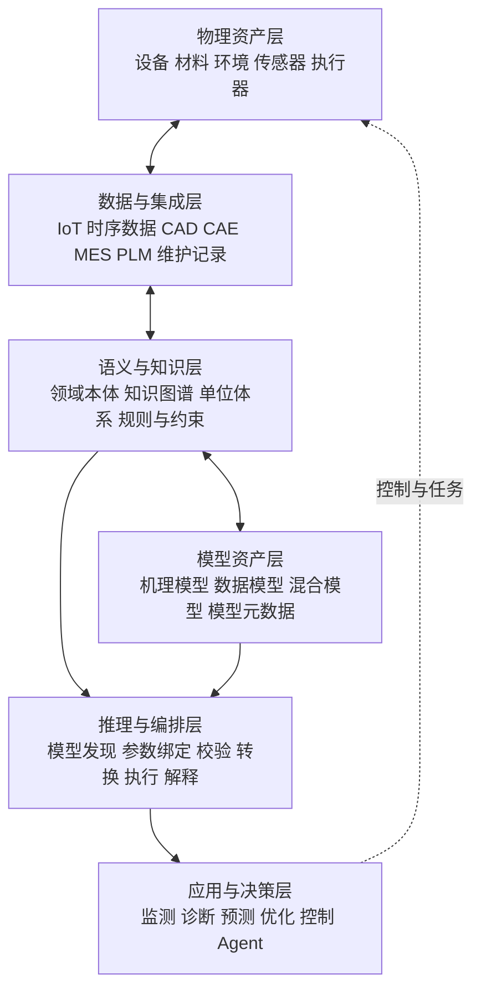

一台离心泵正在运行。资产系统知道它的编号、型号、安装位置和所属产线，传感器持续上报流量、压力、温度和振动，知识图谱也已经建立了“水泵—电机—管路—阀门—传感器”之间的关系。

现在用户提出一个问题：

> “为什么出口压力正在下降？如果把转速提高 8%，能否恢复流量，又会不会增加气蚀风险？”

只靠对象关系，系统很难回答。它知道“出口压力传感器安装在水泵出口”，却不知道压力为什么下降，也不知道转速变化以后流量、扬程、功率和汽蚀余量会怎样变化。

于是团队又接入了水力模型。模型能够根据转速、阀门开度、入口压力和管路阻力计算流量与扬程，但新的问题马上出现：

- 模型里的 `p_in` 对应哪一个现场测点？
- `flow` 表示质量流量还是体积流量？
- 压力使用 Pa、kPa，还是表压？
- 这个模型适用于所有离心泵，还是只适用于某个型号？
- 当前工况是否落在模型校准范围内？
- 同时存在机理模型、经验曲线和机器学习模型时，应该选哪一个？
- 计算结果怎样重新关联到设备、故障和维护任务？

物理模型能计算，却未必知道自己在业务世界里代表什么；本体能描述世界，却未必能够计算世界接下来会怎样变化。

这正是二者需要结合的原因。

> **本体回答“世界中有什么、它们彼此是什么关系”，物理模型回答“这些对象遵循什么规律、在给定条件下会怎样变化”。**

如果再向前一步，可以把本体看成系统的**语义坐标系**，把物理模型看成系统的**行为计算器**：前者让不同数据、软件和人员对同一对象形成一致理解，后者把输入、状态和约束转换成可以预测、比较和优化的结果。

本文将沿着下面这条主线展开：

```text
现实物理系统
  ↓ 抽象
领域本体：世界中有什么
  +
物理模型：世界怎样运行
  ↓ 映射
实体、变量、单位、时间、条件与证据
  ↓ 执行
模型发现、参数绑定、仿真计算、结果解释
  ↓ 闭环
监测、诊断、预测、优化与控制
```

> 资料口径：本文基于截至 **2026 年 10 月 10 日**可访问的 W3C、NIST、NASA、ISO、Modelica Association 等公开资料整理。文中的“物理模型”主要指基于物理规律的数学或计算模型，也会区分实体缩比模型、数据驱动模型与混合模型。

---

## 一、为什么描述同一个世界，需要两种模型

本体和物理模型都在“建模”，但它们舍弃现实细节的方式不同。

假设我们面对一台真实水泵。现实中的它具有几何结构、材料、质量、温度、压力、振动、电磁状态、历史磨损、所属组织、维修记录、采购合同等几乎无限的信息。任何数字系统都不可能完整复制这些细节，只能围绕目标问题做选择。

如果目标是资产管理，我们更关心：

- 它是什么类型的设备；
- 安装在哪里；
- 由哪些部件组成；
- 连接了哪些管路；
- 哪些传感器在测量它；
- 谁负责维护；
- 发生过哪些故障。

如果目标是预测运行行为，我们更关心：

- 流量、压力、转速和功率之间有什么关系；
- 初始状态与边界条件是什么；
- 哪些参数随时间变化；
- 方程怎样求解；
- 模型在哪些工况下有效；
- 预测误差有多大。

前一组问题形成语义和关系模型，后一组问题形成机理和行为模型。它们不是两套互相竞争的“现实真相”，而是面向不同任务的两种抽象。

### 1. 本体对现实做语义抽象

本体主动忽略大量连续物理细节，把注意力放在相对稳定的概念、身份和关系上。例如：

```text
Pump_001 是一台 CentrifugalPump
Pump_001 安装于 Line_03
Pump_001 由 Motor_001 驱动
PressureSensor_17 测量 Pump_001 的 OutletPressure
Pump_001 的额定流量为 120 m³/h
```

这些描述的价值，不是直接算出下一秒的出口压力，而是建立共同语言：不同系统中的数据能够围绕同一个对象组织，不同团队能够明确一个字段究竟表示什么，软件能够沿着关系发现上下文。

### 2. 物理模型对现实做行为抽象

物理模型通常忽略组织、权限和业务名称，把注意力放在决定系统行为的变量与规律上。例如：

```text
输入：入口压力、转速、阀门开度、流体密度
状态：流量、温度、转子速度
参数：叶轮直径、效率曲线、管路阻力系数
输出：出口压力、扬程、功率、汽蚀风险
```

它通过代数方程、微分方程、有限元离散、事件逻辑或数值算法，将输入变成输出，将当前状态推进到未来状态。

### 3. 两种模型分别填补对方的盲区

只有本体，系统可能“理解但不会算”；只有物理模型，系统可能“会算但不知道算的是谁”。

| 单独使用 | 擅长解决 | 仍然缺少 |
|---|---|---|
| 本体 | 统一概念、对象关联、语义查询、规则推理 | 连续动力学、数值预测、场分布、性能计算 |
| 物理模型 | 方程求解、动态仿真、预测、参数优化 | 业务身份、跨系统语义、模型发现、结果归属 |
| 二者结合 | 从对象发现模型，从数据绑定变量，从结果回到业务决策 | 仍需数据治理、验证证据和执行安全机制 |

由此可以得到全文的第一个核心判断：

> **本体与物理模型的关系，不是“谁更接近现实”，而是“谁负责描述现实的哪一部分”。**

---

## 二、本体到底是什么：不是一张图，也不是数据库换名

“本体”一词来自哲学，讨论什么存在、对象和属性具有怎样的存在方式。进入信息科学以后，它变成一种形式化领域知识的方法：明确一个领域中有哪些类型的事物、它们具有什么属性、彼此存在什么关系，以及这些描述必须满足什么约束。

W3C 的 OWL 2 规范把本体组织为类、属性、个体和数据值，并为这些表达提供形式化语义。因为含义是明确的，程序不仅可以保存三元组，还可以检查知识是否矛盾，或者把隐含关系推导出来。[W3C OWL 2 Overview](https://www.w3.org/TR/owl-overview/)

### 1. 类、个体、属性和公理

以水泵领域为例：

- `Pump`、`Sensor`、`Pipe` 是类；
- `Pump_001`、`Sensor_17` 是个体；
- `drivenBy`、`connectedTo` 是对象属性；
- `ratedFlow`、`measurementValue` 是数据属性；
- “每个压力测点必须对应某种压力物理量”是一类约束；
- “离心泵属于旋转设备”是一类分类公理。

一个简化的 RDF/Turtle 示例可以写成：

```turtle
@prefix ex: <https://example.com/plant/> .
@prefix xsd: <http://www.w3.org/2001/XMLSchema#> .

ex:Pump_001 a ex:CentrifugalPump ;
    ex:installedIn ex:Line_03 ;
    ex:drivenBy ex:Motor_001 ;
    ex:hasMeasurementPoint ex:OutletPressurePoint_001 .

ex:OutletPressurePoint_001 a ex:PressureMeasurementPoint ;
    ex:observedProperty ex:OutletPressure ;
    ex:unit ex:Kilopascal ;
    ex:dataSource "opcua://plant/line03/pump001/p_out" .
```

这段描述还没有保存具体仿真方程，但已经把对象、测点、物理量、单位和数据来源放入同一个语义上下文。

### 2. 本体不等于分类树

分类树主要表达“属于哪一类”。本体还能表达：

- 组成关系；
- 连接关系；
- 空间关系；
- 测量关系；
- 因果或影响关系；
- 互斥和等价；
- 属性的定义域与值域；
- 对象必须满足的逻辑条件。

如果只把设备分成泵、阀门、电机和传感器，却不能描述谁连接谁、谁测量谁、谁驱动谁，那么它仍然只是词表或分类法。

### 3. 本体不等于数据库 Schema

数据库 Schema 首先回答数据如何保存：表、列、主键、外键和索引怎样设计。本体首先回答信息代表什么：同一个业务对象如何跨数据源保持身份，某个值表示哪一种物理量，不同关系具有怎样的领域含义。

两者可以相互映射，但不能简单画等号。数据库中三个不同系统可能各有一张设备表，本体层却需要把其中对应同一实体的记录统一为 `Pump_001`。反过来，一个本体对象也可能同时读取时序数据库、主数据平台和文档系统中的信息。

### 4. 本体不等于知识图谱

本体更像知识图谱的语义规则和概念骨架，知识图谱则通常包含大量具体实例和事实。

可以粗略写成：

```text
本体：什么样的事实是有意义的
知识图谱：当前有哪些具体事实
```

例如，本体定义“传感器测量物理量”，知识图谱记录“Sensor_17 测量 Pump_001 的出口压力”。本体定义“离心泵由电机驱动”，实例图记录具体是哪台电机。

### 5. OWL 推理与 SHACL 验证不是同一件事

工程系统中还需要区分语义推理和数据验证。

OWL 更适合表达概念逻辑，例如：如果某设备是旋转设备，并且具有振动测点，那么可以把它识别为可执行振动状态监测的资产。SHACL 则用于描述和验证 RDF 图应该满足的数据形状，例如：每个物理模型必须至少有一个输入、一个输出、一个版本号和一个适用对象类型。[W3C SHACL](https://www.w3.org/TR/shacl/)

这一区分非常重要。因为“没有记录某个输入”在开放世界语义下未必意味着输入不存在，但对一次仿真执行来说，缺少必要输入通常必须立即报错。

> **本体负责定义意义，约束语言负责检查数据是否足以进入工程流程。**

---

## 三、物理模型到底是什么：不是三维外观，而是可执行的规律

“物理模型”在中文语境中至少有三种含义。

第一种是现实中的缩比或实验模型，例如风洞模型、建筑沙盘、实验台架；第二种是描述对象几何和结构的数字模型，例如 CAD 模型；第三种是通过物理规律和数学关系描述系统行为的计算模型。

本文重点讨论第三种。

NASA 的术语体系把模型概括为对现实的物理、数学或逻辑表示。对工程计算来说，一个完整模型通常不只有方程，还包含观测数据、建模假设、初始条件、边界条件和数值实现。[NASA Verification and Validation Glossary](https://www.grc.nasa.gov/www/wind/valid/tutorial/glossary.html)

### 1. 一个物理模型至少包含什么

以动态热模型为例：

```text
系统边界：哪些设备和环境被纳入模型
状态变量：温度、压力、速度等随时间演化的量
输入变量：环境温度、控制指令、热源功率
参数：质量、比热、换热系数、几何尺寸
控制方程：能量守恒、传热关系
初始条件：计算开始时的温度分布
边界条件：外部空气温度、对流边界
数值方法：时间步长、离散方式、求解器
输出：未来温度、热点位置、超温时间
适用范围：材料、负载和环境条件的有效区间
```

缺少任何关键部分，都可能让“有一个方程”无法变成可执行、可验证的工程模型。

### 2. 机理模型、数据模型与混合模型

按照知识来源，可以把模型分成三类。

#### 机理模型

依据守恒定律、本构关系和领域机理建立，例如：

- 牛顿运动定律；
- 质量、动量和能量守恒；
- 热传导方程；
- 电路方程；
- 材料应力应变关系；
- 泵与风机相似定律。

它的优势是结构可解释，能够在合理边界内分析未直接观测的状态；局限是建模和求解成本高，参数可能难以获得。

#### 数据驱动模型

直接从历史样本学习输入与输出关系，例如回归、树模型、神经网络和时序预测模型。它不一定显式写出物理规律，优势是能够拟合复杂关系，局限是容易受训练数据分布限制。

#### 混合模型

把两类知识结合起来，例如：

- 用机理模型给出主趋势，再用机器学习预测残差；
- 用传感器数据在线估计物理参数；
- 把守恒关系写入训练损失或输出约束；
- 用数据模型作为高成本仿真的代理模型。

### 3. 物理模型不是越复杂越好

模型是面向问题的受控抽象。预测水泵能耗，未必需要叶轮内部的高精度三维流场；分析叶片气蚀，却可能不能只使用一条经验曲线。

模型选择的关键不是“谁最逼真”，而是：

```text
目标问题需要的可信度
        与
建模、数据和计算成本
        之间的平衡
```

同一台设备可以同时拥有多个模型：

- 资产级规则模型，用于快速告警；
- 经验特性曲线，用于秒级性能估计；
- 一维水力模型，用于系统联算；
- 三维 CFD 模型，用于详细设计；
- 数据驱动代理模型，用于在线优化。

因此，真正困难的并不是“给设备建一个模型”，而是管理多个模型的用途、接口、精度、成本和适用边界。

---

## 四、本体与物理模型：同一个对象的两套坐标系

理解二者关系，最有效的方法不是继续背定义，而是把它们放在同一组问题下比较。

| 维度 | 本体 | 物理模型 |
|---|---|---|
| 核心问题 | 有什么、是什么、与谁相关 | 为什么变化、怎样变化、变化多少 |
| 基本元素 | 类、个体、属性、关系、公理 | 变量、参数、方程、状态、边界条件 |
| 表达形式 | 图、逻辑、约束、语义规则 | 数学方程、算法、程序、数值网格 |
| 典型输出 | 分类、关联、推理结果、上下文 | 数值、曲线、场分布、未来状态 |
| 时间处理 | 常描述稳定结构，也可扩展状态和事件 | 常显式处理连续时间或离散事件 |
| 主要评价 | 一致性、完整性、可理解性、可复用性 | 精度、稳定性、计算效率、有效范围 |
| 常见失败 | 概念歧义、关系缺失、语义过度设计 | 参数错误、边界错误、数值不收敛、超范围使用 |
| 主要使用者 | 领域专家、知识工程师、数据架构师 | 物理专家、仿真工程师、控制工程师 |

### 1. 类不等于方程中的变量

本体中的 `Pump` 是一类对象，方程中的 `Q` 是某个模型里的流量变量。前者定义对象的类型，后者描述对象在某个计算上下文中的状态或输出。

不能因为二者都叫“模型元素”，就直接建立一一对应关系。

### 2. 属性不一定等于模型参数

设备的“制造商”是本体属性，但通常不是水力模型参数；叶轮直径既是设备属性，也可能是模型参数；出口压力既可能是实时观测值，也可能是仿真输出。

因此，同一个语义属性在不同上下文中可能扮演不同角色：

```text
叶轮直径
├─ 资产主数据中的设计属性
├─ 水力模型中的固定参数
├─ 参数辨识任务中的待估变量
└─ 改型优化任务中的决策变量
```

如果不区分角色，模型接口就会被业务字段名称绑死。

### 3. 关系不一定等于计算连接

本体中的 `installedIn` 表示设备安装位置，但不会直接形成方程耦合；`connectedTo` 可能意味着流体端口相连，也可能只是电气、机械或通信连接。

要驱动模型组合，关系必须进一步明确：

- 连接的端口类型；
- 传递的物理量；
- 因果方向；
- 单向还是双向；
- 是否存在延迟；
- 接口变量是否需要转换。

### 4. 规则推理不等于数值求解

本体规则可以推导：

```text
如果设备是离心泵，且安装了入口压力、出口压力和流量测点，
那么它具备运行点估计所需的基础观测条件。
```

但“出口压力是多少”仍要交给测量系统或物理模型计算。

反过来，物理模型可以算出未来十分钟温度会达到 92℃，却不一定知道 90℃以上在当前型号、当前工艺和当前订单约束下是否属于必须停机的严重告警。这个判断需要领域语义、规则和业务上下文。

> **符号推理负责决定“该算什么、能不能算、结果意味着什么”，数值计算负责决定“具体是多少、怎样演化”。**

---

## 五、真正的连接点：不仅要有领域本体，还要有模型本体

许多项目已经为设备、工艺和传感器建立本体，却仍然无法自动调用仿真模型。原因是它们只描述了现实对象，没有描述“模型这种数字资产”。

要让系统发现、比较、执行和治理物理模型，至少需要三层语义。

### 1. 领域本体：描述现实世界中的对象

领域本体回答：

- 有哪些设备、材料、空间和过程；
- 设备由什么组成；
- 对象之间怎样连接；
- 有哪些物理量和测点；
- 哪些事件和故障会发生。

例如：

```text
CentrifugalPump
Motor
Pipe
Valve
Fluid
PressureMeasurementPoint
Cavitation
MaintenanceTask
```

### 2. 模型本体：描述可以执行的模型资产

模型本体回答：

- 模型模拟什么对象或过程；
- 模型解决什么问题；
- 输入、输出、参数和状态是什么；
- 变量使用什么单位和坐标系；
- 依赖哪个求解器和运行环境；
- 适用于哪些工况；
- 需要多长计算时间；
- 精度、误差和验证证据是什么；
- 谁创建、谁审核、当前版本是什么。

一个模型不应只以“某个 Python 文件”或“某个 FMU 文件”的形式存在，而应该拥有一张可查询的模型卡片：

```yaml
modelId: pump-performance-v3
modelType: ReducedOrderPhysicsModel
simulates: CentrifugalPump
purpose:
  - OperatingPointEstimation
  - EnergyConsumptionPrediction
inputs:
  - quantity: InletPressure
    unit: kPa
  - quantity: RotationalSpeed
    unit: rpm
  - quantity: ValveOpening
    unit: percent
outputs:
  - quantity: VolumeFlowRate
    unit: m3_per_hour
  - quantity: OutletPressure
    unit: kPa
validFor:
  pumpSeries: CP-200
  speedRange: [900, 1800]
  temperatureRangeC: [5, 80]
solver:
  runtime: Python
  entrypoint: models.pump_v3:simulate
verification:
  dataset: testbench-2026-04
  meanAbsolutePercentageError: 2.8
version: 3.1.0
```

### 3. 运行时实例层：描述这一次计算

领域本体和模型本体都相对稳定，但一次具体仿真还需要运行时实例：

- 本次模拟哪台设备；
- 使用哪个模型版本；
- 输入来自哪些测点和时间窗口；
- 哪些参数使用设计值，哪些经过在线估计；
- 求解何时开始、是否收敛；
- 输出和置信度是多少；
- 结果支持了哪个诊断或决策。

例如：

```text
SimulationRun_20261010_103015
├─ simulatesAsset: Pump_001
├─ usesModel: pump-performance-v3@3.1.0
├─ usesObservation: Sensor_17@10:30:00
├─ parameterSet: Pump_001_CalibratedParameters@v12
├─ status: Succeeded
├─ output: OutletPressure = 428.4 kPa
├─ uncertainty: ± 6.2 kPa
└─ supportsDecision: Recommendation_8901
```

这三层合在一起，才形成可运行的语义系统：

```text
领域本体：现实中是谁
模型本体：可以用什么方法计算
运行实例：这一次具体怎样计算
```

---

## 六、从“有关联”到“可执行”：七类关键映射

在演示系统里，为设备和模型连一条 `simulatedBy` 关系似乎就完成了集成。但在真实工程中，这只表示“它们有关”，还不足以执行。

真正可运行的映射至少包含七个方面。

### 1. 实体映射：模型究竟对应谁

首先要打通三种身份：

```text
现实设备身份
↕
企业数据身份
↕
仿真模型实例身份
```

一台泵可能同时具有资产编码、MES 设备编码、OPC UA NodeId、时序数据库标签前缀、CAD 零部件编号和仿真实例名称。系统需要一个稳定的领域身份，并维护到各系统标识的映射。

否则模型计算完成后，只能得到 `pump_3.output.pressure`，却无法确定它应该写回哪一个设备对象。

### 2. 结构与拓扑映射：对象怎样组成计算网络

本体中的组成和连接关系，需要转换成模型组件和端口连接。例如：

```text
领域关系：Pump_001 connectedTo Pipe_12
模型连接：pump001.outlet → pipe12.inlet
端口介质：Water
交换变量：pressure, massFlowRate, temperature
```

这里不仅要知道两个对象相连，还要知道：

- 哪个端口连接哪个端口；
- 介质是否兼容；
- 变量方向是否一致；
- 压力是绝压还是表压；
- 流量正方向如何定义；
- 是否需要一个适配器模型。

### 3. 物理量映射：名称背后的意义是什么

`temperature`、`temp`、`T`、`T_in` 看起来不同，却可能指向同一种物理量；两个都叫 `pressure` 的变量，也可能分别表示绝对压力、表压、静压或总压。

因此，变量映射不能只靠字符串相似度，而应至少绑定：

- 物理量类型；
- 测量对象；
- 空间位置；
- 时间语义；
- 统计口径；
- 坐标系；
- 单位。

例如：

```text
模型变量 p_in
├─ quantityKind: Pressure
├─ pressureType: AbsolutePressure
├─ location: PumpInlet
├─ timeSemantics: InstantaneousValue
├─ expectedUnit: Pa
└─ boundObservation: InletPressurePoint_001
```

### 4. 单位与量纲映射：数值相同不代表含义相同

工程事故往往不是因为没有数据，而是因为数据看起来可以用。

需要显式处理：

- Pa、kPa、MPa；
- ℃ 与 K；
- kg/s 与 m³/h；
- rpm 与 rad/s；
- 毫米与米；
- 表压与绝压；
- 标况体积流量与工况体积流量。

单位可以转换，量纲错误则通常不能继续执行。以摄氏温度转换开尔文为例，它不只是乘比例，还包含偏移量；把表压转换为绝压则还需要当前环境压力。

因此，参数绑定流程应该是：

```text
找到候选数据
→ 检查物理量类型
→ 检查量纲
→ 检查单位与参考系
→ 执行转换
→ 记录转换证据
```

### 5. 时间映射：实时值、平均值和初始状态不能混用

本体中的属性常被写成“当前温度”，而物理模型需要更精确的时间语义：

- 采样发生在什么时间；
- 是瞬时值还是五分钟平均值；
- 数据延迟多大；
- 多个输入是否时间对齐；
- 仿真从哪个时刻开始；
- 历史窗口是否足以初始化状态；
- 输出是当前估计、未来预测还是稳态结果。

例如，使用十分钟前的入口压力和当前转速进行动态仿真，数值格式虽然都正确，物理意义却可能完全错误。

### 6. 条件与假设映射：模型不是在任何场景下都有效

每个模型都包含隐含或显式假设，例如：

- 流体不可压缩；
- 温度变化可以忽略；
- 管路处于满流状态；
- 设备没有严重磨损；
- 转速处于 900～1800 rpm；
- 控制周期不低于 100 ms；
- 模型只对 CP-200 系列完成过验证。

这些条件必须变成机器可检查的前置条件。否则模型能够成功运行，并不代表结果有意义。

### 7. 证据与来源映射：为什么相信这次结果

一次结果至少要能追溯：

- 使用了哪个模型版本；
- 输入来自哪些数据源；
- 参数由谁提供；
- 做过哪些单位转换和数据清洗；
- 模型经过什么验证；
- 当前工况距离验证范围有多远；
- 求解器是否收敛；
- 输出不确定度是多少。

没有这些信息，仿真输出只是一串看起来精确的数字，无法成为高风险决策的可靠证据。

---

## 七、一套可运行的融合架构

把本体与物理模型放入同一个系统，可以形成六层架构。



### 1. 物理资产层：现实中的对象

这一层包括设备、产品、材料、人员、空间、环境、传感器、执行器和控制器。它们拥有真实状态，也受到物理和业务约束。

关键不是把所有现实都数字化，而是为每个需要参与计算和决策的对象建立稳定身份。

### 2. 数据与集成层：现实状态怎样进入数字系统

典型来源包括：

- PLC、SCADA、DCS 和 OPC UA；
- IoT 平台和时序数据库；
- CAD、CAE、PLM 和 BIM；
- MES、ERP、EAM 和 QMS；
- 实验台、检测报告和维护记录；
- 外部环境和气象数据。

这一层解决连接、采集、清洗和存储问题，但数据进入系统并不意味着语义已经统一。

### 3. 语义与知识层：数据究竟代表什么

这一层保存：

- 领域对象和关系；
- 物理量、单位和量纲；
- 测点与被观测对象的关系；
- 模型类型和模型能力；
- 工况、故障和任务定义；
- 参数映射和数据来源；
- 前置条件、规则和权限。

它把 `tag_9831 = 428.4` 翻译为“2026 年 10 月 10 日 10:30:15，Pump_001 出口位置的绝对压力观测值为 428.4 kPa”。

### 4. 模型资产层：可以用什么方式推演

这里不仅保存模型文件，还保存可执行环境和治理信息：

- 方程模型；
- 有限元或计算流体模型；
- Modelica 模型；
- FMI/FMU 组件；
- Python、MATLAB 或其他运行包；
- 数据驱动模型；
- 参数集、测试数据和验证报告；
- 模型版本与依赖。

Modelica 适合以方程式、面向对象方式表达多领域物理系统，FMI 则为模型交换和联合仿真提供标准化接口，使模型可以以 FMU 的形式在不同工具之间集成。[Modelica Language Specification](https://specification.modelica.org/) [FMI Standard](https://fmi-standard.org/)

### 5. 推理与编排层：把问题变成一次可信计算

这一层是融合系统的核心，负责：

1. 理解任务需要什么输出；
2. 根据对象类型和目的发现候选模型；
3. 检查模型适用条件；
4. 寻找并绑定输入数据；
5. 进行单位、坐标和时间转换；
6. 选择参数集和初始状态；
7. 调用求解器或模型服务；
8. 检查收敛和结果质量；
9. 把结果映射回领域对象；
10. 记录执行证据和版本链。

### 6. 应用与决策层：计算最终改变什么

输出可以用于：

- 状态估计；
- 故障诊断；
- 剩余寿命预测；
- 预测性维护；
- 工艺参数优化；
- 能耗优化；
- 虚拟调试；
- 控制建议；
- Agent 决策。

NIST 对数字孪生的描述强调，数字孪生是与物理系统相关联的计算模型，可用于监测、预测、优化和辅助决策。由此看，本体并不是数字孪生之外的附加标签，而是组织物理对象、模型、数据和应用关系的重要语义基础。[NIST Digital Twins](https://www.nist.gov/digital-twins)

---

## 八、一次模型执行，系统内部究竟发生什么

用户说“预测 Pump_001 在提高转速后的出口压力”，看起来是一句话，系统内部却需要完成一条严格流水线。


### 1. 把自然语言目标转换成结构化任务

任务可能被规范化为：

```json
{
  "targetAsset": "Pump_001",
  "taskType": "WhatIfSimulation",
  "intervention": {
    "quantity": "RotationalSpeed",
    "operation": "increaseByPercent",
    "value": 8
  },
  "requestedOutputs": [
    "OutletPressure",
    "VolumeFlowRate",
    "CavitationRisk"
  ],
  "horizon": "10min"
}
```

这一步可以由固定页面、业务 API 或 Agent 完成，但进入领域执行层后，任务必须变成可检查的结构，而不能一直停留在自然语言里。

### 2. 根据能力而不是文件名寻找模型

模型发现不应依赖工程师记住“pump_final_v3_really_final.py”。系统应查询：

- 哪些模型能够模拟离心泵；
- 哪些模型支持转速干预；
- 哪些模型能输出出口压力和气蚀风险；
- 哪些模型适用于 CP-200；
- 哪些模型能够在十秒内完成；
- 哪些模型的精度满足当前任务。

于是，模型选择变成一个多约束问题：

```text
候选模型
∩ 对象类型匹配
∩ 输入数据可获得
∩ 工况范围满足
∩ 输出能力满足
∩ 精度达到阈值
∩ 计算成本满足时限
= 可执行模型集合
```

### 3. 数据绑定不是简单字段复制

系统沿本体关系找到 `Pump_001` 的入口压力测点、出口压力测点、流量计和转速测点，再读取指定时间的数据。

绑定时需要检查：

- 数据质量状态是否正常；
- 测点是否经过校准；
- 时间戳是否对齐；
- 是否存在缺失值；
- 单位能否转换；
- 数值是否超出传感器量程；
- 数据是否满足模型的输入频率。

如果关键输入缺失，系统可以继续推理：是否存在替代测点，能否由其他模型估计，或者是否应降级使用更简单的模型。

### 4. 执行前先做语义和工程校验

可以用 SHACL 或应用层约束检查模型元数据完整性，也可以通过领域规则检查运行条件。例如：

```text
规则一：模型要求绝对压力，输入却是表压
→ 查找环境压力并转换；无法获得则拒绝执行

规则二：模型验证转速上限为 1800 rpm，干预后达到 1879 rpm
→ 标记为超出验证范围，不允许用于自动控制

规则三：流量测点质量状态为 Bad
→ 不把该测点作为模型校准依据
```

### 5. 执行以后还要解释结果

模型输出可能是：

```json
{
  "outletPressureKPa": 451.7,
  "volumeFlowRateM3h": 126.3,
  "npshMarginM": 0.4,
  "converged": true
}
```

业务用户真正需要的却是：

```text
将转速提高 8% 后，预计流量从 118.1 m³/h 提升到 126.3 m³/h，
出口压力提升约 23.3 kPa；但可用汽蚀余量仅剩 0.4 m，
低于当前设备策略要求的 0.8 m，因此不建议直接执行。
```

从数值到解释，需要把结果重新关联到：

- 设备安全阈值；
- 当前运行策略；
- 故障风险；
- 业务目标；
- 可执行动作。

这一步正是本体、规则和物理模型再次汇合的地方。

---

## 九、贯穿案例：离心泵压力下降怎样被诊断

下面用一个完整案例说明融合过程。

### 1. 现场现象

`Pump_001` 在转速和阀门指令基本不变的情况下，出口压力在二十分钟内持续下降，流量也低于计划值。

传统阈值告警只能告诉用户“压力偏低”，不能区分原因：

- 入口压力下降；
- 阀门实际开度异常；
- 管路泄漏；
- 过滤器堵塞；
- 叶轮磨损；
- 气蚀；
- 传感器漂移。

### 2. 本体提供系统上下文

知识图谱中保存：

```text
Pump_001
├─ type: CentrifugalPump
├─ series: CP-200
├─ drivenBy: Motor_001
├─ inletConnectedTo: Pipe_In_12
├─ outletConnectedTo: Pipe_Out_07
├─ controlledBy: VFD_03
├─ hasMeasurementPoint: P_In_001
├─ hasMeasurementPoint: P_Out_001
├─ hasMeasurementPoint: Flow_001
├─ hasMeasurementPoint: Vibration_001
└─ governedByPolicy: PumpSafetyPolicy_CP200
```

本体还告诉系统：

- `P_In_001` 测量入口绝对压力；
- `P_Out_001` 测量出口表压；
- `Flow_001` 上报体积流量；
- 当前介质为 32℃ 清水；
- 上游过滤器是 `Filter_009`；
- 下游调节阀是 `Valve_014`。

这些信息使系统能够自动确定需要读取哪些数据，并意识到两路压力的参考系不同。

### 3. 物理模型提供正常行为基线

一个简化泵模型可以使用相似定律和特性曲线：

```text
Q₂ / Q₁ ≈ n₂ / n₁
H₂ / H₁ ≈ (n₂ / n₁)²
P₂ / P₁ ≈ (n₂ / n₁)³
```

其中：

- `Q` 是流量；
- `H` 是扬程；
- `P` 是轴功率；
- `n` 是转速。

实际模型还会结合泵特性曲线、系统阻力曲线、效率、入口条件和阀门状态，计算当前转速下应出现的压力和流量。

### 4. 用观测与预测残差缩小原因范围

系统先运行正常状态模型，得到：

```text
预测出口压力：447 kPa
实测出口压力：421 kPa
预测流量：121 m³/h
实测流量：109 m³/h
```

同时发现：

- 电机转速与指令一致；
- 阀门反馈开度没有明显变化；
- 入口压力小幅下降但不足以解释全部偏差；
- 振动频谱中出现与气蚀相关的异常特征；
- 上游过滤器压差正在升高。

本体负责把“过滤器压差”“入口条件”“振动特征”和“气蚀风险”放入同一因果上下文；物理模型负责量化每种变化能够解释多少压力下降。

### 5. 生成候选解释

系统得到三个候选：

| 候选原因 | 与观测的符合程度 | 模型解释能力 | 下一步验证 |
|---|---:|---:|---|
| 上游过滤器堵塞 | 高 | 可解释入口压力和流量下降 | 检查过滤器压差与旁路状态 |
| 叶轮磨损 | 中 | 可解释长期性能衰减 | 对比历史性能曲线 |
| 出口压力传感器漂移 | 低 | 无法解释流量和振动变化 | 与备用压力表比对 |

这时系统不必声称已经百分之百确定原因，而是给出可追溯的诊断证据链。

### 6. 评估“提高转速”的方案

用户希望临时提高转速恢复流量。系统执行反事实仿真后发现：

- 流量可以短暂恢复；
- 电机功率和能耗上升；
- 入口压力进一步降低；
- 气蚀风险明显升高；
- 如果根因是过滤器堵塞，提高转速只会加剧问题。

于是建议不是“提高转速 8%”，而是：

1. 将转速增幅限制在 2% 以内；
2. 检查并切换过滤器旁路；
3. 安排过滤器清理；
4. 清理后重新运行模型确认性能恢复；
5. 若残差仍然存在，再进入叶轮磨损诊断。

这个案例体现了二者的真实分工：

> **本体把设备、测点、故障、规则和动作组织成上下文；物理模型把候选原因和干预方案转化为可比较的定量结果。**

---

## 十、本体能为物理模型带来什么

本体的价值不能停留在“术语统一”四个字上。进入模型工程以后，它至少能带来七类具体能力。

### 1. 模型发现

不再依赖目录和文件名，而是根据对象类型、任务、输入、输出、精度和成本检索模型。

### 2. 参数自动绑定

根据测点、物理量、单位、位置和时间语义，为模型变量寻找合适数据源。

### 3. 多模型组合

根据设备结构和端口关系，把泵、管路、阀门、换热器、控制器等子模型组合为系统模型。

### 4. 执行前一致性检查

在调用求解器之前检查单位、量纲、输入完整性、拓扑兼容性和适用范围，减少“模型成功运行但结果错误”的情况。

### 5. 结果解释

把数值输出翻译成设备状态、故障风险、业务影响和操作建议。

### 6. 证据追溯

记录模型、数据、参数、转换、求解器和结果之间的完整来源链。

### 7. 模型复用

把一次项目中的模型从“工程师私有文件”升级为可发现、可理解、可治理的组织资产。

但也必须看到边界：本体不能替代物理建模、实验校准、数值分析和工程验证。给一个错误模型补充再完整的元数据，它仍然是错误模型。

---

## 十一、物理模型能为本体带来什么

融合不是单向的。物理模型也会让本体从静态描述走向动态世界。

### 1. 补充不可直接观测的状态

很多状态无法用传感器直接测量，例如内部应力、剩余寿命、不可见区域温度和设备效率。物理模型可以根据可观测数据估计这些隐状态，并把它们作为带来源和置信度的派生事实写回知识图谱。

### 2. 让关系具有定量含义

本体可以说“过滤器影响水泵”，物理模型进一步回答影响多少、何时发生、在什么条件下最严重。

### 3. 支持反事实推演

知识图谱通常记录已经发生或当前存在的事实，物理模型能够回答：

- 如果阀门开度降低 10% 会怎样；
- 如果环境温度上升 5℃ 会怎样；
- 如果某台设备停机，产线是否还能达产；
- 如果提前维护，故障风险能下降多少。

### 4. 把本体动作从“调用接口”升级为“先验证再执行”

本体中的动作不必直接修改现场系统。它可以先调用物理模型评估安全性和收益，再根据规则决定：

- 自动执行；
- 请求人工审批；
- 只生成建议；
- 因风险过高而拒绝。

### 5. 让因果链条更可信

对象之间的边不应都被理解成因果关系。物理模型和实验数据可以为某些影响关系提供机理和定量证据，帮助系统区分“相关”“结构连接”“业务依赖”和“物理因果”。

---

## 十二、最容易踩中的八个坑

### 1. 把知识图谱中有节点和边，当成已经完成本体建设

如果概念没有清晰定义，关系没有方向、约束和适用范围，图越大只会让歧义越多。

### 2. 把物理方程全部塞进 OWL

OWL 适合表达逻辑语义，不适合作为大规模偏微分方程求解器。正确做法是用本体描述方程模型的含义、接口和约束，再调用专业求解环境执行。

### 3. 只描述现实设备，不描述模型资产

如果模型没有类型、输入、输出、适用范围、版本和验证证据，系统就无法自动发现和安全调用它。

### 4. 只靠变量名做自动映射

`P` 可能是压力、功率或概率；`T` 可能是温度、周期或转矩。可靠映射必须基于物理量、位置、单位、时间和上下文。

### 5. 把最新测点值直接当成模型初始状态

复杂模型的内部状态可能无法由单个观测直接确定，需要历史窗口、状态估计器或稳态初始化过程。

### 6. 忽略开放世界与工程执行的差异

知识图谱没有记录某个属性，不代表该属性不存在；但仿真接口缺少必填参数时，必须采用封闭式校验并明确失败。

### 7. 忽略模型版本和参数版本

同一个模型文件配上不同参数集，可能产生完全不同的结果。每次执行必须同时固定：

```text
模型版本 + 参数版本 + 数据版本 + 映射版本 + 求解环境版本
```

### 8. 把仿真结果直接接入自动控制

模型能够预测，不意味着它已经满足闭环控制要求。自动执行前还需要：

- 实时性验证；
- 安全边界；
- 权限和审批；
- 失效降级；
- 人工接管；
- 执行后反馈确认。

---

## 十三、工程落地：不要一开始就建设“万物本体”

本体与物理模型融合很容易变成范围失控的平台项目。更现实的方法，是围绕一个高价值闭环分阶段推进。

### 第一阶段：让模型可被理解

选择一个设备类型和一个明确任务，例如水泵运行点估计。

先完成：

- 设备、测点、物理量和单位的最小领域本体；
- 模型输入、输出、版本和适用范围描述；
- 一套人工确认的变量映射；
- 一次可复现的模型执行记录。

目标不是自动化，而是让模型从“黑盒文件”变成“可理解资产”。

### 第二阶段：让模型可被可靠执行

增加：

- 输入数据自动发现；
- 单位和参考系转换；
- 数据质量检查；
- 前置条件验证；
- 运行日志和证据链；
- 结果写回知识图谱。

目标是把人工脚本变成标准执行流水线。

### 第三阶段：让多个模型可被选择和比较

同一任务接入不同精度和成本的模型，例如规则模型、降阶模型和高精度模型。

建立选择策略：

| 场景 | 推荐模型 |
|---|---|
| 高频在线监测 | 快速降阶或代理模型 |
| 异常复核 | 中等精度机理模型 |
| 设计与根因分析 | 高精度数值模型 |
| 数据不足 | 机理模型或保守规则 |
| 机理不完整但样本丰富 | 混合模型 |

目标是让模型选择从个人经验转为可解释规则。

### 第四阶段：形成决策闭环

最后再接入：

- 诊断流程；
- 方案生成；
- 反事实仿真；
- 多目标优化；
- 审批与动作；
- 执行后状态验证；
- Agent 自然语言入口。

目标不是让 Agent 自由调用所有模型，而是让 Agent 在领域约束、权限和验证机制下使用模型。

### 一个实用的最小数据模型

初期可以只建立下列核心对象：

```text
PhysicalAsset       物理资产
AssetType           资产类型
MeasurementPoint    测点
PhysicalQuantity    物理量
Unit                 单位
Observation          观测
Model                模型
ModelVariable        模型变量
ParameterSet         参数集
SimulationRun        仿真运行
ValidationEvidence   验证证据
Decision             决策
Action               动作
```

核心关系包括：

```text
Asset hasMeasurementPoint MeasurementPoint
MeasurementPoint observes PhysicalQuantity
Model simulates AssetType
Model hasInput ModelVariable
Model hasOutput ModelVariable
ModelVariable represents PhysicalQuantity
SimulationRun simulates Asset
SimulationRun usesModel Model
SimulationRun usesObservation Observation
SimulationRun usesParameterSet ParameterSet
SimulationRun produces Result
Result supports Decision
Decision proposes Action
```

这套最小模型已经能够支撑大多数早期试点，不必一开始就把所有工业概念建完。

---

## 十四、怎样判断融合是否真的产生价值

项目不能只统计建立了多少类、关系和模型，而应从语义、模型、集成和业务四个层面评价。

### 1. 语义质量

- 关键概念是否有唯一、清晰定义；
- 物理量和单位是否统一；
- 对象身份是否能够跨系统对齐；
- 关系是否具有明确方向和含义；
- 是否存在逻辑冲突和重复概念。

### 2. 模型质量

- 模型是否经过验证与确认；
- 误差是否满足目标场景；
- 适用范围是否明确；
- 参数是否可追溯；
- 结果是否给出不确定度；
- 求解失败是否能够被识别。

### 3. 集成质量

- 自动参数绑定准确率；
- 单位转换正确率；
- 模型执行成功率；
- 新设备和新模型接入时间；
- 一次结果的可复现程度；
- 数据、模型和决策之间的追溯完整率。

### 4. 业务价值

- 故障诊断时间是否缩短；
- 误报和漏报是否下降；
- 仿真模型复用率是否提高；
- 能耗、停机和维护成本是否降低；
- 方案评估速度是否提升；
- 高风险动作是否得到更可靠的执行前验证。

最终评价标准不是“图谱有多大”，而是：

> **面对一个真实问题，系统能否更快找到正确对象、正确数据和正确模型，并产生可解释、可验证、可执行的结果。**

---

## 十五、从数字孪生到 Agent：融合后的下一步

本体与物理模型结合以后，会自然连接到三个正在汇合的方向。

### 1. 数字孪生：让模型持续对应现实对象

离线仿真关注一次虚拟实验，数字孪生进一步要求模型与具体物理对象保持身份和状态联系。

ISO 23247 系列从制造场景定义数字孪生框架，并逐步扩展到数字孪生之间的组合与联邦；ISO/TS 25271:2026 则从工业数字孪生系统接口角度描述物理孪生、数字孪生及其连接。[ISO 23247-6](https://www.iso.org/standard/89514.html) [ISO/TS 25271:2026](https://www.iso.org/standard/89689.html)

在这种架构中：

- 本体管理物理对象和数字表示的身份关系；
- 实时数据更新对象状态；
- 物理模型估计不可观测状态并预测未来；
- 规则和应用把预测转化为决策；
- 执行结果再次更新数字表示。

### 2. Agent：把自然语言目标转换成受治理的模型任务

Agent 可以负责：

- 理解用户意图；
- 找到相关对象；
- 生成结构化任务；
- 调用查询、模型和优化工具；
- 汇总证据并解释结果。

但本体和模型治理层必须约束 Agent：

- 哪些模型可用于当前对象；
- 哪些输入可信；
- 哪些结果只用于参考；
- 哪些动作需要审批；
- 哪些安全边界绝不能越过。

理想分工不是“Agent 猜测该调用哪个脚本”，而是：

```text
Agent 负责理解目标和组织交互
本体负责提供领域语义、约束和能力目录
物理模型负责计算行为与结果
执行系统负责安全地改变现实状态
```

### 3. 世界模型：从对象知识走向动态规律

如果把“世界模型”理解为系统对环境状态、变化规律和行动后果的内部表示，那么本体与物理模型分别提供了两个基础部分：

- 本体提供可识别的对象、关系和规则；
- 物理模型提供状态转移、因果机制和反事实推演。

未来更值得关注的不是把二者强行统一成一种表示，而是建立可靠接口，让符号知识、数值模型、数据学习和行动反馈协同工作。

---

## 十六、结语：本体是地图，物理模型是引擎

回到文章开头的离心泵问题。

如果没有本体，水力模型很难自动知道输入来自哪个测点、单位是否一致、计算结果属于哪台设备，也很难把数值结果转化为故障、维护和安全策略。

如果没有物理模型，本体虽然能够连接设备、传感器、故障和任务，却难以回答转速变化会让压力增加多少、气蚀风险怎样变化，以及哪个干预方案更合理。

因此，可以用五句话总结二者的关系：

1. **本体描述存在，物理模型描述变化。**
2. **本体建立语义坐标，物理模型执行定量计算。**
3. **本体帮助系统选择和组织模型，物理模型帮助系统预测和验证行动。**
4. **二者的连接点是实体、变量、单位、时间、条件、版本与证据。**
5. **真正的目标不是建一张更大的图，也不是积累更多模型文件，而是形成从现实状态到可信决策的闭环。**

可以把最终架构压缩成一句话：

> **本体让机器知道自己正在计算什么，物理模型让机器知道这些对象接下来可能发生什么。**

当语义理解、数值计算、实时数据和安全执行被组织在同一条证据链中，本体与物理模型才不再是两个孤立的技术领域，而会共同成为数字孪生、智能制造和工业 Agent 的基础。

---

## 参考资料

1. [W3C：OWL Web Ontology Language Overview](https://www.w3.org/TR/owl-overview/)
2. [W3C：OWL 2 Web Ontology Language Primer](https://www.w3.org/TR/owl2-primer/)
3. [W3C：Shapes Constraint Language（SHACL）](https://www.w3.org/TR/shacl/)
4. [NASA：Verification and Validation Glossary](https://www.grc.nasa.gov/www/wind/valid/tutorial/glossary.html)
5. [NIST：Digital Twins](https://www.nist.gov/digital-twins)
6. [Modelica Association：Modelica Language Specification](https://specification.modelica.org/)
7. [Modelica Association：Functional Mock-up Interface](https://fmi-standard.org/)
8. [ISO 23247-6：Digital twin framework for manufacturing — Digital thread composition](https://www.iso.org/standard/89514.html)
9. [ISO/TS 25271:2026：Industrial digital twin system — Interface architecture](https://www.iso.org/standard/89689.html)
