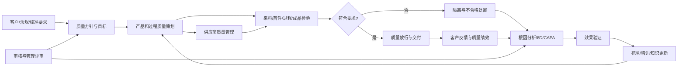
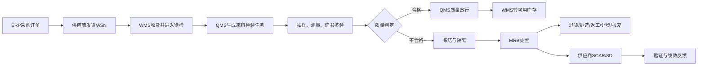

一家汽车零部件企业收到客户投诉：某批产品装车后出现尺寸偏差，需要在 24 小时内确认影响范围并给出临时措施。

质量工程师开始查数据，却很快发现问题比缺陷本身更棘手：

- 客户使用的是哪个产品版本？
- 这批产品由哪张生产工单制造？
- 使用了哪些原材料批次，来自哪些供应商？
- 当时由哪台设备、哪套工装、哪些人员生产？
- 首件是否经过放行，过程检验有没有发现趋势变化？
- 使用的图纸、控制计划和检验规范是不是有效版本？
- 同一批产品还发给了哪些客户？仓库里还有多少没有发出？
- 供应商、生产、检验、仓库和售后分别采取了什么措施？
- 问题关闭以后，怎样证明它不会在另一条产线、另一个工厂再次发生？

企业通常并不缺质量活动。研发做过评审，供应商交过报告，检验员填写了记录，生产处理过不良品，质量部门也发起过 8D 或 CAPA。真正缺少的是：这些活动没有围绕同一套要求、同一个产品版本、同一批实物和同一个质量问题形成闭环。

于是，质量管理很容易退化成几种局面：

- 标准放在文档系统，检验结果放在 Excel，问题跟踪放在邮件；
- 来料已经不合格，WMS 中的库存却仍然可领用；
- 首件尚未批准，MES 已经允许批量生产；
- 成品已经完工，ERP 和仓库便默认可以发货；
- 客诉完成了回复，却没有更新 FMEA、控制计划和培训；
- 管理层看到合格率很好，却看不到返工、停线、退货和索赔正在吞噬利润。

QMS 正是为了解决这类问题而存在。

> **QMS 不是一套电子检验表，也不是质量部门独占的问题处理工具。它是企业把客户要求、法规标准和内部质量目标转化为可执行规则，并通过质量策划、检验控制、异常处置、根因分析、纠正措施、审核和管理评审形成持续改进闭环的管理体系。数字化 QMS 则把这套体系落实为跨部门、可追溯、可度量的流程与数据平台。**

本文以通用制造业为基础，以汽车零部件企业为贯穿案例，回答四个问题：

1. QMS 到底是什么，为什么不能把它等同于检验软件？
2. QMS 在企业中处于什么位置，与 PLM、SRM、ERP、MES、WMS、CRM 如何分工？
3. QMS 解决哪些管理问题，价值怎样落到生产、库存、交付和客户？
4. 一条完整的 QMS 业务流程，如何从质量要求一直走到问题闭环与持续改进？

> 资料口径：本文基于截至 **2026 年 10 月 8 日**可访问的 ISO、FDA、AIAG、SAP、Oracle、Siemens 等公开资料整理。不同企业对 QMS 的模块名称、流程边界和系统归属可能不同，本文使用的是便于理解的制造业参考模型。

---

## 一、QMS 到底是什么

QMS 是 **Quality Management System**，通常翻译为“质量管理体系”或“质量管理系统”。

这两个中文名称看似接近，实际强调的层次不同：

- **质量管理体系**强调组织如何制定方针、设置职责、运行过程、配置资源并持续改进；
- **质量管理系统**常被用来指承载这些规则、流程和记录的数字化平台；
- **eQMS** 则更明确地表示电子化或数字化质量管理系统。

理解 QMS 的第一步，是把“体系”“业务机制”和“软件”分开。

### 1. QMS 首先是一套管理体系

ISO 9001 规定质量管理体系的要求，ISO 9000 则提供基础概念和术语。它们关注的不是企业买了哪个软件，而是组织能否持续提供满足客户和适用要求的产品与服务，并通过过程方法、风险思维、绩效评价和改进不断提升能力。

一套真正运行的 QMS，至少需要回答：

- 企业承诺什么样的质量？
- 客户、法规和行业标准提出了哪些要求？
- 哪些过程决定产品是否合格？
- 每个过程由谁负责，输入和输出是什么？
- 使用哪些设备、人员、材料、方法和测量资源？
- 过程和产品是否符合要求，证据在哪里？
- 发现异常后怎样控制影响、分析原因并验证改进？
- 管理层怎样获得信息、配置资源并调整方向？

所以，QMS 不只属于质量部门。销售承诺客户要求，研发定义产品，采购选择供应商，生产创造产品，仓库控制实物，售后接触客户，管理层决定资源。这些角色共同组成质量管理体系。

### 2. QMS 也是一套跨部门业务机制

制度必须进入日常业务才会产生结果。QMS 需要把抽象要求转换为具体控制：

```text
客户要求
  → 产品和过程要求
  → 图纸、规范、FMEA、控制计划
  → 检验项目、抽样方案、规格限和反应计划
  → 现场执行与数据采集
  → 合格判定与质量放行
  → 异常、不合格、客诉和审核发现项
  → 根因分析、纠正措施和效果验证
  → 标准更新、培训和经验复用
```

这条链路的核心不是“填表”，而是四件事：

1. **要求能够传递**：客户和法规要求能落到产品特性、过程参数和检验规则；
2. **执行能够证明**：每一次检验、批准、放行和处置都有可信记录；
3. **异常能够受控**：问题发生后，生产、库存和发运状态同步变化；
4. **经验能够反馈**：问题关闭后，标准、风险分析、培训和供应商策略得到更新。

### 3. 数字化 QMS 是体系运行的载体

数字化平台通常承载：

- 受控文档和变更；
- 培训、能力和人员资质；
- 质量策划、FMEA 和控制计划；
- 来料、首件、过程、成品和出货检验；
- 偏差、不合格、MRB、8D、CAPA；
- 客诉、退货、索赔和召回；
- 供应商审核、来料质量和整改；
- 量具、校准和实验室数据；
- 内外部审核和管理评审；
- 质量指标、风险、成本和趋势分析。

但是，软件不是体系本身。如果企业没有统一的术语、流程、数据标准、责任边界和关闭规则，上线 QMS 只会把原来的混乱搬到网页上。

### 4. QMS、QA、QC 和检验有什么区别

这些概念经常被混用，可以用关注问题来区分：

| 概念 | 关注重点 | 典型问题 |
|---|---|---|
| QMS | 整个质量管理体系和改进闭环 | 企业如何持续、稳定地满足要求？ |
| QA，质量保证 | 过程和体系是否有能力稳定地产生合格结果 | 流程、标准、审核和预防机制是否有效？ |
| QC，质量控制 | 产品或过程结果是否符合要求 | 当前批次、工序或产品是否合格？ |
| 检验与测试 | 获取符合性证据 | 测什么、怎样测、测量结果是多少？ |

检验只是 QMS 中的一个执行环节。一个企业可能检验很多，却仍然没有成熟的 QMS：它能发现不良品，却不能阻止问题重复发生；能给出合格率，却不能解释为什么客户仍在投诉。

---

## 二、QMS 管理的不是表单，而是质量对象之间的关系

如果把 QMS 理解为菜单集合，就会看到文档、检验、CAPA、审核等模块；如果从业务本质看，它管理的是一组相互关联的对象。

### 1. 要求

包括客户要求、法律法规、行业标准、合同、图纸、技术规范、企业标准和客户特殊要求。QMS 要知道要求从哪里来、适用于什么对象、由哪个版本生效。

### 2. 产品与实物

包括物料、零件、半成品、成品、批次、序列号、包装和样品。所有质量记录最终都应能关联到明确对象，而不是只有一张无法追溯的纸质检验单。

### 3. 过程

包括供应商过程、收货、仓储、制造工序、外协、检验、包装、发运和售后。过程需要明确输入、输出、资源、控制点和异常反应。

### 4. 资源

包括人员、设备、工装、模具、量具、实验室、材料和供应商。测量结果是否可信，往往取决于检验员是否具备资质、量具是否在校准有效期、试验方法是否适用。

### 5. 证据

包括测量值、测试报告、审批记录、电子签名、培训记录、审核证据和审计追踪。证据不仅要“存在”，还要能说明由谁、何时、依据哪个版本、对哪个对象执行了什么动作。

### 6. 质量事件

包括偏差、缺陷、不合格、投诉、退货、审核发现项、供应商问题、质量事故和潜在风险。不同入口可以共享一套问题分级、遏制、分析、行动和关闭逻辑。

### 7. 行动与决策

包括冻结、放行、返工、返修、挑选、退货、报废、让步接收、停机、召回、纠正措施和预防性控制。QMS 的价值最终要体现在这些决策是否及时、受权、可追溯并真正有效。

因此，QMS 的核心数据链不是一张张孤立表单，而是：

```text
要求
  → 产品版本
  → 过程和控制计划
  → 检验任务与结果
  → 批次/SN质量状态
  → 不合格和处置
  → 根因与措施
  → 效果验证
  → 标准更新
```

---

## 三、QMS 在企业中的定位

### 1. 管理定位：企业经营体系中的质量治理主线

质量并不是产品做完以后由检验员“加上去”的属性。它从销售承诺和产品设计开始，在供应商选择、工艺设计、生产准备、制造执行、仓储交付和售后服务中逐步形成。

因此，QMS 应贯穿：

```text
市场与客户要求
  → 产品与过程设计
  → 供应商与采购
  → 来料与仓储
  → 生产与过程控制
  → 成品放行与交付
  → 客诉与售后
  → 经验反馈与持续改进
```

质量部门通常负责体系治理、专业方法和独立判定，但质量结果由所有业务部门共同创造。把所有质量责任推给检验员，等于让最后一道工序为前面所有设计和过程问题买单。

### 2. 业务定位：连接“要求—执行—证据—问题—改进”

QMS 在业务上建立五段连接：

1. **要求到标准**：把客户、法规和内部目标转成产品与过程控制；
2. **标准到执行**：把控制计划转成检验、采集、审批和反应任务；
3. **执行到证据**：记录测量值、状态、人员、设备、时间和版本；
4. **证据到问题**：识别偏差、不合格、趋势异常和风险；
5. **问题到改进**：通过根因、措施、验证和标准更新减少复发。

### 3. 系统定位：跨业务系统的质量中枢

QMS 很少独立运行。它需要和企业已有系统分工协同。

| 系统 | 核心职责 | 与 QMS 的协同 |
|---|---|---|
| PLM | 产品定义、BOM、图纸、规范和工程变更 | 向 QMS 提供产品版本和质量要求，接收质量问题并推动设计改进 |
| SRM | 供应商准入、寻源、协同、绩效和关系管理 | 与 QMS 共享供应商审核、来料质量、8D 和质量绩效 |
| ERP | 采购、生产、销售、库存和财务交易 | 触发检验业务，接收质量结论并执行退货、结算和成本处理 |
| MES | 生产执行、工序、设备和过程参数 | 触发首件和过程检验，执行停机、隔离、返工与恢复 |
| WMS | 库存位置、状态和仓储作业 | 根据 QMS 判定冻结、放行、移库、退货或报废实物 |
| CRM/售后 | 客户、服务、投诉和退换货 | 把客户质量事件送入 QMS，接收分析和整改结果 |
| EAM/计量/LIMS | 设备、量具、校准、维护和实验室检测 | 为质量判定提供可信资源状态和检测结果 |
| BI/数据平台 | 跨域经营分析 | 汇总质量、交付、成本和客户数据，支持趋势与经营决策 |

一句话概括：

> **PLM 定义产品应该是什么，ERP 组织资源与交易，MES 执行生产，WMS 控制实物库存，SRM 管理供应关系，CRM 承接客户互动；QMS 负责判断过程和结果是否满足质量要求，并推动所有质量问题得到受控处置和闭环改进。**

### 4. QMS 不应替代所有系统

“质量相关”不意味着都必须存进 QMS：

- 图纸和 BOM 的权威版本通常属于 PLM；
- 采购订单、生产订单、销售订单和成本属于 ERP；
- 工序执行、设备参数和生产实绩属于 MES；
- 库位、库存移动和拣货执行属于 WMS；
- QMS 应保存或引用质量标准、检验结果、判定、质量事件、处置和改进记录。

正确做法不是让 QMS 复制所有数据，而是让系统围绕共同标识和业务事件协同。例如，QMS 通过生产工单号、产品版本、批次和序列号关联 MES 数据，通过检验批关联 ERP 收货，通过库存状态接口控制 WMS 实物。

---

## 四、QMS 解决什么问题

### 1. 解决质量要求无法层层传递的问题

企业最危险的质量问题，往往不是“没有标准”，而是每个环节拿到的标准不同：

- 客户要求留在销售合同；
- 图纸已经升版，供应商仍按旧版生产；
- 控制计划修改了，检验规范没有同步；
- 检验员使用本地 Excel，现场不知道什么时候生效；
- 工艺改变了，培训和量具能力没有重新确认。

QMS 通过要求分解、文档受控、版本关联、变更影响分析、生效管理和培训确认，让正确的人在正确时间使用正确版本的要求。

### 2. 解决质量判断依赖个人经验的问题

如果抽样数量、检验项目、规格限和放行权限只存在于老师傅脑中，不同班次就会给出不同结论。

QMS 可以把规则结构化：

```text
物料 + 供应商 + 工厂 + 业务场景 + 风险等级
  → 检验计划
  → 抽样方案
  → 检验特性
  → 规格上限/下限
  → 判定逻辑
  → 处置和审批规则
```

这样，经验才能变成可复用、可审核、可持续优化的组织能力。

### 3. 解决“发现很多问题，却总是重复发生”的问题

只做终检，相当于在产品完成后筛选结果。它能阻止部分不良品流出，却不能降低缺陷产生概率。

成熟的 QMS 会把重点前移：

- 在设计阶段识别产品和过程风险；
- 在供应商导入阶段验证能力；
- 在首件阶段确认生产条件；
- 在过程阶段监控趋势，而不是等到超差；
- 在问题关闭时验证措施效果并横向展开。

目标是从“检出缺陷”转向“预防缺陷”。

### 4. 解决异常处置不闭环的问题

线下异常往往停留在“发消息—催回复—改状态”。QMS 应确保每个问题都有：

- 明确对象和影响范围；
- 严重度、优先级和升级规则；
- 临时遏制措施；
- 责任人、期限和审批人；
- 根因证据和行动计划；
- 实施记录和效果指标；
- 正式关闭结论；
- 对标准、培训和相似场景的反馈。

### 5. 解决质量结论与实物状态脱节的问题

检验系统判定不合格，如果仓库仍把库存显示为“可用”，质量控制就只停留在记录层。

QMS 的判断必须转化为业务控制：

```text
来料不合格 → WMS冻结库存 → ERP阻止结算或触发退货
过程异常   → MES停机隔离 → 禁止继续报工或转序
成品未放行 → WMS禁止转可售 → ERP禁止发货
重大客诉   → 定位批次/SN → 冻结库存与在途产品
```

### 6. 解决追溯慢、召回范围大的问题

当客户反馈一个序列号时，企业需要快速完成两种追溯：

- **反向追溯**：成品 → 工单 → 工序 → 设备/人员 → 原料批次 → 供应商；
- **正向追溯**：原料批次或异常工序 → 受影响工单 → 成品批次/SN → 发运单 → 客户。

追溯越准确，企业越能缩小冻结和召回范围，减少不必要损失。

### 7. 解决供应商质量与采购决策脱节的问题

如果供应商多次来料不合格，却不影响准入、等级、份额和定点，整改就不会形成经营约束。

QMS 应把供应商审核、来料 PPM、重大问题、8D 响应、措施有效性等结果反馈给 SRM 和采购决策，让质量成为供应商管理的真实输入。

### 8. 解决合规证据准备成本高的问题

审核前临时找记录、补签名、追培训，说明体系没有在日常运行中自然产生证据。

数字化 QMS 通过受控版本、电子审批、权限、时间戳、审计追踪和留存规则，让“做过什么、依据什么、谁批准的”可以随时证明。

### 9. 解决管理层看不到质量经营结果的问题

质量不是只有合格率。返工、报废、停线、退货、索赔、加急运输、筛选和保修都会形成劣质成本。

QMS 与 ERP、MES、WMS、CRM 数据结合后，管理层才能看到：

- 哪个产品、工厂、产线或供应商正在制造最多损失；
- 哪类缺陷频繁发生但长期未根治；
- 哪些改进项目真正降低了成本和客户风险；
- 当前指标改善是因为过程稳定，还是因为检验口径变化。

---

## 五、QMS 全业务流程总览

制造业 QMS 可以概括为九个连续环节：

```text
质量要求
  → 质量策划
  → 来料检验
  → 首件放行
  → 过程检验
  → 异常闭环
  → 成品放行
  → 客户反馈
  → 追溯改进
```


从业务推进顺序看，可以分成三个阶段。

### 第一阶段：质量准备与来料控制

```text
客户质量要求
  → PLM技术标准
  → 质量计划/控制计划
  → 检验项目与抽样规则
  → 供应商送货
  → WMS待检与冻结
  → QMS来料检验
  → 合格放行或异常隔离
```

### 第二阶段：生产过程质量控制

```text
ERP生产工单
  → MES创建生产批次
  → QMS匹配有效标准
  → 首件检验与放行
  → 自检/巡检/自动采集
  → 趋势监控
  → 异常时停机和隔离
  → 原因、措施、复检与恢复
```

### 第三阶段：成品放行与质量改进

```text
MES反馈完工
  → QMS成品检验
  → 质量放行
  → WMS入库/ERP发货
  → 客户反馈
  → 批次与SN追溯
  → 临时遏制、根因分析和CAPA
  → 效果验证
  → 标准更新
```

从管理逻辑看，这三个阶段又构成四层循环：

1. **策划层**：确定目标、风险、标准、控制计划和检验规则；
2. **执行层**：在供应、制造、交付和服务过程中采集证据并作出判断；
3. **处置层**：控制不合格，分析根因，实施纠正和风险降低措施；
4. **改进层**：通过绩效、审核、管理评审和经验反馈更新体系。



这张图真正重要的不是箭头数量，而是它说明：每一次质量问题最终都要回到标准和过程。只关闭一张问题单，却没有改变造成问题的系统条件，不算完成闭环。

---

## 六、主流程一：质量战略、目标与体系策划

QMS 的起点不是检验，而是企业决定要交付什么质量、承担什么风险、怎样衡量结果。

### 1. 识别质量要求

要求通常来自多个方向：

- 客户合同、图纸、技术规范和特殊要求；
- 法律法规、监管和产品准入；
- ISO、行业标准和认证规则；
- 企业战略、品牌定位和服务承诺；
- 历史客诉、召回、审核和失效经验；
- 供应链、设备、人员和新技术带来的风险。

需求识别不能只做成一个文件清单。企业还需要知道：要求适用于哪个产品、工厂、客户、市场和生命周期阶段，由谁负责解释，何时生效，变化后影响哪些对象。

### 2. 制定质量方针和目标

质量方针表达企业的方向，质量目标则必须可分解、可度量。例如：

- 客户 PPM 降低到某个水平；
- 重大客诉和安全事件为零；
- 一次交检合格率提高；
- 供应商来料 PPM 降低；
- CAPA 按期完成率和有效率达到目标；
- 劣质成本占营收比例下降；
- 关键过程能力达到规定水平。

目标不能只分给质量部门。客户投诉可能源自设计，来料问题属于供应链，过程波动与生产和设备有关，追溯能力需要 IT、MES 和仓储共同建设。

### 3. 建立过程地图和责任机制

企业需要识别 QMS 过程以及它们之间的关系，例如：

```text
客户要求管理
  → 产品质量策划
  → 供应商质量
  → 制造质量控制
  → 交付与客户质量
  → 问题解决与持续改进
```

每个过程应明确：

- 过程负责人；
- 输入和输出；
- 参与角色；
- 风险和控制点；
- 绩效指标；
- 所需资源；
- 与上下游过程的接口。

### 4. 进行风险与机会策划

风险管理不只是在审核前维护一张风险清单。它需要进入决策：

- 高风险供应商是否需要更严格审核和检验？
- 关键特性是否需要防错、自动采集或 100% 检测？
- 新产品、新工艺、新设备和工程变更是否需要额外验证？
- 重大客诉是否需要横向排查其他工厂和相似产品？
- 某项改进是否可能引入新的质量、交付或安全风险？

QMS 将风险与控制计划、抽样、审批、审核频率和升级规则连接起来，风险才不只是文档。

---

## 七、主流程二：产品与过程质量策划

质量问题越晚发现，处置成本通常越高。产品与过程质量策划的目标，是在量产前尽量识别“可能怎样失败”，并设计控制方法。

### 1. 从客户语言转换为可验证要求

客户可能说“必须耐久”“外观不能有明显缺陷”“关键尺寸必须稳定”。企业需要将这些表达转换为：

- 可测量的产品特性；
- 规格上限、下限和公差；
- 适用的测试方法和环境；
- 关键/特殊特性标识；
- 过程参数和能力要求；
- 验收、放行和反应规则。

理想的追溯关系是：

```text
客户要求
  → 系统/产品需求
  → 设计特性
  → 过程特性
  → 风险项
  → 控制计划
  → 检验特性
  → 测量结果
```

### 2. 设计质量门

从概念到量产的不同阶段，应设置相应质量门：

- 需求评审；
- 设计评审；
- 样件和试制评审；
- 工艺验证；
- 首件认可；
- 量产准备评审；
- 变更后的重新验证。

质量门不是多加一个审批按钮，而是明确进入下一阶段前必须具备哪些证据，哪些风险必须关闭，哪些偏差需要授权接受。

### 3. 用风险分析连接控制计划

以汽车行业为例，DFMEA、PFMEA、控制计划、作业指导书和检验标准不能彼此独立：

```text
潜在失效模式
  → 失效影响与风险
  → 预防/探测控制
  → 控制计划
  → 现场作业和检验任务
  → 实际结果与问题反馈
```

如果某个高风险失效模式只存在于 FMEA，却没有进入现场控制，它就没有真正被管理；如果客诉发生后 FMEA 风险仍然不变，经验也没有被吸收。

### 4. 建立检验计划

检验计划需要定义：

- 在什么事件下触发检验；
- 检验什么对象和版本；
- 检验哪些特性；
- 使用什么方法、量具和设备；
- 抽取多少样本；
- 规格限和判定规则是什么；
- 谁可以执行和批准；
- 不合格时采取什么反应；
- 记录保留多久，是否需要质量证书。

### 5. 让工程变更驱动质量变更

图纸、材料、BOM、供应商、设备、工艺参数或检验方法发生变化时，QMS 应触发影响分析：

```text
工程变更
  → 识别受影响产品和过程
  → 评估质量风险
  → 更新FMEA/控制计划/检验规范
  → 更新程序或设备参数
  → 培训相关人员
  → 重新验证或首件检验
  → 按生效点切换版本
```

最需要防止的是“产品已经按新版本生产，现场仍按旧版本检验”。

---

## 八、主流程三：供应商质量与来料控制

供应商质量不是“来料不合格以后要求对方写 8D”，而是从供应商选择开始管理其持续满足要求的能力。

### 1. 供应商准入

采购关注价格、交期和商务条件，质量还需要验证：

- 供应商是否具备必要资质和体系能力；
- 生产设备、工艺、人员和检测资源是否满足要求；
- 关键过程是否稳定，特殊特性怎样控制；
- 分供方和原材料来源是否受控；
- 变更、追溯和异常响应机制是否有效；
- 是否存在产能、合规、地域或单一来源风险。

高风险供应商可能需要现场审核、过程审核、样件认可、首件验证或适用的 APQP/PPAP 活动。完成这些活动的目的不是收齐文件，而是形成“为什么相信它具备量产能力”的证据。

### 2. 采购质量策划

供应商获准供货后，还需要把质量要求写进交易和协同过程：

- 技术规范和质量协议；
- 图纸与版本；
- 关键特性和控制要求；
- 材质证明、合格证和试验报告；
- 批次、序列号、包装和标签规则；
- 检验水平和抽样方案；
- 变更申报和批准要求；
- 异常通知、遏制、8D 和响应时限。

### 3. 供应商送货触发来料检验

典型流程如下：



这里存在第一个关键质量闸门：

> **收货不等于可用，检验结果合格也不等于库存已经放行。只有 QMS 完成质量判定和授权，WMS 才能将待检库存切换为可领用状态。**

### 4. 动态调整检验策略

不是所有来料都应永久使用相同抽样比例。QMS 可以根据风险动态调整：

- 新供应商或新产品执行加严检验；
- 历史稳定、低风险供应商可减少检验；
- 连续不合格后切换到加严或全检；
- 重大问题关闭并经过观察期后再恢复正常水平；
- 关键安全特性即使历史良好，也可能保持更严格控制。

免检也不等于不管理，而是把控制前移到供应商过程能力、证书、审核和持续绩效监控。

### 5. 来料不合格闭环

来料异常应同时影响三条线：

- **实物线**：冻结、隔离、退货、挑选或返工；
- **问题线**：不合格记录、根因、措施和效果验证；
- **经营线**：供应商绩效、等级、采购份额和后续准入。

如果异常只停留在 QMS，而供应商整改只存在于邮件，采购系统仍把它当成正常供应商，企业就会反复购买同样的风险。

---

## 九、主流程四：首件放行与生产过程质量控制

生产阶段的目标不是在末端挑出不良品，而是在制造过程中持续确认：使用的是正确版本，生产条件受控，关键数据稳定，异常没有继续扩散。


### 1. 生产工单触发质量控制

ERP 下达生产工单后，MES 会组织实际生产。QMS 需要获得或引用：

- 产品和工艺版本；
- 生产数量和批次；
- 工艺路线与当前工序；
- 适用的质量计划和检验规范；
- 关键特性、过程参数和反应计划；
- 所需人员资质、设备、工装和量具状态。

系统首先要确认“标准与对象匹配”。如果生产的是产品版本 B，却加载了版本 A 的检验计划，后面的数据再完整也没有意义。

### 2. 生产前条件确认

开工前可以检查：

- 材料是否为正确批次并已放行；
- 图纸、程序和作业指导书是否为有效版本；
- 设备、工装和模具状态是否合格；
- 量具是否在校准有效期；
- 操作员和检验员是否具备授权；
- 上一批产品和物料是否已完成清场；
- 关键参数是否按版本正确下发。

这类检查看似属于 MES，但它依赖 QMS 提供资质、质量状态和有效标准。两者应通过规则与接口协同，而不是让现场人员在多个系统之间人工核对。

### 3. 首件检验不是普通抽检

首件用于确认当前的人、机、料、法、环、测组合是否有能力按要求生产。触发场景可以包括：

- 每个生产批次首次开工；
- 换班、换线、换模、换刀具；
- 材料批次、供应商或工艺版本变化；
- 设备维修、参数调整或长时间停机后重启；
- 发生重大异常并完成调整后；
- 客户或法规明确要求的场景。

典型流程是：

```text
MES创建生产批次
  → 操作人员按工艺完成第一件
  → QMS生成首件检验任务
  → 检验关键尺寸、外观和功能
  → 记录实际值与生产条件
  → 质量判定
```

首件合格时：

```text
QMS首件放行
  → MES解除批量生产限制
  → 按当前受控条件继续生产
```

首件不合格时：

```text
禁止批量生产
  → 分析人、机、料、法、环、测
  → 调整设备、工装、材料、方法或参数
  → 重新制作首件
  → 重新检验
  → 再次申请放行
```

这里是第二个关键质量闸门：

> **第一件产品已经完成，不代表生产线可以批量运行；只有首件获得正式质量放行，MES 才应允许继续生产。**

### 4. 自检、巡检、专检和自动采集

批量生产后，质量数据可以来自多种方式：

- 操作员自检；
- 班组互检；
- 质量人员巡检或专检；
- 设备、传感器、视觉系统和测试台自动采集；
- 实验室检测；
- 防错装置和在线监控。

QMS 要记录的不只是“合格/不合格”，还包括实际测量值、时间、设备、工位、人员、量具、批次、序列号和标准版本。只有保留连续数据，企业才能识别漂移和趋势，而不是等超出规格后才发现。

### 5. 规格限不等于控制限

规格限回答“产品是否满足要求”，通常来自设计或客户标准；控制限用于判断过程是否保持统计稳定，来自过程数据。

一个测量值仍在规格内，但连续向上限偏移，可能说明刀具磨损、温度变化或设备漂移。成熟的 QMS 会在产品正式超差前发出趋势预警，触发检查、调整或加密抽样。

因此，过程质量控制需要同时关注：

- 单个结果是否符合规格；
- 数据分布和趋势是否异常；
- 过程能力是否足够；
- 控制图是否出现特殊原因信号；
- 测量系统是否可信。

### 6. 过程异常必须控制生产状态

当检验不合格、关键参数越界或趋势异常达到触发条件时，标准链路应是：

```text
发现异常
  → MES停止相关工序或批次
  → QMS登记质量事件
  → 隔离从上次合格点以来的可疑产品
  → 识别在制品、库存和已转序产品
  → 临时遏制与不合格评审
  → 原因分析和过程调整
  → 重新制作/返工
  → 复检
  → QMS授权恢复
  → MES恢复生产
```

这里是第三个质量闸门：

> **异常记录被标记为“已处理”，不代表生产可以恢复。企业需要明确复检证据、恢复条件和授权角色，再由 MES 执行恢复。**

### 7. 不要把“操作员不小心”当作终点

当问题归因于人员时，还要继续追问：

- 作业指导书是否清楚且处于现场可用状态？
- 人员是否经过培训并具备资质？
- 产品是否可以通过治具、防错或程序避免装反？
- 界面和标签是否容易混淆？
- 节拍、疲劳和环境是否增加了出错概率？
- 为什么后续控制没有及时发现？

质量改进的目标不是找到一个可以承担责任的人，而是改变系统条件，使同类错误更难发生、更容易发现。

---

## 十、主流程五：成品检验、质量放行与发运控制

生产完工只说明制造动作结束，不说明产品已经满足全部交付条件。


### 1. MES反馈完工对象

MES 向 QMS 或 ERP 反馈：

- 产品和版本；
- 完工数量；
- 生产工单；
- 批次或序列号；
- 关键工序和过程记录；
- 返工、偏差和异常情况；
- 使用的主要原材料批次。

QMS 根据产品、客户、工厂和业务场景生成最终检验任务。

### 2. 成品检验

成品检验可能包括：

- 外观和标识；
- 关键尺寸；
- 性能和功能测试；
- 包装、数量和附件；
- 客户特殊要求；
- 检验报告、合格证和法规文件；
- 生产过程记录完整性；
- 未关闭偏差和不合格状态。

某些产品的放行并不只取决于一次最终抽检，还需要确认全过程记录完整、关键工序完成、使用材料受控、偏差获得批准。

### 3. 区分检验结果、质量判定和质量放行

这是 QMS 设计中很容易混淆的三个概念：

- **检验结果**：测量值、缺陷、试验输出和观察记录；
- **质量判定**：依据规则判断合格、不合格或需要进一步评审；
- **质量放行**：由具备权限的角色确认产品可以进入下一业务阶段。

例如，所有抽样结果都合格，但某项必要报告缺失，产品仍可能不能放行；某项结果偏离常规规格，但经过正式偏差评审和客户授权，可能在受控范围内让步接收。

### 4. 成品合格路径

```text
完成检验
  → 确认记录完整
  → QMS作出放行决定
  → 生成检验记录/质量报告/合格证
  → WMS将成品转为可用或可销售状态
  → ERP下达发货任务
  → WMS拣货、复核、包装和出库
```

这是第四个质量闸门：

> **生产完工不等于成品可入库，入库也不等于可以发货。只有完成规定的质量放行，库存和销售交付流程才能继续。**

### 5. 成品不合格路径

```text
判定不合格
  → 冻结成品批次/SN
  → 识别关联在制品和库存
  → MRB评审
  → 返工/返修/挑选/报废/让步接收
  → 处置执行
  → 重新检验
  → 再次判定和放行
```

返工不是“修改数量后结束”。返工需要：

- 有批准的返工方案；
- 评估返工是否引入新风险；
- 记录实际返工操作；
- 按规定重新检验；
- 保持原始不合格与最终结果的完整关联。

### 6. 发运时建立客户追溯关系

出库时，企业应建立：

```text
产品批次/SN
  ↔ 包装和容器
  ↔ WMS出库单
  ↔ ERP发运单/销售订单
  ↔ 客户和收货地点
```

这是第五个质量闸门。没有这层关联，客诉发生后即使能找到生产记录，也无法迅速确认同批产品还发给了哪些客户。

---

## 十一、主流程六：不合格、偏差与 MRB

不合格管理的目标不是把一张单据从“新建”流转为“关闭”，而是及时控制风险、作出受权处置并保留完整证据。

### 1. 统一质量事件入口

质量问题可能来自：

- 来料、首件、过程、成品和出货检验；
- 设备报警、参数越界和趋势预警；
- 生产、仓储和物流现场发现；
- 客户投诉、退货和售后故障；
- 内部审核、客户审核和认证审核；
- 供应商主动通知；
- 员工质量报告和管理层检查。

入口可以不同，但都应进入统一的问题分级和闭环框架。

### 2. 先遏制，再分析

问题发生后的第一个目标不是立刻找到最终根因，而是防止影响扩大：

- 停止相关生产或发运；
- 冻结可疑批次和库存；
- 识别从上次合格点以来的产品；
- 通知相关工厂、仓库、供应商和客户；
- 对在制品、库存、在途和客户现场产品采取筛选；
- 必要时启动召回或监管报告流程。

临时遏制措施不能替代永久措施，但没有有效遏制，分析期间可能继续产生和流出不良品。

### 3. 识别影响范围

影响范围不是只看发现问题的那一件产品，而要围绕共同条件展开：

- 同一原材料批次；
- 同一设备、工装或程序版本；
- 同一班次、人员或时间窗口；
- 同一供应商和生产日期；
- 同一图纸或工艺版本；
- 同一失效模式和相似产品；
- 已入库、已发运、在途和客户现场数量。

### 4. MRB 作出处置决策

MRB 可理解为对不合格品进行跨职能评审的机制。处置方式通常包括：

- 返工：按原要求重新加工，使其符合要求；
- 返修：使产品可用，但结果不一定完全回到原要求；
- 挑选：从批次中筛出符合与不符合产品；
- 退货：退回供应商；
- 报废：阻止继续使用；
- 让步接收：经授权，在明确数量、期限和风险条件下接受；
- 改作他用：转为其他受控用途。

让步接收尤其需要控制：谁有权批准、客户是否需要同意、适用于多少数量和期限、是否影响安全功能、是否需要额外标识和追溯。

### 5. 质量判定必须与实物同步

不合格流程至少要推动以下状态变化：

```text
QMS：质量事件和判定状态
MES：在制品、工序、生产批次状态
WMS：库存冻结、隔离位置、可用性状态
ERP：采购退货、生产报废、销售发运和成本状态
```

如果只更新 QMS 单据，不控制实物，系统就无法真正降低风险。

---

## 十二、主流程七：根因分析、8D 与 CAPA

### 1. 先区分几个概念

- **纠正**：处理已经发现的不合格，例如返工一件产品；
- **临时遏制**：防止问题继续扩大，例如冻结同批库存；
- **根因分析**：识别问题为什么发生，以及为什么没有被及时发现；
- **纠正措施**：消除已发生问题的根因，降低复发概率；
- **风险降低或预防性措施**：降低相似问题在其他对象上发生的可能性；
- **有效性验证**：用证据确认措施确实带来了持续改善。

修好产品不等于解决问题，完成措施不等于措施有效。

### 2. 一个完整的问题解决流程

```text
问题定义
  → 建立跨职能团队
  → 临时遏制
  → 描述发生范围和未发生范围
  → 分析发生根因与逃逸根因
  → 制定永久措施
  → 评估措施风险
  → 实施并记录
  → 验证效果
  → 更新标准和横向展开
  → 正式关闭
```

### 3. 同时分析发生根因和逃逸根因

一个不良品到达客户，通常至少有两个问题：

1. 为什么缺陷会产生？
2. 为什么现有控制没有发现或阻止它？

例如，尺寸偏差的发生原因可能是刀具磨损，逃逸原因可能是抽样频率不足、量具能力不够、控制图预警没有触发，或不合格库存未被正确冻结。

只解决发生原因，可能仍会让其他缺陷流出；只增加检验，则没有减少缺陷产生。

### 4. 根因必须有证据

常用方法包括 5 Why、鱼骨图、故障树、因果矩阵、试验验证和数据分析。但工具不是目的。有效根因需要能够解释：

- 为什么问题在这个时间和地点发生；
- 为什么其他时间、设备或批次没有发生；
- 改变该因素后，问题是否可以被复现或消除；
- 它是否同时解释了数据、现象和影响范围。

“员工疏忽”“加强培训”“要求注意”通常只是表面结论。如果培训内容、作业设计、防错、负荷和监督机制没有变化，问题很可能重复发生。

### 5. 措施要进入实际控制

永久措施可能包括：

- 修改产品设计或公差；
- 改变材料、设备、工装或工艺参数；
- 增加防错和自动联锁；
- 修改控制计划和抽样频率；
- 改进供应商过程；
- 调整维护和刀具更换周期；
- 增加趋势监控或系统校验；
- 修改职责、审批和培训要求。

措施应进入 PLM、MES、QMS、设备管理和现场作业，而不是只写在 CAPA 描述字段中。

### 6. 效果验证决定 CAPA 能否关闭

效果验证需要预先定义：

- 观察什么指标；
- 在多长时间或多少批次内观察；
- 目标值是什么；
- 是否出现副作用；
- 由谁独立确认；
- 如果无效，是否重新打开问题。

例如，措施是修改刀具更换周期，验证不能只看“文件已发布”，而要看后续若干批次的尺寸趋势、过程能力、异常数量和客户表现。

### 7. 横向展开与知识沉淀

同类设备、工艺、供应商、材料或产品可能存在相同风险。问题关闭前应检查：

- 其他产线是否使用相同设备或程序；
- 其他产品是否有相似设计；
- 其他供应商是否执行相同过程；
- 其他工厂是否需要同步控制；
- 是否需要更新 FMEA、控制计划、审核清单和培训材料。

只有当经验进入组织标准，单点问题解决才转化为体系改进。

---

## 十三、主流程八：客户投诉、退货与追溯改进

客户质量问题是企业内部所有设计和过程控制的最终反馈。客诉管理不能只追求“按时回复客户”，还要把外部现象转化为内部可验证问题，并将改进反馈到产品、过程和供应链。

### 1. 建立统一客户质量入口

输入可能来自：

- 正式投诉；
- 退货和索赔；
- 客户现场故障；
- 售后维修和保修；
- 客户审核和评分；
- 监管机构、经销商或服务商；
- 市场上的质量趋势和负面反馈。

CRM 适合管理客户沟通和服务工单，QMS 则负责质量分级、调查、追溯、根因、措施和验证。两者应共享状态，避免客户经理与质量工程师维护两套事实。

### 2. 把客户语言转换为问题定义

客户可能只说“装不上”“异响”“外观不好”或“使用一段时间后失效”。企业需要补齐：

- 客户、地点和使用场景；
- 产品型号、版本、批次或序列号；
- 发现时间、失效时间和使用条件；
- 故障样品、照片、数据和返回件；
- 失效比例和影响数量；
- 安全、法规、停线和交付影响；
- 是否需要快速响应、现场支持或监管报告。

问题定义越清楚，后续根因分析越不容易偏离。

### 3. 客诉的标准闭环

```text
客户反馈
  → CRM/QMS登记
  → 严重度和风险分级
  → 快速响应与临时遏制
  → 按批次/SN追溯
  → 识别库存、在途和其他客户
  → 返回件或数据分析
  → 根因与逃逸点分析
  → 8D/CAPA
  → 效果验证
  → 客户回复与认可
  → 索赔/退换货处理
  → 标准更新和横向展开
```

### 4. 正向和反向追溯

以一个故障成品序列号为例，反向追溯应能回答：

```text
成品SN
  → 发运单和客户
  → 成品批次与生产工单
  → 工序、设备、工装和操作人员
  → 首件、过程和成品检验记录
  → 原材料批次与供应商
  → 当时生效的图纸、工艺和控制计划
```

正向追溯则从怀疑对象出发：

```text
异常原料批次/设备/时间窗口
  → 被哪些工单使用
  → 形成哪些成品批次和SN
  → 当前位于在制、库存、在途还是客户现场
  → 分别发给哪些客户
```

### 5. 追溯的价值不是“查得到”，而是“缩小范围”

没有精确追溯时，企业可能不得不冻结一个月的所有产品；如果可以定位到某个原材料批次、某台设备的特定时间窗口，就能把影响范围缩小到真正可疑的产品。

追溯能力因此直接影响：

- 响应速度；
- 筛选和召回成本；
- 客户停线风险；
- 法规合规；
- 对根因的判断质量。

---

## 十四、支撑流程一：文档、变更与培训控制

业务主流程能够长期稳定运行，依赖一组基础支撑能力。

### 1. 文档控制

受控文档可以包括：

- 质量手册、程序文件和管理制度；
- 图纸、规范和客户要求；
- FMEA、控制计划和检验标准；
- 作业指导书和反应计划；
- 审核表、记录模板和报告格式。

完整生命周期是：

```text
起草
  → 评审
  → 批准
  → 发布
  → 培训和生效
  → 变更
  → 作废
  → 归档和保留
```

QMS 要避免现场使用作废版本，并保留历史版本，以便解释某批产品生产时依据的标准。

### 2. 变更控制

变更不能只修改文件。一个完整变更需要回答：

- 为什么变；
- 变更哪些对象；
- 影响哪些产品、过程、供应商、设备和客户；
- 需要什么验证；
- 谁批准；
- 何时生效；
- 旧料、在制品和旧版本怎样处理；
- 哪些人员需要培训；
- 是否需要通知客户或监管机构。

### 3. 培训与资质

培训管理不应只统计“课程已完成”。关键岗位需要建立能力和授权：

- 岗位需要哪些知识和技能；
- 哪些文件变更后必须重新培训；
- 是否需要考试、实操或见证评估；
- 资质有效期和复审周期；
- 未获授权人员是否会被系统阻止执行关键操作。

例如，量具检验任务可以校验检验员资质；特殊工序可以由 MES 校验操作员授权；文档变更可以自动生成培训任务。

---

## 十五、支撑流程二：设备、量具、实验室与测量可信度

质量判断依赖测量。如果测量系统不可信，记录再完整也可能产生错误结论。

### 1. 量具和校准

QMS 或计量系统应管理：

- 量具唯一编号、类型和使用范围；
- 校准周期、标准器和校准机构；
- 当前状态和到期预警；
- 校准证书和结果；
- 维修、报废和停用；
- 超差后的历史测量影响分析。

当量具校准超差时，不能只把量具送修，还要识别它从上次合格校准以来检验过哪些产品，是否需要重新评估或通知客户。

### 2. 测量系统分析

对于关键特性，仅仅“量具在有效期”并不代表测量足够可靠。企业还需要评估重复性、再现性、偏倚、线性和稳定性等能力，确认测量系统能够区分真实过程变化与测量噪声。

### 3. 实验室和测试管理

实验室场景还需要关注：

- 样品接收、编号和流转；
- 测试方法与版本；
- 环境条件；
- 仪器状态；
- 试剂和标准样品；
- 原始数据与计算；
- 复核、批准和报告；
- 样品与记录留存。

LIMS 可以承担专业实验室执行，QMS 负责把结果连接到检验批、放行和质量事件。

---

## 十六、支撑流程三：审核与管理评审

### 1. 审核不是“找几个问题”

审核用于获取证据，判断体系、过程、产品或供应商是否符合要求并有效运行。常见类型包括：

- 体系审核；
- 过程审核；
- 产品审核；
- 分层过程审核；
- 供应商审核；
- 客户或第三方审核。

审核流程包括：

```text
年度计划
  → 审核准备和检查表
  → 现场取证
  → 发现项和分级
  → 整改计划
  → 措施实施
  → 验证
  → 关闭
  → 趋势与重复问题分析
```

如果审核每年发现相同问题，说明企业只关闭了发现项，没有改善其背后的系统条件。

### 2. 审核应基于风险

审核频率和深度可以结合：

- 过程重要性；
- 客诉和不合格趋势；
- 新产品、新设备和重大变更；
- 供应商绩效；
- 历史审核结果；
- 法规和客户要求。

这样审核资源可以优先投向真正高风险过程，而不是平均分配。

### 3. 管理评审让质量进入经营决策

管理评审不是质量部门向高层汇报一组图表，而是最高管理层判断体系是否仍然适宜、充分、有效，并决定资源和方向。

输入可以包括：

- 质量目标和过程绩效；
- 客诉、退货、召回和客户满意；
- 内外部审核结果；
- 不合格、CAPA 和重复问题；
- 供应商质量；
- 人员、设备、检测和数字化能力；
- 法规、客户和市场变化；
- 质量成本、风险和改进机会。

输出应形成明确决策：

- 目标调整；
- 资源投入；
- 流程和体系变更；
- 重大改进项目；
- 风险处置和责任人。

---

## 十七、QMS 的五个质量闸门

把全流程浓缩后，可以看到 QMS 最重要的作用，是在关键业务转换点建立受控闸门。

### 1. 来料放行闸门

```text
供应商到货
  → WMS待检
  → QMS检验与判定
  → 合格后转可用
```

防止未经检验或未完成放行的物料进入生产。

### 2. 首件放行闸门

```text
完成第一件产品
  → 首件检验
  → QMS授权
  → MES允许批量生产
```

防止错误版本、错误参数或错误工装造成批量缺陷。

### 3. 异常停机与恢复闸门

```text
过程异常
  → 停机和隔离
  → 原因、处置和复检
  → QMS授权恢复
  → MES继续生产
```

防止异常状态下继续生产和扩大影响。

### 4. 成品放行闸门

```text
生产完工
  → 最终检验和记录审核
  → QMS质量放行
  → WMS转可用/ERP允许发货
```

防止“生产完成”被错误理解为“可以交付”。

### 5. 发运追溯闸门

```text
拣货出库
  → 绑定批次/SN、发运单和客户
  → 保留追溯关系
```

保证客户问题发生时可以正向和反向定位影响范围。

这五个闸门说明，QMS 并不是在外围保存质量记录，而是通过质量状态参与企业核心交易和实物流转。

---

## 十八、质量数据、指标与经营分析

### 1. 结果指标

结果指标反映已经发生的结果，例如：

- 客户投诉率；
- 客户 PPM、内部 PPM、供应商 PPM；
- 退货率、保修率和召回；
- 一次合格率；
- 返工率、报废率；
- 重大质量事故数量。

它们重要，但通常是滞后指标。

### 2. 过程指标

过程指标帮助企业提前发现风险：

- 首件通过率；
- 过程能力和控制图异常；
- 检验及时率和漏检率；
- 不合格遏制及时率；
- CAPA 按期完成率与有效率；
- 审核发现项逾期率和重复率；
- 量具按期校准率；
- 培训与人员资质有效率；
- 供应商 8D 响应和关闭周期。

### 3. 质量成本

质量成本可以分为：

- **预防成本**：策划、培训、防错、能力建设；
- **鉴定成本**：检验、测试、审核和校准；
- **内部失败成本**：返工、报废、停机、挑选和降级；
- **外部失败成本**：退货、索赔、保修、召回、客户停线和品牌损失。

COPQ 通常强调因质量不良产生的成本。企业不能只看到报废金额，还要考虑重复检验、加班筛选、紧急运输、生产中断和机会损失。

### 4. 指标必须可下钻

管理层看到集团指标后，应能逐层定位：

```text
集团
  → 事业部
  → 工厂
  → 产线
  → 产品族
  → 产品/供应商
  → 缺陷类型
  → 批次和原始记录
```

如果驾驶舱只能显示一个总合格率，却无法找到问题来源，它更像展示工具，而不是管理工具。

### 5. 防止指标失真

每个指标需要明确：

- 业务定义；
- 分子、分母和统计范围；
- 数据来源；
- 时间口径；
- 责任人；
- 刷新周期；
- 缺失值和返工数据如何处理。

还要防止为了追求关闭率而草率关闭 CAPA，为了提高合格率而减少报检，或者用最终合格掩盖大量返工。

---

## 十九、QMS 的数据模型

系统建设中，流程图容易理解，数据模型却决定系统能否长期扩展和集成。

### 1. 核心主数据

QMS 通常需要引用或管理：

- 组织、工厂、部门、岗位和人员；
- 客户、供应商和合作关系；
- 物料、产品、版本、批次和序列号；
- BOM、工艺路线、工序和工作中心；
- 设备、工装、模具、量具和实验室资源；
- 检验特性、方法、单位、规格限和抽样规则；
- 缺陷代码、原因代码、处置代码和严重度；
- 文档、FMEA、控制计划和检验计划。

### 2. 核心业务对象

```text
质量要求
质量计划
检验计划
检验批/检验任务
检验结果
质量判定
质量放行
偏差/不合格/客诉/审核发现项
MRB处置
8D/CAPA/SCAR
质量变更
培训和资质记录
校准和测试记录
质量证书和报告
```

### 3. 质量事件要有共同骨架

虽然不合格、客诉、审核发现项和供应商问题来源不同，但可以共享一组核心字段：

- 事件编号和类型；
- 发现时间、地点和来源；
- 关联产品、批次、SN、工单和供应商；
- 问题描述、缺陷和严重度；
- 影响范围和风险；
- 临时措施；
- 根因和行动；
- 责任、期限和审批；
- 验证与关闭；
- 关联变更和知识条目。

统一骨架有利于跨来源分析重复问题，也减少企业建设多套彼此孤立的问题系统。

### 4. 状态机比表单更重要

以不合格为例，状态可以是：

```text
新建
  → 已确认
  → 已遏制
  → 待评审
  → 处置中
  → 待复检
  → 待验证
  → 已关闭
```

每个状态需要定义：

- 谁可以进入或离开；
- 必填证据；
- 对库存、生产和发运的影响；
- 超时如何升级；
- 是否允许撤回或重新打开。

没有状态规则的电子表单，只是更漂亮的 Excel。

---

## 二十、QMS 与企业系统怎样集成

### 1. 关键业务事件

比起定时复制整张数据表，QMS 更适合围绕业务事件协同：

- PLM 发布产品版本或工程变更；
- SRM 批准新供应商或供应商提交变更；
- ERP 创建采购收货、生产工单、完工或发运；
- MES 开工、完成首件、工序报工、参数越界或停机；
- WMS 收货、冻结、移库、放行和出库；
- CRM 创建客诉、退货或现场服务事件；
- QMS 返回检验结论、质量状态、放行和整改结果。

### 2. 一个来料场景的集成

```text
ERP采购订单
  → 供应商ASN
  → WMS收货并创建待检库存
  → QMS生成检验任务
  → QMS判定合格
  → WMS解除冻结并上架
  → ERP更新质量/收货状态
```

不合格时则可能触发：

```text
QMS不合格
  → WMS隔离
  → ERP采购退货或索赔
  → SRM供应商整改
  → QMS验证关闭
  → SRM更新绩效
```

### 3. 一个过程异常场景的集成

```text
MES采集关键参数
  → 触发质量规则
  → QMS创建异常
  → MES停机或禁止转序
  → WMS冻结相关在制/库存
  → 完成处置和复检
  → QMS授权恢复
  → MES继续执行
```

### 4. 一个客诉追溯场景的集成

```text
CRM收到客户投诉和SN
  → QMS创建客户质量事件
  → 查询WMS发运和客户关系
  → 查询MES工单、设备、人员和过程数据
  → 查询ERP销售订单和供应商批次
  → 查询PLM当时有效的图纸与版本
  → 确定影响范围并发起CAPA
```

### 5. 明确权威数据边界

建议的权威边界是：

| 数据 | 典型权威系统 |
|---|---|
| 产品结构、图纸、技术版本 | PLM |
| 供应商关系和商务准入 | SRM/ERP |
| 采购、生产、销售和财务交易 | ERP |
| 工序执行、生产实绩和设备过程数据 | MES |
| 库位、库存移动和实物执行 | WMS |
| 客户服务和沟通 | CRM |
| 质量标准、检验、判定、事件和改进 | QMS |

“单一事实来源”不等于所有数据必须进入同一个数据库，而是同一种事实应有清晰的责任系统，其他系统通过稳定标识、版本和事件引用它。

### 6. 接口也需要质量控制

接口失败会直接造成业务风险，例如 QMS 已判定不合格，但 WMS 未成功冻结库存。因此需要：

- 消息唯一标识和幂等处理；
- 失败重试和人工补偿；
- 状态对账；
- 超时告警；
- 关键质量事件的同步确认；
- 完整接口审计记录。

系统集成不是技术附属项，它本身就是质量控制链的一部分。

---

## 二十一、行业差异：同一条主干，不同的控制强度

### 1. 汽车行业

汽车行业通常强调：

- 客户特殊要求；
- APQP、PPAP；
- DFMEA、PFMEA、控制计划；
- SPC、MSA；
- 特殊特性；
- 8D 和供应商问题解决；
- 批次和序列号追溯；
- 过程审核和产品审核。

本文三张流程图所表达的首件、过程控制、质量放行和客户追溯，正是汽车零部件 QMS 的典型主线。

### 2. 医疗器械与生命科学

医疗器械行业更强调：

- 设计控制和风险管理；
- 文件、记录和电子签名；
- 供应商控制；
- 生产与过程验证；
- 投诉、监管报告和 CAPA；
- 可追溯性；
- 变更和验证。

美国 FDA 的 Quality Management System Regulation 已于 **2026 年 2 月 2 日**生效，将监管要求与 ISO 13485:2016 的框架进一步协调。具体企业仍需依据产品类别、销售市场和适用法规建立控制。

### 3. 航空航天

航空航天场景通常更加关注：

- 构型和版本管理；
- 首件检验；
- 特殊过程；
- 供应链和防伪件；
- 长周期追溯和记录保留；
- 高可靠性与严格不合格控制。

### 4. 食品与流程行业

食品、化工、制药等流程行业则更重视：

- 配方和批记录；
- 实验室检验；
- HACCP 或其他风险控制；
- 环境和卫生；
- 批次放行；
- 保质期、稳定性和召回；
- 偏差和变更。

行业要求不同，但主干一致：

```text
要求
  → 风险与控制
  → 执行与证据
  → 判定与放行
  → 异常与处置
  → 根因与改进
```

---

## 二十二、QMS 实施路线图

### 阶段零：先定义为什么做

企业首先要明确主要目标：

- 满足认证或法规；
- 响应客户要求；
- 提升追溯和召回能力；
- 降低返工、报废和客诉；
- 统一多工厂流程；
- 打通 MES、ERP、WMS 的质量状态；
- 替代分散的 Excel 和纸质记录。

目标不同，优先模块和实施范围也不同。

### 阶段一：梳理流程和责任

不要直接把旧表单搬进系统。先梳理：

- 端到端流程；
- 角色和授权；
- 输入输出；
- 关键状态；
- 升级和例外；
- 需要保留的证据；
- 与其他系统的边界。

### 阶段二：统一主数据和术语

质量数据最容易因为命名不一致失去分析价值。实施前应统一：

- 产品、版本、批次和序列号；
- 检验特性和单位；
- 缺陷、原因和处置代码；
- 严重度和优先级；
- 供应商、设备、工位和组织；
- 质量状态和关闭标准。

### 阶段三：建立文控、培训和权限基础

没有有效标准和人员资质，后续检验与问题流程缺少可信基础。应先保证：

- 文件版本受控；
- 生效和作废明确；
- 变更可以触发培训；
- 关键操作有角色和电子授权；
- 历史记录可追溯。

### 阶段四：优先打通高价值闭环

对多数制造企业，建议优先顺序是：

1. 不合格、遏制、处置和 CAPA；
2. 来料、首件、过程和成品检验；
3. 与 WMS/MES 的冻结、停机、放行联动；
4. 客诉与批次追溯；
5. 供应商质量；
6. 审核、校准、培训和管理评审；
7. 高级分析、预测预警和 AI 辅助。

### 阶段五：集成核心业务系统

优先打通影响实物和交易的链路：

- 来料判定与库存状态；
- 首件放行与生产权限；
- 过程异常与停机隔离；
- 成品放行与发运权限；
- 批次/SN与客户追溯。

### 阶段六：试点、推广和治理

选择业务代表性强、问题价值高、管理基础较好的工厂或产品线试点。试点后形成：

- 集团流程模板；
- 主数据标准；
- 角色权限模板；
- 接口规范；
- KPI 基线；
- 推广和变更管理方法。

多工厂推广既不能完全放任差异，也不能强迫所有场景使用不适用的细节。正确做法是统一主干、编码和控制原则，允许经过治理的本地扩展。

---

## 二十三、QMS 常见失败模式

### 1. 把 QMS 做成电子表单平台

表现是表单很多、审批很长，但质量状态不控制生产和库存，问题也不能关联批次、标准和措施。

### 2. 把 QMS 当成质量部门自己的系统

研发不更新风险，采购不使用供应商质量，生产绕过首件和停机规则，售后在 CRM 中单独关闭投诉。结果是质量部门承担所有催办，却无法改变业务动作。

### 3. 先买系统，再补流程

没有统一流程、术语和数据边界，项目就会变成大量定制。不同工厂把原有 Excel 原样搬入系统，最终仍然无法横向分析。

### 4. 只重检验，不重策划和预防

系统帮助企业更快发现缺陷，却没有减少缺陷产生。检验成本上升，质量水平未必提升。

### 5. 模块很多，关键闭环不通

企业可能同时上线文控、审核、CAPA 和检验，但来料不合格仍无法冻结库存，过程异常仍不能停止生产，成品未放行仍可发货。模块上线不等于业务闭环。

### 6. 多系统都维护质量状态

ERP、MES、WMS 和 QMS 分别维护“合格”“冻结”“放行”，却没有清晰权威关系，最终出现某个系统可用、另一个系统不合格的冲突。

### 7. 用关闭率代替改进效果

为了按期关闭，问题被写成已完成；但没有观察期、效果指标和横向展开，同类缺陷很快再次发生。

### 8. 过度定制，忽视标准能力

每个部门都要求系统完全复制现有做法，会让升级和推广越来越困难。实施时应区分：

- 法规或客户要求的必要差异；
- 业务模式决定的合理差异；
- 历史习惯造成的无价值差异。

### 9. 忽视现场使用体验

检验员需要快速录入数据、扫码识别对象、连接设备和查看规格。若系统步骤过多、响应慢或无法离线，现场就会回到纸张和 Excel，再事后补录。

---

## 二十四、怎样判断一个 QMS 是否真正有效

可以用下面的问题检查：

### 要求和标准

- 客户、法规和内部要求能否追溯到产品、过程和检验控制？
- 现场是否只能获得当前有效版本？
- 工程变更能否识别受影响的质量文件、设备、供应商和人员？

### 执行和放行

- 来料未放行时，WMS 是否禁止领用？
- 首件未批准时，MES 是否禁止批量生产？
- 过程异常时，是否能停止、隔离并控制影响范围？
- 成品未放行时，ERP/WMS 是否禁止发货？

### 问题闭环

- 每个质量事件是否都有对象、责任人、期限、证据和结论？
- 临时措施和永久措施是否区分？
- 是否同时分析发生根因和逃逸根因？
- CAPA 是否验证效果，并允许无效时重新打开？
- 改进是否更新 FMEA、控制计划、检验和培训？

### 追溯和协同

- 能否从一个客户 SN 追到工单、工序、设备、人员和原材料？
- 能否从一个异常原料批次找到所有受影响产品和客户？
- QMS 判定是否能同步控制 MES、WMS 和 ERP 状态？
- 供应商质量是否影响准入、等级和采购决策？

### 管理和改进

- 管理层能否看到风险、趋势和质量成本，而不只是合格率？
- 审核是否减少重复问题？
- 多工厂是否使用共同标准和编码？
- 质量改进是否能够量化收益？

判断标准可以浓缩为一句话：

> **一个有效的 QMS，不是所有质量表单都上线了，而是要求能够传递、执行能够证明、异常能够受控、根因能够消除、经验能够反哺标准。**

---

## 二十五、从“检验质量”走向“经营质量”

QMS 的成熟度可以看成几个逐步上升的层次。

### 第一层：记录

把纸质记录和 Excel 电子化，能够查询历史数据。

### 第二层：标准化

统一流程、术语、编码、模板和权限，减少因人而异。

### 第三层：闭环控制

质量结论能够控制生产、库存和发运，问题能够完成遏制、根因、措施和验证。

### 第四层：预测与预防

利用过程趋势、供应商绩效、设备和客户数据提前识别风险，把控制从事后检出前移到事前预防。

### 第五层：经营决策

把质量、交付、成本、客户和风险放在一起分析，让质量成为产品策略、供应链选择、产能投资和经营决策的输入。

AI 可以在高成熟度 QMS 中辅助：

- 汇总客诉和相似问题；
- 推荐历史根因和措施；
- 从文档中提取要求和变更影响；
- 识别异常趋势；
- 辅助生成审核计划和检查表；
- 对问题记录进行分类和知识关联。

但 AI 不应绕过授权作出最终质量放行，也不能代替现场证据和专业判断。越是自动化，越需要明确数据来源、规则、审批和审计边界。

---

## 结语

质量不是终检出来的，而是在需求、设计、供应、制造、交付和服务全过程中共同创造的。

QMS 的价值也不只是通过一次认证审核。它真正建立的是企业持续回答以下问题的能力：

```text
我们承诺了什么质量？
把要求转成了哪些标准和控制？
现场是否按有效标准执行？
产品和过程是否符合要求？
发现异常后，影响是否被及时控制？
根因是否被消除，措施是否真正有效？
经验是否进入新的设计、标准和决策？
```

当这条链路贯通以后，QMS 才不再是质量部门的记录系统，而会成为连接 PLM、SRM、ERP、MES、WMS、CRM 和现场执行的质量治理主线。

> **QMS 管理的不是几张检验单，而是企业从承诺质量、创造质量、证明质量，到持续改进质量的完整能力。**

---

## 参考资料

- [ISO 9001:2026 — Quality management systems — Requirements](https://www.iso.org/standard/88464.html)
- [ISO 9000:2026 — Quality management systems — Fundamentals and vocabulary](https://www.iso.org/standard/9000)
- [ISO：Quality management principles](https://www.iso.org/publication/PUB100080.html)
- [ISO 19011:2018 — Guidelines for auditing management systems](https://www.iso.org/standard/70017.html)
- [ISO 10002:2018 — Quality management — Customer satisfaction — Guidelines for complaints handling](https://www.iso.org/standard/71580.html)
- [FDA：Quality Management System Regulation](https://www.fda.gov/medical-devices/postmarket-requirements-devices/quality-management-system-regulation-qmsr)
- [FDA：Quality Management System Regulation Frequently Asked Questions](https://www.fda.gov/medical-devices/quality-management-system-regulation-qmsr/quality-management-system-regulation-frequently-asked-questions)
- [Siemens Teamcenter Quality](https://plm.sw.siemens.com/en-US/teamcenter/solutions/quality-management/)
- [Oracle Fusion Cloud Quality Management](https://docs.oracle.com/en/cloud/saas/supply-chain-and-manufacturing/26c/fauqm/index.html)
- [SAP Quality Management](https://help.sap.com/docs/SAP_S4HANA_ON-PREMISE/9905622a5c1f49ba84e9076fc83a9c2c/e2f8f94be737403696eeea0e2be80d87.html)
- [AIAG Core Tools](https://www.aiag.org/expertise-areas/quality/quality-core-tools)
