# Apache Kafka：系统理解 + 面试教程

> 本文由目录中的 7 个离线 HTML 页面整理合并为一篇 Markdown 长文，保留原有代码、表格、折叠答案和架构图。原文中的技术现状标注为“截至 2026-06”；本文整理日期为 2026-10-05。

## 目录

- [00 起点：教程定位与学习路径](#chapter-00)
- [01 核心概念：把 Kafka 当成一条日志](#chapter-01)
- [02 原理与设计取舍](#chapter-02)
- [03 上手实操：把原理写成可运行的 Java](#chapter-03)
- [04 生产陷阱：机制被违反时的失败模式](#chapter-04)
- [05 综合实战：订单事件系统的选型与判别](#chapter-05)
- [06 自测题库与面试检验](#chapter-06)

<a id="chapter-00"></a>

00 · 起点 / Entry

## Apache Kafka：系统理解 + 面试教程

把 Kafka 当成一条分布式可重放的提交日志来理解——而不是"更快的消息队列"。这是中高级面试里区分背题和真懂的分水岭。

**基于版本**：Apache Kafka 4.3（2026-05），KRaft 唯一元数据模式 · **阅读时间**：约 2–3 小时 · **代码验证状态**：代码示例基于 kafka-clients 4.x，未在本机逐一运行。

<a id="ch00-for-whom"></a>

### 01 适合谁

面向**已经用过 Kafka、但没深究内部机制**的 Java 后端工程师。具体说，三条前置能力：

- 用过 Kafka 的 topic / producer / consumer，能在本机跑通一个 hello-world：建 topic、发几条消息、用消费组读出来。
- 懂 Java，能读 `KafkaProducer` / `KafkaConsumer` 的代码——看得懂 `send()` 返回 `Future`、`poll()` 拉一批、`commitSync()` 提交位移这些调用。
- 理解基本并发与网络 I/O：知道什么是阻塞调用、什么是磁盘顺序写 vs 随机写、一次网络往返（RTT）意味着延迟。

<a id="ch00-not-for-whom"></a>

### 02 不适合谁

三类读者在别处能拿到更对口的资源：

- **零基础、没碰过消息队列的人**：这里不从"什么是消息队列"讲起。先看 [Kafka 官方 Quickstart](https://kafka.apache.org/quickstart) 跑通第一个 producer/consumer，再回来。
- **只想要 API 速查的人**：要查某个配置项或方法签名，直接读 [官方 Configuration 文档](https://kafka.apache.org/documentation/#configuration) 比这套教程快——这里讲的是"为什么"，不是参数字典。
- **要专精 Kafka Streams 的人**：本教程只把 Streams 当"学完之后"的延伸方向。流处理 DSL、状态存储、窗口聚合请看 本仓库的 [Kafka Streams 子教程](https://zhiwenliang.github.io/learning/kafka-streams/index.html)，或 [Kafka Streams 官方文档](https://kafka.apache.org/documentation/streams/)。

<a id="ch00-outcomes"></a>

### 03 读完之后你能做到什么

你能把 Kafka 的每一个可靠性配置追溯到"它在复制一条日志"这条主线上——面试被问"怎么保证不丢消息"时，不是背出 `acks=all`，而是能从 ISR 和高水位推导出：为什么单独 `acks=all` 不够、必须和 `min.insync.replicas` / `replication.factor` / 关闭 unclean 选举一起上。

落到可验证的能力，读完这套教程之后：

- **配置出**一个端到端不丢消息的 producer-consumer 组合，并能说清每一项配置挡住的是哪种故障。
- **判断**一个给定场景该用 Kafka 还是 RabbitMQ，并讲出判据（吞吐 / 可重放 / 路由复杂度 / 运维成本）。
- **解释** exactly-once 的真实边界——它只在 Kafka 的"消费-转换-生产"闭环内成立，不覆盖数据库写、REST 调用这些外部副作用。
- **推导**一个写请求从 producer 到对 consumer 可见，中间经过 ISR、高水位、提交位移哪些环节，以及每个环节的失败模式。
- **定出**一个 topic 的分区数，并权衡消费并行度、顺序范围、再平衡成本、故障切换开销之间的取舍。

<a id="ch00-essence"></a>

一句话本质

Kafka 不是消息队列，而是一个分布式、可重放、按分区切分的提交日志（commit log）。

一旦把它当"日志"而非"队列"理解，这些就都顺理成章：消息被消费后**不删除**（可重放）、**消费位移（offset）由消费者维护**而非 broker、**顺序只在单个分区内**保证、**高吞吐**来自顺序日志 I/O + page cache + 零拷贝、**副本机制**就是在复制这条日志、连 4.2 新出的 **share group 队列语义**也是架在日志之上的一层。中高级面试里能不能把 Kafka 框成"分布式可重放的分区日志"而不是"更快的 MQ"，就是区分背题和真懂的分水岭。

<a id="ch00-currency"></a>

### 04 现状速览（截至 2026-06）

> **什么定论、什么在动、什么已被取代**
>
> **稳定（多年未变）**：日志存储模型、核心 producer / consumer API；Tiered Storage（KIP-405）3.9（2024-11）已 GA。
>
> **近 12 个月的变化**：**4.0（2025-03）彻底删除 ZooKeeper**，KRaft 成为唯一元数据模式；新消费者再平衡协议 KIP-848（4.0 GA）改为 **broker 端驱动的增量再平衡**；**"Queues for Kafka"（KIP-932 share group）4.2（2026-02）GA**——原生队列语义、按记录 ack、不再受"消费者数 ≤ 分区数"限制。最新版 4.3（2026-05），约 3 版/年节奏。
>
> **已淘汰**：ZooKeeper 模式（4.0 删除，不是可选项）；经典 eager 再平衡协议（5.0 将移除）；Java 8（4.0 移除，broker 需 Java 17、client 需 Java 11）。
>
> **是方向、但还没落地**：Diskless Topics 直写 S3（KIP-1150）**2026-03 仅设计通过，开源版尚无实现**；AutoMQ / WarpStream 已商用。趋势是真的，但 vanilla Kafka 今天还不能直写 S3。

> **⚠️ 升级陷阱**
>
> 不能从 ZooKeeper 集群直接跳到 4.0，必须先在 3.x 上迁移到 KRaft（3.9 是推荐的桥接版）。

<a id="ch00-fluency-trap"></a>

### 05 读之前：三个假象

> **⚠️ 流畅感不等于学会**
>
> Kafka 的文档和博客都好读，正因为好读，三种"感觉良好"会骗过你——它们都是假象：
>
> · **"我读得很顺"**——顺，多半是因为这些词你早就熟悉（topic、offset、acks），熟悉不是学会。能复述名词，不等于能推导出 ISR 缩到 1 时 `acks=all` 为什么会静默退化。
>
> · **"我做题很快"**——快，多半是碰上了套路题（"Kafka 为什么快？顺序 I/O + 零拷贝"）。换成"加了消费者反而 lag 更大，为什么"这种，速度立刻说明不了理解。
>
> · **"我没卡壳"**——没卡壳，多半是还没碰到真正的 schema：把 Kafka 当队列时一路通畅，直到遇到"消费完为什么不删数据""offset 凭什么在消费者这侧"才会卡——那一卡，才是开始学的地方。

<a id="ch00-concept-map"></a>

### 06 概念地图

这张图是后面六章挂载细节的骨架。中心是**一条分区日志**，其余所有角色——producer、consumer、broker、副本——都是围绕这条日志在做事。

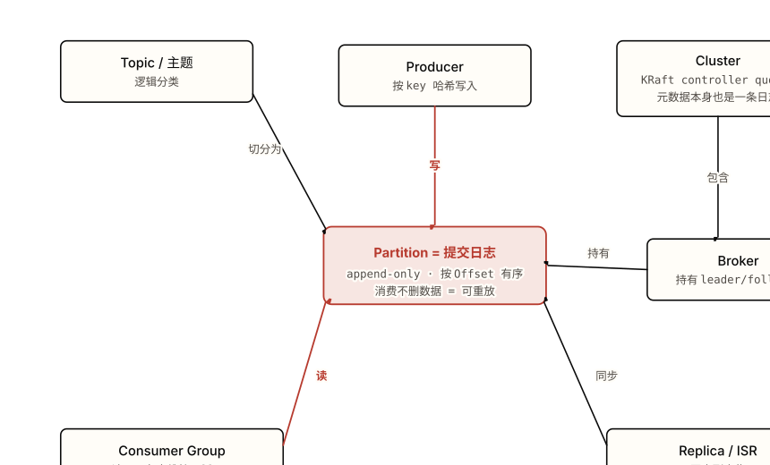

*图 0.1 Kafka 的概念全貌：六个角色环绕同一条分区日志。 **注意**：三件事——① 中心是"日志"不是"队列"；② producer 写、consumer 读、replica 同步，都是围绕同一条分区日志在做事；③ offset 在 consumer 这侧，不在 broker。*

<a id="ch00-paths"></a>

### 07 学习路径建议

顶部的 breadcrumb 是完整的线性顺序。不必每章都读——按目标挑路径：

- **只想吃透原理、应付面试** → [01 概念](#chapter-01) → [02 原理](#chapter-02) → [06 自测](#chapter-06)。把心智模型和设计取舍立起来，再用题库逼自己开口推导。
- **要动手搭系统** → 01 → 02 → [03 实操](#chapter-03) → [04 陷阱](#chapter-04) → [05 综合](#chapter-05)。从概念到代码到生产失败模式，最后用电商订单系统串起来。
- **带读别人的 Kafka 代码** → 01 → 02 → [04 陷阱](#chapter-04)。先有词汇表和原理，再带着"这段代码会在哪种故障下出问题"的眼光去读 review。

<a id="ch00-toc"></a>

### 08 目录

<a id="ch00-next-topics"></a>

### 09 学完之后

这套教程把"分区日志"这个 schema 立稳。下一步的五个主题，各自在这个 schema 上加一层：

- **Kafka Streams**——在日志之上加一套有状态流处理：把 topic 当输入流、本地状态存储当物化视图（KTable 就是 compaction 日志的内存投影）。[→ 本仓库 Kafka Streams 子教程](https://zhiwenliang.github.io/learning/kafka-streams/index.html)
- **Kafka Connect**——在日志的两端加标准化的进出管道：source / sink 连接器，让"日志 ↔ 外部系统"不用每次手写 producer/consumer。[→ 本仓库 Kafka Connect 子教程](https://zhiwenliang.github.io/learning/kafka-connect/index.html)
- **Schema Registry**——在写入日志的字节之上加一层契约：用版本化 schema 管住序列化格式，挡住 04 章那种"不兼容变更卡死消费者"。
- **share group 队列语义深入**——在同一条日志上加按记录 ack 的队列视图（KIP-932），看它如何在不破坏日志模型的前提下摘掉"消费者数 ≤ 分区数"这条限制。
- **Pulsar 对比**——换一种把"日志"和"计算 / 存储"解耦的架构：用 BookKeeper 分层存储对照 Kafka 的 broker 本地日志，看清两种设计在弹性与运维上的取舍。

#### 参考资料

- [Apache Kafka 官方文档 · Design 节](https://kafka.apache.org/documentation/#design)（官方）——存储模型、副本、投递语义的一手说明。
- [Jay Kreps — The Log: What every software engineer should know](https://engineering.linkedin.com/distributed-systems/log-what-every-software-engineer-should-know-about-real-time-datas-unifying)（设计文档 / 维护者博客）——"一切皆日志"这条主线的源头。
- [Confluent — Why Replace ZooKeeper with KRaft](https://www.confluent.io/blog/why-replace-zookeeper-with-kafka-raft-the-log-of-all-logs/)（设计文档 / 博客）——元数据为什么也做成一条日志。
- [Hello Interview — Kafka Deep Dive](https://www.hellointerview.com/learn/system-design/deep-dives/kafka)（高质量博客）——面试视角的系统设计串讲与 Kafka vs RabbitMQ 取舍。


---

<a id="chapter-01"></a>

Chapter 01

## 核心概念：把 Kafka 当成一条日志

起点页给出了一句话本质——Kafka 不是消息队列，而是一条分布式、可重放、按分区切分的提交日志（commit log）。这一章把这句话拆成六个互相咬合的概念，让"日志"这个心智模型真正落地，不再是一句口号。

本章你将建立的 schema

- 一条 partition 是 append-only 的日志，每条记录有单调递增的 offset；消费 = 移动游标，读完**不删除**。
- 顺序只在单个 partition 内成立；topic 是逻辑分类，并行度上限 = partition 数。
- offset 归**消费者**维护，不归 broker；不同 consumer group 各读各的同一份日志。
- producer 按 key 哈希选分区；broker 持有 partition 的 leader/follower 副本。

<a id="ch01-why"></a>

### 1.1 为什么需要 Kafka：队列删一次，日志读多次

传统 MQ 把消息当"消费一次就丢"的任务；Kafka 把消息当"写进日志、谁都能重读"的事实。

> **🧠 为什么需要它**
>
> 传统消息队列（RabbitMQ、ActiveMQ 这类）的核心动作是**投递并删除**：一条消息被某个消费者 ack 之后，broker 就把它从队列里移除，消费进度由 broker 记账。这套模型服务于"任务分发"——一封邮件发一次、一笔扣款扣一次。
>
> 但当同一份数据要被多个下游**各自独立**消费时，这个模型就崩了：风控要读订单流、数仓要读订单流、推荐要读订单流，三方进度不同、还会回溯重算。在删除式队列里，要么给每个下游复制一份队列，要么消息删早了导致后来者读不到。没有 Kafka，工程师得自己搭一套"留存原始事件 + 各下游记自己读到哪"的基础设施——而这恰好就是一条带游标的日志。

#### 底层机制（比文档深一层）

这两类系统的分水岭不在"快慢"，而在**谁持有消费进度、消息何时消失**。传统 MQ 把"已读到哪"作为 broker 的内部状态，消息的生命周期绑定在"是否被 ack"上——ack 即删除，进度无法回退。Kafka 反过来：broker 只负责把记录顺序追加进日志、按**时间或大小**（而非"是否被消费"）做保留，消费进度 offset 是消费者自己提交的一个数字。把"进度"从 broker 搬到消费者这一侧，是后面一切特性的总开关：消息不再因被读而消失，于是可重放；多个消费者各存各的 offset，于是同一份数据能被独立消费多次。

> **💡 类比 · 带边界声明**
>
> 传统队列像**取号机的叫号小票**：叫到你，小票作废，下一个人看不到你那张。Kafka 像**报纸的合订本**：今天的报纸印出来摆上架，张三李四都能翻、还能翻回上周。**边界**：报纸合订本会无限堆下去，Kafka 不会——它按保留期（默认 7 天）或容量删旧日志段，过期的报纸会被回收。所以 Kafka 是"有保留窗口的可重放"，不是"永久存储"。

#### 场景走查

一个订单系统每秒产生几千条"订单已创建"事件。用删除式队列：风控消费完一条就被删，数仓再想读同一条已经没了，只能各开一个队列、生产者发三遍。用 Kafka：事件写进 `orders` 这一条日志一次，风控、数仓、推荐三个独立消费组各自维护 offset、各读各的；某天推荐算法改版要重算上周数据，把它的 offset 重置到 7 天前再跑一遍即可——日志还在，重放不需要生产者配合。

**与下一个概念的关系**：把"进度归消费者、读完不删"这件事讲到底，就必须看清这条"日志"在物理上长什么样——它就是下一节的[提交日志模型](#ch01-log-model)。

<a id="ch01-log-model"></a>

### 1.2 提交日志模型：append-only + offset

记录只能追加到日志末尾、永不修改，每条带一个单调递增的 offset；消费就是按 offset 顺序移动一个读游标。

> **🧠 为什么需要它**
>
> "提交日志"不是 Kafka 发明的——数据库的预写日志（WAL）、Raft 的复制日志都是同一个结构：一串只追加、不可改、严格有序的记录。它之所以是分布式系统的地基，是因为**"一串有序且不可变的记录"是世界上最容易被复制、被重放、被多方达成一致的数据结构**。两台机器只要从头到尾按相同顺序回放同一条日志，状态就必然一致。Kafka 把这个结构直接暴露成产品。

#### 底层机制（比文档深一层）

offset 不是"消息 ID"，而是**记录在这条日志里的位置序号**——从 0 开始，每追加一条 +1，分区内永不重复、永不回退。这个设计带来三个直接后果：

- **写入是 O(1) 顺序追加**：永远只往 active 日志段的尾部写，不需要像 B 树那样随机寻址、加锁、再平衡。顺序磁盘 I/O 接近内存速度，这是 Kafka 高吞吐的物理根源（机制细节见 [§2.1 存储](#ch02-storage)）。
- **读取是"从 offset N 开始往后给记录"**：消费者发来一个 offset，broker 从那个位置往后顺序吐数据。读不破坏写、也不互相干扰，因为各消费者只是停在日志不同位置的游标。
- **读完不删**：游标前移不影响日志本身。记录何时消失只取决于保留策略，与"是否被读过"完全解耦。

这正是起点页那句"门槛"心智模型的落点：**消费不是出队（dequeue），是移动游标（seek）**。一旦接受这一点，"为什么消息读完还在""为什么能从头重放""为什么 offset 在消费者手里"就不再是需要单独记忆的知识点，而是同一个结构的必然推论。

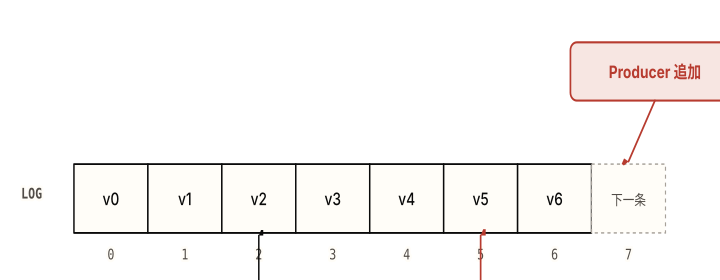

*图 1.1 同一条日志，producer 在尾部追加，两个消费组的游标各停一处。 **注意**：组 A 已读到 5、组 B 才到 2，但 0–4 号记录**仍在日志里**——offset 是消费者各自的游标，不是"已删除到哪"。*

> **💡 类比 · 带边界声明**
>
> 日志像**账本**：只在最后一页往下记，写错了不能擦，只能再记一笔冲正。offset 像页码加行号，"读到第几行"是每个读者自己拿书签夹着的。**边界**：账本不会被删，Kafka 日志会按保留期截断——书签所指的那一行一旦超过保留期就被撕掉（消费滞后超过保留期即丢数据，是 [04 章](#ch04-data-loss)的一类失败模式）。

#### 场景走查

消费者 poll 一批记录、处理完、把 offset 5 提交到 broker；进程崩溃重启后，它向 broker 要"从 offset 5 之后的记录"，于是从 6 继续，不重不漏。如果它在崩溃前**没来得及提交** offset，重启会从上次提交的位置（比如 3）重新拉，4、5 被**重复处理**——这把"提交时机"变成正确性问题，留到 [04 章](#ch04-correctness)展开。

> **🤔 想一想**
>
> 两个不同的 consumer group 读同一个 topic。组 A 已经读到 offset 100，组 B 才读到 offset 10。组 B 会因为"落后"而漏掉中间的消息吗？
>
> <details>
> <summary>展开答案（先停 10 秒再点）</summary>
>
> 不会。offset 是**每个组各自维护**的游标，互不影响。组 A 读到 100 不会"消耗"掉记录——11 到 100 号记录全都还在日志里（只要没超过保留期），组 B 会照常从 11 一路读下去。
>
> 这道题指向的设计要点：删除式队列里"别人读了你就没了"，而 Kafka 里读取只是移动自己的游标，**多个消费组天然隔离**。这正是"日志而非队列"带来的、最反直觉也最有用的一条性质。
>
> </details>

**与下一个概念的关系**：到这里"日志"还是一条。但单条日志只有一个写入点、无法水平扩展。下一节看 Kafka 怎么把一条逻辑日志切成多条物理日志——这就是 [topic / partition / offset](#ch01-topic-partition-offset)。

<a id="ch01-topic-partition-offset"></a>

### 1.3 Topic / Partition / Offset：顺序只在分区内

topic 是逻辑分类，物理上切成 N 个 partition，每个 partition 是一条独立有序的日志，offset 是分区内的位置。

> **🧠 为什么需要它**
>
> 如果一个 topic 只有一条日志，那它只有一个写入尾部、一个读取序列——吞吐被单机磁盘和单消费者卡死，无法水平扩展。partition 是 Kafka 的解法：把一个 topic 切成多条并列的日志，分散到不同 broker 上，写入和消费就能并行。**partition 是顺序和并行的共同单位**——这一句要记牢，后面的取舍全从它来。

#### 底层机制（比文档深一层）

关键的、面试最爱考的一点：**Kafka 只保证单个 partition 内有序，不保证 topic 全局有序**。原因是物理的——全局有序需要一个单一写入点把所有记录串成一条序列，那就等于退回单分区、放弃了扩展性。所以 offset 是**分区内**的位置序号：partition 0 有它自己的 0,1,2…，partition 1 也有自己的 0,1,2…，两个分区的"offset 5"毫无关系。一条记录的完整坐标是 `(topic, partition, offset)` 三元组，而不是单个 offset。

这意味着：需要保证先后顺序的记录（比如同一个订单的"创建→支付→发货"）必须落进**同一个 partition**，否则它们分散在不同分区、消费端无法保证读到的先后。怎么让它们落同一分区？靠 key——这是 [§1.4](#ch01-producer-consumer) 的事。

> **💡 类比 · 带边界声明**
>
> topic 像**一条高速公路**，partition 像这条路上的**多条车道**：同一车道内车辆前后有序，但你不能断言"3 号车道的第 5 辆车"比"1 号车道的第 5 辆车"先出发。**边界**：真实车道之间可以变道，Kafka 的记录一旦按 key 进了某条 partition 就**不会跨分区移动**；而且 partition 数只能增不能减，加分区还会打乱已有的 key→分区映射（代价见 [§2.2](#ch02-partition-order)）。

#### 场景走查

`orders` topic 切成 4 个 partition。生产者用 `orderId` 作 key，于是 `order-42` 的所有事件（创建、支付、发货）都哈希到同一个 partition，消费端读这个分区时它们必然按写入顺序到达。而 `order-42` 和 `order-99` 可能落在不同分区——它们之间没有顺序保证，这通常也无所谓，因为两笔订单本就互不相关。"只在需要顺序的范围内保证顺序"是 Kafka 的核心权衡。

**与下一个概念的关系**：分区解决了"日志怎么切"，但还没说"谁来写、谁来读、怎么把 N 个分区分给多个消费者并行处理"。这是 [producer / consumer / consumer group](#ch01-producer-consumer)。

<a id="ch01-producer-consumer"></a>

### 1.4 Producer / Consumer / Consumer Group：并行单位 = 分区数

producer 按 key 选分区写入；一个 consumer group 内每个 partition 只分给一个 consumer；不同 group 各自独立消费同一份数据。

> **🧠 为什么需要它**
>
> 有了多个 partition，就需要一种机制把它们分配给多个消费进程并行处理，同时还得保证"同一分区不被组内两个消费者同时读"——否则分区内的顺序保证就被两个消费者撕碎了。consumer group 就是这个分配机制：组内成员瓜分分区，组间互不干扰。它让"扩消费能力"变成"往组里加消费者"这么简单——但有个硬上限。

#### 底层机制（比文档深一层）

分配的铁律：**一个 partition 在同一时刻只能被同一个 consumer group 里的一个 consumer 消费**。由此推出 Kafka 并行度的硬上限——**一个组的有效并行度 = partition 数**。组里消费者比分区多，多出来的就空闲拿不到分区；比分区少，则有消费者要扛多个分区。这是规划分区数时第一个要算的约束。

"谁拿哪个分区"由一个叫**再平衡（rebalance）**的过程决定：成员加入/退出时重新分配分区。再平衡的代价、协议演进（eager 急切式 vs cooperative 协作增量式）是 [§2.4](#ch02-rebalance) 的重头戏，这里只需知道它存在、它在成员变动时触发。另一条正交的线：**不同的 consumer group 读同一个 topic 完全独立**——各存各的 offset、各按各的进度，互不影响（图 1.1 已画过两个组停在不同 offset）。

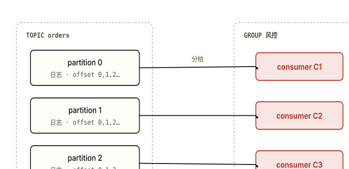

*图 1.2 组内每个 partition 恰好连一个 consumer。 **注意**：连线是**一对一**——这正是"并行度 = 分区数"的来源。再加第 4 个消费者进这个组，它会拿不到分区而空闲。*

#### 一个 ProducerRecord 长什么样

生产者发出去的不是一个裸字符串，而是一个带 key 的 `ProducerRecord`。key 决定它落进哪个分区——这是把"需要顺序的记录"钉在同一分区的方式：

**ProducerRecord 锚点片段**

```Java
// 第 1 个参数 = topic，第 2 个 = key，第 3 个 = value
// key = orderId：同一订单的所有事件哈希到同一 partition，于是有序
var record = new ProducerRecord<>("orders", order.getId(), order.toJson());
producer.send(record);   // 异步追加到该 key 对应 partition 的日志尾部
```

> **📌 key**
>
> 不是数据库主键，而是
>
> 路由依据
>
> ：相同 key → 相同 partition → 同一条日志 → 有序。key 传
>
> null
>
> 时记录在分区间均摊（见
>
> §1.6
>
> ），就失去按 key 的顺序保证。

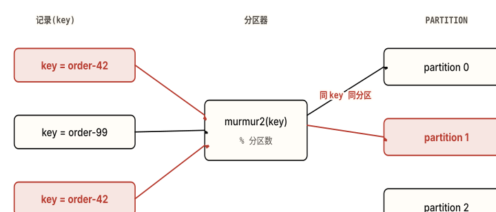

*图 1.3 key 经 murmur2 哈希取模选定分区。 **注意**：两条 `order-42`（朱红）无论何时发，都落进**同一个 partition 1**——这就是"相同 key → 同分区 → 有序"的来源；key 不同（order-99）则可能落到别的分区。*

#### 消费侧的 poll 循环长什么样

消费者不是被 broker"推"消息，而是自己**循环 poll（拉）**。这把消费节奏的控制权交给消费者，是它能管自己 offset 的前提：

**consumer poll 锚点片段**

```Java
consumer.subscribe(List.of("orders"));   // 加入消费组，由再平衡分到若干 partition
while (running) {
    var records = consumer.poll(Duration.ofMillis(500));  // 主动拉一批
    for (var r : records) {
        handle(r.value());                // 处理记录
    }
    consumer.commitSync();                // 处理完再提交 offset（先处理后提交 = 至少一次）
}
```

> **📌 poll · commitSync**
>
> 既拉数据也"证明存活"——长时间不调 poll 会被判死并触发再平衡（
>
> 04 章
>
> 的再平衡风暴）。
>
> 放在处理之后，决定了投递语义；放处理之前会把失败模式从"重复"翻成"丢失"（
>
> §2.5
>
> ）。

> **🤔 想一想**
>
> 一个 topic 有 4 个 partition。你给同一个 consumer group 启动了 6 个 consumer。会发生什么？
>
> <details>
> <summary>展开答案（先停 10 秒再点）</summary>
>
> 4 个 consumer 各分到 1 个 partition，**剩下 2 个 consumer 完全空闲**，一条记录都拿不到。因为"一个 partition 同一时刻只能给组内一个 consumer"，组的并行度被 partition 数**顶死在 4**，加再多消费者也不会提升吞吐。
>
> 设计要点：扩消费能力的前提是分区数足够。这也解释了一个反直觉现象——盲目加消费者不仅无效，每次加入还触发一次再平衡，反而可能让 lag 变大（[04 章](#ch04-performance)）。规划分区数时，先想清楚目标消费并行度。
>
> </details>

**与下一个概念的关系**：producer 和 consumer 都在跟"partition"打交道，但 partition 的副本到底存在哪台机器上、读写打到哪个副本？这是 [broker / cluster / replica](#ch01-broker-replica)。

<a id="ch01-broker-replica"></a>

### 1.5 Broker / Cluster / Replica：日志被复制到多台机器

broker 是 Kafka 服务进程，一个 partition 有 1 个 leader + 若干 follower 副本，分布在不同 broker 上。

> **🧠 为什么需要它**
>
> partition 是一条日志，落在某台 broker 的磁盘上。如果只存一份，这台机器一挂，这个分区的数据就没了、也读不了。replica（副本）就是把同一条 partition 日志在**多台 broker** 上各存一份，让单机故障不导致数据丢失或分区不可用。一组 broker 协同工作就是一个 cluster（集群）。

#### 底层机制（比文档深一层）

同一个 partition 的多个副本里，有且只有一个是 **leader**，其余是 **follower**。机制的关键点：

- **所有读写都只打 leader**，follower 不直接对外服务——它们像消费者一样主动从 leader**拉取（fetch）**新记录，把 leader 的日志复制到自己这里。这保证了所有副本回放的是同一条日志、顺序一致。
- **副本分布在不同 broker 上**，所以一台 broker 宕机时，它上面那些 partition 的 leader 角色会切换到别的 broker 上的 follower，服务继续。
- follower 并非总能跟上 leader。Kafka 用一个叫 **ISR（同步副本集）**的集合追踪"哪些副本目前跟得够紧"，并用 **HW（高水位）**控制消费者能读到哪一条——这两个机制决定了"持久性"和"消费者可见性"的边界，是 [§2.3](#ch02-replication) 的核心，**详见 02 章**，本章不展开。

> **💡 类比 · 带边界声明**
>
> leader/follower 像**一个主记账员 + 几个抄录员**：所有人只把账报给主记账员记，抄录员照着主账本一行行抄一份备份。主记账员请假，立刻从抄录员里指定一个接任。**边界**：现实里抄录员可能抄得比主账本还全，但 Kafka 的 follower**永远不会领先 leader**（它只能拉已写进 leader 的记录）；而且能不能接任、接任会不会丢记录，取决于这个 follower 当时是否在 ISR 里——这正是 02 章要讲的 unclean leader election 风险。

#### 场景走查

`orders` 的 partition 0 配了 3 个副本（replication.factor=3），分别在 broker-1、broker-2、broker-3，leader 在 broker-1。生产者发往 partition 0 的记录都写到 broker-1，broker-2/3 上的 follower 持续 fetch 跟上。broker-1 突然宕机：集群从 broker-2/3 的 follower 里选一个当新 leader，生产和消费切到新 leader 继续——读者侧几乎无感。这就是副本机制：**它复制的不是别的，正是那条 partition 日志**。

**与下一个概念的关系**：从宏观（集群、副本）回到微观——日志里那一条"记录"本身到底由什么组成？key 除了路由还管什么？这是最后一个概念 [Record](#ch01-record)。

<a id="ch01-record"></a>

### 1.6 Record：key / value / headers / timestamp

日志里的一条记录由 key、value、headers、timestamp 组成；key 同时决定分区路由与 compaction 行为。

> **🧠 为什么需要它**
>
> 前面五节都在说"记录"，这一节把它拆开。把 record 理解成"只是个 value"会错过 Kafka 最巧的一处设计：key 不是可有可无的标签，而是同时控制**两个**关键行为——它落哪个分区、以及在日志压缩里它代表"哪个实体的最新状态"。

#### 底层机制（比文档深一层）

一条 record 的四个部分：

- **value**：消息体本身（订单 JSON、事件 payload）。
- **key**：路由依据。有 key → murmur2 哈希到固定分区，相同 key 永远同分区（顺序保证的来源）；key 为 `null` → 由 sticky partitioner 在分区间均摊（机制见 [§2.2](#ch02-partition-order)）。
- **headers**：键值对元数据（如 trace-id、schema 版本、来源系统），不影响路由，供消费端按需读取。
- **timestamp**：记录的时间戳（生产时间或日志追加时间），是按时间检索、按时间保留的依据。

key 的第二重身份在**日志压缩（log compaction）**里：开启压缩的 topic 会对每个 key 只保留**最新**那条 value，旧值被回收；发一条 value 为 `null` 的记录（称为 **tombstone 墓碑**）则表示"这个 key 删除了"。于是一个压缩 topic 就成了"每个 key 的最新状态"的快照——这是 Kafka 能给一张表当 changelog、能存消费组 offset 的底层原理。压缩的具体机制（何时触发、tombstone 何时清）留给 [§2.1](#ch02-storage)。

> **💡 类比 · 带边界声明**
>
> 普通 topic 像**流水账**（每笔都留），压缩 topic 像**余额表**（每个账户只留最新余额）——而决定"同一个账户"的正是 key。**边界**：压缩是**最终**去重，不是即时——旧值会在后台清理触发前一直存在，tombstone 也有保留窗口。所以不能假设"写了新值旧值马上消失"（细节见 02 章）。

#### 场景走查

用户资料 topic 以 `userId` 为 key、开启 compaction。用户改了三次昵称，日志里一度有三条记录；压缩后只剩最新那条。新启动的服务从头读这个 topic，就能重建"每个用户的当前资料"全量快照，不必读完整个历史。注销用户时发一条 `userId` + `null` 的 tombstone，压缩后这个 key 彻底消失。**同一个 key 既决定路由、又定义"同一实体"**——这就是 key 的双重身份。

<a id="ch01-self-check"></a>

### § 本章 self-check

先合上教程，把你能想到的答案写在纸上或编辑器里。 写完再点开答案对照——直接点开等于把这一节当再读一遍。

1. 用一句话说清 Kafka 的"消费"和传统消息队列的"消费"在**消息生命周期**上的根本区别。
2. offset 是全局唯一的吗？一条记录的完整坐标由哪几部分组成？为什么 Kafka 不保证 topic 全局有序？
3. 一个 consumer group 的最大有效并行度由什么决定？为什么往组里无限加 consumer 不能无限提升吞吐？
4. （设计题）你要设计一个 topic，承载"用户余额变更"事件，要求：① 同一用户的变更严格有序；② 新服务启动时能快速重建每个用户的**当前**余额，不必回放全部历史。你会怎么选 key？topic 用普通保留还是开 compaction？为什么？

<details>
<summary>答案（先做完再展开）</summary>

1. 传统队列：消息被 ack 后**从 broker 删除**，消费进度由 broker 记账，读完即消失、不可重放。Kafka：消息追加进日志后按时间/大小保留、**不因被读而删除**，消费只是移动消费者自己维护的 offset 游标，因此可被多个消费组独立重读。
2. 不是全局唯一。offset 只在**单个 partition 内**单调递增，完整坐标是 `(topic, partition, offset)` 三元组。不保证全局有序是因为全局有序需要单一写入点串行化所有记录，等于退回单分区、放弃水平扩展——Kafka 选择"只在分区内有序"换取扩展性。
3. 由该 topic 的 **partition 数**决定。因为一个 partition 在同一时刻只能被组内一个 consumer 消费，consumer 数超过 partition 数时多出来的只能空闲，所以并行度顶死在分区数；加 consumer 还会触发再平衡，可能适得其反。
4. key 选 `userId`——保证同一用户所有变更哈希到同一 partition，从而分区内有序（满足 ①）。topic 开 **compaction（日志压缩）**——每个 userId 只保留最新一条 value，新服务从头读即可重建"每个用户当前余额"的快照，无需回放全部历史（满足 ②）。注销用户用 `userId` + `null` 的 tombstone 删除。这道题的判别点：需要"按实体最新状态"时用 compaction（changelog 语义），需要完整事件流时用普通时间保留——两者由 topic 配置区分，且都依赖 key 定义"同一实体"。

</details>

> **🎯 进阶挑战 · 刚好够不着**
>
> #### 如果业务要求"全局严格顺序"，分区数该怎么定？
>
> 设想一个场景：一个审计系统要求**整个 topic** 的所有事件都严格按写入先后被消费，不允许任何两条记录乱序（不是按 key，是全局）。结合本章"顺序只在 partition 内"和"并行度 = 分区数"两条事实，推一推：这个 topic 的分区数只能是多少？它会牺牲掉 Kafka 的什么能力？如果业务量大到单分区扛不住，这个"全局严格顺序"的需求本身是不是哪里有问题？
>
> <details>
> <summary>提示（卡住再展开）</summary>
>
> 全局有序 ⇒ 只能有**一条**有序日志 ⇒ 分区数只能是 **1**。代价：消费并行度被锁死为 1（一个组只有一个 consumer 干活）、吞吐被单分区单机顶死，Kafka 的水平扩展全部失效。这通常是个信号——"真的需要全局顺序，还是只需要按某个 key 的顺序？"把全局顺序拆成按 key 的顺序，往往是更对的设计。这个取舍正是 [§2.2 分区与顺序](#ch02-partition-order)的核心，02 章会算这笔账。
>
> </details>

#### 本章参考

- [Apache Kafka 官方文档 · Introduction](https://kafka.apache.org/documentation/#intro)（官方）
- [Jay Kreps — The Log: What every software engineer should know about real-time data's unifying abstraction](https://engineering.linkedin.com/distributed-systems/log-what-every-software-engineer-should-know-about-real-time-datas-unifying)（设计思想原文，"把一切当日志"的源头）


---

<a id="chapter-02"></a>

Chapter 02

## 原理与设计取舍

上一章把 Kafka 框成[一条按分区切分、可重放的提交日志](#ch01-log-model)，给了一套能用来描述系统的词汇——topic / partition / offset / leader / follower / consumer group。这章把那条日志拆开：它在磁盘上**怎么存**、在副本之间**怎么复制**、被消费组**怎么读**、跨重启与失败**怎么保证语义**。每个机制都配一张备选方案对比表——记住"为什么不选另一条路"，比记住"选了什么"更经得起面试官追问。

本章你将建立的 schema

- 日志为什么快：append-only + segment 索引 + page cache + 零拷贝，以及它们各自的失效边界
- 顺序与并行同一个单位：partition——key 哈希定分区、sticky 批处理、并行度上限
- 持久性的真实来源：LEO / HW / ISR 三者关系，以及"`acks=all` 不等于所有副本"
- 再平衡的三代协议：eager → cooperative → KIP-848，以及"心跳活着也会被判死"
- 投递语义的真实边界：幂等 producer、事务、EOS 只在 Kafka 闭环内、只在同会话同分区成立
- 元数据也是一条日志：KRaft 用 Raft 复制 `__cluster_metadata`，取代 ZooKeeper

============================== 整体架构图 ==============================

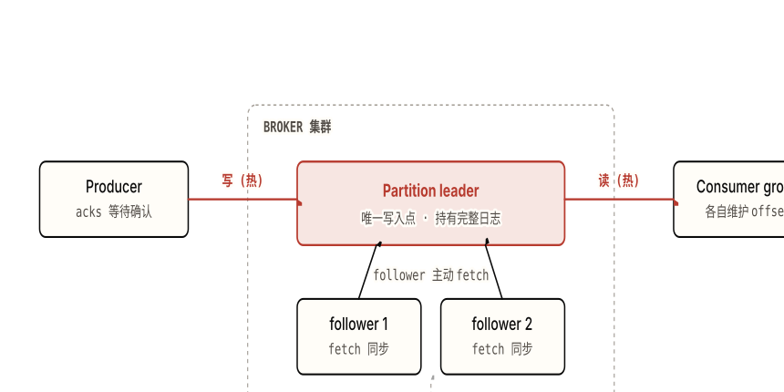

*图 2.0 Kafka 运行时的四股数据流，挂在同一条分区日志上。 **注意**：朱红是热路径（producer 写 leader、consumer 读 leader），follower 是**自己主动 fetch**（箭头指向 leader，不是 leader 推送），KRaft 用虚线管元数据——它不在消息热路径上。*

这张图是本章的地图。后面六节各放大其中一块：[§2.1 存储](#ch02-storage)看 leader 那条日志在磁盘上长什么样；[§2.2 分区与顺序](#ch02-partition-order)看一条 topic 为什么要切成多个 partition；[§2.3 副本与 ISR](#ch02-replication)看 follower 的 fetch 如何决定"哪些数据对 consumer 可见";[§2.4 消费组与再平衡](#ch02-rebalance)看右边那个 consumer group 内部怎么分配分区；[§2.5 投递语义](#ch02-delivery)看一条记录从写到读"恰好一次"到底意味着什么；[§2.6 KRaft](#ch02-kraft)看底部那条元数据日志。

============================================================ §2.1 存储原理 ============================================================

<a id="ch02-storage"></a>

### 2.1 存储原理：日志为什么快

每个 partition 是一个 append-only 文件序列，切成定长 segment、配稀疏索引，靠操作系统 page cache 和零拷贝把磁盘的顺序 I/O 跑到接近内存的速度。

#### 运行方式

一个 partition 在磁盘上不是一个大文件，而是一串**segment**（日志段，由 `log.segment.bytes` 控制大小，默认 1GB）。任何时刻只有最后一个 active segment 在被追加写；写满就滚动出新的一个，旧的变成只读。每个 segment 旁边配两个索引文件：`.index` 把 offset 映射到该 segment 内的字节位置，`.timeindex` 把时间戳映射到 offset。两个索引都是**稀疏**的（不是每条记录都建索引，而是每隔几 KB 建一条），所以查一条记录是先二分索引定位到附近、再顺序扫一小段——O(log N) 定位而不是全文件扫描。

关键在于读写都是**顺序 I/O**：写永远是追加到文件末尾，读是从某个 offset 起连续往后。Kafka **不在 JVM 进程内缓存消息**，而是直接依赖操作系统的 **page cache**——写入的数据先进 page cache（由 OS 异步刷盘），消费者读最近的数据时几乎总是直接命中 page cache，根本不碰磁盘。消费者读取走**零拷贝**（`sendfile` / `FileChannel.transferTo()`）：数据从 page cache 直接进网卡缓冲区，**不经过 JVM 用户态**——省掉了 "内核态→用户态→内核态" 的两次拷贝和上下文切换。

**partition 目录结构**

```bash
# topic "orders" 的分区 0 在 broker 数据目录下：
$ ls -lh /var/kafka-logs/orders-0/
00000000000000000000.log        # segment：实际记录（base offset = 0）
00000000000000000000.index      # 稀疏 offset→字节位置 索引
00000000000000000000.timeindex  # 稀疏 时间戳→offset 索引
00000000000000368912.log        # 下一个 segment，base offset = 368912
00000000000000368912.index
00000000000000368912.timeindex
leader-epoch-checkpoint         # leader 任期记录（截断时用，见 §2.3）

# 文件名 = 该 segment 第一条记录的 offset（base offset）。
# 查 offset 400000：文件名二分 → 落在 368912.log → .index 二分定位到附近字节 → 顺序扫到 400000。
```

保留策略有两种。默认是**按时间/大小删整段**（`retention.ms` / `retention.bytes`，到期把最旧的 segment 整个删掉）。另一种是 **log compaction**（日志压缩）：对每个 key 只保留最新一条 value，老版本被清理——把 topic 变成一份"可恢复的状态快照"。写一条 value 为 `null` 的记录叫 **tombstone**（墓碑），表示"这个 key 被删除"，compaction 在保留窗口后把该 key 连同墓碑一起清掉。`__consumer_offsets`（消费位移）和 Kafka Streams 的 changelog 就是靠 compaction 实现的——这也是[第 1 章"日志可重放"](#ch01-log-model)能延伸成"日志可作状态存储"的机制。

#### 备选方案对比

**表 2.1a · 消息缓存放哪里**

| 方案 | 优势 | 为什么没选 |
| --- | --- | --- |
| JVM 堆内缓存（进程内对象池） | 访问对象零序列化、命中即返回 | 与 OS page cache **双份缓冲**（同一份数据存两遍）；几十 GB 缓存进堆会制造灾难性 GC 停顿；进程一重启缓存全冷 |
| 堆外 + 自管缓存（off-heap 自己淘汰） | 绕开 GC、可控大小 | 等于重写一个比 OS 还差的 page cache；故障/重启仍丢缓存；复杂度全压给应用 |
| OS page cache（不在进程内缓存） | 无 GC 压力、32GB 机器约 28-30GB 可用作缓存、进程重启缓存仍在内核、零拷贝可直接从它发网卡 | 选中 |

**表 2.1b · 磁盘上的数据结构**

| 方案 | 优势 | 为什么没选 |
| --- | --- | --- |
| B-Tree / LSM（数据库式索引） | 支持任意 key 随机读写、范围查询 | 写要随机寻道 + 页分裂 + 加锁，O(log N) 且放大写；Kafka 根本不需要"按任意 key 改某条记录"，只需要"按 offset 顺序追加和顺序读" |
| 每条消息一个文件 | 删除单条简单 | 海量小文件耗尽 inode 和文件句柄；丢失顺序 I/O 的全部好处 |
| append-only 日志 + 稀疏索引 + 定长 segment | 追加 O(1)、顺序磁盘 I/O 接近内存带宽、删除按段 O(1)、稀疏索引省内存 | 选中 |

> **🧠 为什么这么设计**
>
> 顺序磁盘 I/O 的吞吐接近内存、**远高于随机 I/O**（机械盘上差几个数量级，SSD 上也有明显差距）。进程内缓存会与 page cache 重复存储、还加重 GC，所以把缓存这件事整个交给 OS。append-only 追加是 O(1)，对比 B-Tree 的 O(log N) 随机寻道加锁。compaction 让一个 topic 能当 changelog / 状态快照用，而不只是消息管道。

#### 带来的代价 / 失效模式

> **⚠️ 代价**
>
> **① TLS 绕过零拷贝。**`sendfile` 要求内核能直接把文件字节送上网卡。一旦开启传输加密（broker 间或 client-broker TLS），数据必须先进用户态加密再发出——零拷贝失效，CPU 和延迟都上升。这是"开了 TLS 吞吐就掉一截"的根因。
>
> **② 冷读污染 page cache。**page cache 的前提是"消费者读的就是刚写的热数据"。一个严重滞后的消费者去读几小时前的旧数据，会把磁盘上的冷 segment 拉进 page cache，**挤掉**正在服务热生产者的页——一个掉队的消费者能拖慢整个 broker。Tiered Storage（KIP-405，3.9 GA）把冷数据下沉到对象存储正是为缓解这点。
>
> **③ compaction 是最终去重，不是即时。**compaction 只在脏数据比例超过 `min.cleanable.dirty.ratio`（默认 0.5）时才触发；tombstone 在 `delete.retention.ms` 内仍然存在以便下游消费者看到删除。所以"写了新值老值就没了""写了墓碑 key 立刻消失"都是错的——是最终一致的去重。

> **🤔 想一想**
>
> 你给一个 topic 开了 TLS、又有一个消费者从 `offset 0` 全量重刷历史数据。这两件事各自怎么影响 broker 的吞吐？它们打击的是同一个机制吗？
>
> <details>
> <summary>展开答案（先停 10 秒再点）</summary>
>
> 打击的是**两个不同机制**。TLS 关掉的是**零拷贝**：数据被迫走用户态加密，CPU 上升、每条消息多两次拷贝。全量重刷打击的是 **page cache 命中率**：从 offset 0 读的全是冷 segment，把热生产者的页挤出缓存，命中率暴跌、磁盘随机读上升。
>
> 设计洞察：Kafka 的"快"建立在两个独立假设上——零拷贝（数据不进用户态）+ 热数据局部性（读的就是刚写的）。TLS 破坏前者，滞后消费者破坏后者。理解这两条，就能解释绝大多数"Kafka 突然变慢"的现场。
>
> </details>

============================================================ §2.2 分区与顺序 ============================================================

<a id="ch02-partition-order"></a>

### 2.2 分区与顺序：并行和有序的同一个单位

partition 同时是顺序的单位和并行的单位——同一个 key 永远落同一个 partition（murmur2 哈希）因而有序，不同 partition 之间并行；顺序只在分区内成立。

#### 运行方式

一条记录写到哪个 partition，由 producer 端决定。带 key 时：`partition = murmur2(key) % 分区数`——相同 key 永远算出同一个 partition，因此**同一个 key 的记录在该分区内严格有序**（同一订单的所有事件按写入顺序排好）。不带 key 时，3.0 以后默认用 **sticky partitioner**（KIP-480）：先把一个分区的 batch 填满再换下一个分区，而不是旧的 round-robin 逐条轮询。批越满，每批的固定开销摊得越薄，端到端延迟约减半。

这就是[第 1 章里"顺序只在分区内保证"](#ch01-topic-partition-offset)的机制根源：offset 是*每个分区*独立递增的序号，跨分区没有全局序。消费侧的并行度也由分区数决定——一个 consumer group 里，一个 partition 最多被一个消费者持有，所以消费者数超过分区数就有人闲置（详见 [§2.4](#ch02-rebalance)）。

**表 2.2a · 顺序保证的范围**

| 方案 | 优势 | 为什么没选 |
| --- | --- | --- |
| 全 topic 全局总序（所有消息一条线排序） | 消费者看到的就是绝对时间序，推理最简单 | 全局有序需要**单一写入点**序列化所有写——无法水平扩展，吞吐被一台机器锁死；一个分区杀掉整个并行 |
| 完全不保证顺序（纯负载均衡分发） | 写入和消费都可无限并行 | 无法表达"同一实体的事件有先后"——订单"创建→支付→发货"可能乱序到达，业务无法处理 |
| 每分区有序（按 key 哈希分区） | 顺序廉价（分区内天然有序）、并行度可扩到分区数、同 key 同序满足绝大多数业务 | 选中 |

**表 2.2b · 无 key 时的分区策略**

| 方案 | 优势 | 为什么没选 |
| --- | --- | --- |
| round-robin（逐条轮询分区） | 分区间负载绝对均匀 | 每条记录可能进不同分区的 batch，导致大量半满小批发送——请求数多、吞吐低、延迟高 |
| 随机分区（每条随机选） | 实现简单、长期均匀 | 同样打散 batch，且短期可能不均；没有解决批处理问题 |
| sticky partitioner（KIP-480，先填满再换） | batch 更满 → 请求更少 → 延迟约减半；长期看分区仍大致均匀 | 选中 |

> **🧠 为什么这么设计**
>
> 全局有序与水平扩展是矛盾的：要么有单写入点（不能扩展），要么放弃全局序。Kafka 选择把"有序"的粒度降到分区——业务真正需要的几乎都是"同一实体内有序"（同一用户、同一订单），用 key 哈希就能廉价拿到，同时分区数给了并行的旋钮。sticky 则是在"无序消息"这个子问题上，用牺牲瞬时均匀换批处理效率。

#### 带来的代价 / 失效模式

> **⚠️ 代价**
>
> **① 并行度上限 = 分区数。**一个 consumer group 的消费并行度卡在分区数。分区开少了，加再多消费者也无法提速（多出来的消费者空转）；分区开多了，抬高 controller 元数据负担、故障切换时间、文件句柄消耗（每 segment 占 2 个文件，默认 ulimit 1024 很容易触顶）。
>
> **② 加分区会永久打乱 key 顺序。**分区数**只能加不能减**。而一旦给带 key 的 topic 加分区，`murmur2(key) % 新分区数` 的结果变了——同一个 key 的新记录可能落到与历史记录不同的分区，**跨分区的全局顺序无从保证**，所有依赖按 key 顺序的下游消费者被静默破坏。要扩容只能保守预估，或新建 topic 迁移。
>
> **③ 热 key 倾斜压垮单分区。**哈希只保证 key 均匀，不保证*流量*均匀。若 90% 流量集中在少数 key（如按租户分区而某个大租户占大头），这些 key 全挤进同一个分区，该分区的 leader 和它的消费者被打爆，其余分区闲置。Kafka 不会自动均衡倾斜——只能选高基数的 key（用 orderId 而不是 userId）。

> **🤔 想一想**
>
> 一个有 6 个分区、按 `userId` 分区的 topic，运行半年后为了扩容把分区加到 12 个。下游有个消费者依赖"同一用户的操作严格有序"。它会立刻报错吗？如果不报错，问题什么时候暴露？
>
> <details>
> <summary>展开答案（先停 10 秒再点）</summary>
>
> 不会立刻报错——这正是它危险的地方。加分区是个成功的管理操作，没有任何异常。但从加分区那一刻起，某个 `userId` 的**新**记录算出的分区（`% 12`）可能不同于它**历史**记录所在的分区（`% 6`）。于是同一用户的事件流被劈到两个分区，两个分区由不同消费者并行消费，先后顺序彻底丢失。
>
> 问题在"恰好某个用户的新旧事件被并发处理、且顺序敏感"时才暴露——可能是几天后一次诡异的状态错乱，而且极难复现。所以 ctx 里把它列为"静默破坏"：没有报错的破坏最贵。生产上对有 key 且顺序敏感的 topic，要么一开始就把分区数开够，要么新建 topic 做带迁移的切换。
>
> </details>

============================================================ §2.3 副本与 ISR ============================================================

<a id="ch02-replication"></a>

### 2.3 副本与 ISR：持久性的真实来源

每个分区一个 leader 加若干 follower，follower 像消费者一样主动 fetch；HW（高水位）= ISR 中最小的 LEO，消费者只能读到 HW——已 ack 的记录未必立刻可见，而持久性来自 `min.insync.replicas` 不是 `acks`。

#### 运行方式

每个分区有一个 leader 副本和若干 follower 副本。所有读写都走 leader；follower **主动向 leader fetch**（和普通消费者用同一套 fetch 机制，只是 fetch 的是分区日志去复制）。两个关键水位：

- **LEO（Log End Offset）**：某个副本*下一条*要写入的 offset，也就是它当前日志的末尾。leader 的 LEO 总是最靠前，follower 的 LEO 落在后面（差着 fetch 的延迟）。
- **HW（High Watermark，高水位）**：**ISR 集合里所有副本 LEO 的最小值**，即"已经被所有同步副本完整复制到的最高 offset"。

**消费者只能读到 ≤ HW 的记录。**HW 之上、leader 已写但还没被所有 ISR 复制完的那段，对消费者不可见——因为那段一旦 leader 故障、由某个 follower 顶上，可能会消失。HW 这道门控保证消费者读到的都是"即使现在 leader 挂了也不会丢"的记录。

**ISR（In-Sync Replicas，同步副本集）**是当前跟得上 leader 的副本集合（含 leader 本身）。某个 follower 若超过 `replica.lag.time.max.ms`（默认 30s）没追上 leader 的末尾，就被踢出 ISR；追上后再加回来。ISR 是**动态可变**的——这是理解后面所有失效模式的关键。

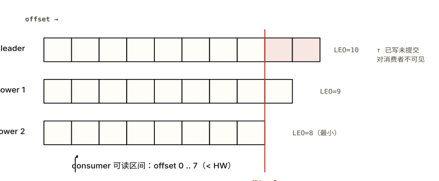

*图 2.1 HW 由 ISR 中**最慢**的副本（follower 2，LEO=8）决定，消费者只能读到 HW 左侧。 **注意**：leader 上 offset 8、9 这两格（朱红）已经写入并可能已经 ack 给 producer，但因为还没被所有 ISR 复制完，对消费者**不可见**——这就是"已 ack ≠ 已可见"，HW 永远滞后 leader 一个 fetch 轮。*

#### acks 与 min.insync.replicas 的真实关系

producer 的 `acks` 决定"写入要等到什么程度才算成功":

- `acks=0`：发出去就算成功，不等任何确认——最快，leader 没写成也不知道，丢数据风险最高。
- `acks=1`：leader 写入本地日志就 ack——leader 写完、还没被任何 follower 复制就宕机，那些已 ack 的记录**永久丢失**。
- `acks=all`（即 `acks=-1`）：等到**当前 ISR 里所有副本**都复制完才 ack。

这里是面试最容易露馅的一点：**`acks=all` 等的是"所有 *ISR* 成员"，不是"所有副本"。**ISR 是会缩的——如果两个 follower 都掉队被踢出 ISR，ISR 只剩 leader 一个，此时 `acks=all` 实际只写到 leader 一台，**悄悄退化成了 `acks=1`**，下一次故障就丢。

真正的持久性闸门是 `min.insync.replicas`：它要求 ISR 至少有这么多成员在线，否则 producer 的写入直接被拒（收到 `NotEnoughReplicas` / `NotEnoughReplicasAfterAppend`）。所以**持久性来自 `min.insync.replicas`，不是 `acks`**——`acks=all` 负责"等所有 ISR"，`min.insync.replicas` 负责"ISR 不许缩到不安全"。两者必须配合：典型生产配置是 `replication.factor=3` + `min.insync.replicas=2` + `acks=all`，含义是"至少 2 个副本拿到才算写成功，否则宁可拒写"。这套组合留到 [§4.1 数据丢失](#ch04-data-loss)里逐条对照。

**表 2.3 · 复制法定集：多数派 quorum vs ISR**

| 方案 | 优势 | 为什么没选（或选中理由） |
| --- | --- | --- |
| 多数派 quorum（Raft/Paxos 式，2f+1 副本容忍 f 故障） | 提交只需多数派，单个慢副本不拖累；成员是否在线靠投票自然处理 | 要容忍 f 个故障需 **2f+1** 个副本（容忍 2 个故障要 5 副本）——存储和带宽成本翻倍多；对"写多读多"的日志太贵 |
| 全副本同步（写必须等全部副本） | 任意 f<RF 故障都不丢，逻辑最简单 | 最慢的那个副本决定写延迟；任何一个副本卡住或宕机就停写，可用性差 |
| ISR 可变法定集（f+1 副本 + 动态 ISR） | 容忍 f 故障只需 **f+1** 副本（容忍 2 个故障只要 3 副本）；掉队副本被移出 ISR 不拖慢写；用 `min.insync.replicas` 显式调持久性/可用性平衡 | 选中（更省副本，代价见下） |

> **🧠 为什么这么设计**
>
> 多数派 quorum 为了"无需等慢副本"付出了 2f+1 的副本成本。Kafka 的洞察是：日志数据量大、副本成本敏感，而它已经有了"踢掉慢副本"的机制（ISR）——所以用 f+1 个副本 + 动态 ISR 就能容忍 f 个故障，省掉将近一半副本。代价是把"持久性 vs 可用性"的旋钮（`min.insync.replicas`、`unclean.leader.election`）交给运维显式决定，而不是协议帮你定死。

#### 带来的代价 / 失效模式

> **⚠️ 代价**
>
> **① HW 滞后一个 fetch 轮。**HW 的推进依赖 follower 下一轮 fetch 上报自己的 LEO。所以一条记录即使已经被所有 ISR 复制、已经 ack 给 producer，consumer 也要再等一个 fetch RTT 才能看到它（如图 2.1）。"已 ack 未必立刻可见"是设计使然，不是 bug。
>
> **② `acks=all` + `min.insync.replicas=2` 在 RF=3 下：挂 1 台仍可写，挂 2 台分区停写。**这是*故意*用可用性换持久性——剩 1 个副本时与其欠复制地写（将来丢），不如拒写让 producer 知道。能不能接受停写，是个业务决策。
>
> **③ unclean leader election 静默丢数据。**若开启 `unclean.leader.election.enable=true`，当 ISR 里的副本全挂、只剩一个*落后的*非 ISR 副本时，Kafka 允许它当 leader 以恢复可用性。但它的日志比之前已提交的短——比如 producer 已 ack 到 offset 100，这个落后副本只到 80，于是 81-100 被**静默截断、永久丢失**。这就是 `leader-epoch-checkpoint` 文件存在的场景：靠 leader 任期来判断哪段日志需要截断。默认值在新版已是 `false`（宁可分区不可用也不丢）。

> **🤔 想一想**
>
> 某 topic 配置 `replication.factor=3`、`acks=all`，但**没有**设 `min.insync.replicas`（用默认值 1）。平时一切正常。某天两个 follower 因网络抖动同时掉出 ISR，运维没注意。这段时间 producer 的写入安全吗？
>
> <details>
> <summary>展开答案（先停 10 秒再点）</summary>
>
> 不安全，而且是看不见的不安全。`min.insync.replicas=1` 意味着 ISR 只剩 leader 一个时仍允许写。两个 follower 掉出 ISR 后，ISR={leader}，此时 `acks=all` 的"all"就是 leader 自己——**每次写实际只落到一台**，等价于 `acks=1`。producer 收到的全是成功 ack，毫无察觉。只要这期间 leader 宕机，这批"成功"的记录全部丢失。
>
> 洞察：`acks=all` 单独配置是**不够**的——它的强度被 ISR 的当前大小绑架。`min.insync.replicas=2` 才能在 ISR 缩到 1 时让写入**被拒**而不是悄悄降级。这正是 §2.3 的核心命题"持久性来自 `min.insync.replicas`"的实战形态，也是 04 章数据丢失类的头号案例。
>
> </details>

============================================================ §2.4 消费组与再平衡 ============================================================

<a id="ch02-rebalance"></a>

### 2.4 消费组与再平衡：分区如何分配，成员如何被判死

broker 端的 group coordinator 通过 JoinGroup/SyncGroup 把分区分给组内消费者；再平衡协议从 eager（全停）演进到 cooperative（只动该动的）再到 KIP-848（broker 端驱动），而成员存活由 `poll()` 证明、不是心跳。

#### 运行方式

每个 consumer group 由 broker 端一个 **group coordinator** 管理。新成员加入或老成员离开时触发**再平衡**，分两步：**JoinGroup**（所有成员向 coordinator 报到，coordinator 选出其中一个当 group leader）→ **SyncGroup**（group leader 在客户端算出"谁拿哪些分区"的分配方案，回传给 coordinator 下发）。注意分配逻辑跑在*客户端*的 group leader 上，broker 不关心用什么策略分——这让分配策略可插拔。

消费位移（offset）提交到内部 topic `__consumer_offsets`（一个 compaction 的 topic，每个 `(group, topic, partition)` 只保留最新 offset）。提交可以自动（`enable.auto.commit`，按 `auto.commit.interval.ms` 定时）或手动（`commitSync()` / `commitAsync()`）。

**成员存活判定有两条独立的线，这是最容易混淆的地方：**

- 后台**心跳线程**按 `heartbeat.interval.ms` 给 coordinator 发心跳，`session.timeout.ms` 内没心跳就判死——这检测的是"进程/网络是否还活着"。
- 但真正证明"消费者还在干活"的是**调用 `poll()`**。两次 `poll()` 间隔超过 `max.poll.interval.ms`（默认 5 分钟），coordinator 判定这个成员**卡死**，把它踢出组触发再平衡——即使它的心跳线程还在后台正常跳。

#### 三代再平衡协议

**eager（急切式）：**每次再平衡，所有成员先**放弃全部**分区（一个 stop-the-world 屏障），等新分配下来再重新认领。简单、分配干净，但再平衡期间**整个组停止消费**。

**cooperative / incremental（协作增量式，2.4+）：**遵循"没必要动的资源不要停"——只**收回需要转移**的那部分分区，没变动的分区**继续消费**；分两轮收敛。

**KIP-848（4.0 GA）：**把再平衡逻辑从客户端**移到 broker 端**，由 coordinator 增量驱动，不再有客户端侧的全局屏障，加入/退出更平滑。经典 eager 协议计划在 5.0 移除。

**static membership（静态成员，KIP-345）：**给消费者配一个固定的 `group.instance.id`。配了之后，成员短暂重启（如滚动发布）能**认领回原来的分区**而不触发再平衡——把"重启"和"成员变更"解耦。

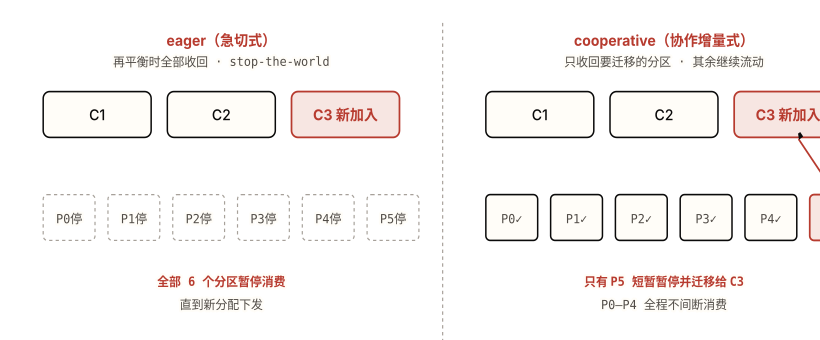

*图 2.2 同样是新增一个消费者 C3，eager 让全部 6 个分区停摆，cooperative 只动 P5。 **注意**：取舍在"屏障的范围"——eager 用全局停顿换取一次性干净分配；cooperative 用两轮收敛和稍复杂的协议，换来"不该停的分区一秒都不停"。大集群里这就是再平衡从十几分钟降到秒级的差别。*

**表 2.4 · 三代再平衡协议**

| 方案 | 优势 | 为什么被取代 / 选中 |
| --- | --- | --- |
| eager（急切式，stop-the-world） | 协议简单、分配干净，一轮收敛 | 每次再平衡**整组暂停**消费；成员越多、分区越多停顿越久（900 任务的组启动要 12-14 分钟）——5.0 将移除 |
| cooperative / incremental（协作增量式，2.4+） | 只收回需迁移的分区，其余继续消费；同样规模启动从十几分钟降到约 60 秒 | 分两轮收敛、协议更复杂，且仍在客户端驱动——被 KIP-848 进一步改进 |
| KIP-848（4.0 GA，broker 端驱动增量） | 再平衡逻辑移到 broker 端、增量推进、无客户端全局屏障；加入/退出最平滑 | 选中（当前方向；旧 eager 5.0 移除） |

> **🧠 为什么这么设计**
>
> eager 的 stop-the-world 屏障保证了分配的简单和正确，但代价随集群规模线性放大——大组的每次扩缩容都是一次全组停顿。cooperative 把原则换成"不动的资源不要停"，用协议复杂度换可用性。KIP-848 再进一步：客户端驱动的协商在大规模下本身就脆弱（客户端版本不一、网络分区），把它收归 broker 端能更可控地增量推进。三代的主线是同一个：**把再平衡的"暂停面"越缩越小**。

#### 带来的代价 / 失效模式

> **⚠️ 代价**
>
> **心跳活着，poll 超时仍被判死 → 重复处理。**这是最反直觉的失效。后台心跳线程和业务处理是两回事：消费者在 `poll()` 之后花了 6 分钟处理这批记录（一个慢的 DB 批写、一次卡住的 HTTP 调用），心跳一直正常跳，但因为超过了 `max.poll.interval.ms`（默认 5 分钟）没有再调 `poll()`，coordinator 已经把它判死、把它的分区分给了别人。等它处理完想提交 offset，发现自己已被踢出组，提交失败；那批记录被新 owner **重复处理**了一遍。
>
> 这是[再平衡风暴](#ch04-performance)的种子：处理慢 → 被踢 → 重新加入 → 又处理慢 → 再被踢，吞吐可以归零。缓解：调小 `max.poll.records`（每次少拿点）、把重活卸到工作线程并用 `pause()`/`resume()`、开启协作式再平衡 + static membership。

> **🤔 想一想**
>
> 有人把 `session.timeout.ms` 调到 5 分钟，理由是"防止消费者因为偶尔的网络抖动被误判死"。处理逻辑每批要跑 8 分钟。会发生什么？调 `session.timeout.ms` 解决得了吗？
>
> <details>
> <summary>展开答案（先停 10 秒再点）</summary>
>
> 解决不了，因为他调错了旋钮。`session.timeout.ms` 管的是**心跳**那条线——进程/网络是否存活。但 8 分钟的处理超时触发的是**另一条线**：`max.poll.interval.ms`（默认 5 分钟）。处理跑 8 分钟没调 `poll()`，不管心跳多正常，到 5 分钟就被判定为"卡死"踢出组。
>
> 正确做法是认清两条线各管什么：要容忍长处理，调大的是 `max.poll.interval.ms`（或减小 `max.poll.records` 让每批处理更快返回 `poll()`），而不是 `session.timeout.ms`。把心跳超时调到 5 分钟反而有害——真宕机的消费者要拖 5 分钟才被发现。理解"存活由 `poll()` 证明、不是心跳"是这道题的全部。
>
> </details>

============================================================ §2.5 投递语义 ============================================================

<a id="ch02-delivery"></a>

### 2.5 投递语义：幂等、事务与 EOS 的真实边界

at-least-once 是默认；幂等 producer 用 (PID, 分区) + 序列号在 broker 端去重并强制保序；事务用 transactional.id + epoch 把"输出写 + offset 提交"做成原子——但 exactly-once 只在 Kafka 闭环内、且幂等只在同一会话同一分区成立。

#### 三种语义的来源

- **at-most-once（至多一次）**：先提交 offset 再处理。处理崩了 offset 已提交，这条不会重投——但也**可能丢**。
- **at-least-once（至少一次，默认）**：先处理再提交 offset。处理完崩在提交前，重启会重投这条——不丢，但**可能重复**。
- **exactly-once（精确一次）**：靠幂等 producer + 事务达成，且只在特定边界内成立（见下）。

#### 幂等 producer：PID + 序列号

开启 `enable.idempotence=true`（4.0 起默认开）后，每个 producer 会话拿到一个 **PID（Producer ID）**。producer 给发出的每条记录按 `(PID, 分区)` 维度打一个单调递增的**序列号**。broker 为每个 `(PID, 分区)` 记住"已接受的最高序列号",只接受序列号**恰好 +1** 的 append：

- 收到重复的序列号（重试导致的重发）→ 直接丢弃，**去重**。这解决"broker 写成功但 ack 在网络上丢了、producer 重发"导致的重复。
- 收到有空洞的序列号（比预期跳号）→ 抛 `OutOfOrderSequenceException`。

因为只接受恰好 +1，幂等 producer **顺便强制了顺序**：它会拒绝乱序到达的 batch，所以同时解决了"`max.in.flight.requests > 1` 时重试导致消息乱序"这个老问题（幂等下 in-flight 可达 5 仍保序）。

#### 事务：transactional.id + epoch + 两阶段提交

幂等只覆盖单个 producer 会话、且只去重不跨"多分区写 + offset 提交"。事务（配 `transactional.id`）补上这两块：

- **跨重启的身份与僵尸隔离**：`transactional.id` 是稳定的（重启不变），每次初始化会把 **epoch** 加一。旧实例（僵尸）带着旧 epoch 再来写会被拒——避免"以为死了其实没死"的旧进程污染数据。
- **原子的"输出 + offset"**：transaction coordinator 跑两阶段提交，给事务涉及的每个分区写一个 **commit / abort marker**。"消费-转换-生产"里，把*下游输出*和*上游 offset 提交*放进同一个事务——要么都成功，要么都回滚，不会出现"输出写了但 offset 没提交"导致的重复。
- **读侧配合**：消费者设 `isolation.level=read_committed` 后，会跳过 aborted 和未决事务的数据，且读取不能越过 **LSO（Last Stable Offset，最后稳定位移）**——即最早的未决事务之前的位置。

**TransactionalProducer.java**

```Java
// "消费 → 转换 → 生产" 的 EOS 闭环：输出写 + 上游 offset 提交在一个事务里
Properties p = new Properties();
p.put("transactional.id", "order-enricher-1");   // 稳定 ID，重启不变 → epoch 隔离僵尸
p.put("enable.idempotence", "true");              // 事务隐含开启幂等
KafkaProducer<String, String> producer = new KafkaProducer<>(p);
producer.initTransactions();                       // 领 PID、把 epoch +1，挤掉僵尸旧实例

while (true) {
    ConsumerRecords<String, String> records = consumer.poll(Duration.ofMillis(200));
    producer.beginTransaction();
    try {
        for (ConsumerRecord<String, String> r : records) {
            producer.send(new ProducerRecord<>("orders-enriched", r.key(), enrich(r.value())));
        }
        // 关键：上游 offset 也写进同一个事务，而不是 consumer.commitSync()
        producer.sendOffsetsToTransaction(offsetsOf(records), consumer.groupMetadata());
        producer.commitTransaction();              // 写 commit marker，原子生效
    } catch (KafkaException e) {
        producer.abortTransaction();               // 写 abort marker，read_committed 端跳过
    }
}
```

**表 2.5 · 达成"不重复"的两条路**

| 方案 | 优势 | 为什么没选 / 选中 |
| --- | --- | --- |
| at-least-once + 消费侧幂等（下游用主键去重 / upsert） | producer/consumer 配置简单、无事务开销；对外部系统（DB）天然适用 | 把去重责任推给每个下游，每个消费者都要自己实现且实现正确；不解决"Kafka 到 Kafka 的多分区原子写" |
| at-most-once（先提交后处理） | 绝不重复、实现最简单 | 用**丢失**换"不重复"——崩在处理前那条就没了，绝大多数业务不可接受 |
| 事务 EOS（幂等 producer + transactional.id + read_committed） | Kafka 闭环内"消费-转换-生产"原子且精确一次；跨会话靠 epoch 存活；服务端去重让客户端简单 | 选中（边界与代价见下） |

> **⚠️ EOS 的真实边界（面试高频）**
>
> **① 幂等只在"同一个 `(PID, 分区)` 且同一 producer 会话"内去重。**producer 一旦崩溃重启，会领到一个**新 PID**，broker 不认识它和旧 PID 的关系——跨重启**不去重**。要跨会话精确一次，必须用事务：`transactional.id` 靠 epoch 跨重启保持身份。所以"开了 `enable.idempotence=true` 就端到端精确一次"是被普遍过度宣称的误解。
>
> **② "exactly-once" 只在 Kafka 的"消费-转换-生产"闭环内成立，不覆盖外部副作用。**事务能保证的是"Kafka 输出 + Kafka offset 提交"这件事原子。但事务里如果还写了数据库、调了 REST、发了邮件——这些外部动作**不在事务范围内**，事务回滚不会撤销它们，重试会再触发一次。要把外部系统也纳入精确一次，得在外部侧做幂等（如带幂等键的 upsert），Kafka 事务本身管不了。

> **🧠 为什么这么设计**
>
> 把去重和隔离做在**服务端**（broker 维护 PID→seq、coordinator 管 marker），客户端就能保持简单——不用每个应用都重写一遍去重逻辑。而事务复用了已有的副本机制（事务日志、marker 都是普通的、被复制的日志记录）来保证自身的持久性，没有另起炉灶。代价是 marker + LSO 带来的延迟与队头阻塞（见下）。

#### 带来的代价 / 失效模式

> **⚠️ 代价**
>
> **① marker + LSO 增加延迟。**每个事务要额外写 commit/abort marker，`read_committed` 消费者要等事务定下来才能越过 LSO 读取——实测约增加 3%（@100ms 提交间隔）的延迟。提交越频繁，marker 开销占比越高。
>
> **② 长事务造成队头阻塞。**`read_committed` 消费者读取不能越过 LSO。一个迟迟不提交的长事务会把 LSO 钉在原地，**卡住该分区所有 `read_committed` 读者**——哪怕后面已经有大量已提交的数据，也读不到。事务要短。

> **🤔 想一想**
>
> 一个服务"从 topic A 消费 → 写一行到 MySQL → 往 topic B 生产",全程用了 Kafka 事务（`sendOffsetsToTransaction` + `commitTransaction`）。开发者声称"现在端到端精确一次了"。MySQL 那行会不会重复？
>
> <details>
> <summary>展开答案（先停 10 秒再点）</summary>
>
> 会重复。Kafka 事务保证的是"**topic B 的输出** + **topic A 的 offset 提交**"这两件 Kafka 内部的事原子。MySQL 的写**不在事务范围内**——它是个外部副作用。设想：写完 MySQL、还没 `commitTransaction` 时进程崩溃。Kafka 这边事务未提交、会回滚（topic A 的 offset 没推进），重启后这批记录被**重新消费**，于是 MySQL 那行**被写第二遍**。Kafka 的回滚撤不掉已经发生的 MySQL 写。
>
> 洞察：EOS 的边界是"Kafka 闭环"。一旦事务里掺进任何外部系统，就要在那个系统侧另做幂等（MySQL 用幂等键 upsert / 唯一约束）。"用了 Kafka 事务 = 全链路精确一次"是 06 章会专门考的红旗答案。
>
> </details>

============================================================ §2.6 KRaft ============================================================

<a id="ch02-kraft"></a>

### 2.6 KRaft：元数据本身也是一条日志

集群元数据被建模成一条内部日志 `__cluster_metadata`，由 controller quorum 用 Raft 复制；active controller 是唯一写入者，其余节点回放日志并把元数据全量驻留内存——故障切换几乎瞬时，不再需要 ZooKeeper。

#### 运行方式

4.0（2025-03）起，Kafka **彻底移除了 ZooKeeper**，KRaft 成为唯一的元数据模式（不是可选项）。它的核心思路非常 Kafka：**把元数据也当成一条日志**。集群的所有元数据（有哪些 topic、分区分布、ISR、配置……）记录在一个内部的、单分区的 topic `__cluster_metadata` 里，由一组 **controller** 组成的 **quorum** 用 Raft 协议复制。

其中一个 controller 是 **active controller**，是元数据日志的**唯一写入者**;其余 controller 作为 standby **回放**这条日志、把最新元数据**全量驻留在内存**。这样当 active controller 故障时,某个 standby 接管几乎是瞬时的——它的内存里已经是最新状态,不需要从外部系统重新加载。这正好呼应[第 1 章的本质命题](#ch01-log-model):连"管理集群"这件事,Kafka 都用它自己的"日志"原语来解。

**表 2.6 · 元数据存哪里：外部 ZooKeeper vs 内部 KRaft 日志**

| 方案 | 优势 | 为什么被取代 / 选中 |
| --- | --- | --- |
| 外部 ZooKeeper 集群（4.0 前的模式） | 成熟的分布式协调系统、久经考验 | 是**独立部署**的第二套系统（多一份运维与故障面）；controller 故障切换要从 ZK **全量重载**元数据，分区一多重载就慢，限制了集群规模与恢复速度 |
| 每个 broker 各自持久化元数据（去中心、无 quorum） | 无单独协调组件 | 没有单一可信来源,分歧难以收敛;元数据一致性要自己从头解决——等于重造一个共识系统 |
| KRaft：元数据即日志 + controller quorum（Raft） | 无外部依赖；standby 内存常驻最新状态 → 故障切换近乎瞬时 → 支持百万级分区；元数据用 Kafka 自己的日志/复制原语 | 选中（4.0 起唯一模式） |

> **🧠 为什么这么设计**
>
> ZooKeeper 是一套独立系统,带来两个根本问题:多一套要运维和会故障的组件;controller 切换时要把全部元数据从 ZK 重新拉一遍、在内存重建,分区规模越大越慢。KRaft 把元数据变成一条用 Raft 复制的日志后,standby controller 持续回放、内存里始终是热的,切换不需要重载——故障恢复时间与分区数**解耦**,这才打开了百万级分区的天花板。

#### 带来的代价 / 失效模式

> **⚠️ 代价**
>
> **controller quorum 多数派挂掉 = 元数据层失去可用性。**Raft 靠多数派推进。3 个 controller 能容忍挂 1 个;一旦挂掉多数(3 个里挂 2 个),quorum 无法选出 active controller、无法提交元数据变更——创建 topic、leader 选举、ISR 变更等全部停摆(已有分区的纯数据读写可短时间靠缓存的元数据继续,但任何需要元数据变更的操作都会阻塞)。所以 controller 节点的部署(数量、跨机架/可用区)要按"保住多数派"来规划。
>
> **升级路径约束(截至 2026-06)。**不能从 ZooKeeper 集群**直接跳到 4.0**——必须先在 3.x 上用迁移工具迁到 KRaft(3.9 是推荐的最后一个桥接版),再升 4.0。把"先迁 KRaft 再升大版本"当硬约束。

> **🤔 想一想**
>
> 有人说"KRaft 把 controller 和 broker 合并了,所以集群里随便挂几台都没事"。一个 3 controller + 5 broker 的集群,如果挂掉的恰好是 2 个 controller 节点,会发生什么?
>
> <details>
> <summary>展开答案(先停 10 秒再点)</summary>
>
> "随便挂几台都没事"是错的——要看挂的是不是 controller、有没有破坏 controller 的多数派。3 个 controller 的多数派是 2;挂掉 2 个,只剩 1 个,**无法构成多数派**,选不出 active controller。后果:元数据层冻结——不能建/删 topic、leader 故障后选不出新 leader、ISR 变更无法提交。已有分区如果 leader 还活着、元数据没变,数据读写可能还能撑一阵(靠各 broker 缓存的元数据),但集群已经失去自愈能力,任何一个分区 leader 再挂就无人接管。
>
> 洞察:KRaft 的可用性建立在 **controller quorum 的多数派**上,和 broker 数量是两回事。容量规划要分别保证"broker 副本够容忍故障"(§2.3 的 RF/ISR)和"controller 多数派够容忍故障"。把两者混为一谈是常见误区。
>
> </details>

============================================================ 跨概念综合 ============================================================

<a id="ch02-end-to-end"></a>

### 2.7 把六个机制串起来：一条记录的一生

前六节各讲一个机制。但生产里它们是**协同**工作的——理解协同,才算真的理解。跟一条记录走完"producer 写入 → follower 同步 → HW 推进 → consumer 读取"这条链,看每一步踩在哪个机制上。

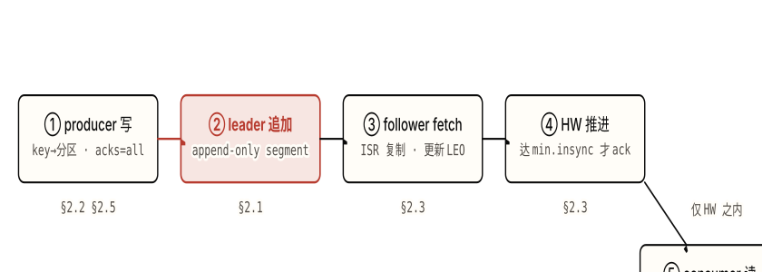

*图 2.3 一条记录的五步,每步压在不同机制上。 **注意**:第 ④ 步是枢纽——只有当复制满足 `min.insync.replicas`、HW 推进过这条记录,producer 才收到成功 ack,*且*consumer 才可见。持久性(向 producer 确认)和可见性(对 consumer 暴露)被 HW 这一个点同时门控。*

逐步拆解,注意每一步的"如果失败会怎样":

- **① producer 写(§2.2 + §2.5)**:记录按 `murmur2(key) % 分区数` 选定分区,带着幂等序列号发给该分区的 leader,`acks=all` 表示要等所有 ISR 确认。*若 key 选得差* → 热分区倾斜;*若没开幂等* → 重试可能乱序或重复。
- **② leader 追加(§2.1)**:leader 把记录顺序追加到 active segment 末尾,进 page cache,LEO +1。这一步是 O(1) 顺序写。
- **③ follower fetch(§2.3)**:ISR 里的 follower 各自 fetch 这条记录、写入自己的日志、推进自己的 LEO。*若某 follower 掉队超过 `replica.lag.time.max.ms`* → 被踢出 ISR,不再参与 HW 计算。
- **④ HW 推进 + ack(§2.3)**:当 ISR 里所有副本的 LEO 都越过这条记录,HW 推进;此时若在线 ISR 数 ≥ `min.insync.replicas`,producer 收到成功 ack。*若 ISR 缩到不足* → producer 收到 `NotEnoughReplicas`、写被拒(而不是悄悄降级)。
- **⑤ consumer 读(§2.4)**:consumer `poll()` 拉取,只能看到 ≤ HW 的记录;处理完按 at-least-once 提交 offset 到 `__consumer_offsets`。*若处理超过 `max.poll.interval.ms` 没再 `poll()`* → 被判死、分区转移、这批被重复处理。

> **💡 洞察 · 一个点门控两件事**
>
> 这条链最值得记住的是 **HW 是持久性和可见性的共同闸门**。同一个 HW:对 producer 侧,它(配合 `min.insync.replicas`)决定"何时算写成功";对 consumer 侧,它决定"何时能读到"。所以"已 ack 的记录消费者要等一个 fetch 轮才看得到"不是两个独立现象,而是同一个 HW 推进过程的一体两面。把这点讲清,面试里"acks/ISR/HW/可见性"这一串就不会散架。

============================================================ self-check ============================================================

<a id="ch02-self-check"></a>

### § 本章 self-check

先合上教程,把你能想到的答案写在纸上或编辑器里。 写完再点开答案对照——直接点开等于把这一节当再读一遍。

1. Kafka 为什么不在 JVM 堆里缓存消息?把缓存交给 OS page cache 换来了什么、又在哪两种情况下失效?
2. 给一个带 `key` 的 topic 加分区,为什么会"静默破坏"按 key 的顺序?为什么不能减分区?
3. 用一句话说清 LEO、HW、ISR 三者的关系。为什么消费者读不到 leader 上最新写入的那几条?
4. `acks=all` 和 `min.insync.replicas` 各自负责什么?为什么只配 `acks=all` 不够、会在什么时候悄悄退化成 `acks=1`?
5. 消费者的心跳一直正常,为什么还会被判死、导致重复处理?该调哪个参数、不该调哪个?
6. 幂等 producer 的去重边界是什么?为什么"开了 `enable.idempotence=true` 就端到端精确一次"是错的?
7. **(跨机制综合)** 一个服务"消费 topic A → 调一个外部支付 API → 生产 topic B",要求"绝不漏处理、且支付绝不重复扣款"。把 §2.3 的 `acks`/ISR、§2.4 的 offset 提交时机、§2.5 的事务/幂等边界串起来:Kafka 能保证哪部分?哪部分必须在 Kafka 之外解决、怎么解决?

<details>
<summary>答案(先做完再展开)</summary>

1. 堆内缓存会和 OS page cache **双份存储**、且几十 GB 数据进堆制造灾难性 GC。交给 page cache 换来:无 GC 压力、32GB 机器近 30GB 可用作缓存、进程重启缓存仍在内核、还能配合零拷贝直接发网卡。失效:(a) 开 TLS 时零拷贝被迫走用户态加密;(b) 滞后消费者冷读历史数据,把冷 segment 拉进缓存挤掉热数据。
2. 分区由 `murmur2(key) % 分区数` 决定,加分区改变了分母,同一个 key 的**新**记录可能落到与**历史**记录不同的分区,于是同 key 事件被劈到两个分区并行消费、顺序丢失;且无任何报错,故"静默"。不能减分区是因为减少会让已有记录的 key→分区映射失配、且要丢弃或迁移整段日志,Kafka 不支持。
3. LEO 是某副本下一条要写的 offset(日志末尾);HW = **ISR 中最小的 LEO**(已被所有同步副本复制到的最高位);消费者只能读到 ≤ HW。读不到 leader 最新几条,是因为那几条还没被所有 ISR 复制完(在 HW 之上)——一旦 leader 挂、follower 顶上它们可能消失,所以 HW 门控不让消费者看到。
4. `acks=all` 负责"等当前 **ISR** 所有成员确认才算写成功";`min.insync.replicas` 负责"ISR 不许缩到这个数以下,否则**拒写**"。只配 `acks=all` 不够,因为 ISR 会缩——两个 follower 掉出 ISR 后 ISR 只剩 leader,"all"就是一台,等价 `acks=1` 且 producer 无感知。`min.insync.replicas=2` 才能在这时让写入被拒。
5. 因为存活由**调用 `poll()`** 证明,不是心跳。心跳线程在后台独立运行,但处理一批记录超过 `max.poll.interval.ms`(默认 5 分钟)没再 `poll()`,coordinator 就判死、转移分区,导致重复处理。该调大的是 `max.poll.interval.ms`(或减小 `max.poll.records` 让每批更快返回);不该调 `session.timeout.ms`——那管的是心跳/进程存活,与此无关。
6. 幂等只在**同一个 `(PID, 分区)` 且同一 producer 会话**内去重。producer 崩溃重启领到新 PID,broker 不认得它与旧 PID 的关系,跨重启不去重;且幂等只管 producer 到 broker 这一跳,不管"多分区写 + offset 提交"的原子性,也不覆盖外部副作用。要跨会话精确一次得用事务(`transactional.id` + epoch)。
7. **综合题:**Kafka 这边:用 `acks=all` + `min.insync.replicas=2` + `RF=3` 保证 topic A/B 的数据不丢;消费侧用 at-least-once(处理后再提交 offset)保证"绝不漏处理";如果只在 Kafka 内部("消费 A → 生产 B"),可以用事务把 B 的输出和 A 的 offset 提交做成原子(精确一次)。**但支付 API 是外部副作用,不在 Kafka 事务范围内**——Kafka 回滚撤不掉已发生的扣款。所以"支付绝不重复"必须在**支付侧用幂等键**(同一订单的支付请求带同一幂等 token,支付服务据此去重)解决。结论:Kafka 负责消息不丢 + 内部精确一次;"不重复扣款"靠外部幂等。把"用了 Kafka 事务就全链路精确一次"当成立是错的。

</details>

> **🎯 进阶挑战 · 刚好够不着**
>
> #### 为什么 unclean leader election 能"绕过" min.insync.replicas 的保护?
>
> 你已经用 `acks=all` + `min.insync.replicas=2` + `RF=3` 把写入路径锁得很死:任何时候 ISR 不足 2 就拒写,看起来已提交的记录绝不会丢。但 `unclean.leader.election.enable=true` 仍能让你丢已提交的数据。说清楚这条路径:为什么"写入侧的 `min.insync.replicas` 保护"挡不住"选举侧的 unclean 截断"?这两个机制分别在记录生命周期的哪个阶段起作用?
>
> <details>
> <summary>提示(卡住再展开)</summary>
>
> `min.insync.replicas` 是**写入时**的闸门——它保证一条记录被 ack 时至少在 2 个副本上。unclean leader election 是**故障恢复时**的选择——当那 2 个(及以上)持有该记录的副本**全都不可用**、ISR 空了,unclean 允许一个*从来没复制到这条记录的*落后副本当 leader。它的日志更短,新 leader 上任后,那条"曾经满足 min.insync 地提交过"的记录在新日志里**根本不存在**,被当作从未发生而截断。想想 `leader-epoch-checkpoint` 在这里扮演什么角色,以及为什么默认值是 `false`——这是一道"持久性 vs 可用性,且发生在不同时间窗口"的题。
>
> </details>

#### 本章参考

- [Apache Kafka — Documentation: Design](https://kafka.apache.org/documentation/#design)(官方,存储/复制/语义的权威来源)
- [Jay Kreps — The Log: What every software engineer should know about real-time data's unifying abstraction](https://engineering.linkedin.com/distributed-systems/log-what-every-software-engineer-should-know-about-real-time-datas-unifying)(日志抽象的奠基长文)
- [Confluent — Transactions in Apache Kafka(EOS / 事务原理)](https://www.confluent.io/blog/transactions-apache-kafka/)
- [Confluent — Incremental Cooperative Rebalancing in Apache Kafka(再平衡演进)](https://www.confluent.io/blog/incremental-cooperative-rebalancing-in-kafka/)
- [Confluent — Why Replace ZooKeeper with KRaft: The Log of All Logs](https://www.confluent.io/blog/why-replace-zookeeper-with-kafka-raft-the-log-of-all-logs/)
- [developer.confluent.io — KRaft 入门](https://developer.confluent.io/learn/kraft/)


---

<a id="chapter-03"></a>

Chapter 03

## 上手实操：把原理写成可运行的 Java

第 2 章把那条日志拆开讲了机制——[副本与 ISR 怎么保证持久性](#ch02-replication)、[投递语义的真实边界](#ch02-delivery)。理解了机制，这一章把它落成代码：用 `kafka-clients` 写一个可靠的 producer + consumer，再沿 worked → partial → 开放练习三阶往上走。每个示例都把代码的某一行钉回前两章的某个概念或某个取舍——写出来的不是 API 调用，是被验证过的设计判断。

本章你将建立的 schema

- 本地用 KRaft 单 broker（无 ZooKeeper）起一个可写可读的环境，认得三类常见环境失败。
- 一个"可靠"producer 的最小配置：`acks=all` + `enable.idempotence=true`，以及它各自挡住什么。
- 一个"不丢消息"的 consumer 循环：关 auto-commit、处理完再 `commitSync()`，及其投递语义后果。
- 消费侧幂等：在 at-least-once 之上用业务唯一键去重，何时它比事务 EOS 更合适。

> **⚠️ 代码验证状态**
>
> 本章代码基于 `kafka-clients` 4.x 的 API 编写，**未在本机逐一运行**。配置项名、方法签名、异常类型按官方文档与 javadoc 核对；运行命令给的是标准 quickstart 路径。把它当作"对照官方文档可直接落地"的骨架，跑通前请按你本地的 broker 地址、Java 版本核一遍。

============================== 数据类型流图（章级地图） ==============================

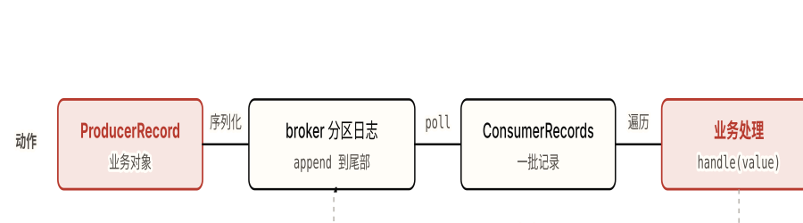

*图 3.1 一条记录从业务对象到落盘、再回到业务对象的完整类型链。 **注意**：两端（朱红）是 JVM 里的对象，broker 上只存 `byte[]`——序列化/反序列化是必经的边界；而 `commitSync()`（虚线回环）发生在**处理之后**，这一步的位置就是后面投递语义的全部分歧所在。*

============================================================ §3.1 环境准备 ============================================================

<a id="ch03-setup"></a>

### 3.1 环境准备：KRaft 单 broker + 最小依赖

一个 Maven 依赖、一个 KRaft 单 broker（无 ZooKeeper）、Java 11+ 的客户端——三样齐了就能跑本章所有示例。

#### 客户端依赖（Maven）

只需要 `kafka-clients` 一个坐标，外加一个日志门面的实现（否则 SLF4J 会在启动时刷一行 "no provider" 警告）。**不要**引整个 `kafka_2.13` 服务端包——那是 broker 的依赖，客户端用不上。

**pom.xml（片段）**

```properties
<dependency>
  <groupId>org.apache.kafka</groupId>
  <artifactId>kafka-clients</artifactId>
  <version>4.0.0</version>   <!-- 4.x；本章 API 在 4.0–4.3 通用 -->
</dependency>
<dependency>
  <groupId>org.slf4j</groupId>
  <artifactId>slf4j-simple</artifactId>   <!-- 任意 SLF4J 实现即可 -->
  <version>2.0.13</version>
</dependency>
```

> **✅ 版本 / Java 要求**
>
> `kafka-clients` 4.x 的**客户端**只要求 Java 11+（broker / Streams 需要 Java 17，但那是跑 broker 时的事，与你的应用工程无关）。Java 8 在 4.0 已被移除——若工程还卡在 Java 8，要么升级 JDK，要么把客户端停在 3.x。

#### 本地起一个 KRaft 单 broker

4.0 起 ZooKeeper 被彻底移除，单机也走 **KRaft**——同一个进程既当 broker 又当 controller（`process.roles=broker,controller`）。最快的路径是 Docker：

**起 broker（Docker，推荐）**

```bash
# 官方镜像 apache/kafka 自带 KRaft 默认配置，开箱即用、无需 ZooKeeper
docker run -d --name kafka -p 9092:9092 apache/kafka:latest

# 验证：列出 topic（应为空列表，不报错即连通）
docker exec kafka /opt/kafka/bin/kafka-topics.sh \
  --bootstrap-server localhost:9092 --list

# 建一个 4 分区、单副本的 orders topic（本机单 broker 只能 RF=1）
docker exec kafka /opt/kafka/bin/kafka-topics.sh \
  --bootstrap-server localhost:9092 \
  --create --topic orders --partitions 4 --replication-factor 1
```

不用 Docker 时，二进制发行版需要显式走 KRaft 的三步：生成集群 ID → `storage format` 格式化数据目录 → 启动。少了 format 这一步，broker 会因"未格式化的存储目录"直接启动失败——这是新手第一道坎。

**起 broker（二进制 + KRaft，无 ZooKeeper）**

```bash
# 1. 生成一个集群 ID（KRaft 集群的唯一标识）
KAFKA_CLUSTER_ID="$(bin/kafka-storage.sh random-uuid)"

# 2. 用该 ID 格式化数据目录（KRaft 必需，缺这步 broker 启动即失败）
#    config/server.properties 已是 KRaft 单机默认（process.roles=broker,controller）
bin/kafka-storage.sh format --standalone \
  --cluster-id "$KAFKA_CLUSTER_ID" \
  --config config/server.properties

# 3. 启动 broker（前台运行；后台加 -daemon）
bin/kafka-server-start.sh config/server.properties
```

> **⚠️ 三类最常见的环境失败**
>
> **① 连接被拒 / 超时。**多半是 `advertised.listeners` 没指向客户端能到达的地址。Docker 场景下若从宿主机连，要确保 broker advertise 的是 `localhost:9092`（官方镜像默认已处理）；容器互联则要 advertise 容器名。客户端连不上时，第一件事是核对 broker 实际 advertise 的 host:port，而不是改客户端代码。
>
> **② 端口被占。**`9092` 被上一个没关干净的 broker 或别的进程占用 → 启动报 `Address already in use`。换端口或先 `docker rm -f kafka` / 杀掉旧进程。
>
> **③ broker 未 format。**二进制方式跳过 `kafka-storage.sh format` 直接 start → 报错说存储目录未格式化。KRaft 下 format 不是可选步骤。

============================================================ §3.2 worked example ============================================================

<a id="ch03-worked"></a>

### 3.2 示例 1（worked）：一个不丢消息的 producer + consumer

目标是一对**可靠**的程序：producer 保证"已确认的写入不会因单台故障丢失、且重试不produce重复"，consumer 保证"处理过的记录绝不漏提交"。这两个保证不是默认值——默认配置反而会丢消息（见 [04 章](#ch04-data-loss)）。下面逐配置项落地。

#### 可靠 producer

**ReliableProducer.java**

```Java
import org.apache.kafka.clients.producer.KafkaProducer;
import org.apache.kafka.clients.producer.Producer;
import org.apache.kafka.clients.producer.ProducerConfig;
import org.apache.kafka.clients.producer.ProducerRecord;
import org.apache.kafka.clients.producer.RecordMetadata;
import org.apache.kafka.common.serialization.StringSerializer;

import java.util.Properties;

public class ReliableProducer {
    public static void main(String[] args) {
        Properties props = new Properties();
        props.put(ProducerConfig.BOOTSTRAP_SERVERS_CONFIG, "localhost:9092");
        props.put(ProducerConfig.KEY_SERIALIZER_CLASS_CONFIG, StringSerializer.class.getName());
        props.put(ProducerConfig.VALUE_SERIALIZER_CLASS_CONFIG, StringSerializer.class.getName());

        // —— 可靠性三件套 ——
        props.put(ProducerConfig.ACKS_CONFIG, "all");              // 等所有 ISR 确认
        props.put(ProducerConfig.ENABLE_IDEMPOTENCE_CONFIG, true); // 重试不produce重复、且保序
        props.put(ProducerConfig.RETRIES_CONFIG, Integer.MAX_VALUE); // 配合幂等，失败就重试

        // try-with-resources 保证 close() 时 flush 掉缓冲区里未发完的记录
        try (Producer<String, String> producer = new KafkaProducer<>(props)) {
            for (int i = 0; i < 5; i++) {
                String orderId = "order-" + i;
                // key = orderId：同一订单的事件落同一分区，分区内有序
                ProducerRecord<String, String> record =
                    new ProducerRecord<>("orders", orderId, "{\"id\":\"" + orderId + "\",\"amount\":100}");

                // send 异步返回 Future；回调里能拿到 broker 分配的 partition / offset
                producer.send(record, (RecordMetadata md, Exception e) -> {
                    if (e != null) {
                        System.err.println("发送失败: " + e.getMessage());
                    } else {
                        System.out.printf("已确认 key=%s -> partition=%d offset=%d%n",
                            orderId, md.partition(), md.offset());
                    }
                });
            }
            producer.flush(); // 阻塞到上面 5 条都拿到 broker 的确认
        }
    }
}
```

#### 逐行解读（代码 → 概念，不是代码 → 语法）

> **📌 acks=all**
>
> 把"写成功"的定义钉在"当前 ISR 全部确认"上，对应
>
> §2.3 副本与 ISR
>
> 。但它
>
> 单独不够
>
> ——ISR 缩到只剩 leader 时 "all" 就是一台，持久性真正的闸门是 broker 端的
>
> min.insync.replicas
>
> （本机单 broker 演示不到，进生产必须配，见 partial 示例）。

> **📌 enable.idempotence**
>
> 开启后 broker 用
>
> (PID, 分区)
>
> + 序列号去重，并拒绝乱序 batch——一次解决"重试导致重复"和"重试导致乱序"两件事，对应
>
> §2.5 投递语义
>
> 。边界：它只在
>
> 同一 producer 会话内
>
> 去重，进程崩溃重启领新 PID 就失效。

> **📌 key=orderId**
>
> 是把"需要顺序的记录钉在同一分区"的落点，对应
>
> §1.3 顺序只在分区内
>
> ——同一
>
> orderId
>
> 的所有事件 murmur2 哈希到同一 partition，于是按写入顺序排列。

> **📌 send**
>
> 是异步的：它把记录放进缓冲区就返回
>
> Future
>
> ，由后台 I/O 线程批量发送。回调拿到的
>
> partition
>
> /
>
> offset
>
> 正是
>
> §1.2
>
> 那条日志里记录的物理坐标。
>
> flush()
>
> /
>
> close()
>
> 阻塞到缓冲区清空——漏掉它会丢掉还没发出的记录。

#### 可靠 consumer

消费侧的两个关键决定：**关掉 auto-commit**、**处理完一批再 `commitSync()`**。默认的 auto-commit 按定时器提交"poll 返回的"而非"处理过的"，处理到一半崩溃就丢消息（[04 章头号案例](#ch04-data-loss)）。

**ReliableConsumer.java**

```Java
import org.apache.kafka.clients.consumer.ConsumerConfig;
import org.apache.kafka.clients.consumer.ConsumerRecord;
import org.apache.kafka.clients.consumer.ConsumerRecords;
import org.apache.kafka.clients.consumer.KafkaConsumer;
import org.apache.kafka.common.serialization.StringDeserializer;

import java.time.Duration;
import java.util.List;
import java.util.Properties;

public class ReliableConsumer {
    public static void main(String[] args) {
        Properties props = new Properties();
        props.put(ConsumerConfig.BOOTSTRAP_SERVERS_CONFIG, "localhost:9092");
        props.put(ConsumerConfig.GROUP_ID_CONFIG, "order-processor");   // 消费组名
        props.put(ConsumerConfig.KEY_DESERIALIZER_CLASS_CONFIG, StringDeserializer.class.getName());
        props.put(ConsumerConfig.VALUE_DESERIALIZER_CLASS_CONFIG, StringDeserializer.class.getName());

        // —— 不丢消息的两个决定 ——
        props.put(ConsumerConfig.ENABLE_AUTO_COMMIT_CONFIG, false);     // 关自动提交
        props.put(ConsumerConfig.AUTO_OFFSET_RESET_CONFIG, "earliest"); // 无已存 offset 时从头读

        try (KafkaConsumer<String, String> consumer = new KafkaConsumer<>(props)) {
            consumer.subscribe(List.of("orders"));   // 加入组，由再平衡分到若干 partition

            while (true) {
                // poll 既拉数据，也向 broker 证明本消费者存活
                ConsumerRecords<String, String> records = consumer.poll(Duration.ofMillis(500));
                for (ConsumerRecord<String, String> r : records) {
                    System.out.printf("收到 partition=%d offset=%d key=%s value=%s%n",
                        r.partition(), r.offset(), r.key(), r.value());
                    // ... 这里是真实业务：写库 / 调下游 ...
                }
                // 处理完整批后再同步提交 offset（at-least-once）
                if (!records.isEmpty()) {
                    consumer.commitSync();
                }
            }
        }
    }
}
```

#### 逐行解读

> **📌 group.id**
>
> 把这个消费者归进一个消费组，组内每个 partition 只分给一个成员——对应
>
> §1.4 并行度 = 分区数
>
> 。换一个
>
> group.id
>
> 再跑一份，就是一个独立消费组，从头各读一遍同一份日志。

> **📌 poll**
>
> 返回的是一
>
> 批
>
> ConsumerRecords
>
> ，不是单条——批的边界就是图 3.1 里那个反序列化关口。
>
> poll(Duration)
>
> 还兼任心跳证明：处理太慢、长时间不回到 poll，会被判死触发再平衡（
>
> §2.4
>
> /
>
> 04 章再平衡风暴
>
> ）。

> **📌 commitSync**
>
> 放在 for 循环
>
> 之后
>
> ，决定了投递语义是
>
> at-least-once
>
> ：先处理后提交，崩溃只会让上一批被重放（重复），不会丢。把它挪到处理之前就翻成 at-most-once（丢失）——这正是
>
> §2.5
>
> 那条"先提交后处理把失败模式从重复翻成丢失"。

#### 运行 + 预期输出

两个类编译后，先跑 consumer（让它先加入组、订阅好），再跑 producer。

**运行命令**

```bash
# 终端 A：先启动消费者（持续运行，等待消息）
mvn -q compile exec:java -Dexec.mainClass=ReliableConsumer

# 终端 B：再运行生产者，发 5 条后退出
mvn -q compile exec:java -Dexec.mainClass=ReliableProducer
```

终端 B（producer）按确认顺序打印——注意不同 key 被路由到不同 partition：

**producer 预期输出**

```bash
已确认 key=order-0 -> partition=2 offset=0
已确认 key=order-1 -> partition=0 offset=0
已确认 key=order-2 -> partition=2 offset=1
已确认 key=order-3 -> partition=1 offset=0
已确认 key=order-4 -> partition=3 offset=0
# 具体 partition 取决于 murmur2(key) % 4，因 key 而定、可复现；offset 在各分区内从 0 起。
```

终端 A（consumer）收到这 5 条。**同一 partition 内**按 offset 有序，跨 partition 之间无全局顺序：

**consumer 预期输出**

```bash
收到 partition=0 offset=0 key=order-1 value={"id":"order-1","amount":100}
收到 partition=1 offset=0 key=order-3 value={"id":"order-3","amount":100}
收到 partition=2 offset=0 key=order-0 value={"id":"order-0","amount":100}
收到 partition=2 offset=1 key=order-2 value={"id":"order-2","amount":100}
收到 partition=3 offset=0 key=order-4 value={"id":"order-4","amount":100}
# partition 间到达顺序不保证；partition=2 内 offset 0 必在 1 之前——这就是"顺序只在分区内"。
```

> **🤔 想一想**
>
> consumer 跑完、不重启它，把 producer**再运行一遍**（又发 5 条相同 key）。这次 consumer 会收到这 5 条吗？如果先 <kbd>Ctrl-C</kbd> 停掉 consumer、重跑 producer、再启动 consumer，结果一样吗？
>
> <details>
> <summary>展开答案（先停 10 秒再点）</summary>
>
> **第一种**（consumer 不停）：会收到。新发的 5 条追加到各分区日志尾部，consumer 的游标继续往后 poll 到它们。这 5 条的 offset 接着上次往后排（比如 partition=2 收到 offset 2、3）。
>
> **第二种**（停掉再重启）：**也只收到这新的 5 条，不会重收旧的**。因为上一轮 `commitSync()` 已经把 offset 提交到 `__consumer_offsets`，同 `group.id` 的 consumer 重启后从已提交位置续读，不是从头。`auto.offset.reset=earliest` 只在"该组从来没提交过 offset"时才从头——一旦提交过，它不生效。
>
> 这道题指向：offset 归消费组持有、跨重启存活（[§1.2](#ch01-log-model)），以及"读完不删"——旧的 5 条始终在日志里，换个新 `group.id` 仍能从头再读一遍。
>
> </details>

============================================================ §3.3 partial example ============================================================

<a id="ch03-partial"></a>

### 3.3 示例 2（partial）：补上生产级的三个决策点

worked 版在本机单 broker 上能跑，但有三处是**本机演示不到、进生产必须做的决策**。下面的框架把这三处留成 `TODO`——它们不是填空，是要你在两个真实备选间做判断并说出代价。先自己定，再展开对照决策路径。

**ProductionConfig.java（待补）**

```Java
// —— Producer 端 ——
props.put(ProducerConfig.ACKS_CONFIG, "all");
props.put(ProducerConfig.ENABLE_IDEMPOTENCE_CONFIG, true);

// TODO ①：broker 端 topic 该配 min.insync.replicas 为几？（RF=3 的前提下）
//   提示：acks=all 的强度被当前 ISR 大小绑架，这个值决定 ISR 缩到多少时拒写。
//   —— 这是 broker/topic 配置，不是 producer 属性，用 kafka-configs.sh 设。

// —— Consumer 端 ——
props.put(ConsumerConfig.ENABLE_AUTO_COMMIT_CONFIG, false);

while (true) {
    ConsumerRecords<String, String> records = consumer.poll(Duration.ofMillis(500));
    for (ConsumerRecord<String, String> r : records) {
        handle(r.value());

        // TODO ②：commit 放这里（每条一提交）还是放 for 循环之后（每批一提交）？
        //   两种都能跑通，但投递语义和吞吐不同。选一个，并说出代价。
    }
    // TODO ②（另一处）：还是放这里？
}

// TODO ③：orders 要求"同一订单的事件严格按 创建→支付→发货 顺序被消费"。
//   现在靠 key=orderId 的默认分区器够不够？要不要自定义 Partitioner？
```

<details>
<summary>TODO ① 参考答案 + 决策路径</summary>

**设 `min.insync.replicas=2`**（RF=3 时）。决策路径：`acks=all` 只保证"等当前 ISR 全部确认"，但 ISR 会动态收缩——两个 follower 掉队后 ISR={leader}，"all" 退化成一台，等价 `acks=1` 且 producer 毫无察觉（[§2.3](#ch02-replication) 的头号陷阱）。设成 2 才能在 ISR 缩到 1 时让写入**被拒**（`NotEnoughReplicas`）而非悄悄降级。

**代价**：RF=3 + `min.insync.replicas=2` 下，挂 1 台仍可写、挂 2 台该分区**停写**——这是故意用可用性换持久性。设成 3 则任一台故障就停写（太脆），设成 1 则等于没设（退化成上面的陷阱）。规则：`min.insync.replicas = RF - 1` 是"容忍一台故障还能写"的平衡点。

</details>

<details>
<summary>TODO ② 参考答案 + 决策路径</summary>

**放 for 循环之后（每批一提交）**是默认选择。两种都是 at-least-once（都先处理后提交），区别在**提交频率**：

- **每批一提交**：一次 `commitSync()` 覆盖整批，提交开销小、吞吐高；代价是崩溃时整批重放（重复窗口 = 一批）。
- **每条一提交**：重复窗口缩到一条，但每条都同步往 broker 发一次提交、阻塞等确认，吞吐大幅下降。

决策路径：既然消费侧已经要做幂等（见 [开放练习](#ch03-open)），重放几条不产生副作用，就没必要为缩小重复窗口牺牲吞吐——**每批一提交 + 幂等**是标准组合。只有当处理极慢、单条都很贵时才考虑更细的提交粒度（或用 `commitAsync()` 配合定期 `commitSync()`）。**唯一不能选的是把 commit 挪到 `handle()` 之前**——那会从重复翻成丢失。

</details>

<details>
<summary>TODO ③ 参考答案 + 决策路径</summary>

**不需要自定义 Partitioner。**`key=orderId` + 默认分区器已经保证"同一 `orderId` → murmur2 哈希 → 同一 partition → 分区内按写入顺序"（[§2.2](#ch02-partition-order)）。"创建→支付→发货"只要按这个先后 `send`，且 producer 开了 `enable.idempotence=true`（幂等顺带拒绝乱序 batch），到达消费端就是这个顺序。

**什么时候才需要自定义 Partitioner**：默认按 key 哈希均摊，但某些场景要把"一组相关 key"压进同一分区（如同一商户的所有订单要单分区串行处理），或要规避热点 key 倾斜——这时才写 `Partitioner`。**代价提醒**：无论默认还是自定义，partition 数一旦上线就**不能减**，给有 key 的 topic **加分区会打乱已有 key→分区映射**、破坏历史顺序（[§2.2](#ch02-partition-order)）。所以顺序设计的重点在"key 选得对 + 分区数预估够"，而非分区器本身。

</details>

============================================================ §3.4 open exercise ============================================================

<a id="ch03-open"></a>

### 3.4 示例 3（开放练习）：幂等的订单事件消费者

> **🧩 练习**
>
> 实现一个消费者：从 `orders` topic 消费订单事件，把每个订单写入数据库，**保证 Kafka 的重复投递不产生重复订单**。验收：人为让某一批在提交 offset 前崩溃、重启后重放同一批，数据库里那些订单的**记录数不变**。
>
> 必须用到 01 章的 [offset 由消费者维护](#ch01-log-model)、[consumer group](#ch01-producer-consumer)、[record 的 key](#ch01-record) 三个概念，以及 02 章的一个权衡：**at-least-once + 消费侧幂等** vs **事务 EOS**——你要选其一并说清为什么。

这是真实工作里最常见的形态。worked 示例已经给了"不丢"（at-least-once），但 at-least-once 的代价是**会重复**：再平衡、崩溃重启都会重放未提交的那批。"不产生重复订单"这件事，Kafka 的事务 EOS 解决不了——因为写数据库是**外部副作用**，不在 Kafka 事务范围内（[§2.5 EOS 的真实边界](#ch02-delivery)）。所以正确的下手处是**消费侧幂等**：用订单的业务唯一键让"重复处理"变成"无害的重复写"。

#### 脚手架递减：你现在站在第三阶

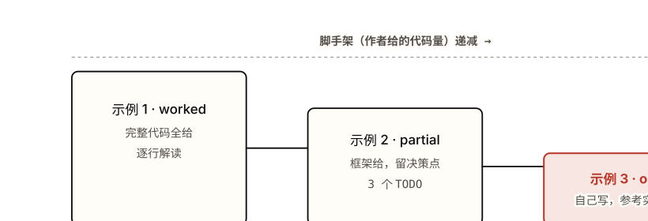

*图 3.2 三阶脚手架：实心框的高度近似"作者直接给出的代码量"，逐阶变矮。 **注意**：递减的是脚手架，递增的是你的承担——到第三阶（朱红）参考实现是折叠的，先自己写完再展开，对照才有意义；直接看答案等于把练习做成了阅读。*

<details>
<summary>参考实现 + 关键决策说明（写完自己版本再展开）</summary>

核心思路：把 worked 版的 consumer 改成"在**同一个数据库事务**里，用订单 ID 做幂等键 upsert/INSERT-IGNORE"。Kafka 这侧仍是 at-least-once（处理后提交 offset），重复由数据库的唯一约束吸收。

**IdempotentOrderConsumer.java（参考）**

```Java
import org.apache.kafka.clients.consumer.ConsumerConfig;
import org.apache.kafka.clients.consumer.ConsumerRecord;
import org.apache.kafka.clients.consumer.ConsumerRecords;
import org.apache.kafka.clients.consumer.KafkaConsumer;
import org.apache.kafka.common.serialization.StringDeserializer;

import javax.sql.DataSource;
import java.sql.Connection;
import java.sql.PreparedStatement;
import java.time.Duration;
import java.util.List;
import java.util.Properties;

public class IdempotentOrderConsumer {

    private final DataSource ds; // 你的连接池

    public IdempotentOrderConsumer(DataSource ds) { this.ds = ds; }

    public void run() {
        Properties props = new Properties();
        props.put(ConsumerConfig.BOOTSTRAP_SERVERS_CONFIG, "localhost:9092");
        props.put(ConsumerConfig.GROUP_ID_CONFIG, "order-db-writer");
        props.put(ConsumerConfig.KEY_DESERIALIZER_CLASS_CONFIG, StringDeserializer.class.getName());
        props.put(ConsumerConfig.VALUE_DESERIALIZER_CLASS_CONFIG, StringDeserializer.class.getName());
        props.put(ConsumerConfig.ENABLE_AUTO_COMMIT_CONFIG, false); // 手动提交，处理后才提交

        try (KafkaConsumer<String, String> consumer = new KafkaConsumer<>(props)) {
            consumer.subscribe(List.of("orders"));
            while (true) {
                ConsumerRecords<String, String> records = consumer.poll(Duration.ofMillis(500));
                if (records.isEmpty()) continue;

                // 整批在一个 DB 事务里写；幂等键 = 订单 ID（来自 record.key()）
                try (Connection conn = ds.getConnection()) {
                    conn.setAutoCommit(false);
                    // ON CONFLICT DO NOTHING：同一 order_id 重复投递时第二次写入被静默忽略
                    String sql = "INSERT INTO orders(order_id, payload) VALUES (?, ?) "
                               + "ON CONFLICT (order_id) DO NOTHING";
                    try (PreparedStatement ps = conn.prepareStatement(sql)) {
                        for (ConsumerRecord<String, String> r : records) {
                            ps.setString(1, r.key());   // order_id 作幂等键
                            ps.setString(2, r.value());
                            ps.addBatch();
                        }
                        ps.executeBatch();
                    }
                    conn.commit();   // DB 先落库
                }
                // DB 提交成功后才提交 Kafka offset。崩在两者之间 → 重放整批，
                // 但 DB 的 ON CONFLICT DO NOTHING 吸收重复，记录数不变。
                consumer.commitSync();
            }
        }
    }
}
```

**关键决策：为什么用消费侧幂等而非事务 EOS。**

- **事务 EOS 管不到外部副作用。**Kafka 事务（`transactional.id` + `sendOffsetsToTransaction`）只能把"*写回 Kafka* 的输出 + offset 提交"做成原子——本练习的副作用是**写数据库**，发生在 Kafka 之外，事务回滚撤不掉已发生的 DB 写（[§2.5](#ch02-delivery) 的核心边界）。
- **幂等键把"精确一次"下沉到有副作用的地方。**唯一能让"写库恰好一次"成立的位置，是写库本身——靠 `order_id` 的唯一约束 + `ON CONFLICT DO NOTHING`。这样 Kafka 侧保持简单的 at-least-once，正确性由 DB 兜底。
- **顺序：DB 提交在前，offset 提交在后。**这个先后不能反——先提交 offset 再写库，崩在中间就丢了那批（at-most-once）。先库后 offset，崩在中间只会重放，被幂等吸收。

**什么时候反而该用事务 EOS**：当副作用**就是写回另一个 Kafka topic**（"消费 A → 转换 → 生产 B"的纯 Kafka 闭环），事务能把 B 的输出和 A 的 offset 原子提交，比"消费侧幂等 + 自己维护去重表"更干净。判别点就一句：**副作用落在 Kafka 内还是 Kafka 外**。

</details>

#### 现状延伸：share group（KIP-932，4.2+）让 Kafka 有了队列语义

本章的消费模型自始至终是"一个 partition 只归组内一个 consumer"——并行度被 [分区数](#ch01-producer-consumer)卡死，且天然是 at-least-once。**截至 2026-06，Kafka 4.2（2026-02）GA 的 share group**（"Queues for Kafka"）在日志之上加了一层**队列语义**：同一 topic 的记录可被同组多个 consumer **按记录分发并逐条 ack**，不再受"消费者数 ≤ 分区数"限制——更接近传统 MQ 的工作队列。

> **💡 洞察 · share group 没有推翻"日志"模型**
>
> share group 用的是 `KafkaShareConsumer`，`poll()` 后对每条记录调 `acknowledge(record, AcknowledgeType.ACCEPT / RELEASE / REJECT)`，再 `commitSync()` 提交这些 ack——ack 状态由 broker 端维护，而不是单一 offset 游标。它**仍架在同一条分区日志之上**（数据没删、可被普通消费组重放），只是把"谁处理哪条、哪条处理失败要重投"的记账搬到了 broker。需要"工作队列 + 逐条重试 + 并行度不绑分区数"时它是原生答案；需要"可重放 + 严格分区顺序"时仍用经典 consumer group。两者共存，按语义选，不是替代关系。

============================================================ self-check ============================================================

<a id="ch03-self-check"></a>

### § 本章 self-check（动手层面）

先合上教程，把你能想到的答案写在编辑器里。写完再点开对照——直接点开等于把这一节当再读一遍。

1. worked 版 producer 配了 `acks=all`，为什么说它"单独不够"？要在**哪一侧**、补**哪个配置**才补得上？（指出配置归 producer 还是 broker/topic）
2. 把可靠 consumer 里的 `commitSync()` 从 for 循环之后挪到 `handle()` 之前，投递语义从什么变成什么？什么时候会观察到差异？
3. 开放练习里"DB 提交"和"Kafka offset 提交"两步，为什么顺序必须是先 DB 后 offset？反过来会怎样？
4. （设计题）同样要"消费后写下游且不重复"，什么情况下你选事务 EOS、什么情况下选消费侧幂等？判别的那一句话是什么？

<details>
<summary>答案（先做完再展开）</summary>

1. `acks=all` 只保证"等当前 ISR 全部确认"，而 ISR 会动态收缩——缩到只剩 leader 时 "all" 就是一台，悄悄退化成 `acks=1` 且 producer 无感知。补在 **broker/topic 侧**的 `min.insync.replicas=2`（RF=3 时），让 ISR 缩到 1 时写入被拒（`NotEnoughReplicas`）而非降级。这是 topic 配置，不是 producer 属性，用 `kafka-configs.sh` 设。
2. 从 **at-least-once 变成 at-most-once**。差异在崩溃/再平衡时出现：先提交后处理时，提交完那批还没处理完就崩溃，重启从已提交位置之后续读——那批被**跳过（丢失）**。先处理后提交则只会重放（重复）。"感觉更安全"的早提交才是危险的。
3. 先 DB 后 offset：崩在两步之间只会让整批被重放，DB 的唯一约束（`ON CONFLICT DO NOTHING`）吸收重复，记录数不变。反过来先提交 offset 再写库：崩在中间时 offset 已前移、那批的 DB 写没发生，重启不会再读到它们——**丢数据**（at-most-once）。
4. 判别那一句：**副作用落在 Kafka 内还是 Kafka 外**。落在 Kafka 内（消费 A → 生产 B 的纯闭环）→ 事务 EOS，把 B 输出和 A 的 offset 原子提交。落在 Kafka 外（写库、调支付、发邮件）→ 事务管不到，必须在副作用那一侧用业务幂等键去重，Kafka 侧保持 at-least-once。

</details>

> **🎯 进阶挑战 · 刚好够不着**
>
> #### 把 worked 示例改成事务 EOS 版（纯 Kafka 闭环）
>
> 把示例 1 改成"消费 `orders` → 计算 → 生产到 `orders-enriched`"的**纯 Kafka**管道，并用事务让"输出写入 + 消费 offset 提交"**原子**。producer 要配 `transactional.id` 并调 `initTransactions()` / `beginTransaction()` / `sendOffsetsToTransaction(...)` / `commitTransaction()`；consumer 要把 offset 提交交给事务（而不是自己 `commitSync()`），并设 `isolation.level=read_committed`。想清楚：为什么这里能用 EOS，而开放练习的写库场景不能？
>
> <details>
> <summary>提示（卡住再展开）</summary>
>
> 关键差别在副作用的位置——这个挑战的输出是**另一个 Kafka topic**（Kafka 内），所以事务覆盖得到；开放练习的输出是数据库（Kafka 外），事务覆盖不到。事务里 offset 不能再用 `consumer.commitSync()` 提交，而要走 `producer.sendOffsetsToTransaction(offsets, consumer.groupMetadata())`，让 offset 提交和输出写入进同一个事务、一起 commit 或一起 abort。`read_committed` 的消费者会跳过 aborted 数据、且不越过 LSO（[§2.5](#ch02-delivery)）。02 章那段事务 producer 代码可以直接当骨架。
>
> </details>

#### 本章参考

- [Apache Kafka — Quickstart](https://kafka.apache.org/quickstart)（官方；KRaft 单机启动 + storage format 步骤）
- [Apache Kafka — Producer / Consumer Configs](https://kafka.apache.org/documentation/#producerconfigs)（官方；`acks` / `enable.idempotence` / `enable.auto.commit` 等配置项权威说明）
- [kafka-clients 4.0 Javadoc — KafkaProducer / KafkaConsumer](https://kafka.apache.org/40/javadoc/org/apache/kafka/clients/producer/KafkaProducer.html)（官方 API 签名、异常类型）
- [Confluent Developer — Apache Kafka for Java Developers](https://developer.confluent.io/get-started/java/)（实战教程，可运行示例工程）
- [Confluent — Transactions in Apache Kafka](https://www.confluent.io/blog/transactions-apache-kafka/)（事务 EOS 实现，挑战题背景）


---

<a id="chapter-04"></a>

Chapter 04

## 生产陷阱：机制被违反时的失败模式

02 章讲清了存储、分区顺序、副本/ISR、再平衡、投递语义这五套机制为什么这么设计。本章是同一批机制在被误用、被错配、或被默认值悄悄违反时的失败模式——每一条都能回溯到某个具体机制上的一次违约。

本章你将建立的 schema

- 数据丢失、正确性、性能运维三类失败模式各自的根因机制不同——按根因排序而非按现象排序
- "不丢消息"是 `acks=all` + `min.insync.replicas` + `replication.factor` + `unclean.leader.election=false` + 处理后再提交的组合命题，不是单个开关
- 每条陷阱的三要素：症状（你观测到什么）→ 根因（违反了哪条机制）→ 修复（错误写法对正确写法）→ 如何在设计层面避免再次触发
- 什么时候不该用 Kafka——失败模式的总和会反过来界定它的适用边界

这一章按**根因与严重度**排序，不按出现频率。数据丢失放最前：丢掉的记录不会回来，而重复和乱序还能在下游补救。每条失败模式都标注它违反了 [02 章](#chapter-02)的哪条机制——失败模式不是孤立的故障，是某个设计取舍在被忽略时显形。

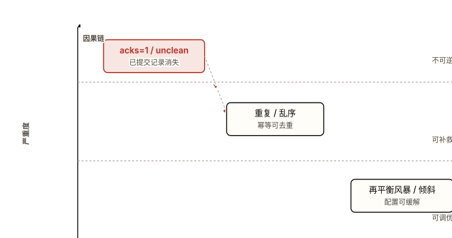

*图 4.0 陷阱按"根因机制"（X 轴）与"能否补救"（严重度，Y 轴）二维分布；越靠左上越致命。 **注意**：数据丢失类落在"不可逆"带，所以本章把它放最前；右下虚线箭头表示一类失败会引发另一类——配错持久性会被误当成性能问题来调，根因找错。*

> **💡 洞察 · 按根因排序而非按现象**
>
> 同一个现象（"消息没了""消费者卡住")可能由多条机制失败造成。把陷阱挂在根因机制上，遇到现象时才能反查是哪条机制被违反，而不是逐个试配置。本章三节正对应三类根因：持久性机制（[副本/ISR](#ch02-replication)）、投递语义机制（[幂等/顺序](#ch02-delivery)）、消费组协调机制（[再平衡](#ch02-rebalance)）。

════════════════ DATA LOSS ════════════════

<a id="ch04-data-loss"></a>

### 4.1 数据丢失类（最严重，不可逆）

数据丢失的共同根因是**持久性保证被高估**：producer 以为记录已经安全落地，实际上它只到了一台机器、或还没复制就因故障消失。全部回溯到 [§2.3 副本与 ISR](#ch02-replication) 里 HW（高水位）与 ISR 的语义。

#### 陷阱 1：`acks=1` 丢数据（leader ack 后未复制即崩溃）

**症状**：producer 端 `send()` 全部返回成功、回调拿到了 offset；某次 broker 故障切换后，下游消费者读到的最高 offset 比 producer 确认过的要小——中间一段记录凭空消失，且无任何异常抛出。

**根因**：`acks=1` 表示 leader 把记录写进自己的日志就立即 ack，**不等待 follower 复制**。回链 [§2.3](#ch02-replication)：HW 只在 ISR 中所有副本都 fetch 到之后才推进。`acks=1` 在"leader 已写、follower 未同步"这个窗口里 ack 了 producer；若 leader 此刻崩溃，新 leader 从某个 follower 选出，那段没复制出去的记录随旧 leader 的磁盘一起丢失。这是用持久性换延迟。

**producer-acks.properties**

```Properties
# 错误写法：leader 单方面确认，复制前的崩溃窗口会丢已 ack 的记录
acks=1

# 正确写法：等所有 ISR 成员都复制到才确认
acks=all
# 注意 acks=all 本身不够，必须搭配陷阱 3 的 min.insync.replicas，否则会静默退化
```

**如何避免再次触发**：把 `acks=all` 写进生产 producer 的**基线配置模板**，不要让它停留在各服务自行决定。对吞吐敏感、可容忍丢失的旁路链路（如可重算的指标采样）才显式降到 `acks=1`，并在代码注释里写明"此链路接受丢失"——把例外变成需要主动声明的决定，而不是默认。

#### 陷阱 2：unclean leader election 丢已提交数据

**症状**：一次多 broker 同时故障后集群恢复了可用性、分区重新可写，但已经确认给 producer、甚至已经被消费过的一段记录消失了。这比陷阱 1 更隐蔽——丢的是**已经越过 HW、对消费者可见过**的记录。

**根因**：`unclean.leader.election.enable=true` 允许一个**不在 ISR 里、落后的副本**当选 leader，以便在所有同步副本都不可用时恢复写入。回链 [§2.3](#ch02-replication)：假设 producer 已 ack 到 offset 100、HW=100，落后副本只复制到 offset 80 就被选为 leader，它会把日志截断到 80，81–100 永久丢失。这是用一致性换可用性，且丢失**静默发生**。

**broker-server.properties**

```Properties
# 错误写法：允许落后副本上位，截断已提交记录换取可用性
unclean.leader.election.enable=true

# 正确写法（4.x 默认即 false，但旧集群/旧 topic 可能残留 true）
unclean.leader.election.enable=false
# 代价：所有 ISR 副本都挂时分区停写，直到某个同步副本恢复——这是刻意的
```

**如何避免再次触发**：把它当成一个**持久性 vs 可用性的显式声明**而非性能开关。金融、订单、计费类不能丢数据的 topic 一律 `false`；同时在 broker 默认值与 topic 级覆盖两处都核对——一个老 topic 上残留的 `true` 会绕过 broker 默认。监控 `UncleanLeaderElectionsPerSec` 指标，任何非零都该告警。

#### 陷阱 3：`acks=all` 静默退化成 `acks=1`（ISR 缩到 1）

**症状**：配置审计显示 `acks=all` 一切合规，但某次故障后仍然丢了已 ack 的记录。看上去和陷阱 1 矛盾——明明设了最强确认。

**根因**：`acks=all` 的语义是"所有 **ISR 成员**确认"，不是"所有副本确认"。回链 [§2.3](#ch02-replication) 的关键洞察：当 follower 落后超过 `replica.lag.time.max.ms` 被踢出 ISR，ISR 可能**收缩到只剩 leader 一台**。此时 `acks=all` 等价于 `acks=1`——写到一台就算"全部 ISR 确认"，下一次故障即丢。持久性的真正来源是 `min.insync.replicas`，不是 `acks`。

**durability-combo.properties**

```Properties
# 错误写法：只设 acks=all，ISR 缩到 1 时静默退化成单副本写入
acks=all
# （未设 min.insync.replicas，默认 1）

# 正确写法：broker / topic 端要求至少 2 个 ISR 成员在线
acks=all                       # producer 端
min.insync.replicas=2          # broker / topic 端
replication.factor=3           # topic 端
# 效果：ISR 缩到 1 时写入被 NotEnoughReplicas 拒绝，而不是默默欠复制
```

**如何避免再次触发**：持久性是 `acks=all` + `min.insync.replicas=2` + `replication.factor=3` 三者**同时**成立才有的属性，缺一即降级。设计原则：`min.insync.replicas = replication.factor - 1`——这样允许挂一台仍可写、挂两台才停写。把"宁可拒绝写入也不欠复制"作为默认立场（fail-closed），让丢失窗口根本不存在，而不是事后补救。

> **⚠️ 反直觉提醒**
>
> `acks=all` 本身**不够**。没有 `min.insync.replicas≥2`，它会在 ISR 收缩时退化成 `acks=1`。审计配置时只看到 `acks=all` 就放心，是最常见的误判。

#### 陷阱 4：`replication.factor=1` 与 fetch/message 尺寸错配

**症状**：两种形态。其一，单个 broker 下线整个分区彻底不可用、其上记录全丢。其二，producer 能成功写入大消息（broker 收下了），但这条记录始终复制不到 follower，于是它从不越过 HW、消费者永远读不到，或在故障时丢失。

**根因**：`replication.factor=1` 意味着每个分区只有一份，没有任何冗余——这通常是开发环境单节点默认值**泄漏到了生产**。第二种形态回链 [§2.3](#ch02-replication) 的复制路径：follower 像消费者一样 fetch，单次 fetch 上限由 `replica.fetch.max.bytes` 控制；若它小于 `message.max.bytes`，一条合法大消息能被 leader 接收却**无法被 follower 拉取**，复制就此卡死。

**replication-sizing.properties**

```Properties
# 错误写法：dev 默认漏到 prod + 复制拉取上限小于单条消息上限
replication.factor=1
replica.fetch.max.bytes=1048576    # 1 MiB
message.max.bytes=10485760         # 10 MiB —— 大消息能写入却无法被复制

# 正确写法：生产至少 3 副本，且复制拉取上限 ≥ 单条消息上限
replication.factor=3
message.max.bytes=10485760              # broker
replica.fetch.max.bytes=10485760       # >= message.max.bytes
```

**如何避免再次触发**：生产集群把 `default.replication.factor=3` 设为**集群级默认**，并禁用或受控 `auto.create.topics.enable`——自动建 topic 极易带出 RF=1。尺寸三件套（producer `max.request.size`、broker `message.max.bytes`、consumer `fetch.max.bytes`，外加 `replica.fetch.max.bytes`）必须当成一组联动配置统一推导，见陷阱 15。

#### 陷阱 5：auto-commit 丢消息（提交的是 poll 返回的，不是处理过的）

**症状**：消费者进程崩溃或被杀后重启，发现中间一批消息从未被业务处理，但它们的 offset 已经提交、不会再投递——消息在"已消费"账面上存在，实际从未落地。

**根因**：`enable.auto.commit=true`（默认）按 `auto.commit.interval.ms`（默认 5s）定时提交**最近一次 `poll()` 返回的 offset**，而不是业务实际处理完的 offset。回链 [§2.4](#ch02-rebalance) 的 offset 提交语义：offset 由消费者侧维护、提交到 `__consumer_offsets`。设想 `poll()` 返回 1000 条，处理到第 501 条时定时器触发、把 offset 提交到了 1000，紧接着进程 OOM 被杀——重启从 1001 开始，502–1000 这段**未处理却已提交**，永久跳过。

**ConsumerCommit.java**

```Java
// 错误写法：自动提交按定时器走，提交的是 poll 返回的、不是处理完的
Properties bad = new Properties();
bad.put("enable.auto.commit", "true");      // 默认值
bad.put("auto.commit.interval.ms", "5000");
KafkaConsumer<String, String> c = new KafkaConsumer<>(bad);
while (true) {
    var records = c.poll(Duration.ofMillis(100));
    for (var r : records) process(r);       // 处理到一半崩溃 → 已提交的尾段丢失
}

// 正确写法：关掉自动提交，处理完整批后再同步提交
Properties good = new Properties();
good.put("enable.auto.commit", "false");
KafkaConsumer<String, String> consumer = new KafkaConsumer<>(good);
while (true) {
    var records = consumer.poll(Duration.ofMillis(100));
    for (var r : records) process(r);       // 先把这一批全部处理掉
    consumer.commitSync();                  // 再提交——崩溃只会重投，不会丢
}
```

**如何避免再次触发**：默认就关掉 `enable.auto.commit`，把 offset 提交作为业务处理成功后的**显式动作**。这把失败模式从"丢失"翻转成"重复"——重复可以靠消费侧幂等兜住（见陷阱 8），丢失无法补救。需要更细粒度时用 `commitSync(offsets)` 提交到确切处理位置。

> **⚠️ 反直觉提醒**
>
> 默认 auto-commit 听起来安全，**却会丢消息**——它按定时器提交 `poll()` 返回的 offset，与业务是否处理完毫无关系。"用默认值最稳妥"在这里恰好相反。

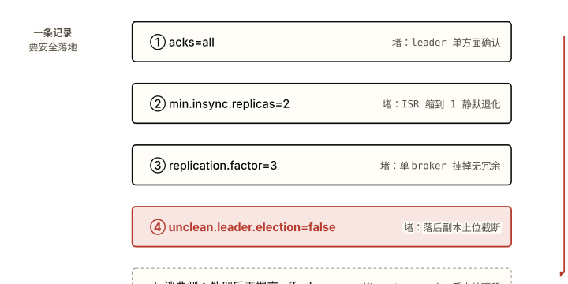

*图 4.1 "不丢消息"是四道防线（加消费侧提交时机）叠加的**组合**属性，不是某个单一开关。 **注意**：每道防线只堵一个特定的丢失窗口（标在右侧）；去掉任意一道，对应窗口就重新打开——陷阱 1–5 正是逐道防线缺失的具体后果。*

> **🤔 想一想**
>
> RF=3、`acks=all`、`min.insync.replicas=3`。一台 broker 例行重启，producer 写入会怎样？把这个配置和"`min.insync.replicas=2`"对比。
>
> <details>
> <summary>展开答案（先停 10 秒再点）</summary>
>
> `min.insync.replicas=3` 时，三个副本全部要在 ISR 里写入才成功。一台重启 → ISR 降到 2 → **不满足 3** → producer 收到 `NotEnoughReplicas`、分区停写，直到那台回到 ISR。即"任何一台不可用就停写"。
>
> 设成 `RF-1=2` 才是正解：允许挂一台仍可写、挂两台才停写，在"容忍单点故障"和"持久性"之间取平衡。把 `min.insync.replicas` 设成等于 RF 是常见的过度收紧——把可用性砍没了却没换来额外持久性。
>
> </details>

════════════════ CORRECTNESS ════════════════

<a id="ch04-correctness"></a>

### 4.2 正确性类（重复与乱序）

这一类的共同根因是**对投递语义的边界误判**：把"至少一次"当成了"恰好一次"，或把幂等的去重范围想得比实际大。全部回链 [§2.5 投递语义](#ch02-delivery)。和数据丢失不同，重复与乱序**能在下游补救**（幂等处理、去重键），所以严重度低一档——但若误以为已经"恰好一次"而不做补救，等于把可补救的问题留成了脏数据。

#### 陷阱 6：重试导致静默乱序

**症状**：单分区内消息顺序被打乱。比如同一个 key 的"创建—更新—删除"三条消息，下游收到的却是"创建—删除—更新"，状态机错乱。无任何异常。

**根因**：`max.in.flight.requests.per.connection>1`（默认 5）允许同一连接上多个未确认批次并发在途。回链 [§2.2 分区与顺序](#ch02-partition-order)：顺序只在单分区内、且依赖写入到达顺序。当批次 N 失败重试、而批次 N+1 已经先落盘，重试后的 N 排到了 N+1 后面——顺序就此颠倒。

**producer-ordering.properties**

```Properties
# 错误写法：多个在途批次 + 重试 → 重试的批次可能排到后面，顺序颠倒
max.in.flight.requests.per.connection=5
retries=2147483647
# 未开幂等

# 正确写法：开启幂等，broker 按序列号保序并去重
enable.idempotence=true
# 开启后 Kafka 自动约束 in.flight<=5、acks=all、retries>0；
# 序列号机制拒绝乱序 batch，所以重试也不会打乱顺序
```

**如何避免再次触发**：`enable.idempotence=true` 在 4.x 已是默认，但旧配置模板或显式覆盖可能关掉它。把它当成**顺序保证的开关而不只是去重开关**——它通过 broker 端维护 `(PID, partition) → 最高 seq`、只接受 seq 恰好 +1 的 append，顺带把"重试乱序"和"重试重复"两个问题一起解决。除非有明确理由，永远不要关。

#### 陷阱 7：ACK 丢失致重复，且幂等跨会话失效

**症状**：下游出现重复记录。排查发现 producer 开了幂等，单进程内确实不重复；但 producer **重启或崩溃恢复后**，重复又出现了。

**根因**：两层。第一层，broker 写入成功但 ack 在网络上丢了，producer 超时重发——幂等 producer 靠 `(PID, seq)` 能识别并丢弃这个重复。第二层（边界）回链 [§2.5](#ch02-delivery) 的 EOS 真实边界：幂等去重**只在同一个 PID + 同一 producer 会话内**有效。producer 重启会拿到**新的 PID**，broker 视之为全新生产者，旧会话发过的记录无法再去重，跨重启的重复就此漏过。

**TransactionalProducer.java**

```Java
// 错误写法：以为开了幂等就跨重启不重复——新 PID 让跨会话去重失效
props.put("enable.idempotence", "true");   // 只在单会话内去重

// 正确写法：要跨重启的恰好一次，用事务（transactional.id 靠 epoch 跨会话存活）
props.put("enable.idempotence", "true");
props.put("transactional.id", "order-writer-1");  // 稳定 ID，重启后复用
KafkaProducer<String, String> producer = new KafkaProducer<>(props);
producer.initTransactions();
try {
    producer.beginTransaction();
    producer.send(record);
    // 把消费 offset 也纳入同一事务，构成消费-转换-生产闭环
    producer.sendOffsetsToTransaction(offsets, groupMetadata);
    producer.commitTransaction();
} catch (KafkaException e) {
    producer.abortTransaction();
}
```

**如何避免再次触发**：先界定需求边界。仅需"重试不重复"用幂等即可；需要**跨进程重启**的恰好一次，必须上事务——稳定的 `transactional.id` 通过 epoch 隔离僵尸实例、跨会话存活。同时记住事务的恰好一次**只在 Kafka 的消费-转换-生产闭环内成立**，不覆盖外部副作用（DB 写、HTTP 调用、发邮件），那些仍需自己做幂等。

> **⚠️ 反直觉提醒**
>
> 幂等 producer 只在**单个进程生命周期内**去重。崩溃重启换了新 PID，去重立刻失效。把 `enable.idempotence=true` 当成端到端恰好一次，是面试和生产里最常见的过度宣称。

#### 陷阱 8：再平衡后重复处理；"先提交后处理"反而丢失

**症状**：一次消费组再平衡（扩容、重启、或处理超时驱逐）之后，一批消息被**重复处理**了一遍——下游收到重复副作用。有人为消灭重复而改成"先提交 offset 再处理"，结果重复消失了，但崩溃时变成了丢失。

**根因**：默认是至少一次（先处理后提交）。回链 [§2.4 消费组与再平衡](#ch02-rebalance)：消费者在处理完、提交 offset **之前**崩溃或被驱逐，那批在途消息会在新 owner 上重投——这是至少一次的固有代价，正确做法是让处理幂等。反向的"先提交后处理"把语义改成了至多一次：offset 已提交但处理还没做就崩溃，那批消息再也不会投递，从重复翻转成**丢失**。感觉更安全的早提交，其实更危险。

**IdempotentConsumer.java**

```Java
// 错误写法：先提交后处理 → 崩溃时消息丢失（at-most-once）
for (var r : records) {
    consumer.commitSync();   // 先提交
    process(r);              // 还没处理就崩溃 → 这条永久跳过
}

// 正确写法：先处理后提交（at-least-once）+ 处理本身做成幂等
for (var r : records) {
    // 用业务唯一键去重：同一 key 重复到达时是 no-op
    upsertByBusinessKey(r.key(), r.value());   // 例如 INSERT ... ON CONFLICT DO NOTHING
}
consumer.commitSync();       // 处理完整批再提交；崩溃只会重投，幂等吸收
```

**如何避免再次触发**:接受"至少一次 + 消费侧幂等"是默认且正确的组合，不要试图靠调整提交时机消灭重复——那只会把丢失风险引进来。幂等的实现方式：业务唯一键 upsert、去重表、或下游天然幂等的操作。需要真正端到端恰好一次时回到陷阱 7 的事务方案。

> **⚠️ 反直觉提醒**
>
> "先提交后处理"把失败模式从**重复**翻转成**丢失**。重复可以靠幂等吸收，丢失不能——所以感觉更安全的早提交，才是更危险的那个。

#### 陷阱 9：schema 演进卡死消费者

**症状**：producer 上线了一个新版本消息格式后，部分消费者开始大面积反序列化失败、整个消费组卡在某个 offset 推进不动，错误是 schema 不兼容。

**根因**:producer 发布了一个不兼容的 schema 变更（如删字段、改类型、加无默认值的必填字段）。Schema Registry 默认兼容模式是 `BACKWARD`——只保证**新 schema 能读旧数据**，且**只对紧邻的上一版、非传递**。在 producer 和 consumer 混版本部署、消费者读到比自己新的 schema 写的数据时，`BACKWARD` 兜不住。这条不直接对应 02 章某机制，根因在 schema 契约管理而非 broker——但它和顺序/投递一样属于"正确性"失败：消息在但读不出。

**schema-compat.properties**

```Properties
# 错误写法：默认 BACKWARD，混版本舰队中新写旧读会失败
# （删字段 / 改类型 / 加必填无默认值字段都会破坏兼容）

# 正确写法：混版本部署用 FULL_TRANSITIVE，并约束变更类型
# Schema Registry subject 级配置：
compatibility=FULL_TRANSITIVE
# 变更纪律：只新增可选字段 / 带默认值字段；不删、不改类型、不加必填项
```

**如何避免再次触发**:对生产者消费者混版本滚动部署的 topic，把 subject 兼容模式设为 `FULL_TRANSITIVE`（新旧互相可读、且对所有历史版本传递成立）。配套变更纪律：只加可选/带默认值的字段，绝不删字段、改类型或加必填项。把 schema 变更纳入 CI 校验，不兼容的变更在合并前就拦下。

════════════════ PERFORMANCE / OPS ════════════════

<a id="ch04-performance"></a>

### 4.3 性能与运维类

这一类严重度最低——不丢数据、不破坏正确性，但会让吞吐归零或资源耗尽。共同根因是**把并行单位（分区）和协调成本（再平衡）想得太理想**，全部回链 [§2.2 分区](#ch02-partition-order) 与 [§2.4 再平衡](#ch02-rebalance)。

#### 陷阱 10：再平衡风暴，吞吐归零

**症状**:消费组 lag 持续上涨、吞吐周期性归零，日志里反复出现成员离组又入组。集群没挂、消息也没丢，但消费几乎停滞。

**根因**:单批处理时间超过 `max.poll.interval.ms`（默认 5 分钟），或 `session.timeout.ms` 设得过紧。回链 [§2.4](#ch02-rebalance) 的关键代价：心跳跑在后台线程，但成员**存活由 `poll()` 调用证明**。处理太慢 → 两次 `poll()` 间隔超限 → coordinator 判定成员死亡 → 触发再平衡 → 分区重分配 → 慢消费者重新加入又再次超时 → 循环。在 eager（急切式）协议下每次再平衡都是 stop-the-world，整组停摆。

> **🧩 例 · 真实案例**
>
> 某 240 个消费者的服务做滚动重启。重启后实例首次心跳约 38 秒到达，超过 30 秒的 `session.timeout.ms`，于是每个实例都先被判死、再入组，叠加滚动节奏，整组陷入约 **9 分钟**的再平衡 churn、消费停滞。启用 **static membership** 后，重启的实例凭 `group.instance.id` 认领回原分配、不触发再平衡——再平衡次数从 30+ 降到 0。

**rebalance-tuning.properties**

```Properties
# 错误写法：批太大处理超时 + eager 协议 + 无 static membership
max.poll.records=500
session.timeout.ms=30000           # 滚动重启首次心跳就可能超

# 正确写法：减小批量 + 协作式增量再平衡 + 静态成员
max.poll.records=100                       # 缩短单批处理时间
partition.assignment.strategy=org.apache.kafka.clients.consumer.CooperativeStickyAssignor
group.instance.id=consumer-instance-7      # 每实例唯一且稳定 → 重启不触发再平衡
session.timeout.ms=45000                   # 给滚动重启留出首次心跳余量
```

**如何避免再次触发**:三管齐下。① 把单批处理时间控制在 `max.poll.interval.ms` 内（减小 `max.poll.records` 或加速处理）；② 用协作式增量再平衡（`CooperativeStickyAssignor`），只移交需要变动的分区、其余继续消费，没有全局 stop-the-world；③ 给每个实例配稳定的 `group.instance.id` 启用 static membership，让重启不触发再平衡。4.0 的 KIP-848 把再平衡逻辑移到 broker 端、增量收敛，进一步压缩 churn。

#### 陷阱 11：加消费者反而 lag 增大

**症状**:lag 高，于是给消费组扩容；扩容后吞吐没上去，lag 反而比扩容前更大。

**根因**:回链 [§2.4](#ch02-rebalance)。在 eager 协议下，每加入一个新成员都触发一次 stop-the-world 再平衡——全组暂停消费、重算分配、重新拉起。如果组本身已经不稳定（处理偏慢、临近超时），新成员加入引发的再平衡会进一步挤占处理时间，把组推向陷阱 10 的风暴。另一种情形：分区数已经等于消费者数，再加的消费者**分不到分区**、纯闲置，却仍参与了那次再平衡的代价。

> **⚠️ 反直觉提醒**
>
> 加消费者**可能让 lag 更糟**。每次 join 都是一次再平衡（eager 下还是 stop-the-world）；分区数是消费并行度的硬上限，超过分区数的消费者只会闲置并徒增协调成本。

**如何避免再次触发**:扩容前先确认两件事——组是否稳定（不在临界超时），以及分区数是否还有余量（消费并行度上限 = 分区数）。先切到协作式增量再平衡再扩容，避免扩容动作本身引发 stop-the-world。若分区数已是瓶颈，问题在分区规划（陷阱 14），加消费者无效。

#### 陷阱 12：慢消费者阻塞 poll 线程

**症状**:消费者偶尔因下游（数据库、HTTP）变慢而处理时间拉长，紧接着就被判死、触发再平衡，形成"下游抖动 → 再平衡 → 更慢"的连锁。

**根因**:在 `poll()` 循环里直接做重活（同步 DB 写、外部 HTTP 调用）。回链 [§2.4](#ch02-rebalance)：`poll()` 既拉消息又承担"成员存活"的证明，处理阻塞在 poll 线程上就等于心跳停摆。一旦单批处理超过 `max.poll.interval.ms`，成员被判死。

**PauseResume.java**

```Java
// 错误写法：重活直接堵在 poll 线程上，下游变慢即超时被驱逐
while (true) {
    var records = consumer.poll(Duration.ofMillis(100));
    for (var r : records) slowDbWrite(r);   // 阻塞 → 错过下一次 poll → 判死
}

// 正确写法：卸到工作线程，poll 线程用 pause/resume 维持存活而不超时
var partitions = consumer.assignment();
while (true) {
    var records = consumer.poll(Duration.ofMillis(100));
    if (!records.isEmpty()) {
        consumer.pause(partitions);          // 暂停拉取，但继续 poll 维持心跳
        submitToWorkerPool(records);         // 重活交给工作线程
    }
    if (workerPoolIdle()) {
        consumer.resume(partitions);         // 处理跟上后恢复拉取
        commitProcessedOffsets(consumer);    // 按已完成进度提交
    }
}
```

**如何避免再次触发**:保持 poll 线程轻量——只拉取和派发，重活卸到工作线程池。用 `pause()`/`resume()` 在工作线程忙时停止拉取新数据、同时继续调用 `poll()` 维持存活计时器，避免假死驱逐。offset 严格按工作线程**实际完成**的进度提交。

#### 陷阱 13：热分区 / key 倾斜

**症状**:某一个消费者实例 CPU/lag 居高不下、其余实例几乎空闲，整组吞吐被这一个实例拖住。扩容无效。

**根因**:回链 [§2.2](#ch02-partition-order):相同 key 经 murmur2 哈希落到同一分区以保证顺序。若 key 选择导致分布极度不均（例如按租户分区、而某个大租户占了大半流量），该租户的分区成为热点、承接它的消费者过载。Kafka **不会自动均衡**倾斜的负载——分区是固定归属的。

**如何避免再次触发**:选**高基数、分布均匀**的分区 key（用 `orderId` 而非 `userId`，用 `userId` 而非 `tenantId`）。若业务要求按某低基数维度保序、又无法承受倾斜，考虑复合 key（如 `tenantId + orderId`）在保序粒度和均衡之间折中。规划阶段就用真实流量分布压测分区热度，别等上线发现单分区被打爆。

#### 陷阱 14：分区数过多/过少，不可减，加分区破坏顺序

**症状**:三种。其一，消费并行度卡死——消费者数想加却加不上去（分区太少）。其二，controller 故障切换慢、broker 文件句柄耗尽报错（分区太多）。其三，给一个有 key 的 topic 加了分区后，下游按 key 的顺序全乱了。

**根因**:回链 [§2.2](#ch02-partition-order)。分区是并行的单位，消费者数不能超过分区数，**过少**则并行度被锁死。**过多**则每个 segment 占 2 个文件句柄（默认 ulimit 1024 很快耗尽）、且抬高 controller 元数据与故障切换开销（KRaft 缓解但不消除）。最隐蔽的是：分区数**只能加不能减**，而给有 key 的 topic 加分区会改变 `key % 分区数` 的映射——同一个 key 从此哈希到不同分区，**历史顺序与未来顺序在不同分区之间永久错位**。

> **⚠️ 反直觉提醒**
>
> 分区数**永远不能减**，且给有 key 的 topic **加分区会静默破坏 key 顺序**——murmur2 哈希的目标分区变了，同 key 消息散到新旧不同分区。分区越多也不等于越能扩展：故障切换时间、文件句柄、端到端延迟都会被推高。

**如何避免再次触发**:分区数当成**难以回退的容量决策**来定——按目标吞吐、单分区吞吐上限、未来消费并行需求保守预估，留一定余量但不盲目设大。确需调整且不能容忍顺序错乱时，**新建一个分区数合适的 topic、双写或迁移**，而不是在原 topic 上加分区。无 key（顺序无关）的 topic 加分区才是安全的。

#### 陷阱 15：消息过大，三个尺寸配置不匹配

**症状**:producer 抛 `RecordTooLargeException`，或消费端拉取失败/卡住，或大消息能写入却复制不出去（与陷阱 4 的第二形态同源）。

**根因**:四个尺寸配置分散在三端、彼此不一致——producer 的 `max.request.size`、broker 的 `message.max.bytes`、consumer 的 `fetch.max.bytes`，以及复制路径的 `replica.fetch.max.bytes`。任意一个小于实际消息体，对应环节就断：producer 端拒发、broker 端拒收、consumer 端拉不动、follower 端复制不了。回链 [§2.1 存储](#ch02-storage):记录是顺序写进 segment 的字节流，每一跳都有自己的尺寸上限。

**message-size.properties**

```Properties
# 错误写法：四个尺寸各自为政，某一跳卡住
max.request.size=1048576           # producer 1 MiB
message.max.bytes=10485760         # broker 10 MiB
fetch.max.bytes=1048576            # consumer 1 MiB —— 拉不动 broker 上的大消息

# 正确写法：四者按同一上限对齐推导（示例统一到 10 MiB）
max.request.size=10485760          # producer
message.max.bytes=10485760         # broker
replica.fetch.max.bytes=10485760   # broker 复制路径，>= message.max.bytes
fetch.max.bytes=10485760           # consumer
```

**如何避免再次触发**:把四个尺寸当成一组联动配置、从单一上限统一推导，写进配置模板而非各端独立设置。更根本的设计：**大对象不要走 Kafka**。Kafka 适合高吞吐的小记录；大文件用 **claim-check 模式**——把对象存到 S3/对象存储，消息体里只放一个指针（URL/key），消费者凭指针去取。这同时避开了尺寸配置地狱和大消息对 page cache 的污染。

> **🤔 想一想**
>
> 一个有 key 的 topic 当前 6 分区，消费组 6 个实例刚好打满，lag 仍在涨。直接把分区加到 12 行不行？
>
> <details>
> <summary>展开答案（先停 10 秒再点）</summary>
>
> 不行——加分区会把 `key % 6` 变成 `key % 12`，同一个 key 从此哈希到不同分区，**破坏所有下游按 key 的顺序**（陷阱 14）。而且要先确认 lag 涨的根因：若是单批处理太慢或下游瓶颈，加分区/加消费者都不解决（陷阱 10、12）。
>
> 正确路径：先定位是并行度不足还是处理慢。确属分区数瓶颈、且需保序，就**新建 12 分区的 topic 迁移**，而不是原地加分区。若顺序无关，原地加分区才安全。
>
> </details>

════════════════ ANTI-PATTERNS / WHEN NOT ════════════════

<a id="ch04-anti-patterns"></a>

### 4.4 反模式与"什么时候不要用 Kafka"

前面 15 条失败模式的总和，反过来勾出 Kafka 的适用边界。它是分布式可重放的分区日志——这套设计在某些场景是错的工具，硬上会持续与机制对抗。这一节服务后面的[选型判断](#chapter-05)。

#### 常见反模式

- **把 Kafka 当请求-响应的 RPC 用**:日志模型是单向追加 + 异步消费，没有内建的"响应"通道。硬做要靠关联 ID + 临时响应 topic，延迟和复杂度都远高于直接用 RPC。
- **用消费者数超过分区数来追求并行**:并行上限是分区数，多出的消费者纯闲置（陷阱 11、14）。
- **用大量短命 topic 或海量分区做隔离**:抬高 controller 负担、文件句柄、故障切换时间（陷阱 14）。
- **把大文件直接塞进消息体**:污染 page cache、撞尺寸上限——用 claim-check（陷阱 15）。
- **靠默认配置上生产**:RF=1、auto-commit、ISR 无下限都是会丢数据的默认（陷阱 3、4、5）。

#### 什么时候不要用 Kafka

**表 4.1 · Kafka 不擅长的场景与更合适的替代**

| 场景 | 为什么 Kafka 是错的工具 | 更合适的方向 |
| --- | --- | --- |
| 低吞吐、消息量小 | 分区/副本/消费组的运维与认知成本，换不回日志模型的吞吐优势 | 传统消息队列 / 数据库表轮询 |
| 复杂的逐条路由 | 无内建按内容路由（topic exchange、header 路由）；要在消费端自行分发 | RabbitMQ 等带 exchange 路由的 broker |
| 需要内建重试 / 死信队列 | 无原生 per-message 重试与 DLQ，需自建重试 topic + 计数 | RabbitMQ / SQS（原生 DLQ） |
| 优先级队列 | 分区日志严格按追加顺序，无消息优先级概念 | 支持 priority 的队列系统 |
| 请求-响应 / 同步调用 | 单向异步日志，没有响应通道 | gRPC / HTTP / RPC 框架 |
| 小团队、无专职运维 | 即便 KRaft 简化了架构，集群容量规划、分区/ISR/再平衡调优仍有持续运维成本 | 托管队列 / 云原生消息服务 |
| 高吞吐事件流 + 可重放 + 多消费组独立消费 | 正是日志模型的主场：顺序 I/O、消费不删数据、offset 在消费侧 | 选中 Kafka |

> **💡 洞察 · "更快的队列"是红旗**
>
> 把 Kafka 当"更快的 MQ"会持续撞上这一章的失败模式——因为它不是队列，是日志。需要逐条路由、优先级、内建 DLQ、同步响应时，硬用 Kafka 等于跟它的设计取舍对着干。资深判断不是"什么都用 Kafka"，而是认得出哪些负载与日志模型对齐、哪些不对齐。KIP-932 的 share group（4.2 GA）为部分队列语义场景提供了原生选项，但它仍架在日志之上，不改变上面这些边界。

════════════════ SELF-CHECK ════════════════

<a id="ch04-self-check"></a>

### § 本章 self-check

先合上教程，把你能想到的答案写在纸上或编辑器里。 写完再点开答案对照——直接点开等于把这一节当再读一遍。

1. 一个面试官给出说法"设了 `acks=all`，所以不会丢消息"。指出这个说法的漏洞，并给出端到端不丢消息的完整配置组合（含消费侧）。
2. `enable.auto.commit=true` 在什么具体时序下会丢消息？为什么把它关掉反而让失败模式变得"可补救"？
3. 幂等 producer（`enable.idempotence=true`）能保证跨进程重启不重复吗？说明它的去重边界，以及要跨重启恰好一次该用什么。
4. (设计题) 一个有 key 的 6 分区 topic，6 个消费者打满后 lag 仍涨。逐步说明你会怎么定位根因，以及为什么"直接加分区到 12"是错的。

<details>
<summary>答案（先做完再展开）</summary>

1. `acks=all` 的语义是"所有 ISR 成员确认"，ISR 缩到 1 时它退化成 `acks=1`（陷阱 3）。完整组合：`acks=all` + `min.insync.replicas=2` + `replication.factor=3` + `unclean.leader.election.enable=false`，**外加消费侧处理后再提交 offset**。任缺一道就有丢失窗口（图 4.1）。设计上 `min.insync.replicas = RF-1` 以容忍单点故障同时保持可写。
2. auto-commit 按 `auto.commit.interval.ms` 定时提交最近一次 `poll()` 返回的 offset，与业务是否处理完无关。时序：poll 返回 1000 条，处理到第 501 条时定时器提交了 offset=1000，进程随即崩溃 → 重启从 1001 开始，502–1000 未处理却已提交、永久跳过（陷阱 5）。关掉它、改成处理完再 `commitSync()`，失败模式从"丢失"翻转成"重复"，而重复能用消费侧幂等吸收，丢失不能。
3. 不能。幂等去重只在**同一个 PID + 同一 producer 会话**内有效；进程重启拿到新 PID，旧会话的记录无法再去重（陷阱 7）。要跨重启恰好一次需用事务：稳定的 `transactional.id` 靠 epoch 跨会话存活、隔离僵尸实例。且事务的恰好一次只在 Kafka 消费-转换-生产闭环内成立，不覆盖 DB 写、HTTP 等外部副作用。
4. 先定位根因而非急着扩容：① 看单个实例是否倾斜（热分区/key 倾斜，陷阱 13）；② 看单批处理时间是否接近 `max.poll.interval.ms` 或下游是否是瓶颈（陷阱 10、12）——若是，加分区/加消费者都无效；③ 确认并行度是否真被分区数卡死。直接加分区到 12 会把 `key % 6` 变成 `key % 12`、破坏所有下游按 key 顺序（陷阱 14）。确属分区瓶颈且需保序时，新建 12 分区 topic 迁移，而非原地加分区。

</details>

> **🎯 进阶挑战 · 刚好够不着**
>
> #### 给一条"绝不丢、可容忍重复"的支付事件链做端到端配置
>
> 一条支付成功事件，要求：绝不丢失、可容忍重复（下游有幂等去重）、单账户内严格有序、能容忍一台 broker 故障仍可写。写出 producer、broker/topic、consumer 三端的关键配置，并说明分区 key 怎么选、为什么不需要事务。
>
> <details>
> <summary>提示（卡住再展开）</summary>
>
> 持久性走四道防线（图 4.1）；有序靠 `enable.idempotence=true` + 合适的分区 key（账户维度保序，但注意倾斜——见陷阱 13）；"可容忍重复"意味着**不需要事务**，至少一次 + 消费侧幂等就够（陷阱 8）。容忍一台故障 ⇒ `min.insync.replicas = RF-1 = 2`。逐项对照陷阱 1/2/3/6/8 的"正确写法"。
>
> </details>

#### 本章参考

- [Apache Kafka 官方文档 · Design](https://kafka.apache.org/documentation/#design)（官方 · 复制、acks、ISR 语义）
- [New Relic — Kafka consumer auto-commit 与数据丢失](https://newrelic.com/blog/best-practices/kafka-consumer-config-auto-commit-data-loss)（auto-commit 丢消息时序）
- [Confluent — 如何选择 topic 与分区数](https://www.confluent.io/blog/how-choose-number-topics-partitions-kafka-cluster/)（分区过多/过少代价）
- [Confluent — Incremental Cooperative Rebalancing](https://www.confluent.io/blog/incremental-cooperative-rebalancing-in-kafka/)（再平衡风暴、协作式协议、static membership 案例）
- [Confluent — Transactions & EOS](https://www.confluent.io/blog/transactions-apache-kafka/)（幂等边界、事务跨会话恰好一次）


---

<a id="chapter-05"></a>

Chapter 05

## 综合实战：订单事件系统的选型与判别

01 章把 Kafka 框成[一条可重放的分区日志](#ch01-log-model)，02 章拆开了[副本](#ch02-replication)/[再平衡](#ch02-rebalance)/[投递语义](#ch02-delivery)的设计取舍，03 章把它写成可跑的代码，04 章列出[机制被违反时的失败模式](#ch04-data-loss)。本章不再逐节讲机制，而是把前四章塞进一个真实系统：一个电商订单事件平台。它逼出的不是"怎么实现某步"，而是**判别**——同一个决策点，这里该用 01 的概念还是 02 的机制，该选 Kafka 还是别的工具。

本章你将建立的 schema

- 把"一份数据、多消费组、各自 offset"从概念落到一张订单系统架构图上
- 分区 key、acks 组合、消费语义、顺序范围四类决策——每类都是一次跨章判别，没有放之四海的默认答案
- 选型判别：同一个系统里，为什么主干用 Kafka、某个下游反而该用 RabbitMQ、什么时候考虑 share group
- 用可观测行为（重启不重复扣、kill broker 不丢、同单严格有序）来验收设计，而不是"看起来对"

============================== 架构图 (Figure 5.1) ==============================

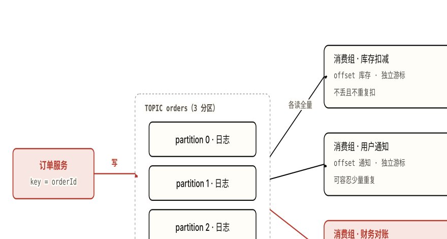

*图 5.1 一份订单日志，三个消费组各读各的、各存各的 offset。 **注意**：三条出边都从同一个 `orders` topic 出发——数据**不被复制三份**，三组各自持有独立游标（这正是 01 章"[offset 在消费者侧](#ch01-log-model)"）。三组对"丢失/顺序/重复"的要求不同（朱红标注），所以下面每个决策都要分组回答，而不是一刀切。*

============================================================ §5.1 项目背景 ============================================================

<a id="ch05-background"></a>

### 5.1 项目背景：订单事件平台

一个电商平台的订单服务，每当一笔订单发生状态变化就产生一个事件：**订单创建**、**订单支付**、**订单发货**。这些事件统一写进一个 `orders` topic。三个互不相关的团队各自起一个消费组来读这条流：

- **库存扣减（inventory）**：订单支付后扣减对应 SKU 库存。要求**不丢**（少扣会超卖）**且不重复扣**（重复扣会少卖、库存账错）。扣减动作落在一个外部库存数据库上。
- **用户通知（notification）**：给用户发短信/推送"订单已支付""已发货"。要求不丢（用户该收到），但**可容忍少量重复**——偶尔多收一条推送是体验问题，不是数据正确性问题。
- **财务对账（reconciliation）**：把订单事件写进对账系统、生成财务流水。要求**严格不丢**（少一笔对不平）**且按订单顺序处理**——同一笔订单的"创建→支付→发货"必须按发生顺序入账，否则状态机错乱。

> **🧠 量级与需求画像**
>
> **吞吐**：大促峰值约每秒数万条订单事件，平时每秒数千条——属于[高吞吐事件流](#ch04-anti-patterns)，远超"低吞吐小消息"的反场景。
>
> **顺序**：只在**单笔订单内部**需要先后顺序（创建先于支付先于发货）。两笔不同订单之间没有顺序约束。没有任何下游需要"全平台所有订单的全局总序"。
>
> **可靠性**：库存与对账是*不能丢*的强一致诉求；通知是*尽量别丢、但重复无害*的弱诉求。一份数据上，三组的可靠性等级不同。
>
> **重放**：对账系统改了计算口径要重算上月流水、库存对错了要从某天重新推演——都需要把消费组 offset 重置后重放历史。这是选 Kafka（而非删除式队列）的硬需求之一。

这套画像把"选 Kafka"几乎写死了：高吞吐 + 一份数据多组独立消费 + 需要重放，正是 [04 章表 4.1 的"选中"行](#ch04-anti-patterns)。但"选了 Kafka"只是起点——真正的工程判断在下面四个决策点上，每一个都没有"标准答案"，只有"对这一组、在这个量级下"的答案。

============================================================ §5.2 设计任务（判别决策） ============================================================

<a id="ch05-decisions"></a>

### 5.2 设计任务：五个判别决策

下面每一行都是一次**判别**：给出备选、给出这个场景下的选择、给出"为什么不选另一条"。每个决策点回链到前面定义过它的章节——判别题考的从来不是记住配置名，是[对取舍的推理](#ch04-anti-patterns)。

**表 5.1 · 订单系统的五个跨章判别决策**

| 决策点 | 备选 | 这个场景选哪个 / 为什么 |
| --- | --- | --- |
| ① 分区 key<br>01 §1.3 · 02 §2.2 · 04 §4.3 | `userId` 做 key / `orderId` 做 key / 不带 key | 选 **`orderId`**。同单事件靠相同 key 落同一分区从而有序（满足对账的按订单有序）；`orderId` **高基数**，分布均匀。`userId` 会让大客户的所有订单挤进一个分区造成[热分区倾斜](#ch04-performance)；不带 key 则同单事件会按 sticky partitioner 散到不同分区、丢掉顺序保证。 |
| ② 持久性组合<br>02 §2.3 · 04 §4.1 | `acks=1` / `acks=all` 单独 / `acks=all`+`min.insync=2`+RF=3+`unclean=false` | 对账与库存选**四件套组合**。只设 `acks=all` 会在 ISR 缩到 1 时[静默退化成 `acks=1`](#ch04-data-loss)；持久性的真实来源是 `min.insync.replicas`。设 `min.insync=RF-1=2`：挂一台仍可写、挂两台拒写。`unclean.leader.election=false` 堵住落后副本上位截断已提交记录。 |
| ③ 库存的消费语义<br>02 §2.5 · 04 §4.2 | at-least-once + 消费侧幂等 / 事务 EOS（`read_committed`） | 选 **at-least-once + 消费侧幂等**。库存扣减的副作用落在**外部数据库**，而 [Kafka 事务的精确一次只在 Kafka 闭环内成立](#ch02-delivery)、覆盖不到 DB 写。用幂等键（`orderId`+事件类型）做 upsert/唯一约束去重，比上事务更简单、且真正挡住重复。事务 EOS 在这里既增延迟又解决不了外部副作用。 |
| ④ 对账的顺序范围<br>01 §1.3 · 02 §2.2 | 全局严格顺序（单分区）/ 按订单顺序（分区内有序） | 选**按订单顺序**。业务只要求"同一笔订单的事件有序"，不需要跨订单全局序。靠 ② 的 `orderId` key 已经做到分区内有序。强上全局顺序要把 topic 压成**单分区**，[并行度归 1、吞吐被杀死](#ch02-partition-order)——为一个业务不需要的保证付全部吞吐的代价。 |
| ⑤ 选型 / 消费模型<br>04 §4.4 | 整体 Kafka / 某下游换 RabbitMQ / 普通 consumer group vs share group | 主干**选 Kafka**（高吞吐+多组+重放）。但若**通知组**后续要按通知渠道做复杂逐条路由、要原生重试/死信队列，[那一段反而更适合 RabbitMQ](#ch04-anti-patterns)。若通知组要消费者数超过分区数、且每条独立 ack，可考虑 **share group**（KIP-932，4.2 GA）。详见 §5.3。 |

表里五行有一个共同点值得停下来看：**同一个系统、同一份数据，三个消费组的最优答案不一样**。对账要四件套 + 严格按序，通知可以松到能丢一点点配置、甚至换个 broker。把"全系统一套配置"当默认，是这道题最常见的错——判别的核心就是*认出哪一组该用哪条机制*。

> **🤔 想一想**
>
> 决策 ① 选了 `orderId` 做 key。如果某天发现 `orders` 分区不够、想从 3 个加到 6 个，对"同一订单事件有序"这个保证会发生什么？
>
> <details>
> <summary>展开答案（先停 10 秒再点）</summary>
>
> 会被**破坏**。分区路由是 `murmur2(orderId) % 分区数`，把分区数从 3 改成 6，`% 3` 变 `% 6`，**已有订单的 key→分区映射全部改变**。一笔正在进行中的订单，它"创建/支付"时算出分区 1、加分区后"发货"算出分区 4——同一订单的事件**分散到两个分区**，分区内有序的前提没了，对账会出现先读到发货、后读到支付的乱序。
>
> 这正是 04 章"[加分区静默破坏 key 顺序、且分区不可减](#ch04-performance)"。正确做法：保守预估分区数，真要扩容就**新建一个目标分区数的 topic 迁移**，而不是原地加分区。这道题指向"分区数是早期就要算准的不可逆决策"。
>
> </details>

============================================================ §5.3 选型判别 + 决策树 ============================================================

<a id="ch05-discrimination"></a>

### 5.3 选型判别：Kafka / share group / RabbitMQ

决策 ⑤ 值得单独展开，因为它最考"是不是真懂 Kafka 的边界"。一个常见的红旗是把 Kafka 当"更快的队列"，于是什么场景都往上套。[04 章那张"什么时候不要用 Kafka"的表](#ch04-anti-patterns)反过来定义了它的主场。下面这棵决策树把判别路径画出来——从负载特征一路走到具体选项。

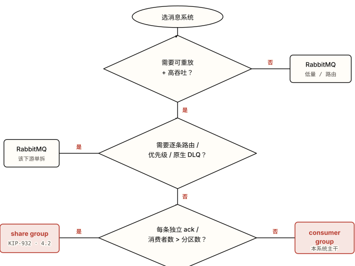

*图 5.2 消息系统选型决策树：三道菱形把负载特征筛到四个终点。 **注意**：终点不是"二选一"，而是**可以在一个系统里共存**——订单主干走右下的 consumer group（朱红），通知这种带复杂路由的下游可以单独切到 RabbitMQ。"全用 Kafka"或"全不用"都是把判别题做成了站队题。*

#### 三道判别问各自在问什么

- **Q1 可重放 + 高吞吐？** 这是 Kafka 的存在理由。订单系统要重放历史对账、峰值数万条/秒——是。低吞吐、不需要重放的小系统，分区/副本/再平衡的[运维与认知成本换不回收益](#ch04-anti-patterns)，传统队列更省。
- **Q2 逐条路由 / 优先级 / 原生 DLQ？** Kafka 是**分区日志**，没有 exchange 式按内容路由、没有消息优先级、没有原生 per-message 重试与死信队列。通知组若要"按渠道路由 + 失败自动进 DLQ 重试"，在 Kafka 上要自建重试 topic + 计数，[RabbitMQ 原生就有](#ch04-anti-patterns)——这一个下游单独用 RabbitMQ 是合理的混合架构，不是失败。
- **Q3 每条独立 ack / 消费者数 > 分区数？** 普通 consumer group 的并行上限[死等于分区数](#ch01-producer-consumer)、且按分区批量推进 offset。share group（KIP-932，4.2 GA）提供队列语义：按记录 ack、消费者数不再受分区数限制。通知这种*无序、想用很多消费者摊平瞬时积压*的场景适合它；但它仍架在日志之上，不改变 Q1/Q2 的边界。

> **💡 洞察 · 判别不是站队**
>
> 资深信号不是"全用 Kafka"也不是"知道 Kafka 不好就不用"，而是**认得出同一系统里哪条流与日志模型对齐、哪条不对齐**。订单主干（高吞吐、多组、要重放、按 key 有序）是 Kafka 的主场；通知里的复杂路由那一小块是 RabbitMQ 的主场。把它们硬塞进一个工具，就会持续撞上[04 章那张表](#ch04-anti-patterns)里的失败模式。

============================================================ §5.4 自己实现 ============================================================

<a id="ch05-implement"></a>

### 5.4 自己实现（先别看参考实现）

把 §5.2 的五个决策落成代码。**先合上参考实现，自己写一版**——判别题的价值在于你做了选择、并能说出为什么；直接看答案等于把这章读成了配置清单。

#### 任务

为订单系统写出两段东西：

- **可靠 producer 配置**：订单服务发 `orders` 事件，对账与库存不能丢、同单有序。写出 producer 端 + topic/broker 端的关键配置，并标注 key 怎么选。
- **幂等库存消费者**：消费 `orders`、对支付事件扣减外部库存 DB，做到重启不重复扣。写出 poll 循环 + offset 提交时机 + 去重逻辑的位置（去重落在哪一侧）。

#### 验收 checklist（用可观测行为验，不靠"看起来对"）

- **重启不重复扣**：消费者处理到一半 `kill -9`，重启后那批被重投，但库存 DB 的最终扣减量**与只处理一次相同**（幂等键挡住重复）。
- **kill 一个 broker 不丢已确认订单**：producer 回调已拿到 offset 的订单，在 kill 掉一个 broker（含 leader 切换）后，下游仍能读到——没有"已 ack 却消失"的记录。
- **同一订单严格有序**：对 `order-X` 连发 创建→支付→发货，对账消费组读到的顺序**必然**是创建在前、发货在后，永不倒置。
- **三组互不影响**：把通知组 offset 重置到 24 小时前重放，库存组和对账组的进度**不受任何影响**。

> **⚠️ 验收陷阱**
>
> "重启不重复扣"不能靠"消费者没崩过"来证明——要**主动 `kill -9`** 制造重投再看 DB 结果。一个只在happy path 跑通的实现，会在第一次再平衡或崩溃时暴露重复扣减。验收的是[失败路径的可观测行为](#ch04-correctness)，不是正常路径。

<details>
<summary>参考实现（写完自己版本再展开）</summary>

**① 可靠 producer + topic 配置**。四件套（图 4.1 的四道防线）+ 启用幂等 producer + `orderId` 做 key：

**OrderProducer.java**

```Java
Properties p = new Properties();
p.put("bootstrap.servers", "broker1:9092,broker2:9092,broker3:9092");
p.put("key.serializer",   "org.apache.kafka.common.serialization.StringSerializer");
p.put("value.serializer", "org.apache.kafka.common.serialization.StringSerializer");

// —— 持久性四件套里的 producer 端两项（其余两项在 topic/broker 端，见下）——
p.put("acks", "all");              // 等所有 ISR 成员确认，而非 leader 单方面（堵陷阱 1）
p.put("enable.idempotence", "true"); // PID+序列号去重并强制保序；in-flight<=5 仍有序（堵正确性类乱序）
// enable.idempotence=true 会隐式要求 acks=all、retries>0，4.0 起默认即开

KafkaProducer<String, String> producer = new KafkaProducer<>(p);

void publish(OrderEvent e) {
    // 关键：key = orderId（高基数、避免热分区；同单事件同分区 → 分区内有序）
    var record = new ProducerRecord<>("orders", e.getOrderId(), e.toJson());
    producer.send(record, (md, ex) -> {
        if (ex != null) handleSendFailure(e, ex);   // 失败要可观测，别吞异常
    });
}
```

**orders-topic.properties（topic / broker 端）**

```Properties
# 持久性四件套的另外两项 + 不可逆截断的闸门
replication.factor=3                  # 三副本，单 broker 挂不丢分区（堵陷阱 4）
min.insync.replicas=2                 # = RF-1：挂一台仍可写、挂两台拒写（堵陷阱 3 的静默退化）
unclean.leader.election.enable=false  # 禁止落后副本上位截断已提交记录（堵陷阱 2）

# 分区数：按峰值吞吐与消费并行预估，且预留余量——加分区会破坏 key 顺序、且不可减
num.partitions=3
```

**为什么不选事务/EOS 做 producer 端**：对账与库存"不丢 + 不重复"的需求，由"四件套保证不丢" + "消费侧幂等保证不重复"组合即可满足。订单服务是*纯生产者*，不在"消费-转换-生产"闭环里，[事务的原子 offset 提交](#ch02-delivery)用不上；强上事务只增延迟。

**② 幂等库存消费者**。关掉 auto-commit、处理后再提交、去重落在**外部 DB 侧**（因为副作用在 DB，Kafka 事务管不到）：

**InventoryConsumer.java**

```Java
Properties c = new Properties();
c.put("bootstrap.servers", "broker1:9092,broker2:9092,broker3:9092");
c.put("group.id", "inventory");        // 独立消费组：与通知/对账各自维护 offset
c.put("key.deserializer",   "org.apache.kafka.common.serialization.StringDeserializer");
c.put("value.deserializer", "org.apache.kafka.common.serialization.StringDeserializer");
c.put("enable.auto.commit", "false");  // 关掉定时提交：否则提交的是 poll 返回的、不是处理完的（堵陷阱 5）

KafkaConsumer<String, String> consumer = new KafkaConsumer<>(c);
consumer.subscribe(List.of("orders"));

while (running) {
    var records = consumer.poll(Duration.ofMillis(500));
    for (var r : records) {
        OrderEvent e = OrderEvent.parse(r.value());
        if (e.getType() == PAID) {
            // 去重落在 DB 侧：幂等键 = orderId + 事件类型，唯一约束/upsert 挡住重投
            // 即使这批被重投（at-least-once），DB 的扣减结果与处理一次相同
            inventoryDb.deductIdempotent(e.getOrderId(), e.getSku(), e.getQty());
        }
    }
    consumer.commitSync();   // 整批处理完再提交：崩溃只会重投（可被幂等吸收），不会丢
}
```

**每个决策"为什么选 X 不选 Y"小结**：

- **key 选 `orderId` 不选 `userId`**：两者都能让同单有序，但 `userId` 基数低、大客户订单全挤一个分区 → 热分区。`orderId` 高基数、分布均匀。
- **持久性选四件套不选 `acks=all` 单独**：单独 `acks=all` 在 ISR 缩到 1 时退化成 `acks=1`；持久性真正来自 `min.insync.replicas`，缺它即有丢失窗口。
- **库存选 at-least-once+幂等不选事务 EOS**：副作用在外部 DB，[Kafka 事务覆盖不到外部写](#ch02-delivery)；DB 侧幂等键更简单且真正挡住重复。
- **顺序选分区内有序不选全局单分区**：业务只需同单有序，`orderId` key 已满足；单分区会把吞吐砍到 1 个分区的能力，为不需要的保证付全部代价。
- **offset 处理后提交不在处理前**：先提交后处理会把失败模式从"重复"翻成"丢失"；库存能容忍重复（幂等兜底）、不能容忍丢失。

</details>

mandatory reader-drawing prompt

> **🧩 亲手画一张图**
>
> 合上教程，在纸上或 Excalidraw 里画出订单系统的 Kafka 架构——只画 `orders` topic、它的 3 个分区、以及库存/通知/对账三个消费组就行。画完回到 §5.1 的图 5.1 对照——**你画的图里，给每个消费组都标了它各自的 offset 游标吗？**还是把三个组画成"共享一个进度"？后者正是"把 Kafka 当队列"的典型误画：日志模型里 offset 在每个消费组各自手上，三组互不影响。

============================================================ §5.5 反思问题 ============================================================

<a id="ch05-reflect"></a>

### 5.5 反思问题

<a id="ch05-reflect-questions"></a>

> **说明**
>
> 1. 这五个决策里，哪个你做得最不确定？回看是哪一章帮你定下来的——是 01 的概念、02 的机制、还是 04 的失败模式？把"卡住→回看哪章→怎么定的"这条路径写下来。
> 2. 对账组要求"不丢 + 按订单有序"，通知组只要求"尽量别丢、重复无害"。如果用**同一套**最严格配置喂所有组，会付出什么不必要的代价？反过来，用最松的配置喂所有组，哪一组会先出事？
> 3. (场景变形) 如果产品要求订单事件支持**优先级**——VIP 订单要插队优先处理——你上面哪些决策要改？Kafka 能优雅支持优先级吗？
>
> <details>
> <summary>反思参考（先自己想完再展开）</summary>
>
> 1. 没有标准答案——重点是**能定位到具体章节**。常见的"最难"是决策 ③（消费语义）：它要同时调动 [02 §2.5 的 EOS 边界](#ch02-delivery)和 [04 §4.2 的重复/乱序](#ch04-correctness)，并认清"副作用在外部 DB → 事务管不到"。能讲清这条回看路径，就说明判别是推理出来的、不是背的。
> 2. 用最严格配置喂所有组：通知组也被迫 `acks=all`+RF=3+处理后提交+严格幂等，**付出延迟和复杂度**去保护一份"重复无害"的数据——浪费。用最松配置（`acks=1`、auto-commit）喂所有组：**对账组先出事**——它最不能丢，而 `acks=1` 有丢失窗口、auto-commit 会丢未处理段。结论：可靠性配置应**按组的诉求分级**，不是全系统一刀切。
> 3. 要改决策 ④甚至整个选型。**Kafka 不擅长优先级**：分区日志严格[按追加顺序](#ch02-partition-order)，没有消息优先级概念，VIP 事件无法"插队"到已写入记录之前。变通办法（拆 `orders-vip` / `orders-normal` 两个 topic、消费端优先轮询 VIP）很笨重且破坏统一顺序。这正呼应 [04 章表 4.1"优先级队列 → 用支持 priority 的队列系统"](#ch04-anti-patterns)——优先级是把订单某条流推向 RabbitMQ 的典型信号。
>
> </details>

> **🎯 进阶挑战 · 刚好够不着**
>
> #### 给"通知组要 per-message 重试 + DLQ"设计落地方案
>
> 通知组发短信会偶发失败，要求：失败的单条消息自动重试 3 次、仍失败进死信队列人工处理，且**不能阻塞同分区后面的消息**。在纯 Kafka 上怎么做？这个需求是不是在提示通知组该换工具？写出两种方案并比较。
>
> <details>
> <summary>提示（卡住再展开）</summary>
>
> 纯 Kafka 方案：建 `notify-retry`（带延迟重试）+ `notify-dlq` 两个 topic，消费失败的消息发到 retry topic、计数满进 dlq——但 Kafka [没有原生 per-message 重试/DLQ](#ch04-anti-patterns)，且单分区内"阻塞后面消息"很难绕（一条卡住整批）。这正是 §5.3 决策树 Q2 命中"是"的场景：通知这一段换 **RabbitMQ**（原生 DLQ + 单条 ack/nack + 不阻塞队列其余消息）往往比在 Kafka 上自建重试基建更省。比较维度：实现复杂度、对其余消息的阻塞、运维成本。
>
> </details>

#### 本章参考

- [Hello Interview — Kafka Deep Dive / Kafka vs RabbitMQ](https://www.hellointerview.com/learn/system-design/deep-dives/kafka)（选型判别、何时不用 Kafka）
- [Confluent — 如何选择 topic 与分区数](https://www.confluent.io/blog/how-choose-number-topics-partitions-kafka-cluster/)（分区数与吞吐/并行/顺序的权衡）
- [Confluent — Transactions & EOS](https://www.confluent.io/blog/transactions-apache-kafka/)（事务边界：为什么覆盖不到外部 DB 副作用）
- [KIP-932 — Queues for Kafka（share group）](https://cwiki.apache.org/confluence/display/KAFKA/KIP-932%3A+Queues+for+Kafka)（4.2 GA：按记录 ack、消费者数不受分区数限制）


---

<a id="chapter-06"></a>

Chapter 06

## 自测题库与面试检验

前五章把 Kafka 从["一条可重放的分区日志"](#ch01-log-model)的心智模型，逐层铺到存储、副本、再平衡、投递语义的机制，再到生产陷阱与综合选型。读懂和能在面试里讲清楚之间，隔着一道**主动提取**——读过一遍只是认得，能闭卷复述并迁移到新场景才是真懂。这一章就是那道强制提取关。

怎么用这一章

- 共 **20 道题**，分三层梯度：概念层（回忆）6 道、原理层（理解）8 道、应用判别层（迁移）6 道。
- 每题带一条 **提示链接**，指回对应章节的锚点——卡住时先回去重读，别直接翻答案。
- 答案**统一放在文末一个折叠块**。先把答案写在纸上或编辑器里，全部做完再展开对照——直接点开等于把题库当又读了一遍，提取效果归零。
- 三层之后有一节**面试加餐**：挑出最易露馅的 6 道题，列出"普通答案 vs 资深答案必须点到的组合"。

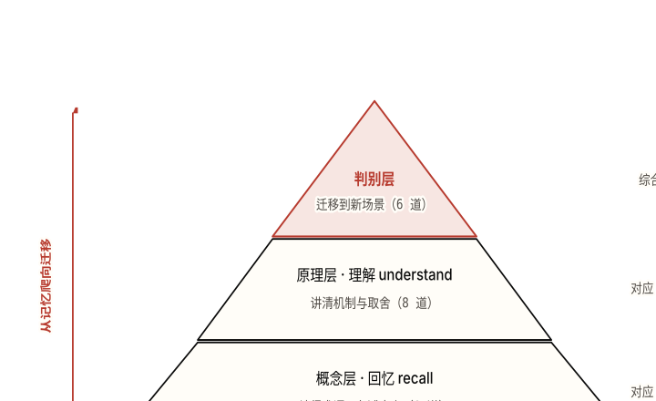

*图 6.1 题库的三层难度梯度，从"认得"逐级爬到"会迁移"。 **注意**：顶层判别层（朱红）题量不比中层多，却是面试主战场——能把概念层、原理层学到的东西在没见过的场景里组合出来，才是面试官真正在称量的信号。*

════════════════════ 概念层 ════════════════════

<a id="ch06-concept-layer"></a>

### §6.1 概念层（对应 01 章 · 回忆）

每题单一考点，能一两句话答出来即可。答不出就回提示链接重读，别凭印象凑。

1. offset 由谁维护——broker 还是消费者？这个归属决定了 Kafka 哪一条核心性质？ 提示：参考 01 章 §1.1
2. 消息被消费之后为什么**不**从日志里删除？它什么时候才真正消失？ 提示：参考 01 章 §1.2
3. Kafka 的顺序保证在**什么范围**内成立？为什么不是整个 topic 全局有序？ 提示：参考 01 章 §1.3
4. 一个 consumer group 的并行度上限是多少？组里消费者数量超过它会发生什么？ 提示：参考 01 章 §1.4
5. producer 带 key 发送时，记录落进哪个 partition 是怎么决定的？key 传 `null` 又会怎样？ 提示：参考 01 章 §1.4
6. 两个不同的 consumer group 读同一个 topic，组 A 读到 offset 100、组 B 才到 10——组 B 会漏掉中间的消息吗？为什么？ 提示：参考 01 章 §1.2

════════════════════ 原理层 ════════════════════

<a id="ch06-principle-layer"></a>

### §6.2 原理层（对应 02 章 · 理解）

这一层考机制和取舍，光报配置名不够，要能讲出"怎么运作、代价是什么"。

1. LEO 和 HW（高水位）分别是什么？为什么消费者只能读到 ≤ HW 的记录？ 提示：参考 02 章 §2.3
2. `acks=all` 是否等于"所有副本都确认"？如果不是，它到底等于什么？ 提示：参考 02 章 §2.3
3. ISR 在什么条件下会收缩（把一个 follower 踢出去）？由哪个配置控制？ 提示：参考 02 章 §2.3
4. eager（急切式）再平衡和 cooperative（协作增量式）再平衡的核心区别是什么？后者解决了前者的什么痛点？ 提示：参考 02 章 §2.4
5. 幂等 producer 靠什么机制去重？它为什么**顺带**解决了"重试导致乱序"？ 提示：参考 02 章 §2.5
6. 事务（transaction）怎么实现 EOS？`read_committed` 消费者在其中起什么作用？ 提示：参考 02 章 §2.5
7. 消费者的心跳在后台线程里照常发送，为什么它仍可能被判死并触发再平衡？"存活"到底由什么证明？ 提示：参考 02 章 §2.4
8. KRaft 为什么比 ZooKeeper 模式恢复（controller 故障切换）更快、能支撑更多分区？ 提示：参考 02 章 §2.6

════════════════════ 应用判别层 ════════════════════

<a id="ch06-discrimination"></a>

### §6.3 应用判别层（综合全书 · 迁移）

面试主战场。这些题没有"背一个名词"就能过的答案——要在场景里权衡，讲出选 A 不选 B 的理由和代价。

1. 一条 100 万消息/秒、需要可重放的事件流 vs 一个低吞吐、需要复杂逐条路由 + 重试 + 死信队列（DLQ）的链路——分别该选 Kafka 还是 RabbitMQ？为什么？ 提示：综合 01 章日志模型 + 04 章适用边界
2. 业务方要求"全局严格顺序"（整个 topic 所有消息按一条总序）——怎么实现，代价是什么？ 提示：综合 01 章 §1.3 + 02 章 §2.2
3. 什么时候**不**该选 Kafka？至少举三类场景。 提示：参考 04 章"什么时候不该用"
4. 一个消费组吞吐上不去，于是不断往组里加消费者。结果吞吐确实涨了，但消费 lag 也跟着涨——为什么？怎么修？ 提示：综合 01 章 §1.4 + 02 章 §2.4 + 04 章再平衡风暴
5. 给一个新负载定 partition 数：要考虑哪几条相互拉扯的约束？分区定多了、定少了各有什么代价？为什么之后想改很难？ 提示：综合 01 章 §1.4 + 02 章 §2.2 + 04 章分区数
6. 一个按 `userId` 分区的 topic，某个大客户占了 90% 流量，导致一个消费者满载、其余空闲。这是什么问题？换成 `orderId` 当 key 能不能解决？Kafka 会自动均衡吗？ 提示：综合 02 章 §2.2 热分区 + 04 章 key 倾斜

> **🧩 亲手画一张图**
>
> 合上教程，凭记忆画出一条记录从 **producer → broker → consumer** 的完整路径：标上 leader 与 follower 副本、ISR、HW、以及消费者**提交 offset 的那个点**。画完翻回 [02 章 §2.3](#ch02-replication) 对照——你把 HW 标在哪里了？它是不是**滞后于 leader 的 LEO 整整一个 fetch 轮**？已 ack 给 producer 的那条记录，在你的图里对消费者可见了吗（它要等 HW 推进才可见）？这一个滞后正是"已确认 ≠ 立即可读"的来源，最容易在画图时被画错。

════════════════════ 面试加餐 ════════════════════

<a id="ch06-strong-answers"></a>

### §6.4 面试加餐：强答案必须包含什么

下面 6 道是 Kafka 面试里**最容易露馅**的题。露馅不在于答错，而在于答得"对但浅"——只报一个关键词，听上去像背过、没用过。面试官称量的是**对取舍的推理**和**把多个机制组合起来的能力**：持久性、EOS、顺序，正确答案几乎都是 "A 且 B 且 C" 的组合命题，缺一个组件就是一个破绽。每道列出"普通答案"和"资深答案必须额外点到的组合"。

> **💡 洞察 · 面试官真正在称量什么**
>
> 把 Kafka 说成"更快的消息队列"是**红旗信号**；资深信号是把它框成**分布式、可重放、按分区切分的提交日志 + 独立消费组**。听的是**组合**不是关键词——只说 `acks=all` 而不讲它和 ISR、`unclean.leader.election` 的互动，就是背题。再追一句"broker 挂了 / 消费者慢了 / ISR 缩到 1 时各发生什么"，能讲出**失败模式的故事**的人立刻和背配置的人分开。

**表 6.1 · 6 道易露馅题：普通答案 vs 资深答案的组合**

| 题 | 普通答案（对但浅 / 破绽） | 资深答案必须点到的组合 |
| --- | --- | --- |
| ① 端到端怎么保证**不丢消息**？ | "设 `acks=all`。"——只说这一个就是破绽，ISR 缩到 1 时它会静默退化。 | `acks=all` **且** `min.insync.replicas≥2` **且** `replication.factor≥3` **且** `unclean.leader.election=false`，**再加**消费侧"处理完再提交 offset"。五件套缺一个就有丢失窗口；要能说出每一件各堵哪个窗口。 |
| ② `replication.factor` 和 `min.insync.replicas` 什么关系？ | "RF 是副本数，min.insync 是最少同步数。"——只复述定义，没讲怎么配。 | 设 `min.insync.replicas = RF − 1`：这样挂一台仍能写、挂两台才停写。设成 = RF 则任意一台故障就停写（牺牲可用性）；设成 1 则等于没有下限保护。要点出这是**持久性与可用性之间的旋钮**，持久性的真正来源是 `min.insync.replicas` 而非 `acks`。 |
| ③ Kafka 能做**exactly-once** 吗？边界在哪？ | "开 `enable.idempotence=true` 就精确一次了。"——过度宣称，这是最常见的误解。 | 幂等 producer 只在**同一会话、同一 (PID, partition)** 内去重，跨进程重启换新 PID 即失效；真正的 EOS 需要**幂等 producer + 事务（transactional.id + epoch）+ 消费侧幂等**三者。且"精确一次"只在 Kafka 的"消费-转换-生产"**闭环内**成立，**不覆盖外部副作用**（DB 写、REST 调用、发邮件那些重试仍会重复触发）。 |
| ④ Kafka 怎么保证**顺序**？ | "Kafka 保证顺序。"——太笼统，漏掉范围和失效条件。 | 只在**单个 partition 内**保证；要顺序的记录必须用同一个 key 哈希进同一分区。还要点出反例：`max.in.flight.requests.per.connection > 1` 且**未开幂等**时，某条消息重试会插到后发消息之后，造成乱序——开 `enable.idempotence=true` 才靠序列号保序。 |
| ⑤ 什么触发**再平衡**？怎么避免再平衡风暴？ | "消费者增减会触发再平衡。"——只说触发条件，没讲协议代价。 | 要分清 **eager（stop-the-world，全员放弃全部分区）vs cooperative-sticky（只移动需变动的分区，未动的继续消费）**。再讲风暴成因：处理太慢超过 `max.poll.interval.ms`（或 `session.timeout.ms` 太紧）→ 成员被驱逐 → 重入 → 循环。缓解：调小 `max.poll.records`、用**协作式协议 + static membership**（`group.instance.id`）。 |
| ⑥ `acks=1` 有什么问题？ | "`acks=1` 比 `acks=all` 弱一点。"——没说清丢在哪个窗口。 | leader 写进自己的日志就 ack、**不等 follower 复制**；在"已 ack、未复制"这个窗口内若 leader 崩溃，新 leader 从某个 follower 选出，那段没复制出去的记录**随旧 leader 磁盘一起永久丢失**，且不抛任何异常。这是用持久性换延迟，要能描述这个具体的丢失时序。 |

> **🎯 进阶挑战 · 刚好够不着**
>
> #### 把"不丢"和"不重"同时讲成一个完整故事
>
> 面试官常把表 6.1 的 ①（不丢）和 ③（不重）合并追问："一条订单事件，从 producer 发出到 consumer 处理入库，**既不丢也不重复入库**，整条链路你怎么设计？" 试着不看答案，把生产端持久性配置、broker 端副本/ISR、消费端 offset 提交时机、以及"外部 DB 写"这一步的去重，串成一段 2 分钟能讲完的话。
>
> <details>
> <summary>提示（卡住再展开）</summary>
>
> 关键是认清两段不同性质的边界：① **Kafka 内部**（producer→broker→consumer 读取）可以靠五件套 + 幂等/事务做到不丢、Kafka offset 不重复提交；② **"写外部 DB"这一步在 Kafka 的 EOS 闭环之外**——重投时这一步会再执行一次。所以"不重复入库"不能指望 Kafka 给你，要靠**消费侧幂等**：用 orderId 做数据库唯一键 / upsert，或先查后写。把"Kafka 保证什么"和"必须自己保证什么"切开讲，是这道题的资深信号。
>
> </details>

════════════════════ 答案 ════════════════════

<details>
<summary>答案（三层全部做完、画完图，再展开）</summary>

#### 概念层（§6.1）

1. **offset 由消费者维护**，不是 broker。broker 只负责顺序追加日志、按时间/大小保留；"读到哪"是消费者自己提交到 `__consumer_offsets` 的一个数字。这个归属是后面一切的总开关——正因为进度在消费者侧、消息不因被读而消失，才有了**可重放**和**多消费组各读各的**。
2. 因为 Kafka 是**日志不是队列**：消费是移动游标（seek），不是出队（dequeue），游标前移不影响日志本身。记录何时消失只取决于**保留策略**（`retention.ms` / `retention.bytes` 到期删整段，或 compaction 对每 key 只留最新），与"是否被读过"完全解耦。所以消费滞后超过保留期会丢数据。
3. 顺序只在**单个 partition 内**保证，不保证 topic 全局有序。原因是物理的：全局总序需要一个单一写入点把所有记录串成一条序列，那就退回单分区、放弃了水平扩展。一条记录的完整坐标是 `(topic, partition, offset)` 三元组，跨分区的 offset 之间没有可比性。
4. 并行度上限 = **partition 数**。一个 partition 同一时刻只能被同组内一个 consumer 持有，所以消费者数超过分区数，多出来的就**空闲拿不到分区**；少于分区数则有消费者要扛多个分区。
5. 带 key 时 `partition = murmur2(key) % 分区数`——相同 key 永远算出同一分区，因此同 key 记录在该分区内有序。key 传 `null` 时用 **sticky partitioner**（先填满一个分区的 batch 再换），记录在分区间均摊，**失去按 key 的顺序保证**。
6. 不会漏。offset 是**每个组各自维护**的游标，互不影响。组 A 读到 100 不会"消耗"掉记录，11–100 号全都还在日志里（只要没超过保留期），组 B 会照常从 11 一路读下去。这正是"日志而非队列"最有用的一条性质：多消费组天然隔离。

#### 原理层（§6.2）

1. **LEO（Log End Offset）** = 某个副本下一条要写的 offset（即该副本已有记录数）。**HW（高水位）** = ISR 中所有副本里**最小的 LEO**，也就是"已被所有同步副本复制到的最高 offset"。消费者只能读到 ≤ HW 的记录，是因为 HW 以上的记录还没被全部副本复制，一旦 leader 故障可能消失——HW 门控防止消费者读到"将来可能不存在"的记录。代价：HW 在**下一轮 fetch** 才推进，所以已 ack 给 producer 的记录要等约一个 RTT 才对消费者可见。
2. **不等于"所有副本"，等于"所有 ISR 成员"**。当 follower 落后被踢出 ISR、ISR 收缩到只剩 leader 一台时，`acks=all` 就等价于 `acks=1`——写到一台就算"全部 ISR 确认"。所以持久性的真正来源是 `min.insync.replicas`（要求至少这么多 ISR 成员在线，否则写入被 `NotEnoughReplicas` 拒绝），不是 `acks` 本身。
3. follower 落后 leader 超过 `replica.lag.time.max.ms`（默认 30s）没追上，就被踢出 ISR。收缩后 ISR 成员变少，会影响 HW 的计算和 `acks=all` 的实际强度。follower 重新追上后会被加回 ISR。
4. **eager**：每轮再平衡所有成员**放弃全部分区**（stop-the-world 屏障），重新分配，期间整组暂停消费。**cooperative/incremental**（2.4+）：只**放弃需要移动的分区**，分两轮收敛，未变动的分区**继续消费**。后者解决了 eager 的全局暂停——大规模消费组扩缩容时，启动时间能从十几分钟降到约一分钟。KIP-848（4.0 GA）进一步把再平衡逻辑移到 broker 端、增量、无客户端 stop-the-world。
5. broker 为每个 `(PID, partition)` 维护一个**最高序列号**，只接受序列号**恰好 +1** 的 append；重试导致的重复（序列号已见过）被丢弃，出现空洞则抛 `OutOfOrderSequenceException`。它顺带解决乱序，是因为这套"必须连续 +1"的校验**拒绝乱序 batch**——所以 `max.in.flight` 可以 >1（≤5）而不会因重试打乱顺序。
6. 事务靠 **`transactional.id` + epoch** 隔离僵尸实例：transaction coordinator 跑两阶段提交，给每个涉及的分区写 commit/abort marker，并把**输出写 + 消费 offset 提交放进同一个原子事务**。`read_committed` 消费者**跳过 aborted 和未决**的记录、且不能越过 LSO（Last Stable Offset），从而只读到已提交事务的结果——这是 EOS 在读侧的兑现。代价：marker + LSO 带来额外延迟和队头阻塞（一个长事务未决会卡住 `read_committed` 读者）。
7. 因为**存活由 `poll()` 证明，不是由心跳证明**。心跳在后台线程，但它只说明"进程还活着、网络还通";真正的判活看你有没有在 `max.poll.interval.ms` 内再次调用 `poll()`。如果在 poll 循环里做了过重的处理（DB/HTTP）迟迟不回来 poll，协调者就判定这个成员**处理不过来 = 死了**，把它驱逐并触发再平衡，在途批次会在新 owner 上**重复处理**。
8. 因为 **KRaft 把元数据本身做成一条日志**（内部 topic `__cluster_metadata`，由 controller quorum 用 Raft 复制），standby controller 持续回放并把全部元数据**常驻内存**。所以 active controller 故障时，新 controller 的状态已经在内存里、几乎瞬时接管。ZooKeeper 模式下 controller 是独立系统，故障切换要**全量重载**元数据，分区一多就慢——这就是 KRaft 能支撑百万级分区、恢复更快的原因。代价：quorum 多数派挂掉就失去可用性。

#### 应用判别层（§6.3）

1. **100 万/秒 + 可重放选 Kafka**：它的顺序日志 + page cache + 零拷贝就是为高吞吐顺序流设计的，可重放是免费附赠（多消费组各读各的）。**低吞吐 + 复杂逐条路由 + 重试/DLQ 选 RabbitMQ**：Kafka 没有原生的逐条路由（exchange/binding）、没有内置的逐消息重试与死信队列、按分区粗粒度而非按消息精细 ack（share group 在弥补，但语义和成熟度不同）。判别的核心：**"高吞吐可重放的日志" vs "灵活路由 + 逐条投递控制的 broker"**，是两种不同的工具，不是快慢之分。
2. 把 topic 设成**单分区**，所有消息走同一条日志即得全局总序。代价巨大：**并行度被钉死为 1**（一个组只能有一个消费者在干活），吞吐被单分区的单机磁盘和单消费者卡死，还失去了 Kafka 的核心扩展能力。所以面试时要主动说："能做，但等于放弃 Kafka 的全部并行优势——先反问业务**是否真需要全局序**，通常按 key 的分区内有序就够了。"
3. 至少三类：① **低吞吐 + 需要复杂路由**（用 RabbitMQ 这类传统 broker）；② **需要内置逐条重试 / DLQ / 优先级队列**（Kafka 都得自己造）；③ **请求-响应 / RPC 语义**（Kafka 是单向日志，不是 RPC）。补充：小团队、量也不大却要扛 Kafka 的运维成本（分区规划、再平衡、监控）时，收益盖不过复杂度。判别要点：Kafka 的强项是高吞吐可重放日志，凡是和这条不沾边的需求都该重新考虑选型。
4. 因为每加一个消费者就**触发一次再平衡**；如果组本来就不稳定、或处理慢导致成员频繁被驱逐，就会陷入**再平衡风暴**——每次 stop-the-world（或部分暂停）期间消费停顿，lag 在停顿里堆积。更糟的情形是消费者数已经**逼近或超过分区数**，再加只是空转还白白触发再平衡。修：别在不稳定的组上扩容；上**协作式再平衡 + static membership**、调小 `max.poll.records` 把单批处理时间压在 `max.poll.interval.ms` 内；先确认分区数是否够，不够要先扩分区。
5. 相互拉扯的约束：**① 目标吞吐**（分区越多并行写/读越高）、**② 消费并行度**（消费者数 ≤ 分区数，要留够余量）、**③ 顺序范围**（同 key 必落同分区，分区数影响 key 分布）、**④ 再平衡与故障切换成本**（分区越多 controller/元数据负担、故障切换越慢、文件句柄越多）。**定多了**：抬高端到端延迟、故障切换时间、文件句柄耗尽（每 segment 2 个文件，默认 ulimit 1024）。**定少了**：消费并行度被卡死。**之后难改**：分区数**只能增不能减**，且给有 key 的 topic 加分区会**永久打乱 key→分区映射**、破坏所有下游的按 key 顺序——所以要么保守预估，要么新建 topic 迁移。
6. 这是**热分区 / key 倾斜**问题：`userId` 基数虽高，但单个大客户的流量全哈希到同一分区，压垮持有该分区的消费者。换 `orderId` 做 key **能缓解**——orderId 基数更高、同一客户的订单会散到多个分区，负载更均匀；代价是**失去"同一 user 的事件有序"**（只剩同一 order 内有序），要确认业务能接受。Kafka **不会自动均衡**倾斜——分配是按分区粒度，不看每分区的实际数据量。所以治本是**选高基数、分布均匀的 key**，而不是指望加消费者。

</details>

#### 本章参考

- [Hello Interview — Kafka Deep Dive / Kafka vs RabbitMQ](https://www.hellointerview.com/learn/system-design/deep-dives/kafka)（面试系统设计，判别层与选型题的来源）
- [Apache Kafka 官方文档 · Design 节](https://kafka.apache.org/documentation/#design)（原理层答案的权威依据）
- [Confluent — Transactions / EOS in Apache Kafka](https://www.confluent.io/blog/transactions-apache-kafka/)（事务与 exactly-once 边界）
- [Confluent — Incremental Cooperative Rebalancing](https://www.confluent.io/blog/incremental-cooperative-rebalancing-in-kafka/)（再平衡协议演进）
- shayne007《Kafka 如何保证消息不丢失》——端到端五件套的工程梳理（中文社区高赞，搜索文章标题即得；与本章表 6.1 ① 对照阅读）
