# Kafka Streams：把流处理架在消费组之上

> 本文根据 `F:\fde\Kafka Streams：把流处理架在消费组之上` 目录中的 7 个离线 HTML 页面整理合并，保留原教程的核心概念、Java 示例、机制解释、生产陷阱、综合实战、自测题与架构图。原材料中的技术现状标注为“截至 2026-06”，本文整理日期为 2026-10-05。

## 目录

- [00 起点：教程定位与概念地图](#chapter-00)
- [01 核心概念：Streams 是跑在消费组上的库](#chapter-01)
- [02 工作原理：状态、再平衡、窗口、Join 与 EOS](#chapter-02)
- [03 上手实操：把原理写成可运行应用](#chapter-03)
- [04 生产陷阱：失败模式与修复路径](#chapter-04)
- [05 综合实战：实时订单分析](#chapter-05)
- [06 自测题库与面试准备](#chapter-06)


<a id="chapter-00"></a>

00 · 起点 / Entry

## Kafka Streams：把流处理架在消费组之上

Kafka Streams 没有独立集群——它是嵌进你 Java 应用的一个库，把流处理建在消费组、本地状态和 changelog 日志这三块基石上。这套教程讲透它的机制、失败模式与取舍，目标是系统理解 + 中高级面试。

**基于版本**：Apache Kafka 4.3（2026-05），Java DSL ·
**阅读时间**：约 2–3 小时 ·
**代码验证状态**：示例基于 kafka-streams 4.x，未在本机逐一运行。


### 01 适合谁

面向**懂核心 Kafka、但没用过 Streams** 的 Java 后端工程师。具体说，三条前置能力：

- **学过主 Kafka 教程或等同基础**：能讲清分区、消费组、offset、副本各自是什么——读得懂 [主 Kafka 教程](https://zhiwenliang.github.io/learning/kafka/index.html) 里"分区日志 + 消费组"那条主线，本教程不重讲这些。
- **能读写 Java、用过 Kafka 客户端**：看得懂泛型签名如 `KStream<String, Long>`、lambda、链式调用；在本机用 `KafkaConsumer` 起过一个消费组读消息。
- **理解有状态服务的基本难题**：知道"进程挂了本地内存就没了"意味着什么，能想象一个聚合计数器要怎么在重启后恢复——本教程把这个难题的 Streams 解法讲到底。

### 02 不适合谁

三类读者在别处能拿到更对口的资源：

- **没碰过 Kafka 的零基础读者**：这里不从分区、消费组讲起。先看
  [主 Kafka 教程](https://zhiwenliang.github.io/learning/kafka/index.html) 把"Kafka 是一条分区日志"这条主线打通，再回来——Streams 的容错、缩放、EOS 全是从那条主线推导出来的。
- **只想要 API 速查的读者**：要查 `aggregate` 的重载或某个配置项，直接读
  [官方 DSL 文档](https://kafka.apache.org/documentation/streams/developer-guide/dsl-api.html)
  比这套教程快——这里讲的是"为什么这么设计"，不是方法字典。
- **已经专精 Flink / Spark Streaming 的读者**：你已有流处理的心智模型，要的是差异点和迁移指南，而非从概念建起。直接对照
  [Streams 文档](https://kafka.apache.org/documentation/streams/) 找"库 vs 独立集群""changelog 复制 vs checkpoint"这两处关键差异即可。

### 03 读完之后你能做到什么

你能把任意一个 Streams 算子的行为追溯到"它跑在消费组上、状态是一条 changelog 日志"这条主线——面试被问"有状态算子怎么容错"时，能说出 changelog 回放 + standby 副本，而不是含糊地说"框架自动处理"。

落到可验证的能力，读完这套教程之后：

- **区分** KStream / KTable / GlobalKTable 三者，并讲清各自背后是"追加账本 / 每 key UPSERT changelog / 每实例全分区副本"，以及什么场景该选哪个。
- **推导**一个有状态 task 在实例故障后如何恢复——本地 RocksDB 怎么由 compacted changelog 重建，standby 副本在哪一步把分钟级恢复压到秒级。
- **诊断**一个 join 静默无输出的故障，定位到共分区要求（相同分区数 + 相同分区方式）被破坏，并给出修复路径。
- **判断**一个场景该用 Kafka Streams、原生 consumer、还是 Flink，讲出判据（要不要状态/窗口/join/EOS、是不是以 Kafka 为源汇、要不要独立集群）。
- **说清** `exactly_once_v2` 的真实边界——它只在单个 Kafka 集群内把 offset 提交、状态写、输出 produce 绑进一个事务，不覆盖数据库写、HTTP 调用这些外部副作用。

> 一句话本质
>
> Kafka Streams 没有独立集群——它是嵌进你应用的库，把流处理架在消费组之上：task=分区，缩放和再平衡都是消费组那套。有状态算子的状态存在本地 RocksDB，但真相源是一条 Kafka changelog 日志，所以"流"和"表"只是同一条日志的两种视图。
>
> 这一句承接主教程的"Kafka 是日志"。容错（changelog 回放）、缩放（task = 分区上限）、EOS（事务）全由它推导。中高级面试里能不能把 Streams 框成"消费组 + 本地状态 + changelog 日志"、而不是"又一个流处理引擎"，就是区分背题和真懂的分水岭。

### 04 现状速览（截至 2026-06）

> **💡 什么定论、什么在动、什么已被取代**
>
> **稳定（已 GA、可放心用）**：版本化状态存储（KIP-889，3.5 GA，每 key 存多版本、支持 `get(key, asOf)` 与正确的乱序处理）、交互式查询 IQv2（KIP-796）、外键 join（KIP-213，2.4）、EOS v2（`exactly_once_v2`，3.0 起默认）、机架感知 standby（KIP-925，3.2）。
>
> **近 12 个月的变化**：**KIP-1071 Streams 再平衡协议**把 task 分配从客户端移到 **broker 端 group coordinator**，**4.2 起新集群默认开**（broker + client ≥ 4.2，feature `streams.version=1`）；它**仍不支持** static membership、在线 classic→streams 迁移、运行中改 topology。最新 4.3（2026-05）加 KIP-1035（StateStore 自己管 changelog offset，恢复更快）。
>
> **已淘汰**：eos-v1（`exactly_once`）→ `exactly_once_v2`；IQv1 → IQv2；**streams-scala 4.3 已弃用、5.0 移除**（Java DSL 不受影响）。
>
> **运行要求**：Streams + Clients 需 Java 11，Broker 需 Java 17（4.0 起）。

### 05 读之前：三个假象

> **⚠️ 流畅感不等于学会**
>
> Streams 的 DSL 读起来像在写集合操作（`map` / `filter` / `groupBy` / `count`），正因为眼熟，三种"感觉良好"会骗过你——它们都是假象：
>
> · **"我读得很顺"**——顺，多半是因为 DSL 长得像 Java Stream，链式调用一眼能扫过去。但能读懂 `groupByKey().count()` 这行，不等于能说出这背后建了一个 RocksDB、一条 changelog topic、并把状态绑进了消费组。
>
> · **"我做题很快"**——快，多半是碰上了套路题（"KStream 和 KTable 区别？追加 vs 更新"）。换成"两个 topic join 为什么零输出、还不报错"这种，速度立刻说明不了理解。
>
> · **"我没卡壳"**——没卡壳，多半是还没碰到真正的 schema：把 Streams 当"另一个流处理引擎"时一路通畅，直到遇到"它凭什么没有独立集群""状态在本地 RocksDB 那进程挂了怎么办"才会卡——那一卡，才是开始学的地方。

### 06 概念地图

这张图是后面六章挂载细节的骨架。中心是**一个嵌入式库**——它没有自己的集群，其余所有角色都围绕这个事实展开。特别留意那条朱红副线：状态虽在本地 RocksDB，真相源却是 Kafka 里的一条 changelog 日志。

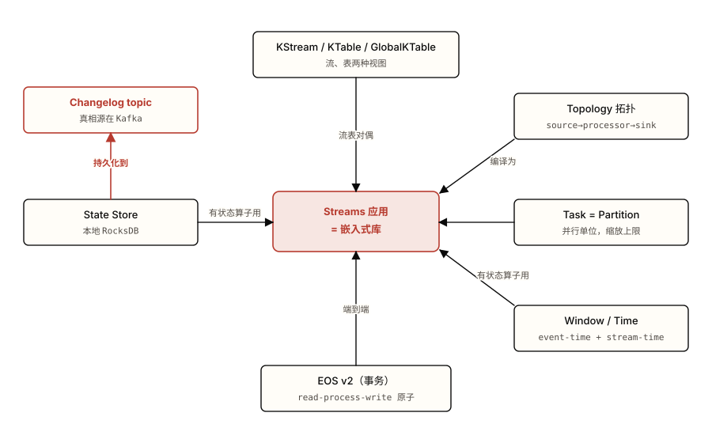

*图 0.1 Kafka Streams 的概念地图——所有角色都挂在"嵌入式库"这个中心事实上。 注意 三点：① 没有独立集群，库就跑在消费组上；② 状态在本地 RocksDB，但真相源是那条朱红的 changelog 日志；③ 流和表只是同一条日志的两种视图。*

### 07 学习路径建议

顶部那条 breadcrumb 是完整线性路径。但按你的目的，可以走不同子路径：

- **吃透原理应付面试**：`01 概念` → `02 原理` → `06 自测`。概念建词汇表，原理讲机制与取舍，自测用三层梯度题逼出"强答案必须包含什么"。跳过实操与综合不影响理解主线。
- **动手搭一个流处理应用**：`01` → `02` → `03 实操` → `04 陷阱` → `05 综合`。从概念到 Java DSL worked→partial→open 三阶，再过一遍生产失败模式，最后用实时订单分析把所有机制串起来。
- **读懂别人的 Streams 代码**：`01` → `02` → `04 陷阱`。先建概念和机制的心智模型，再直奔陷阱章——别人代码里那些 `selectKey`、`Materialized`、`num.standby.replicas` 的写法，多半是在绕开某个失败模式，对照陷阱章一眼看懂动机。

### 08 目录


### 09 学完之后

这套教程把 Streams 框成"消费组 + 本地状态 + changelog 日志"。在这个 schema 上，下一步可以往这几个方向加东西：

- **[Kafka Connect 子教程](https://zhiwenliang.github.io/learning/kafka-connect/index.html)**——在你的 schema 上补"数据怎么进出 Kafka"这一层：source/sink 连接器把外部系统接成 topic，正好喂给 Streams 处理、再写回去。
- **ksqlDB**——在 Streams 之上加一层 SQL。它把 `CREATE TABLE ... AS SELECT` 编译成 Streams topology，让你用 SQL 表达同样的流表对偶——理解了 Streams 再看它，等于看懂了它的底座。
- **Flink 对比**——补上"独立集群 + checkpoint"这一套对照物：Flink 是有调度器的独立集群、用 checkpoint 容错，与 Streams 的"库 + changelog 复制"形成最清晰的取舍对比，是面试 discrimination 题的高频考点。
- **Schema Registry**——在 serde 这一层加"契约管理"：Avro/Protobuf + 兼容模式解决 schema 漂移，正好补上陷阱章里 serde 崩溃那条的系统性解法。


#### 参考资料

- [Kafka Streams 官方文档](https://kafka.apache.org/documentation/streams/)（官方，权威定义与 API）
- [KIP-1071：Streams Rebalance Protocol](https://cwiki.apache.org/confluence/display/KAFKA/KIP-1071%3A+Streams+Rebalance+Protocol)（设计文档，理解 4.2 起 broker 端 task 分配的动机）
- [developer.confluent.io · Kafka Streams Internals](https://developer.confluent.io/courses/kafka-streams/internals/)（维护方课程，task 模型与状态恢复的内部机制）


<a id="chapter-01"></a>

Chapter 01

## 核心概念：Streams 是跑在消费组上的库

起点页给出一句话本质——Kafka Streams 没有独立集群，它是嵌进应用的库，把流处理架在消费组之上，状态是一条 changelog 日志的两种视图。这章把这句话拆成六个能在面试里说清楚的概念，每个都配一段场景走查。完整可运行代码留到 [03 实操](https://zhiwenliang.github.io/learning/kafka-streams/03-practice.html)。

> 本章你将建立的 schema
>
> - Streams 不是引擎，是库：instance → StreamThread → task → partition，并行上限被分区数钉死
> - KStream 是 INSERT 账本，KTable 是按 key UPSERT 的 changelog，`null` 值是 tombstone
> - 流表对偶：表是 changelog 的物化，流是表的差异日志——这是状态能恢复的根
> - 算子分两类：stateless 单条变换，stateful 要状态存储、改 key 会触发重分区（机制留给 02）

读这章前要带着主 Kafka 教程的三块底座：分区是并行单位、消费组按分区分活、offset 记录消费进度。Streams 不替换这些——它把这些当地基，往上盖了一层"有状态消费 + 流处理 DSL"。下面六节按依赖顺序展开，每节末尾点出它和下一个概念的接口。

### 1.1 为什么用 Streams 而非裸 consumer

Streams 把"有状态消费"里那几件难做对的事——状态存哪、怎么容错、再平衡后怎么不重算——收进库里替你做。

> **🧠 为什么需要它**
>
> 设想一个需求：统计每个用户的实时下单数。用裸 `KafkaConsumer` 写，逻辑本身一行 `map.merge(userId, 1, Integer::sum)` 就够。难的是它周围的三件事：
>
> **状态存哪。**那个计数 `Map` 在 JVM 堆里。进程一重启，计数清零。要持久化，得自己接一个外部 KV 库（Redis/RocksDB），自己处理读写一致。
>
> **怎么容错。**进程崩了，内存里的计数没了。重启后从哪个 offset 续？续早了会重复计数，续晚了会漏。要做对，得把"计数状态"和"offset 提交"绑成一个原子动作——裸 consumer 没给你这个原语。
>
> **再平衡后怎么不重算。**消费组加了一个实例，分区被重新分配。新拿到分区 7 的实例，它手里没有分区 7 历史累计的计数——要么从头重读整个分区重建（慢且重复输出），要么接受计数错误。

这三件事不是边角料，是**有状态流处理的全部难点**。Streams 的设计是把它们各给一个机制：状态进本地 `state store`（默认 RocksDB，[§2.1 详解](https://zhiwenliang.github.io/learning/kafka-streams/02-principles.html#state-store)）；容错靠把每次状态写也写进一条 **changelog topic**，崩溃后回放重建；不重算靠复用消费组的 offset 语义，并把 changelog 写、offset 提交、输出 produce 三者在 EOS 下绑进一个事务（[§2.6 详解](https://zhiwenliang.github.io/learning/kafka-streams/02-principles.html#eos)）。

> **💡 洞察 · 库 vs 引擎**
>
> Streams 像给 consumer 装的一套"有状态消费脚手架"，而不是像 Flink 那样另起一个集群。失效边界：正因为它只是库，它没有独立的资源调度器、没有跨集群的 checkpoint barrier、运行中也不能改 topology——这些是独立引擎才有的能力。把 Streams 当"消费组 + 本地状态 + changelog"理解，是真懂；当"又一个流处理引擎"理解，会在容错和缩放问题上全答错。

#### 场景走查：从裸 consumer 到一个 Streams 拓扑

同一个"实时下单计数"，用 Streams 写出来是这样——状态、容错、再平衡那三件事一行都看不到，因为它们被库吞了：

**OrderCount.java**

```java
StreamsBuilder b = new StreamsBuilder();
b.stream("orders", Consumed.with(Serdes.String(), orderSerde))  // KStream：每笔订单一条
 .groupBy((k, order) -> order.userId())                          // 按用户重新分组
 .count(Materialized.as("order-counts"))                         // KTable：每用户当前计数
 .toStream().to("order-counts-out");                             // 变更流写回 topic
```

> **代码解读**
>
> **第 3 行** 那个会清零、会算错的 `Map`，被 `count()` 背后的 state store 接管，自动有了 changelog 撑腰。**第 2 行** `groupBy` 改了 key，库会自动插一个重分区步骤——这就是裸 consumer 里"分区 7 的实例没有分区 7 的计数"问题的根，Streams 用重分区保证同一 key 永远落同一 task（[§2.3](https://zhiwenliang.github.io/learning/kafka-streams/02-principles.html#repartition)）。

四行代码背后，是这一整章要拆开的机制。**与下一个概念的关系**：第 1 行的 `stream(...)` 产出一个 `KStream`，第 3 行的 `count()` 产出一个 `KTable`——这两个类型是 Streams 全部 DSL 的两块基石，下一节把它们和 GlobalKTable 一起讲清楚。

### 1.2 KStream / KTable / GlobalKTable

KStream 是只追加的事件流（每条都留），KTable 是按 key 取最新值的变更表，GlobalKTable 是每个实例都持有全部分区的只读副本。

> **🧠 为什么需要它**
>
> 同一条 Kafka topic，业务上有两种读法。"用户 alice 点击了按钮"是**事实**——发生过就永远成立，再来一条点击不会否定上一条，该累加。"用户 alice 的会员等级是 gold"是**状态**——后一条 `(alice, platinum)` 应当覆盖前一条，只有最新值有意义。把这两种语义塞进同一个抽象，聚合和 join 的行为就会自相矛盾。Streams 用两个类型把它们分开：事实用 KStream，状态用 KTable。

#### 底层机制（比文档深一层）

**KStream = INSERT 语义。**每条记录都是独立事实，相同 key 的多条记录全部保留、依次处理。对 KStream 做 `count`，结果随每条记录单调增长。

**KTable = UPSERT 语义，本质是一条 changelog。**记录按 key 折叠：相同 key 的新记录覆盖旧值，下游只看到"每 key 当前值"。关键的一条是 **`value == null` 是 tombstone（墓碑）**——它表示"这个 key 被删除"，而不是"这个 key 的值是空"。KTable 把上游 topic 当成 compacted 日志来读：日志里同一 key 留最新、tombstone 触发删除，正是 log compaction 的语义。这就是为什么文档说"KTable 是 changelog stream 的视图"——它读的就是一条 changelog。

**GlobalKTable = 每实例全分区副本。**普通 KTable 每个实例只持有它被分到的那些分区；GlobalKTable 让*每个*实例在启动时 eager 加载该 topic 的*所有*分区，得到一份完整副本。代价是每实例都扛全量数据（磁盘 + 内存 + 重启时的 bootstrap 延迟），所以它只配小而慢变的维表用（国家码、商品目录）。回报是它**免去共分区要求**——join 时流的 key 不必和表的分区方式对齐（[§2.5](https://zhiwenliang.github.io/learning/kafka-streams/02-principles.html#joins)）。

> **💡 类比 · 带边界声明**
>
> KStream 像 Git 的 commit 历史（每次提交都是一条不可变记录，全留着）；KTable 像工作区当前快照（只反映最新状态，旧值被覆盖）。边界：Git 快照是把整个历史重放一遍算出来的，而 KTable 的"快照"是**每个 key 独立折叠**——它不是一个全局快照，是 key→最新值的字典。所以别把 KTable 想成"某个时刻的全表镜像"，它是一条还在持续吸收变更的活日志。

#### 场景走查：同一条 topic，两种读法

topic `user-tier` 依次到达三条记录：`(alice, silver)`、`(bob, gold)`、`(alice, gold)`。

- 读成 **KStream**：下游看到 *三* 条事件，依次 silver、gold、gold。它把"alice 升级"当成一次发生过的事实记下来。
- 读成 **KTable**：下游看到的表是 `{alice: gold, bob: gold}`——alice 的 silver 被第三条覆盖。再来一条 `(alice, null)`，表变成 `{bob: gold}`，alice 这个 key 被 tombstone 删掉。

**TwoReadings.java**

```java
KStream<String, String> tierEvents = b.stream("user-tier");  // 三条事件全留
KTable<String, String>  tierNow    = b.table("user-tier");   // 每用户最新等级
GlobalKTable<String, String> country = b.globalTable("country-codes"); // 每实例全量副本
```

> **代码解读**
>
> **第 1 行** `stream` 取 INSERT 视图。**第 2 行** `table` 取 UPSERT 视图，同一份字节、不同折叠规则。**第 3 行** `globalTable` 让本实例独自加载 `country-codes` 的所有分区——只因为它小且少变。

> **🤔 想一想**
>
> 一个 `KTable` 先收到 `(alice, 1)`，紧接着收到 `(alice, 3)`。订阅这个 KTable 变更流的下游算子，一共会看到几条记录？值分别是什么？
>
> <details>
> <summary>展开答案（先停 10 秒再点）</summary>
>
> 会看到 **两** 条变更：先是 `(alice, 1)`，再是 `(alice, 3)`。KTable 是 UPSERT，但 UPSERT 指的是*状态怎么折叠*（表里 alice 这个 key 最终只有一个值 `3`），不是*变更被吞掉*。每次值变化都会向下游发一条变更记录，所以下游看到两条；但若把这张表物化后去查 `get("alice")`，拿到的是最终值 `3`。
> 这指向一个常被搞混的点：KTable 的"输出"是一条**变更日志（changelog）**，不是"每次发一份全表"。下游看到的是增量变更序列，表的"当前值"是这些变更折叠后的结果。把这一点记牢，下一节的流表对偶就是顺理成章的。
>
> </details>

**与下一个概念的关系**：上面这道题里"KTable 对外发的是变更日志、表是变更折叠的结果"——把这句话正着读和反着读，就是下一节的**流表对偶**。

### 1.3 流表对偶

表是变更日志"折叠到每 key 最新值"的物化，流是表"逐次变更"的差异日志——同一条日志的两种视图。

> **🧠 为什么需要它**
>
> 这不是一个 API，是 Streams 容错的**理论根基**。1.1 节那个问题——"进程崩了，本地状态没了，怎么恢复"——的答案完全建立在流表对偶上。如果表和它的变更日志是可以互相转换的，那么只要那条日志在 Kafka 里安全存着，本地那份表（RocksDB 文件）随时可以丢、随时可以从日志重建。状态可恢复，根上就是这一条。

#### 底层机制（比文档深一层）

两个方向都要成立，对偶才成立：

**流 → 表（聚合 / 物化）。**把一条变更流按 key 折叠，就得到表：相同 key 后值覆盖前值，tombstone 删除该 key。`count()`、`aggregate()` 做的就是这件事——它们把一条 KStream"播放"成一张 KTable。

**表 → 流（差异 / changelog）。**每当表里某个 key 的值变了，就向外发一条"这个 key 现在是这个值"的记录。这串记录就是表的 changelog。`KTable.toStream()` 做的就是这件事。

关键在于：Streams 不是"另外维护一条日志来记录表的变化"。**那条 changelog 就是表的本体**。本地 RocksDB 里的表只是这条日志在某一时刻折叠出的物化结果（一份缓存）。崩溃恢复时，新实例从 changelog topic 的头开始回放，逐条折叠，就重建出了崩溃前那张表——不需要快照、不需要 checkpoint。这是 Streams 和 Flink/Spark 在容错模型上的根本分野：那两者靠周期性 checkpoint 落盘整个状态，Streams 靠回放一条始终在 Kafka 里的 changelog。

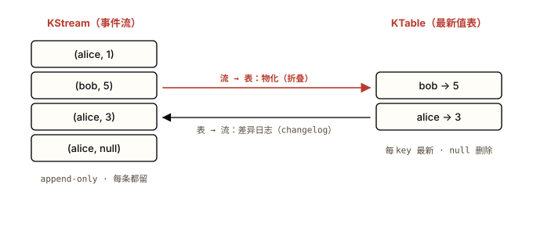

*图 1.1 同一条日志的两种视图：左边把每条事件都留下，右边把同 key 折叠成最新值。 注意：两个方向的箭头都成立——右边那张表随时能丢，因为左边的日志能把它重新折叠出来。这就是状态可恢复的根。*

> **💡 类比 · 带边界声明**
>
> 流表对偶像数据库的"事务日志 ⇄ 数据表"：表是当前态，日志是到达当前态的每一步。边界：数据库的日志主要服务于崩溃恢复和复制，平时查询走表；而在 Streams 里，**日志是第一性的，表是派生缓存**——changelog topic 是真相源，本地 RocksDB 随时可丢可重建。方向反过来了，这正是"没有独立集群也能容错"的支点。

**与下一个概念的关系**：流表对偶解释了"状态为什么能恢复"。但"恢复"这个动作发生在*谁*身上、什么时候触发？答案要先建立 Streams 的运行单位——instance、StreamThread、task、partition，下一节就拆这条链。

### 1.4 应用即库：instance / thread / task / partition

一个 Streams 应用就是一个普通 Java 进程，内部起 N 个 StreamThread，每个线程跑若干 task，每个 task 钉死绑定一组输入分区。

> **🧠 为什么需要它**
>
> "Streams 没有独立集群"这句话，落到运行时就是这条链。理解它，缩放、再平衡、并行上限这三个最常被面试问的问题就全解开了——它们不是 Streams 自创的调度逻辑，而是**白嫖了消费组的那套机制**。设计上为什么这么选：复用消费组，就免费拿到了再平衡、offset 管理、EOS 集成；代价是并行能力被分区数锁死。

#### 底层机制（比文档深一层）

四级映射，从外到内：

- **instance（实例）**= 一个跑着你 Streams 代码的 JVM 进程。多开几个进程（多个 pod）就是横向扩容。
- **StreamThread（流线程）**= 每个实例内起 `num.stream.threads` 个。**每个 StreamThread 内部持有一个普通的 KafkaConsumer，加入消费组**，group.id 就是你的 `application.id`。这是"架在消费组之上"的字面实现。
- **task（任务）**= 调度的最小单位。**task 数 = 各子拓扑输入 topic 的最大分区数**。4 个分区的输入 topic，就是 4 个 task，编号 0–3。这个数在拓扑结构定下来的那一刻就**钉死了，运行时不可改**。
- **partition（分区）**= 每个 task 绑定一组输入分区（最简单情况下一个 task 对一个分区）。task 和它的分区是焊死的，不会在运行中拆开分给两个线程。

task 在"所有实例 × 所有线程"这个池子里分配。加一个实例，触发消费组再平衡，一部分 task 迁移过去。这里藏着那个最常考的结论：**并行上限 = 最大输入分区数**。task 总数被分区数钉死，所以能同时干活的线程数不可能超过 task 数；线程开得比 task 多，多出来的线程**空转闲置**。要再提并行度，唯一办法是给输入 topic 加分区——而那是个破坏性操作（改变 key 的分区落点，[§4.3](https://zhiwenliang.github.io/learning/kafka-streams/04-pitfalls.html#resource)）。

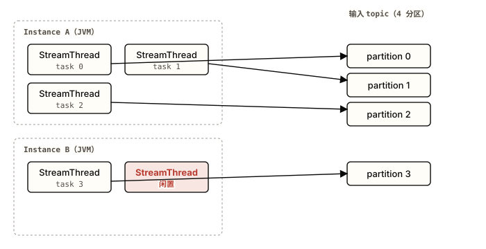

*图 1.2 四级映射：instance 装线程，线程跑 task，task 焊死绑定一个分区。 注意：4 个分区只产生 4 个 task，第 6 个 StreamThread 没 task 可分， 空转闲置 ——并行上限就卡在分区数这条线上。*

> **💡 类比 · 带边界声明**
>
> task 像出租车的座位数：你能拉的客人数被座位钉死，多招的司机（线程）只能在车里坐着。边界：座位数是物理的、改不了，而分区数能加——只是加分区会改变"哪个 key 坐哪个座位"（key→分区的映射变了），所以扩容是破坏性的，不像招司机那么轻。这条边界是 04 章资源陷阱的伏笔。

#### 场景走查：4 分区 topic，逐步加线程和实例

- 1 个实例、`num.stream.threads=1`：1 个线程扛全部 4 个 task。能跑，但没并行。
- 1 个实例、`num.stream.threads=4`：4 个线程各 1 task，吃满并行。
- 2 个实例、各 2 线程：共 4 线程各 1 task，和上一档算力相同，但抗单实例宕机。
- 再加到共 6 线程：仍只有 4 个 task，**2 个线程闲置**。要更快只能给输入 topic 加分区。

> **🤔 想一想**
>
> 一个输入 topic 有 4 个分区。你部署了 6 个 StreamThread（比如 3 个实例各 2 线程）。同一时刻有几个线程在真正处理数据？多出来的线程在干什么？
>
> <details>
> <summary>展开答案（先停 10 秒再点）</summary>
>
> **4 个**线程在干活，另外 **2 个**闲置（除非配了 standby，那它们会作为备用副本尾随 changelog 保温，[§2.2](https://zhiwenliang.github.io/learning/kafka-streams/02-principles.html#rebalance-scaling)，但不处理活动 task）。
> 原因：task 数 = 最大输入分区数 = 4，运行时钉死。task 不会被拆成两半分给两个线程，所以线程数超过 task 数时，多出来的线程拿不到 task，空转。**并行上限 = 分区数**——这是把 Streams 框成"消费组之上"的最直接推论，也是把 Streams 错当"无限缩放的引擎"时第一个翻车的地方。要提升并行度，得重分区输入 topic（破坏性操作），而不是加线程。
>
> </details>

**与下一个概念的关系**：task 是按"子拓扑的输入分区"切出来的。"子拓扑"是什么、一个应用怎么被切成几个子拓扑——这要先看清 Streams 把你的 DSL 代码编译成了什么结构，也就是下一节的**拓扑**。

### 1.5 拓扑：DSL 编译成的处理图

拓扑是 source → processor → sink 组成的有向图；你写的 DSL 被编译成它，子拓扑的边界就是内部 topic。

> **🧠 为什么需要它**
>
> DSL 写起来像链式调用 `.filter().map().groupBy().count()`，但 Streams 运行时不直接"执行这些方法"。它先把整条链编译成一张静态的**处理图（processor topology）**，再按图调度。理解拓扑，是从"会写 DSL"跨到"知道运行时建了几个内部 topic、并行单位怎么切"的那道门——后者才是排查性能和成本问题的入口。

#### 底层机制（比文档深一层）

拓扑由三类节点构成：**source processor**（从一个 topic 读入）、**stream processor**（map/filter/aggregate 等变换）、**sink processor**（写出到一个 topic）。DSL 的每个算子被编译成一个或多个 processor 节点连起来。

关键的一层深度在**子拓扑（sub-topology）边界**。一张拓扑会被切成若干子拓扑，**切点正是需要重洗数据的地方**——也就是改了 key、下游又要按 key 聚合/join 的位置。在切点上，上游子拓扑把数据写到一个内部 topic，下游子拓扑再从这个 topic 读回来。这个内部 topic 就是**重分区 topic**（[§2.3](https://zhiwenliang.github.io/learning/kafka-streams/02-principles.html#repartition)）。所以"子拓扑之间靠内部 topic 连接"和"task 数 = 子拓扑输入分区数"是同一件事的两面：每个子拓扑独立按它的输入分区数切 task。

调用 `topology.describe()` 能打印出这张图的文本结构，看到它被切成了几个子拓扑、各含哪些 processor。这是确认"运行时到底建了几个内部 topic"的第一手段，比对着 DSL 脑补可靠。

**DescribeTopology.java**

```java
Topology topo = b.build();
System.out.println(topo.describe());  // 打印 source/processor/sink + 子拓扑边界
```

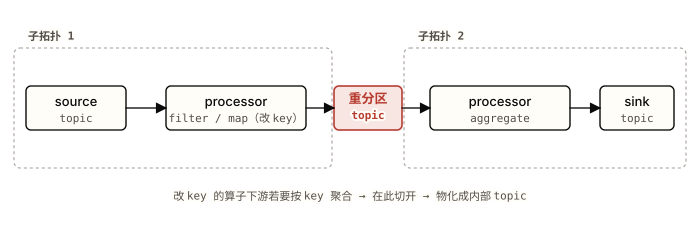

*图 1.3 一条 DSL 链编译成的拓扑 DAG，被切成两个子拓扑。 注意：切点不是随意的——它正落在"改了 key、下游又要按 key 聚合"的位置，那个 重分区 topic 就是子拓扑的物理边界，也是 1.6 节"改 key 触发重分区"的成本所在。*

> **💡 类比 · 带边界声明**
>
> DSL 编译成拓扑，像 SQL 被优化器编译成执行计划：你写声明式的链，引擎产出一张固定的算子图来跑。边界：SQL 执行计划每次查询可以重新生成、自适应调整；而 Streams 的拓扑**在应用启动时一次性定型，运行中不能改**（这也是 KIP-1071 至今仍不支持运行中改 topology 的原因）。把它当"可热改的计划"会在运维升级时踩空。

**与下一个概念的关系**：图 1.3 里那个把拓扑切成两半的重分区 topic，是被一个"改了 key 的算子 + 下游有状态算子"触发出来的。哪些算子有状态、哪些会改 key——这就是最后一节 stateless vs stateful 的分界。

### 1.6 stateless vs stateful 算子

stateless 算子单条记录就能算出结果；stateful 算子要跨多条记录维护状态，因此需要状态存储，且改 key 时会触发重分区。

> **🧠 为什么需要它**
>
> 这条分界决定了一个算子贵不贵。stateless 算子（`map`/`filter`）几乎零成本，来一条处理一条、不留痕迹。stateful 算子（`count`/`aggregate`/`join`/窗口）要维护状态，于是连带出本章前面所有机制：状态存储（1.1）、changelog 容错（1.3）、重分区与子拓扑切分（1.5）。看一眼 DSL 链里有没有 stateful 算子，就能预估它会建几个内部 topic、恢复会不会慢。

#### 底层机制（比文档深一层）

**stateless：**`map`、`mapValues`、`filter`、`flatMap`、`branch`、`merge`、`peek`。每条记录的输出只取决于这条记录自己，运行时不为它们分配状态存储，也没有 changelog。

**stateful：**`count`、`aggregate`、`reduce`、各种 `join`、所有窗口算子。它们的输出取决于"这个 key 此前累积的状态"，所以必须有一块状态存储记着累积值（[§2.1 详解](https://zhiwenliang.github.io/learning/kafka-streams/02-principles.html#state-store)，本节只点到"需要它"）。

两类之间有一条暗线：**改 key 的操作会给数据流打上"需重分区"标志**。`selectKey`、`map`（可能改 key）、`flatMap`、`groupBy` 都属此类。一旦改了 key，下游的 stateful 算子要求"同一 key 的所有记录落在同一 task"才能正确聚合——而改 key 后记录的分区落点乱了，于是 Streams 在它们之间自动插一个重分区 topic 把数据按新 key 重洗（[§2.3 详解](https://zhiwenliang.github.io/learning/kafka-streams/02-principles.html#repartition)，含为什么 `groupByKey` 比 `groupBy` 省、以及 `selectKey` 为何是 lazy 的）。这就是图 1.3 里那个子拓扑边界的来历。

#### 场景走查：一条链里哪些算子贵

**CostByOperator.java**

```java
b.stream("clicks")
 .filter((k, v) -> v.valid())          // stateless：零状态，零内部 topic
 .selectKey((k, v) -> v.userId())      // 改 key：打上"需重分区"标志
 .groupByKey()                         // 不再改 key
 .count();                             // stateful：状态存储 + changelog + 触发重分区
```

> **代码解读**
>
> **第 2 行** `filter` 不留状态，纯白嫖。**第 3 行** `selectKey` 改了 key，但它自己 lazy，不立刻建 topic。**第 5 行** `count` 是 stateful，它既要状态存储+changelog，又因为上游改过 key 而真正物化出重分区 topic——这一条算子把前面三节的机制全勾起来了。

> **⚠️ 陷阱**
>
> 别把"改 key"和"建重分区 topic"画等号。`selectKey` 单独存在时不建任何 topic——它只是 lazy 地*标记*了需重分区，真正物化要等下游一个依赖 key 的 stateful 算子来兑现。所以判断一条链有几个内部 topic，看的是"改 key 标志 + 下游 stateful 算子"的组合，不是数 `selectKey` 的个数。确认实情用 `topology.describe()`（1.5），别脑补。

> **🤔 想一想**
>
> 下面两条链，哪条会让 Streams 建一个内部重分区 topic？\
> A：`stream("t").mapValues(v -> v.trim()).filter(...)`\
> B：`stream("t").selectKey((k,v) -> v.region()).groupByKey().count()`
>
> <details>
> <summary>展开答案（先停 10 秒再点）</summary>
>
> **只有 B。**A 全是 stateless 且不改 key：`mapValues` 按定义不碰 key，`filter` 也不碰——没有"需重分区"标志，也没有 stateful 算子，运行时一个内部 topic 都不建。
> B 里 `selectKey` 改了 key（打标志），下游 `count` 是 stateful 且依赖 key——标志被兑现，Streams 插入一个 `<app-id>-...-repartition` 内部 topic 把数据按 region 重洗，于是拓扑被切成两个子拓扑。设计指向：想省这个往返，优先用不改 key 的 `mapValues` + `groupByKey`，而不是 `map` + `groupBy`（[§2.3](https://zhiwenliang.github.io/learning/kafka-streams/02-principles.html#repartition)）。
>
> </details>

**承上启下**：这六节搭好了 Streams 的词汇表——库的运行单位、两种数据视图、对偶、拓扑、算子分类。每一节都把"机制深一层"压到了一个停止点：状态存储到底怎么落盘、重分区的具体成本、再平衡时状态怎么搬、窗口和时间怎么算、四种 join、EOS 怎么实现——这些是 [02 原理](https://zhiwenliang.github.io/learning/kafka-streams/02-principles.html) 的正题。

### § 本章 self-check

先合上教程，把你能想到的答案写在纸上或编辑器里。
写完再点开答案对照——直接点开等于把这一节当再读一遍。

1. 用一句话说清 KStream、KTable、GlobalKTable 三者的语义差别。哪个值代表"删除"，它在哪个类型里有特殊含义？
2. "Streams 的状态能在崩溃后恢复"——把这件事的根源追到流表对偶上，讲清为什么本地 RocksDB 文件随时可以丢。
3. 一个输入 topic 6 个分区，你起了 2 个实例、每个实例 `num.stream.threads=5`。有几个 task？几个线程在干活？要把并行度提到 10，唯一的办法是什么、它的代价是什么？
4. （设计题）你要给一个"按城市统计实时订单额"的需求设计 DSL 链，源 topic 的 key 是订单号、不是城市。画出这条链会被切成几个子拓扑、为什么、各子拓扑的 task 数由谁决定。哪一步是把它从一个子拓扑变成两个的"扳机"？

<details>
<summary>答案（先做完再展开）</summary>

1. KStream = INSERT 追加账本，相同 key 多条全留；KTable = 按 key UPSERT 的 changelog，每 key 只留最新值；GlobalKTable = 每个实例持有全部分区的只读副本（小维表用，免共分区）。**`null` 值是 tombstone（删除）**，它的特殊含义在 KTable / GlobalKTable 里成立——表示删除该 key，而不是"值为空"；在 KStream 里 null 只是一条普通记录的空值。
2. 流表对偶说：表是变更日志折叠到"每 key 最新值"的物化，而那条变更日志（changelog topic）就是表的本体、存在 Kafka 里。所以本地 RocksDB 只是这条日志在某时刻折叠出的缓存——它丢了，新实例从 changelog topic 头部回放、逐条折叠，就重建出同一张表。真相源在 Kafka 的日志，不在本地文件，这是状态可恢复的根，也是 Streams 不用 checkpoint 就能容错的原因。
3. task 数 = 最大输入分区数 = **6**。共 10 个线程，但只有 **6** 个能拿到 task 干活，另外 4 个闲置（除非配 standby 做备用）。要把并行度提到 10，唯一办法是把输入 topic 重分区到 ≥10 个分区——代价是这是破坏性操作：它改变 key→分区的映射，已有状态/顺序假设会被打乱，通常要重建状态甚至停机迁移。
4. 会被切成 **两个**子拓扑。链大致是 `stream(订单).selectKey(按城市).groupByKey().aggregate(求和)`。**扳机是 `selectKey` 把 key 从订单号改成城市**——下游 `aggregate` 是 stateful 且依赖 key，要求同城市记录落同一 task，于是 Streams 在两者之间插一个重分区 topic 把数据按城市重洗，拓扑就此一分为二。子拓扑 1 的 task 数由源 topic（订单 topic）的分区数决定；子拓扑 2 的 task 数由那个重分区 topic 的分区数决定（默认与源一致，可用 `Repartitioned` 调）。

</details>

---

**💡 进阶挑战 · 刚好够不着**

#### 同一份 topic，既要当流又要当表

有一个 `account-events` topic，每条是一次账户余额变动事件。需求 A：实时对账，要看到*每一笔*变动（审计用）。需求 B：随时查*某账户当前余额*。这两个需求在 Streams 里分别该把这条 topic 读成什么类型？把同一条 topic 同时建成 KStream 和 KTable，运行时会各自付出什么代价（提示：想想各自背后有没有状态存储、有没有 changelog）？如果 B 还要支持"查三天前某账户的余额"，本章的 KTable 够用吗？

<details>
<summary>提示（卡住再展开）</summary>

A 用 KStream（INSERT 视图，每笔都留，无状态存储、无 changelog，几乎零额外成本）；B 用 KTable（UPSERT 视图，要物化成 state store + changelog，付出存储和写放大的代价）。两者可以从同一条 topic 各读各的。至于"查三天前的余额"——普通 KTable 只留每 key 最新值，答不了历史时点查询；这正是 **版本化状态存储**（versioned state store）要解决的问题，它给每 key 存多版本 `(value, timestamp)`。本章不展开，留意 02/04 章会点到它属于 Kafka 3.5+ 的稳定能力。

</details>

---


#### 本章参考

- [Kafka Streams Core Concepts](https://kafka.apache.org/documentation/streams/core-concepts)（官方——KStream/KTable、task、拓扑、stateless vs stateful 的权威定义）
- [Confluent · Kafka Streams Internals](https://developer.confluent.io/courses/kafka-streams/internals/)（维护者课程——instance/thread/task/partition 线程模型与流表对偶）
- [主 Kafka 教程 §1.4 · 消费组：并行单位 = 分区数](https://zhiwenliang.github.io/learning/kafka/01-concepts.html#producer-consumer)（本章"应用即库"的地基，task 模型直接复用消费组语义）


<a id="chapter-02"></a>

Chapter 02

## 原理：状态、再平衡、窗口、Join、EOS 怎么工作

上一章把 Streams 框定为[一个跑在消费组之上的库](https://zhiwenliang.github.io/learning/kafka-streams/01-concepts.html#library)——task=分区、缩放走再平衡、状态有本地副本但真相源是一条 changelog 日志。这章把六个机制拆开看：状态到底怎么存怎么恢复、再平衡如何搬动有状态 task、repartition topic 何时被偷偷建出来、窗口靠什么时钟推进、四种 join 各自的代价、EOS 用一个事务包住了什么。每个机制都配一张备选方案对比表——看清"为什么是这个设计"比记住 API 更值钱。

> 本章你将建立的 schema
>
> - 本地 RocksDB 是读缓存，compacted changelog 才是真相源；恢复=回放，standby=保温
> - 有状态 task 在再平衡里被搬走时要重建状态——这是缩放卡顿的根因，不是 bug
> - 改 key 的算子给下游埋了一次 produce→re-consume 往返，repartition topic 是隐藏成本
> - stream-time 由记录的最大时间戳驱动，只在有数据到达时前进——空闲分区会冻结窗口
> - 四种 join 的共分区要求与逃生口（GlobalKTable / 外键 join）
> - EOS v2 用一个 Kafka 事务绑定 offset 提交+状态写+输出，边界止于 Kafka 集群

### 2.1 状态存储：RocksDB 是缓存，changelog 是真相

有状态算子把状态写进本地 RocksDB，同时每次 put 追加进一条 compacted changelog topic——故障转移靠回放这条日志重建。

一个有状态算子（`aggregate` / `count` / `reduce` / 窗口 / join）需要一块跨记录存活的内存。Streams 默认给它一个嵌入式 **RocksDB** 实例：一个 LSM-tree 的本地键值库，落盘到 task 的状态目录，所以进程重启后目录还在、状态不丢。RocksDB 前面再挂一个小的写回缓存（record cache），把同一 key 的连续更新合并后再下沉，减少写放大。但本地盘会随实例一起消失——容器被调度走、磁盘坏掉、task 被再平衡搬到别的实例，本地 RocksDB 就没了。所以每次 put 还会**同步**追加一条记录到一个内部 **changelog topic**（命名 `<application.id>-<store-name>-changelog`，配置为 log-compacted——每个 key 只保留最新值 + tombstone）。这条日志才是状态的**真相源**：RocksDB 丢了可以从零回放 changelog 重建，changelog 丢了 RocksDB 就成了孤儿。这正是[流表对偶](https://zhiwenliang.github.io/learning/kafka-streams/01-concepts.html#duality)落到工程上的样子——table 是 changelog 的物化视图，所以 table 永远可以从日志重新长出来。

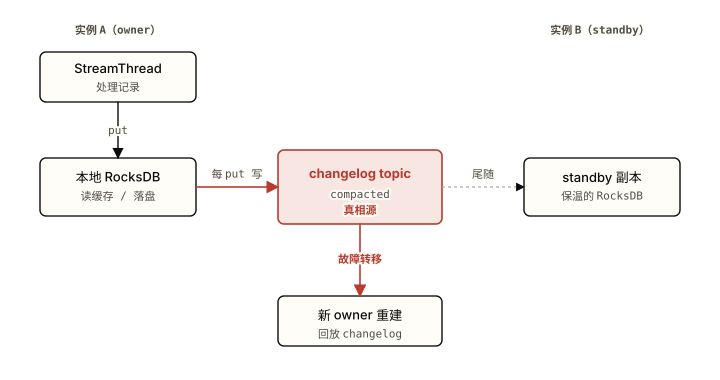

*图 2.1 本地 RocksDB 只是缓存，每次 put 都写进 compacted changelog——后者才是真相源。 注意：实例 A 挂掉后，新 owner 不是从 A 的盘恢复（盘没了），而是回放 changelog；standby 提前尾随同一条日志，把"分钟级回放"压成"秒级追尾"。*

故障转移的代价由状态大小决定。一个多 GB 的状态从零回放 changelog 会**阻塞启动数分钟**——这是 Streams 运维里最常被点名的痛点（[04 章](https://zhiwenliang.github.io/learning/kafka-streams/04-pitfalls.html#restore)专门讲它）。缓解手段是 **standby 副本**（`num.standby.replicas`）：另一个实例后台尾随同一条 changelog，把状态"保温"在本地 RocksDB 里；owner 挂掉时再平衡把 task 优先分给持有 standby 的实例，它只需追上最后一小段日志，恢复从分钟降到秒。Kafka 4.3 的 KIP-1035 进一步让 StateStore 自己管理 changelog 的已恢复 offset，重启后能跳过已重放的部分，恢复更快。

**word-count-store.java**

```java
// 一个有状态 count：状态进本地 RocksDB，并由内部 changelog 撑腰
KStream<String, String> lines = builder.stream("text-lines");
KTable<String, Long> counts = lines
    .flatMapValues(v -> Arrays.asList(v.toLowerCase().split("\\W+")))
    .groupBy((key, word) -> word)            // 改 key → 触发重分区（见 §2.3）
    .count(Materialized.<String, Long>as(    // 物化为一个具名状态存储
        Stores.persistentKeyValueStore("word-counts")));
// 这块状态对应的内部 topic：
//   <application.id>-word-counts-changelog   （compacted，真相源）
```

> **代码解读**
>
> **count(Materialized…)** 把聚合结果物化进名为 `word-counts` 的 RocksDB 存储，Streams 同时为它建一条 compacted changelog topic；这条 topic 的 retention 必须足够长，否则压缩后丢的就是真相。

表 2.1 · 状态放哪：远程状态库 vs 本地 RocksDB + changelog

| 方案 | 优势 | 为什么没选 / 选中 |
| --- | --- | --- |
| 远程状态库（Redis / Cassandra / 外部 KV） | 状态与计算解耦，实例无盘、再平衡不用搬状态 | 每次 get/put 走一跳网络（毫秒级 vs 本地亚毫秒），热路径吞吐塌方；还要单独运维一套 HA 集群、自己解决一致性 |
| 纯内存状态（无落盘、无 changelog） | 最快，零磁盘、零外部 topic | 进程一重启状态全丢，无法容错；状态超过堆就 OOM——只适合可重算的小状态 |
| 本地 RocksDB + compacted changelog | 本地读亚毫秒、无逐条网络跳；changelog 复用 Kafka 已有的复制/HA，无需第二个数据库 | 选中：把"复制层"外包给 Kafka 自己——状态在哪算就在哪存，容错由日志兜底 |

#### 带来的代价

① **恢复阻塞**：多 GB 状态从零回放 changelog 会阻塞启动数分钟，无 standby 时每次再平衡都会触发。② **写量翻倍**：每次 put 既写本地 RocksDB 又写一条 changelog 记录，broker 端多承一份写入和存储。③ **堆外内存**：RocksDB 的 block cache 与 memtable 分配在 JVM 堆**之外**，`-Xmx` 管不住——容器内存按"堆 + RocksDB 缓存 + 余量"算，否则被 OOMKilled（[04 章资源陷阱](https://zhiwenliang.github.io/learning/kafka-streams/04-pitfalls.html#resource)）。④ 版本化状态存储（KIP-889, 3.5 GA）给每个 key 存多版本 `(value, timestamp)` 以支持 `get(key, asOf)` 和正确的乱序处理，代价是更高的存储与写放大。

> **🤔 想一想**
>
> 一个实例持有 8GB 状态，没有配 standby 副本。它崩溃后被 Kubernetes 用一个全新 pod（空磁盘）拉起。新 pod 要多久才能开始处理新记录？如果改用持久卷（StatefulSet）让磁盘跨重启存活，会快多少？
>
> <details>
> <summary>展开答案（先停 10 秒再点）</summary>
>
> 空盘启动必须从头回放整条 changelog 重建 8GB RocksDB——受 broker 读带宽和 RocksDB 写入速度限制，分钟级甚至更久，期间该 task 不处理任何新记录。这就是"再平衡卡顿数分钟"的来源。
> 持久卷让本地 RocksDB 跨重启存活：新 pod 挂回旧盘，状态目录还在，只需从 changelog 追上崩溃后那一小段增量，恢复降到秒级。这也是为什么 standby 副本（在别的实例保温）和持久卷（在本地保活）都能解同一个问题——它们都让"恢复"从"全量回放"退化成"追尾增量"。
>
> </details>

### 2.2 再平衡与缩放：消费组那套，外加搬状态的代价

缩放就是消费组再平衡——task 在实例和线程间重新分配，但有状态 task 被搬走时要在新落点重建状态。

Streams 不自造调度器。每个 JVM 实例起 `num.stream.threads` 个 StreamThread，每个线程内嵌一个普通 consumer，全部以 `application.id` 作为 `group.id` 加入同一个[消费组](https://zhiwenliang.github.io/learning/kafka/02-principles.html#rebalance)。**task = 子拓扑输入 topic 的每个分区一个**，所以 task 总数被最大输入分区数钉死、运行时不可改。加一个实例、某实例掉线、某线程死掉，都触发一次再平衡，把所有 task 在当前所有实例的所有线程间重新摊分。无状态 task 搬家几乎零成本——换个线程接着消费就行。有状态 task 不同：它在新落点没有本地 RocksDB，必须先**回放 changelog 重建状态**（或从 standby 追尾）才能处理，这段时间该分区的处理停滞。所以"缩放"在有状态拓扑里从来不是瞬时的——这是机制的必然代价，不是故障。

分配逻辑在哪算，是 4.x 的关键变化。经典协议（classic）由其中一个 client 当 group leader、在客户端计算 task 分配；**KIP-1071 Streams 再平衡协议**把分配移到 **broker 端的 group coordinator**，**4.2 起新集群默认开**（需 broker + client 都 ≥ 4.2，feature `streams.version=1`）。broker 端分配能拿到全局视图做更稳的 task 放置与 standby 调度，但**仍不支持** static membership、运行中在线把 classic 协议迁到 streams 协议、以及运行中修改 topology。

表 2.2 · 再平衡协议：classic（客户端分配）vs KIP-1071（broker 端分配）

| 方案 | 优势 | 为什么没选 / 选中 |
| --- | --- | --- |
| 自造专用调度器（独立 master 分配 task） | 可针对流处理做最优放置 | 得自己实现成员发现、故障检测、再平衡、与 EOS 事务的协同——把消费组已经解决的问题重造一遍 |
| classic 协议（client 端 leader 分配） | 复用消费组，零额外 broker 改动；老集群唯一选项 | 分配在客户端算，leader 只有局部视图；大消费组的 join/sync 来回开销与"停顿式"再平衡更明显 |
| KIP-1071（broker 端 group coordinator 分配） | broker 全局视图、更稳的 task/standby 放置、再平衡更平滑；4.2 新集群默认 | 选中（新集群）：把分配收归 broker；代价是仍不支持 static membership 与在线协议迁移 |

#### 带来的代价

① **有状态搬迁成本**：每次再平衡，被重分配的有状态 task 都要重建状态——无 standby 时这就是分钟级停顿。② **并行上限 = 最大输入分区数**：`num.stream.threads` 把线程提到 task 数能用满单实例，再加实例才有意义；线程/实例超过 task 数则纯闲置，要更多并行只能重分区输入 topic（破坏性操作）。③ **无 static membership**（KIP-1071 下）：滚动重启 / pod 漂移更容易触发全量再平衡，靠 standby 副本和持久卷缓解，而非靠 `group.instance.id` 跳过再平衡。

> **🤔 想一想**
>
> 输入 topic 有 6 个分区。部署 4 个实例、每个 `num.stream.threads=3`，共 12 个线程。能跑多少个并行 task？多出来的线程在干什么？要再提并行度，唯一的办法是什么？
>
> <details>
> <summary>展开答案（先停 10 秒再点）</summary>
>
> task 数 = 最大输入分区数 = 6，被钉死。12 个线程里只有 6 个各领一个 task，另外 6 个线程**空闲**（持有 consumer 但分不到 task）。加机器、加线程都越不过 6 这个天花板。
> 唯一提并行度的办法是把输入 topic 重分区到更多分区（比如 12），让 task 数随之上去——但这是破坏性操作（改变 key→分区映射、打乱既有顺序与状态归属），通常意味着重建拓扑。这就是为什么分区数要在设计阶段按峰值并行需求预留。
>
> </details>

### 2.3 重分区：改 key 就给下游埋了一次往返

改 key 的算子置一个"需重分区"标志，下游第一个 stateful 算子自动建一条 repartition topic 把数据按新 key 重洗。

聚合和等值 join 要求"相同 key 的记录落在同一个 task/分区"（共分区）。但改 key 的操作——`selectKey` / `map` / `flatMap` / `groupBy`——会让记录的新 key 与它当前所在分区不再一致。Streams 的处理方式：这些算子只是**置一个"需重分区"标志**，自己不立即重洗；当下游出现第一个依赖 key 的 stateful 算子（`aggregate` / `count` / `join`）时，Streams 在它前面**自动插入**一条内部 `<application.id>-<name>-repartition` topic：上游把改了 key 的记录 produce 进这条 topic（按新 key 分区），下游再把它**重新消费**进来——此时相同新 key 必然同分区，聚合/join 才正确。`selectKey` 是 **lazy** 的：单独用它（后面没有依赖 key 的算子）不会建任何 topic，只有真正需要共分区的下游才把重洗物化出来。这是"默认正确"的设计——用户不必手动保证共分区，代价是这条往返被藏在拓扑里。

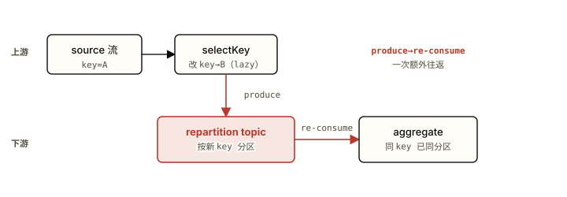

*图 2.2 改 key 的算子（selectKey）不立即重洗，而是给下游 aggregate 埋了一条 repartition topic——数据先 produce 出去、再 re-consume 回来。 注意：这一次 broker 往返是延迟与磁盘成本的来源； selectKey 单独用不建 topic，是下游的 aggregate 把它物化出来的。*

表 2.3 · 共分区怎么保证：强制用户共分区 vs 自动 repartition

| 方案 | 优势 | 为什么没选 / 选中 |
| --- | --- | --- |
| 强制用户事先共分区（改 key 后 join 直接报错，要用户手动重发到对齐的 topic） | 零隐藏 topic，成本完全显式，工程师清楚每一跳 | 把共分区的正确性责任全压给用户，极易出错；漏对齐就静默错或拓扑失败，DSL 的"声明式"承诺破产 |
| 每个改 key 的算子都立即重洗（不 lazy） | 语义直白，所见即所建 | `selectKey` 后若没有依赖 key 的下游，重洗纯属浪费；会凭空多出大量无用 repartition topic |
| 改 key 置标志 + 下游 stateful 算子自动按需 repartition（lazy） | 默认正确，用户不必手动共分区；只在真正需要时才物化重洗 | 选中：正确性默认兜底；代价是 produce→re-consume 往返被藏进拓扑，成本不显眼 |

#### 带来的代价

① **一次完整往返**：每个被物化的重分区点，每条记录都要 produce 进 repartition topic 再 re-consume 回来——多一份网络、broker 磁盘、序列化/反序列化和端到端延迟。② **隐藏 topic 成本**：这些 topic 不在你的代码里，但占 broker 存储、计入分区配额，排查时容易遗漏。③ **能省则省**：不改 key 的操作（`mapValues` / `filter`）和 `groupByKey`（不改 key）不触发重分区；优先它们而非 `map` / `groupBy`。用 `topology.describe()` 打印拓扑、数清实际建了几条 repartition topic（[04 章](https://zhiwenliang.github.io/learning/kafka-streams/04-pitfalls.html#resource)）。

> **🤔 想一想**
>
> 下面两段代码，哪段会建出 repartition topic？`stream.selectKey((k,v)->v.userId()).to("out")` 还是 `stream.selectKey((k,v)->v.userId()).groupByKey().count()`？
>
> <details>
> <summary>展开答案（先停 10 秒再点）</summary>
>
> 第一段**不会**。`selectKey` 是 lazy 的——它只置"需重分区"标志，后面接的是 `to()`（sink，不依赖 key 共分区），没有任何 stateful 算子来物化重洗，所以不建 topic。
> 第二段**会**。`groupByKey().count()` 是依赖 key 的 stateful 算子，它需要"相同 userId 落同分区"，于是 Streams 在它前面插入 repartition topic，把 selectKey 改过 key 的记录重洗一遍。要点：建不建 topic 取决于**下游是否真的需要共分区**，不取决于你改没改 key。
>
> </details>

### 2.4 窗口与时间：stream-time 由数据推进，不是墙上时钟

窗口按事件时间切分，由 stream-time（每 task 见过的最大时间戳）驱动关闭——它只在有记录到达时前进。

窗口把无界流切成有界的桶来聚合，四种形状：**tumbling 滚动**（固定大小、不重叠，一条记录进一个窗）、**hopping 跳跃**（固定大小 + 更小步进 → 窗口重叠 → 一条记录进多个窗）、**sliding 滑动**（按记录两两之间的时间差成对落窗）、**session 会话**（按活动间隙合并，间隙超阈值就开新会话）。关键不在形状，而在驱动它们关闭的时钟。Streams 默认用 **event-time**（记录自带的时间戳，由 `TimestampExtractor` 提取），不是 **processing-time**（记录被处理的墙上时间），也不是 **ingestion-time**（写入 broker 的时间）。窗口由 **stream-time** 推进：stream-time = 这个 task 到目前为止见过的**最大记录时间戳**，单调不减。它只在**有记录到达**时前进——没有新数据，stream-time 就**冻结**，依赖它关闭的窗口永远不发结果。这是 event-time 换来可重放确定性（同样的输入重跑得到同样的窗口结果，与运行时刻无关）所付的代价。

迟到事件由 **宽限期 grace** 控制：窗口在 `windowEnd` 逻辑上结束后，还允许 stream-time 推进到 `windowEnd + grace` 之前到达的迟到记录更新该窗结果；一旦 stream-time 越过 `windowEnd + grace`，更晚到的记录被**静默丢弃**（只计入 dropped-records 指标，不报错、不进死信）。状态存储的 retention 必须 ≥ 窗口大小 + grace，否则窗口还没关、状态先被清掉。若要"每个窗口只发一个最终结果"而非每次更新都发一条中间结果，用 **`suppress(untilWindowCloses)`**（KIP-328）把中间更新压住、只在窗口关闭时发一次。

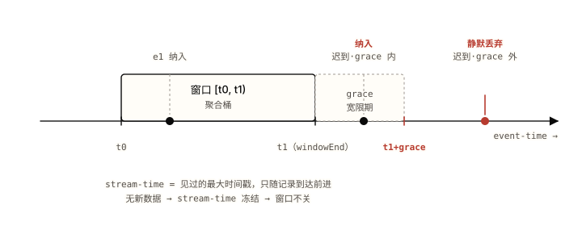

*图 2.3 窗口由 stream-time（见过的最大事件时间戳）推进；grace 内的迟到事件被纳入，越过 t1+grace 的被静默丢弃。 注意：是"是否有更晚的记录把 stream-time 推过 t1+grace"决定迟到记录的去留，而不是墙上时钟——所以一个空闲分区会冻结 stream-time，让窗口永远不关、结果永远不发。*

表 2.4 · 窗口时钟：processing-time vs event-time

| 方案 | 优势 | 为什么没选 / 选中 |
| --- | --- | --- |
| processing-time（按记录被处理的墙上时间分窗） | 实现简单，时间永远向前、永不冻结，低延迟出结果 | 结果不可重放——同一份数据重跑因机器/时刻不同得到不同窗口归属；网络抖动、回填历史数据会把记录算进错误的窗 |
| ingestion-time（按写入 broker 的时间分窗） | 比 processing-time 稳定，时间在 broker 端钉死 | 仍不反映事件真实发生时刻；上游缓冲/批量写入会扭曲时间；回填依旧错 |
| event-time + stream-time（按事件自带时间戳分窗） | 可重放、确定性——同输入同结果，与运行时刻无关；正确处理乱序与回填 | 选中：正确性优先；代价是空闲/低流量分区会冻结 stream-time，窗口不关、结果不发 |

#### 带来的代价

① **空闲分区冻结**：stream-time 只随记录前进，低流量或空闲分区让窗口迟迟不关、结果延迟甚至永不发出——event-time 的根本代价（[04 章](https://zhiwenliang.github.io/learning/kafka-streams/04-pitfalls.html#correctness)）。② **suppress 的内存压力**：`suppress` 把未关窗口的中间状态缓在内存，缓冲满时行为取决于配置——`emitEarlyWhenFull` 会在内存压力下**提前发出非最终结果**（破坏"只发最终"的承诺），要严格"最终"必须用 `shutDownWhenFull`（宁可崩也不发中间结果）。③ **retention 约束**：窗口状态与 changelog 的 retention 必须 ≥ 窗口 + grace，配小了窗口没关状态先没。

> **🤔 想一想**
>
> 一个 5 分钟 tumbling 窗口 + 1 分钟 grace。某分区在 10:00 收到最后一条记录后就没有任何新数据进来了。覆盖 09:55–10:00 的那个窗口，结果会在什么时候发出？
>
> <details>
> <summary>展开答案（先停 10 秒再点）</summary>
>
> 它**不会**自动发出（至少在该分区有新记录之前）。窗口要在 stream-time 推进到 `windowEnd + grace`（即 10:01）之后才关闭，而 stream-time = 该 task 见过的最大记录时间戳。10:00 之后没有任何记录到达，stream-time 就停在 10:00，永远到不了 10:01，窗口永远不关、结果永远不发。
> 这正是 event-time 的代价：墙上时间走到 10:05 也没用，Streams 不看墙钟。要让低流量场景的窗口能关，得靠业务侧持续有数据、或用 processing-time 兜底（牺牲可重放）、或周期性灌入 heartbeat 记录把 stream-time 顶上去。
>
> </details>

### 2.5 Join：四种语义，各自的共分区要求与逃生口

四种 join 对应四种数据形态，等值 join 要求两侧共分区，GlobalKTable 与外键 join 是免共分区的逃生口。

join 把两条流/表按 key 关联，语义由两侧是[流还是表](https://zhiwenliang.github.io/learning/kafka-streams/01-concepts.html#kstream-ktable)决定。**KStream-KStream**=窗口化 join：两侧记录都入状态存储缓冲，在窗口 + grace 内每出现一对匹配就发一条——因为两条都是无界流，必须给一个时间窗口才能界定"什么算同时发生"。**KStream-KTable**=查表 join：流记录到达时探查表的**当前**值，表自己的更新不回头重新触发已处理的流记录——典型用于流数据打维表标签。**KTable-KTable**=维护式 join：任一侧更新都重新计算并发出新结果，维护一个始终最新的连接视图。**外键 join**（KIP-213, 2.4）：左表按 value 里提取的外键关联右表主键，Streams 在背后建**两个隐藏 topic**（subscription + response）加一个复合 RocksDB 存储来重新按外键路由——这是唯一不要求左侧用主键 join 的表-表 join。

**共分区要求**是等值 join 的硬约束：两侧必须**相同分区数 + 相同分区方式**（同一个 producer 分区器、同样的 key），相同 key 才会落到同一个 task。分区数不一致，Streams 在**启动时直接校验失败**；分区方式不一致（数量碰巧相同但分区器不同），Streams 不报错却**静默丢匹配**——这是最难排查的 join 故障。Streams 会对改过 key 的一侧自动重分区来对齐，但两个独立来源 topic 的分区方式得你自己保证。**GlobalKTable** 是逃生口：它在每个实例[全量加载所有分区](https://zhiwenliang.github.io/learning/kafka-streams/01-concepts.html#kstream-ktable)，所以任何 key 本地都能查到，**免共分区**，但代价是每实例一份全量副本（磁盘 + 内存 + 启动 bootstrap 延迟），只配小而慢变的维表；外键 join 同样免共分区（它自己用隐藏 topic 重路由）。

表 2.5 · 维表关联：共分区 join vs GlobalKTable join

| 方案 | 优势 | 为什么没选 / 选中 |
| --- | --- | --- |
| 共分区的 KStream-KTable join（两侧对齐分区数 + 分区方式） | 每实例只持有本分区那部分维表，内存/磁盘省；维表可大 | 必须保证两侧严格共分区——数量不符启动失败、方式不符静默丢匹配；维表来自别处时对齐成本高且易错 |
| 把维表 join 改成外部查询（每条流记录查一次远程 DB/缓存） | 维表无需进 Streams，更新即时可见 | 每条记录一跳网络，吞吐塌方且引入外部依赖；丢了 Streams"本地状态"的全部优势 |
| GlobalKTable join（维表每实例全量副本） | 免共分区、任意 key 本地可查、用流记录的任意字段关联；最省心 | 选中（小维表）：拿全量副本换掉共分区约束；代价是每实例全量内存/磁盘 + 启动 bootstrap，仅限小而慢变的维表 |

#### 带来的代价

① **静默无输出**：未共分区时（分区方式不一致）零输出且无任何报错——join "不工作"却查不出原因，必须核对两侧分区数 + 分区器（[04 章](https://zhiwenliang.github.io/learning/kafka-streams/04-pitfalls.html#correctness)）。② **外键 join 的内部 topic**：FK join 额外建 subscription + response 两条内部 topic 加复合存储，运维面与存储成本随之上升。③ **KStream-KStream 缓冲整窗**：两侧记录在窗口 + grace 内都要入状态存储，宽窗 + 高流量 = 大状态、大 changelog。④ **GlobalKTable 全量代价**：每实例一份完整副本，维表一大就磁盘/内存爆炸、启动 bootstrap 拖慢。

> **🤔 想一想**
>
> 两条 topic 都是 6 个分区，一个 KStream-KTable join 上线后**零输出**，日志里没有任何报错。分区数都对得上，问题嫌疑最大的出在哪？换成 GlobalKTable 为什么能绕过？
>
> <details>
> <summary>展开答案（先停 10 秒再点）</summary>
>
> 嫌疑最大的是**分区方式不一致**：两条 topic 由不同上游写入、用了不同的 producer 分区器（比如一边按字符串 hash、一边按自定义逻辑），导致相同 key 落到不同分区号。Streams 启动时只校验分区**数量**（这里都是 6，过关），不校验分区**方式**，于是相同 key 永远不相遇，匹配全部丢失——零输出且零报错。
> GlobalKTable 绕过是因为它在每个实例**全量加载所有分区**：不管流记录的 key 经哪种分区方式落在哪，本地都有完整维表可查，共分区约束直接不适用。代价就是那份全量副本——所以它只对小维表成立。
>
> </details>

### 2.6 EOS v2：一个事务包住 offset、状态、输出

exactly\_once\_v2 把 offset 提交、状态 changelog 写、输出 produce 绑进一个 Kafka 事务，下游 read\_committed 只读已提交。

read-process-write 循环里有三件事必须同生共死，否则就重复或丢数：消费位移的**提交**、状态的 **changelog 写**、结果的**输出 produce**。任意两件之间崩溃都会破坏 exactly-once——比如输出发了但 offset 没提交，重启后重新处理同一批，输出就重复。`processing.guarantee=exactly_once_v2` 用一个 **Kafka 事务**把这三者原子化：要么三件一起提交、要么一起回滚。下游消费者设 `isolation.level=read_committed` 就只读已提交的记录、自动跳过被回滚（aborted）的部分。v2 的关键改进（KIP-447）是**一个 StreamThread 一个 producer** 覆盖该线程的所有 task；v1（`exactly_once`，已淘汰）是**一个 task 一个 producer**，高分区数下 producer 数量爆炸、内存与 broker 端事务协调开销失控。这就是为什么 v2 是 3.0 起的默认、v1 被弃用。

**eos-config.properties**

```properties
# 生产者侧（Streams 应用）
processing.guarantee=exactly_once_v2
# EOS 下 Streams 把提交间隔默认改成 100ms（非 EOS 是 30000ms）——
# 这才是"开了 EOS 就变慢"的真因，不是事务本身的固定开销
commit.interval.ms=100
# EOS 需要事务，至少 3 个 broker（事务状态 topic 副本因子默认 3）

# 消费者侧（下游应用）：不设这个，EOS 形同虚设
isolation.level=read_committed
```

> **代码解读**
>
> **commit.interval.ms** EOS 把它从 30000ms 砍到 100ms——提交越频繁、未提交批越小、端到端延迟越低，但事务开销和吞吐损失随之上升；调它就是在延迟和吞吐间权衡。
> **isolation.level** 下游不设 `read_committed` 就会读到未提交甚至已回滚的记录，上游的 EOS 白做。

表 2.6 · 精确一次怎么做：at-least-once + 消费侧幂等 vs EOS v2

| 方案 | 优势 | 为什么没选 / 选中 |
| --- | --- | --- |
| at-least-once + 下游按业务键幂等去重 | 无事务开销、吞吐高；不依赖 ≥3 broker | 每个下游都得自己实现去重（去重表 / 幂等 upsert），漏一处就重复；对"状态聚合"这类内部计算无能为力——状态会被重放放大 |
| eos-v1（exactly\_once，一 task 一 producer） | 同样的端到端原子语义 | 已淘汰：高分区数下 producer 数量随 task 爆炸，内存与事务协调开销失控 |
| exactly\_once\_v2（一线程一 producer，KIP-447） | offset+状态+输出 原子提交，状态聚合也精确一次；producer 数只随线程数增长 | 选中：3.0 起默认；代价是提交延迟（commit.interval.ms 默认 100ms）+ 仅限单 Kafka 集群内、不覆盖外部副作用 |

#### 带来的代价

① **延迟与吞吐**：EOS 把 `commit.interval.ms` 默认从 30000ms 改到 100ms——这才是"开了 EOS 就变慢"的真因（更频繁提交 + read\_committed 消费者 15–30% 吞吐下降），而非事务本身有多重。调大它换吞吐、调小换延迟（[04 章](https://zhiwenliang.github.io/learning/kafka-streams/04-pitfalls.html#correctness)）。② **边界止于 Kafka**：事务只在**单个 Kafka 集群内**原子，**不覆盖外部副作用**——往 DB / HTTP / 发短信，事务回滚也撤不回，仍会重复。要端到端一致得上 outbox 模式（把外部写也变成 Kafka 写，由另一个消费者按幂等落地）。③ **部署门槛**：需要至少 3 个 broker（事务状态 topic 副本因子默认 3），下游必须配 `read_committed` 否则 EOS 形同虚设。这与[主教程的投递语义](https://zhiwenliang.github.io/learning/kafka/02-principles.html#delivery)一脉相承——Streams 的 EOS 是消费组 + 事务在流处理上的封装，不是新机制。

> **🤔 想一想**
>
> 一个 EOS v2 应用对每条记录的副作用是：写一条结果到输出 topic + 调一次外部支付 HTTP 接口。事务回滚（abort）后，输出 topic 那条记录消失了，但支付接口已经被调过。这条记录会怎样？problem 在哪、怎么修？
>
> <details>
> <summary>展开答案（先停 10 秒再点）</summary>
>
> 输出 topic 的写入随事务回滚被撤销，下游 `read_committed` 消费者看不到它——这部分精确一次成立。但**外部支付 HTTP 调用不在 Kafka 事务里**，已经发生且无法回滚；事务重试时这条记录会被重新处理、支付接口被**再调一次**，造成重复扣款。
> 根因：EOS 的原子边界止于单个 Kafka 集群，外部副作用在边界之外。修法是 **outbox 模式**——处理时不直接调支付，而是把"待支付"事件写进输出 topic（这步在事务内，精确一次），由一个独立消费者读出后调支付接口，并对支付接口做**幂等**（按 event-id 去重），把"恰好一次的外部效果"交给幂等而非事务来保证。
>
> </details>

### 2.7 串起来：一条记录在有状态聚合里的完整一生

六个机制不是孤立的。把它们串在一个具体场景上看协同：一条订单事件进入一个 **EOS v2** 的有状态聚合拓扑（按用户 ID 累计消费额），从进入到被下游读到，依次穿过状态、重分区、提交、投递四道关。

> **💡 洞察 · 一条记录的旅程**
>
> ① **进入与重分区**（§2.3）：订单事件以订单号为 key 进入；聚合要按用户 ID,于是 `groupBy(userId)` 改了 key，下游的 `aggregate` 触发一次 repartition——记录被 produce 进 repartition topic、再 re-consume 回来，此时相同用户 ID 已落同一 task。② **更新 RocksDB + 写 changelog**（§2.1）：聚合算子把该用户的累计额更新进本地 RocksDB，同一步把这次变更追加进 changelog topic。③ **EOS 事务提交**（§2.6）：到 `commit.interval.ms`（EOS 下 100ms）时，这条记录的**输入 offset 提交 + changelog 写 + 输出 produce** 被绑进同一个 Kafka 事务一起提交——三者同生共死。④ **下游 read\_committed 读**（§2.6）：下游消费者只读已提交事务里的输出，跳过任何被回滚的部分，拿到精确一次的累计结果。⑤ **若此刻实例崩溃**（§2.1 + §2.2）：再平衡把这个有状态 task 搬到别的实例，新 owner 回放 changelog（或从 standby 追尾）重建该用户的累计额——因为 RocksDB 只是缓存、changelog 才是真相，状态精确恢复到最后一次提交的位置，不重不漏。

这条链解释了一个常被误解的现象：为什么"开了 EOS 的有状态聚合"在崩溃恢复后既不丢数也不重复算。不是因为某个魔法标志，而是因为**状态的真相在 changelog、changelog 的写又被事务和 offset 提交绑在一起**——恢复时回放到的状态，和已提交给下游的输出，永远对齐在同一个事务边界上。

### § 本章 self-check

先合上教程，把你能想到的答案写在纸上或编辑器里。
写完再点开答案对照——直接点开等于把这一节当再读一遍。

1. 为什么说本地 RocksDB 只是缓存、changelog 才是真相源？故障转移时新 owner 从哪里恢复状态，standby 副本把什么从"分钟"压成了"秒"？
2. `selectKey` 被称为 lazy，是什么意思？什么时候它身后才真的冒出一条 repartition topic？为什么优先用 `groupByKey` 而非 `groupBy`？
3. stream-time 由什么驱动？为什么一个空闲分区会让窗口"永远不发结果"？这是 event-time 换来了什么而付的代价？
4. 四种 join 里哪些要求共分区、哪些不要求？"分区数对得上但 join 零输出且无报错"嫌疑最大的原因是什么？
5. EOS v2 的事务到底包住了哪三件事？为什么说"开了 EOS 变慢"的真因是 `commit.interval.ms` 而不是事务本身？EOS 的原子边界到哪里为止？
6. **（跨机制综合）**一条记录进入"EOS v2 + 按用户 ID 聚合"的拓扑，从进入到被下游 read\_committed 读到，依次穿过哪些机制？如果在事务提交后、下游读到前实例崩溃，状态如何保证不重不漏地恢复？

<details>
<summary>答案（先做完再展开）</summary>

1. 本地 RocksDB 随实例消失（重调度/坏盘/再平衡搬走就没了），而每次 put 都同步追加进 compacted changelog——后者跨实例持久，能从零重建 RocksDB，所以它才是真相源。故障转移时新 owner **回放 changelog** 重建状态（不是从旧实例的盘恢复，盘已不在）。standby 副本在另一实例后台尾随同一条 changelog 保温本地 RocksDB，接管时只需追上最后一小段增量，把全量回放（分钟）压成追尾（秒）。
2. lazy 指 `selectKey` 只置"需重分区"标志、自己不立即重洗也不建 topic。只有当下游出现真正依赖 key 共分区的 stateful 算子（aggregate/count/join）时，Streams 才在它前面物化出一条 repartition topic。`groupByKey` 不改 key、不触发重分区；`groupBy` 改 key、要付一次 produce→re-consume 往返——能用前者就别用后者。
3. stream-time = 该 task 见过的最大记录时间戳，单调不减，**只在有记录到达时前进**。空闲分区没有新记录，stream-time 冻结，依赖它推进到 `windowEnd+grace` 才关闭的窗口永远不关、结果永远不发。这是 event-time 换来**可重放确定性**（同输入同结果、与运行时刻无关、正确处理乱序回填）所付的代价——Streams 不看墙上时钟。
4. KStream-KStream / KStream-KTable / KTable-KTable 等值 join **要求**共分区（相同分区数 + 相同分区方式）；GlobalKTable join 和外键 join **不要求**（前者每实例全量副本，后者用隐藏 topic 重路由）。"分区数对得上但零输出无报错"嫌疑最大的是**分区方式不一致**——Streams 启动只校验分区数量、不校验分区器，相同 key 落到不同分区号，匹配全部静默丢失。
5. 包住三件事：输入 **offset 提交** + 状态 **changelog 写** + 输出 **produce**，绑进一个 Kafka 事务原子提交/回滚，下游 `read_committed` 跳过回滚部分。"变慢"真因是 EOS 把 `commit.interval.ms` 默认从 30000ms 改到 100ms（提交更频繁 + read\_committed 吞吐降），不是事务固定开销。原子边界**止于单个 Kafka 集群**，不覆盖 DB/HTTP/短信等外部副作用（要 outbox + 幂等）。
6. 依次穿过：**repartition**（groupBy(userId) 改 key→repartition topic 重洗，§2.3）→ **状态写**（更新本地 RocksDB + 追加 changelog，§2.1）→ **EOS 事务提交**（offset+changelog+输出 三者绑一个事务，§2.6）→ **下游 read\_committed 读**（只读已提交，§2.6）。提交后、下游读到前崩溃：再平衡把有状态 task 搬到新实例（§2.2），新 owner 回放 changelog 或从 standby 追尾重建该用户累计额（§2.1）；因为状态真相在 changelog、changelog 写又与 offset 提交绑在同一事务，恢复到的状态与已提交给下游的输出对齐在同一事务边界，不重不漏。

</details>

---

**💡 进阶挑战 · 刚好够不着**

#### 给一个"窗口聚合 + EOS + 维表富集"的拓扑画出全部内部 topic

设计这样一条拓扑：从 `orders`（按订单号分区）读流，`selectKey` 改成用户 ID，做一个 5 分钟 tumbling 窗口的金额求和（带 grace + suppress 只发最终结果），再用一个小的 `users` 维表富集出用户等级，整条拓扑开 `exactly_once_v2`，结果写到 `user-spending`。不写代码，只回答：这条拓扑会让 Streams 在 broker 上建出哪些**内部 topic**（repartition / changelog 各几条、分别服务谁）？维表用 KTable 还是 GlobalKTable 才能免去对 `orders` 的共分区要求？suppress 的状态存活在哪、它的 changelog retention 要 ≥ 多少？

<details>
<summary>提示（卡住再展开）</summary>

顺着记录流向数：`selectKey(userId)` 后的窗口聚合是 stateful 且依赖 key→触发一条 repartition topic；窗口聚合的状态存储 + suppress 的缓冲各自有 changelog topic。维表若用 KTable 做 KStream-KTable join，要求与（已按 userId 重分区的）流共分区；用 GlobalKTable 则每实例全量、免共分区——但要权衡 `users` 是否够小。suppress 的 changelog retention 要覆盖"窗口大小 + grace"否则窗口没关状态先被清。把每条内部 topic 的命名前缀 `<application.id>-…` 写出来，再用 `topology.describe()` 的输出对照验证。

</details>

---

#### 本章参考

- [Kafka Streams 官方文档](https://kafka.apache.org/documentation/streams/)（官方）
- [KIP-1071: Streams Rebalance Protocol](https://cwiki.apache.org/confluence/display/KAFKA/KIP-1071:+Streams+Rebalance+Protocol)（设计文档 · broker 端再平衡）
- [KIP-889: Versioned State Stores](https://cwiki.apache.org/confluence/display/KAFKA/KIP-889:+Versioned+State+Stores)（设计文档 · 版本化状态存储）
- [Confluent: Enabling Exactly-Once in Kafka Streams](https://www.confluent.io/blog/enabling-exactly-once-kafka-streams/)（维护者博客 · EOS 实现）
- [developer.confluent.io: Kafka Streams Internals](https://developer.confluent.io/courses/kafka-streams/internals/)（高质量教程 · 内部机制）
- [Apache Kafka 4.3.0 Release Announcement](https://kafka.apache.org/blog/2026/05/22/apache-kafka-4.3.0-release-announcement/)（官方 · 含 KIP-1035 恢复优化，截至 2026-06-03）


<a id="chapter-03"></a>

Chapter 03

## 实操：把原理写成一个能跑的 Streams 应用

02 章把六个机制拆开讲透了——状态怎么存怎么恢复、改 key 何时偷偷建 repartition topic、窗口靠 stream-time 推进、join 的共分区要求、EOS 用一个事务包住什么。理解了机制，这章动手把它写成代码：一个完整可运行的 Streams 应用，从 `StreamsBuilder` 到 `KafkaStreams.start()`，再到窗口聚合 + 维表 join。三阶递进——完整示例逐行读、半成品填决策点、开放练习自己写。

> **⚠️ 代码验证状态**
>
> 本章代码基于 **kafka-streams 4.x** Java DSL，未在本机逐一运行。API 形态对照 4.x javadoc 写就；运行命令与预期输出按单机 KRaft broker 的行为描述。把它当可读的参照实现，落到你自己的环境时以本机编译/运行结果为准。

> 本章你将建立的 schema
>
> - 一个 Streams 应用的骨架：Properties（application.id + bootstrap.servers + 默认 serde）→ StreamsBuilder → Topology → KafkaStreams.start()
> - worked example：单词计数完整可运行——stream→flatMapValues→groupBy→count→toStream→to，每行映射回 01/02
> - partial example：窗口聚合留三个决策点（窗口类型与 grace、groupByKey vs groupBy、Materialized 显式 serde）
> - open exercise：5 分钟滚动窗口金额聚合 + KTable 维表 join 富集，自己写
> - 常见环境失败：默认 serde 没配、输入 topic 没建、application.id 改名导致状态重置

读这章前请带着 02 的结论：[改 key 会触发重分区](https://zhiwenliang.github.io/learning/kafka-streams/02-principles.html#repartition)、[状态真相在 changelog](https://zhiwenliang.github.io/learning/kafka-streams/02-principles.html#state-store)、[stream-time 只在有数据时前进](https://zhiwenliang.github.io/learning/kafka-streams/02-principles.html#windowing-time)。下面每段代码都把这些结论落成一行行 DSL；逐行解读会反复指回 01 的概念和 02 的取舍——代码本身只是把那些机制具象出来的载体。

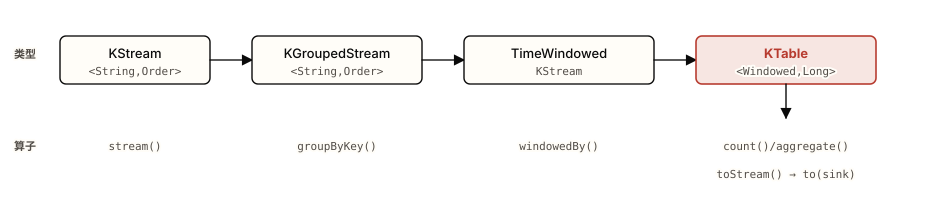

*图 3.1 一条窗口聚合在 DSL 里走过的类型链。 注意：类型在每个算子后 变了 —— groupByKey 把 KStream 变成 KGroupedStream、 windowedBy 再变成 TimeWindowedKStream、聚合产出的是 key 被 Windowed 包过的 KTable。能在脑子里跟住这条类型链，就不会在编译期被泛型卡住。*

### 3.1 环境：依赖、broker、应用骨架

一个 Streams 应用就是一个普通 Java 进程，靠一份 Properties 接上 broker，靠 StreamsBuilder 描述拓扑，靠 KafkaStreams.start() 跑起来。

#### Maven 坐标

Streams 是一个库，加一个依赖就够——它会把 kafka-clients 作为传递依赖拉进来。运行 Streams + clients 需要 Java 11，broker（4.0 起）需要 Java 17。

**pom.xml**

```xml
<dependency>
  <groupId>org.apache.kafka</groupId>
  <artifactId>kafka-streams</artifactId>
  <version>4.3.0</version>
</dependency>
<!-- 序列化常用 JSON 时再加（本章 worked example 只用内置 Serdes，可不加）：
<dependency>
  <groupId>com.fasterxml.jackson.core</groupId>
  <artifactId>jackson-databind</artifactId>
  <version>2.17.0</version>
</dependency> -->
```

> **代码解读**
>
> **kafka-streams** 这一个 artifact 就是 Streams 的全部入口；`StreamsBuilder`、`KStream`、`KafkaStreams`、`Serdes` 都在里面。`streams-scala` 在 4.3 已弃用、5.0 移除，Java DSL 是长期选项。

#### 本地 broker

Streams 需要一个能连的 Kafka 集群。本地起一个单机 KRaft broker（4.x 已彻底去掉 ZooKeeper）即可——具体步骤见[主教程 §3.1 的单机 KRaft 启动](https://zhiwenliang.github.io/learning/kafka/03-practice.html#setup)，这里只取结论：broker 监听在 `localhost:9092`，用 `kafka-topics.sh` 建 topic。Streams 应用**不会替你建输入 topic**（只会建内部的 repartition / changelog topic），所以输入 topic 要先手动建好。

**create-topics.sh**

```bash
# 输入 topic：单词计数的文本行（3 分区——决定了并行上限）
bin/kafka-topics.sh --create --topic text-lines \
  --bootstrap-server localhost:9092 --partitions 3 --replication-factor 1

# 输出 topic：可不预建（to() 写入时若 auto.create.topics.enable=true 会自动建），
# 但生产环境建议显式建，控制分区数与配置
bin/kafka-topics.sh --create --topic word-counts-output \
  --bootstrap-server localhost:9092 --partitions 3 --replication-factor 1

# 验证已建：
bin/kafka-topics.sh --list --bootstrap-server localhost:9092
```

#### 应用骨架：Properties → Topology → start()

每个 Streams 应用都是这同一副骨架。三块缺一不可：一份 `Properties` 告诉运行时连哪个 broker、用什么 `application.id`、默认怎么序列化；一个 `StreamsBuilder` 描述拓扑；一个 `KafkaStreams` 实例把拓扑跑起来并挂上关停钩子。

**AppSkeleton.java**

```java
import org.apache.kafka.common.serialization.Serdes;
import org.apache.kafka.streams.KafkaStreams;
import org.apache.kafka.streams.StreamsBuilder;
import org.apache.kafka.streams.StreamsConfig;
import org.apache.kafka.streams.Topology;
import java.util.Properties;
import java.util.concurrent.CountDownLatch;

public class AppSkeleton {
    public static void main(String[] args) {
        Properties props = new Properties();
        // application.id 同时就是消费组 group.id —— 改名 = 一个全新消费组 = 状态从头来
        props.put(StreamsConfig.APPLICATION_ID_CONFIG, "word-count-app");
        props.put(StreamsConfig.BOOTSTRAP_SERVERS_CONFIG, "localhost:9092");
        // 默认 serde：没有在算子里显式给 Consumed/Produced/Materialized 时，用这两个兜底
        props.put(StreamsConfig.DEFAULT_KEY_SERDE_CLASS_CONFIG, Serdes.String().getClass());
        props.put(StreamsConfig.DEFAULT_VALUE_SERDE_CLASS_CONFIG, Serdes.String().getClass());

        StreamsBuilder builder = new StreamsBuilder();
        // …在这里用 builder 描述拓扑（见 §3.2）…
        Topology topology = builder.build();
        System.out.println(topology.describe());   // 打印拓扑：能看清 Streams 实际建了哪些内部 topic

        KafkaStreams streams = new KafkaStreams(topology, props);
        CountDownLatch latch = new CountDownLatch(1);
        // 优雅关停：close() 会提交 offset、刷写状态、退出消费组，避免下次启动多走一次恢复
        Runtime.getRuntime().addShutdownHook(new Thread(() -> {
            streams.close();
            latch.countDown();
        }));

        streams.start();   // 此刻才真正加入消费组、开始拉取与处理
        try {
            latch.await();
        } catch (InterruptedException e) {
            Thread.currentThread().interrupt();
        }
    }
}
```

> **代码解读**
>
> **application.id** 这一个字符串既是 Streams 应用的身份，也是底层消费组的 `group.id`，还是所有内部 topic 的命名前缀（[01 §1.4](https://zhiwenliang.github.io/learning/kafka-streams/01-concepts.html#library) 的 instance/thread/task 模型就架在这个消费组上）。**DEFAULT\_\*\_SERDE** 没配它、又没在算子里显式给 serde，运行时会在第一条记录上抛 `ClassCastException` 或序列化异常。**start()** 在调用前拓扑只是个对象，调用后才加入消费组、触发首次再平衡、开始处理。

#### 三个最常见的环境失败

表 3.1 · 启动期最常见的三类失败：症状 → 根因

| 症状 | 根因 | 修复 |
| --- | --- | --- |
| 启动即抛序列化 / `ClassCastException` | 没配 `DEFAULT_*_SERDE`，又没在 `Consumed`/`Produced`/`Materialized` 里显式给 serde | 设默认 serde，或在每个 I/O 算子上显式传 serde（值类型不一致时**必须**显式，见 [04 章](https://zhiwenliang.github.io/learning/kafka-streams/04-pitfalls.html#correctness)） |
| 启动后卡住、报 topic 不存在或一直再平衡 | 输入 topic 没预先建——Streams 只建内部 topic，不建你的输入 topic | 先用 `kafka-topics.sh --create` 建好输入 topic 再启动 |
| 改了 `application.id` 后状态像被清空、从头重算 | `application.id` 即 group.id；改名等于一个**全新消费组**，新的内部 topic 前缀、新的 offset 起点 | 把 `application.id` 当不可变的部署身份；要重置状态用 `kafka-streams-application-reset.sh` 而非改名 |

### 3.2 Worked example：完整可运行的单词计数

把一行行文本拆成词、按词分组、计数、写回——经典的 WordCount 是把 01 的 KStream/KTable 和 02 的重分区、状态存储一次性具象出来的最短拓扑。

> **🧠 为什么从这个例子起步**
>
> 单词计数同时踩中四个要点：`stream()` 产出 [KStream](https://zhiwenliang.github.io/learning/kafka-streams/01-concepts.html#kstream-ktable)（每行一条事件）、`flatMapValues` 是 [stateless](https://zhiwenliang.github.io/learning/kafka-streams/01-concepts.html#stateless-stateful) 的一拆多、`groupBy` 改 key 触发 [重分区](https://zhiwenliang.github.io/learning/kafka-streams/02-principles.html#repartition)、`count` 是 stateful 且产出 [KTable](https://zhiwenliang.github.io/learning/kafka-streams/01-concepts.html#kstream-ktable) 并背一条 [changelog](https://zhiwenliang.github.io/learning/kafka-streams/02-principles.html#state-store)。读懂这一个拓扑，后面窗口和 join 只是在它上面加算子。

**WordCountApp.java**

```java
import org.apache.kafka.common.serialization.Serdes;
import org.apache.kafka.common.utils.Bytes;
import org.apache.kafka.streams.*;
import org.apache.kafka.streams.kstream.*;
import org.apache.kafka.streams.state.KeyValueStore;
import java.util.Arrays;
import java.util.Locale;
import java.util.Properties;
import java.util.concurrent.CountDownLatch;

public class WordCountApp {
    public static void main(String[] args) {
        Properties props = new Properties();
        props.put(StreamsConfig.APPLICATION_ID_CONFIG, "word-count-app");
        props.put(StreamsConfig.BOOTSTRAP_SERVERS_CONFIG, "localhost:9092");
        props.put(StreamsConfig.DEFAULT_KEY_SERDE_CLASS_CONFIG, Serdes.String().getClass());
        props.put(StreamsConfig.DEFAULT_VALUE_SERDE_CLASS_CONFIG, Serdes.String().getClass());

        StreamsBuilder builder = new StreamsBuilder();

        KStream<String, String> lines =
            builder.stream("text-lines", Consumed.with(Serdes.String(), Serdes.String()));

        KTable<String, Long> counts = lines
            // stateless：一行拆成多个词，值变了、key 还是原 key（此处不重分区）
            .flatMapValues(line -> Arrays.asList(line.toLowerCase(Locale.ROOT).split("\\W+")))
            // 改 key：把词本身设成 key —— 触发下游重分区（§2.3）
            .groupBy((key, word) -> word, Grouped.with(Serdes.String(), Serdes.String()))
            // stateful：计数，物化进名为 counts-store 的 RocksDB + 一条 changelog
            .count(Materialized.<String, Long, KeyValueStore<Bytes, byte[]>>as("counts-store")
                       .withKeySerde(Serdes.String())
                       .withValueSerde(Serdes.Long()));

        // KTable → 变更流 → 写回输出 topic（值是 Long，需显式 Long serde）
        counts.toStream()
              .to("word-counts-output", Produced.with(Serdes.String(), Serdes.Long()));

        Topology topology = builder.build();
        System.out.println(topology.describe());

        KafkaStreams streams = new KafkaStreams(topology, props);
        CountDownLatch latch = new CountDownLatch(1);
        Runtime.getRuntime().addShutdownHook(new Thread(() -> { streams.close(); latch.countDown(); }));
        streams.start();
        try { latch.await(); } catch (InterruptedException e) { Thread.currentThread().interrupt(); }
    }
}
```

#### 逐行解读（代码 → 概念，不是代码 → 语法）

> **代码解读**
>
> **builder.stream("text-lines", …)** 把输入 topic 读成一个 [KStream](https://zhiwenliang.github.io/learning/kafka-streams/01-concepts.html#kstream-ktable)——每行文本是一条独立事件、全部保留。`Consumed.with(...)` 显式声明读入时的 key/value serde，不依赖默认值，类型一目了然。

> **代码解读**
>
> **.flatMapValues(...)** [stateless](https://zhiwenliang.github.io/learning/kafka-streams/01-concepts.html#stateless-stateful) 算子：把一行拆成多个词，只改值不改 key。它不需要状态、不触发重分区——一条进、多条出。

> **代码解读**
>
> **.groupBy((key, word) -> word, …)** 这一步把 key 从「原 key」改成「词本身」。[改 key 就置了「需重分区」标志](https://zhiwenliang.github.io/learning/kafka-streams/02-principles.html#repartition)：下游的 `count` 依赖 key 共分区，于是 Streams 在这里自动插一条 `word-count-app-counts-store-repartition` topic，把数据按词重洗，保证同一个词落同一 task。`Grouped.with(...)` 给这条重分区 topic 指定 serde。

> **代码解读**
>
> **.count(Materialized.as("counts-store")...)** [stateful](https://zhiwenliang.github.io/learning/kafka-streams/01-concepts.html#stateless-stateful) 算子，产出一个 [KTable](https://zhiwenliang.github.io/learning/kafka-streams/01-concepts.html#kstream-ktable)（每个词→当前计数）。`Materialized` 把结果物化进名为 `counts-store` 的本地 RocksDB，Streams 同时为它建一条 compacted [changelog](https://zhiwenliang.github.io/learning/kafka-streams/02-principles.html#state-store)（`word-count-app-counts-store-changelog`）——这条日志才是计数的真相源，崩溃后回放它重建。值类型是 `Long`，所以这里必须 `.withValueSerde(Serdes.Long())`，否则默认 String serde 会序列化失败。

> **代码解读**
>
> **.toStream().to(...)** KTable 是一条变更日志（[01 §1.2 的对偶](https://zhiwenliang.github.io/learning/kafka-streams/01-concepts.html#kstream-ktable)）：`toStream()` 把「每次计数变化」转成 KStream 的一条条变更记录，再 `to(...)` 写回输出 topic。`Produced.with(...)` 声明写出 serde——值是 `Long`，对应读取方要用 Long deserializer。

#### 运行 + 预期输出

编译打包后跑起应用，另开两个终端：一个用 console producer 往 `text-lines` 灌文本，一个用 console consumer 读 `word-counts-output`。

**run.sh**

```bash
# 1) 启动应用（假设已 mvn package 出可执行 jar / 或在 IDE 里 run main）
java -cp target/streams-demo-1.0.jar WordCountApp

# 2) 终端 A：输入文本行
bin/kafka-console-producer.sh --topic text-lines --bootstrap-server localhost:9092
> kafka streams kafka
> streams streams

# 3) 终端 B：读输出（值是 Long，要指定反序列化器）
bin/kafka-console-consumer.sh --topic word-counts-output \
  --bootstrap-server localhost:9092 --from-beginning \
  --property print.key=true --property key.separator=" => " \
  --value-deserializer org.apache.kafka.common.serialization.LongDeserializer
```

**expected-output.txt**

```bash
# 灌入 "kafka streams kafka" 后：
kafka   => 1
streams => 1
kafka   => 2
# 灌入 "streams streams" 后：
streams => 2
streams => 3
```

注意输出是**变更流**而非「每个词只发一行最终值」：每来一条改变某个词计数的记录，就发一条新的当前值。`kafka` 出现两次，下游就看到 `kafka=>1` 再 `kafka=>2`——这正是 01 §1.2「KTable 对外发的是 changelog」那道预测题在运行时的样子。要「每窗只发一个最终结果」得用 `suppress`，那是 §3.3 的决策点。

> **🤔 想一想**
>
> 把 `.groupBy((key, word) -> word, …)` 换成 `.selectKey((key, word) -> word)` 后面什么都不接（不接 count，也不接任何聚合/join），直接 `.to("out")`。Streams 会建出那条 repartition topic 吗？
>
> <details>
> <summary>展开答案（先停 10 秒再点）</summary>
>
> **不会。**`selectKey` 是 [lazy](https://zhiwenliang.github.io/learning/kafka-streams/02-principles.html#repartition) 的——它只置「需重分区」标志，自己不物化任何 topic。只有当下游出现真正依赖 key 共分区的 stateful 算子（`count`/`aggregate`/`join`）时，Streams 才会把那条 repartition topic 建出来。后面直接 `to()` 写出、没有共分区需求，标志就没人来兑现。
> 用 `topology.describe()` 的输出验证最直接：有重分区时拓扑里会出现一个 `Sink → repartition topic → Source` 的回环，把拓扑切成两个 sub-topology；没有时就是一条直线。这就是为什么排查「凭空多出来的内部 topic」第一步永远是看 `describe()`。
>
> </details>

### 3.3 Partial example：窗口聚合，留三个决策点

把单词计数升级成「每 5 分钟每个词出现几次」，框架给全，三个关键决策留给你填——它们各对应一个会上线翻车的取舍。

需求变成带时间维度：不是「`kafka` 总共出现过几次」，而是「`kafka` 在每个 5 分钟滚动窗口里出现几次」。拓扑骨架和 WordCount 几乎一样，区别只在 `groupBy` 之后插一个 `windowedBy(...)`，聚合结果的 key 从 `String` 变成 `Windowed<String>`。下面的代码把不需要思考的部分写死，把**三个会影响正确性的决策**留成 `TODO`。

**WindowedWordCount.java（含 TODO）**

```java
import org.apache.kafka.common.serialization.Serdes;
import org.apache.kafka.streams.*;
import org.apache.kafka.streams.kstream.*;
import java.time.Duration;
import java.util.Arrays;
import java.util.Locale;

StreamsBuilder builder = new StreamsBuilder();

KStream<String, String> lines =
    builder.stream("text-lines", Consumed.with(Serdes.String(), Serdes.String()));

KTable<Windowed<String>, Long> windowedCounts = lines
    .flatMapValues(line -> Arrays.asList(line.toLowerCase(Locale.ROOT).split("\\W+")))

    // ── 决策点 1：groupByKey 还是 groupBy？──────────────────────────
    // flatMapValues 没改 key（key 仍是原始行 key），但聚合要按「词」分组。
    // TODO: 选 groupByKey() 还是 groupBy((k, word) -> word, ...)?
    .???(/* ... */)

    // ── 决策点 2：窗口类型 + grace 宽限期 ──────────────────────────
    // 需求是「每 5 分钟一个不重叠的窗口」。
    // TODO: 用哪种 TimeWindows？要不要 grace？grace 给多久？
    .windowedBy(/* TODO */)

    // ── 决策点 3：Materialized 要不要显式 serde？──────────────────
    // 聚合值类型是 Long。
    // TODO: 这里能只写 Materialized.as("win-counts") 吗？还是必须补 serde？
    .count(/* TODO */);

windowedCounts.toStream()
    // Windowed<String> 的 key 需要 WindowedSerdes，值是 Long
    .to("windowed-counts-output",
        Produced.with(WindowedSerdes.timeWindowedSerdeFrom(String.class, 5 * 60 * 1000L),
                      Serdes.Long()));
```

> **💡 洞察 · 三个 TODO 各卡住一个真实取舍**
>
> 这三处留白不是语法填空，是**选错就上线出 bug** 的决策：决策点 1 选错多付一条 repartition topic 的成本或干脆 join/聚合错乱；决策点 2 的 grace 决定迟到事件被采纳还是[静默丢弃](https://zhiwenliang.github.io/learning/kafka-streams/02-principles.html#windowing-time)；决策点 3 漏了 serde 直接序列化崩溃。逐个想清楚再展开。

<details>
<summary>决策点 1 答案 + 决策路径（先自己定再展开）</summary>

**这里要用 `groupBy((k, word) -> word, Grouped.with(Serdes.String(), Serdes.String()))`。**
决策路径：先问「当前 key 是不是已经是目标聚合维度？」。`flatMapValues` 只改了值、没碰 key，此刻 key 还是输入行的原始 key（甚至是 null），而聚合要按*词*分组——维度不匹配，必须改 key。改 key 只能用 `groupBy`（它接一个 `KeyValueMapper` 重新指定 key），`groupByKey` 是「key 已经对了、直接按现有 key 分组、不重分区」的快捷路径。
反过来说，02 §2.3 的「优先 `groupByKey`」指的是：*当 key 已经是目标维度时*别画蛇添足地 `selectKey` 成同样的 key 再 `groupBy`，那会凭空多一条 repartition topic。这里 key 本就不对，`groupBy` 的那次重分区是必要成本，不是浪费。

</details>


<details>
<summary>决策点 2 答案 + 决策路径（先自己定再展开）</summary>

**用 `TimeWindows.ofSizeAndGrace(Duration.ofMinutes(5), Duration.ofMinutes(1))`。**
决策路径：① 「5 分钟不重叠」= [tumbling 滚动窗口](https://zhiwenliang.github.io/learning/kafka-streams/02-principles.html#windowing-time)，用 `TimeWindows`（hopping 会传第二个 advance 参数造成重叠，sliding/session 是另外的类，都不符）。② grace 宽限期决定「窗口结束后，迟到的事件还能不能更新这个窗口」。4.x 推荐用 `ofSizeAndGrace(...)` **显式**声明 grace，而不是用已弃用的 `ofSizeWithNoGrace` 之外的旧默认（旧版曾静默给 24h grace，是迟到事件相关问题的来源）。给多少看业务能容忍多迟的数据——给 1 分钟意味着窗口结束后 1 分钟内到达的迟到事件仍计入，过了就按 02 的规则**静默丢弃**。
连带约束：changelog / 窗口存储的 retention 必须 ≥ 窗口大小 + grace，否则窗口还没关、状态先被压缩清掉。

</details>


<details>
<summary>决策点 3 答案 + 决策路径（先自己定再展开）</summary>

**必须显式给值 serde：**`.count(Materialized.<String, Long, WindowStore<Bytes, byte[]>>as("win-counts").withValueSerde(Serdes.Long()))`。
决策路径：默认 serde 在 Properties 里配的是 `String`（key 和 value 都是）。窗口计数的值类型是 `Long`，与默认值 serde 不一致——一旦不一致就**不能**依赖默认，否则在写状态存储/changelog 时按 String 序列化 Long 会抛异常。key serde 这里可省（窗口 key 的内层类型 String 与默认一致，Streams 会用 `WindowedSerdes` 包装它），但值 serde 必须补。判据：*只要某个算子处的实际类型和默认 serde 不同，就在那里显式声明*。

</details>


### 3.4 开放练习：窗口金额聚合 + 维表 join 富集

把订单流按用户做 5 分钟滚动窗口金额聚合，再 join 一张用户维表，给结果加上用户名/等级——这是把本章三阶能力合起来用的一道。

> **🧠 需求**
>
> 输入 `orders`（key=订单号，value=含 `userId` 和 `amount` 的订单）。要算「每个用户在每个 5 分钟滚动窗口里的下单总金额」，并用一张 `users` 维表（key=userId，value=用户名+等级）把结果**富集**成「用户名 + 窗口 + 总金额 + 等级」，写到 `user-spending`。这道题要用到 01 的至少四个概念——[KStream / KTable](https://zhiwenliang.github.io/learning/kafka-streams/01-concepts.html#kstream-ktable)、[stateful 聚合](https://zhiwenliang.github.io/learning/kafka-streams/01-concepts.html#stateless-stateful)、[流表对偶（toStream）](https://zhiwenliang.github.io/learning/kafka-streams/01-concepts.html#duality)——并踩中 02 的一个权衡：[KStream-KTable join 的共分区要求](https://zhiwenliang.github.io/learning/kafka-streams/02-principles.html#joins)。

#### 要求

- 用 `selectKey` 把订单流改成按 `userId` 分组（订单原本按订单号分区，维度不对）。
- 用 `TimeWindows.ofSizeAndGrace` 做 5 分钟滚动窗口 + 一个你定的 grace。
- 聚合用 `aggregate(...)` 累加金额（不是 `count`，因为要的是金额求和），`Materialized` 显式给 serde。
- 把窗口结果 `toStream()` 后，**去掉窗口包装、把 key 还原成 userId**，再 join `users` 维表富集。
- 维表用 `KTable` 还是 `GlobalKTable`？给出理由。
- 可选：整条拓扑开 `exactly_once_v2`。

> **⚠️ 陷阱预警**
>
> 窗口聚合产出的 key 是 `Windowed<String>`，不是裸 `userId`。直接拿它去 join 按 `userId` 分区的维表会[共分区不匹配 → 静默零输出](https://zhiwenliang.github.io/learning/kafka-streams/02-principles.html#joins)。必须先 `map` 把 key 从 `Windowed<String>` 取回 `userId`（同时把窗口信息塞进 value），让 join 两侧的 key 和分区方式对齐。

<details>
<summary>参考实现 + 关键决策（自己写完再展开）</summary>

**OrderSpendingApp.java（参考）**

```java
import org.apache.kafka.common.serialization.Serdes;
import org.apache.kafka.streams.*;
import org.apache.kafka.streams.kstream.*;
import java.time.Duration;

Properties props = new Properties();
props.put(StreamsConfig.APPLICATION_ID_CONFIG, "order-spending-app");
props.put(StreamsConfig.BOOTSTRAP_SERVERS_CONFIG, "localhost:9092");
props.put(StreamsConfig.DEFAULT_KEY_SERDE_CLASS_CONFIG, Serdes.String().getClass());
// 可选 EOS：把 offset 提交 + changelog 写 + 输出 produce 绑进一个事务（§2.6）
props.put(StreamsConfig.PROCESSING_GUARANTEE_CONFIG, StreamsConfig.EXACTLY_ONCE_V2);

StreamsBuilder builder = new StreamsBuilder();

// 维表：小而慢变 → 用 KTable（理由见下）
KTable<String, String> users =
    builder.table("users", Consumed.with(Serdes.String(), Serdes.String()));

// 订单流（假设 value 已是 "userId:amount" 形式的简化字符串；真实场景用 JSON serde）
KStream<String, String> orders =
    builder.stream("orders", Consumed.with(Serdes.String(), Serdes.String()));

KTable<Windowed<String>, Double> perUserWindow = orders
    // 改 key：订单号 → userId（聚合维度对齐；触发重分区）
    .selectKey((orderId, v) -> v.split(":")[0])
    .mapValues(v -> Double.parseDouble(v.split(":")[1]))
    .groupByKey(Grouped.with(Serdes.String(), Serdes.Double()))   // 此刻 key 已是 userId
    .windowedBy(TimeWindows.ofSizeAndGrace(Duration.ofMinutes(5), Duration.ofMinutes(1)))
    .aggregate(
        () -> 0.0,                                  // 初始值
        (userId, amount, sum) -> sum + amount,      // 累加金额
        Materialized.<String, Double, WindowStore<Bytes, byte[]>>as("spend-store")
            .withValueSerde(Serdes.Double()));

// 关键：把窗口结果的 key 从 Windowed<String> 还原成裸 userId，才能与 users 共分区 join
KStream<String, String> enriched = perUserWindow.toStream()
    .map((winKey, sum) -> KeyValue.pair(
            winKey.key(),                           // 取回 userId
            winKey.window().start() + "|" + sum))   // 窗口起点 + 金额塞进 value
    // KStream-KTable join：流记录探当前维表值（表更新不重触发）
    .join(users, (winValue, userInfo) -> userInfo + " | " + winValue);

enriched.to("user-spending", Produced.with(Serdes.String(), Serdes.String()));
```
**关键决策 1 — 为什么用 KTable 而非 GlobalKTable。**聚合后的流已经按 `userId` 重分区，和按 `userId` 分区的 `users` 维表天然[共分区](https://zhiwenliang.github.io/learning/kafka-streams/02-principles.html#joins)，KStream-KTable join 成立、每实例只持有自己那几个分区的维表、内存省。`GlobalKTable` 的价值是「*免*共分区」——当 join 左侧的 key 没法和维表对齐时才用它（代价是每实例全量加载）。这里 key 已对齐，没必要让每个实例都扛全量用户表。判据：*能共分区就用 KTable，对不齐又改不动分区时才上 GlobalKTable*。
**关键决策 2 — 为什么聚合用 `groupByKey` 而非再 `groupBy`。**`selectKey` 已经把 key 改成 `userId` 了，此刻 key 就是聚合维度，直接 `groupByKey`。重分区由 `selectKey` 的标志在 `groupByKey` 下游的聚合处兑现一次——只此一次。`groupBy((k,v)->k, …)` 把已经对的 key 再设一遍，语义上等价、不会减少重分区，却让读代码的人误以为这里改了 key。判据：key 已是目标维度时用 `groupByKey` 表达「key 已对」，把改 key 的意图只留给真正改 key 的 `selectKey`。
**关键决策 3 — 窗口 key 必须先还原。**窗口聚合把 key 包成 `Windowed<String>`，它的分区落点和裸 `userId` 不同。不 `map` 回 `userId` 就 join，Streams 看分区数对得上、不报错，但相同 userId 落到不同分区号，匹配全部[静默丢失](https://zhiwenliang.github.io/learning/kafka-streams/02-principles.html#joins)——零输出无异常，是最难查的一类。
> **💡 洞察 · 可选 EOS 小节**
>
> 把 `PROCESSING_GUARANTEE_CONFIG` 设成 `EXACTLY_ONCE_V2`，这条拓扑的「输入 offset 提交 + 窗口状态 changelog 写 + 输出 produce」就被绑进[一个 Kafka 事务](https://zhiwenliang.github.io/learning/kafka-streams/02-principles.html#eos)，下游配 `read_committed` 才看得到已提交结果。代价是 `commit.interval.ms` 默认从 30000ms 降到 100ms（更频繁提交、吞吐下降），且需要至少 3 个 broker——单机本地 broker（副本因子 1）下 EOS 起不来，本地验证时先用默认的 at\_least\_once，部署到 ≥3 broker 集群再开 EOS。

</details>

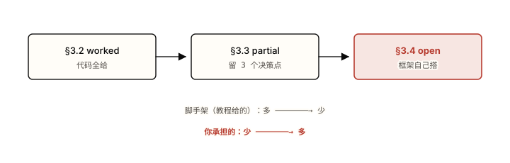

*图 3.2 三阶训练的脚手架递减。 注意：两条趋势是镜像的——教程给的脚手架逐阶变少，你要自己承担的逐阶变多。卡在哪一阶，就回那一阶对应的 01/02 概念，而不是往下硬抠。*

### § 本章 self-check

先合上教程，把你能想到的答案写在纸上或编辑器里。
写完再点开答案对照——直接点开等于把这一节当再读一遍。

1. 一个 Streams 应用骨架由哪三块构成？`application.id` 在底层同时扮演了哪几个角色？把它改名会发生什么？
2. WordCount 里 `flatMapValues`、`groupBy`、`count` 三个算子，哪个是 stateless、哪个改了 key、哪个建了 changelog？分别对应 01/02 的哪个概念？
3. 什么时候必须在 `Materialized` / `Consumed` / `Produced` 上显式给 serde、什么时候可以靠默认 serde？给一句可操作的判据。
4. 窗口聚合产出的 key 是什么类型？为什么直接拿它去 join 一张按业务 key 分区的维表会静默零输出？怎么修？

<details>
<summary>答案（先做完再展开）</summary>

1. 三块：① 一份 `Properties`（必含 `application.id` + `bootstrap.servers` + 默认 key/value serde）；② 一个 `StreamsBuilder` 描述拓扑、`build()` 出 `Topology`；③ 一个 `KafkaStreams` 实例 `start()` 跑起来并挂关停钩子。`application.id` 同时是底层消费组的 `group.id`、所有内部 topic（repartition/changelog）的命名前缀、以及应用的部署身份。改名 = 一个全新消费组 + 全新内部 topic 前缀 + offset 从头，等于状态被清空重算——要重置状态该用 reset 工具而非改名。
2. `flatMapValues` 是 [stateless](https://zhiwenliang.github.io/learning/kafka-streams/01-concepts.html#stateless-stateful)（一拆多、只改值不改 key、不需状态）；`groupBy` 改了 key（把词设成 key）→ 触发 [重分区](https://zhiwenliang.github.io/learning/kafka-streams/02-principles.html#repartition)；`count` 是 stateful，产出 [KTable](https://zhiwenliang.github.io/learning/kafka-streams/01-concepts.html#kstream-ktable) 并背一条 compacted [changelog](https://zhiwenliang.github.io/learning/kafka-streams/02-principles.html#state-store)（真相源）。
3. 判据：*只要某个算子处理的实际 key/value 类型与 Properties 里的默认 serde 不一致，就在那里显式给 serde；一致时可省。*WordCount 里 `count` 的值是 `Long`、默认是 `String`，所以 `Materialized` 必须 `.withValueSerde(Serdes.Long())`，`Produced` 写出也要 Long serde。类型不一致还靠默认 serde 会在序列化时抛异常（[04 章](https://zhiwenliang.github.io/learning/kafka-streams/04-pitfalls.html#correctness)的 serde 失败）。
4. 窗口聚合产出的 key 是 `Windowed<K>`（内含原 key + 窗口起止），不是裸 `K`。它的分区落点与裸业务 key 不同，所以和按业务 key 分区的维表**不共分区**；Streams 启动只校验分区数量、不校验分区方式，分区数对得上也不报错，但相同业务 key 落到不同分区号，[匹配全部静默丢失 → 零输出无异常](https://zhiwenliang.github.io/learning/kafka-streams/02-principles.html#joins)。修复：join 前先 `map` 把 key 从 `Windowed<K>` 还原成裸 `K`（窗口信息塞进 value），让两侧 key 和分区方式对齐。

</details>

---

**💡 进阶挑战 · 刚好够不着**

#### 把 worked 的 WordCount 改成 EOS 版 + suppress 只发最终结果

在 §3.2 的 WordCount（或 §3.3 的窗口版）基础上做两处升级，不要参考实现，自己写：① 开 `exactly_once_v2`——想清楚它绑住了哪三件事、为什么需要 ≥3 broker、本地单机为什么起不来。② 给窗口计数加 `suppress(Suppressed.untilWindowCloses(...))`，让每个窗口**只发一个最终结果**而不是每次计数变化都发一条。回答：suppress 的缓冲状态存活在哪、它依赖什么时钟来判断「窗口关闭」、为什么一个空闲分区会让加了 suppress 的窗口永远不发结果？`untilWindowCloses` 与 `untilTimeLimit(..., emitEarlyWhenFull)` 在「保证最终性」上有什么区别？

<details>
<summary>提示（卡住再展开）</summary>

EOS：一行 `props.put(PROCESSING_GUARANTEE_CONFIG, EXACTLY_ONCE_V2)`，但事务状态 topic 默认副本因子 3，单 broker 建不出来；它绑的是 offset 提交 + changelog 写 + 输出 produce（[§2.6](https://zhiwenliang.github.io/learning/kafka-streams/02-principles.html#eos)）。suppress：缓冲在一个内部状态存储里（也有自己的 changelog，retention 要 ≥ 窗口 + grace）；它靠 [stream-time](https://zhiwenliang.github.io/learning/kafka-streams/02-principles.html#windowing-time) 判断窗口关闭，而 stream-time 只在有记录到达时前进——空闲分区不推进 stream-time，窗口永远不关、最终结果永远不发（要保证最终性必须 `untilWindowCloses` + 关窗信号能到达；`emitEarlyWhenFull` 在内存压力下会提前发非最终结果，破坏「只发最终」的承诺）。先 `topology.describe()` 看 suppress 给拓扑加了什么节点。

</details>

---

#### 本章参考

- [Kafka Streams Quickstart](https://kafka.apache.org/documentation/streams/quickstart)（官方 · WordCount 上手）
- [Kafka Streams DSL Developer Guide](https://kafka.apache.org/documentation/streams/developer-guide/dsl-api.html)（官方 · DSL 算子参考）
- [Kafka Streams kstream package javadoc](https://kafka.apache.org/40/javadoc/org/apache/kafka/streams/kstream/package-summary.html)（官方 API · KStream/KTable/Materialized/TimeWindows）
- [Streams Configuration](https://kafka.apache.org/documentation/streams/developer-guide/config-streams.html)（官方 · application.id / serde / processing.guarantee 配置项）
- [developer.confluent.io: Kafka Streams Get Started](https://developer.confluent.io/courses/kafka-streams/get-started/)（高质量教程 · 含运行示例，截至 2026-06-03）


<a id="chapter-04"></a>

Chapter 04

## 陷阱与失败模式

03 章把 DSL 跑通了，前三章合起来交付了一个能用的 Streams 应用：消费组撑起 task、本地 RocksDB 存状态、changelog 当真相源、窗口靠 stream-time 推进、EOS 把读-处理-写包进一个事务。那是机制按设计工作的样子。本章是同一批机制被违反时的样子——八个具名失败模式，每个都能回链到 02 章某条原理。读完应能在症状出现前就认出隐患，而不是等到生产环境 OOMKilled 才回头查内存模型。

> 本章你将建立的 schema
>
> - 每个生产事故都是某条 02 章原理被违反的可观测后果——症状是表象，根因在机制
> - 三类失败模式：状态恢复/再平衡、正确性、资源/语义——对应三组锚点
> - 最反直觉的两条：OOMKilled 时 JVM 堆是诱饵（真因在堆外 RocksDB），join 无输出时没有任何报错（共分区静默失败）
> - 修复几乎都是"显式声明本来被自动推断的东西"：显式 Serde、显式 grace、显式 LRUCache、显式 standby

八个失败模式按归因分三组。每组先给一张地图（[见 §4.0 分类图](https://zhiwenliang.github.io/learning/kafka-streams/04-pitfalls.html#taxonomy)），再逐条拆 **症状 → 根因 → 修复 → 如何避免**。根因一律回链 [02 章](https://zhiwenliang.github.io/learning/kafka-streams/02-principles.html)对应机制——记不清机制本身时点回去补，本章不重讲机制，只讲机制被违反后会观察到什么。

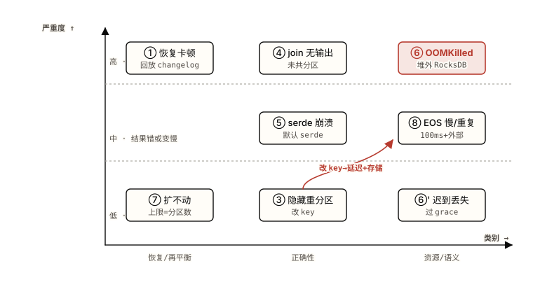

*图 4.0 八个失败模式按类别（横轴）× 严重度（纵轴）落位；编号与下文 §4.1–§4.8 一一对应。 注意：右上角朱红的 ⑥ OOMKilled 是最反直觉的一条——它落在"高严重度"是因为容器被内核杀掉、堆指标却全程正常；底部那条朱红曲线提醒"改 key（③）"是延迟与存储成本的同一个源头。*

### 4.A 状态恢复与再平衡类

这组失败模式的共同根：**有状态 task 的状态住在本地 RocksDB，真相源却是 Kafka 里的 changelog 日志**（[回 §2.1 状态存储](https://zhiwenliang.github.io/learning/kafka-streams/02-principles.html#state-store)）。task 一旦换了 owner，新 owner 手上没有本地副本，只能从头回放 changelog 重建——状态越大、带宽越窄，这段重建越长。缩放也卡在同一处：并行度被分区数钉死（[回 §2.2 再平衡与缩放](https://zhiwenliang.github.io/learning/kafka-streams/02-principles.html#rebalance-scaling)）。

#### 陷阱 ① · 再平衡时状态恢复卡顿数分钟

**症状**：滚动重启或扩容后，新实例的 task 卡在 `RESTORING` 状态数分钟，期间这些分区的输入完全不处理；端到端延迟出现分钟级尖峰；日志里刷 `Restoration in progress`，恢复速率受限于 changelog 读取带宽。重启越频繁，停顿越频繁。

**根因**：有状态 task 被重新分配给新实例时，新 owner 本地没有 RocksDB 副本，必须从 changelog topic 的最早 offset 回放、逐条重建状态存储后才能开始处理（[§2.1](https://zhiwenliang.github.io/learning/kafka-streams/02-principles.html#state-store) 讲的就是这条恢复路径）。多 GB 状态 + 受限带宽 = 分钟级阻塞，这是 Streams 头号运维痛点。容器编排里"重启即丢盘"会让每次重启都触发全量回放。

#### 修复

**streams.properties**

```properties
# 错误：默认 0 个 standby，任何故障转移都从零回放 changelog
# num.standby.replicas=0

# 正确：至少 1 个热备，故障转移从"分钟回放"降到"秒级追尾"
num.standby.replicas=1

# rack-aware standby（KIP-925，3.2+）：把 standby 摆到另一可用区，
# 同时挡住"主实例挂 + 同机架 standby 一起挂"
rack.aware.assignment.tags=zone
client.tag.zone=az-a

# 提高恢复并行度：恢复用独立线程拉 changelog，不占处理线程
# （默认即开，确认未被调低）
```

另外两条在部署层，不在配置文件：

- **持久卷（StatefulSet + PVC）**：让 RocksDB 目录跨 Pod 重启存活。重启后本地状态还在，Streams 只补 changelog 尾部增量，而非全量回放——这是把"每次重启分钟级"压回"秒级"的最大杠杆。
- **static membership**（`group.instance.id`）：给实例固定身份，滚动重启时 group coordinator 不把它当成新成员、不触发 task 重分配。**但注意**见下方警告——KIP-1071 新再平衡协议下它还不支持。

**如何避免**：上线前就按"状态大小 ÷ changelog 读带宽"估算最坏恢复时长，写进容量规划；把 `num.standby.replicas≥1` 和持久卷设成有状态 Streams 应用的默认基线，而不是出事后才补。把"无状态滚动重启"和"有状态滚动重启"当成两种运维动作——后者必须先确认 standby 已追平（看 `standby-tasks` 指标）再滚下一个实例。

> **⚠️ 陷阱 · stream-time 不是唯一会"冻结"的东西**
>
> static membership 能消掉滚动重启的再平衡，但 **KIP-1071 的新 Streams 再平衡协议（4.2 起新集群默认开）当前还不支持 static membership、也不支持运行中改 topology、不支持在线 classic→streams 迁移**（截至 2026-06，Kafka 4.3）。如果新集群默认开了 `streams.version=1`，别假设旧的 static membership 配置还生效——先确认协议版本，再决定靠 standby 还是靠 static membership 压恢复时间。

#### 陷阱 ⑦ · 加机器也扩不过 N 个消费者

**症状**：输入 topic 有 6 个分区，部署到 10 个实例（或把 `num.stream.threads` 开到很大），却发现只有 6 份工作在跑，多出来的实例/线程 `ASSIGNED` 了零个 task、CPU 全程空转；吞吐怎么加机器都不涨。

**根因**：Streams 没有独立调度器，并行单位是 task，而 **task 数 = 子拓扑最大输入分区数，运行时不可改**（[§2.2](https://zhiwenliang.github.io/learning/kafka-streams/02-principles.html#rebalance-scaling)）。task 多于线程则一个线程多路复用几个 task；线程多于 task 则多出的线程闲置。并行天花板就是分区数，加再多实例也越不过去。

#### 修复

**scaling.properties**

```properties
# 现状：6 分区输入 → 最多 6 个 task

# 错误：单实例把线程开到 16，超过 6 的 10 个线程全闲置
# num.stream.threads=16

# 正确：先把每实例线程提到接近 task 数，再横向加实例直到 task 摊满
# 例如 2 实例 × 3 线程 = 6 个 slot，正好 1 task/slot
num.stream.threads=3
# 然后部署 2 个实例

# 要超过 6 路并行：只能重分区输入 topic（破坏性，需停机/双写迁移）
# kafka-topics --alter --partitions 12 ...  ← 不可逆地改变 key→分区映射
```

**如何避免**：在创建输入 topic 时就按未来吞吐峰值定分区数——分区是缩放上限，事后加分区会打乱 `key→分区` 映射、破坏既有有状态算子的共分区前提，代价远高于一开始多给几个分区。监控时看 `assigned-tasks` 而非实例数：实例数涨、assigned-tasks 不涨，就是撞到了分区天花板。

### 4.B 正确性类

这组的危险在于**不报错**：拓扑照常运行、指标一片绿，但结果悄悄偏了——多了隐藏 topic、少了本该有的 join 输出、或在某条 null key 上崩在一个看似无关的位置。根都在"改 key"与"共分区"两条机制（[§2.3 repartition](https://zhiwenliang.github.io/learning/kafka-streams/02-principles.html#repartition) / [§2.5 join](https://zhiwenliang.github.io/learning/kafka-streams/02-principles.html#joins)）。

#### 陷阱 ③ · 隐藏的 repartition topic 抬高存储与延迟

**症状**：拓扑里没显式建任何 topic，broker 上却冒出一批 `<app-id>-<name>-repartition` 内部 topic，吃掉额外磁盘；端到端延迟比预期高一截，因为每条记录在聚合/join 前多走了一次 produce→re-consume 往返。改 key 的算子越多，往返越多。

**根因**：聚合和等值 join 要求相同 key 落在同一 task/分区。**任何改 key 的操作（`selectKey` / `map` / `flatMap` / `groupBy`）都会给下游打上"需重分区"标志**，于是下游 stateful 算子自动建一个 repartition topic 把数据重洗一遍（[§2.3](https://zhiwenliang.github.io/learning/kafka-streams/02-principles.html#repartition) 讲的正是这个自动机制及其隐藏成本）。默认正确，但成本不可见。

#### 修复

**RepartitionFix.java**

```java
// 错误：map 改了 key（哪怕 value 没动），再 groupBy 又改一次 →
// 触发一次甚至两次重分区往返
KStream<String, Order> s = orders
    .map((k, v) -> KeyValue.pair(v.userId(), v))   // 改 key → 标记需重分区
    .groupBy((k, v) -> v.userId())                 // 又改 key → 又一次重分区
    .count(...);                                    // 实际建了多余的 repartition topic

// 正确①：value 变换用 mapValues（不碰 key，不触发重分区）
KStream<String, Long> amounts = orders
    .mapValues(Order::amount);                      // key 不变，零重分区

// 正确②：key 已经对了就用 groupByKey（绝不重分区），别用 groupBy
KTable<String, Long> perUser = orders
    .selectKey((k, v) -> v.userId())               // selectKey 是 lazy：自己不建 topic
    .groupByKey(Grouped.with(Serdes.String(), orderSerde))
    .count();                                       // 这里才物化一次重分区，且仅一次

// 正确③：必须重 key 时，用 Repartitioned 命名 + 控分区数，让它可观测可控
KStream<String, Order> rk = orders
    .selectKey((k, v) -> v.userId())
    .repartition(Repartitioned.<String, Order>as("orders-by-user")
        .withNumberOfPartitions(12));
```

**如何避免**：把 `topology.describe()` 的输出当成 code review 的一部分——它会列出实际生成的每一个 repartition / changelog 内部 topic，数量对不上预期就说明有多余的改 key 操作。习惯性优先 `mapValues` 而非 `map`、`groupByKey` 而非 `groupBy`，只在 key 真的需要变时才 `selectKey`。

> **⚠️ 陷阱 · selectKey 是 lazy 的，别被它骗了**
>
> `selectKey` 单独存在时**不建任何 topic**——它只是给流打上"key 变了"的标记。真正物化 repartition topic 的是下游**依赖 key** 的算子（`groupByKey` / `join` / `aggregate`）。所以"我只 selectKey 了一下，怎么会有 repartition 成本"是错的归因：成本由下游触发，看 `topology.describe()` 才数得准，数源码里 `selectKey` 的次数没用。

#### 陷阱 ④ · join 静默无输出

**症状**：两个流/表 join，逻辑看着完全正确，输出 topic 却一条都没有，且**没有任何异常或错误日志**。改 key、改 join 窗口都不见效。最折磨人的是它不崩——只是安静地什么都不发。

**根因**：等值 join 要求两侧**共分区**——相同分区数 + 相同分区方式（同一个 producer 分区器把同一 key 落到同一编号分区）。分区数不一致时拓扑启动会直接失败；但**分区方式不一致（分区数相同、分区器不同）时，Streams 校验通过、却把本该匹配的记录路由到不同 task，匹配全部丢失，零输出零报错**（[§2.5 join 与共分区](https://zhiwenliang.github.io/learning/kafka-streams/02-principles.html#joins) 讲的就是这条静默失败路径）。

#### 修复

**JoinFix.java**

```java
// 错误：clicks 上游被某个外部 producer 用了不同分区器写入，
// 与 impressions 分区数相同但分区方式不同 → join 静默丢匹配
KStream<String, Joined> bad = impressions
    .join(clicks,
          (imp, clk) -> merge(imp, clk),
          JoinWindows.ofTimeDifferenceAndGrace(
              Duration.ofMinutes(5), Duration.ofMinutes(1)));

// 正确①：join 前对至少一侧显式 repartition，强制 Streams 用自己的
// 默认分区器重洗，对齐分区方式（也对齐分区数）
KStream<String, Click> alignedClicks = clicks
    .repartition(Repartitioned.<String, Click>as("clicks-aligned")
        .withNumberOfPartitions(impressionsPartitions));

KStream<String, Joined> good = impressions.join(alignedClicks, ...);

// 正确②：维表小且慢变，用 GlobalKTable —— 每实例全分区副本，
// 天然免共分区，是这条陷阱的逃生口
GlobalKTable<String, User> users = builder.globalTable("users");
KStream<String, Enriched> enriched = events.join(
    users,
    (eventKey, event) -> event.userId(),   // 从流记录提 join key
    (event, user) -> enrich(event, user));
```

**如何避免**：把"join 前两侧共分区"列成上线 checklist 的硬项——确认两侧分区数相同，且要么都由本 Streams 应用写入（同一默认分区器），要么对其中一侧显式 `repartition` 重洗。小维表一律考虑 `GlobalKTable` 或外键 join（KIP-213），两者都免共分区。监控 join 输出 topic 的 records-out：长期为 0 而输入不为 0，第一个怀疑对象就是共分区。

> **⚠️ 陷阱 · 静默无输出比崩溃更难查**
>
> 分区**数**不符会让拓扑启动报错——这种 fail-fast 反而友好。真正吃人的是分区**方式**不符：校验通过、进程健康、指标全绿，唯独结果是空的。遇到"join 没输出又不报错"，别先怀疑业务逻辑或窗口大小，先验共分区。

#### 陷阱 ⑤ · serde 与 null key 崩溃

**症状**：运行中抛 `ClassCastException` 或 `SerializationException`，栈顶指向某个序列化器，但报错位置和你"觉得"该出错的算子对不上；或者聚合结果莫名少了一批记录，怎么查都查不到它们去哪了。schema 升级后老消息开始反序列化失败。

**根因**：三件事。其一，依赖 `default.key/value.serde` 但某个分支的类型和默认 serde 不符——Streams 会用默认 serde 去序列化它，类型不匹配就在那个算子炸。其二，**key 为 null 的记录在进入聚合/join 前会被静默丢弃**（有状态算子按 key 分组，null key 无处归属），表现为"结果少了一批"而非报错。其三，schema 漂移让历史消息反序列化失败。前两条都源自"让运行时替你猜类型/猜归属"。

#### 修复

**SerdeNullFix.java**

```java
// 错误：依赖全局默认 serde；不同分支类型不同时会用错 serde 炸；
// null key 直接进 groupByKey 被悄悄丢
KStream<String, Payment> payments = builder.stream("payments");  // 用 default serde
KTable<String, Long> bad = payments
    .groupByKey()                                  // null key 记录在此静默消失
    .count();

// 正确：每个 source/sink/store 显式传 Serde；先过滤 null key 再聚合
KStream<String, Payment> typed = builder.stream(
    "payments",
    Consumed.with(Serdes.String(), paymentSerde)); // 显式 key/value serde

KTable<String, Long> good = typed
    .filter((k, v) -> k != null && v != null)      // 显式处理 null，而非让它静默蒸发
    .groupByKey(Grouped.with(Serdes.String(), paymentSerde))
    .count(Materialized.with(Serdes.String(), Serdes.Long())); // store 也显式 serde
```

**如何避免**：把"显式 `Consumed` / `Produced` / `Grouped` / `Materialized` 传 Serde"当成纪律，少依赖全局默认——默认 serde 是"省事但把类型错误推迟到运行时"的交易。在聚合/join 前显式决定 null key 该丢还是该补默认值，让它成为代码里看得见的一行。用 Schema Registry 的兼容模式（backward/forward）兜住 schema 演进。

### 4.C 资源与语义类

最后一组踩的是"机制在 JVM 之外"和"语义边界在你以为之外"：RocksDB 的内存不归 `-Xmx` 管，stream-time 只在有数据时前进，EOS 的原子性只覆盖 Kafka 之内。三条都因为读者把边界画错了地方。

#### 陷阱 ⑥ · 容器 OOMKilled，但 JVM 堆指标全程正常

这条最反直觉，讲透。**症状**：容器被内核 OOMKill（`exit code 137`），Pod 反复重启；可你盯着 JVM 堆指标——`used heap` 离 `-Xmx` 还很远，GC 日志平静，full GC 没几次。把 `-Xmx` 调大反而让 OOMKill 来得更快。监控面板上 JVM 一切正常，容器却在被杀。

**根因**：**RocksDB 在堆外（off-heap）分配内存，`-Xmx` 完全管不到它**。每个有状态 task 的每个 store 都有自己的 block cache（默认约 50 MiB）+ memtable（写缓冲）+ index/filter 块，全在 native 内存。一个应用几十个有状态 task，堆外内存能轻松到几个 GB。容器内存上限同时盖住"堆 + 堆外 + 线程栈 + 元空间"；JVM 堆离 `-Xmx` 还远，但堆 + 堆外的总和已经顶破容器上限，内核就 OOMKill 整个进程。**把 `-Xmx` 调大等于把更多额度划给堆、留给堆外的更少，OOMKill 反而更早**——这就是"调大堆反而更糟"的来由。根在 [§2.1](https://zhiwenliang.github.io/learning/kafka-streams/02-principles.html#state-store)：选 RocksDB 是为本地亚毫秒读，代价之一就是这部分内存逃出了 JVM 的视野。

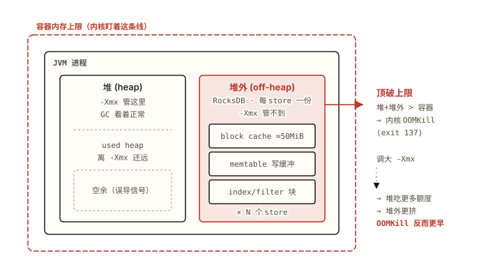

*图 4.1 OOMKill 的真因在于堆外那一列：RocksDB 的 block cache / memtable / index 块按"每 store 一份 × N 个 store"在 JVM 堆之外累加， -Xmx 完全看不到它。 注意：左侧"堆还有空余"是个诱饵信号——内核盯的是朱红虚线那条"堆+堆外"总和的容器上限，所以调大 -Xmx 只会挤掉堆外额度、让 OOMKill 更早到。*

#### 修复

**BoundedRocksDBConfig.java**

```java
// 错误：不管 RocksDB 内存，每个 store 各自一份 block cache + memtable，
// 堆外随 task 数线性膨胀，最终顶破容器上限被 OOMKill

// 正确：自定义 RocksDBConfigSetter，让所有 store 共享一个有上限的
// LRUCache + WriteBufferManager —— 把堆外内存钉成一个常数
public class BoundedRocksDBConfig implements RocksDBConfigSetter {
    // static：进程内所有 task 的所有 store 共用这两个对象
    private static final long TOTAL_OFF_HEAP = 256L * 1024 * 1024; // 256 MiB 总上限
    private static final long TOTAL_MEMTABLE = 128L * 1024 * 1024;

    private static final Cache CACHE = new LRUCache(TOTAL_OFF_HEAP);
    private static final WriteBufferManager WBM =
        new WriteBufferManager(TOTAL_MEMTABLE, CACHE); // memtable 也计入同一池

    @Override
    public void setConfig(String storeName, Options options,
                          Map<String, Object> configs) {
        BlockBasedTableConfig table =
            (BlockBasedTableConfig) options.tableFormatConfig();
        table.setBlockCache(CACHE);                       // 共享 cache
        table.setCacheIndexAndFilterBlocks(true);         // index/filter 也进 cache，纳入上限
        options.setWriteBufferManager(WBM);               // 共享写缓冲池
        options.setTableFormatConfig(table);
    }

    @Override public void close(String storeName, Options options) {}
}
```

**deploy.env / streams.properties**

```properties
# 挂上 config setter
rocksdb.config.setter=com.example.BoundedRocksDBConfig

# 容器内存 = 堆(-Xmx) + 堆外上限(LRUCache+WBM) + 线程栈/元空间 + 余量
# 例：-Xmx2g + 256MiB cache + ~512MiB 余量 → 容器 limit ≥ 2.75g

# 抑制 glibc 多 arena 造成的 native 内存碎片（容器里尤其明显）
# 作为环境变量设置：MALLOC_ARENA_MAX=2
```

**如何避免**：把容器内存预算显式拆成"堆 + 堆外缓存上限 + 余量"三项分别算，而不是"给个 `-Xmx` 再加点"。任何上 RocksDB 的有状态 Streams 应用，默认就配 `RocksDBConfigSetter` 共享 `LRUCache` + `WriteBufferManager`，把堆外钉成常数——否则堆外随 task 数线性涨，迟早撞上限。监控容器 RSS（而非只看 JVM 堆），RSS 才反映堆 + 堆外的真实占用。

> **⚠️ 陷阱 · JVM 堆是 OOMKill 的诱饵**
>
> 容器被 OOMKill 时第一反应往往是"加 `-Xmx`"或"看 GC"——两条都走偏。**RocksDB 的内存在堆外，`-Xmx` 与 GC 指标对它一无所知**。判断依据应是容器 RSS 对容器 limit，不是 used heap 对 `-Xmx`。`exit code 137` + 堆指标正常 = 几乎必是堆外（RocksDB 或 直接 ByteBuffer）顶破了上限。

#### 陷阱 ⑥' · 迟到事件无声消失

**症状**：明明收到了带较早事件时间的记录，窗口聚合结果却没把它算进去，且**没有任何错误**——只在 `dropped-records` 指标上加了 1（不看这个指标就完全无感）。补数据、回放历史时尤其常见：旧时间戳的记录大批被丢。

**根因**：窗口有宽限期 grace，一旦 `stream-time ≥ window_end + grace`，迟到记录被静默丢弃，只计入 dropped 指标（[§2.4 窗口与时间](https://zhiwenliang.github.io/learning/kafka-streams/02-principles.html#windowing-time)）。再叠加两个放大因素：event-time 与 processing-time 混淆导致时间判断错位；以及历史上某些默认 grace 行为会无声丢弃很久——所以"没显式设 grace"最危险。

#### 修复

**GraceFix.java**

```java
// 错误：没显式声明 grace，迟到记录何时被丢由默认行为决定，不可控
TimeWindows badWin = TimeWindows.ofSizeWithNoGrace(Duration.ofMinutes(5));

// 正确：显式声明窗口大小 + grace，把"容忍迟到多久"写成代码里看得见的决策
TimeWindows win = TimeWindows.ofSizeAndGrace(
    Duration.ofMinutes(5),    // 窗口大小
    Duration.ofMinutes(10));  // grace：窗口关后还容忍 10 分钟的迟到

KTable<Windowed<String>, Long> counts = events
    .groupByKey()
    .windowedBy(win)
    .count()
    // suppress：只在窗口彻底关闭后发一个最终结果，避免下游看到中间态
    .suppress(Suppressed.untilWindowCloses(
        Suppressed.BufferConfig.unbounded()));

// 同时：changelog/窗口 store 的 retention 必须 ≥ 窗口 + grace，否则
// 状态先于 grace 被清掉，迟到记录连匹配的窗口都找不到
// Materialized.as(...).withRetention(Duration.ofMinutes(20))
```

**如何避免**：永远用 `ofSizeAndGrace` 显式声明 grace，禁止依赖默认；把 grace 当成一条业务决策（"业务能容忍多久的迟到"）而非一个被忽略的参数。给 dropped-records 指标配告警——它从 0 开始涨，就是有迟到事件在被丢。窗口 store 的 retention 设成 ≥ 窗口 + grace，并在回放历史/补数时单独评估 grace 是否够大。

#### 陷阱 ⑧ · 开 EOS 后延迟变高或外部副作用意外重复

**症状**：把 `processing.guarantee` 切到 `exactly_once_v2` 后，端到端延迟明显上升、下游 `read_committed` 消费者吞吐降 15-30%；或者更糟——你以为"精确一次"了，外部系统（数据库 / HTTP / 短信）却仍然收到重复调用。

**根因**：两件被画错的边界。其一，**EOS 把 `commit.interval.ms` 默认从 30000ms 改成 100ms**——频繁提交事务是延迟上升和吞吐下降的真因，不是"事务本身慢"（[§2.6 EOS v2](https://zhiwenliang.github.io/learning/kafka-streams/02-principles.html#eos)）。其二，**EOS 的原子性只覆盖单个 Kafka 集群内的"offset 提交 + 状态 changelog 写 + 输出 produce"，完全不延伸到外部副作用**——你在 processor 里发的 HTTP / 写的 DB，在事务 abort 重试时会再执行一次。EOS 不是"全世界精确一次"，只是"Kafka 内精确一次"。

#### 修复

**EosFix.java / streams.properties**

```java
// 配置：EOS 下 commit.interval.ms 默认 100ms，按延迟/吞吐权衡调整
// （properties）
//   processing.guarantee=exactly_once_v2
//   commit.interval.ms=200        # 在延迟和吞吐之间找平衡，不必死守 100
//   # EOS 需要 ≥3 个 broker（事务状态有副本要求）

// 错误：在 EOS 拓扑里直接做外部副作用，以为 EOS 会保证它精确一次
stream.foreach((k, order) -> {
    paymentGateway.charge(order);   // 事务 abort 重试时会重复扣款！EOS 管不到外部
});

// 正确：外部副作用走幂等或 outbox —— 让"重复"在外部侧被吸收
// ① 幂等：用 event-id 做外部 upsert，重复写无副作用
stream.foreach((k, order) ->
    db.upsertByKey(order.eventId(), order));   // 同一 eventId 重复执行结果一致

// ② outbox：Streams 只写一条 Kafka 输出（受 EOS 保护），
//    由独立消费者带去重地投递给外部系统
KStream<String, Charge> outbox = orders
    .mapValues(o -> new Charge(o.eventId(), o.amount()));
outbox.to("charge-outbox");        // 外部投递在另一进程按 eventId 去重
```

**如何避免**：开 EOS 前先做两道判断。第一，延迟预算能否吃下 100ms 量级的提交间隔——吃不下就调 `commit.interval.ms` 权衡，或重新评估是否真需要 EOS（很多场景 `at_least_once` + 下游幂等就够）。第二，拓扑里有没有外部副作用——有就一律走幂等（按 event-id upsert）或 outbox 模式，绝不指望 EOS 替你保证外部精确一次。部署时确认 broker ≥ 3。

> **⚠️ 陷阱 · EOS 的"精确一次"只在 Kafka 边界内成立**
>
> `exactly_once_v2` 绑定的是 offset 提交 + changelog 写 + 输出 produce 三者的 Kafka 内原子性，下游必须 `read_committed` 才看得到这层保证。它**不覆盖任何外部系统**：processor 里的 DB 写、HTTP 调用、发短信，在事务重试时都会重复。面试里把 EOS 说成"端到端精确一次"是减分项——正确说法是"Kafka 内事务性精确一次，外部要靠幂等/outbox"。

### 4.D 反模式与"何时不该用 Streams"

八个失败模式之外，还有几条不在单条陷阱里、但会反复出现的反模式，以及一个更诚实的问题：什么时候根本不该上 Streams。

表 4.1 · 反模式速查

| 反模式 | 为什么是错的 | 正确做法 |
| --- | --- | --- |
| 用 GlobalKTable 装大表 | 每实例全量加载，磁盘+内存+启动 bootstrap 延迟都随表大小线性涨 | 只给"小而慢变"的维表用 GlobalKTable；大表用共分区的 KTable join 或外键 join |
| 在低流量/空闲分区上等窗口结果 | stream-time 只在有记录到达时前进；没数据则时间冻结、窗口永不关、结果不发 | 理解 stream-time 是数据驱动的；低流量场景考虑用心跳记录推进，或接受结果延迟到下一条记录 |
| 把 suppress 当"最终结果"保证，却用 emitEarlyWhenFull | 内存压力下 `emitEarlyWhenFull` 会发非最终的中间结果，违背"只发最终值"的预期 | 要严格最终结果用 `shutDownWhenFull`；用 `emitEarlyWhenFull` 就接受可能有中间态 |
| 运行中改 topology 还想热升级 | topology 变更改变内部 topic / task 划分；KIP-1071 新协议也不支持在线改 topology | topology 变更走停机部署 + 评估状态兼容；改 `application.id` 等于全新应用（状态从头建） |
| 无状态简单转发也上 Streams | 白白引入 changelog / 状态恢复 / 再平衡复杂度，换不来对应价值 | 纯过滤/转发/路由用原生 consumer-producer 就够；状态/窗口/join/EOS 才值得上 Streams |

#### 什么时候不该用 Kafka Streams（诚实回答）

- **源和汇主要不是 Kafka**：Streams 的容错、EOS、共分区全建在 Kafka 之上。如果数据主要来自数据库/对象存储、要写去多个异构外部系统，Streams 的优势用不上，反而要为它的 Kafka 中心假设买单。
- **需要跨多个 Kafka 集群的处理**：EOS 只在单集群内原子（[陷阱 ⑧](https://zhiwenliang.github.io/learning/kafka-streams/04-pitfalls.html#p8)），跨集群 join / 事务不在 Streams 的能力内。
- **复杂 CEP 或机器学习管线**：需要复杂事件模式匹配、迭代计算、ML 推理编排时，专门的流处理引擎（Flink）或批/流统一框架更合适——它们有独立集群 + checkpoint 模型，承载得起这类负载。
- **只是简单消费**：只要消费一个 topic 做点无状态处理，原生 consumer 更轻、心智负担更小（见上表最后一行）。

判别口径：**要本地状态 / 窗口 / join / EOS，且源汇都在一个 Kafka 集群里——才是 Streams 的甜区**。偏离这两条越远，越该换工具。这条判别会在 [05 章综合实战](https://zhiwenliang.github.io/learning/kafka-streams/05-capstone.html)里被反复用到。

### § 本章 self-check

先合上教程，把你能想到的答案写在纸上或编辑器里。
写完再点开答案对照——直接点开等于把这一节当再读一遍。

1. 容器报 `exit code 137` 反复重启，但 JVM `used heap` 离 `-Xmx` 还很远、GC 平静。最可能的根因是什么？为什么"调大 `-Xmx`"会让情况更糟？应该看哪个指标判断？
2. 两个流 join，逻辑正确、进程健康、零异常，输出 topic 却一条都没有。第一个该怀疑的是什么？分区"数"不符和分区"方式"不符，哪一种更难查、为什么？
3. 同事说"我只在代码里 `selectKey` 了一次，怎么会有 repartition topic 的存储和延迟成本？" 他的归因错在哪？用什么命令能数清实际建了几个内部 topic？
4. （设计层）某团队把 `processing.guarantee` 切到 `exactly_once_v2`，期望"用户绝不会被重复扣款"。这个期望哪里站不住？要真正做到"不重复扣款"，正确的架构是什么？

<details>
<summary>答案（先做完再展开）</summary>

1. 根因是 RocksDB 在**堆外**分配内存（block cache + memtable + index/filter，每 store 一份），`-Xmx` 管不到它；容器上限盖的是"堆 + 堆外"总和，堆还有空余但总和已顶破上限，被内核 OOMKill。调大 `-Xmx` 把更多额度划给堆、留给堆外的更少，OOMKill 反而更早。判断应看**容器 RSS 对容器 limit**，不是 used heap 对 `-Xmx`。修复：`RocksDBConfigSetter` 共享 `LRUCache` + `WriteBufferManager` 把堆外钉成常数（[§4.A 陷阱 ⑥](https://zhiwenliang.github.io/learning/kafka-streams/04-pitfalls.html#p6)、图 4.1）。
2. 第一个该怀疑**共分区**：等值 join 要求两侧相同分区数 + 相同分区方式。分区**数**不符会让拓扑启动直接报错（fail-fast，反而好查）；分区**方式**不符（数相同、分区器不同）校验通过却把记录路由到不同 task，匹配全丢、零输出零报错——**静默失败更难查**。修复：join 前对一侧显式 `repartition` 对齐，或小维表用 `GlobalKTable`（[陷阱 ④](https://zhiwenliang.github.io/learning/kafka-streams/04-pitfalls.html#p4)）。
3. 归因错在：`selectKey` 是 **lazy** 的，单独存在**不建任何 topic**，只打"key 变了"的标记；真正物化 repartition topic 的是下游**依赖 key** 的算子（`groupByKey` / `join` / `aggregate`）。所以数源码里 selectKey 的次数没意义，要用 `topology.describe()` 看实际生成了几个内部 topic（[陷阱 ③](https://zhiwenliang.github.io/learning/kafka-streams/04-pitfalls.html#p3)）。
4. 期望站不住，因为 `exactly_once_v2` 的原子性**只覆盖单个 Kafka 集群内**的 offset 提交 + changelog 写 + 输出 produce，**不延伸到外部系统**；processor 里直接调支付网关，在事务 abort 重试时会重复扣款。正确架构：外部副作用走**幂等**（按 event-id 对外部 upsert，重复无副作用）或 **outbox**（Streams 只写一条受 EOS 保护的 Kafka 输出，独立消费者按 event-id 去重后投递给支付系统）。同时注意 EOS 把 `commit.interval.ms` 默认改成 100ms 带来的延迟代价（[陷阱 ⑧](https://zhiwenliang.github.io/learning/kafka-streams/04-pitfalls.html#p8)）。

</details>

---

**💡 进阶挑战 · 刚好够不着**

#### 给一个有状态 Streams 应用做"生产就绪体检"

设拓扑：`orders`（12 分区）经 `selectKey(userId)` 后与 `users` 表 join，再按 5 分钟滚动窗口聚合每用户下单额，开 `exactly_once_v2` 输出到下游并同时给风控系统发 HTTP 告警。部署在 Kubernetes，每 Pod `-Xmx2g`、容器 limit 2.5g、`num.standby.replicas=0`、`users` 用普通 KTable。请只凭本章的八个失败模式，列出这套配置里**所有**会出事的点，并给每个点一句话修复。目标是一次体检命中 ≥6 处。

<details>
<summary>提示（卡住再展开）</summary>

逐条对号入座：①恢复——`standby=0` + 没提持久卷；③隐藏重分区——`selectKey` 下游 join/聚合会物化 repartition topic，`topology.describe()` 数一下；④join——`users` 与 `orders` 是否共分区（12 分区？同分区器？），不确定就 GlobalKTable 或 repartition 对齐；⑥OOMKill——容器 2.5g 只比 `-Xmx2g` 多 0.5g，没给 RocksDB 堆外留额度、也没 `RocksDBConfigSetter`；⑥'迟到——窗口有没有显式 grace + retention；⑧EOS——HTTP 告警是外部副作用，EOS 管不到、重试会重复发，且 100ms 提交间隔的延迟代价 + broker 是否 ≥3。⑦扩缩——12 分区是并行上限，线程/实例别超。把这些连起来就是一份体检报告。

</details>

---

#### 本章参考

- [Kafka Streams 官方文档](https://kafka.apache.org/documentation/streams/)（官方）
- [Confluent: How to Tune RocksDB for Kafka Streams State Stores](https://www.confluent.io/blog/how-to-tune-rocksdb-kafka-streams-state-stores-performance/)（维护者博客 · 陷阱 ⑥ 内存模型）
- [Confluent: Enabling Exactly-Once in Kafka Streams](https://www.confluent.io/blog/enabling-exactly-once-kafka-streams/)（设计文档 · 陷阱 ⑧ EOS 边界）
- [KIP-1071: Streams Rebalance Protocol](https://cwiki.apache.org/confluence/display/KAFKA/KIP-1071%3A+Streams+Rebalance+Protocol)（设计文档 · 陷阱 ① static membership 限制）
- [developer.confluent.io · Kafka Streams Internals](https://developer.confluent.io/courses/kafka-streams/internals/)（恢复 / 共分区 / repartition 机制）
- [Apache Kafka 4.3.0 Release Announcement](https://kafka.apache.org/blog/2026/05/22/apache-kafka-4.3.0-release-announcement/)（官方 · KIP-1035 恢复加速，截至 2026-06）


<a id="chapter-05"></a>

Chapter 05

## 综合实战 · 实时订单分析

前四章把零件配齐了：01 章给了词汇（应用即库、KStream/KTable/GlobalKTable、流表对偶、拓扑、有状态 vs 无状态），02 章把机制讲透（状态存储+changelog、再平衡缩放、repartition、窗口与时间、join+共分区、EOS v2），03 章把 DSL 跑通，04 章演示了机制被违反时的八种症状。本章把这些零件拼成一个真实系统——承接[主 Kafka 教程的订单系统](https://zhiwenliang.github.io/learning/kafka/05-capstone.html)，做实时订单分析。但本章的重点不是再教一遍 API，而是逼一组**判别决策**：同一个需求下，该用 01 章的 KTable 还是 GlobalKTable？该用 02 章的 `groupByKey` 还是 `groupBy`？该上 Streams 还是裸 consumer？做这些选择、并说清为什么，才是会用机制和真懂机制的分界线。

> 本章你将建立的 schema
>
> - 一个真实流处理系统不是"写算子"，而是一连串取舍：每个取舍都在前四章某条机制上落地
> - 需求决定选型——吞吐/顺序/可靠性/时间语义四项需求各自钉死一组 DSL 决策
> - 判别的最高层是"该不该用 Streams"：状态/窗口/join/Kafka 内 EOS 是它的甜区，非 Kafka 源汇与复杂 CEP 是它的边界
> - 验收标准要可观测：迟到订单仍计入、kill 实例后状态不丢、输出 topic 无重复——每条都对应一个具体配置或算子

本章的走法：先把需求拆成四个可量化维度（[§5.1 项目背景](https://zhiwenliang.github.io/learning/kafka-streams/05-capstone.html#background)），再针对每个维度做一次判别决策（[§5.2 设计任务](https://zhiwenliang.github.io/learning/kafka-streams/05-capstone.html#decisions)，五个判别点，每个回链不同章节），然后合上参考实现、自己写一遍（[§5.3 自己实现](https://zhiwenliang.github.io/learning/kafka-streams/05-capstone.html#implement)），最后用反思问题检验迁移能力。两张图——一张拓扑架构图、一张选型决策树——是本章的骨架，建议先扫一眼再读正文。

### 5.1 项目背景：实时订单分析

承接主教程的订单系统：上游一个 `orders` topic，每条记录是一笔下单（key=订单 id，value 含 `userId / amount / ts`）。分析团队要一个实时看板，回答两个问题——**每个用户每分钟下了多少钱，以及这个用户是什么等级**——结果落到下游 `order-analytics` topic 供看板和告警消费。把这句话拆成可量化的需求，才能映射到 DSL 决策。

表 5.1 · 把模糊需求拆成四个可量化维度

| 维度 | 具体需求 | 钉死了哪个决策 |
| --- | --- | --- |
| 时间语义 | 按**事件时间**做**每用户 1 分钟滚动窗口**的下单金额求和；迟到订单容忍 `X=2` 分钟内仍计入对应窗口 | 窗口类型 + grace 取值（回 §2.4） |
| 聚合维度 | 聚合键是 `userId`，但 `orders` 的 key 是订单 id——聚合前必须把记录重新按 `userId` 落到同一分区 | 改 key 方式 + 是否触发 repartition（回 §2.2/§2.3） |
| 数据丰富 | 结果要带**用户等级**（VIP / 普通），来自一张**小而慢变**的用户维表 topic；维表更新不要求重算历史窗口 | 维表用 KStream / KTable / GlobalKTable（回 §1.2 + §2.5） |
| 可靠性 | 下游告警按金额触发，**同一窗口结果不能重复发**也不能丢；只在 Kafka 内读写，无外部副作用 | at-least-once + 幂等 / `exactly_once_v2`（回 §2.6 + §4.C） |

> **🧠 吞吐 / 顺序 / 可靠性 / 时间语义**
>
> **吞吐**：订单峰值按几万条/秒估，远超单消费者，需要横向扩展——但并行上限被 `orders` 的分区数钉死（[§4.7](https://zhiwenliang.github.io/learning/kafka-streams/04-pitfalls.html#p7)）。**顺序**：聚合只要求"同一 `userId` 的订单进同一窗口"，不要求全局有序——这正好是分区内有序能满足的。**可靠性**：金额求和对重复敏感（重复计入会虚高告警），对丢失也敏感，且全程在 Kafka 内，没有 DB/HTTP 这类 EOS 覆盖不到的外部副作用。**时间语义**：用事件时间而非处理时间，因为订单可能延迟到达（网络抖动、客户端补传），用处理时间会把一笔 19:59 的订单算进 20:01 的窗口。

这四项需求不是背景板——下一节每个判别决策都直接由其中一项推出。先把这张需求表记在手边。

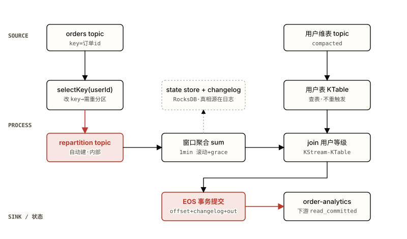

*图 5.0 实时订单分析的完整拓扑：左路 orders 改 key 触发 repartition 后做窗口聚合，右路用户维表物化成 KTable 供查表 join，结果经一次 EOS 事务落到分析 topic。 注意：两个朱红框是这条链上唯一两处"额外成本来源"——左中的 repartition topic 是 selectKey 改 key 换来的一次 produce→re-consume 往返；下方的 EOS 事务把 offset、changelog 写、输出 produce 绑成一个原子单位，代价是把提交间隔从 30s 压到 100ms。虚线框的 state store 提醒：窗口结果活在本地 RocksDB，但真相源是它背后的 changelog 日志。*

### 5.2 设计任务：五个判别决策

这一节是本章的核心，也是整套教程的迁移训练所在。每个决策都给出**备选方案、这个场景选哪个、为什么**，并标注它回链前四章的哪一处。判别的关键不在记住"选 X"，而在能复述"为什么这个需求排除了 Y"——换一个需求，答案就该换。先看汇总表，再逐条展开理由。

表 5.2 · 五个判别决策（每个对应不同章节锚点）

| 决策点 | 备选 | 这场景选哪个 + 为什么 |
| --- | --- | --- |
| ① 用户维表怎么物化 | KStream / KTable / GlobalKTable （[§1.2](https://zhiwenliang.github.io/learning/kafka-streams/01-concepts.html#kstream-ktable) + [§2.5 共分区](https://zhiwenliang.github.io/learning/kafka-streams/02-principles.html#joins)） | **KTable**。维表语义是"每用户最新等级"=按 key UPSERT，天然是 KTable 不是 append-only 的 KStream。不选 GlobalKTable 是因为聚合侧已按 `userId` 重分区，与维表共分区成立，无需每实例全量副本；维表虽小，GlobalKTable 的每实例 bootstrap 延迟与全量内存是白付的成本。若维表与聚合键无法共分区，才退到 GlobalKTable 当逃生口。 |
| ② 聚合前怎么改 key | `groupByKey()` / `groupBy((k,v)->userId)` （[§2.3 repartition](https://zhiwenliang.github.io/learning/kafka-streams/02-principles.html#repartition) + [§4.B 正确性](https://zhiwenliang.github.io/learning/kafka-streams/04-pitfalls.html#correctness)） | **必须 `groupBy` 改 key**（本场景无法避免）。`orders` 的 key 是订单 id，而聚合键是 `userId`，两者不同，`groupByKey` 会按订单 id 聚合得到全错的结果。`groupBy` 会触发一次 repartition（图 5.0 的朱红框）——这是正确性的必要代价，不是浪费。能用 `groupByKey` 省掉 repartition 的前提是 key 本就对，本场景不满足。 |
| ③ 窗口类型 + grace 取值 | tumbling / hopping / sliding / session；grace=0 / 2min / 24h （[§2.4 窗口](https://zhiwenliang.github.io/learning/kafka-streams/02-principles.html#windowing-time) + [§4.6′ 迟到丢失](https://zhiwenliang.github.io/learning/kafka-streams/04-pitfalls.html#p6prime)） | **tumbling 1min + grace 2min**。需求是"每分钟"且窗口不重叠→滚动；grace 直接由"容忍迟到 2 分钟"定为 `ofMinutes(2)`。grace 不能设 0（迟到订单会被静默丢弃，金额求和偏低），也不该设 24h（旧默认，结果迟迟不终态、状态膨胀）。配套：changelog/store 的 retention ≥ 窗口+grace，否则迟到事件落在已被清理的窗口上。 |
| ④ 投递语义 | at-least-once + 消费侧幂等 / `exactly_once_v2` （[§2.6 EOS](https://zhiwenliang.github.io/learning/kafka-streams/02-principles.html#eos) + [§4.8 EOS 延迟](https://zhiwenliang.github.io/learning/kafka-streams/04-pitfalls.html#p8)） | **`exactly_once_v2`**。副作用全在 Kafka 内（读 `orders` → 写状态 changelog → 写分析 topic），正是 EOS v2 能原子覆盖的范围；金额聚合对重复敏感，让 Streams 把三者绑进一个事务比让每个下游各写一套去重逻辑更省心。代价是提交间隔默认降到 100ms、吞吐降 15–30%——可接受。若下游还要写外部 DB，EOS 就管不到那一步，得另上幂等 upsert（本场景没有，所以 EOS 足够）。 |
| ⑤ 选型：Streams / 裸 consumer / Flink | Kafka Streams / 原生 KafkaConsumer / Apache Flink （[见 §5.2 选型判别](https://zhiwenliang.github.io/learning/kafka-streams/05-capstone.html#why-streams) + 图 5.1） | **Kafka Streams**。要有状态窗口聚合 + join + Kafka 内 EOS——三个都落在 Streams 甜区；源和汇都是 Kafka topic；无复杂 CEP、无跨多系统的事件模式匹配。裸 consumer 要手写状态存储、窗口、容错恢复、事务，等于重造 Streams；Flink 的独立集群 + checkpoint 在这个"源汇都在 Kafka、不需要独立集群"的场景里是过度投入。 |

#### 决策 ⑤ 展开：为什么是 Streams 而不是裸 consumer 或 Flink

前四个决策都在"已经决定用 Streams"的前提下做。决策 ⑤ 是更高一层的判别——这个任务到底该不该用 Streams。这是面试高频的 discrimination 题，三条判别线索串起来就是图 5.1 的决策树：

- **要不要状态 / 窗口 / join？** 不要（只是简单转发或过滤），就别上 Streams——一个原生 `KafkaConsumer` 加几行 `map` 更轻。本场景三者都要，第一道门就指向 Streams。
- **要不要 Kafka 内 exactly-once？** 要，且源汇都在 Kafka——Streams 的 `exactly_once_v2` 是为这个场景造的，开一个配置就有。本场景金额聚合需要它。
- **是不是以非 Kafka 源汇为主、或需要复杂 CEP / ML？** 是，才考虑 Flink——独立集群 + checkpoint + 丰富 connector + CEP 库是它的甜区。本场景源汇都是 Kafka topic、无 CEP，用 Flink 等于为不需要的能力付集群运维成本。

把这三条连起来：本任务在第一道门走"要状态/窗口/join→是"，第二道门走"Kafka 内 EOS→是、且不是非 Kafka 源汇为主"，落点就是 Streams。换个需求——比如要对接 S3、做跨流的复杂事件模式匹配——第三道门会走向 Flink。

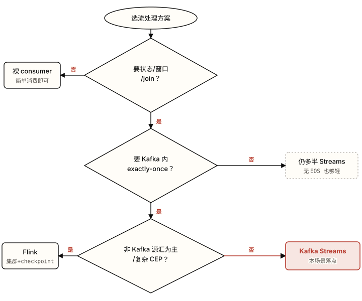

*图 5.1 选型判别走三道门：要不要状态/窗口/join → 要不要 Kafka 内 exactly-once → 是不是非 Kafka 源汇为主或需复杂 CEP。 注意：本场景在前两道门都走"是"、第三道门走"否"，落到右下角朱红的 Kafka Streams。第一道门走"否"直接出局到裸 consumer——这是最该先问的一道，避免给一个简单转发任务套上整个 Streams 运行时；第三道门是 Streams 与 Flink 的真正分界，看的是源汇是否以 Kafka 为主、是否需要复杂事件模式匹配。*

> **🤔 想一想**
>
> 决策 ① 选了 KTable 而非 GlobalKTable，前提是"聚合侧已按 `userId` 重分区，与维表共分区成立"。如果用户维表 topic 的分区数和 `orders` 不同（比如维表 4 分区、`orders` 12 分区），这个 KStream-KTable join 会发生什么？
>
> <details>
> <summary>展开答案（先停 10 秒再点）</summary>
>
> 等值 KStream-KTable join 要求两侧**共分区**——相同分区数 + 相同分区方式（[§2.5](https://zhiwenliang.github.io/learning/kafka-streams/02-principles.html#joins)）。分区数不一致时 Streams 在启动时校验失败、拓扑直接拒绝构建（不是静默无输出——那是分区方式不一致的症状，见 [§4.4](https://zhiwenliang.github.io/learning/kafka-streams/04-pitfalls.html#p4)）。
> 这正是 GlobalKTable 当逃生口的场景：GlobalKTable 每实例消费维表所有分区，join 时按流记录提取 key 直接查全量本地副本，**免共分区要求**。代价是每实例全量加载（启动 bootstrap 延迟 + 内存），只在维表小而慢变时划算——用户等级表正好符合。所以决策 ① 的"选 KTable"是有条件的：条件一旦不成立（无法共分区），答案就翻成 GlobalKTable。这就是判别题的核心——记的是条件，不是结论。
>
> </details>

### 5.3 自己实现

判别决策做完了，现在把它写成代码。先**不要**看下面的参考实现——合上它，按上一节五个决策自己写一遍 topology，写完再展开对照。判别题的价值在自己走一遍决策路径，直接看答案等于把这一章当 API 文档读。

#### 场景与验收 checklist

实现一个 Streams 应用：消费 `orders`，按 `userId` 做 1 分钟滚动窗口的金额求和，join 用户维表补等级，以 `exactly_once_v2` 把结果写到 `order-analytics`。完成标准不是"代码跑起来不报错"，而是下面三条**可观测**的行为——每条都对应一个具体决策：

- **迟到容忍可观测**：制造一笔事件时间落在某窗口内、但在窗口结束后 1.5 分钟才到达的订单（仍在 2 分钟 grace 内），它**仍计入该窗口**、结果被更新；再制造一笔晚到 3 分钟的（超过 grace），它**不计入**、且 `dropped-records` 指标 +1。对应决策 ③。
- **状态不丢可观测**：应用运行中 `kill -9` 一个实例，另一实例（或重启后）从 standby/changelog 恢复，被中断窗口的累计金额**不归零、不丢**，恢复后继续在原值上累加。对应决策 ④ 与 02 章状态容错。
- **无重复可观测**：下游用 `read_committed` 消费 `order-analytics`，在实例反复重启 / 再平衡的过程中，**同一窗口的同一最终结果不出现两次**。对应决策 ④（`exactly_once_v2`）。

> **✅ 提示**
>
> 验收第一条要可控地造迟到事件，关键是给 `orders` 的记录显式带事件时间戳并用自定义 `TimestampExtractor` 取它（否则默认取 record 的元数据时间戳，迟到就不可控）。stream-time 只在有新记录到达时前进（[§2.4](https://zhiwenliang.github.io/learning/kafka-streams/02-principles.html#windowing-time)）——要触发窗口关闭与迟到判定，得在迟到事件后再灌一条事件时间更晚的记录把 stream-time 推过 `windowEnd+grace`。

<details>
<summary>参考实现（写完自己版本再展开）—— 关键 DSL 片段 + 每决策为何选 X</summary>

下面是 topology 的核心片段。每段注释回指 §5.2 的决策编号，说明"为什么是这行而不是另一种写法"。完整工程还需 03 章的 `StreamsConfig` 与 serde 装配，这里只给承载判别决策的骨架。
**OrderAnalyticsTopology.java**

```java
StreamsBuilder builder = new StreamsBuilder();

// ── 决策①：用户维表用 KTable（不是 KStream / GlobalKTable）──
// 维表语义 = 每用户最新等级 = UPSERT changelog，天然是 KTable。
// 聚合侧下面会按 userId 重分区，与本表共分区成立，无需 GlobalKTable 的每实例全量副本。
KTable<String, String> userTier = builder.table(
        "user-dim",
        Consumed.with(Serdes.String(), Serdes.String()));   // key=userId, value=tier

// ── orders：source 是 KStream（append-only 下单账本，不是 UPSERT）──
KStream<String, Order> orders = builder.stream(
        "orders",
        Consumed.with(Serdes.String(), orderSerde)
                // 决策③配套：显式事件时间提取，迟到才可控
                .withTimestampExtractor(new OrderEventTimeExtractor()));

// ── 决策②：必须 groupBy 改 key（不是 groupByKey）──
// orders 的 key 是订单 id，聚合键是 userId，两者不同 → 必须改 key。
// groupBy 触发一次 repartition（图 5.0 朱红框），这是正确性的必要代价。
KTable<Windowed<String>, Double> perMinute = orders
        .groupBy(
            (orderId, o) -> o.userId(),
            Grouped.with(Serdes.String(), orderSerde))
        // ── 决策③：tumbling 1min + grace 2min（不是 grace=0 / 24h）──
        // "每分钟"→滚动；"容忍迟到 2 分钟"→grace=ofMinutes(2)。
        .windowedBy(TimeWindows.ofSizeAndGrace(
            Duration.ofMinutes(1), Duration.ofMinutes(2)))
        .aggregate(
            () -> 0.0,
            (userId, o, sum) -> sum + o.amount(),
            Materialized.with(Serdes.String(), Serdes.Double()));
        // retention 默认 = 窗口 + grace；如另设须 >= 1min+2min，否则迟到落在已清窗口

// ── 决策①落地：KStream-KTable join 查表补等级（表更新不重触发历史窗口）──
// 先把窗口结果摊回 userId 这个普通 key，再与 userTier join。
perMinute.toStream()
        .map((wKey, sum) -> KeyValue.pair(
            wKey.key(),
            new MinuteAgg(wKey.key(), wKey.window().start(), sum)))
        .join(
            userTier,
            (agg, tier) -> agg.withTier(tier),     // 查当前表值，符合"维表更新不重算历史"
            Joined.with(Serdes.String(), aggSerde, Serdes.String()))
        // ── 输出到下游分析 topic ──
        .to("order-analytics",
            Produced.with(Serdes.String(), enrichedSerde));

Topology topology = builder.build();
// topology.describe() 可看到自动建的 repartition topic — 决策②的成本在这里现形
```
**streams.properties**

```properties
# ── 决策④：exactly_once_v2（不是 at_least_once + 消费侧幂等）──
# 副作用全在 Kafka 内（读 orders → 写 changelog → 写 analytics），
# 正是 EOS v2 能原子覆盖的范围；金额聚合对重复敏感。
processing.guarantee=exactly_once_v2
# 代价提示：EOS 下 commit.interval.ms 默认变 100ms（非 EOS 是 30000ms）——
# 这才是"EOS 变慢"的真因。需 >= 3 broker。

# ── 验收第二条配套：standby 让 kill 实例后从秒级追尾恢复，而非分钟级回放 ──
num.standby.replicas=1

# ── 并行：先把每实例线程提到接近 task 数（=orders 分区数），再横向加实例 ──
num.stream.threads=4
application.id=order-analytics-app
```
**为什么这套写法对应五个决策**：`builder.table` 而非 `globalTable`（①，共分区成立）；`groupBy` 而非 `groupByKey`（②，聚合键≠源 key）；`ofSizeAndGrace(1min, 2min)` 而非 `ofSizeWithNoGrace` 或旧 24h 默认（③）；`processing.guarantee=exactly_once_v2`（④，Kafka 内闭环）；整套用 Streams DSL 而非裸 consumer 手写状态机或 Flink 作业（⑤，三个甜区命中、源汇都在 Kafka）。验收三条分别由 grace、standby+EOS、EOS 单独兜住。

</details>


> **🧪 亲手画一张图**
>
> 合上教程，在纸上或 Excalidraw 里画出这个实时订单分析的 topology——只画这几个元素：`orders` 和用户维表两个 source、窗口聚合、join、sink。然后标出**哪一步会产生 repartition topic**。画完回到 [图 5.0](https://zhiwenliang.github.io/learning/kafka-streams/05-capstone.html#topo) 对照——你把 repartition 标在了 `selectKey/groupBy` 改 key 那一步、还是错标在了别处？维表那一路你画的是单箭头查表（KStream-KTable），还是误画成了双向重触发？

### § 反思问题

先合上教程，把答案写在纸上或编辑器里。这几道题考的不是"选了什么"，而是"为什么这个需求排除了别的选项"——直接点开答案等于把这一章当再读一遍。

1. 五个判别决策里，哪个你做得最没把握？回看哪一章帮你定下了它？（多数人卡在决策 ① KTable vs GlobalKTable 或决策 ③ grace 取值——前者回 [§1.2](https://zhiwenliang.github.io/learning/kafka-streams/01-concepts.html#kstream-ktable) + [§2.5](https://zhiwenliang.github.io/learning/kafka-streams/02-principles.html#joins)，后者回 [§2.4](https://zhiwenliang.github.io/learning/kafka-streams/02-principles.html#windowing-time) + [§4.6′](https://zhiwenliang.github.io/learning/kafka-streams/04-pitfalls.html#p6prime)。）
2. 把决策 ② 反过来：什么情况下聚合**能**用 `groupByKey` 省掉 repartition？本场景为什么不满足那个条件？
3. 需求若改成"全局 Top-N 热销商品"（不分用户、要跨所有分区算出销量前 10 的商品），**哪些决策要改**？提示：聚合键从 `userId` 变成商品 id 容易，难的是"全局"——见下方进阶挑战。

<details>
<summary>答案（先做完再展开）</summary>

1. 没有标准答案，但合格的复述要点名"决策依赖哪条机制"：KTable vs GlobalKTable 依赖**共分区是否成立**（成立用 KTable，不成立退 GlobalKTable）；grace 依赖**业务能容忍多久迟到**（直接等于容忍窗口），并配套 retention ≥ 窗口+grace。能说出"换个条件答案就翻"，就是真懂判别。
2. `groupByKey` 免 repartition 的前提是**聚合键 = 当前记录的 key**（不改 key，Streams 知道数据已按该 key 共分区）。本场景 `orders` 的 key 是订单 id、聚合键是 `userId`，二者不同，所以必须 `groupBy` 改 key、必然触发一次 repartition。若上游能让 `orders` 直接以 `userId` 为 key 生产，下游就能 `groupByKey` 省掉这次往返——这是把成本左移到生产端的取舍。
3. 要改的核心是**全局聚合**这一点。每用户窗口聚合天然分区并行（每个 `userId` 落一个分区独立算），而"全局 Top-N"要求所有商品的销量汇到**一处**排序——这与"task=分区、并行上限=分区数"的模型冲突。常见做法是两阶段：先按商品 id 分区做局部计数（可并行），再把局部结果用一个固定 key（如常量）`groupBy` 汇到**单个分区**做全局 Top-N 合并——这一步牺牲并行度换全局视图。决策 ②（改 key）变成"二次改 key 到常量 key"，决策 ③（窗口）可能从滚动改成持续维护的 Top-N 表，决策 ①（join 维表）若不再需要可去掉。这就是全局聚合与并行度的取舍：全局序必然有一个单分区瓶颈。

</details>

---

**💡 进阶挑战 · 刚好够不着**

#### 把"每用户每分钟"改成"全局 Top-N 热销商品"

需求变更：不再按用户，而要一个实时榜单——每分钟窗口内销量前 10 的商品，单一榜单（不是每分区一份）。直接把聚合键从 `userId` 换成商品 id 只解决了"按商品"，没解决"全局"——按商品 id 分区后，每个分区只看得到自己那部分商品，算不出跨分区的全局前 10。设计一条能产出**单一全局榜单**的拓扑，并说清它在哪一步牺牲了并行度。

<details>
<summary>提示（卡住再展开）</summary>

两阶段聚合。阶段一：`groupBy(商品id)` 做局部窗口计数，这一步保留分区并行。阶段二：把阶段一每条结果 `map` 成同一个常量 key（如 `"GLOBAL"`），再 `groupBy` 汇到**单个分区**，在那里维护一个 Top-N 数据结构（如有界优先队列存进状态存储）。瓶颈在阶段二——所有商品的局部计数挤进一个 task，并行度退化为 1。这是"要全局序就得有单点汇聚"的固有代价；能接受近似时，可改成每分区各出局部 Top-N、下游再合并，用一点精度换回并行。

</details>

---

#### 本章参考

- [Kafka Streams 官方文档](https://kafka.apache.org/documentation/streams/)（官方）
- [developer.confluent.io · Kafka Streams Internals](https://developer.confluent.io/courses/kafka-streams/internals/)（设计文档 · task/状态/repartition/EOS 机制，支撑全部五个决策）
- [KIP-213: Foreign-Key Joins](https://cwiki.apache.org/confluence/display/KAFKA/KIP-213%3A+Second+Class+Key+Joins)（设计文档 · 决策 ① join 与共分区的逃生口）
- [Confluent: Enabling Exactly-Once in Kafka Streams](https://www.confluent.io/blog/enabling-exactly-once-kafka-streams/)（维护者博客 · 决策 ④ EOS 边界与代价）
- [Apache Kafka 4.3.0 Release Announcement](https://kafka.apache.org/blog/2026/05/22/apache-kafka-4.3.0-release-announcement/)（官方 · 截至 2026-06 的状态存储/恢复现状）


<a id="chapter-06"></a>

Chapter 06

## 自测题库与面试准备

前五章建起了一整条认知链：Streams 是嵌进应用的库（01），状态住在本地 RocksDB 但真相源是 changelog 日志（02），DSL 把这套机制跑成可运行的代码（03），违反机制时它如何崩坏（04），综合实战里如何在多个机制间判别取舍（05）。本章不再讲新东西——它把那条链反过来用：合上教程，靠提取而非重读检验哪些环节真正进了长期记忆。题目按概念→原理→判别三层递进，并为最易在面试里露馅的几道题列出"普通答案 vs 资深必须点到"。能在没有提示的情况下重建这些答案，才算把 Streams 框成"消费组 + 本地状态 + changelog 日志"而非"又一个流处理引擎"。

> 本章你将检验的 schema
>
> - 三层提取梯度：概念层（回忆事实）→ 原理层（解释机制）→ 判别层（迁移到新场景）
> - 面试主战场是判别层——面试官在意对取舍的推理，而非背 API
> - 五六道最易露馅题的"资深必须点到"清单：状态容错、EOS 真实边界、共分区、线程模型并行上限、stream-time 冻结

总题数 **20** 道，分三层：概念层 7 道（对应 01）、原理层 8 道（对应 02）、应用判别层 5 道（综合，面试主战场）。**所有答案集中在文末一个 `<details>` 里**，按三层分节。题目区只有题——先把能想到的答案写在纸上或编辑器里，写完再展开对照；直接点开等于把这套机制当再读一遍，提取练习的效果归零。每道概念层与原理层题都带一条 提示链，回指对应章节的锚点，卡住时去那里复习，而不是直接看答案。

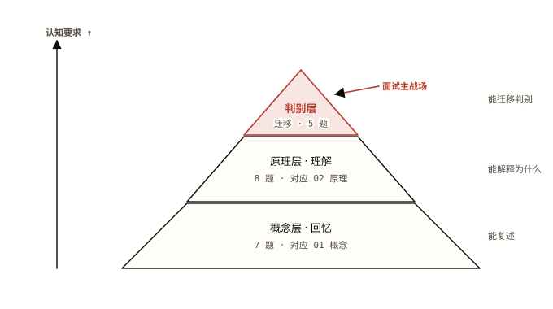

*图 6.0 三层提取梯度：底层最宽（回忆的事实最多、最易答），越往上认知要求越高、题量越少。 注意：朱红的顶层"判别层"题量最少却是面试主战场——它要的不是背 API，而是把下两层的机制迁移到一个没见过的取舍场景里。底层答得顺不代表顶层答得出，三层一起做才看得出 schema 哪里是空的。*

### 6.A 概念层（对应 01 概念）

每题只考一个原子事实，对应 01 章某个概念。答得卡壳，就回提示链指的锚点复习——这一层是后面两层的地基，地基空了上面的推理也立不住。

1. 用一句话各自概括 **KStream、KTable、GlobalKTable** 的语义差异（分别是什么"日志/视图"，同一个 key 来多条时各自怎么处理）。\
   [提示：参考 01 章 §1.2 KStream / KTable / GlobalKTable](https://zhiwenliang.github.io/learning/kafka-streams/01-concepts.html#kstream-ktable)
2. 什么是**流表对偶**？为什么说 table 是 stream 的物化、stream 是 table 的差异日志？这个双向性和"状态可恢复"有什么关系？\
   [提示：参考 01 章 §1.3 流表对偶](https://zhiwenliang.github.io/learning/kafka-streams/01-concepts.html#duality)
3. 一个 Streams 应用的 **task 数量由谁决定**？是配置项 `num.stream.threads` 吗？运行时能改吗？\
   [提示：参考 01 章 §1.4 应用即库](https://zhiwenliang.github.io/learning/kafka-streams/01-concepts.html#library)
4. Streams 应用的**并行上限**是多少？把实例数或线程数加到超过这个上限会发生什么？\
   [提示：参考 01 章 §1.4 应用即库](https://zhiwenliang.github.io/learning/kafka-streams/01-concepts.html#library)
5. 已经有 KafkaConsumer + KafkaProducer 了，**为什么还要用 Streams**？它在裸 consumer 之上多给了哪几样东西？\
   [提示：参考 01 章 §1.1 为什么是 Streams](https://zhiwenliang.github.io/learning/kafka-streams/01-concepts.html#why)
6. 下列算子哪些是 **stateless**、哪些是 **stateful**：`map`、`filter`、`flatMap`、`branch`、`aggregate`、`count`、`reduce`、`join`、窗口算子？判断依据是什么？\
   [提示：参考 01 章 §1.5 无状态 vs 有状态](https://zhiwenliang.github.io/learning/kafka-streams/01-concepts.html#stateless-stateful)
7. 什么是 **topology（拓扑）**？什么情况下一个拓扑会被切成多个 **sub-topology（子拓扑）**？\
   [提示：参考 01 章 §1.4 拓扑](https://zhiwenliang.github.io/learning/kafka-streams/01-concepts.html#topology)

### 6.B 原理层（对应 02 原理）

这一层不问"是什么"，问"怎么实现的、代价在哪、什么时候失效"。每题对应 02 章某条机制。答案要能说出底层路径，而不是复述定义。

1. 有状态算子的状态**怎么容错**？一个有状态 task 故障转移到新实例后，新 owner 手上没有本地 RocksDB 副本，它如何恢复到正确状态？说清"真相源"在哪。\
   [提示：参考 02 章 §2.1 状态存储](https://zhiwenliang.github.io/learning/kafka-streams/02-principles.html#state-store)
2. 为什么 `selectKey` / `map` / `groupBy` 这类**改 key 的操作会触发 repartition**？Streams 为此自动做了什么？这条往返的代价是什么？\
   [提示：参考 02 章 §2.3 repartition](https://zhiwenliang.github.io/learning/kafka-streams/02-principles.html#repartition)
3. **stream-time 何时前进**？它由什么驱动、用来做什么？一个低流量或空闲的分区上，stream-time 会怎样，进而对窗口结果有什么后果？\
   [提示：参考 02 章 §2.4 窗口与时间](https://zhiwenliang.github.io/learning/kafka-streams/02-principles.html#windowing-time)
4. 辨析 **grace period、retention、suppress** 三者：各自管什么？过了 `windowEnd + grace` 的迟到事件会怎样？为什么 retention 必须 ≥ 窗口 + grace？\
   [提示：参考 02 章 §2.4 窗口与时间](https://zhiwenliang.github.io/learning/kafka-streams/02-principles.html#windowing-time)
5. 说出 **四种 join**（KStream-KStream、KStream-KTable、KTable-KTable、外键 join）各自的触发语义；其中哪些要求**共分区**、哪些不要求？共分区到底要求两侧满足什么？\
   [提示：参考 02 章 §2.5 join 与共分区](https://zhiwenliang.github.io/learning/kafka-streams/02-principles.html#joins)
6. `exactly_once_v2` 到底把**哪三件事绑进一个 Kafka 事务**？相比 v1 的"一 task 一 producer"，v2 改了什么？为什么 v2 在高分区数下不会爆？\
   [提示：参考 02 章 §2.6 EOS v2](https://zhiwenliang.github.io/learning/kafka-streams/02-principles.html#eos)
7. **RocksDB 的内存为什么不受 `-Xmx` 管**？它分配在哪里？这件事在容器里会以什么形式炸出来？为什么 Streams 选 RocksDB+changelog 而不是一个远程状态库？\
   [提示：参考 02 章 §2.1 状态存储](https://zhiwenliang.github.io/learning/kafka-streams/02-principles.html#state-store)；失败形态见 [04 章 §4.C 堆外内存](https://zhiwenliang.github.io/learning/kafka-streams/04-pitfalls.html#rocksdb-mem)
8. **standby 副本**（`num.standby.replicas`）做什么？它如何把故障转移从"分钟级回放"压到"秒级"？代价是什么？\
   [提示：参考 02 章 §2.2 再平衡与缩放](https://zhiwenliang.github.io/learning/kafka-streams/02-principles.html#rebalance-scaling)

### 6.C 应用判别层（综合 · 面试主战场）

这一层给场景、要决策。没有"标准答案"对应某一章某一节——要把前两层的机制迁移到一个没见过的取舍里。面试官在这一层听的是**推理过程**：你凭什么排除另一个选项。

1. **Streams vs Flink / Spark Streaming**：团队要做实时处理，有人主张上 Flink。从"部署形态"和"处理模型"两个维度说清 Streams 与 Flink/Spark 的根本差异；什么场景下 Streams 是更省心的选择，什么场景下它明显不够用？
2. **Streams vs 裸 consumer**：一个服务只是"从 topic A 读、做个无状态转换、写 topic B"。该上 Streams 还是直接用 KafkaConsumer/Producer？把判据说成一条可操作的线——出现什么需求时才值得引入 Streams？
3. **何时不用 Streams**：举出三类即使数据在 Kafka 里、也不该用 Streams 的场景，并说明每一类的根本障碍在哪。
4. **groupByKey vs groupBy**：两个聚合，一个用 `groupByKey()`，一个用 `groupBy((k,v)->...)`。它们在拓扑和运行成本上有什么不同？默认该优先用哪个、为什么？什么情况下不得不用另一个？
5. **KTable-KTable join vs GlobalKTable join**：要用一张维表去丰富主流。维表是"小而慢变"。选普通 KTable join 还是 GlobalKTable join？从共分区要求、每实例内存、数据规模三个角度说清取舍；维表如果变大到几十 GB，结论会怎么变？

> **🧪 亲手画一张图**
>
> 合上教程，凭记忆画出**有状态聚合一条记录的完整路径**：记录进入 → 更新本地 RocksDB → 写 changelog topic →（故障时）从 changelog 或 standby 副本恢复。只画这四个环节加它们之间的箭头就行。画完回 [02 章 §2.1](https://zhiwenliang.github.io/learning/kafka-streams/02-principles.html#state-store) 对照——你的图里，那个箭头标对了吗：**你标出真相源是 changelog 而不是本地 RocksDB 了吗？**如果你的箭头是"恢复时从本地 RocksDB 读"，说明对偶那一层还没真进去，回 [01 章 §1.3](https://zhiwenliang.github.io/learning/kafka-streams/01-concepts.html#duality) 重看。

### 6.D 面试加餐 · 强答案必须包含什么

下面六道是最容易"答得像对、其实露馅"的题。面试官靠它们区分"用过 Streams"和"懂 Streams"。每道列出**普通答案**（不算错，但谁都能背）与**资深必须点到**（点到才证明你摸过它的边界）。这一节不放在文末 `<details>` 里——它本身就是"答案该长什么样"的标尺，对照上面三层的题用。

表 6.1 · 六道易露馅题：普通答案 vs 资深必须点到

| 题 | 普通答案（谁都能背） | 资深必须点到（摸过边界才说得出） |
| --- | --- | --- |
| **状态容错** | 状态存在 RocksDB，会持久化，故障了能恢复。 | 本地 RocksDB 只是**读缓存式的物化视图**，**真相源是 log-compacted 的 changelog topic**；故障转移时新 owner **回放 changelog 重建** RocksDB（或用 standby 副本已追平的副本秒级接管）。措辞上要说"**changelog 复制**"，不能说"checkpoint / 快照"——那是 Flink/Spark 的模型，说错就暴露没分清两套体系。 |
| **EOS 真实边界** | `exactly_once_v2` 保证精确一次，不重不丢。 | 事务**只绑定三件事**：offset 提交 + 状态 changelog 写 + 输出 produce，下游必须 `read_committed` 才看不到 aborted 数据；**只在单个 Kafka 集群内原子**，**不延伸到外部副作用**（DB / HTTP / 短信仍可能重复，要 outbox 或按 event-id 幂等）。还要点出"变慢"的真因是 `commit.interval.ms` 在 EOS 下默认从 30000ms 降到 100ms，而非事务本身重。 |
| **共分区** | join 两边要按同一个 key。 | 等值 join 要两侧**相同分区数 + 相同分区方式（同一 producer 分区器）**；分区数不符**启动时拓扑校验失败**，分区方式不符则**静默零输出、不报错**（最坑的失败形态）。逃生口：GlobalKTable join 和外键 join **免共分区**。能把"静默无输出"这个症状讲出来，才证明真踩过。 |
| **线程模型 / 并行上限** | 调 `num.stream.threads` 加线程、加实例就能扩。 | 并行天花板 = **子拓扑最大输入分区数**，运行时**钉死不可改**；`task = 分区`，一个 task 是一个分区组、**不跨线程拆**；线程/实例多于 task 则多出的**闲置空转**。要再扩只能**重分区输入 topic（破坏性）**。层级关系要说全：instance ⊃ StreamThread ⊃ task ⊃ partition。 |
| **stream-time 冻结** | 窗口按事件时间关闭。 | stream-time = 每 task **见过的最大时间戳，只前进、只在有记录到达时推进**；**没有新记录 → 时间冻结 → 窗口永不关、结果永不发**。所以低流量/空闲分区会让窗口结果"卡住不出来"——这是个真实的生产现象，不是理论。点到这一条，面试官就知道你跑过它而不是只读过文档。 |
| **RocksDB 内存模型** | RocksDB 是嵌入式状态存储，落盘。 | block cache 与 memtable 分配在 **JVM 堆外**，`-Xmx` 管不住；**每分区每 store 各占一份**，分区一多堆外内存线性涨。容器里的表现是 **JVM 堆指标全程正常、Pod 却被内核 OOMKilled**。修复是用一个共享 `LRUCache`+`WriteBufferManager` 设上限，并把 Pod 内存算成"堆 + 堆外缓存 + 余量"。 |

> **💡 洞察 · 面试官真正在称量什么**
>
> 对比上表两列，资深列的共同点不是"知道更多 API"，而是**每条都点到了一个边界或失败形态**：changelog 才是真相源、EOS 不覆盖外部、共分区不符会静默无输出、并行被分区数钉死、空闲分区冻结 stream-time、堆外内存绕过 `-Xmx`。面试官在意对**取舍的推理**胜过背 API，想听的是**失败模式的故事**（恢复卡顿、空闲分区、EOS 边界）。把每个机制都连到"它在什么时候、以什么方式坏掉"，答案就从"用过"升到"懂"。

---

**💡 进阶挑战 · 刚好够不着**

#### 把五道判别题压成一棵决策树

不看教程，把 6.C 的五道判别题合并成一张**选型决策树**：根节点是"我要做流处理"，叶子是 {裸 consumer、Kafka Streams、Flink/Spark、Streams + GlobalKTable、Streams + KTable join}。每个分叉用一个二元判据（如"需要状态/窗口/join 吗？""源汇主要是 Kafka 吗？""维表能塞进每个实例内存吗？"）。画完检查：有没有哪条判据其实在重复另一条？有没有哪个叶子永远走不到？

<details>
<summary>提示（卡住再展开）</summary>

先按"源汇是否主要在 Kafka"分一刀——否则连 Streams 的门槛都够不到，落向 Flink/Spark 或别的方案。再按"是否需要状态/窗口/join/EOS"分第二刀——只读简单消费的落向裸 consumer。进了 Streams 之后才轮到"维表多大"决定 GlobalKTable（小而慢变、免共分区、每实例全量）还是 KTable join（大、要共分区）。判据顺序很重要：先排除门槛，再在门槛内部细分。

</details>

---


<details>
<summary>答案（三层全部 · 先做完再展开）</summary>

#### 概念层（6.A）
1. **KStream** = append-only 的 INSERT 日志，同一个 key 来多条记录全部保留（每条都是一个独立事件）。**KTable** = 按 key UPSERT 的 changelog，同 key 后到的值覆盖先到的，`null` 值是 tombstone（删除该 key）。**GlobalKTable** = 每个实例都消费该 topic 的**所有分区**、持有全量副本，启动时 eager 加载——因此 join 时免共分区，但只适合小而慢变的维表。
2. 流表对偶 = 流和表是同一条日志的两种视图：**table 是 changelog "每 key 最新值" 的物化**（把日志按 key 折叠成当前状态），**stream 是 table 的差异日志**（把状态变化展开成事件序列）。正因为这个双向性，状态才可恢复——把 changelog 从头回放一遍就能重建出 table，所以本地状态丢了也不怕。
3. task 数 = **子拓扑输入 topic 的分区数**（取最大输入分区数），运行时**钉死不可改**。`num.stream.threads` 只控制每个实例起几个 StreamThread，**不决定 task 总数**；task 在所有实例的所有线程间分配。要改 task 数只能重分区输入 topic。
4. 并行上限 = **最大输入分区数**（= task 数）。实例数或线程数加到超过它，多出来的实例/线程会被分到**零个 task、CPU 空转**，吞吐不再增长。越过这个上限的唯一办法是重分区输入 topic（破坏性操作）。
5. 裸 consumer 只给你"读到消息"。Streams 在其上加了：**有状态算子**（聚合/count/reduce）及其容错（changelog + standby）、**窗口与事件时间**处理、**join**（含自动 repartition 与共分区校验）、**EOS v2** 端到端精确一次、以及把这些架在消费组之上的**缩放/再平衡**。只要不需要这些，裸 consumer 就够。
6. **stateless**：`map`、`filter`、`flatMap`、`branch`（还有 merge/peek）——逐条处理、不依赖其它记录。**stateful**：`aggregate`、`count`、`reduce`、`join`、所有窗口算子——需要跨记录维护状态，因此要状态存储。判断依据：处理这一条时是否需要"记住"别的记录。
7. topology = source → processor → sink 的算子有向图，Streams 把 DSL 编译成它。当流中出现**需要重分区的边界**（改 key 后接 stateful 算子，要经 repartition topic 重新洗牌）时，拓扑会在那里被切成多个 **sub-topology**——每个子拓扑独立调度成 task。
#### 原理层（6.B）
1. 每次对状态存储的 put **同时写一条内部 changelog topic**（log-compacted）。本地 RocksDB 只是物化视图，**真相源是 changelog**。故障转移：新 owner 没有本地副本，就**从 changelog 回放**逐条重建 RocksDB 后再处理；配了 standby 副本则由一直尾随 changelog 的热备秒级接管，跳过大部分回放。
2. 聚合和等值 join 要求**相同 key 的记录落到同一个 task / 分区**（共分区）。改 key 的操作打乱了原有分区，所以 Streams 在下游 stateful 算子前**自动建一个内部 `<app>-<name>-repartition` topic**，把数据按新 key produce 进去再重新消费回来。代价：每个改 key 的操作前置一次 produce→re-consume 往返（延迟 + broker 磁盘 + 额外 topic）。注意 `selectKey` 本身是 lazy 的，只有下游真依赖 key 的算子才物化出 topic。
3. stream-time = **该 task 见过的所有记录的最大时间戳**，**只前进不回退**，用来驱动窗口关闭与迟到判定。它**只在有记录到达时推进**。低流量或空闲分区上没有新记录，stream-time 就**冻结**，窗口永远等不到 `windowEnd + grace`、结果永不发——表现为"结果卡住不出来"。
4. **grace period** = 窗口结束后迟到事件还能更新该窗口结果的时长；过 `windowEnd + grace` 的迟到事件被**静默丢弃**（只计入 dropped 指标）。**retention** = 窗口状态/changelog 在存储里保留多久，**必须 ≥ 窗口 + grace**，否则窗口还在 grace 内状态就被清了。**suppress(untilWindowCloses)** = 抑制中间结果，每个窗口只发一个最终结果（代价：要等窗口关，增加延迟；内存压力下若用 `emitEarlyWhenFull` 会发非最终结果，要"最终"必须 `shutDownWhenFull`）。
5. **KStream-KStream**：窗口化 join，两侧入库缓冲，窗口+grace 内每对匹配各发一次。**KStream-KTable**：查表 join，流记录探当前表值；表更新**不**反向触发。**KTable-KTable**：维护式，任一侧更新都重新发结果。**外键 join**：按 value 提取的 key join，Streams 建两个隐藏 topic（subscription + response）+ 复合 RocksDB 存储。前三种等值 join **要求共分区**（相同分区数 + 相同分区方式）；**GlobalKTable join 和外键 join 免共分区**。
6. 把 **offset 提交 + 状态 changelog 写 + 输出 produce 三件事绑进一个 Kafka 事务**，下游 `read_committed` 跳过 aborted。v2（KIP-447）相比 v1 改成**一个线程一个 producer 覆盖该线程的多个 task**，而 v1 是一个 task 一个 producer。高分区数下 v1 会产生海量 producer（爆炸），v2 因此不爆。
7. RocksDB 的 block cache（≈50MiB）和 memtable 分配在 **JVM 堆外**（off-heap），`-Xmx` 只管堆内、管不到它；而且**每分区每 store 各占一份**，分区多则堆外内存线性增长。容器里表现为 **JVM 堆指标正常、Pod 却被内核 OOMKilled**。选 RocksDB + changelog 而非远程状态库：本地读亚毫秒、无逐条网络跳，且 Kafka 的 compacted 日志本身已是复制/HA 层，不必再引第二个集群化数据库。
8. standby 副本 = 在**另一个实例上预先维护一份尾随 changelog 的热备**状态。主 task 故障时，已追平的 standby 直接接管，**跳过从零回放 changelog**，把故障转移从分钟级压到秒级。代价：额外的磁盘 + 网络（每个 standby 都在持续拉 changelog 保温）。
#### 应用判别层（6.C）
1. **部署形态**：Streams 是嵌进你应用的**库**，没有独立集群，跑在消费组上、用普通 JVM 部署；Flink/Spark 是**独立集群**，要单独的 JobManager/TaskManager 或 Spark 集群运维。**处理模型**：Streams 逐条处理、容错靠 **changelog 复制**；Flink 逐条但容错靠**分布式快照 checkpoint**；Spark Streaming 是**微批**。Streams 更省心的场景：源和汇都在 Kafka、想避免再养一个集群、Java 后端就近嵌入。Streams 不够用的场景：需要跨多种数据源/汇、复杂 CEP、ML pipeline、或要 Flink 那种独立 checkpoint/状态后端能力。
2. 无状态单纯转发**不该上 Streams**——裸 consumer/producer 就够，还少一层抽象和内部 topic 开销。值得引入 Streams 的那条线：出现**有状态需求**（聚合/count/reduce）、**窗口/事件时间**、**join**、或**端到端 EOS** 中任意一项时。判据是"是否需要跨记录的状态或时间语义"，不是数据量大小。
3. 三类即使数据在 Kafka 也不该用 Streams：① **源汇主要不在 Kafka**（比如主要从 DB/HTTP 拉、写第三方系统）——Streams 的所有机制都围绕 Kafka topic，离开 Kafka 它的优势全失；② 需要**复杂 CEP / ML / 跨多集群**的能力——Streams 的算子模型撑不起，该上 Flink；③ **只是简单消费**没有状态/窗口/join 需求——上 Streams 是过度设计，徒增内部 topic 与运维面。
4. `groupByKey()` **不改 key**，下游聚合**不需要 repartition**，没有额外内部 topic。`groupBy((k,v)->...)` **改 key**，下游聚合会**自动建 repartition topic** 把数据重洗一遍——多一次 produce→re-consume 往返（延迟 + broker 磁盘）。**默认优先 `groupByKey`**。只有当确实需要**按一个不同于当前 key 的字段聚合**时，才不得不用 `groupBy`（这时重分区是必要代价，不是浪费）。
5. "小而慢变"的维表选 **GlobalKTable join**：**免共分区**（主流不必按维表 key 重分区）、查表式语义简单；代价是**每个实例都持有全量副本**（磁盘 + 内存 + 启动 bootstrap 延迟）。普通 **KTable-KTable join** 要求**共分区**、状态按分区切分（每实例只存自己那份），适合维表较大、放不进单实例内存的情况。维表涨到几十 GB 时结论**翻转**：GlobalKTable 的"每实例全量"变得不可承受（内存爆 + 启动慢），应改用按 key 共分区的 KTable join，或用**外键 join**（按 value 提取 key、免共分区、状态分区化）。

</details>


#### 本章参考 · 面试资源

- [Kafka Streams 官方文档](https://kafka.apache.org/documentation/streams/)（官方 · 概念与原理的权威来源）
- [developer.confluent.io · Kafka Streams Internals](https://developer.confluent.io/courses/kafka-streams/internals/)（恢复 / 共分区 / repartition / 线程模型——判别题的内功）
- [Confluent: Enabling Exactly-Once in Kafka Streams](https://www.confluent.io/blog/enabling-exactly-once-kafka-streams/)（设计文档 · EOS 真实边界）
- [Confluent: How to Tune RocksDB for Kafka Streams State Stores](https://www.confluent.io/blog/how-to-tune-rocksdb-kafka-streams-state-stores-performance/)（维护者博客 · 堆外内存模型）
- [KIP-1071: Streams Rebalance Protocol](https://cwiki.apache.org/confluence/display/KAFKA/KIP-1071%3A+Streams+Rebalance+Protocol)（设计文档 · 再平衡协议的近期变化，截至 2026-06）
- [主 Kafka 教程 · 消费组再平衡](https://zhiwenliang.github.io/learning/kafka/02-principles.html#rebalance)（Streams 缩放/再平衡的底座）
