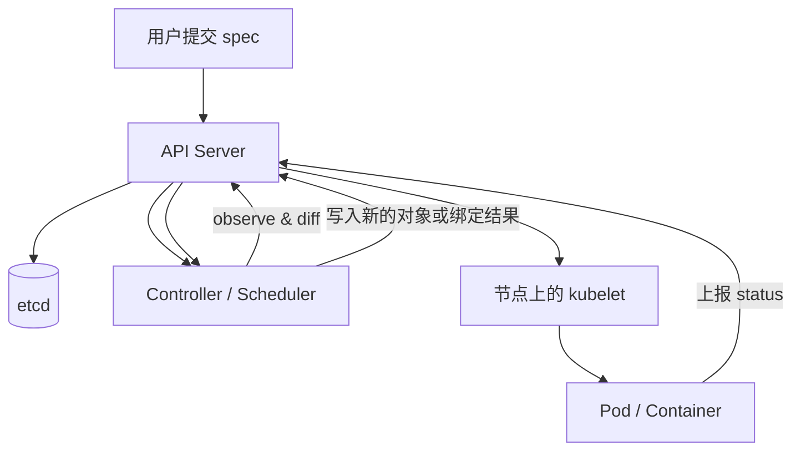

# 从部署工具到控制循环：真正理解 Kubernetes

第一次接触 Kubernetes 时，我们很容易把它理解成一个“更复杂的 Docker Compose”：写一份 YAML，执行 `kubectl apply`，然后容器就被部署到了集群里。

这种理解并非完全错误，却只看到了结果，没有看到 Kubernetes 真正解决的问题。

如果 Kubernetes 只是把容器启动起来，那么 Shell 脚本、Docker Compose、虚拟机模板，甚至传统发布平台都能完成类似工作。Kubernetes 更重要的能力，是在机器宕机、进程崩溃、版本升级、配置变化和资源竞争不断发生时，仍然持续维持系统应该呈现的状态。

理解 Kubernetes 的关键，不是记住几十种资源对象，也不是背下大量 `kubectl` 命令，而是抓住一个贯穿整个系统的模型：

> **Kubernetes 是一组持续运行的控制循环。你声明期望状态，系统不断观测实际状态，并把实际状态推向期望状态。**

一旦建立这套心智模型，Pod 自愈、Deployment 滚动更新、Service 负载均衡、PVC 绑定、自动扩缩容乃至 Operator，都不再是互不相关的功能，而是同一种机制在不同领域里的重复应用。

---

## 一、你提交的不是操作步骤，而是期望状态

传统运维脚本通常是命令式的：

```bash
start web-1
start web-2
start web-3
```

它描述的是一串步骤。问题在于，如果脚本执行到第二步时机器宕机，系统便停在一个不确定的中间状态。恢复者需要先回答：前两步到底成功了几步？哪些资源已经创建？接下来应该继续执行还是回滚？

Kubernetes 采用的是声明式模型。你不再告诉系统“先做什么、再做什么”，而是告诉它最终应该是什么样：

```yaml
apiVersion: apps/v1
kind: Deployment
metadata:
  name: web
spec:
  replicas: 3
  selector:
    matchLabels:
      app: web
  template:
    metadata:
      labels:
        app: web
    spec:
      containers:
        - name: web
          image: nginx:1.27
```

这份 YAML 的核心不是“创建三个容器”，而是：

> 名为 `web` 的工作负载，期望长期保持三个副本。

Kubernetes 对象通常可以从两个方向理解：

- `spec`：期望状态，描述你想要什么；
- `status`：实际状态，由系统回写当前发生了什么。

因此，`kubectl apply` 的本质不是远程执行一组部署命令，而是把新的意图写入 API Server。控制器随后读取这份意图，比较现实与期望之间的差异，并采取行动。

这也解释了声明式系统的幂等性：同一份 `replicas: 3` 连续应用十次，结果仍然是三个副本，而不是三十个。系统关心的是终态，不是命令被执行了几次。

---

## 二、控制循环：Kubernetes 真正的发动机

几乎所有 Kubernetes 控制器都可以抽象成三步：

```text
observe → diff → act
观测现实 → 计算差异 → 采取行动
```

以一个期望三个副本的 Deployment 为例：

1. 控制器观察到当前只有两个 Pod；
2. 计算得出实际状态比期望状态少一个；
3. 创建一个新的 Pod；
4. 下一轮再次观察，直到实际副本数收敛到三个。

可以把整个系统画成下面这条闭环：



### 为什么 Pod 被删后会“自动复活”？

因为 Deployment 或 ReplicaSet 的期望从未改变。

你删除的只是一个现实中的 Pod，`spec.replicas` 仍然是 3。下一轮调谐时，控制器看到实际只剩 2 个，于是补建 1 个。所谓“自愈”并不是某个神秘功能，而只是控制循环发现并修正了偏差。

### 为什么控制器能够容忍事件丢失？

关键在于 Kubernetes 主要采用 **level-triggered（电平触发）** 思路，而不是只依赖一次性的变化事件。

边沿触发关注的是：“副本数刚才从 3 变成了 5。”如果这条事件在网络中丢失，接收者可能永远不知道还要增加两个副本。

电平触发关注的是：“期望是 5，现在实际是 3。”即使错过了某次通知，控制器下一轮重新读取完整状态时，依然能够发现差异并补齐。

因此，watch 事件更像是“提醒控制器该醒来看看了”，而不是系统正确性的唯一依据。真正保证收敛的是对当前状态的反复比较。

---

## 三、对象模型：Kubernetes 管理的不是容器，而是关系

Kubernetes 中有大量对象，但常见对象并不是一张需要死记硬背的清单。它们围绕“谁声明期望、谁维护现实、谁为谁提供稳定身份”形成了一套关系网络。

### 1. Pod：最小调度单位

Kubernetes 调度的最小单位不是单个容器，而是 Pod。

一个 Pod 可以包含多个紧密协作的容器。这些容器：

- 被一起调度到同一个 Node；
- 共享网络命名空间和同一个 Pod IP；
- 可以通过 `localhost` 互相访问；
- 可以挂载并共享同一个 Volume；
- 生命周期通常被作为一个整体管理。

例如，一个应用容器负责处理请求，另一个 sidecar 容器负责采集日志。二者需要共享日志目录，并通过 `localhost` 做健康检查。这种紧耦合关系正是 Pod 这一抽象存在的理由。

在底层，Pod 通常通过 sandbox（传统解释中常称为 `pause` 容器）持有共享命名空间。业务容器可以重启，但只要 Pod sandbox 仍然存在，Pod 级网络环境便能保持稳定。

### 2. ReplicaSet 与 Deployment：数量和版本分层管理

ReplicaSet 的职责非常单一：

> 让匹配 selector 的 Pod 数量始终等于 `spec.replicas`。

少了就创建，多了就删除。

Deployment 则位于 ReplicaSet 之上，负责版本更新与回滚。当 Pod 模板发生变化时，Deployment 会创建新的 ReplicaSet，并让新旧 ReplicaSet 一边扩容、一边缩容，从而完成滚动更新。

因此，常见的托管关系是：

```text
Deployment
  ├─ ReplicaSet（旧版本，缩容到 0）
  └─ ReplicaSet（新版本，逐步扩容）
       └─ Pods
```

回滚之所以能够快速发生，是因为旧 ReplicaSet 往往仍然保留，只是副本数被缩到了零。

### 3. Service：给易逝的 Pod 一个稳定入口

Pod IP 并不稳定。Pod 被重建后，新 Pod 很可能获得一个新 IP。客户端如果直接保存 Pod IP，系统很快就会变得脆弱。

Service 通过 label selector 选中一组 Pod，并为它们提供稳定的名字和虚拟地址。Pod 可以不断替换，Service 的身份却保持不变。

这里最值得理解的是：Kubernetes 对象之间往往不是通过固定父子目录连接，而是通过 **label/selector** 动态关联。

同一个 Pod 可以同时拥有：

```yaml
labels:
  app: web
  tier: frontend
  env: production
```

Deployment 可以按 `app=web` 管理它，Service 可以按 `tier=frontend` 选择它，监控系统又可以按 `env=production` 发现它。标签提供的是多维、可重叠的组织方式。

### 4. ConfigMap 与 Secret：把配置从镜像中分离

ConfigMap 保存普通配置，Secret 保存敏感信息，二者都可以通过环境变量或 Volume 注入容器。

需要特别注意：Secret 中常见的 base64 是编码，不是加密。真正的静态加密、密钥管理和访问保护，还需要结合 API Server 的加密配置、KMS 与 RBAC。

### 5. Namespace 与 Node

- Namespace 是名称、权限与配额的逻辑作用域，不等于天然的网络隔离；
- Node 是实际承载 Pod 的机器，也是会持续上报容量和健康状态的 Kubernetes 对象。

如果用一句话概括这些辅助机制：

> label/selector 是黏合剂，Namespace 是逻辑围栏，Node 是工作负载最终落地的地面。

---

## 四、一条 `kubectl apply` 到底经历了什么？

把一次部署过程拆开，Kubernetes 的解耦设计会变得非常清楚。

1. 用户执行 `kubectl apply`，请求发送给 API Server；
2. API Server 完成认证、鉴权、准入与校验，并将对象持久化；
3. Deployment 控制器观察到新的期望状态，创建或更新 ReplicaSet；
4. ReplicaSet 控制器发现副本不足，创建 Pod 对象；
5. Scheduler 发现 Pod 尚未绑定节点，为它选择一个 Node；
6. Scheduler 将绑定结果写回 API Server；
7. 目标 Node 上的 kubelet 发现有 Pod 分配给自己，于是拉取镜像、创建容器并持续上报状态；
8. 各控制器继续观察，直到系统收敛。

这里有两个容易混淆的边界：

- Scheduler 只负责选择节点，不负责启动容器；
- kubelet 负责在目标节点兑现 Pod，不负责决定 Pod 应该去哪台机器。

组件之间也不需要互相进行复杂的直接指挥。它们主要通过 API Server 中的共享状态协作：一个组件写入新的对象状态，另一个组件观察到变化后继续自己的控制循环。

---

## 五、调度与资源：Scheduler 只做选择，不做执行

Scheduler 关注的是尚未设置 `spec.nodeName` 的 Pod。它通常经过两个阶段选择节点：

1. **Filter**：排除所有不可行节点；
2. **Score**：对剩余节点打分，选择更合适的节点。

Filter 阶段处理硬约束，例如：

- 节点剩余资源是否满足 Pod 的 requests；
- `nodeSelector` 或 node affinity 是否匹配；
- 节点 taint 是否被 Pod toleration 容忍；
- Pod 亲和性、反亲和性和拓扑约束是否满足；
- 存储卷的可用区和绑定条件是否允许。

Score 阶段处理偏好，例如负载均衡、资源分布和软亲和性。

### requests 与 limits 不是一回事

这是 Kubernetes 资源管理中最常见的误区之一：

- `requests` 是调度时的资源承诺和占位依据；
- `limits` 是容器运行后的使用上限；
- Scheduler 主要根据 requests 判断节点能否容纳 Pod，而不是根据实际瞬时用量或 limits 调度。

假设一个节点有 8 核可分配 CPU，已有 Pod 的 CPU requests 合计 7 核。此时一个 requests 为 2 核的新 Pod 无法被调度上去，因为 `7 + 2 > 8`。至于已有 Pod 的 limits 合计是 8 核还是 20 核，并不改变这次 Filter 的结论。

### CPU 超限与内存超限为什么结果不同？

CPU 是可压缩资源。容器触碰 CPU limit 后，内核通常会对它进行节流，结果是进程继续存活，但响应变慢。这个问题可能没有明显错误日志，只表现为延迟升高。

内存是不可压缩资源。进程已经分配的内存无法像 CPU 时间片一样“慢一点再使用”。当容器突破内存约束时，可能触发 OOM Kill，表现为容器退出、重启次数增加，并留下 `OOMKilled` 等状态信息。

因此：

> CPU 配错通常让服务变慢，内存配错可能直接让进程消失。

QoS 等级进一步影响节点资源紧张时的驱逐优先级。Guaranteed、Burstable 和 BestEffort，本质上是在资源压力下表达“谁应该获得更强保护”。

### Pending 应该怎样排查？

Pod 长时间 Pending，通常意味着 Scheduler 的 Filter 阶段找不到可行节点。第一步不是盲目重启，而是查看事件：

```bash
kubectl describe pod <pod-name>
```

常见原因包括：

- `Insufficient cpu` 或 `Insufficient memory`；
- 没有节点满足 selector/affinity；
- 存在未被容忍的 taint；
- PVC 未绑定或存储拓扑冲突。

把 Pending 理解为“所有候选节点都在 Filter 阶段被排除了”，排障会比死记状态码更有效。

---

## 六、网络：Service 的 ClusterIP 不是一块网卡

Kubernetes 网络模型首先提出一个目标：每个 Pod 拥有独立 IP，Pod 之间能够直接通信。至于跨节点路由、地址分配、overlay 还是 underlay，则交给 CNI 插件实现。

这套模型让 Pod 像集群中的独立主机一样使用标准端口，避免依赖宿主机端口映射来组织大规模服务。

### Service 与 EndpointSlice

Service 保存的是稳定身份与选择规则，EndpointSlice 保存的是当前可用后端地址。

当某个 Pod 的 readiness 探针失败时，Service 自身不需要改变，但该 Pod 通常会从可用 EndpointSlice 中被摘除。数据面规则随后更新，新流量不再被导向这个未就绪 Pod。探针恢复后，它又可以重新加入后端集合。

### ClusterIP 的真正含义

ClusterIP 通常不是某块真实网卡上的地址，也没有一个用户态进程专门绑定并监听它。它更像一个虚拟服务入口：节点数据面根据 Service 与 EndpointSlice，把发往 ClusterIP 的连接改写或转发到某个后端 Pod IP。

在传统 kube-proxy 实现中，这些规则可能由 iptables、nftables 或其他内核数据面机制承载；某些 CNI 也会用 eBPF 替代 kube-proxy 的路径。

一次访问大致可以理解为：

```text
客户端
  → Service ClusterIP
  → 节点内核中的服务转发规则
  → 某个就绪 Pod IP
  → 应用容器
```

这解释了一个反直觉现象：`ping ClusterIP` 不通，并不必然意味着 Service 不可用。Service 主要表达的是面向 TCP/UDP/SCTP 等服务流量的虚拟入口，而不是一台必须响应 ICMP 的真实主机。

它也解释了为什么一个后端刚刚崩溃时，请求可能暂时失败：Pod 崩溃、readiness 变化、EndpointSlice 更新和各节点数据面同步之间存在传播时间。在规则完成收敛前，少量连接仍可能被送往已经失效的后端。

### 暴露方式的职责边界

- ClusterIP：集群内部访问；
- NodePort：通过每个节点的固定端口暴露；
- LoadBalancer：借助云厂商或基础设施负载均衡器暴露；
- Ingress / Gateway API：在 Service 之上提供 HTTP 等 L7 路由能力。

不要把 Ingress 理解成一种 Service 类型。它属于更高层的入口路由抽象。

---

## 七、健康检查：不要让探针放大故障

Kubernetes 常见的三类探针承担不同职责：

- startup probe：应用是否已经完成启动；
- readiness probe：当前是否适合接收流量；
- liveness probe：进程是否已经坏到需要重启。

最危险的误用，是把外部依赖的短暂不可用写进 liveness。

例如，应用本身运行正常，但 Redis 短暂抖动。如果“无法连接 Redis”会导致 liveness 失败，那么所有应用副本可能同时被 kubelet 重启。Redis 尚未恢复时，新容器继续失败并再次重启，原本局部的依赖故障便被放大成整个服务的重启风暴。

更合理的做法通常是：

- 应用自身死锁、主循环失效等不可恢复问题放入 liveness；
- 暂时无法承接流量的问题放入 readiness；
- 慢启动应用用 startup probe 避免尚未启动完成就被 liveness 杀死。

探针并不是三个名字不同的健康接口，而是三个具有不同控制后果的信号。

---

## 八、存储：PVC 与 PV 也是一次 reconcile

存储看似是 Kubernetes 中另一套复杂系统，但仍可以放回同一个控制循环里理解。

- PVC 表达应用对存储的期望：容量、访问模式、StorageClass 等；
- PV 表达集群中可供使用的真实存储资源；
- 存储控制器负责匹配二者并建立绑定；
- 如果没有合适的 PV，动态 provisioner 可以根据 StorageClass 创建新的存储。

换句话说：

```text
PVC（期望） + PV（现实） + Controller（调谐） = 存储绑定
```

这和 ReplicaSet 维持 Pod 数量并没有本质区别，只是被调谐的对象从计算资源换成了存储资源。

### 为什么 ConfigMap 改了，应用却没有变化？

如果 ConfigMap 以环境变量注入，值通常只在容器启动时读取一次。之后修改 ConfigMap，并不会改变已经运行进程的环境。

即便通过 Volume 挂载，文件内容可以在一段传播时间后更新，应用也未必会重新加载。很多程序只在启动时读取配置，除非自己实现文件监听或重载机制。

更重要的是：修改被引用的 ConfigMap，通常不会改变 Deployment 的 Pod template。模板没有变化，Deployment 就不会自动开始一轮滚动更新。

常见解决方案包括：

1. 手动执行 `kubectl rollout restart`；
2. 在 Pod template annotation 中写入配置内容哈希，让配置变化转化为模板变化；
3. 使用专门控制器监听 ConfigMap/Secret，并触发关联工作负载滚动。

三种方案的共同本质，是让控制器看见一个需要调谐的新差异。

### Deployment 还是 StatefulSet？

Deployment 假设副本是可替换的。任何一个 Pod 消失，都可以由另一个随机命名的新 Pod 顶上。因此它非常适合 Web、API 和无状态 worker。

有状态系统通常还需要：

- 稳定且可预测的 Pod 名称；
- 稳定的网络身份；
- 每个副本独立、持久的存储；
- 有序创建、升级与终止。

StatefulSet 为 Pod 提供类似 `db-0`、`db-1`、`db-2` 的稳定序号，并可通过 `volumeClaimTemplates` 为每个副本创建独立 PVC。

这也是为什么“给 Deployment 挂一个 PVC，再把副本从 1 扩到 3”经常出问题：三个副本会引用同一个 PVC。若底层卷是常见的 RWO，跨节点挂载可能失败；即使能够共享挂载，多个并未为并发写设计的进程同时写一份数据，也可能造成损坏。

StatefulSet 不是“更高级的 Deployment”，而是为不可随意互换的副本增加稳定身份与独立存储约束。

---

## 九、故障状态不是答案，而是控制链路的位置

建立控制循环模型后，常见状态可以按工作负载所处阶段理解：

- **Pending**：Pod 对象已经存在，但还没有完成调度，或受存储等前置条件阻塞；
- **ContainerCreating**：已经分配节点，kubelet 正在准备网络、存储或容器；
- **ImagePullBackOff**：节点拉取镜像失败，并进入退避重试；
- **CrashLoopBackOff**：容器能够启动，但反复退出，kubelet 进入退避重启；
- **OOMKilled**：进程因内存压力或内存限制被杀死；
- **Running 但不接流量**：可能是 readiness 失败，Pod 仍运行但已从服务后端摘除。

这些状态不是彼此孤立的错误码，而是一个对象从“被声明”到“被调度”、再到“被节点兑现”和“进入服务流量”的不同位置。

排障时可以沿链路提问：

1. 对象是否成功写入 API Server？
2. 控制器是否创建了下游对象？
3. Scheduler 是否找到可行节点？
4. kubelet 是否成功准备镜像、网络和存储？
5. 容器是否能够持续运行？
6. readiness 是否允许它进入 EndpointSlice？

这比看到错误就直接删除 Pod 更接近 Kubernetes 的真实工作方式。

---

## 十、Operator：把 Kubernetes 的核心机制开放给所有人

Kubernetes 最强的扩展能力并不是让你增加一个 YAML 字段，而是允许你定义新的对象和新的控制循环。

CRD 用来注册自定义资源，例如：

```yaml
apiVersion: database.example.com/v1
kind: MySQLCluster
metadata:
  name: orders-db
spec:
  replicas: 3
  version: "8.4"
  backup:
    enabled: true
```

Operator 则负责 watch 这种资源，并把声明翻译成现实：创建 StatefulSet、Service、PVC、备份任务，执行扩缩容、升级和故障恢复。

它与内置控制器并不是两种机制：

```text
内置控制器：watch Deployment → reconcile ReplicaSet / Pod
自定义 Operator：watch MySQLCluster → reconcile 数据库集群
```

二者共享同一个 API Server、对象模型、RBAC、watch 机制和调谐思想。

因此，Operator 可以被理解为：

> 把某个领域专家原本需要人工执行的运维知识，编码成一个持续运行、可重复调谐的控制循环。

---

## 十一、什么会变化，什么不会变化？

Kubernetes 的外围能力一直在演进：入口模型从早期 Ingress 向 Gateway API 发展；资源调整、设备调度、原生 sidecar、eBPF 数据面和无 sidecar 服务网格不断成熟；安全能力也会替换已经淘汰的旧机制。

这些变化值得关注，但不应遮住更稳定的部分：

- 对象仍然表达期望与现实；
- API Server 仍然是控制面的统一入口；
- 控制器仍然执行 observe、diff、act；
- Scheduler 仍然负责选择，而 kubelet 负责兑现；
- Service、存储与 Operator 仍然可以被理解为控制循环的不同实例。

因此，学习 Kubernetes 最有价值的投资，不是记住某个版本里所有字段，而是掌握能够跨版本解释系统行为的模型。

> **时效说明：源目录中的前沿材料以 2026 年 6 月为信息截面。涉及具体版本状态、生命周期和项目维护状态时，应在实际选型前重新查阅官方公告。**

---

## 十二、用一个问题检验自己是否真正理解

假设一个 Deployment 的期望副本数是 3：

1. 你手动删除其中一个 Pod；
2. ReplicaSet 控制器补建一个新 Pod；
3. Scheduler 为它选择 Node；
4. kubelet 拉取镜像并启动容器；
5. readiness 通过后，EndpointSlice 将它加入 Service 后端；
6. kube-proxy 或其他数据面组件更新转发规则；
7. 新 Pod 开始接收请求。

如果你能解释这七步分别由谁观察、谁写入、谁调谐，并说明中间任意组件短暂故障后为什么仍有机会恢复，那么你理解的已经不再是“Kubernetes 命令”，而是 Kubernetes 本身。

---

## 结语

Kubernetes 表面上有很多概念：Pod、Deployment、ReplicaSet、Service、EndpointSlice、PVC、PV、StatefulSet、Gateway、CRD……如果逐个孤立记忆，它确实显得庞大而零散。

但把它们放回控制循环中，整个系统会突然变得统一：

- Deployment 声明版本和副本；
- ReplicaSet 维持数量；
- Scheduler 补上节点绑定；
- kubelet 把 Pod 变成真实进程；
- Service 与 EndpointSlice维护稳定入口和可用后端；
- 存储控制器撮合 PVC 与 PV；
- Operator 把新的领域知识加入同一套机制。

Kubernetes 不是一台“执行部署命令的机器”，而是一个持续纠偏的系统。

你负责描述世界应该是什么样，控制器负责让现实尽可能接近它。

这，才是 Kubernetes 最值得理解的部分。

---

## 参考阅读

- Kubernetes 官方 Concepts 文档
- Kubernetes Cluster Architecture
- Kubernetes Scheduling, Preemption and Eviction
- Kubernetes Services, Load Balancing, and Networking
- Kubernetes Persistent Volumes 与 StatefulSets
- Gateway API 官方文档
- *Borg, Omega, and Kubernetes*（ACM Queue）
- Kubernetes Declarative Application Management 设计文档
