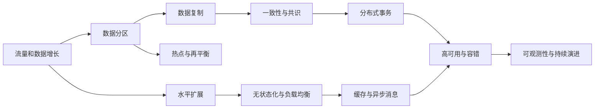
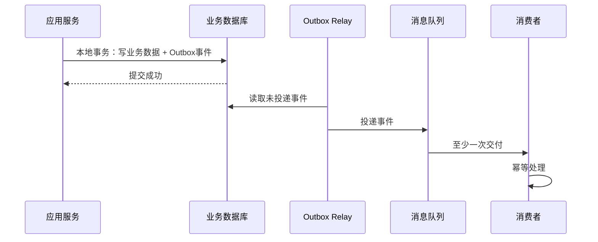

# 大规模分布式系统设计：从状态、扩展到一致性与容错

很多人第一次接触分布式系统，会把它理解为“把程序部署到更多机器上”。但机器数量并不是问题的本质。真正困难的是：**状态一旦跨机器存在，网络、节点和时钟的不确定性就会进入每一条业务链路。**

在单机程序中，一次函数调用通常只有成功或失败；而在远程调用中，还存在第三种状态：请求可能已经执行，但响应丢了，调用方无法确认结果。此时重试可能解决问题，也可能制造重复扣款、重复下单或重复发券。

因此，大规模分布式系统设计并不是寻找某个“万能架构”，而是在容量、延迟、一致性、可用性、成本和复杂度之间做出可解释的取舍。

本文尝试建立一张完整的认知地图：



---

## 一、分布式系统为什么难：状态才是分水岭

### 1. 单机的隐性福利

单机程序天然拥有一些容易被忽略的优势：

- 内存访问快，数据位置明确；
- 函数调用不会经过不可靠网络；
- 进程内通常只有一个可观察的时间顺序；
- 本地事务可以提供成熟的原子性和隔离性；
- 一个变量通常只有一个权威版本。

把系统拆到多台机器后，这些福利会逐一消失：

- 网络可能丢包、延迟、断连或发生半开连接；
- 节点可能宕机，也可能只是短暂停顿；
- 不同机器的时钟会漂移；
- 同一份数据可能存在多个版本；
- 一次业务操作可能只完成了一半。

所以，远程调用必须默认配置超时；重试必须建立在幂等基础上；跨节点时序不能轻信物理时钟；涉及状态的操作必须明确谁是权威、失败后如何恢复。

### 2. 无状态与有状态

**无状态服务**不在进程内保存与某个客户端绑定的数据。请求需要的上下文，要么由客户端携带，要么从数据库、缓存等外部系统读取。无状态副本彼此可替换，因此可以直接通过“增加实例 + 负载均衡”扩容。

**有状态服务**则拥有不可随意丢弃的数据，例如数据库、缓存和消息队列。数据在哪台机器、存在几份、哪一份更新，是所有复杂问题的起点：

- 数据太大，需要分区；
- 单份数据不可靠，需要复制；
- 复制产生多个版本，需要一致性协议；
- 业务跨多个状态单元，需要分布式事务；
- 节点和网络会失败，需要容错与恢复。

一句话概括：

> 无状态服务的扩展问题，主要是流量分配；有状态服务的扩展问题，主要是状态管理。

### 3. 设计前先算账

架构设计不应从中间件名称开始，而应先回答几个数量问题：

- 峰值 QPS 是多少？平均值与峰值相差几倍？
- 单次请求读写多少数据？
- 每日新增数据量是多少？需要保存多久？
- 读写比例如何？是否存在明显热 key？
- 可接受的 p95、p99 延迟分别是多少？
- 单机容量和单节点故障后的剩余容量是多少？

常见粗算公式：

```text
峰值 QPS ≈ 日请求量 ÷ 86400 × 峰值系数
每日新增存储 ≈ 每秒写入条数 × 单条大小 × 86400
出口带宽 ≈ 峰值 QPS × 平均响应大小
所需实例数 ≈ 峰值负载 ÷ 单实例安全吞吐 × 冗余系数
```

容量规划不追求一开始就精确到个位数，而是避免出现数量级错误。

---

## 二、水平扩展：先让计算节点可以被随意替换

### 1. 垂直扩展与水平扩展

垂直扩展是给单机增加 CPU、内存和更快的磁盘。它改造成本低，适合系统早期，但会遇到两类上限：

1. 单机硬件存在物理天花板，且高端配置的边际成本越来越高；
2. 更强的单机仍然是单一故障域，机器宕机时整体容量归零。

水平扩展通过增加多台普通机器分摊流量。它既能扩大容量，也能缩小单节点故障的影响。不过它有一个前提：**同一请求落到任意实例，都必须得到正确结果。**

因此，在应用层扩容前，通常要完成无状态化：

- Session 放入 Redis 或数据库；
- 使用签名 Token 携带会话信息；
- 购物车、草稿等业务状态写入外部存储；
- 本地文件改为对象存储；
- 本机任务进度改为共享状态或事件日志。

无状态化不是消灭状态，而是把状态集中到更适合管理它的系统中。

### 2. L4 与 L7 负载均衡

L4 负载均衡工作在传输层，根据 IP、端口和连接信息转发流量。它性能高、协议无关，但无法依据 URL、Header 或 Cookie 路由。

L7 负载均衡能够理解 HTTP 等应用层协议，可用于：

- 按域名或路径分流；
- TLS 终结；
- 灰度发布与 A/B 测试；
- 身份验证、限流和请求改写；
- 基于 Header 的版本路由。

常见做法是分层使用：外层 L4 承担高吞吐接入，内层 L7 承担内容路由和治理能力，避免单个复杂代理成为瓶颈。

### 3. 请求如何分配

常见负载均衡算法各有适用条件：

| 算法 | 优点 | 局限 | 适用场景 |
|---|---|---|---|
| 轮询 | 简单、均匀 | 不感知请求成本 | 实例同质、请求相近 |
| 加权轮询 | 可适配不同配置实例 | 权重需要维护 | 混合规格节点 |
| 最少连接 | 能根据在途请求自我纠偏 | 连接数不等于真实负载 | 长连接或耗时差异明显 |
| 一致性哈希 | 同一 key 稳定落到同一节点 | 节点不均时仍需虚拟节点 | 本地缓存、会话亲和 |

应尽量避免依赖“粘性会话”掩盖服务有状态的问题。粘性会话可以优化局部缓存，却不应成为正确性的前提。

---

## 三、数据分区：把状态切开

当单机同时撞上存储容量和写吞吐上限时，仅靠复制无法解决问题。复制只是把全量数据拷贝多份，每个副本仍需要保存完整数据，主节点通常仍承担全部写入。要扩展容量和写吞吐，必须进行数据分区。

### 1. 范围分区与哈希分区

**范围分区**按照连续区间切分数据，例如按时间、地区或 ID 区间分片。它保留了数据顺序，适合范围扫描，但单调增长的 key 容易把所有新写集中到最后一个分区。

**哈希分区**先对 key 计算哈希，再映射到分区。它能打散写入、均衡负载，但会破坏相邻 key 的局部性，使范围查询变成 scatter-gather：请求发往多个分区，再汇总结果，整体延迟取决于最慢的分区。

| 维度 | 范围分区 | 哈希分区 |
|---|---|---|
| 数据顺序 | 保留 | 被打散 |
| 范围查询 | 高效 | 通常需要跨分区聚合 |
| 写入均匀性 | 容易出现尾部分区热点 | 通常较均匀 |
| 常见场景 | 时间序列、区间扫描 | 用户、订单、对象 key |

工程上经常组合使用。例如先按租户或用户哈希分区，在分区内部再按时间排序。

### 2. 为什么不能直接 `hash(key) % N`

当节点数从 N 变为 N+1 时，取模结果会大面积改变，导致几乎所有 key 重新映射。其后果包括：

- 大量数据同时迁移；
- 网络带宽被搬迁流量打满；
- 缓存命中率骤降；
- 迁移期间请求抖动和尾延迟上升。

一致性哈希把节点放在哈希环上，key 顺时针寻找负责节点。增加或删除节点时，通常只需迁移局部区间，而不是重排全部 key。

但需要注意：**少搬数据与分布均匀是两件事。** 一致性哈希解决前者，虚拟节点用来改善后者。另一种常见方案是预先创建远多于物理节点的固定逻辑分区，再把逻辑分区分配给节点；扩容时只迁移部分逻辑分区。

### 3. 热 key 是独立问题

即使哈希函数完美均匀，一个明星账号、爆款商品或热门事件仍可能形成热 key。因为单个 key 无法被哈希到多台机器，分区机制本身无法消除业务热点。

常见缓解方式包括：

- 前置多级缓存，减少对存储层的直接访问；
- 对可拆分计数使用 key 加盐，写入多个子 key 后聚合；
- 对只读热点增加副本并就近读取；
- 将热点租户或大客户隔离到独立分区；
- 对突发流量使用排队、限流和请求合并。

---

## 四、数据复制：在性能、可用性与一致性之间取舍

分区解决“数据太多、写入太高”，复制解决的是另外三个问题：

- 一台机器宕机后数据不能消失；
- 读流量可以由多个副本分担；
- 用户可以从地理位置更近的副本读取。

### 1. 三种复制拓扑

**单主复制**：所有写入进入 Leader，再复制到 Followers。冲突少、模型清晰，是最常见方案；代价是主节点承担写瓶颈，故障切换时需要重新选主。

**多主复制**：多个节点都可写，适合多地域写入或离线同步，但并发更新会产生冲突，需要版本向量、最后写入胜出或业务合并策略。

**无主复制**：客户端或协调节点同时向多个副本读写，通过 quorum 获得交集。它减少了对单一 Leader 的依赖，但读修复、反熵和冲突合并更复杂。

### 2. 同步与异步复制

同步复制在返回成功前等待副本确认，数据持久性更强，但写延迟受最慢确认路径影响。异步复制允许主节点先返回，再后台传播，延迟更低，却存在主节点故障时丢失尚未复制数据的窗口。

对于 N 个副本，写入 W 个、读取 R 个时，经典条件是：

```text
W + R > N
```

它保证读集合与写集合至少有一个副本相交。但这并不自动等于线性一致，实际还要考虑并发写、版本比较、失效节点和读修复策略。

### 3. 复制延迟会破坏哪些体验

异步复制最常见的问题不是抽象理论，而是具体用户体验：

- 用户刚提交内容，刷新后却看不到；
- 连续两次读取，第二次反而更旧；
- 同一会话中观察到不符合因果顺序的数据。

可按业务需要提供更有针对性的保证：

- **Read Your Writes**：用户至少能读到自己刚写入的版本；
- **Monotonic Reads**：同一用户后续读不会比之前更旧；
- **Consistent Prefix**：具有因果顺序的写入不会被颠倒观察。

不是所有数据都需要最强一致性。对用户余额和库存使用强约束，对点赞数和浏览量容忍短暂延迟，通常更经济。

---

## 五、一致性与共识：CAP 不是“三选二”口号

### 1. 一致性是一把梯子

一致性不是简单的“有”或“没有”。从强到弱，可以理解为：

- 线性一致：像只有一份数据，每次读取都看到最新完成的写；
- 顺序一致：所有节点看到相同操作顺序，但不严格受现实时间约束；
- 因果一致：有因果关系的操作顺序一致，无关操作可并发；
- 最终一致：停止写入后，各副本最终收敛。

越强的一致性通常需要越多协调，也就意味着更高延迟、更低可用窗口或更高成本。

### 2. 正确理解 CAP

CAP 中：

- C 指线性一致，而不是泛泛的“数据正确”；
- A 指每个非故障节点都能对请求返回非错误响应；
- P 指节点之间发生消息丢失或网络隔离时，系统仍能处理这种情况。

真实网络中，P 不是可随意放弃的选项。CAP 真正表达的是：

> 当网络分区已经发生时，隔离的节点要么用可能陈旧的数据继续回答，保可用性；要么拒绝回答，等待确认最新状态，保一致性。

网络正常时，CAP 并不要求系统在 C 和 A 之间二选一。因此，把系统简单贴成“CP”或“AP”，并不能解释它平时的延迟表现。

### 3. PACELC 补全日常取舍

PACELC 把问题拆成两部分：

```text
如果发生分区 P：在可用性 A 与一致性 C 之间取舍；
否则 E：在延迟 L 与一致性 C 之间取舍。
```

绝大多数时间网络并未分区，系统天天支付的是 ELC 这一半的成本。为了线性一致，读写通常需要等待跨副本协调；为了低延迟，就近副本可能直接返回旧值。

所以，设计评审应明确问两个问题：

1. 分区发生时，业务更怕拒绝服务，还是更怕返回错误数据？
2. 网络健康时，业务愿意为强一致额外支付多少延迟？

### 4. 多数派与 Raft

多数派机制的安全基础是：任意两个超过半数的集合必然相交。

- Leader 选举需要多数票，因此同一任期无法选出两个合法 Leader；
- 日志写入多数派后，新 Leader 的选举集合必然与它相交，因此已提交日志不会凭空消失；
- 少数派一侧无法形成多数，只能停止写入，而不能形成合法分叉。

Raft 将共识拆成两个核心过程：

1. **Leader Election**：节点通过随机选举超时竞争新任期的 Leader；
2. **Log Replication**：写入先进入 Leader 日志，复制到多数派后才提交并应用。

共识协议解决的是“多个节点如何对同一串状态变化达成一致”，它不是普通业务数据的默认方案。对配置、元数据、选主、锁服务等小而关键的状态很合适；对海量低价值计数直接使用强共识，成本可能远大于收益。

---

## 六、分布式事务：不要试图把单机 ACID 原样放大

### 1. 2PC：原子性的代价是阻塞

两阶段提交把事务分为：

1. Prepare：参与者写日志、锁定资源并承诺可以提交；
2. Commit/Abort：协调者根据投票发布最终决定。

它能够保证多个参与者原子提交，但协调者在关键窗口故障时，已经 Prepare 的参与者无法自行判断最终决定，只能继续持锁等待。这种 in-doubt 状态会降低可用性，并可能造成锁堆积和级联阻塞。

因此，2PC 更适合同一管理边界、参与者数量有限、故障概率可控的场景，不适合把大量自治微服务长时间绑在同一个全局事务中。

### 2. Saga：用补偿替代全局锁

Saga 把长事务拆成多个本地事务，每一步立即提交。后续步骤失败时，按相反顺序执行补偿操作。

需要区分：补偿不是数据库回滚。前一步已经真实生效，补偿只能用新的业务动作抵消影响。例如：

- 创建订单 → 将订单标记为取消；
- 扣减库存 → 增加库存；
- 冻结额度 → 释放额度。

Saga 可以采用中央编排，也可以通过事件协同。前者流程清晰、容易追踪；后者耦合较低，但状态分散，排障更加困难。

Saga 的关键限制是：中间状态对外可见，并且不是所有副作用都可逆。已发送的短信、已触发的外部转账，往往只能更正或人工处理，而无法真正“撤销”。

### 3. TCC：显式预留资源

TCC 将每个参与者的操作拆成：

- Try：校验并冻结资源；
- Confirm：正式使用已冻结资源；
- Cancel：释放冻结资源。

与 Saga 相比，TCC 通过 pending 状态隐藏了一部分中间结果，隔离性更强，但要求每个服务实现三套接口，并正确处理空回滚、重复确认、重复取消和悬挂等问题。它适合库存、余额、席位等可以明确预留的稀缺资源。

### 4. Outbox：解决“写库 + 发消息”的双写

直接先写数据库、再发消息，会出现数据库成功但消息丢失；反过来先发消息、再写库，则可能产生幽灵事件。

Transactional Outbox 的做法是：

1. 在同一个本地数据库事务中，同时写业务表和 outbox 事件表；
2. 独立 Relay 进程通过轮询或 CDC 将事件投递到消息队列；
3. 投递成功后更新 outbox 状态。



Relay 可能在投递成功、尚未标记完成时崩溃，因此消息仍可能重复。Outbox 提供的是可靠的至少一次交付，不是天然的 exactly-once。消费者必须使用事件 ID 去重，并让“去重记录”和“业务副作用”处于同一个本地事务中。

---

## 七、缓存与异步消息：用复杂度换延迟与吞吐

### 1. 缓存模式

最常见的是 Cache-Aside：

1. 读缓存；
2. 未命中时读数据库；
3. 将结果写入缓存；
4. 更新数据库后删除缓存。

它简单、灵活，但应用必须处理缓存失效和并发竞态。Read-Through、Write-Through 把读写逻辑交给缓存层；Write-Behind 先写缓存再异步落库，延迟最低，但缓存故障可能造成数据丢失。

### 2. 缓存的三种典型故障

- **缓存穿透**：反复查询不存在的 key。可用空值缓存、参数校验、布隆过滤器；
- **缓存击穿**：单个热 key 过期，大量请求同时回源。可用 singleflight、互斥重建、逻辑过期；
- **缓存雪崩**：大量 key 同时过期或缓存集群整体故障。可使用 TTL 随机抖动、多级缓存、限流、熔断和旧值降级。

缓存与数据库通常很难获得严格的一致性。常见策略是接受短暂窗口，通过删除缓存、订阅 binlog/CDC 失效缓存、版本号和较短 TTL 控制风险。所谓“延迟双删”只能降低概率，不能构成严格正确性证明。

### 3. Exactly-once 为什么困难

消息发送者在超时后无法判断消息是未送达，还是已送达但确认丢失：

- 不重试，可能丢消息；
- 重试，可能重复消息。

所以，工程上更可靠的思路是：

```text
有效一次处理 ≈ 至少一次投递 + 幂等消费者 + 原子记录处理结果
```

常见幂等方式包括业务唯一键、事件 ID 去重表、状态机条件更新和数据库唯一约束。

### 4. 背压比无限排队更重要

当消费者跟不上生产者时，无界队列只是把故障推迟到内存耗尽。更合理的做法是：

- 使用有界队列；
- 达到阈值后限流或拒绝；
- 降低上游生产速率；
- 批量处理并增加消费者；
- 监控消费延迟和积压量。

日志型 Broker 更适合保留事件流、回放和多消费者独立读取；队列型 Broker 更适合任务分发、确认后删除和复杂路由。选型应从消费模型出发，而不是只比较峰值吞吐数字。

---

## 八、高可用与容错：防止局部故障扩散成全站事故

高可用不是“永不失败”，而是系统在组件持续失败时仍能提供可接受的服务。最危险的情况往往不是节点彻底宕机，而是节点变慢：慢调用会长期占用线程、连接和队列，最终拖垮整条调用链。

### 1. 超时、重试与熔断

每个远程调用都必须有超时，而且超时要服从整条请求的总预算。如果用户请求只允许 1 秒，A 调 B、B 调 C 就不能各自独立设置 1 秒超时；剩余预算应沿调用链传递。

正确重试至少需要三个条件：

- 操作幂等，或拥有幂等键；
- 指数退避，避免立即连续冲击下游；
- 随机抖动，避免大量客户端同时醒来形成惊群。

还应设置重试次数或重试预算。多层服务各自重试三次，可能把一次用户请求放大成数十次下游调用。

熔断器在错误率或慢调用比例超过阈值时暂时阻断请求，快速失败并走降级逻辑。它首先保护的是调用方资源，而不是“修复”下游。

### 2. 限流与早拒

常见限流算法包括固定窗口、滑动窗口、漏桶和令牌桶。令牌桶既能限制长期平均速率，也能允许一定突发流量，因此使用广泛。

系统过载时，尽早返回 429 或 503，通常比让请求进入深层队列、占用大量资源后再超时更健康。限流应部署在多个层级：入口保护全局容量，服务内部保护关键接口，下游资源前保护数据库和第三方依赖。

### 3. 舱壁与故障隔离

如果所有下游依赖共享同一个线程池或连接池，一个慢依赖就可能耗尽公共资源，连与它无关的接口也一起瘫痪。

舱壁模式为不同依赖分配独立资源池，把故障限制在局部。它通常与下面四件套结合：

```text
超时：单个请求不能无限等待
熔断：大面积失败时停止徒劳调用
舱壁：一个依赖不能耗尽全部资源
降级：失败时提供可接受的兜底结果
```

### 4. 脑裂、租约与 Fencing Token

多数派选主可以阻止网络分区两侧同时产生合法 Leader，但仍挡不住旧 Leader 在长时间 GC 或虚拟机暂停后恢复，并继续以旧身份写数据。

仅依赖带 TTL 的分布式锁并不安全：锁过期后新客户端已经获得锁，旧客户端恢复时却不知道自己失去资格。

Fencing Token 的做法是：每次获得领导权或锁时，由协调者发放单调递增的令牌。所有写操作必须携带令牌，存储端只接受不小于已见最大值的请求。旧持有者即使恢复，也会因为令牌过小而被拒绝。

不要使用本地时间戳代替 Fencing Token，因为不同机器的物理时钟可能漂移。

### 5. 混沌工程是容错机制的验收

故障转移代码往往只在生产事故中执行，而这正是最不适合首次测试它的时刻。混沌工程的合理流程是：

1. 用 SLI 定义正常稳态；
2. 从单实例、小流量等最小爆炸半径开始；
3. 注入延迟、丢包、进程退出或依赖超时；
4. 验证熔断、降级、舱壁和故障切换是否符合预期；
5. 实验失败时立即停止并复盘。

混沌工程不是随机破坏，而是对高可用设计进行可观测、可回滚的集成测试。

---

## 九、可观测性：先定义“够好”，再谈优化

没有可观测性，分布式系统的故障只会表现为“用户说慢”，工程师却无法判断问题发生在哪个服务、哪个依赖或哪个资源池。

### 1. Metrics、Logs、Traces

- Metrics 用于观察趋势、容量和告警；
- Logs 用于解释具体事件和上下文；
- Traces 用于还原跨服务调用链和延迟分布。

三者的关键不是分别收集，而是通过统一的 trace ID、request ID 和业务 ID 关联起来。

### 2. RED 与 USE

面向请求的服务可使用 RED：

- Rate：请求速率；
- Errors：错误率；
- Duration：延迟分布。

面向资源可使用 USE：

- Utilization：利用率；
- Saturation：饱和度和排队程度；
- Errors：资源错误。

RED 告诉我们用户侧发生了什么，USE 帮助定位资源侧为什么发生。

### 3. SLI、SLO 与错误预算

例如，可以把“28 天内 99.9% 的请求在 500ms 内成功”定义为 SLO。剩余的 0.1% 就是错误预算。

错误预算的价值在于把“稳定性”和“发布速度”的争论量化：

- 预算充足，可以继续实验和发布；
- 预算快速消耗，应优先修复稳定性；
- 预算耗尽，应暂停高风险变更。

可观测性的最终目的不是制造更多图表，而是帮助团队做出行动决策。

---

## 十、把所有机制串成一条设计方法

面对一个新的大规模系统，不要从“要不要上某个中间件”开始。可以按下面的顺序推导：

### 第一步：定义业务不变量

先找出绝不能被破坏的规则，例如：

- 余额不能被透支；
- 同一订单不能重复支付；
- 已确认库存不能被其他订单抢走；
- 配置版本不能倒退。

只有这些关键路径需要强一致，其他数据可以使用更便宜的模型。

### 第二步：估算容量和访问模式

明确峰值 QPS、数据规模、读写比、对象大小、热 key、访问地域和延迟目标。没有数量级，分区数、缓存容量和实例数量都只是猜测。

### 第三步：先扩无状态层

将会话和业务状态外移，使计算实例可替换，再使用负载均衡和自动伸缩提升容量。

### 第四步：为有状态层选择分区键

判断更需要范围扫描还是写入均匀；分析跨分区查询、热点、再平衡和数据迁移成本。不要默认使用 `hash % N`。

### 第五步：确定复制和一致性模型

逐类数据回答：

- 有几个副本？
- 同步还是异步？
- 哪个副本可写？
- 读是否必须最新？
- 分区时拒绝服务还是返回旧值？
- 健康时愿意为强一致多付多少延迟？

### 第六步：设计失败语义

对每个远程操作明确：

- 超时后是否可以重试？
- 重试是否幂等？
- 请求成功但响应丢失怎么办？
- 下游变慢时如何限流、熔断和降级？
- 是否需要舱壁隔离？

### 第七步：选择跨服务事务策略

- 同一数据库内：优先本地事务；
- 短事务且参与者受控：谨慎评估 2PC；
- 长业务流程且可补偿：Saga；
- 可预留稀缺资源：TCC；
- 写库并发布事件：Outbox + 幂等消费。

### 第八步：用 SLO 验证设计

建立请求、资源和业务指标，观察尾延迟、错误率、积压、复制延迟、缓存命中率、熔断次数和错误预算消耗，并通过故障演练验证恢复路径。

---

## 十一、常见误区

1. **把微服务数量当成架构先进程度。** 服务拆得越多，远程调用、数据一致性和运维成本越高；边界应围绕业务能力和团队自治划分。
2. **把 CAP 理解成任何时候都“三选二”。** 它描述的是网络分区已经发生时的条件取舍。
3. **认为加副本就能扩写。** 复制主要提升读能力和可用性，分区才扩展存储容量和写吞吐。
4. **认为一致性哈希自动解决热点。** 它减少扩缩容时的数据搬迁，不能拆分单个热 key。
5. **认为消息队列支持 exactly-once 就无需幂等。** 业务副作用跨越数据库和 Broker 时，消费者幂等仍然不可少。
6. **把重试当作默认修复方式。** 没有退避、抖动、预算和幂等的重试，会把小故障放大成重试风暴。
7. **认为带 TTL 的分布式锁天然安全。** 旧持锁者恢复后仍可能写入，关键资源需要 Fencing Token。
8. **只看平均延迟。** 大规模系统的用户体验和故障往往藏在 p95、p99 甚至更高分位。

---

## 结语

大规模分布式系统看起来包含很多独立主题：负载均衡、分库分表、复制、CAP、Raft、Saga、缓存、消息队列、熔断、限流、链路追踪……但它们其实都围绕同一条主线展开：

> 状态跨机器存在后，我们必须决定它放在哪里、复制几份、由谁写入、读到哪个版本、失败后如何恢复，以及愿意为这些保证支付多少成本。

成熟的架构设计并不追求所有指标同时最优，而是让每个取舍都有业务依据：关键不变量使用强保证，非关键路径接受最终一致；常态路径追求低延迟，异常路径限制爆炸半径；系统不仅能承受增长，也能在失败发生时有序退化并快速恢复。

真正重要的不是记住某个中间件的配置，而是掌握一套稳定的推理顺序：**先定义不变量，再估算容量；先识别状态，再选择分区和复制；先设计失败语义，再讨论具体技术。**
