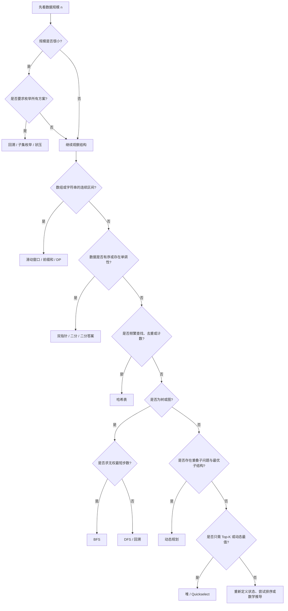

# 把刷题变成认套路：从约束到解法的算法面试方法论

很多人刷了上百道算法题，面对一道稍微换了包装的新题，依然会陷入熟悉的停顿：

> 这题我是不是见过？它对应哪一道原题？

问题恰恰出在这里。算法面试并不真正考察你记住了多少道题，而是考察你能否从陌生题面中识别结构，把它映射到少数几个稳定的解题模型。

与其把题库当作几百个彼此孤立的答案，不如建立一条固定的思考链：

> **数据规模与约束 → 目标复杂度 → 题目结构信号 → 候选套路 → 正确性与复杂度验证**

这条链一旦形成，刷题就不再是“背答案”，而是在训练分类和决策能力。

---

## 一、拿到题目，先别急着想算法

大多数人读题后的第一反应是搜索记忆：“这像不像我做过的某道题？”更稳定的做法，是先看输入规模。

### 1. 用约束给解法划边界

算法题给出的 `n`，并不只是测试数据的说明，它通常也在暗示允许使用的复杂度。

下面是一张实用的经验表：

| 输入规模 | 通常可接受的复杂度 | 常见方向 |
|---|---:|---|
| `n ≤ 10~12` | `O(n!)`、`O(2^n)` | 全排列、回溯、暴力枚举 |
| `n ≤ 20~25` | `O(2^n)` | 子集枚举、状态压缩 |
| `n ≤ 500` | `O(n^3)` | 三重循环、部分区间 DP |
| `n ≤ 5000` | `O(n^2)` | 二维 DP、朴素双循环 |
| `n ≤ 10^5~10^6` | `O(n)`、`O(n log n)` | 哈希、双指针、滑动窗口、排序、二分 |
| `n` 极大 | `O(log n)`、`O(1)` | 二分、数学推导、公式 |

这不是绝对定律，但足以帮助我们快速排除明显不可行的方案。

例如，`n = 10^6` 时，`O(n^2)` 意味着约 `10^12` 级别的操作，基本可以直接排除。此时应优先寻找一次扫描、哈希、双指针、堆、排序或二分等方案。

再比如，题目给出 `n ≤ 18`，并要求“找出所有满足条件的组合”，这往往不是在暗示你设计一个神奇的线性算法，而是在告诉你：指数级枚举可能就是正确方向。

### 2. Big-O 的真正用途是排除错误方向

Big-O 不是为了在面试中背定义，而是为了回答两个问题：

1. 当前方案能不能跑完？
2. 是否必须用额外空间换时间？

以“判断数组中是否存在重复元素”为例：

```python
def contains_duplicate(nums: list[int]) -> bool:
    seen = set()
    for x in nums:
        if x in seen:
            return True
        seen.add(x)
    return False
```

朴素双循环需要 `O(n^2)` 时间；借助哈希集合后，平均时间降为 `O(n)`，代价是 `O(n)` 的额外空间。

这正是面试中最高频的权衡：

> **当时间复杂度必须下降一个量级时，先问自己能不能用空间换时间。**

还要特别留意递归的隐藏空间。一个递归函数即使每层只创建几个变量，只要最大递归深度是 `n`，调用栈空间仍然是 `O(n)`。在 Python 中，深递归还可能直接触发 `RecursionError`。

---

## 二、数据结构不是知识点，而是套路成立的原因

算法套路不是凭空出现的。数组、链表、栈、队列、堆和哈希表的操作特性，决定了哪些解法能够达到目标复杂度。

| 数据结构 | 强项 | 弱项 | 常见场景 |
|---|---|---|---|
| 数组 | 按下标访问 `O(1)` | 中间插入、删除通常 `O(n)` | 双指针、二分、前缀和 |
| 链表 | 已知节点处插入、删除 `O(1)` | 随机访问 `O(n)` | 指针操作、链表反转、环检测 |
| 哈希表 | 平均查找、插入 `O(1)` | 需要额外空间、无序 | 去重、计数、补数查找 |
| 栈 | 后进先出 | 只能访问栈顶 | DFS、括号匹配、单调栈 |
| 队列 | 先进先出 | 不适合随机访问 | BFS、按层遍历 |
| 堆 | 快速维护动态最值 | 不保证整体有序 | Top-K、数据流、中位数 |

在 Python 中，用队列时应优先选择 `collections.deque`，因为它的两端入队、出队都是 `O(1)`；而 `list.pop(0)` 需要移动后续元素，是 `O(n)`。

堆也经常被误解。堆不是一个完全有序的数组，而是一种“部分有序”的结构：读取堆顶是 `O(1)`，弹出或插入通常是 `O(log n)`。正因为它没有维护完整顺序，处理 Top-K 时才可能比完整排序更划算。

单调栈则是另一个典型例子。代码里虽然常出现嵌套的 `while`，但每个元素最多入栈一次、出栈一次，所以总操作次数仍然与 `n` 成正比，整体复杂度是均摊 `O(n)`，而不是 `O(n^2)`。

---

## 三、线性结构里的四个高频套路

数组、字符串和链表题看似变化很多，核心往往集中在哈希、双指针、滑动窗口和前缀和四类模型中。

### 1. 哈希：把“反复查找”变成“记住答案”

当题目需要频繁判断“某个值是否出现过”“某个补数是否存在”“某种状态出现了几次”时，应优先想到哈希表。

经典的两数之和，可以一边扫描，一边记录已经出现的数字：

```python
def two_sum(nums: list[int], target: int) -> list[int]:
    pos: dict[int, int] = {}

    for i, x in enumerate(nums):
        need = target - x
        if need in pos:
            return [pos[need], i]
        pos[x] = i

    return []
```

它把“为每个数再扫描一遍数组”的 `O(n^2)`，变成一次扫描的平均 `O(n)`。

**识别信号：** 去重、计数、是否出现、配对、补数、前缀状态出现次数。

### 2. 双指针：利用顺序排除不可能答案

双指针不是“放两个变量”这么简单。它成立的关键，是移动某个指针后，可以确定性地排除一批候选答案。

例如，在有序数组中寻找和为 `target` 的两个数：

- 当前和太小，左指针右移，和只会变大；
- 当前和太大，右指针左移，和只会变小。

```python
def two_sum_sorted(nums: list[int], target: int) -> tuple[int, int] | None:
    left, right = 0, len(nums) - 1

    while left < right:
        total = nums[left] + nums[right]
        if total == target:
            return left, right
        if total < target:
            left += 1
        else:
            right -= 1

    return None
```

如果数组无序，这种排除逻辑就不再成立。因此，看到双指针时必须追问：**指针为什么可以这样移动？被跳过的答案为什么不可能更优？**

双指针还包括快慢指针。链表环检测就是典型场景：快指针每次走两步，慢指针每次走一步；有环时二者必然相遇。与哈希集合记录访问节点相比，Floyd 算法把额外空间从 `O(n)` 降到了 `O(1)`。

**识别信号：** 有序数组、首尾夹逼、原地修改、链表环、删除或覆盖重复元素。

### 3. 滑动窗口：维护一个连续区间

当题目同时出现以下信号时，应高度怀疑滑动窗口：

- 对象是数组或字符串；
- 答案要求连续子数组或子串；
- 需要最长、最短或满足某种限制；
- 窗口右移时，状态可以增量维护。

一个通用模板是：右端不断扩张，条件不满足时移动左端收缩。

```python
def longest_unique_substring(s: str) -> int:
    count: dict[str, int] = {}
    left = 0
    answer = 0

    for right, ch in enumerate(s):
        count[ch] = count.get(ch, 0) + 1

        while count[ch] > 1:
            left_ch = s[left]
            count[left_ch] -= 1
            left += 1

        answer = max(answer, right - left + 1)

    return answer
```

虽然代码中有两层循环，但左右指针都只会向前移动，每个位置至多被访问有限次，所以总复杂度仍是 `O(n)`。

不过，滑动窗口依赖窗口性质的可维护性。如果加入一个元素后，无法通过单向收缩恢复合法状态，或者数组包含负数导致区间和不具备单调变化，就要谨慎考虑其他方法。

**识别信号：** 连续区间、最长/最短、至多/至少、窗口内频次或种类限制。

### 4. 前缀和：把区间查询变成两个前缀相减

前缀和适合处理大量区间和查询：

```python
prefix = [0]
for x in nums:
    prefix.append(prefix[-1] + x)

# nums[left:right + 1] 的和
range_sum = prefix[right + 1] - prefix[left]
```

更重要的是，前缀和可以和哈希表组合。

若当前前缀和为 `s`，希望找到和为 `k` 的子数组，就需要之前出现过前缀和 `s - k`。因此，“和为 k 的子数组个数”可以在一次扫描中完成。

**识别信号：** 区间和、多次区间查询、子数组和等于某值、前后状态之差。

---

## 四、二分的本质不是“在数组中找数”，而是寻找边界

许多人只会写最基础的二分查找，却在边界题中频繁出错。原因是他们记住了代码，没有建立不变量。

### 1. 先定义搜索区间，再写代码

写二分前，应明确三件事：

1. 搜索区间是闭区间 `[left, right]`，还是左闭右开 `[left, right)`？
2. 循环过程中，答案一定存在于哪个区间？
3. 条件成立时，要保留 `mid` 还是排除 `mid`？

下面是寻找第一个大于等于 `target` 的位置：

```python
def lower_bound(nums: list[int], target: int) -> int:
    left, right = 0, len(nums)  # [left, right)

    while left < right:
        mid = left + (right - left) // 2
        if nums[mid] < target:
            left = mid + 1
        else:
            right = mid

    return left
```

这里维护的不变量是：答案始终位于 `[left, right)` 中。

### 2. 二分答案：对结果空间做二分

二分并不要求输入数组已经有序。只要“某个答案是否可行”关于答案值具有单调性，就可以二分答案。

例如：

- 最小运载能力；
- 最大化最小距离；
- 最小完成时间；
- 在限制次数内能否完成任务。

通常可以写成：

```python
def feasible(x: int) -> bool:
    ...

left, right = lower, upper
while left < right:
    mid = left + (right - left) // 2
    if feasible(mid):
        right = mid
    else:
        left = mid + 1
```

二分答案成立的核心不是模板，而是这一句：

> **可行与不可行必须被一个边界分开。**

如果 `x` 增大后，判断结果会在“可行”和“不可行”之间来回变化，就不能直接二分。

### 3. 排序是一种预处理

排序的价值不只是得到有序结果。它还会创造单调性，让后续操作变得简单：

- 无序两数之和，排序后可用双指针；
- 区间问题，排序后可合并；
- 相邻差值问题，排序后只需检查邻居；
- 离线查询，排序后可统一扫描。

但排序的代价通常是 `O(n log n)`，还可能破坏原下标。因此，在决定排序前应问：**我是否真的需要整体有序？哈希、堆或 quickselect 会不会更直接？**

---

## 五、树、图与回溯：先决定遍历顺序

树和图的问题，很多时候不是“要不要遍历”，而是“按什么顺序遍历”。

### 1. DFS：先走到底，再回退

DFS 使用栈；递归只是隐式地使用调用栈。

```python
def dfs(node: int, graph: list[list[int]], visited: set[int]) -> None:
    if node in visited:
        return

    visited.add(node)
    for nxt in graph[node]:
        dfs(nxt, graph, visited)
```

DFS 适合：

- 连通块统计；
- 路径存在性；
- 树的递归处理；
- 拓扑结构分析；
- 回溯枚举。

图中必须认真处理 `visited`。树通常有天然的父子方向，而一般图中存在环，不标记访问状态就可能无限重复。

### 2. BFS：按距离一层一层扩展

BFS 使用队列。它最重要的性质是：在无权图中，节点第一次被访问时，得到的就是从起点出发的最短步数。

```python
from collections import deque


def bfs(start: int, graph: list[list[int]]) -> dict[int, int]:
    queue = deque([start])
    distance = {start: 0}

    while queue:
        node = queue.popleft()
        for nxt in graph[node]:
            if nxt in distance:
                continue
            distance[nxt] = distance[node] + 1
            queue.append(nxt)

    return distance
```

因此，看到“无权图最短路径”“最少操作次数”“逐层扩散”等描述时，应优先考虑 BFS，而不是 DFS。DFS 第一次到达终点，并不能保证路径最短。

### 3. 回溯：在隐式决策树上做 DFS

组合、排列、子集等题目，本质上是在一棵“选择树”中搜索。回溯模板只有三个动作：

1. 做选择；
2. 递归进入下一层；
3. 撤销选择。

```python
def permutations(nums: list[int]) -> list[list[int]]:
    result: list[list[int]] = []
    path: list[int] = []
    used = [False] * len(nums)

    def backtrack() -> None:
        if len(path) == len(nums):
            result.append(path.copy())
            return

        for i, x in enumerate(nums):
            if used[i]:
                continue

            used[i] = True
            path.append(x)

            backtrack()

            path.pop()
            used[i] = False

    backtrack()
    return result
```

“撤销选择”不是形式动作，而是在恢复进入当前分支之前的状态。省略它，前一个分支留下的数据就会污染后面的兄弟分支。

回溯通常是指数级的，所以必须先看约束。`n ≤ 10~20` 往往是在告诉你可以枚举；`n = 10^5` 时，就不应考虑生成所有组合。

---

## 六、动态规划与贪心：一个记录历史，一个拒绝回头

动态规划常被误解为“先定义一个 dp 数组”。实际上，DP 是对重复子问题的系统化复用。

### 1. 判断能否使用 DP

一个问题适合动态规划，通常需要两个条件：

- **最优子结构**：大问题的最优解可以由子问题的最优解构成；
- **重叠子问题**：递归过程中，同一子问题会被反复计算。

设计 DP 时，按以下顺序思考：

1. **状态是什么？** `dp[i]` 或 `dp[i][j]` 精确表示什么？
2. **转移是什么？** 当前状态如何由更小状态得到？
3. **边界是什么？** 最小规模的问题答案是多少？
4. **遍历顺序是什么？** 计算当前状态时，依赖状态是否已经得到？
5. **能否压缩空间？** 当前行是否只依赖上一行，当前值是否只依赖少数变量？

以最大连续子数组和为例，可以定义：

> `dp[i]` 表示“必须以 `nums[i]` 结尾”的最大子数组和。

于是有：

```python
def max_subarray(nums: list[int]) -> int:
    current = best = nums[0]

    for x in nums[1:]:
        current = max(x, current + x)
        best = max(best, current)

    return best
```

转移式是：

```text
dp[i] = max(nums[i], dp[i - 1] + nums[i])
```

由于当前状态只依赖前一个状态，空间可以从 `O(n)` 压缩为 `O(1)`。

### 2. 贪心为什么更危险

贪心每一步只保留当前看起来最优的选择，不再回头。它通常更快、空间更小，但正确性要求也更强：

> 必须证明局部最优选择不会破坏全局最优解。

适合贪心的典型场景包括：

- 区间调度中优先选最早结束的区间；
- 某些跳跃或覆盖问题；
- 可以通过交换论证证明的排序选择问题。

如果一个选择会影响后续状态，且无法证明“当前最优一定能扩展成全局最优”，就不要因为代码短而强行贪心。此时往往需要 DP、回溯或其他全局方法。

一个实用判断是：

- 需要保留多个可能的历史状态，通常更像 DP；
- 每一步都能安全丢弃其他选择，才可能是贪心。

---

## 七、把套路压缩成一棵决策树

拿到陌生题目时，可以按下面的顺序快速判断：



这棵树不是机械规则，而是一条思考脊柱。真正重要的是顺序：

1. **先看约束，排除不可能的复杂度；**
2. **再看结构信号，缩小套路范围；**
3. **最后用正确性和复杂度验证选择。**

---

## 八、六类典型题目的现场判别

下面用几个常见题面，演示如何从信号走到解法。

### 1. 有序数组中寻找和为 target 的两个数

- 结构信号：有序、两数配对；
- 套路：对撞双指针；
- 复杂度：`O(n)` 时间、`O(1)` 额外空间；
- 备选：哈希表同样可做到平均 `O(n)`，但需要 `O(n)` 空间。

### 2. `n ≤ 18`，找出所有和为 target 的子集

- 约束信号：规模很小；
- 结构信号：枚举所有组合；
- 套路：回溯或子集枚举，并配合剪枝；
- 复杂度：约 `O(2^n)`。

### 3. `n = 10^6`，寻找第 k 大元素

- 约束信号：不能接受 `O(n^2)`；
- 结构信号：只需要第 k 大，不需要整体有序；
- 套路：quickselect 平均 `O(n)`，或维护大小为 `k` 的堆 `O(n log k)`；
- 备选：全排序 `O(n log n)`，实现简单但做了额外工作。

### 4. 无权图中求起点到终点的最少步数

- 结构信号：无权图、最少步数；
- 套路：BFS；
- 原因：BFS 按距离逐层扩展，第一次到达即为最短；
- 复杂度：邻接表下为 `O(V + E)`。

### 5. 数组的最大连续子数组和

- 结构信号：连续区间、最优值、前后状态可递推；
- 套路：动态规划，即 Kadane 算法；
- 复杂度：`O(n)` 时间、`O(1)` 空间。

### 6. 判断链表是否有环，并寻找入环点

- 结构信号：链表、环；
- 套路：Floyd 快慢指针；
- 复杂度：`O(n)` 时间、`O(1)` 空间；
- 备选：哈希集合更直观，但需要 `O(n)` 额外空间。

---

## 九、真正有效的刷题方式

建立套路意识后，训练方式也要改变。

### 1. 不要按题号随机刷，按模式成组训练

一次集中练习一类题，例如连续完成：

- 3～5 道双指针；
- 3～5 道滑动窗口；
- 3～5 道二分边界；
- 3～5 道 BFS 最短路。

这样更容易比较题目之间“不变的骨架”和“变化的条件”。

### 2. 每道题先写判别，再写代码

动手编码前，强制写下四句话：

```text
1. 输入规模允许的复杂度是：
2. 题目的结构信号是：
3. 我选择的套路是：
4. 预计时间与空间复杂度是：
```

如果这四句话说不清，通常说明你还没有真正完成解题，只是凭感觉开始试代码。

### 3. 复盘时不要只抄“正确解法”

更有价值的复盘记录包括：

- 我最初为什么选错？
- 哪个约束本来可以提前排除错误方案？
- 哪个关键词或结构信号被我忽略了？
- 正确解法依赖什么单调性、不变量或状态定义？
- 如果题目修改一个条件，原套路是否仍成立？

### 4. 用变式检验是否真的掌握

做完一道题后，主动改变条件：

- 有序改成无序，双指针还能用吗？
- 正数数组加入负数，滑动窗口还能维护吗？
- 无权图改成带权图，BFS 还是最短路吗？
- 只求一个答案改成输出全部方案，复杂度发生什么变化？
- 数据从离线数组改成持续到来的数据流，排序还能用吗？

能回答这些问题，才说明你理解了套路成立的边界，而不是只记住了模板。

---

## 十、结语：从“见过这道题”到“认出这类结构”

算法能力的提升，不是脑中存下越来越多题解，而是逐渐形成稳定的判断顺序。

面对一道新题，不再问：

> “这道题我做过吗？”

而是依次问：

1. `n` 有多大，什么复杂度才可能通过？
2. 题目是在查找、维护区间、搜索状态空间，还是求全局最优？
3. 数据是否有序？答案是否具有单调性？
4. 是否存在连续区间、重复子问题、图上的层次关系或动态最值？
5. 选择的套路为什么正确？它的时间与空间成本是什么？

当这套流程变成习惯，你会发现，题目虽然有成千上万道，真正反复出现的结构却并不多。

刷题的目标也就从“再记住一道题”，变成了：

> **看到陌生题面，仍能从约束出发，识别结构，选中套路，并解释为什么。**
