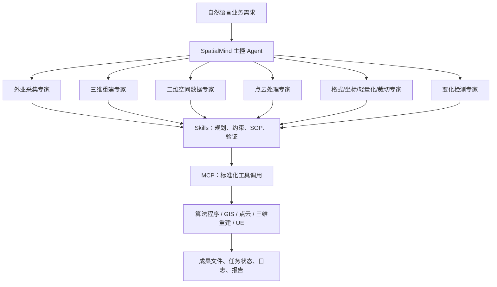
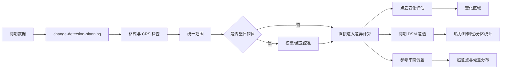

# 从大模型到空间智能生产线：自然资源行业 Agent 的落地实践

> **11 个 Agent、34 个 Skills、20 个 MCP 服务，如何组合成一条能够处理无人机影像、栅格、矢量、点云、实景三维模型和 Unreal Engine 场景的自然资源智能生产线？**

本文基于 `F:\pro\dlxx-base` 仓库截至 **2026 年 9 月 16 日**的 Agent 配置快照和仓库现状整理，写作时间为 **2026 年 10 月 7 日**。文章覆盖仓库中的全部核心内容：**11 个 Agent、32 个业务 Skill、2 个公共编排 Skill、20 个 MCP 服务**，以及配套脚本、参考资料、异步任务流程、算法运行包、日志与本地 MCP 配置。

需要先说明“覆盖全部内容”的粒度：仓库包含十几 GB 的算法程序、DLL、Qt/PROJ 运行库、Python vendor 依赖和打包产物。本文会完整覆盖它们在系统中的职责与组织方式，但不会逐个解释每一个第三方 DLL 或依赖文件；真正需要理解的是，为什么这些运行时会被打进 MCP 服务、Agent 如何获得这些能力、Skill 如何约束调用，以及一条生产任务怎样从自然语言走到可交付成果。

---

## 一、这不是一个聊天机器人仓库，而是一套空间智能能力底座

自然资源行业的数据生产有一个非常鲜明的特点：**数据重、链路长、参数专业、软件分散、错误代价高**。

用户可能只说一句：

> “把这个矿区两期模型对比一下，看看哪里有变化，再出一张变化热力图。”

但真正执行时，系统至少要回答下面这些问题：

- 两期数据是 OSGB、OBJ、点云，还是 DSM？
- 两期数据的坐标系是否一致？
- 是否存在整体平移、旋转或空三基准偏差？
- 对比的是地表高程、点云距离、参考平面偏差，还是语义对象变化？
- 是否需要先裁切到同一范围？
- 变化阈值是多少？
- 输出是栅格、矢量图斑、PNG 热力图，还是分区统计表？
- 结果能否用于工程计量，还是只能作为粗估和辅助判读？

这类任务显然不能通过“给大模型接一个 Python 工具”来可靠完成。`dlxx-base` 采用了三层分工：

1. **Agent 决定谁负责**：把能力组织成外业采集、三维重建、点云处理、坐标转换、变化检测等专业岗位。
2. **Skill 决定怎么做**：把业务边界、参数澄清、工具选择、处理步骤、失败恢复和成果验证写成标准作业流程。
3. **MCP 负责真正执行**：把本地算法、可执行程序、GIS 工具、点云程序和 Unreal Engine 操作包装成模型可调用的结构化工具。

可以把它理解成：

> **Agent 是岗位，Skill 是作业指导书，MCP 是专业软件与设备。**



这里最重要的设计不是“多 Agent”，而是**把规划、执行和验证拆开**。大模型可以参与判断，但专业算法仍由确定性程序执行；Skill 可以给出路径，但没有 MCP 就不能真正处理数据；MCP 可以完成算法调用，但没有 Skill 的边界控制，模型很容易在坐标系、格式、精度和输出口径上犯错。

---

## 二、先看仓库全貌：配置、知识和运行时被分开管理

仓库核心结构如下：

```text
dlxx-base/
├─ agents/
│  └─ current-agent-config-snapshot.json
├─ skills/
│  ├─ custom/                 # 32 个空间业务 Skills
│  └─ public/                 # 2 个公共编排 Skills
├─ mcp-services/              # 20 个 MCP 服务运行包
│  └─ <service>/
│     ├─ app/                 # 服务代码、算法、EXE、DLL、vendor 依赖
│     └─ logs/                # 启动与运行日志
├─ .codex/
│  └─ config.toml             # 本机 MCP 地址配置
├─ .tools/                    # 仓库配套工具与运行依赖
├─ .playwright-mcp/           # 页面自动化产生的本地状态文件
├─ .agents/                   # Agent 工具工作目录
├─ README.md
└─ .git/
```

这些目录分别解决不同问题：

- `agents/` 保存**组织结构和授权关系**：一个 Agent 能用哪些 Skills、能访问哪些 MCP、主控可以调度哪些子 Agent。
- `skills/` 保存**行业知识和流程知识**：同一套算法在什么场景下用、参数怎么选、什么时候必须停下来问用户。
- `mcp-services/` 保存**可运行能力**：不仅是源代码，还包括独立 Python vendor、可执行程序、Qt、PROJ、VC Runtime、模型资源和日志目录。
- `.codex/config.toml` 保存 20 个本地 MCP 的访问地址，使 Codex 或其他 MCP 客户端能够发现这些服务。
- `README.md` 是仓库总入口，给出了能力分类、部署约束和维护约定。

这种拆分很适合自然资源行业，因为算法包通常庞大且依赖复杂，而业务 SOP 的更新频率往往高于底层算法。把 Skill 与 MCP 分开后，可以在不重新打包算法程序的情况下调整业务策略，也可以在不重写 Agent 的情况下升级底层工具。

---

## 三、11 个 Agent：按真实生产岗位，而不是按技术组件分工

`agents/current-agent-config-snapshot.json` 是一份本机环境快照，生成时间为 **2026 年 9 月 16 日 12:15:19（UTC+8）**。它包含 1 个主控 Agent 和 10 个专业 Agent。快照还记录了本地数据库路径，因此仓库 README 明确提醒：对外分发或迁移前应先脱敏，不能把本机快照不加检查地直接覆盖到其他环境。

### 3.1 Agent 总表

| Agent | 定位 | 授权 Skills | 授权 MCP |
|---|---|---|---|
| SpatialMind | 主控、拆解、澄清、调度与汇总 | `team-task-planning`、`upfront-clarification` | 不直接绑定业务 MCP |
| 通识专家 | 承接尚未独立成专家的能力 | `dasslam-cli-zh`、`das-ue-import-obj`、`das-ue-weather` | UE 导入、UE 天气、无人机 DOM 提取、矿山场景 |
| 二维空间数据常规处理专家 | 栅格、矢量、影像处理 | 当前未配置专属 Skill | 影像、栅格、栅格处理、矢量 MCP |
| 外业采集专家 | 无人机摄影测量采集规划 | `drone-photogrammetry-planner` | `wayline-mcp` |
| 三维重建专家 | 照片质检、空三、重建与产品交付 | `3d-reconstruction` | `g3d-mcp`、`photo-qc` |
| 点云常规处理专家 | 清洗、地面提取、特征、配准、分割、裁并 | 9 个点云相关 Skills | 5 个点云 MCP 加 `vector-mcp` |
| 三维坐标转换专家 | 模型和点云坐标转换 | `transform-route-planning`、`model-srs-transform` | GridMaster Transform、栅格、矢量 |
| 三维数据格式转换专家 | 模型、点云、栅格跨格式与发布 | 6 个格式转换 Skills | GridMaster Convert/Process、点云、栅格、矢量 |
| 三维数据轻量化专家 | 模型减面、纹理降质、点云抽稀 | 3 个轻量化 Skills | GridMaster Process、点云基础 |
| 三维变化检测专家 | 多时相配准、差异评估、热力图与局部更新 | 8 个变化检测 Skills | GridMaster、点云、栅格、矢量组合 |
| 三维数据裁切合并专家 | 模型和点云的裁切、分幅与合并 | 3 个裁并 Skills | GridMaster Clip、点云基础、矢量 |

快照中的授权关系是闭合的：**34 个 Skill 全部被至少一个 Agent 授权，20 个 MCP 服务也全部被至少一个 Agent 使用**，不存在仓库中有能力却完全没有挂到 Agent 上的情况。

### 3.2 SpatialMind：主控不直接碰算法

主控 Agent 的 ID 是 `leader`，它被允许调用 10 个子 Agent，但自己没有直接绑定业务 MCP。它只持有两个公共 Skill：

- `upfront-clarification`：先拆解参数，再把真正缺失且阻塞的问题一次问全；
- `team-task-planning`：先核查现场和数据，再输出可批准的团队计划，批准后才形成成员工单。

这是一个值得保留的边界：主控负责全局意图和任务拓扑，而不是越过专家直接调用几十个算法工具。否则主控上下文会同时混入航线、摄影测量、点云、坐标系、模型转换和变化检测细节，很快失去稳定性。

### 3.3 通识专家：承接 UE、SLAM、DOM 提取和矿山场景

通识专家并不等于“什么都做”，而是承接还没有拆成独立专家的能力：

- `dasslam-cli-zh`：X100/R200 扫描、workspace、测站点云解算、点云到 3DGS、任务监控和成果登记；
- `das-ue-import-obj`：把 OBJ 或倾斜模型导入 Unreal Engine；
- `das-ue-weather`：在 Unreal 项目中设置时间和天气；
- `uav-dom-extract-local`：从本地 DOM/GeoTIFF 中提取建筑、道路、水体等目标并下载 Shapefile；
- `scenario-mine-mcp`：矿山台阶线检测。

其中 `dasslam-cli-zh` 对应的 Dasslam MCP 并不在本仓库 20 个本地运行包里，说明该 Skill 设计为对接外部或另行安装的服务；而 UE、DOM 提取和矿山检测则有本仓库内的 MCP 实现。

### 3.4 二维空间数据常规处理专家：工具已齐，业务 SOP 仍可继续补强

该 Agent 直接拥有：

- `image-processing-mcp`
- `raster-mcp`
- `raster-processing-mcp`
- `vector-mcp`

它能完成常规图像处理、栅格重投影与计算、DEM 派生、矢量缓冲叠加和栅格化等工作。值得注意的是，快照中它**没有专属 Skill**。这并不意味着不可用，而是说明当前二维能力更多依赖 MCP 工具说明和 Agent 自主选择，尚未像点云、变化检测那样沉淀出完整的“规划 Skill + 执行 Skill”。从生产化角度看，这是后续最值得补齐的区域之一。

### 3.5 外业采集专家：从成果反推采集，而不是只生成一条航线

外业采集专家只持有一个 Skill 和一个 MCP，但职责并不简单：

- Skill：`drone-photogrammetry-planner`
- MCP：`wayline-mcp`

Skill 内置 DJI M3/M4、P1、L1、L2、H30 等载荷参数，支持摄影测量、DOM/DSM/DTM、立面、走廊、堆场和重复测量任务。它要求用“被拍摄表面的相对航高”计算 GSD 与重叠度，而不是把相对起飞点高度、绝对高程和法规高度混为一谈。MCP 则负责面积检查与航线生成。

### 3.6 三维重建专家：仓库中最完整的一条生产线

三维重建专家通过 `3d-reconstruction` Skill 连接 `g3d-mcp` 和 `photo-qc`。它不是一个“点击开始建模”的工具，而是覆盖五条工作线：

1. 照片到空三、重建和产品交付；
2. 开工前照片质检；
3. 空三日志分析；
4. 重建瓦片与 Production 日志分析；
5. 外部 POS 转 `PosData.json`。

Skill 还包含自由网、控制网、重建、派生产品、空三重跑等阶段文档，以及参数分级、错误处理、恢复、报告、日志知识库和 POS 转换脚本。它代表了仓库中“Skill 不只是提示词，而是一个小型领域应用包”的最高完整度。

### 3.7 点云常规处理专家：以处理链为核心

点云专家同时拥有规划 Skill 和多个执行 Skill：

- 规划：`pointcloud-pipeline-planning`、`clip-merge-route-planning`
- 清洗与地面：`pointcloud-cleaning`、`ground-extraction`
- 特征与分割：`pointcloud-feature-enrichment`、`pointcloud-segmentation`
- 配准：`pointcloud-registration`
- 裁并：`pointcloud-clip-and-merge`
- 抽稀：`pointcloud-thinning`

它背后的 MCP 被拆成 basic、feature、filter、registration、segment 五组，避免一个点云服务无限膨胀。`vector-mcp` 则提供裁切边界、缓冲和空间范围处理。

### 3.8 三个“数据治理型”专家

格式转换、坐标转换、轻量化不是简单工具动作，而是三类经常被低估的数据治理任务：

- **三维坐标转换专家**先用 `transform-route-planning` 判定源/目标 CRS、转换等级、原点偏移和缺失参数，再调用 `model-srs-transform`；
- **三维数据格式转换专家**先用 `format-route-planning` 判断直转还是多跳中转，再调用通用网格、I3S、OSGB/OBJ、跨模态和 3D Tiles 发布 Skills；
- **三维数据轻量化专家**先用 `simplify-route-planning` 判断是模型减面、纹理压缩、点云抽稀，还是应该改走发布格式优化。

这三个 Agent 的共同价值是：阻止模型把“转格式”“转坐标”“减小文件”当成没有代价的黑盒操作。

### 3.9 变化检测与裁切合并：跨 MCP 的复合专家

变化检测专家授权的 MCP 最多，因为多时相分析通常要跨越：

```text
格式统一 → 坐标统一 → 范围统一 → 配准 → 差值 → 制图 → 统计
```

它使用 8 个 Skill，覆盖方案规划、模型配准、点云变化、参考平面偏差、DSM 对比、热力图和点云局部更新。裁切合并专家则负责在模型和点云两侧建立统一空间范围，为变化检测、交付分幅和局部更新提供前置条件。

---
## 四、34 个 Skills：把行业经验变成可执行的标准作业流程

Skill 是这套架构最关键的知识层。它不负责替代算法，而是回答五类问题：

1. **触发条件**：用户说什么、拿来什么数据时应该使用；
2. **能力边界**：哪些场景属于本 Skill，哪些必须转交其他专家；
3. **参数策略**：哪些参数能默认，哪些必须询问，哪些属于高级项；
4. **执行流程**：工具调用顺序、异步轮询、成果校验、失败后的换路；
5. **风险声明**：哪些结果只是粗估、哪些操作会破坏数据、哪些任务必须人工审核。

仓库中的 34 个 Skill 并不是同一种形态。有些只有一个 `SKILL.md`，有些附带 Python 脚本，有些还包含多阶段文档、知识库、规则、版本文件和 Agent 元数据。

### 4.1 两个公共编排 Skills

#### `upfront-clarification`

用于复杂任务开始前、创建计划前、第一次委派前，以及执行中途发现缺参时。它要求：

- 先拆任务，不要上来就问一堆问题；
- 把参数区分为已知、可安全默认、可后补、立即阻塞；
- 只询问真正阻塞执行或会显著改变方案的参数；
- 尽量一次问全，减少多轮来回；
- 在后续回合保留用户已经确认的事实。

#### `team-task-planning`

用于主控组织多 Agent 协作。它规定了严格顺序：

```text
先探索现场和数据 → 再澄清参数 → 再给用户计划 → 批准后才发成员工单
```

Skill 还强调“一次目标一个 run 目录”“工作区是档案而不是现状”，并给出计划书、任务详情和验证部分的模板。它让多 Agent 协作从自由对话变成可审阅、可批准、可追踪的执行计划。

### 4.2 三维重建与外业采集

| Skill | 作用 | 配套内容 |
|---|---|---|
| `drone-photogrammetry-planner` | 从 DOM、DSM、DTM、实景三维、立面、走廊、堆场、复测等成果目标反推航线类型、载荷、GSD、重叠度、架次、时间和数据量 | 中英文说明、采集 playbook、现场执行、法规辖区检查、工具契约、航摄几何计算和测试脚本 |
| `3d-reconstruction` | 三维重建产品线唯一入口：生产编排、照片质检、空三日志、重建日志、POS 转换 | 47 个文件，包含 6 个阶段文档、参数分级、恢复与报告、AT/RC 日志知识库、`logkb.exe`、POS 转换与校验脚本 |

`3d-reconstruction` 的目录值得单独展开：

```text
3d-reconstruction/
├─ stages/
│  ├─ 0-production-entry.md
│  ├─ 1-free-at.md
│  ├─ 2-control-at.md
│  ├─ 3-reconstruction.md
│  ├─ 4-derived-product.md
│  └─ 5-at-rerun.md
├─ references/
│  ├─ parameters.md
│  ├─ params/1-required.md ... 5-not-exposed.md
│  ├─ error-handling.md
│  ├─ recovery.md
│  └─ reports.md
├─ log-analysis/
│  ├─ at/                     # 空三日志规则、指南、知识库
│  └─ rc/                     # 重建日志规则、指南、知识库
├─ pos-to-posdata/
│  ├─ GUIDE.md
│  ├─ references/posdata-schema.md
│  └─ scripts/                # 发现、检查、索引、转换、校验
└─ VERSION
```

这意味着一次重建任务不再是“调用一个建模接口”，而是一个带有状态、阶段、报告、人工门禁和恢复策略的生产过程。

### 4.3 格式转换与发布 Skills

| Skill | 解决的问题 | 关键边界 |
|---|---|---|
| `format-route-planning` | 在任何格式转换前计算最短且可行的转换路径 | 覆盖 OSGB、OBJ、3D Tiles、I3S/SLPK、通用网格、点云、DOM/DSM；明确不可行组合 |
| `common-mesh-interchange` | OBJ、FBX、STL、3DS、glTF、GLB、PLY、DAE 两两互转 | 不负责 OSGB；网格 PLY 与点云 PLY 必须区分 |
| `osgb-obj-interchange` | OSGB 与 OBJ 双向互转 | 支持“OSGB 取出编辑后再放回”的修模链路 |
| `i3s-interchange` | OSGB 转 I3S/SLPK，SLPK 转 3D Tiles 或 OSGB | 面向 ArcGIS 与 Cesium 生态；当前 SLPK 到 OSGB 可能需要经 3D Tiles 绕行 |
| `cross-modality-conversion` | 网格、点云、栅格三类数据之间转换 | OBJ 可采样为点云；点云可转 OSGB；OSGB 可生成 DOM/DSM；点云格式可互转 |
| `publish-to-3dtiles` | 把 OSGB、OBJ、XPLY、SLPK 或可中转数据发布为 3D Tiles | 包含输入检查、成果验证和局域网临时预览服务 |

配套脚本体现了 Skill 的工程化程度：

- `organize_obj_data.py`：把通用格式转换后的 OBJ 整理成后续工具要求的 `Data` 目录；
- `inspect_input.py`：识别输入结构，避免把文件、目录和瓦片根节点混淆；
- `flatten_node_osgb.py`：整理 I3S/OSGB 中转目录；
- `preview_server.py`：为 3D Tiles 提供临时预览，并支持自动退出。

### 4.4 坐标、裁切与轻量化 Skills

| Skill | 作用 | 关键判断 |
|---|---|---|
| `transform-route-planning` | 坐标转换的前置方案规划 | 数据类型、源/目标 CRS、`transform_type`、七参数/四参数、目标原点偏移、可行性 |
| `model-srs-transform` | OBJ/OSGB 模型重投影与 SRSOrigin 调整 | 用于入库、上平台、位置漂移修正；不把未知源 CRS 当成已知 |
| `clip-merge-route-planning` | 模型/点云裁切合并的前置规划 | 边界格式和 CRS、保内/保外、分幅、挖除、根节点合并 |
| `model-region-clip` | OBJ、OSGB、XPLY 区域裁切 | 大范围数据裁出地块、按红线交付、挖除隐私或无关区域 |
| `simplify-route-planning` | 判断模型减面、纹理降质、点云抽稀或发布压缩路线 | 先问用途和平台限制，不能只追求文件越小越好 |
| `model-lightweight` | OSGB/OBJ 减面与纹理降质 | 模型能力；点云抽稀由 `pointcloud-thinning` 负责 |

相关脚本包括：

- `calc_target_origin.py`：计算目标原点偏移；
- `make_boundary.py`：生成或整理裁切边界；
- `inspect_metadata.py`：检查模型元数据；
- `compare_size.py`：比较处理前后体积，验证轻量化或裁切效果。

### 4.5 点云 Skills：从单工具到完整处理链

| Skill | 能力 | 典型场景 |
|---|---|---|
| `pointcloud-pipeline-planning` | 决定点云清洗、地面提取、特征、配准、条件选点的顺序 | 任何复杂点云任务的第一站 |
| `pointcloud-cleaning` | 无效点、重复点、飞点和离群点清理 | 建模、配准、分类前预处理 |
| `ground-extraction` | 地面/非地面分类与地面点提取 | DEM 前处理、建筑植被与地形分离 |
| `pointcloud-feature-enrichment` | 计算法向、密度、粗糙度、平面残差、局部几何、产状等逐点特征 | 质检、分类、配准、岩体和形变分析 |
| `pointcloud-registration` | 粗配准、精配准、控制点配准、变换应用和质量评价 | 多站拼接、局部坐标对齐、两期比较前对齐 |
| `pointcloud-segmentation` | 聚类、多平面、区域生长三种分割 | 单株、构件、堆料体、墙地屋顶、平滑曲面分离 |
| `pointcloud-clip-and-merge` | 按矢量范围裁切、分幅与多云合并 | 红线裁切、多站合并、多期或多分幅拼接 |
| `pointcloud-thinning` | 点云抽稀与降采样 | 加载卡顿、统一密度、控制交付体积 |

点云 Skills 普遍带有 `async-task-workflow.md`，并配套一些轻量脚本：

- `compare_size.py`：校验输出是否显著异常；
- `read_source_column.py`：检查逐点属性列；
- `estimate_ptd_memory.py`：估算 PTD 地面滤波内存；
- `stream_thin.py`：流式抽稀，避免一次性加载超大文本点云；
- `rebase_las_offset.py`：局部更新时处理 LAS offset；
- `make_grid.py`、`summarize_tile_eval.py`：变化评估分块和结果汇总。

### 4.6 变化检测 Skills：不是一个算法，而是一条组合链

| Skill | 作用 | 结果边界 |
|---|---|---|
| `change-detection-planning` | 根据点云、OSGB、DSM 和业务目标选择变化检测路线 | 会标明当前占位能力、粒度和精度限制 |
| `model-dual-epoch-registration` | 两期 OSGB 的整体偏差校正：平移加绕 Z 小角度 | 用于消除系统性错位，不等于局部形变检测 |
| `pointcloud-change-assessment` | 两期点云变化量化和变化区域定位 | 适合复测、施工前后、边坡和堆场对比 |
| `plane-deformation-monitoring` | 相对参考平面的偏差与超差点检测 | 适合坝体、挡墙、地坪、立面；不是两期整体变化 |
| `terrain-dsm-comparison` | 两期 OSGB 各自生成 DSM，再做差值 | 方量仅可按粗估口径，不能冒充测量级工程计量 |
| `change-heatmap-mapping` | 差值栅格转热力图、变化图斑和分区统计 | 输入差值栅格通常来自 DSM 对比 |
| `pointcloud-local-update` | 用局部复测点云替换总库中的旧区域 | 目标是更新底库，不只是发现变化 |

变化检测配套脚本包括：

- `dom_match.py`：两期 DOM 匹配；
- `dsm_bilinear_diff.py`、`dsm_diff.py`：DSM 差值；
- `render_diff_heatmap.py`、`render_class_map.py`：热力图与分类图；
- `render_change_report.py`：生成变化报告；
- `make_boundary.py`：准备统计或裁切边界。

### 4.7 UE、SLAM 与通用场景 Skills

| Skill | 作用 | 关键约束 |
|---|---|---|
| `das-ue-import-obj` | 把 OBJ/倾斜模型导入 `.uproject` | 导入前项目不能被 UE 编辑器占用；参考原点需完整经纬高；使用 MCP Tasks；全局单任务 |
| `das-ue-weather` | 设置 UE 时间、日出和天气预设 | 时间参数互斥；默认只预览，只有用户明确要求才保存关卡；依赖 Ultra Dynamic Sky/Weather |
| `dasslam-cli-zh` | 中文编排 X100/R200 扫描、workspace、解算、点云到 3DGS、任务和成果登记 | 强调先选择数据对象、先 inspect、统一工程目录、任务监控和错误恢复 |

`das-ue-import-obj` 和 `das-ue-weather` 都附带 `agents/openai.yaml`，说明它们可作为独立可发现能力接入 Agent。`dasslam-cli-zh` 还带有 `basic-solve.md`、错误处理文档和版本文件。

### 4.8 为什么“路线规划 Skill”如此重要

仓库中有五个明显的规划型 Skill：

- `format-route-planning`
- `transform-route-planning`
- `simplify-route-planning`
- `clip-merge-route-planning`
- `pointcloud-pipeline-planning`

再加上 `change-detection-planning`，实际上形成了六个任务路由器。它们先确定路线，再让执行型 Skill 调用 MCP。

例如用户说“把模型转到 CGCS2000”，不能直接调用坐标转换。系统至少要确认：

```text
输入是 OSGB、OBJ 还是点云？
源 CRS 是否可信？
目标是地理坐标还是投影坐标？
中央经线、分带和高程基准是什么？
是否有四参数、七参数或控制点？
模型是否带局部原点偏移？
输出平台是否允许大坐标？
```

规划型 Skill 的本质，是把自然资源行业中的隐性前提显式化。

---
## 五、20 个 MCP 服务：把大模型接到真实的空间算法与桌面软件

`.codex/config.toml` 为 20 个本地 MCP 配置了固定地址。除 UE 两个服务使用根地址外，其余大多采用 `streamable-http` 的 `/mcp` 端点。

### 5.1 服务、端口与职责总表

| MCP 服务 | 地址/端口 | 核心能力 | 主要使用者 |
|---|---:|---|---|
| `g3d-mcp` | `9100/mcp` | 项目准备、照片扫描、空三、重建、产品、报告、预检、质检和恢复 | 三维重建专家 |
| `photo-qc` | `8014/mcp` | 照片 EXIF/XMP、重叠度、模糊、曝光、位置与姿态质量检查 | 三维重建专家 |
| `gridmaster-clip-mcp` | `8002/mcp` | OBJ/OSGB、点云、XPLY 裁切 | 裁切合并、变化检测 |
| `gridmaster-convert-mcp` | `8001/mcp` | OSGB、OBJ、I3S、3D Tiles、CityGML、点云和通用网格转换 | 格式转换、变化检测 |
| `gridmaster-process-mcp` | `8004/mcp` | OSGB/OBJ 轻量化、OSGB 根节点合并、OSGB 转 DOM/DSM | 格式转换、轻量化、变化检测 |
| `gridmaster-transform-mcp` | `8003/mcp` | 模型和点云坐标转换 | 坐标转换、变化检测 |
| `pointcloud-basic-mcp` | `8023/mcp` | 点云裁切、合并、抽稀和格式转换 | 点云、格式、轻量化、裁并、变化检测 |
| `pointcloud-feature-mcp` | `8025/mcp` | 法向、密度、粗糙度、特征值、残差、产状、边界和局部高度 | 点云、变化检测 |
| `pointcloud-filter-mcp` | `8024/mcp` | 基础过滤、平滑、几何过滤、地面滤波、离群点和条件选点 | 点云、变化检测 |
| `pointcloud-registration-mcp` | `8026/mcp` | 粗配准、精配准、控制点配准、变换应用、质量评价、双期 DOM 匹配 | 点云、变化检测 |
| `pointcloud-segment-mcp` | `8027/mcp` | 聚类、平面和区域生长分割 | 点云专家 |
| `image-processing-mcp` | `8031/mcp` | 图像信息、格式、灰度、缩放、旋转、裁切、滤波、边缘、阈值、形态学等 | 二维空间数据专家 |
| `raster-mcp` | `8010/mcp` | 栅格元数据、重投影、拼接、计算、DEM、COG、统计和预览 | 二维、坐标、格式、变化检测 |
| `raster-processing-mcp` | `8032/mcp` | 压缩、切片、合并、修复、重投影、地形派生、栅格化与计算 | 二维空间数据专家 |
| `vector-mcp` | `8011/mcp` | 矢量信息、转换、CRS、缓冲、裁切、过滤、量测、叠加和栅格化 | 二维及多个三维专家 |
| `wayline-mcp` | `8016/mcp` | 测区检查和无人机航线生成 | 外业采集专家 |
| `uav-dom-extract-local` | `9110/mcp` | 本地 DOM 上传、远端识别、产物下载和 Shapefile 打包 | 通识专家 |
| `obj-ue-import-mcp` | `9104` | 坐标元数据换算、UE 资产路径发现、OBJ 导入 UE | 通识专家 |
| `ue-weather-mcp` | `9105` | UE 时间、日出和天气预设设置 | 通识专家 |
| `scenario-mine-mcp` | `8029/mcp` | 矿山台阶线检测 | 通识专家 |

### 5.2 G3D：三维重建不是一个工具，而是一组有状态的生产工具

`g3d-mcp` 是仓库中体量最大、结构也最复杂的服务。它同时包含：

- `server/`：启动入口；
- `src/g3d_mcp/`：项目、空三、重建、预检、质检、公共任务协议；
- `algorithm/SpatialMind-G3D/`：实际算法与配置；
- `vendor/`：独立 Python 依赖；
- `docs/`、`reverse/`、`data/`、`scripts/` 等辅助内容。

从代码注册的工具可以看到完整生命周期：

**环境预检**

- `das_check_storage_capacity`
- `das_check_gpu_cuda_runtime`

**照片与参数准备**

- `das_inspect_photo_directories`
- `das_prepare_param`
- `das_prepare_derived_product_param`
- `das_prepare_derived_at_param`
- `das_scan_photo_param`
- `das_scan_photo_dir`
- `das_apply_photo_pos`

**项目与空三**

- `das_create_project`
- `das_create_control_at_attempt`
- `das_generate_atjobs`
- `das_at_task_process`
- `das_run_local_pinpoint`
- `das_refresh_project_status`
- `das_generate_at_report`
- `das_extract_block_resolution`

**重建与产品**

- `das_generate_reconstruct_area`
- `das_create_reconstruct`
- `das_create_product`
- `das_generate_reconstructjobs`
- `das_reconstruct_task_process`
- `das_adaptive_tile_split`
- `das_merge_product_root`
- `das_generate_reconstruct_report`

**恢复与直接重跑**

- 创建、列出、读取、更新和取消 direct rebuild run；
- 生产租约 reconcile 与强制释放；
- 派生产品重跑和空三重跑。

**质量与上下文校验**

- `das_run_mesh_check`
- `validate_at_context`
- `validate_reconstruct_context`
- `validate_project_context`

这说明 G3D 已经把存储、GPU、项目状态、生产租约、任务健康、进度、停滞检测、产物和报告都纳入服务层，而不是把一个长时间运行的 EXE 简单套成同步函数。

### 5.3 GridMaster 四件套：裁切、转换、处理、坐标分开

#### `gridmaster-clip-mcp`

业务工具：

- `clip_obj_or_osgb`
- `clip_pointcloud`
- `clip_xply`

它面向模型、点云和高斯泼溅数据，边界范围和保内/保外策略由 Skill 在调用前确定。

#### `gridmaster-convert-mcp`

业务工具包括：

- `convert_osgb_to_3dtiles`
- `convert_osgb_to_i3s`
- `convert_i3s_to_3dtiles`
- `convert_i3s_to_osgb`
- `convert_3dtiles_to_osgb`
- `convert_obj_to_3dtiles`
- `convert_xply_to_3dtiles`
- `convert_obj_to_osgb`
- `convert_osgb_to_obj`
- `convert_obj_to_citygml`
- `convert_obj_to_las`
- `convert_pointcloud_to_osgb`
- `transform_common_mesh_format`

它是格式路由的主要执行层，既能处理实景模型生态，也能完成网格到点云、点云到网格和通用网格互转。

#### `gridmaster-process-mcp`

业务工具：

- `simplify_osgb`
- `simplify_obj`
- `merge_osgb_root`
- `convert_osgb_to_domdsm`

前三个用于轻量化与模型组织，最后一个把 OSGB 栅格化为 DOM/DSM，是三维成果进入二维 GIS 分析的重要桥梁。

#### `gridmaster-transform-mcp`

业务工具：

- `transform_obj_or_osgb_coordinates`
- `transform_pointcloud_coordinates`

模型链和点云链被分开，Skill 再根据 CRS、转换级别和原点偏移选择参数。

四个 GridMaster 服务都带有统一的异步任务工具：

- `query_task_status`
- `get_task_result`
- `cancel_task`
- `list_tasks`
- `read_task_log`
- `list_algorithm_capabilities`

### 5.4 五个点云 MCP：按算法职责拆分

#### `pointcloud-basic-mcp`

- `clip_point_cloud_by_vector`
- `merge_point_clouds`
- `simplify_point_cloud`
- `convert_point_cloud_format`

它负责点云的结构性操作，是多个 Agent 共享的基础设施。

#### `pointcloud-feature-mcp`

- `estimate_point_cloud_normals`
- `compute_point_cloud_local_eigen`
- `compute_point_cloud_roughness`
- `compute_point_cloud_plane_residual`
- `compute_point_cloud_density`
- `compute_point_cloud_orientation`
- `detect_point_cloud_boundary`
- `compute_point_cloud_local_height`

输出通常是新增逐点属性列，供分类、质量分析、形变和后续算法使用。

#### `pointcloud-filter-mcp`

- `filter_point_cloud_basic`
- `smooth_point_cloud`
- `filter_point_cloud_geometry`
- `filter_point_cloud_ground_ptd`
- `filter_point_cloud_ground`
- `filter_point_cloud_outliers`
- `filter_point_cloud_selection`

它把“过滤”细分为清洗、平滑、地面提取、几何规则和属性条件选点。

#### `pointcloud-registration-mcp`

- `register_point_clouds_coarse`
- `register_point_clouds_fine`
- `register_point_clouds_by_control_points`
- `apply_point_cloud_transform`
- `evaluate_point_cloud_registration`
- `match_dual_epoch_dom`

这里把求变换、应用变换和评价质量拆开，避免“算法返回一个矩阵就算完成”。

#### `pointcloud-segment-mcp`

- `segment_point_cloud_clusters`
- `segment_point_cloud_planes`
- `segment_point_cloud_regions`

分别对应空间聚类、多平面 RANSAC 和区域生长。

五个点云服务同样提供统一的任务状态、结果、取消、列表、日志和能力枚举接口。这种一致性很重要：Agent 无需为每个点云算法学习一套完全不同的长任务协议。

### 5.5 二维空间数据：两套栅格服务、一个矢量服务、一个图像服务

#### `raster-mcp`

仓库 Skills 显式引用了 25 个工具：

- 基础与 CRS：`raster_info`、`srs_info`、`coord_transform`、`raster_edit_meta`；
- 转换与组织：`raster_convert`、`raster_reproject`、`raster_align`、`raster_mosaic`、`raster_tindex`；
- 分析：`raster_calc`、`raster_reclassify`、`raster_proximity`、`zonal_statistics`、`point_query`；
- 空间范围：`raster_clip`、`raster_footprint`、`raster_polygonize`、`raster_sieve`；
- DEM：`dem_slope`、`dem_aspect`、`dem_contour`、`dem_fillnodata`、`dem_terrain_render`；
- 发布检查：`cog_validate`、`raster_preview`。

#### `raster-processing-mcp`

它提供另一组偏通用算法指令集：

- 信息、压缩、切片、合并、修复；
- 重投影、重采样、裁切；
- hillshade、slope、aspect、TPI、TRI、roughness；
- color relief、contour、polygonize、rasterize；
- 栅格计算、统计、填空洞、sieve、overview、mask。

两套栅格 MCP 的共存说明仓库同时保留了不同算法运行包和接口风格。生产环境需要通过 Skill 或统一工具目录避免功能重叠造成路由不稳定。

#### `vector-mcp`

- `vector_info`
- `vector_convert`
- `vector_assign_crs`
- `vector_reproject`
- `vector_buffer`
- `vector_clip`
- `vector_filter`
- `vector_measure`
- `vector_overlay`
- `vector_rasterize`

矢量服务不仅服务二维 Agent，也被模型裁切、点云裁切、坐标转换和变化统计共享。

#### `image-processing-mcp`

它提供 24 类图像能力，包括：

- 图像信息、格式转换、灰度、缩放、旋转、翻转、裁切；
- 模糊、锐化、阈值、形态学、边缘、直方图均衡；
- 亮度色彩调整、反色、去噪、修复、填边；
- 通道、颜色空间、归一化、比较、拼接和透视/几何变换。

该服务适合普通影像预处理，但涉及地理参考、投影和像元空间分析时应转到栅格 MCP。

### 5.6 外业、DOM 智能提取、矿山和 Unreal Engine

#### `wayline-mcp`

提供两个核心工具：

- `wayline_area_check`
- `wayline_generate`

前者检查测区和航线可行性，后者根据规划参数生成航线。真正的航摄几何、载荷选择、法规检查和架次估算由 `drone-photogrammetry-planner` 负责。

#### `uav-dom-extract-local`

工具 `uav_dom_extract` 接收本地 DOM/GeoTIFF 路径、目标类型、输出业务名称、上传分片大小、轮询间隔和产物索引。其内部实现包含：

```text
本地输入预检
→ 分片上传
→ 远端 Agent 流程调用
→ 轮询任务
→ 下载目标产物
→ 解包 Shapefile 及附属文件
→ 生成本地结果记录
```

服务代码还实现了输出路径分配、大小门禁、任务记录、空间定位、运行时 store 和 worker，说明它不是简单 HTTP 转发器，而是一个本地到远端能力的桥接层。

#### `scenario-mine-mcp`

业务工具是 `detect_mine_step_lines`，用于矿山台阶线检测。服务同样带有统一异步任务接口。它目前挂在通识专家下，未来如果矿山场景继续扩展，可以独立成矿山治理专家并增加边坡、采坑、越界和恢复治理等 Skills。

#### `obj-ue-import-mcp`

提供：

- `convert_obj_metadata_coordinates`
- `find_unreal_asset_path`
- `import_obj_to_unreal`

运行包中包含坐标换算、资产路径查找、OBJ 导入可执行程序，以及 Unreal Python 脚本、材质和贴图资产。服务要求通过 MCP Tasks 启动导入，并限制全局单导入任务，避免多个重型 UE 操作并发破坏项目。

#### `ue-weather-mcp`

工具 `set_unreal_weather` 可设置：

- `HH:MM[:SS]` 时间；
- UDS 线性 `time_of_day`；
- 当前关卡位置的日出；
- 晴、多云、阴、雾、雨、雷暴、雪、暴雪、沙尘等预设；
- 是否保存关卡。

运行包包含 `das_ue_launcher.exe`、天气操作程序、UDS 远程脚本、Qt 和 VC Runtime。Skill 明确要求默认只在编辑器预览，只有用户主动要求时才保存。

### 5.7 MCP 运行包为什么这么大

`mcp-services/` 下约有十万级文件和十几 GB 内容，主要原因不是 MCP 协议本身，而是仓库把可运行环境一并交付：

- Python vendor 依赖；
- FastMCP 和任务运行时；
- Qt、VC Runtime、PROJ 数据库；
- 点云、栅格、网格算法可执行程序；
- Unreal Python 脚本、材质和资源；
- G3D 主算法、配置、日志和反向分析资料。

这种“厚运行包”方式牺牲了仓库体积，但提高了离线 Windows 环境中的可部署性和版本确定性。代价是更新、复制、制品发布和安全扫描都更重，因此 README 要求每次更新后验证服务启动、工具发现、典型任务和异常返回。

---
## 六、异步任务协议：自然资源 Agent 能否生产化的分水岭

空间数据任务很少能在几秒内完成。点云配准、模型转换、DOM/DSM 生产、三维重建和 UE 导入都可能持续数分钟到数小时。如果把这些任务当同步工具调用，会遇到：

- HTTP 超时，但算法还在后台运行；
- Agent 误以为失败并重复提交；
- 用户看不到进度；
- 服务重启后任务状态丢失；
- 成果已部分写入，但 Agent 不知道是否可以交付；
- 取消只取消了请求，没有终止算法进程树。

仓库中的大部分新式 MCP 都采用统一模式：

```text
1. 提交业务工具
2. 得到 taskId
3. 按 pollInterval 查询状态
4. 必要时读取任务日志
5. 完成后获取结构化结果和 artifacts
6. 失败时保留错误、诊断和中间状态
7. 用户要求时取消任务
```

GridMaster、点云、栅格处理和矿山服务统一提供：

```text
query_task_status
get_task_result
cancel_task
list_tasks
read_task_log
list_algorithm_capabilities
```

UE 两个 Skill 则明确要求使用 MCP `2025-11-25` Tasks 调用，普通 `tools/call` 不会启动重任务。G3D 进一步引入生产租约、single-flight、任务健康、停滞检测、ETA、进度桥接、取消和断点恢复。

这套设计说明：**Agent 的可靠性不只取决于模型是否会选工具，更取决于工具层能否把长任务变成可观察、可取消、可恢复的状态机。**

---

## 七、六条自然资源行业落地链路

### 7.1 无人机采集到实景三维交付

用户目标：

> “对某矿区做一次无人机采集，生产 DOM、DSM 和实景三维，最后在网页和 UE 中查看。”

完整链路如下：


参与组件：

- Agent：SpatialMind、外业采集、三维重建、坐标转换、轻量化、格式转换、通识专家；
- Skills：前置澄清、团队计划、航摄规划、三维重建、坐标规划、模型转换、轻量化、3D Tiles 发布、UE 导入；
- MCP：`wayline-mcp`、`photo-qc`、`g3d-mcp`、GridMaster Transform/Process/Convert、`obj-ue-import-mcp`。

关键门禁：

1. 航线下发前确认测区、飞行高度口径、载荷、GSD、重叠度和法规限制；
2. 照片质检不通过时不能假装可以通过后处理完全补救；
3. 空三进入重建前要审核入网率、控制点、误差和覆盖；
4. 坐标转换不能猜源 CRS；
5. 发布和 UE 导入前检查目录结构、原点偏移和模型规模。

### 7.2 存量三维数据治理与 Web 发布

自然资源单位常见的存量数据包括 OSGB、OBJ、SLPK、3D Tiles、LAS/LAZ、E57、DOM 和 DSM。治理链路可以是：

```text
识别输入
→ 规划转换路线
→ 统一坐标系
→ 按项目或行政范围裁切
→ 模型轻量化/点云抽稀
→ 转为目标格式
→ 验证成果
→ 发布到 Cesium、ArcGIS 或业务平台
```

几个典型路径：

| 目标 | 路径 |
|---|---|
| OSGB 发布 Web | OSGB → 3D Tiles |
| SLPK 进入 Cesium | SLPK/I3S → 3D Tiles |
| OSGB 进入 ArcGIS | OSGB → I3S/SLPK |
| OSGB 送建模软件编辑 | OSGB → OBJ → 编辑 → OBJ → OSGB |
| 通用 FBX/glTF 进入三维链 | FBX/glTF → OBJ → OSGB/3D Tiles |
| 点云发布 Web | 点云 → LAS（必要时）→ OSGB → 3D Tiles |
| OSGB 生成二维成果 | OSGB → DOM/DSM GeoTIFF |

这里最容易犯的错误是只验证“程序成功退出”，却没有验证：

- 输出瓦片是否完整；
- 坐标和包围盒是否正确；
- 纹理是否丢失；
- 目录根节点是否符合平台要求；
- 轻量化后的几何误差是否可以接受；
- Web 端能否真正加载。

仓库通过 `inspect_input.py`、`inspect_metadata.py`、`compare_size.py` 和 `preview_server.py` 补上了部分成果验证。

### 7.3 点云标准处理流水线

用户目标：

> “这批激光点云噪声比较多，先清洗、提地面、算法向和粗糙度，再和参考点云配准，最后按红线裁切交付。”

`pointcloud-pipeline-planning` 应先决定顺序。一个常见且合理的链路是：

```text
输入检查
→ 无效点/重复点/离群点清洗
→ 必要时抽稀到合理密度
→ 地面/非地面分类
→ 法向、密度、粗糙度等特征计算
→ 粗配准
→ 精配准或控制点配准
→ 配准质量评价
→ 应用最终变换
→ 按矢量红线裁切
→ 格式与体积检查
```

顺序不是固定模板。例如，点云极密时先抽稀可以显著降低配准成本；但如果交付需要保留原始密度，应该在副本或中间数据上抽稀，而不是破坏源文件。地面提取前是否平滑、配准前是否先算法向，也取决于数据质量和算法路线。

仓库中的分工让每一步都可单独验证：

- basic 负责格式、裁并和抽稀；
- filter 负责清洗、地面和条件筛选；
- feature 负责新增逐点特征；
- registration 负责变换与评价；
- segment 负责把点云切成对象或曲面。

### 7.4 两期地形或矿山变化监测

用户目标：

> “比较两期矿山数据，找出台阶、堆体和地表变化，按地块统计面积和大致变化量。”

推荐链路：



可选分支：

- `scenario-mine-mcp` 检测矿山台阶线；
- `pointcloud-local-update` 把局部复测结果回写总库；
- `change-heatmap-mapping` 输出 PNG、矢量图斑和分区统计表；
- `terrain-dsm-comparison` 用同参数生成两期 DSM 后做差。

必须强调结果口径：

- 系统性配准误差会被误判为真实变化；
- 两期分辨率和采集角度不同会产生伪差异；
- 植被、车辆、临时设施可能不是业务关注的变化；
- DSM 差值乘像元面积得到的量只能在明确条件下作为粗估；
- 如果业务目标是测量级工程结算，必须采用满足规范的测量流程和精度检验，不能仅凭 Agent 流水线结果下结论。

### 7.5 DOM、栅格和矢量分析

二维 Agent 可以组合四类 MCP 完成：

- 影像预处理：去噪、锐化、阈值、边缘和色彩处理；
- DOM 智能提取：上传本地 GeoTIFF，提取建筑、道路或水体并下载 Shapefile；
- 栅格分析：重投影、裁切、拼接、计算、坡度、坡向、等高线、地形渲染；
- 矢量分析：缓冲、过滤、叠加、量测、栅格化和分区统计。

一个土地或矿山巡查场景可以是：

```text
DOM 输入检查
→ 坐标和分辨率确认
→ 目标提取
→ 结果矢量化
→ 与行政界线/地块/矿权范围叠加
→ 面积量测
→ 回到原始影像人工核查
```

这里的业务短板也很明显：仓库已经有工具，但二维 Agent 尚缺少类似点云和变化检测那样系统的规划 Skill。后续可以增加 `2d-spatial-pipeline-planning`，统一定义遥感分类、栅格计算、矢量叠加和成果核查的路由。

### 7.6 从空间成果到 Unreal Engine 数字场景

UE 链路把自然资源成果从“数据文件”推进到“可交互场景”：

```text
模型格式和坐标检查
→ 必要时转 OBJ
→ 计算或确认 UE 参考原点
→ 查找目标 Unreal 资产路径
→ MCP Tasks 导入 OBJ
→ 生成批次目录和汇总关卡
→ 检查 Ultra Dynamic Sky
→ 设置时间和天气
→ 默认预览，用户明确要求后再保存
```

UE 不是 GIS 坐标系统的天然延伸，因此参考原点、坐标换算、资产目录和关卡保存策略都必须显式控制。仓库通过独立可执行程序、Unreal Python 脚本、材质资产和 Tasks 协议，把这类高风险桌面自动化封装到 MCP 后面。

---

## 八、从仓库设计中能总结出的十条落地原则

### 8.1 先规划，再执行

格式、坐标、裁切、轻量化、点云和变化检测都设置了规划 Skill。规划阶段输出的不是成果，而是：

- 选哪条路线；
- 需要哪些输入；
- 缺哪些参数；
- 哪些步骤交给哪个专家；
- 哪些要求当前不可行；
- 哪些结果只能按近似口径解释。

### 8.2 坐标系是一级业务对象

在空间系统中，CRS 不能只作为某个文件的隐藏元数据。它必须贯穿：

```text
输入识别 → 参数澄清 → 转换工具 → 输出元数据 → 成果验证
```

源 CRS 不明时应阻塞，而不是猜一个常见 EPSG。地理坐标、投影坐标、垂直基准、局部原点、七参数和大坐标渲染需要分别处理。

### 8.3 文件路径也是协议

许多算法并不是接收任意路径：

- GridMaster 可能要求最终目录名为 `Data`；
- OSGB 有根节点和瓦片目录结构；
- UE 需要 `.uproject` 与资产目录；
- G3D 需要照片目录、项目目录和生产目录；
- Shapefile 是一组文件，而不是单独 `.shp`。

因此仓库里有大量 inspect、organize、flatten、naming、output path 和 spatial locator 代码。对空间 Agent 来说，路径结构和格式本身一样重要。

### 8.4 不让大模型直接承担数值算法

大模型负责：

- 理解用户意图；
- 选择路线；
- 补齐参数；
- 编排工具；
- 解释结果。

确定性程序负责：

- 坐标转换；
- 点云计算；
- 栅格代数；
- 三维重建；
- 格式转换；
- 文件校验。

这种边界降低了幻觉对实际成果的影响。

### 8.5 所有重任务都要可观察

生产任务必须至少提供：

- 唯一任务 ID；
- 状态与进度；
- 日志；
- 结果与 artifacts；
- 取消；
- 错误码和诊断；
- 必要时断点恢复。

### 8.6 人工审核不是失败，而是流程的一部分

以下节点天然适合人工确认：

- 航线正式下发；
- 照片质检不确定项；
- 空三进入重建；
- 坐标转换参数；
- 覆盖、删除和替换底库；
- 变化阈值；
- 变化结果正式发布；
- UE 保存关卡。

高价值行业系统不能把 Human-in-the-loop 当成临时补丁，而应作为标准状态节点。

### 8.7 区分源数据、中间数据和交付数据

点云抽稀、模型轻量化、局部更新和格式转换都可能丢失信息。系统应把数据分为：

- 不可变源数据；
- 可重建中间成果；
- 面向特定平台的交付成果；
- 报告、日志和参数清单。

Agent 不应在没有明确授权时覆盖源数据。

### 8.8 结果验证不能只看“成功”字段

至少要检查：

- 输出是否存在；
- 文件数量和体积是否合理；
- CRS、包围盒和原点是否正确；
- 点数、面数、像元大小是否符合预期；
- 目录层级是否完整；
- Web/ArcGIS/UE 是否真正可加载；
- 变化检测是否存在明显边缘伪差异。

### 8.9 能力授权要按岗位最小化

Agent 快照没有给主控所有 MCP，而是把工具分配给专业 Agent。这样可以减少误调用、降低工具选择空间，并让审计记录更接近真实责任边界。

### 8.10 Skill 和 MCP 必须独立版本化

算法升级可能改变参数、性能和输出；业务 Skill 更新可能改变默认值、人工门禁和换路策略。两者应该独立版本化，并在部署时做兼容性验证。仓库中部分 Skill 已带 `VERSION`，G3D `app/` 也有版本文件，这是正确方向。

---
## 九、如何把这套能力真正部署到生产环境

### 9.1 第一步：做运行环境清单，而不是直接启动全部服务

20 个 MCP 并不共享完全相同的运行条件。部署前应逐个确认：

| 类别 | 需要核查的环境 |
|---|---|
| G3D 三维重建 | Windows、GPU/CUDA、算法目录、照片与项目磁盘容量、生产目录权限 |
| GridMaster | 对应算法 EXE、VC Runtime、Qt/PROJ、输入输出目录权限 |
| 点云 MCP | 算法程序、内存、临时目录、支持的点云格式和属性列 |
| 栅格/矢量 MCP | GDAL/PROJ 运行环境、中文路径、超大栅格磁盘空间 |
| UE MCP | Unreal Engine 版本、`.uproject`、插件和资产、编辑器占用状态、UDS 依赖 |
| DOM 提取桥接 | 本地文件访问、远端服务连通、上传限制、下载和解包目录 |
| 航线 MCP | 测区数据、载荷参数、输出格式和现场系统兼容性 |

仓库 README 明确指出，不能假定所有服务采用同一启动命令。每个 `app/` 都可能是不同形态：

- Python `main.py`；
- 打包的单个 `.exe`；
- Python 源码加 vendor；
- C++/Qt 操作程序加 Python MCP Server；
- 大型算法目录加独立服务层。

### 9.2 第二步：按 `.codex/config.toml` 注册服务

本地端口已经规划为：

```text
8001-8004   GridMaster
8010-8016   栅格、矢量、照片质检、航线
8023-8029   点云与矿山
8031-8032   图像与栅格处理
9100        G3D
9104-9105   Unreal Engine
9110        UAV DOM 提取桥接
```

生产环境不应机械复制 `127.0.0.1` 配置，而应根据部署拓扑决定：

- Agent 与 MCP 是否同机；
- 是否通过反向代理统一入口；
- 是否启用身份认证；
- 大文件是否走共享存储而不是 HTTP 上传；
- 不同租户是否隔离输出目录；
- 哪些服务只能在内网访问。

### 9.3 第三步：先探活和发现工具，再配置 Agent 授权

推荐启动验证顺序：

```text
服务进程启动
→ health 或 MCP 初始化成功
→ tools/list 能发现预期工具
→ 小数据执行一条典型任务
→ 查询状态、日志和结果
→ 主动测试失败参数
→ 测试取消
→ 检查输出目录和日志
→ 再挂到 Agent
```

仅看到端口监听不代表服务可用。历史日志显示多个服务可以正常启动并完成 MCP session 的建立与删除，但生产部署仍需对算法执行本身做冒烟测试。

### 9.4 第四步：建立统一数据工作区

建议每个业务目标创建独立 run 目录：

```text
runs/<run-id>/
├─ input/          # 输入引用或清单，不随意覆盖源数据
├─ work/           # 中间文件
├─ output/         # 可交付成果
├─ reports/        # 检查、统计和任务报告
├─ logs/           # MCP 和算法日志引用
├─ params/         # 已确认参数与默认值
└─ manifest.json   # 输入、工具版本、产物和校验信息
```

对于超大影像、点云和 OSGB，不一定复制物理文件，可以登记数据源和只读路径；但输出和中间结果必须有明确所有者，不能让多个 Agent 在同一目录里无约束写入。

### 9.5 第五步：建立生产级审计字段

每次执行至少记录：

- 用户原始目标；
- 输入数据标识、路径、大小、时间和校验摘要；
- Agent 与 Skill；
- MCP 服务、工具名和版本；
- 参数、默认值来源和用户确认记录；
- 任务 ID、开始结束时间、状态和日志；
- 输出 artifacts；
- 人工审核结论；
- 是否发生重试、换路、取消或断点恢复。

自然资源成果往往会进入规划、监管、验收或决策流程，没有审计链的 Agent 很难承担正式生产责任。

### 9.6 第六步：保护日志和配置中的敏感信息

仓库当前的 Agent 快照包含本机数据库绝对路径，MCP 日志也可能出现：

- 数据目录；
- 项目名称；
- 命令行参数；
- 服务端口；
- 错误堆栈；
- 远端地址；
- 任务和成果路径。

因此，对外发布制品前应：

- 清理或脱敏 `logs/`；
- 替换本机绝对路径；
- 不提交账号、Token 和私有服务 URL；
- 对 MCP 暴露的目录设置 allowlist；
- 对覆盖、删除、发布、保存关卡等操作设置二次确认和权限。

---

## 十、仓库当前已经很强，但仍有六个值得继续演进的方向

### 10.1 为二维空间处理补一个规划 Skill

二维 Agent 已经拥有强大的 MCP，但缺少统一 SOP。建议增加：

- `2d-spatial-pipeline-planning`
- `raster-analysis-workflow`
- `vector-overlay-analysis`
- `remote-sensing-extraction-validation`

重点解决 CRS、像元大小、NoData、重采样方法、矢量拓扑、面积量测口径和结果抽样核查。

### 10.2 统一重叠的栅格能力目录

`raster-mcp` 与 `raster-processing-mcp` 都能做裁切、重投影、计算、坡度和矢量化。应该维护一份唯一事实来源：

- 哪个服务是首选；
- 哪个是 fallback；
- 参数差异是什么；
- 输出命名和 artifact 结构是否一致；
- 哪些工具已验证大数据，哪些只适合小数据。

### 10.3 把通识专家中的行业能力逐步专业化

当 UE、矿山、SLAM 或 DOM 提取继续扩展时，可以拆出：

- 数字孪生与 UE 专家；
- 矿山监测专家；
- 移动扫描与 3DGS 专家；
- 遥感目标提取专家。

拆分标准不是“工具数量到了几个”，而是是否出现独立的业务参数、质量门禁、用户群和审计责任。

### 10.4 建立 Agent-Skill-MCP 兼容矩阵

当前快照记录了授权，但还可以增加：

```text
Skill 版本
兼容 MCP 版本
已验证工具集合
输入格式
输出格式
运行平台
最低资源
已知限制
```

这样升级算法包时，可以自动判断哪些 Skill 需要回归测试。

### 10.5 为成果质量建立可量化的 Eval

不同能力应有不同评测指标：

- 航线：覆盖率、GSD、重叠度、安全余量；
- 照片质检：模糊、曝光、姿态、覆盖和重叠异常；
- 空三：入网率、重投影误差、控制点残差；
- 配准：RMSE、重叠区残差、控制点误差；
- 轻量化：体积下降、面数下降、几何误差、纹理质量；
- 变化检测：检出率、误报率、边界偏差、面积和高程误差；
- 发布：首屏时间、内存、瓦片错误率和坐标正确性。

只有建立 Eval，Agent 的“会做”才能变成“做得可比较、可回归”。

### 10.6 用统一 artifact manifest 串联跨 Agent 成果

当前各服务都在返回结果和产物，但跨 Agent 流转还可以统一为：

```json
{
  "artifact_id": "...",
  "type": "pointcloud|osgb|obj|raster|vector|report",
  "path": "...",
  "crs": "...",
  "bbox": [0, 0, 0, 0],
  "source_artifacts": ["..."],
  "producer": {
    "agent": "...",
    "skill": "...",
    "mcp": "...",
    "tool": "...",
    "task_id": "..."
  },
  "quality": {},
  "created_at": "..."
}
```

这样，格式转换专家的输出可以直接成为轻量化专家的输入，变化检测专家也能追踪两期数据究竟经过了哪些转换和配准。

---

## 十一、完整能力索引

### 11.1 34 个 Skills 清单

**公共编排（2）**

1. `team-task-planning`
2. `upfront-clarification`

**三维重建与采集（2）**

3. `3d-reconstruction`
4. `drone-photogrammetry-planner`

**格式转换与发布（6）**

5. `format-route-planning`
6. `common-mesh-interchange`
7. `cross-modality-conversion`
8. `i3s-interchange`
9. `osgb-obj-interchange`
10. `publish-to-3dtiles`

**模型、坐标、裁切与轻量化（6）**

11. `transform-route-planning`
12. `model-srs-transform`
13. `clip-merge-route-planning`
14. `model-region-clip`
15. `simplify-route-planning`
16. `model-lightweight`

**点云常规处理（8）**

17. `pointcloud-pipeline-planning`
18. `pointcloud-cleaning`
19. `ground-extraction`
20. `pointcloud-feature-enrichment`
21. `pointcloud-registration`
22. `pointcloud-segmentation`
23. `pointcloud-clip-and-merge`
24. `pointcloud-thinning`

**变化检测与更新（7）**

25. `change-detection-planning`
26. `change-heatmap-mapping`
27. `model-dual-epoch-registration`
28. `plane-deformation-monitoring`
29. `pointcloud-change-assessment`
30. `pointcloud-local-update`
31. `terrain-dsm-comparison`

**UE 与 SLAM（3）**

32. `das-ue-import-obj`
33. `das-ue-weather`
34. `dasslam-cli-zh`

### 11.2 20 个 MCP 清单

1. `g3d-mcp`
2. `photo-qc`
3. `gridmaster-clip-mcp`
4. `gridmaster-convert-mcp`
5. `gridmaster-process-mcp`
6. `gridmaster-transform-mcp`
7. `pointcloud-basic-mcp`
8. `pointcloud-feature-mcp`
9. `pointcloud-filter-mcp`
10. `pointcloud-registration-mcp`
11. `pointcloud-segment-mcp`
12. `image-processing-mcp`
13. `raster-mcp`
14. `raster-processing-mcp`
15. `vector-mcp`
16. `wayline-mcp`
17. `uav-dom-extract-local`
18. `obj-ue-import-mcp`
19. `ue-weather-mcp`
20. `scenario-mine-mcp`

### 11.3 11 个 Agent 清单

1. `SpatialMind`
2. `通识专家`
3. `二维空间数据常规处理专家`
4. `外业采集专家`
5. `三维重建专家`
6. `点云常规处理专家`
7. `三维坐标转换专家`
8. `三维数据格式转换专家`
9. `三维数据轻量化专家`
10. `三维变化检测专家`
11. `三维数据裁切合并专家`

---

## 十二、结语：自然资源 Agent 的价值不在“懂术语”，而在“组织生产”

`dlxx-base` 展示的不是一个万能 Agent，而是一种更符合自然资源行业的落地方式：

```text
自然语言需求
→ 前置澄清
→ 任务拆解
→ 专业 Agent 路由
→ Skill 选择处理路线
→ MCP 调用专业算法
→ 异步任务跟踪
→ 成果与日志验证
→ 人工审核
→ 可追溯交付
```

这套体系的价值可以概括为三句话：

1. **Agent 把真实岗位职责数字化**：外业、重建、点云、坐标、格式、轻量化、变化检测和裁并各有边界。
2. **Skill 把隐性的行业经验显式化**：参数怎么问、路线怎么选、失败怎么换路、什么结果不能过度承诺。
3. **MCP 把大模型连接到确定性生产工具**：真正执行三维重建、点云处理、栅格分析、模型转换和 UE 操作。

因此，自然资源行业 Agent 的成熟度，不应该用“能不能回答专业问题”来衡量，而应该看它是否能够：

- 在数据和坐标不明确时主动停下；
- 在任务开始前给出可审阅方案；
- 在长任务执行中持续提供状态；
- 在失败后保留诊断并安全恢复；
- 在成果交付前完成质量验证；
- 在关键节点把决定权交还给人；
- 最终留下完整、可追溯的生产档案。

当这些条件成立时，大模型才不只是自然资源业务的“对话入口”，而会成为连接人、数据、算法和生产流程的**空间智能控制面**。
